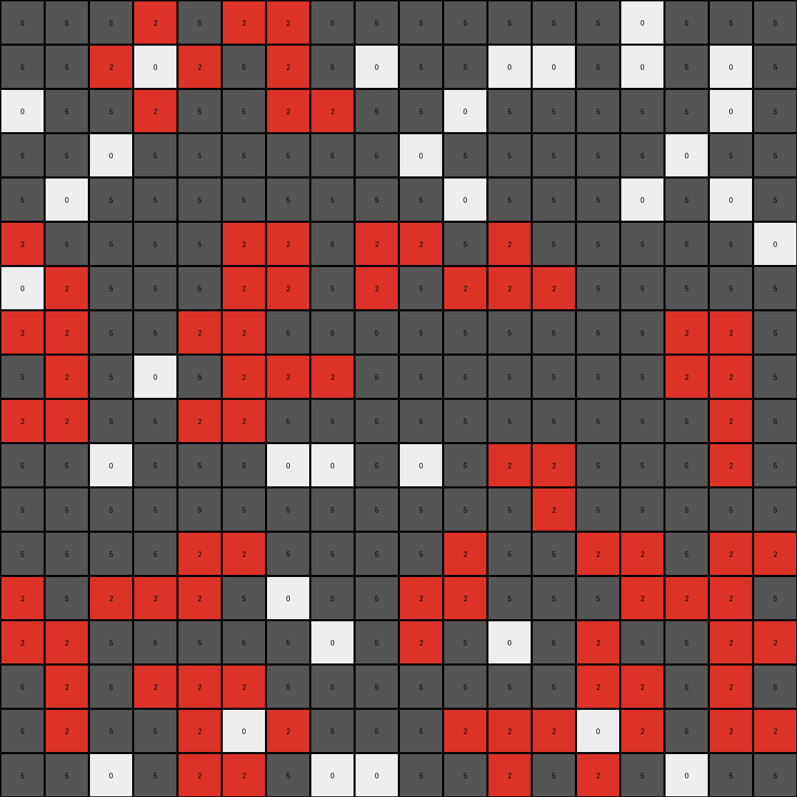
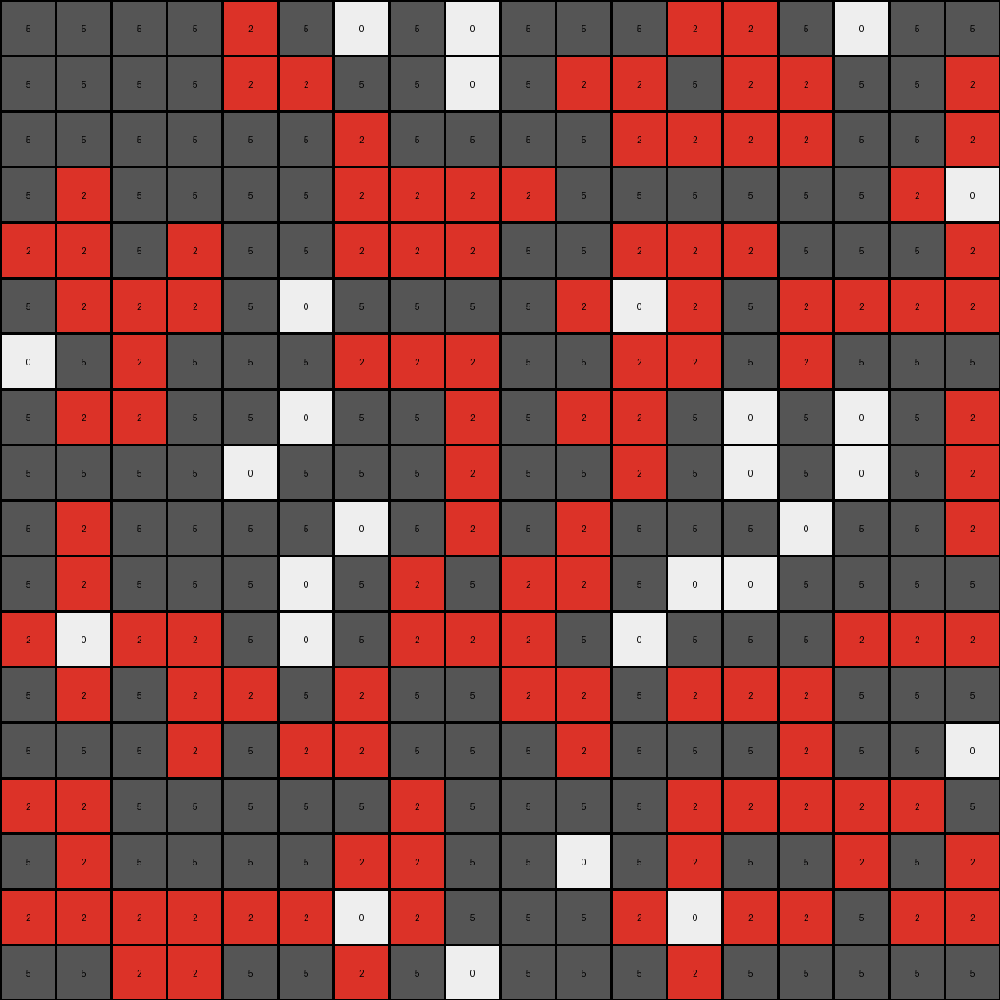
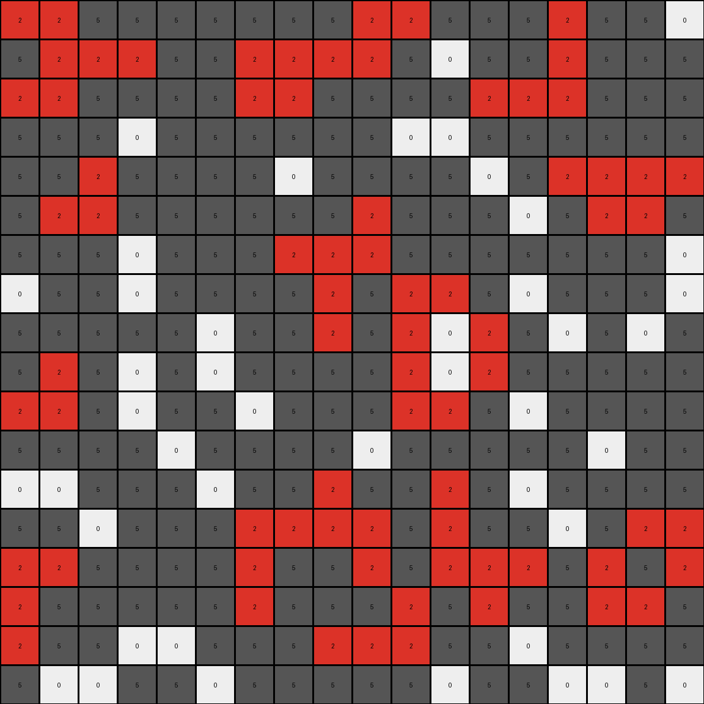

# a8d7556c • 017 • refine_dreamer

---


Previous Code:
```python
"""
Identify all connected regions of white (0) pixels.
For each white region with more than two pixels:
    Change white pixels to red (2) if they are directly adjacent (up, down, left, or right, *not diagonal*) to a gray (5) pixel.
Leave all other pixels unchanged.
"""

import numpy as np
from scipy import ndimage

def get_white_regions(grid):
    """
    Finds and returns a list of connected white regions in the grid.
    """
    white_pixels = (grid == 0)
    labeled_grid, num_labels = ndimage.label(white_pixels)
    regions = []
    for i in range(1, num_labels + 1):
        region = np.where(labeled_grid == i)
        regions.append(list(zip(region[0], region[1])))
    return regions

def is_adjacent_to_gray(grid, r, c):
    """
    Checks if a pixel at (r, c) is adjacent to a gray (5) pixel.
    """
    rows, cols = grid.shape
    for dr, dc in [(0, 1), (0, -1), (1, 0), (-1, 0)]:
        nr, nc = r + dr, c + dc
        if 0 <= nr < rows and 0 <= nc < cols and grid[nr, nc] == 5:
            return True
    return False

def transform(input_grid):
    """
    Transforms the input grid by selectively changing white pixels to red based on adjacency to gray pixels.
    """
    output_grid = np.copy(input_grid)
    rows, cols = output_grid.shape

    # Get connected white regions
    white_regions = get_white_regions(output_grid)

    # Change white pixels to red if adjacent to gray
    for region in white_regions:
        if len(region) > 2:
            for r, c in region:
                if is_adjacent_to_gray(output_grid, r, c):
                    output_grid[r, c] = 2

    return output_grid
```

Train Set Results:

## Example 1:

Input:
```
5 5 5 0 5 0 0 5 5 5 5 5 5 5 0 5 5 5
5 5 0 0 0 5 0 5 0 5 5 0 0 5 0 5 0 5
0 5 5 0 5 5 0 0 5 5 0 5 5 5 5 5 0 5
5 5 0 5 5 5 5 5 5 0 5 5 5 5 5 0 5 5
5 0 5 5 5 5 5 5 5 5 0 5 5 5 0 5 0 5
0 5 5 5 5 0 0 5 0 0 5 0 5 5 5 5 5 0
0 0 5 5 5 0 0 5 0 5 0 0 0 5 5 5 5 5
0 0 5 5 0 0 5 5 5 5 5 5 5 5 5 0 0 5
5 0 5 0 5 0 0 0 5 5 5 5 5 5 5 0 0 5
0 0 5 5 0 0 5 5 5 5 5 5 5 5 5 5 0 5
5 5 0 5 5 5 0 0 5 0 5 0 0 5 5 5 0 5
5 5 5 5 5 5 5 5 5 5 5 5 0 5 5 5 5 5
5 5 5 5 0 0 5 5 5 5 0 5 5 0 0 5 0 0
0 5 0 0 0 5 0 5 5 0 0 5 5 5 0 0 0 5
0 0 5 5 5 5 5 0 5 0 5 0 5 0 5 5 0 0
5 0 5 0 0 0 5 5 5 5 5 5 5 0 0 5 0 5
5 0 5 5 0 0 0 5 5 5 0 0 0 0 0 5 0 0
5 5 0 5 0 0 5 0 0 5 5 0 5 0 5 0 5 5
```
Expected Output:
```
5 5 5 0 5 0 0 5 5 5 5 5 5 5 0 5 5 5
5 5 0 0 0 5 0 5 0 5 5 0 0 5 0 5 0 5
0 5 5 0 5 5 0 0 5 5 0 5 5 5 5 5 0 5
5 5 0 5 5 5 5 5 5 0 5 5 5 5 5 0 5 5
5 0 5 5 5 5 5 5 5 5 0 5 5 5 0 5 0 5
0 5 5 5 5 2 2 5 0 0 5 0 5 5 5 5 5 0
2 2 5 5 5 2 2 5 0 5 0 0 0 5 5 5 5 5
2 2 5 5 0 0 5 5 5 5 5 5 5 5 5 2 2 5
5 0 5 0 5 0 0 0 5 5 5 5 5 5 5 2 2 5
0 0 5 5 0 0 5 5 5 5 5 5 5 5 5 5 0 5
5 5 0 5 5 5 0 0 5 0 5 0 0 5 5 5 0 5
5 5 5 5 5 5 5 5 5 5 5 5 0 5 5 5 5 5
5 5 5 5 0 0 5 5 5 5 0 5 5 0 0 5 0 0
0 5 0 0 0 5 0 5 5 0 0 5 5 5 0 0 0 5
0 0 5 5 5 5 5 0 5 0 5 0 5 0 5 5 0 0
5 0 5 0 2 2 5 5 5 5 5 5 5 2 2 5 0 5
5 0 5 5 2 2 0 5 5 5 0 0 0 2 2 5 0 0
5 5 0 5 2 2 5 0 0 5 5 0 5 0 5 0 5 5
```
Transformed Output:
```
5 5 5 2 5 2 2 5 5 5 5 5 5 5 0 5 5 5
5 5 2 0 2 5 2 5 0 5 5 0 0 5 0 5 0 5
0 5 5 2 5 5 2 2 5 5 0 5 5 5 5 5 0 5
5 5 0 5 5 5 5 5 5 0 5 5 5 5 5 0 5 5
5 0 5 5 5 5 5 5 5 5 0 5 5 5 0 5 0 5
2 5 5 5 5 2 2 5 2 2 5 2 5 5 5 5 5 0
0 2 5 5 5 2 2 5 2 5 2 2 2 5 5 5 5 5
2 2 5 5 2 2 5 5 5 5 5 5 5 5 5 2 2 5
5 2 5 0 5 2 2 2 5 5 5 5 5 5 5 2 2 5
2 2 5 5 2 2 5 5 5 5 5 5 5 5 5 5 2 5
5 5 0 5 5 5 0 0 5 0 5 2 2 5 5 5 2 5
5 5 5 5 5 5 5 5 5 5 5 5 2 5 5 5 5 5
5 5 5 5 2 2 5 5 5 5 2 5 5 2 2 5 2 2
2 5 2 2 2 5 0 5 5 2 2 5 5 5 2 2 2 5
2 2 5 5 5 5 5 0 5 2 5 0 5 2 5 5 2 2
5 2 5 2 2 2 5 5 5 5 5 5 5 2 2 5 2 5
5 2 5 5 2 0 2 5 5 5 2 2 2 0 2 5 2 2
5 5 0 5 2 2 5 0 0 5 5 2 5 2 5 0 5 5
```

match: False
pixels_off: 69
size_correct: True
color_palette_correct: True
correct_pixel_counts: False

## Example 2:

Input:
```
5 5 5 5 0 5 0 5 0 5 5 5 0 0 5 0 5 5
5 5 5 5 0 0 5 5 0 5 0 0 5 0 0 5 5 0
5 5 5 5 5 5 0 5 5 5 5 0 0 0 0 5 5 0
5 0 5 5 5 5 0 0 0 0 5 5 5 5 5 5 0 0
0 0 5 0 5 5 0 0 0 5 5 0 0 0 5 5 5 0
5 0 0 0 5 0 5 5 5 5 0 0 0 5 0 0 0 0
0 5 0 5 5 5 0 0 0 5 5 0 0 5 0 5 5 5
5 0 0 5 5 0 5 5 0 5 0 0 5 0 5 0 5 0
5 5 5 5 0 5 5 5 0 5 5 0 5 0 5 0 5 0
5 0 5 5 5 5 0 5 0 5 0 5 5 5 0 5 5 0
5 0 5 5 5 0 5 0 5 0 0 5 0 0 5 5 5 5
0 0 0 0 5 0 5 0 0 0 5 0 5 5 5 0 0 0
5 0 5 0 0 5 0 5 5 0 0 5 0 0 0 5 5 5
5 5 5 0 5 0 0 5 5 5 0 5 5 5 0 5 5 0
0 0 5 5 5 5 5 0 5 5 5 5 0 0 0 0 0 5
5 0 5 5 5 5 0 0 5 5 0 5 0 5 5 0 5 0
0 0 0 0 0 0 0 0 5 5 5 0 0 0 0 5 0 0
5 5 0 0 5 5 0 5 0 5 5 5 0 5 5 5 5 5
```
Expected Output:
```
5 5 5 5 0 5 0 5 0 5 5 5 0 0 5 0 5 5
5 5 5 5 0 0 5 5 0 5 0 0 5 2 2 5 5 0
5 5 5 5 5 5 0 5 5 5 5 0 0 2 2 5 5 0
5 0 5 5 5 5 2 2 2 0 5 5 5 5 5 5 0 0
0 0 5 0 5 5 2 2 2 5 5 2 2 0 5 5 5 0
5 0 0 0 5 0 5 5 5 5 0 2 2 5 0 0 0 0
0 5 0 5 5 5 0 0 0 5 5 2 2 5 0 5 5 5
5 0 0 5 5 0 5 5 0 5 0 0 5 0 5 0 5 0
5 5 5 5 0 5 5 5 0 5 5 0 5 0 5 0 5 0
5 0 5 5 5 5 0 5 0 5 0 5 5 5 0 5 5 0
5 0 5 5 5 0 5 0 5 0 0 5 0 0 5 5 5 5
0 0 0 0 5 0 5 0 0 0 5 0 5 5 5 0 0 0
5 0 5 0 0 5 0 5 5 0 0 5 0 0 0 5 5 5
5 5 5 0 5 0 0 5 5 5 0 5 5 5 0 5 5 0
0 0 5 5 5 5 5 0 5 5 5 5 0 0 0 0 0 5
5 0 5 5 5 5 2 2 5 5 0 5 0 5 5 0 5 0
0 0 2 2 0 0 2 2 5 5 5 0 0 0 0 5 0 0
5 5 2 2 5 5 0 5 0 5 5 5 0 5 5 5 5 5
```
Transformed Output:
```
5 5 5 5 2 5 0 5 0 5 5 5 2 2 5 0 5 5
5 5 5 5 2 2 5 5 0 5 2 2 5 2 2 5 5 2
5 5 5 5 5 5 2 5 5 5 5 2 2 2 2 5 5 2
5 2 5 5 5 5 2 2 2 2 5 5 5 5 5 5 2 0
2 2 5 2 5 5 2 2 2 5 5 2 2 2 5 5 5 2
5 2 2 2 5 0 5 5 5 5 2 0 2 5 2 2 2 2
0 5 2 5 5 5 2 2 2 5 5 2 2 5 2 5 5 5
5 2 2 5 5 0 5 5 2 5 2 2 5 0 5 0 5 2
5 5 5 5 0 5 5 5 2 5 5 2 5 0 5 0 5 2
5 2 5 5 5 5 0 5 2 5 2 5 5 5 0 5 5 2
5 2 5 5 5 0 5 2 5 2 2 5 0 0 5 5 5 5
2 0 2 2 5 0 5 2 2 2 5 0 5 5 5 2 2 2
5 2 5 2 2 5 2 5 5 2 2 5 2 2 2 5 5 5
5 5 5 2 5 2 2 5 5 5 2 5 5 5 2 5 5 0
2 2 5 5 5 5 5 2 5 5 5 5 2 2 2 2 2 5
5 2 5 5 5 5 2 2 5 5 0 5 2 5 5 2 5 2
2 2 2 2 2 2 0 2 5 5 5 2 0 2 2 5 2 2
5 5 2 2 5 5 2 5 0 5 5 5 2 5 5 5 5 5
```

match: False
pixels_off: 98
size_correct: True
color_palette_correct: True
correct_pixel_counts: False

## Example 3:

Input:
```
0 0 5 5 5 5 5 5 5 0 0 5 5 5 0 5 5 0
5 0 0 0 5 5 0 0 0 0 5 0 5 5 0 5 5 5
0 0 5 5 5 5 0 0 5 5 5 5 0 0 0 5 5 5
5 5 5 0 5 5 5 5 5 5 0 0 5 5 5 5 5 5
5 5 0 5 5 5 5 0 5 5 5 5 0 5 0 0 0 0
5 0 0 5 5 5 5 5 5 0 5 5 5 0 5 0 0 5
5 5 5 0 5 5 5 0 0 0 5 5 5 5 5 5 5 0
0 5 5 0 5 5 5 5 0 5 0 0 5 0 5 5 5 0
5 5 5 5 5 0 5 5 0 5 0 0 0 5 0 5 0 5
5 0 5 0 5 0 5 5 5 5 0 0 0 5 5 5 5 5
0 0 5 0 5 5 0 5 5 5 0 0 5 0 5 5 5 5
5 5 5 5 0 5 5 5 5 0 5 5 5 5 5 0 5 5
0 0 5 5 5 0 5 5 0 5 5 0 5 0 5 5 5 5
5 5 0 5 5 5 0 0 0 0 5 0 5 5 0 5 0 0
0 0 5 5 5 5 0 5 5 0 5 0 0 0 5 0 5 0
0 5 5 5 5 5 0 5 5 5 0 5 0 5 5 0 0 5
0 5 5 0 0 5 5 5 0 0 0 5 5 0 5 5 5 5
5 0 0 5 5 0 5 5 5 5 5 0 5 5 0 0 5 0
```
Expected Output:
```
0 0 5 5 5 5 5 5 5 0 0 5 5 5 0 5 5 0
5 0 0 0 5 5 2 2 0 0 5 0 5 5 0 5 5 5
0 0 5 5 5 5 2 2 5 5 5 5 0 0 0 5 5 5
5 5 5 0 5 5 5 5 5 5 0 0 5 5 5 5 5 5
5 5 0 5 5 5 5 0 5 5 5 5 0 5 0 2 2 0
5 0 0 5 5 5 5 5 5 0 5 5 5 0 5 2 2 5
5 5 5 0 5 5 5 0 0 0 5 5 5 5 5 5 5 0
0 5 5 0 5 5 5 5 0 5 2 2 5 0 5 5 5 0
5 5 5 5 5 0 5 5 0 5 2 2 0 5 0 5 0 5
5 0 5 0 5 0 5 5 5 5 2 2 0 5 5 5 5 5
0 0 5 0 5 5 0 5 5 5 2 2 5 0 5 5 5 5
5 5 5 5 0 5 5 5 5 0 5 5 5 5 5 0 5 5
0 0 5 5 5 0 5 5 0 5 5 0 5 0 5 5 5 5
5 5 0 5 5 5 0 0 0 0 5 0 5 5 0 5 0 0
0 0 5 5 5 5 0 5 5 0 5 0 0 0 5 0 5 0
0 5 5 5 5 5 0 5 5 5 0 5 0 5 5 0 0 5
0 5 5 0 0 5 5 5 0 0 0 5 5 0 5 5 5 5
5 0 0 5 5 0 5 5 5 5 5 0 5 5 0 0 5 0
```
Transformed Output:
```
2 2 5 5 5 5 5 5 5 2 2 5 5 5 2 5 5 0
5 2 2 2 5 5 2 2 2 2 5 0 5 5 2 5 5 5
2 2 5 5 5 5 2 2 5 5 5 5 2 2 2 5 5 5
5 5 5 0 5 5 5 5 5 5 0 0 5 5 5 5 5 5
5 5 2 5 5 5 5 0 5 5 5 5 0 5 2 2 2 2
5 2 2 5 5 5 5 5 5 2 5 5 5 0 5 2 2 5
5 5 5 0 5 5 5 2 2 2 5 5 5 5 5 5 5 0
0 5 5 0 5 5 5 5 2 5 2 2 5 0 5 5 5 0
5 5 5 5 5 0 5 5 2 5 2 0 2 5 0 5 0 5
5 2 5 0 5 0 5 5 5 5 2 0 2 5 5 5 5 5
2 2 5 0 5 5 0 5 5 5 2 2 5 0 5 5 5 5
5 5 5 5 0 5 5 5 5 0 5 5 5 5 5 0 5 5
0 0 5 5 5 0 5 5 2 5 5 2 5 0 5 5 5 5
5 5 0 5 5 5 2 2 2 2 5 2 5 5 0 5 2 2
2 2 5 5 5 5 2 5 5 2 5 2 2 2 5 2 5 2
2 5 5 5 5 5 2 5 5 5 2 5 2 5 5 2 2 5
2 5 5 0 0 5 5 5 2 2 2 5 5 0 5 5 5 5
5 0 0 5 5 0 5 5 5 5 5 0 5 5 0 0 5 0
```

match: False
pixels_off: 62
size_correct: True
color_palette_correct: True
correct_pixel_counts: False

**INSTRUCTIONS**

The code above was generated based on observations from the first training
example

we have tested the transform function on each of the task example inputs and
compared with the expected output

review each of the examples provided and the results and consider how the
natural language program should be updated to accommodate this new knowledge

respond with the following deliverables:

- general assessment of the information provided and strategy for resolving the
  errors
- gather metrics about each of the examples and results - use code_execution to
  develop accurate reports on your assumptions
- a YAML block documenting facts - Focus on identifying objects, their properties, and the actions performed on them.
- a natural language program - Be as clear and concise as possible, providing a complete description of the transformation rule.


your responses should be considered as information in a report - not a
conversation
