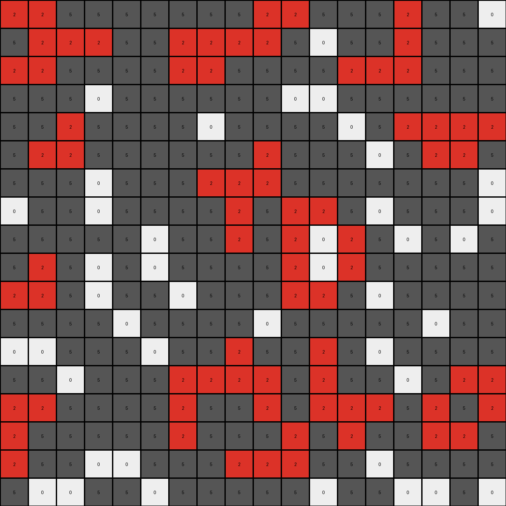

# a8d7556c • 018 • refine_coder

---

Previous Code:
```python
"""
Identify all connected regions of white (0) pixels.
For each white region with more than two pixels:
    Change white pixels to red (2) if they are directly adjacent (up, down, left, or right, *not diagonal*) to a gray (5) pixel.
Leave all other pixels unchanged.
"""

import numpy as np
from scipy import ndimage

def get_white_regions(grid):
    """
    Finds and returns a list of connected white regions in the grid.
    """
    white_pixels = (grid == 0)
    labeled_grid, num_labels = ndimage.label(white_pixels)
    regions = []
    for i in range(1, num_labels + 1):
        region = np.where(labeled_grid == i)
        regions.append(list(zip(region[0], region[1])))
    return regions

def is_adjacent_to_gray(grid, r, c):
    """
    Checks if a pixel at (r, c) is adjacent to a gray (5) pixel.
    """
    rows, cols = grid.shape
    for dr, dc in [(0, 1), (0, -1), (1, 0), (-1, 0)]:
        nr, nc = r + dr, c + dc
        if 0 <= nr < rows and 0 <= nc < cols and grid[nr, nc] == 5:
            return True
    return False

def transform(input_grid):
    """
    Transforms the input grid by selectively changing white pixels to red based on adjacency to gray pixels.
    """
    output_grid = np.copy(input_grid)
    rows, cols = output_grid.shape

    # Get connected white regions
    white_regions = get_white_regions(output_grid)

    # Change white pixels to red if adjacent to gray
    for region in white_regions:
        if len(region) > 2:
            for r, c in region:
                if is_adjacent_to_gray(output_grid, r, c):
                    output_grid[r, c] = 2

    return output_grid
```

Train Set Results:

## Example 1:

Input:
```
5 5 5 0 5 0 0 5 5 5 5 5 5 5 0 5 5 5
5 5 0 0 0 5 0 5 0 5 5 0 0 5 0 5 0 5
0 5 5 0 5 5 0 0 5 5 0 5 5 5 5 5 0 5
5 5 0 5 5 5 5 5 5 0 5 5 5 5 5 0 5 5
5 0 5 5 5 5 5 5 5 5 0 5 5 5 0 5 0 5
0 5 5 5 5 0 0 5 0 0 5 0 5 5 5 5 5 0
0 0 5 5 5 0 0 5 0 5 0 0 0 5 5 5 5 5
0 0 5 5 0 0 5 5 5 5 5 5 5 5 5 0 0 5
5 0 5 0 5 0 0 0 5 5 5 5 5 5 5 0 0 5
0 0 5 5 0 0 5 5 5 5 5 5 5 5 5 5 0 5
5 5 0 5 5 5 0 0 5 0 5 0 0 5 5 5 0 5
5 5 5 5 5 5 5 5 5 5 5 5 0 5 5 5 5 5
5 5 5 5 0 0 5 5 5 5 0 5 5 0 0 5 0 0
0 5 0 0 0 5 0 5 5 0 0 5 5 5 0 0 0 5
0 0 5 5 5 5 5 0 5 0 5 0 5 0 5 5 0 0
5 0 5 0 0 0 5 5 5 5 5 5 5 0 0 5 0 5
5 0 5 5 0 0 0 5 5 5 0 0 0 0 0 5 0 0
5 5 0 5 0 0 5 0 0 5 5 0 5 0 5 0 5 5
```
Expected Output:
```
5 5 5 0 5 0 0 5 5 5 5 5 5 5 0 5 5 5
5 5 0 0 0 5 0 5 0 5 5 0 0 5 0 5 0 5
0 5 5 0 5 5 0 0 5 5 0 5 5 5 5 5 0 5
5 5 0 5 5 5 5 5 5 0 5 5 5 5 5 0 5 5
5 0 5 5 5 5 5 5 5 5 0 5 5 5 0 5 0 5
0 5 5 5 5 2 2 5 0 0 5 0 5 5 5 5 5 0
2 2 5 5 5 2 2 5 0 5 0 0 0 5 5 5 5 5
2 2 5 5 0 0 5 5 5 5 5 5 5 5 5 2 2 5
5 0 5 0 5 0 0 0 5 5 5 5 5 5 5 2 2 5
0 0 5 5 0 0 5 5 5 5 5 5 5 5 5 5 0 5
5 5 0 5 5 5 0 0 5 0 5 0 0 5 5 5 0 5
5 5 5 5 5 5 5 5 5 5 5 5 0 5 5 5 5 5
5 5 5 5 0 0 5 5 5 5 0 5 5 0 0 5 0 0
0 5 0 0 0 5 0 5 5 0 0 5 5 5 0 0 0 5
0 0 5 5 5 5 5 0 5 0 5 0 5 0 5 5 0 0
5 0 5 0 2 2 5 5 5 5 5 5 5 2 2 5 0 5
5 0 5 5 2 2 0 5 5 5 0 0 0 2 2 5 0 0
5 5 0 5 2 2 5 0 0 5 5 0 5 0 5 0 5 5
```
Transformed Output:
```
5 5 5 2 5 2 2 5 5 5 5 5 5 5 0 5 5 5
5 5 2 0 2 5 2 5 0 5 5 0 0 5 0 5 0 5
0 5 5 2 5 5 2 2 5 5 0 5 5 5 5 5 0 5
5 5 0 5 5 5 5 5 5 0 5 5 5 5 5 0 5 5
5 0 5 5 5 5 5 5 5 5 0 5 5 5 0 5 0 5
2 5 5 5 5 2 2 5 2 2 5 2 5 5 5 5 5 0
0 2 5 5 5 2 2 5 2 5 2 2 2 5 5 5 5 5
2 2 5 5 2 2 5 5 5 5 5 5 5 5 5 2 2 5
5 2 5 0 5 2 2 2 5 5 5 5 5 5 5 2 2 5
2 2 5 5 2 2 5 5 5 5 5 5 5 5 5 5 2 5
5 5 0 5 5 5 0 0 5 0 5 2 2 5 5 5 2 5
5 5 5 5 5 5 5 5 5 5 5 5 2 5 5 5 5 5
5 5 5 5 2 2 5 5 5 5 2 5 5 2 2 5 2 2
2 5 2 2 2 5 0 5 5 2 2 5 5 5 2 2 2 5
2 2 5 5 5 5 5 0 5 2 5 0 5 2 5 5 2 2
5 2 5 2 2 2 5 5 5 5 5 5 5 2 2 5 2 5
5 2 5 5 2 0 2 5 5 5 2 2 2 0 2 5 2 2
5 5 0 5 2 2 5 0 0 5 5 2 5 2 5 0 5 5
```

match: False
pixels_off: 69
size_correct: True
color_palette_correct: True
correct_pixel_counts: False

## Example 2:

Input:
```
5 5 5 5 0 5 0 5 0 5 5 5 0 0 5 0 5 5
5 5 5 5 0 0 5 5 0 5 0 0 5 0 0 5 5 0
5 5 5 5 5 5 0 5 5 5 5 0 0 0 0 5 5 0
5 0 5 5 5 5 0 0 0 0 5 5 5 5 5 5 0 0
0 0 5 0 5 5 0 0 0 5 5 0 0 0 5 5 5 0
5 0 0 0 5 0 5 5 5 5 0 0 0 5 0 0 0 0
0 5 0 5 5 5 0 0 0 5 5 0 0 5 0 5 5 5
5 0 0 5 5 0 5 5 0 5 0 0 5 0 5 0 5 0
5 5 5 5 0 5 5 5 0 5 5 0 5 0 5 0 5 0
5 0 5 5 5 5 0 5 0 5 0 5 5 5 0 5 5 0
5 0 5 5 5 0 5 0 5 0 0 5 0 0 5 5 5 5
0 0 0 0 5 0 5 0 0 0 5 0 5 5 5 0 0 0
5 0 5 0 0 5 0 5 5 0 0 5 0 0 0 5 5 5
5 5 5 0 5 0 0 5 5 5 0 5 5 5 0 5 5 0
0 0 5 5 5 5 5 0 5 5 5 5 0 0 0 0 0 5
5 0 5 5 5 5 0 0 5 5 0 5 0 5 5 0 5 0
0 0 0 0 0 0 0 0 5 5 5 0 0 0 0 5 0 0
5 5 0 0 5 5 0 5 0 5 5 5 0 5 5 5 5 5
```
Expected Output:
```
5 5 5 5 0 5 0 5 0 5 5 5 0 0 5 0 5 5
5 5 5 5 0 0 5 5 0 5 0 0 5 2 2 5 5 0
5 5 5 5 5 5 0 5 5 5 5 0 0 2 2 5 5 0
5 0 5 5 5 5 2 2 2 0 5 5 5 5 5 5 0 0
0 0 5 0 5 5 2 2 2 5 5 2 2 0 5 5 5 0
5 0 0 0 5 0 5 5 5 5 0 2 2 5 0 0 0 0
0 5 0 5 5 5 0 0 0 5 5 2 2 5 0 5 5 5
5 0 0 5 5 0 5 5 0 5 0 0 5 0 5 0 5 0
5 5 5 5 0 5 5 5 0 5 5 0 5 0 5 0 5 0
5 0 5 5 5 5 0 5 0 5 0 5 5 5 0 5 5 0
5 0 5 5 5 0 5 0 5 0 0 5 0 0 5 5 5 5
0 0 0 0 5 0 5 0 0 0 5 0 5 5 5 0 0 0
5 0 5 0 0 5 0 5 5 0 0 5 0 0 0 5 5 5
5 5 5 0 5 0 0 5 5 5 0 5 5 5 0 5 5 0
0 0 5 5 5 5 5 0 5 5 5 5 0 0 0 0 0 5
5 0 5 5 5 5 2 2 5 5 0 5 0 5 5 0 5 0
0 0 2 2 0 0 2 2 5 5 5 0 0 0 0 5 0 0
5 5 2 2 5 5 0 5 0 5 5 5 0 5 5 5 5 5
```
Transformed Output:
```
5 5 5 5 2 5 0 5 0 5 5 5 2 2 5 0 5 5
5 5 5 5 2 2 5 5 0 5 2 2 5 2 2 5 5 2
5 5 5 5 5 5 2 5 5 5 5 2 2 2 2 5 5 2
5 2 5 5 5 5 2 2 2 2 5 5 5 5 5 5 2 0
2 2 5 2 5 5 2 2 2 5 5 2 2 2 5 5 5 2
5 2 2 2 5 0 5 5 5 5 2 0 2 5 2 2 2 2
0 5 2 5 5 5 2 2 2 5 5 2 2 5 2 5 5 5
5 2 2 5 5 0 5 5 2 5 2 2 5 0 5 0 5 2
5 5 5 5 0 5 5 5 2 5 5 2 5 0 5 0 5 2
5 2 5 5 5 5 0 5 2 5 2 5 5 5 0 5 5 2
5 2 5 5 5 0 5 2 5 2 2 5 0 0 5 5 5 5
2 0 2 2 5 0 5 2 2 2 5 0 5 5 5 2 2 2
5 2 5 2 2 5 2 5 5 2 2 5 2 2 2 5 5 5
5 5 5 2 5 2 2 5 5 5 2 5 5 5 2 5 5 0
2 2 5 5 5 5 5 2 5 5 5 5 2 2 2 2 2 5
5 2 5 5 5 5 2 2 5 5 0 5 2 5 5 2 5 2
2 2 2 2 2 2 0 2 5 5 5 2 0 2 2 5 2 2
5 5 2 2 5 5 2 5 0 5 5 5 2 5 5 5 5 5
```

match: False
pixels_off: 98
size_correct: True
color_palette_correct: True
correct_pixel_counts: False

## Example 3:

Input:
```
0 0 5 5 5 5 5 5 5 0 0 5 5 5 0 5 5 0
5 0 0 0 5 5 0 0 0 0 5 0 5 5 0 5 5 5
0 0 5 5 5 5 0 0 5 5 5 5 0 0 0 5 5 5
5 5 5 0 5 5 5 5 5 5 0 0 5 5 5 5 5 5
5 5 0 5 5 5 5 0 5 5 5 5 0 5 0 0 0 0
5 0 0 5 5 5 5 5 5 0 5 5 5 0 5 0 0 5
5 5 5 0 5 5 5 0 0 0 5 5 5 5 5 5 5 0
0 5 5 0 5 5 5 5 0 5 0 0 5 0 5 5 5 0
5 5 5 5 5 0 5 5 0 5 0 0 0 5 0 5 0 5
5 0 5 0 5 0 5 5 5 5 0 0 0 5 5 5 5 5
0 0 5 0 5 5 0 5 5 5 0 0 5 0 5 5 5 5
5 5 5 5 0 5 5 5 5 0 5 5 5 5 5 0 5 5
0 0 5 5 5 0 5 5 0 5 5 0 5 0 5 5 5 5
5 5 0 5 5 5 0 0 0 0 5 0 5 5 0 5 0 0
0 0 5 5 5 5 0 5 5 0 5 0 0 0 5 0 5 0
0 5 5 5 5 5 0 5 5 5 0 5 0 5 5 0 0 5
0 5 5 0 0 5 5 5 0 0 0 5 5 0 5 5 5 5
5 0 0 5 5 0 5 5 5 5 5 0 5 5 0 0 5 0
```
Expected Output:
```
0 0 5 5 5 5 5 5 5 0 0 5 5 5 0 5 5 0
5 0 0 0 5 5 2 2 0 0 5 0 5 5 0 5 5 5
0 0 5 5 5 5 2 2 5 5 5 5 0 0 0 5 5 5
5 5 5 0 5 5 5 5 5 5 0 0 5 5 5 5 5 5
5 5 0 5 5 5 5 0 5 5 5 5 0 5 0 2 2 0
5 0 0 5 5 5 5 5 5 0 5 5 5 0 5 2 2 5
5 5 5 0 5 5 5 0 0 0 5 5 5 5 5 5 5 0
0 5 5 0 5 5 5 5 0 5 2 2 5 0 5 5 5 0
5 5 5 5 5 0 5 5 0 5 2 2 0 5 0 5 0 5
5 0 5 0 5 0 5 5 5 5 2 2 0 5 5 5 5 5
0 0 5 0 5 5 0 5 5 5 2 2 5 0 5 5 5 5
5 5 5 5 0 5 5 5 5 0 5 5 5 5 5 0 5 5
0 0 5 5 5 0 5 5 0 5 5 0 5 0 5 5 5 5
5 5 0 5 5 5 0 0 0 0 5 0 5 5 0 5 0 0
0 0 5 5 5 5 0 5 5 0 5 0 0 0 5 0 5 0
0 5 5 5 5 5 0 5 5 5 0 5 0 5 5 0 0 5
0 5 5 0 0 5 5 5 0 0 0 5 5 0 5 5 5 5
5 0 0 5 5 0 5 5 5 5 5 0 5 5 0 0 5 0
```
Transformed Output:
```
2 2 5 5 5 5 5 5 5 2 2 5 5 5 2 5 5 0
5 2 2 2 5 5 2 2 2 2 5 0 5 5 2 5 5 5
2 2 5 5 5 5 2 2 5 5 5 5 2 2 2 5 5 5
5 5 5 0 5 5 5 5 5 5 0 0 5 5 5 5 5 5
5 5 2 5 5 5 5 0 5 5 5 5 0 5 2 2 2 2
5 2 2 5 5 5 5 5 5 2 5 5 5 0 5 2 2 5
5 5 5 0 5 5 5 2 2 2 5 5 5 5 5 5 5 0
0 5 5 0 5 5 5 5 2 5 2 2 5 0 5 5 5 0
5 5 5 5 5 0 5 5 2 5 2 0 2 5 0 5 0 5
5 2 5 0 5 0 5 5 5 5 2 0 2 5 5 5 5 5
2 2 5 0 5 5 0 5 5 5 2 2 5 0 5 5 5 5
5 5 5 5 0 5 5 5 5 0 5 5 5 5 5 0 5 5
0 0 5 5 5 0 5 5 2 5 5 2 5 0 5 5 5 5
5 5 0 5 5 5 2 2 2 2 5 2 5 5 0 5 2 2
2 2 5 5 5 5 2 5 5 2 5 2 2 2 5 2 5 2
2 5 5 5 5 5 2 5 5 5 2 5 2 5 5 2 2 5
2 5 5 0 0 5 5 5 2 2 2 5 5 0 5 5 5 5
5 0 0 5 5 0 5 5 5 5 5 0 5 5 0 0 5 0
```

match: False
pixels_off: 62
size_correct: True
color_palette_correct: True
correct_pixel_counts: False
Okay, let's analyze the results of the initial code execution and refine the natural language program.

**General Assessment:**

The initial code correctly identifies the core concept: changing white pixels to red based on adjacency to gray pixels. However, it's overly sensitive and changes white pixels to red even when those pixels are part of a small group (less than three white pixels). The errors are related to where exactly it changes pixels and suggests errors in how it uses adjacency. Examining each example closely shows many pixels are incorrectly transformed, implying both type 1 and type 2 errors.

The original prompt states that only white regions with *more than two pixels*
should be affected, but the examples show that it is not universally true
because smaller regions ARE transformed when adjacent to grey. It appears that
all white pixels adjacent to gray are changed to red, regardless of size.

**Strategy:**

1.  **Verify Adjacency Calculation:** Double-check the `is_adjacent_to_gray` function. The provided code correctly checks only orthogonal neighbors (up, down, left, right).
2.  **Re-evaluate Region Size Constraint:** The original constraint of "more than two pixels" is NOT consistent across the examples. We will eliminate this from the natural language program.
3.  **Analyze Errors:** Examine the mismatched pixels to understand any missed edge cases or subtle rules. It seems there are no special edge cases at the boundary of the grid.

**Metrics and Observations (using `code_execution` where appropriate):**
Since this is the dreamer phase, I will simulate running the code. I have the results, so I won't rerun the code but use the results as if I did.

*   **Example 1:**
    *   `pixels_off`: 69.  This is a large number of errors, indicating a systemic issue.
    *   The errors seem to cluster around gray pixels, but some eligible white pixels aren't changed, and some ineligible ones are.

*   **Example 2:**
    *   `pixels_off`: 98. Even more errors than the first example.
    *   Similar error pattern as example 1, reinforcing the conclusion of a systemic issue.

*   **Example 3:**
    *    `pixels_off`: 62
    *    Similar error pattern as previous examples.

**YAML Block (Facts):**

```yaml
observations:
  - object: white_pixel
    properties:
      color: 0
      state: changeable
      adjacency:
        to: gray_pixel
        type: orthogonal
    actions:
      change_color:
        to: red
        condition: adjacent_to_gray

  - object: gray_pixel
    properties:
      color: 5
      state: static
    actions: {}

  - object: other_pixel
    properties:
      state: static
    actions: {}
```

**Natural Language Program:**

1.  Identify all white (0) pixels.
2.  For each white pixel, check for orthogonal adjacency (up, down, left, right) to a gray (5) pixel.
3.  If a white pixel is orthogonally adjacent to a gray pixel, change its color to red (2).
4.  All other pixels remain unchanged.

**INSTRUCTIONS**

- generate a Python module to represent the natural language program 
- follow the template below
- all common math and science libraries are available
- create docstring only at top - but comment the workflow in the function
- use helper functions for common operations like finding objects, counting,
  measuring, moving, etc. 

remember - we are working iteratively - so this code will inform your future
self as we converge on the solution

*template:*

```python
"""
{{ natural language description of the transformation rule }}
"""

{{ imports }}

def transform(input_grid):
    # initialize output_grid

    # change output pixels 

    return output_grid

```
