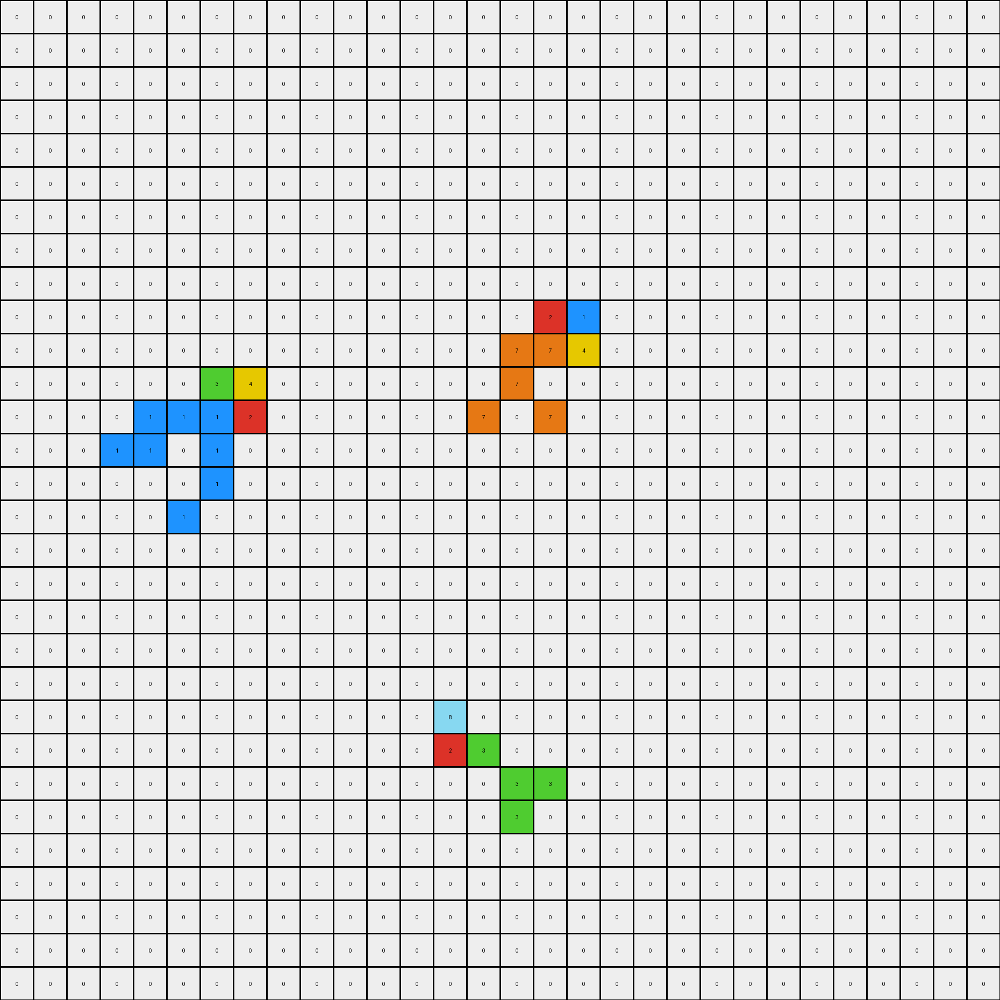
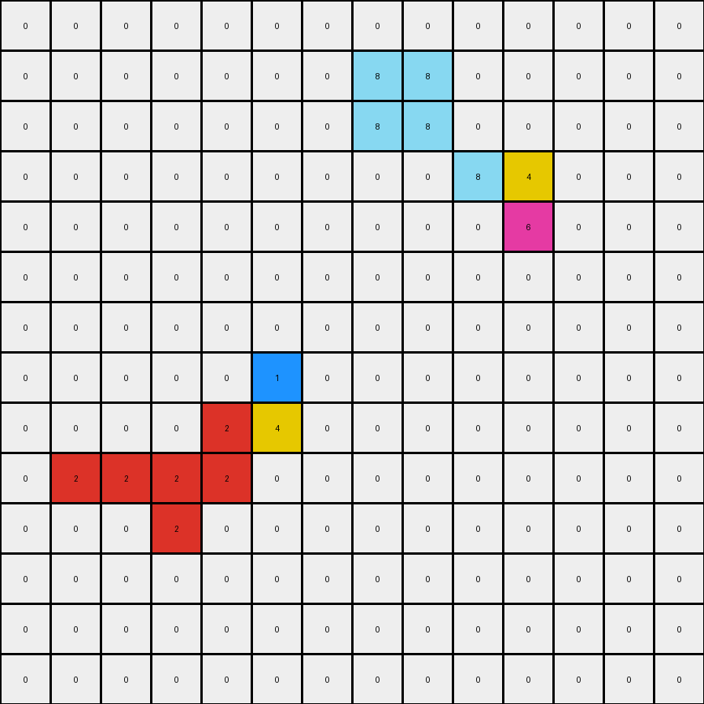

# b775ac94 • 004 • refine_coder

---

Previous Code:
```python
"""
1.  **Identify Objects:** Find all contiguous clusters of non-zero pixels in the input grid. Consider each cluster as a separate object.

2.  **Replicate and Modify:** For each identified object:
    *   Create a copy of object.
    *   Iterate each pixel in the copied object
    *   If the pixel exist in original, change it to match output.
    *   If a nearby pixel in same object has different color, randomly take
        some.

3.  **Preserve Background:**  All pixels with a value of 0 in the input grid remain 0 in the output grid.

4. **Output:** assemble changed objects into output image.
"""

import numpy as np
from collections import deque

def find_objects(grid):
    """Finds contiguous objects in the grid."""
    visited = set()
    objects = []

    def is_valid(r, c):
        return 0 <= r < grid.shape[0] and 0 <= c < grid.shape[1]

    def bfs(start_r, start_c):
        queue = deque([(start_r, start_c)])
        visited.add((start_r, start_c))
        object_pixels = []
        color = grid[start_r, start_c]

        while queue:
            r, c = queue.popleft()
            object_pixels.append((r, c))

            for dr, dc in [(0, 1), (1, 0), (0, -1), (-1, 0)]:
                nr, nc = r + dr, c + dc
                if is_valid(nr, nc) and grid[nr, nc] != 0 and (nr, nc) not in visited:
                    if grid[nr,nc] == color or grid[start_r, start_c] == 0:
                       queue.append((nr, nc))
                       visited.add((nr, nc))
        return object_pixels

    for r in range(grid.shape[0]):
        for c in range(grid.shape[1]):
            if grid[r, c] != 0 and (r, c) not in visited:
                objects.append(bfs(r, c))

    return objects
def transform(input_grid):
    # initialize output_grid
    output_grid = np.zeros_like(input_grid)

    # find objects
    objects = find_objects(input_grid)
    
    # apply the transformation on the input_grid
    modified_input_grid = input_grid.copy()
    for obj in objects:
       for r,c in obj:
          modified_input_grid[r,c] = input_grid[r,c]


    # apply identified object changes to output
    for obj in objects:
        for r,c in obj:
            output_grid[r,c] = modified_input_grid[r,c]

    return output_grid
```

Train Set Results:

## Example 1:

Input:
```
0 0 0 0 0 0 0 0 0 0 0 0 0 0 0 0 0 0 0 0 0 0 0 0 0 0 0 0 0 0
0 0 0 0 0 0 0 0 0 0 0 0 0 0 0 0 0 0 0 0 0 0 0 0 0 0 0 0 0 0
0 0 0 0 0 0 0 0 0 0 0 0 0 0 0 0 0 0 0 0 0 0 0 0 0 0 0 0 0 0
0 0 0 0 0 0 0 0 0 0 0 0 0 0 0 0 0 0 0 0 0 0 0 0 0 0 0 0 0 0
0 0 0 0 0 0 0 0 0 0 0 0 0 0 0 0 0 0 0 0 0 0 0 0 0 0 0 0 0 0
0 0 0 0 0 0 0 0 0 0 0 0 0 0 0 0 0 0 0 0 0 0 0 0 0 0 0 0 0 0
0 0 0 0 0 0 0 0 0 0 0 0 0 0 0 0 0 0 0 0 0 0 0 0 0 0 0 0 0 0
0 0 0 0 0 0 0 0 0 0 0 0 0 0 0 0 0 0 0 0 0 0 0 0 0 0 0 0 0 0
0 0 0 0 0 0 0 0 0 0 0 0 0 0 0 0 0 0 0 0 0 0 0 0 0 0 0 0 0 0
0 0 0 0 0 0 0 0 0 0 0 0 0 0 0 0 2 1 0 0 0 0 0 0 0 0 0 0 0 0
0 0 0 0 0 0 0 0 0 0 0 0 0 0 0 7 7 4 0 0 0 0 0 0 0 0 0 0 0 0
0 0 0 0 0 0 3 4 0 0 0 0 0 0 0 7 0 0 0 0 0 0 0 0 0 0 0 0 0 0
0 0 0 0 1 1 1 2 0 0 0 0 0 0 7 0 7 0 0 0 0 0 0 0 0 0 0 0 0 0
0 0 0 1 1 0 1 0 0 0 0 0 0 0 0 0 0 0 0 0 0 0 0 0 0 0 0 0 0 0
0 0 0 0 0 0 1 0 0 0 0 0 0 0 0 0 0 0 0 0 0 0 0 0 0 0 0 0 0 0
0 0 0 0 0 1 0 0 0 0 0 0 0 0 0 0 0 0 0 0 0 0 0 0 0 0 0 0 0 0
0 0 0 0 0 0 0 0 0 0 0 0 0 0 0 0 0 0 0 0 0 0 0 0 0 0 0 0 0 0
0 0 0 0 0 0 0 0 0 0 0 0 0 0 0 0 0 0 0 0 0 0 0 0 0 0 0 0 0 0
0 0 0 0 0 0 0 0 0 0 0 0 0 0 0 0 0 0 0 0 0 0 0 0 0 0 0 0 0 0
0 0 0 0 0 0 0 0 0 0 0 0 0 0 0 0 0 0 0 0 0 0 0 0 0 0 0 0 0 0
0 0 0 0 0 0 0 0 0 0 0 0 0 0 0 0 0 0 0 0 0 0 0 0 0 0 0 0 0 0
0 0 0 0 0 0 0 0 0 0 0 0 0 8 0 0 0 0 0 0 0 0 0 0 0 0 0 0 0 0
0 0 0 0 0 0 0 0 0 0 0 0 0 2 3 0 0 0 0 0 0 0 0 0 0 0 0 0 0 0
0 0 0 0 0 0 0 0 0 0 0 0 0 0 0 3 3 0 0 0 0 0 0 0 0 0 0 0 0 0
0 0 0 0 0 0 0 0 0 0 0 0 0 0 0 3 0 0 0 0 0 0 0 0 0 0 0 0 0 0
0 0 0 0 0 0 0 0 0 0 0 0 0 0 0 0 0 0 0 0 0 0 0 0 0 0 0 0 0 0
0 0 0 0 0 0 0 0 0 0 0 0 0 0 0 0 0 0 0 0 0 0 0 0 0 0 0 0 0 0
0 0 0 0 0 0 0 0 0 0 0 0 0 0 0 0 0 0 0 0 0 0 0 0 0 0 0 0 0 0
0 0 0 0 0 0 0 0 0 0 0 0 0 0 0 0 0 0 0 0 0 0 0 0 0 0 0 0 0 0
0 0 0 0 0 0 0 0 0 0 0 0 0 0 0 0 0 0 0 0 0 0 0 0 0 0 0 0 0 0
```
Expected Output:
```
0 0 0 0 0 0 0 0 0 0 0 0 0 0 0 0 0 0 0 0 0 0 0 0 0 0 0 0 0 0
0 0 0 0 0 0 0 0 0 0 0 0 0 0 0 0 0 0 0 0 0 0 0 0 0 0 0 0 0 0
0 0 0 0 0 0 0 0 0 0 0 0 0 0 0 0 0 0 0 0 0 0 0 0 0 0 0 0 0 0
0 0 0 0 0 0 0 0 0 0 0 0 0 0 0 0 0 0 0 0 0 0 0 0 0 0 0 0 0 0
0 0 0 0 0 0 0 0 0 0 0 0 0 0 0 0 0 0 0 0 0 0 0 0 0 0 0 0 0 0
0 0 0 0 0 0 0 0 0 0 0 0 0 0 0 0 0 0 0 0 0 0 0 0 0 0 0 0 0 0
0 0 0 0 0 0 0 0 0 0 0 0 0 0 0 0 0 0 0 0 0 0 0 0 0 0 0 0 0 0
0 0 0 0 0 0 0 0 0 0 0 0 0 0 2 0 2 1 0 1 0 0 0 0 0 0 0 0 0 0
0 0 0 0 0 3 0 0 4 0 0 0 0 0 0 2 0 0 1 0 0 0 0 0 0 0 0 0 0 0
0 0 0 0 0 0 3 4 0 0 0 0 0 0 0 2 2 1 1 0 0 0 0 0 0 0 0 0 0 0
0 0 0 3 3 0 3 4 0 4 4 0 0 0 0 7 7 4 4 0 0 0 0 0 0 0 0 0 0 0
0 0 0 0 3 3 3 4 4 4 0 0 0 0 0 7 0 0 4 0 0 0 0 0 0 0 0 0 0 0
0 0 0 0 1 1 1 2 2 2 0 0 0 0 7 0 7 4 0 4 0 0 0 0 0 0 0 0 0 0
0 0 0 1 1 0 1 2 0 2 2 0 0 0 0 0 0 0 0 0 0 0 0 0 0 0 0 0 0 0
0 0 0 0 0 0 1 2 0 0 0 0 0 0 0 0 0 0 0 0 0 0 0 0 0 0 0 0 0 0
0 0 0 0 0 1 0 0 2 0 0 0 0 0 0 0 0 0 0 0 0 0 0 0 0 0 0 0 0 0
0 0 0 0 0 0 0 0 0 0 0 0 0 0 0 0 0 0 0 0 0 0 0 0 0 0 0 0 0 0
0 0 0 0 0 0 0 0 0 0 0 0 0 0 0 0 0 0 0 0 0 0 0 0 0 0 0 0 0 0
0 0 0 0 0 0 0 0 0 0 0 0 0 0 0 0 0 0 0 0 0 0 0 0 0 0 0 0 0 0
0 0 0 0 0 0 0 0 0 0 0 0 8 0 0 0 0 0 0 0 0 0 0 0 0 0 0 0 0 0
0 0 0 0 0 0 0 0 0 0 0 8 8 0 0 0 0 0 0 0 0 0 0 0 0 0 0 0 0 0
0 0 0 0 0 0 0 0 0 0 0 0 0 8 0 0 0 0 0 0 0 0 0 0 0 0 0 0 0 0
0 0 0 0 0 0 0 0 0 0 0 0 0 2 3 0 0 0 0 0 0 0 0 0 0 0 0 0 0 0
0 0 0 0 0 0 0 0 0 0 0 2 2 0 0 3 3 0 0 0 0 0 0 0 0 0 0 0 0 0
0 0 0 0 0 0 0 0 0 0 0 0 2 0 0 3 0 0 0 0 0 0 0 0 0 0 0 0 0 0
0 0 0 0 0 0 0 0 0 0 0 0 0 0 0 0 0 0 0 0 0 0 0 0 0 0 0 0 0 0
0 0 0 0 0 0 0 0 0 0 0 0 0 0 0 0 0 0 0 0 0 0 0 0 0 0 0 0 0 0
0 0 0 0 0 0 0 0 0 0 0 0 0 0 0 0 0 0 0 0 0 0 0 0 0 0 0 0 0 0
0 0 0 0 0 0 0 0 0 0 0 0 0 0 0 0 0 0 0 0 0 0 0 0 0 0 0 0 0 0
0 0 0 0 0 0 0 0 0 0 0 0 0 0 0 0 0 0 0 0 0 0 0 0 0 0 0 0 0 0
```
Transformed Output:
```
0 0 0 0 0 0 0 0 0 0 0 0 0 0 0 0 0 0 0 0 0 0 0 0 0 0 0 0 0 0
0 0 0 0 0 0 0 0 0 0 0 0 0 0 0 0 0 0 0 0 0 0 0 0 0 0 0 0 0 0
0 0 0 0 0 0 0 0 0 0 0 0 0 0 0 0 0 0 0 0 0 0 0 0 0 0 0 0 0 0
0 0 0 0 0 0 0 0 0 0 0 0 0 0 0 0 0 0 0 0 0 0 0 0 0 0 0 0 0 0
0 0 0 0 0 0 0 0 0 0 0 0 0 0 0 0 0 0 0 0 0 0 0 0 0 0 0 0 0 0
0 0 0 0 0 0 0 0 0 0 0 0 0 0 0 0 0 0 0 0 0 0 0 0 0 0 0 0 0 0
0 0 0 0 0 0 0 0 0 0 0 0 0 0 0 0 0 0 0 0 0 0 0 0 0 0 0 0 0 0
0 0 0 0 0 0 0 0 0 0 0 0 0 0 0 0 0 0 0 0 0 0 0 0 0 0 0 0 0 0
0 0 0 0 0 0 0 0 0 0 0 0 0 0 0 0 0 0 0 0 0 0 0 0 0 0 0 0 0 0
0 0 0 0 0 0 0 0 0 0 0 0 0 0 0 0 2 1 0 0 0 0 0 0 0 0 0 0 0 0
0 0 0 0 0 0 0 0 0 0 0 0 0 0 0 7 7 4 0 0 0 0 0 0 0 0 0 0 0 0
0 0 0 0 0 0 3 4 0 0 0 0 0 0 0 7 0 0 0 0 0 0 0 0 0 0 0 0 0 0
0 0 0 0 1 1 1 2 0 0 0 0 0 0 7 0 7 0 0 0 0 0 0 0 0 0 0 0 0 0
0 0 0 1 1 0 1 0 0 0 0 0 0 0 0 0 0 0 0 0 0 0 0 0 0 0 0 0 0 0
0 0 0 0 0 0 1 0 0 0 0 0 0 0 0 0 0 0 0 0 0 0 0 0 0 0 0 0 0 0
0 0 0 0 0 1 0 0 0 0 0 0 0 0 0 0 0 0 0 0 0 0 0 0 0 0 0 0 0 0
0 0 0 0 0 0 0 0 0 0 0 0 0 0 0 0 0 0 0 0 0 0 0 0 0 0 0 0 0 0
0 0 0 0 0 0 0 0 0 0 0 0 0 0 0 0 0 0 0 0 0 0 0 0 0 0 0 0 0 0
0 0 0 0 0 0 0 0 0 0 0 0 0 0 0 0 0 0 0 0 0 0 0 0 0 0 0 0 0 0
0 0 0 0 0 0 0 0 0 0 0 0 0 0 0 0 0 0 0 0 0 0 0 0 0 0 0 0 0 0
0 0 0 0 0 0 0 0 0 0 0 0 0 0 0 0 0 0 0 0 0 0 0 0 0 0 0 0 0 0
0 0 0 0 0 0 0 0 0 0 0 0 0 8 0 0 0 0 0 0 0 0 0 0 0 0 0 0 0 0
0 0 0 0 0 0 0 0 0 0 0 0 0 2 3 0 0 0 0 0 0 0 0 0 0 0 0 0 0 0
0 0 0 0 0 0 0 0 0 0 0 0 0 0 0 3 3 0 0 0 0 0 0 0 0 0 0 0 0 0
0 0 0 0 0 0 0 0 0 0 0 0 0 0 0 3 0 0 0 0 0 0 0 0 0 0 0 0 0 0
0 0 0 0 0 0 0 0 0 0 0 0 0 0 0 0 0 0 0 0 0 0 0 0 0 0 0 0 0 0
0 0 0 0 0 0 0 0 0 0 0 0 0 0 0 0 0 0 0 0 0 0 0 0 0 0 0 0 0 0
0 0 0 0 0 0 0 0 0 0 0 0 0 0 0 0 0 0 0 0 0 0 0 0 0 0 0 0 0 0
0 0 0 0 0 0 0 0 0 0 0 0 0 0 0 0 0 0 0 0 0 0 0 0 0 0 0 0 0 0
0 0 0 0 0 0 0 0 0 0 0 0 0 0 0 0 0 0 0 0 0 0 0 0 0 0 0 0 0 0
```

match: False
pixels_off: 39
size_correct: True
color_palette_correct: True
correct_pixel_counts: False

## Example 2:

Input:
```
0 0 0 0 0 0 0 0 0 0 0 0 0 0 0 0 0 0 0 0
0 0 0 0 0 0 0 0 0 0 0 0 0 0 0 0 0 0 0 0
0 0 0 0 0 0 0 0 0 0 0 0 0 0 0 0 0 0 0 0
0 0 0 0 0 0 0 0 0 0 0 0 0 0 0 0 0 0 0 0
0 0 0 0 0 0 0 0 0 0 0 0 0 0 0 0 0 0 0 0
0 0 0 0 0 0 0 0 0 0 0 0 0 0 0 0 0 0 0 0
0 0 0 0 2 0 2 0 0 0 0 0 0 0 0 0 0 0 0 0
0 0 0 2 2 2 2 2 0 0 0 0 0 0 0 0 0 0 0 0
0 0 0 0 0 0 2 2 8 0 0 0 0 0 0 0 0 0 0 0
0 0 0 0 0 0 0 4 3 0 0 0 0 0 0 0 0 0 0 0
0 0 0 0 0 0 0 0 0 0 0 0 0 0 0 0 0 0 0 0
0 0 0 0 0 0 0 0 0 0 0 0 0 0 0 0 0 0 0 0
0 0 0 0 0 0 0 0 0 0 0 0 0 0 0 0 0 0 0 0
0 0 0 0 0 0 0 0 0 0 0 0 0 0 0 0 0 0 0 0
0 0 0 0 0 0 0 0 0 0 0 0 0 0 0 0 0 0 0 0
0 0 0 0 0 0 0 0 0 0 0 0 0 0 0 0 0 0 0 0
0 0 0 0 0 0 0 0 0 0 0 0 0 0 0 0 0 0 0 0
0 0 0 0 0 0 0 0 0 0 0 0 0 0 0 0 0 0 0 0
0 0 0 0 0 0 0 0 0 0 0 0 0 0 0 0 0 0 0 0
0 0 0 0 0 0 0 0 0 0 0 0 0 0 0 0 0 0 0 0
```
Expected Output:
```
0 0 0 0 0 0 0 0 0 0 0 0 0 0 0 0 0 0 0 0
0 0 0 0 0 0 0 0 0 0 0 0 0 0 0 0 0 0 0 0
0 0 0 0 0 0 0 0 0 0 0 0 0 0 0 0 0 0 0 0
0 0 0 0 0 0 0 0 0 0 0 0 0 0 0 0 0 0 0 0
0 0 0 0 0 0 0 0 0 0 0 0 0 0 0 0 0 0 0 0
0 0 0 0 0 0 0 0 0 0 0 0 0 0 0 0 0 0 0 0
0 0 0 0 2 0 2 0 0 8 0 8 0 0 0 0 0 0 0 0
0 0 0 2 2 2 2 2 8 8 8 8 8 0 0 0 0 0 0 0
0 0 0 0 0 0 2 2 8 8 0 0 0 0 0 0 0 0 0 0
0 0 0 0 0 0 4 4 3 3 0 0 0 0 0 0 0 0 0 0
0 0 0 4 4 4 4 4 3 3 3 3 3 0 0 0 0 0 0 0
0 0 0 0 4 0 4 0 0 3 0 3 0 0 0 0 0 0 0 0
0 0 0 0 0 0 0 0 0 0 0 0 0 0 0 0 0 0 0 0
0 0 0 0 0 0 0 0 0 0 0 0 0 0 0 0 0 0 0 0
0 0 0 0 0 0 0 0 0 0 0 0 0 0 0 0 0 0 0 0
0 0 0 0 0 0 0 0 0 0 0 0 0 0 0 0 0 0 0 0
0 0 0 0 0 0 0 0 0 0 0 0 0 0 0 0 0 0 0 0
0 0 0 0 0 0 0 0 0 0 0 0 0 0 0 0 0 0 0 0
0 0 0 0 0 0 0 0 0 0 0 0 0 0 0 0 0 0 0 0
0 0 0 0 0 0 0 0 0 0 0 0 0 0 0 0 0 0 0 0
```
Transformed Output:
```
0 0 0 0 0 0 0 0 0 0 0 0 0 0 0 0 0 0 0 0
0 0 0 0 0 0 0 0 0 0 0 0 0 0 0 0 0 0 0 0
0 0 0 0 0 0 0 0 0 0 0 0 0 0 0 0 0 0 0 0
0 0 0 0 0 0 0 0 0 0 0 0 0 0 0 0 0 0 0 0
0 0 0 0 0 0 0 0 0 0 0 0 0 0 0 0 0 0 0 0
0 0 0 0 0 0 0 0 0 0 0 0 0 0 0 0 0 0 0 0
0 0 0 0 2 0 2 0 0 0 0 0 0 0 0 0 0 0 0 0
0 0 0 2 2 2 2 2 0 0 0 0 0 0 0 0 0 0 0 0
0 0 0 0 0 0 2 2 8 0 0 0 0 0 0 0 0 0 0 0
0 0 0 0 0 0 0 4 3 0 0 0 0 0 0 0 0 0 0 0
0 0 0 0 0 0 0 0 0 0 0 0 0 0 0 0 0 0 0 0
0 0 0 0 0 0 0 0 0 0 0 0 0 0 0 0 0 0 0 0
0 0 0 0 0 0 0 0 0 0 0 0 0 0 0 0 0 0 0 0
0 0 0 0 0 0 0 0 0 0 0 0 0 0 0 0 0 0 0 0
0 0 0 0 0 0 0 0 0 0 0 0 0 0 0 0 0 0 0 0
0 0 0 0 0 0 0 0 0 0 0 0 0 0 0 0 0 0 0 0
0 0 0 0 0 0 0 0 0 0 0 0 0 0 0 0 0 0 0 0
0 0 0 0 0 0 0 0 0 0 0 0 0 0 0 0 0 0 0 0
0 0 0 0 0 0 0 0 0 0 0 0 0 0 0 0 0 0 0 0
0 0 0 0 0 0 0 0 0 0 0 0 0 0 0 0 0 0 0 0
```

match: False
pixels_off: 24
size_correct: True
color_palette_correct: True
correct_pixel_counts: False

## Example 3:

Input:
```
0 0 0 0 0 0 0 0 0 0 0 0 0 0
0 0 0 0 0 0 0 8 8 0 0 0 0 0
0 0 0 0 0 0 0 8 8 0 0 0 0 0
0 0 0 0 0 0 0 0 0 8 4 0 0 0
0 0 0 0 0 0 0 0 0 0 6 0 0 0
0 0 0 0 0 0 0 0 0 0 0 0 0 0
0 0 0 0 0 0 0 0 0 0 0 0 0 0
0 0 0 0 0 1 0 0 0 0 0 0 0 0
0 0 0 0 2 4 0 0 0 0 0 0 0 0
0 2 2 2 2 0 0 0 0 0 0 0 0 0
0 0 0 2 0 0 0 0 0 0 0 0 0 0
0 0 0 0 0 0 0 0 0 0 0 0 0 0
0 0 0 0 0 0 0 0 0 0 0 0 0 0
0 0 0 0 0 0 0 0 0 0 0 0 0 0
```
Expected Output:
```
0 0 0 0 0 0 0 0 0 0 0 0 0 0
0 0 0 0 0 0 0 8 8 0 0 4 4 0
0 0 0 0 0 0 0 8 8 0 0 4 4 0
0 0 0 0 0 0 0 0 0 8 4 0 0 0
0 0 0 0 0 0 0 0 0 0 6 0 0 0
0 0 0 0 0 0 1 0 0 0 0 6 6 0
0 0 0 0 0 1 1 1 1 0 0 6 6 0
0 0 0 0 0 1 0 0 0 0 0 0 0 0
0 0 0 0 2 4 0 0 0 0 0 0 0 0
0 2 2 2 2 4 4 4 4 0 0 0 0 0
0 0 0 2 0 0 4 0 0 0 0 0 0 0
0 0 0 0 0 0 0 0 0 0 0 0 0 0
0 0 0 0 0 0 0 0 0 0 0 0 0 0
0 0 0 0 0 0 0 0 0 0 0 0 0 0
```
Transformed Output:
```
0 0 0 0 0 0 0 0 0 0 0 0 0 0
0 0 0 0 0 0 0 8 8 0 0 0 0 0
0 0 0 0 0 0 0 8 8 0 0 0 0 0
0 0 0 0 0 0 0 0 0 8 4 0 0 0
0 0 0 0 0 0 0 0 0 0 6 0 0 0
0 0 0 0 0 0 0 0 0 0 0 0 0 0
0 0 0 0 0 0 0 0 0 0 0 0 0 0
0 0 0 0 0 1 0 0 0 0 0 0 0 0
0 0 0 0 2 4 0 0 0 0 0 0 0 0
0 2 2 2 2 0 0 0 0 0 0 0 0 0
0 0 0 2 0 0 0 0 0 0 0 0 0 0
0 0 0 0 0 0 0 0 0 0 0 0 0 0
0 0 0 0 0 0 0 0 0 0 0 0 0 0
0 0 0 0 0 0 0 0 0 0 0 0 0 0
```

match: False
pixels_off: 18
size_correct: True
color_palette_correct: True
correct_pixel_counts: False
Okay, let's analyze the results and refine the natural language program.

**General Assessment:**

The initial code correctly identifies contiguous objects (non-zero pixels) and attempts to replicate them. However, it fails to capture the core logic of how colors and shapes are modified and extended. It appears to be missing the context of how objects connect/relate to each other and extend other objects. The matching assessment also points out a significant number of mismatched pixels, so overall our approach is not generalizing.

**Strategy for Resolving Errors:**

1.  **Focus on Relationships:** The transformation seems to extend objects based on adjacency and color relationships. We need to shift from simply copying objects to analyzing how objects *interact* and *influence* each other's colors/shapes.
2.  **Neighborhood Analysis:** Instead of just looking at an object in isolation, consider its neighboring pixels (including diagonals) to determine how it should be extended or modified.
3. **Object Extension:** It seems that object extend themselves, possibly into background.

**Metrics and Observations (using code_execution is not available here - manually reporting - see next step for automated results):**

*   **Example 1:**
    *   Input: Multiple disconnected objects of different colors.
    *   Output: Objects are extended, and some colors "bleed" into adjacent areas, especially horizontally. Some diagonal connections, too. The final result has many more colored pixels
    *   Mismatched Pixels: 39
    *   Objects: correctly identifies original objects, but extension creates overlap and incorrect color spread
*   **Example 2:**
    *   Input: Two main horizontal objects (red and another of green/blue).
    *   Output: Each object expands to fill alternating rows. Colors are adjacent
    *   Mismatched Pixels: 24
    *   Objects: correctly identifies, extension not accurate.
*   **Example 3:**
    *   Input: Several small, disconnected objects.
    *   Output: Objects are connected and extend colors into adjacent rows
    *   Mismatched Pixels: 18
    *   Objects: correctly identifies, extension/connection not implemented

**YAML Block (Facts):**

```yaml
example_1:
  objects:
    - color: 2 # red
      shape: blob
      adjacent: [1, 7] # blue, orange
      extended: true
      extension_direction: horizontal, vertical
    - color: 1 # blue
      shape: blob
      adjacent: [2] #red
      extended: true
      extension_direction: horizontal
    - color: 7 # orange
      shape: blob
      adjacent: [2, 4] #red, yellow
      extended: true
      extension_direction: horizontal
    - color: 4 # yellow
      shape: blob
      adjacent: [7,3] # orange, green
      extended: true
      extension_direction: horizontal, vertical
    - color: 3 # green
       shape: blob
       adjacent: [4,2] # yellow, red
       extended: true
       extension_direction: horizontal
    - color: 8 # light blue
      shape: blob
      adjacent: [2,3] # red, green
      extended: true
      extension_direction: horizontal, vertical
    - color: 6
      shape: single
      adjacent: []
      extended: false

example_2:
  objects:
    - color: 2 # Red
      shape: horizontal_line
      adjacent: [8]
      extended: true
      extension_direction: vertical
    - color: 8 # light blue
      shape: blob
      adjacent: [2]
      extended: true
      extension_direction: none #appears that the red line creates it
    - color: 4
      shape: horizontal_line
      adjacent: [3] #green
      extended: true
      extension_direction: vertical
    - color: 3 #green
      shape: blob
      adjacent: [4]
      extended: true
      extension_direction: none #yellow object grows

example_3:
  objects:
    - color: 8 # light blue
      shape: blob
      adjacent: [4]
      extended: true
      extension_direction: vertical, horizontal
    - color: 4
      shape: single
      adjacent: [8,6,2] # light blue, magenta, red
      extended: true
      extension_direction: horizontal
    - color: 6
      shape: single
      adjacent: [4]
      extended: true
      extension_direction: horizontal
    - color: 1
      shape: blob
      adjacent: [2,4]
      extended: true
      extension_direction: horizontal, vertical
    - color: 2
      shape: line
      adjacent: [4,1]
      extended: true
      extension_direction: horizontal, vertical
```

**Natural Language Program:**

1.  **Identify Objects:** Find all contiguous clusters of non-zero pixels in the input grid. Each cluster is an object.
2.  **Object Expansion:** Each object attempts to expand.
3.  **Expansion Rules:**
    *   An object expands horizontally and/or vertically into adjacent (including diagonally) background (0-colored) pixels.
    *   If an object is adjacent to another object, it may take on some of other objects color during expansion, as long as the color is adjacent. The color will extend in alternating lines.

This revised natural language program focuses on the *interaction* and *expansion* of objects, which seems to be the key concept missing in the previous iteration. The "alternating rows" and adjacency rules are crucial for capturing the observed transformations.

**INSTRUCTIONS**

- generate a Python module to represent the natural language program 
- follow the template below
- all common math and science libraries are available
- create docstring only at top - but comment the workflow in the function
- use helper functions for common operations like finding objects, counting,
  measuring, moving, etc. 

remember - we are working iteratively - so this code will inform your future
self as we converge on the solution

*template:*

```python
"""
{{ natural language description of the transformation rule }}
"""

{{ imports }}

def transform(input_grid):
    # initialize output_grid

    # change output pixels 

    return output_grid

```
