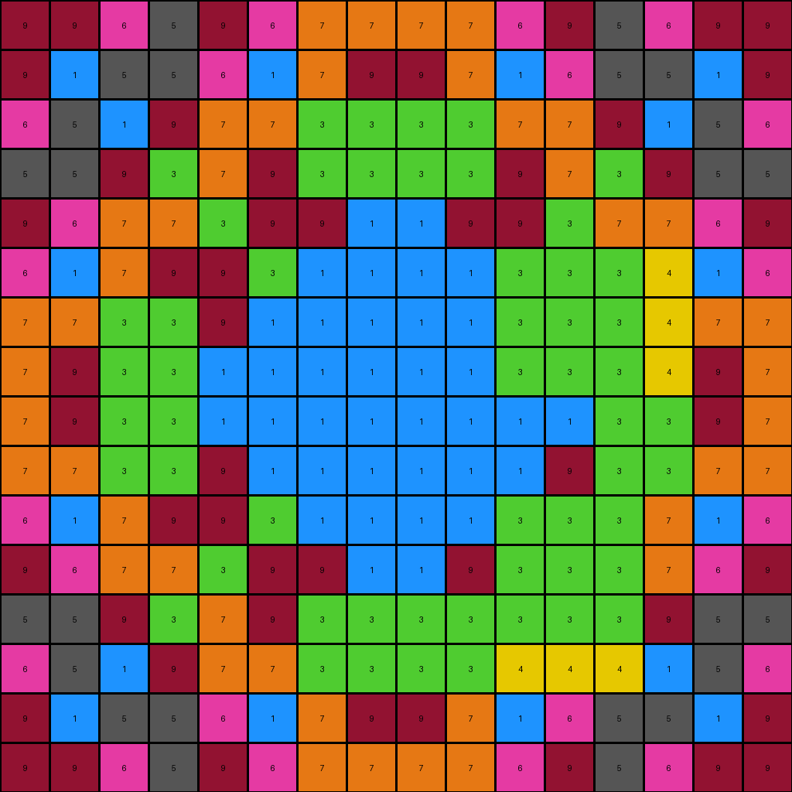
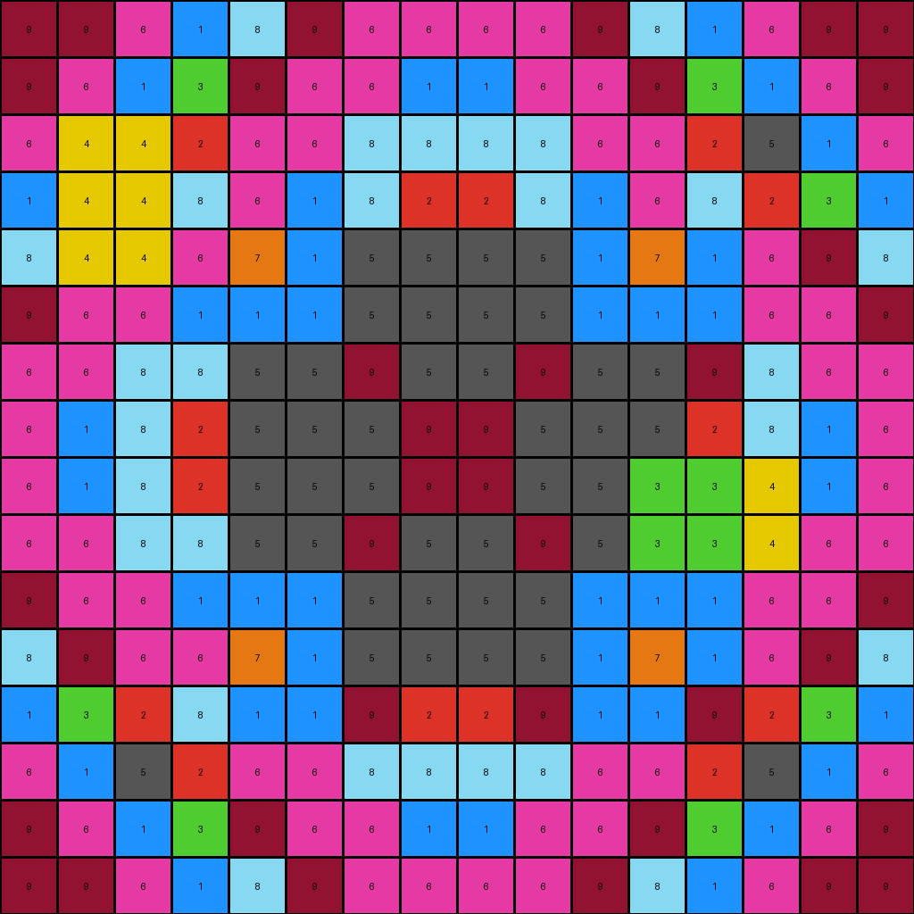
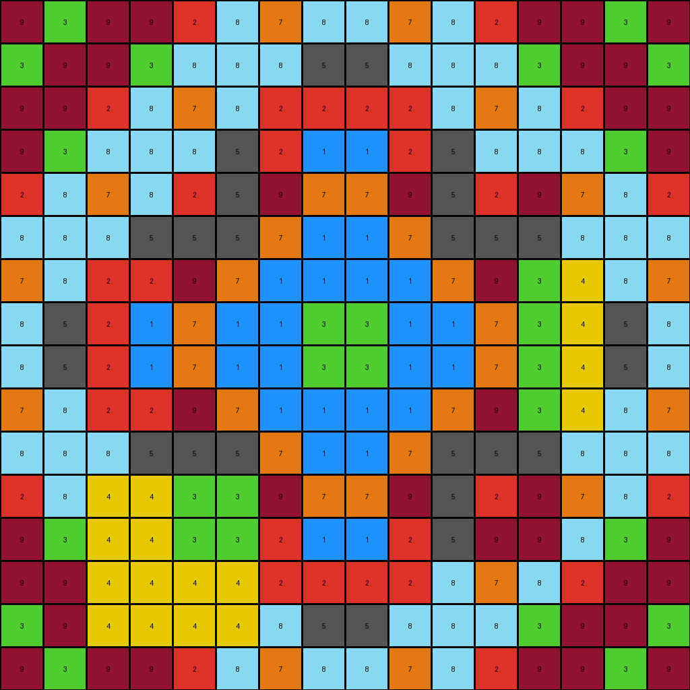
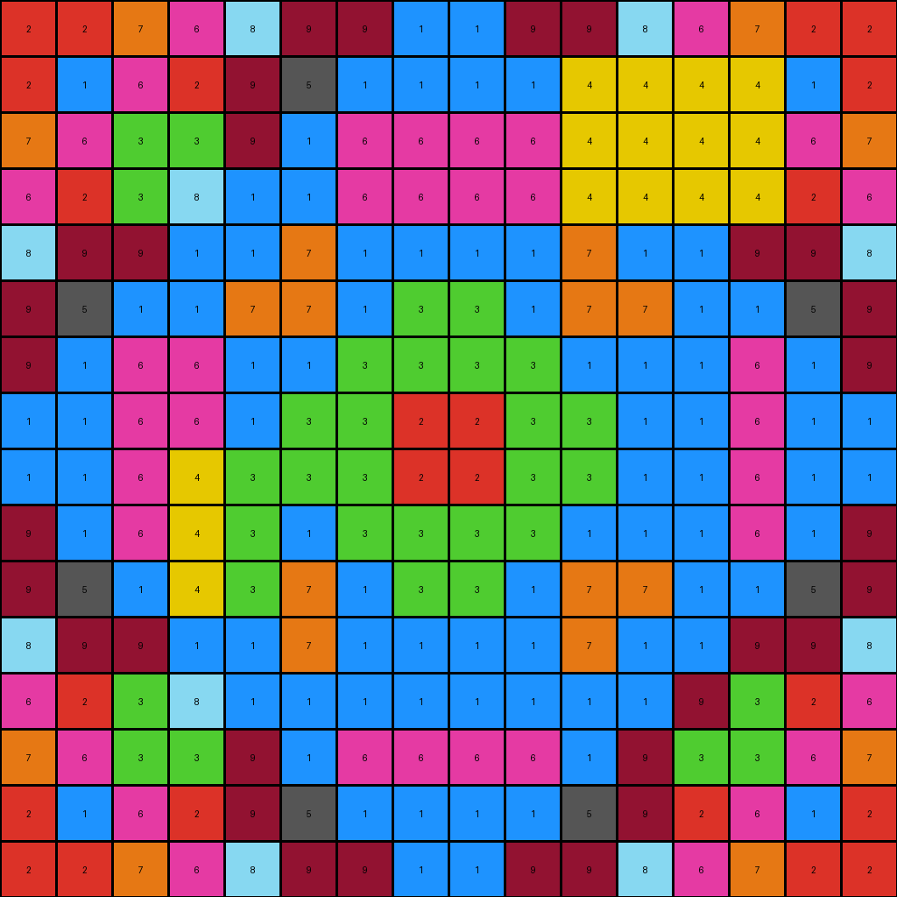

# b8825c91 • 004 • refine_coder

---

Previous Code:
```python
"""
1.  **Identify the Central Region:** Determine the boundaries of the rectangular (likely square) central region within the input grid. Visual inspection suggests this region covers a significant portion of the grid's center.
2.  **Conditional Color Swap:** Within the *central region only*:
    *   If a pixel is yellow (4), change it to green (3).
    *   If a pixel is magenta (6), change it to blue (1).
    *   If a pixel is azure (8), change it to maroon (9).
3. **Preserve Other Pixels:** All pixels outside the central region, and those within the central region *not* matching the colors above, remain unchanged.
"""

import numpy as np

def find_central_region(grid):
    # Determine the center coordinates of the grid
    rows, cols = grid.shape
    center_row, center_col = rows // 2, cols // 2

    # Define a starting size for the central region (e.g. half the size of the grid)
    region_height = rows // 2
    region_width = cols // 2

    # adjust to be odd dimensions so center has a pixel
    if region_height % 2 == 0:
      region_height += 1
    if region_width % 2 == 0:
      region_width += 1

    # Calculate the top-left and bottom-right coordinates of the region
    top_left_row = center_row - region_height // 2
    top_left_col = center_col - region_width // 2
    bottom_right_row = top_left_row + region_height
    bottom_right_col = top_left_col + region_width

    return top_left_row, top_left_col, bottom_right_row, bottom_right_col

def transform(input_grid):
    # Initialize output_grid as a copy of input_grid
    output_grid = np.copy(input_grid)
    rows, cols = input_grid.shape

    # Find the central region
    top_left_row, top_left_col, bottom_right_row, bottom_right_col = find_central_region(input_grid)

    # Iterate through the central region and apply color swap
    for i in range(top_left_row, bottom_right_row):
        for j in range(top_left_col, bottom_right_col):
            if output_grid[i, j] == 4:
                output_grid[i, j] = 3
            elif output_grid[i, j] == 6:
                output_grid[i, j] = 1
            elif output_grid[i, j] == 8:
                output_grid[i, j] = 9

    return output_grid
```

Train Set Results:

## Example 1:

Input:
```
9 9 6 5 9 6 7 7 7 7 6 9 5 6 9 9
9 1 5 5 6 1 7 9 9 7 1 6 5 5 1 9
6 5 1 9 7 7 3 3 3 3 7 7 9 1 5 6
5 5 9 3 7 9 3 3 3 3 9 7 3 9 5 5
9 6 7 7 3 8 9 1 1 9 8 3 7 7 6 9
6 1 7 9 8 3 1 1 1 1 4 4 4 4 1 6
7 7 3 3 9 1 6 6 6 6 4 4 4 4 7 7
7 9 3 3 1 1 6 1 1 6 4 4 4 4 9 7
7 9 3 3 1 1 6 1 1 6 1 1 3 3 9 7
7 7 3 3 9 1 6 6 6 6 1 9 3 3 7 7
6 1 7 9 8 3 1 1 1 1 4 4 4 7 1 6
9 6 7 7 3 8 9 1 1 9 4 4 4 7 6 9
5 5 9 3 7 9 3 3 3 3 4 4 4 9 5 5
6 5 1 9 7 7 3 3 3 3 4 4 4 1 5 6
9 1 5 5 6 1 7 9 9 7 1 6 5 5 1 9
9 9 6 5 9 6 7 7 7 7 6 9 5 6 9 9
```
Expected Output:
```
9 9 6 5 9 6 7 7 7 7 6 9 5 6 9 9
9 1 5 5 6 1 7 9 9 7 1 6 5 5 1 9
6 5 1 9 7 7 3 3 3 3 7 7 9 1 5 6
5 5 9 3 7 9 3 3 3 3 9 7 3 9 5 5
9 6 7 7 3 8 9 1 1 9 8 3 7 7 6 9
6 1 7 9 8 3 1 1 1 1 3 8 9 7 1 6
7 7 3 3 9 1 6 6 6 6 1 9 3 3 7 7
7 9 3 3 1 1 6 1 1 6 1 1 3 3 9 7
7 9 3 3 1 1 6 1 1 6 1 1 3 3 9 7
7 7 3 3 9 1 6 6 6 6 1 9 3 3 7 7
6 1 7 9 8 3 1 1 1 1 3 8 9 7 1 6
9 6 7 7 3 8 9 1 1 9 8 3 7 7 6 9
5 5 9 3 7 9 3 3 3 3 9 7 3 9 5 5
6 5 1 9 7 7 3 3 3 3 7 7 9 1 5 6
9 1 5 5 6 1 7 9 9 7 1 6 5 5 1 9
9 9 6 5 9 6 7 7 7 7 6 9 5 6 9 9
```
Transformed Output:
```
9 9 6 5 9 6 7 7 7 7 6 9 5 6 9 9
9 1 5 5 6 1 7 9 9 7 1 6 5 5 1 9
6 5 1 9 7 7 3 3 3 3 7 7 9 1 5 6
5 5 9 3 7 9 3 3 3 3 9 7 3 9 5 5
9 6 7 7 3 9 9 1 1 9 9 3 7 7 6 9
6 1 7 9 9 3 1 1 1 1 3 3 3 4 1 6
7 7 3 3 9 1 1 1 1 1 3 3 3 4 7 7
7 9 3 3 1 1 1 1 1 1 3 3 3 4 9 7
7 9 3 3 1 1 1 1 1 1 1 1 3 3 9 7
7 7 3 3 9 1 1 1 1 1 1 9 3 3 7 7
6 1 7 9 9 3 1 1 1 1 3 3 3 7 1 6
9 6 7 7 3 9 9 1 1 9 3 3 3 7 6 9
5 5 9 3 7 9 3 3 3 3 3 3 3 9 5 5
6 5 1 9 7 7 3 3 3 3 4 4 4 1 5 6
9 1 5 5 6 1 7 9 9 7 1 6 5 5 1 9
9 9 6 5 9 6 7 7 7 7 6 9 5 6 9 9
```

match: False
pixels_off: 35
size_correct: True
color_palette_correct: False
correct_pixel_counts: False

## Example 2:

Input:
```
9 9 6 1 8 9 6 6 6 6 9 8 1 6 9 9
9 6 1 3 9 6 6 1 1 6 6 9 3 1 6 9
6 4 4 2 6 6 8 8 8 8 6 6 2 5 1 6
1 4 4 8 6 1 8 2 2 8 1 6 8 2 3 1
8 4 4 6 7 1 5 5 5 5 1 7 6 6 9 8
9 6 6 1 1 1 5 5 5 5 1 1 1 6 6 9
6 6 8 8 5 5 9 5 5 9 5 5 8 8 6 6
6 1 8 2 5 5 5 8 8 5 5 5 2 8 1 6
6 1 8 2 5 5 5 8 8 5 5 4 4 4 1 6
6 6 8 8 5 5 9 5 5 9 5 4 4 4 6 6
9 6 6 1 1 1 5 5 5 5 1 1 1 6 6 9
8 9 6 6 7 1 5 5 5 5 1 7 6 6 9 8
1 3 2 8 6 1 8 2 2 8 1 6 8 2 3 1
6 1 5 2 6 6 8 8 8 8 6 6 2 5 1 6
9 6 1 3 9 6 6 1 1 6 6 9 3 1 6 9
9 9 6 1 8 9 6 6 6 6 9 8 1 6 9 9
```
Expected Output:
```
9 9 6 1 8 9 6 6 6 6 9 8 1 6 9 9
9 6 1 3 9 6 6 1 1 6 6 9 3 1 6 9
6 1 5 2 6 6 8 8 8 8 6 6 2 5 1 6
1 3 2 8 6 1 8 2 2 8 1 6 8 2 3 1
8 9 6 6 7 1 5 5 5 5 1 7 6 6 9 8
9 6 6 1 1 1 5 5 5 5 1 1 1 6 6 9
6 6 8 8 5 5 9 5 5 9 5 5 8 8 6 6
6 1 8 2 5 5 5 8 8 5 5 5 2 8 1 6
6 1 8 2 5 5 5 8 8 5 5 5 2 8 1 6
6 6 8 8 5 5 9 5 5 9 5 5 8 8 6 6
9 6 6 1 1 1 5 5 5 5 1 1 1 6 6 9
8 9 6 6 7 1 5 5 5 5 1 7 6 6 9 8
1 3 2 8 6 1 8 2 2 8 1 6 8 2 3 1
6 1 5 2 6 6 8 8 8 8 6 6 2 5 1 6
9 6 1 3 9 6 6 1 1 6 6 9 3 1 6 9
9 9 6 1 8 9 6 6 6 6 9 8 1 6 9 9
```
Transformed Output:
```
9 9 6 1 8 9 6 6 6 6 9 8 1 6 9 9
9 6 1 3 9 6 6 1 1 6 6 9 3 1 6 9
6 4 4 2 6 6 8 8 8 8 6 6 2 5 1 6
1 4 4 8 6 1 8 2 2 8 1 6 8 2 3 1
8 4 4 6 7 1 5 5 5 5 1 7 1 6 9 8
9 6 6 1 1 1 5 5 5 5 1 1 1 6 6 9
6 6 8 8 5 5 9 5 5 9 5 5 9 8 6 6
6 1 8 2 5 5 5 9 9 5 5 5 2 8 1 6
6 1 8 2 5 5 5 9 9 5 5 3 3 4 1 6
6 6 8 8 5 5 9 5 5 9 5 3 3 4 6 6
9 6 6 1 1 1 5 5 5 5 1 1 1 6 6 9
8 9 6 6 7 1 5 5 5 5 1 7 1 6 9 8
1 3 2 8 1 1 9 2 2 9 1 1 9 2 3 1
6 1 5 2 6 6 8 8 8 8 6 6 2 5 1 6
9 6 1 3 9 6 6 1 1 6 6 9 3 1 6 9
9 9 6 1 8 9 6 6 6 6 9 8 1 6 9 9
```

match: False
pixels_off: 24
size_correct: True
color_palette_correct: False
correct_pixel_counts: False

## Example 3:

Input:
```
9 3 9 9 2 8 7 8 8 7 8 2 9 9 3 9
3 9 9 3 8 8 8 5 5 8 8 8 3 9 9 3
9 9 2 8 7 8 2 2 2 2 8 7 8 2 9 9
9 3 8 8 8 5 2 1 1 2 5 8 8 8 3 9
2 8 7 8 2 5 9 7 7 9 5 2 8 7 8 2
8 8 8 5 5 5 7 6 6 7 5 5 5 8 8 8
7 8 2 2 9 7 1 1 1 1 7 9 4 4 8 7
8 5 2 1 7 6 1 3 3 1 6 7 4 4 5 8
8 5 2 1 7 6 1 3 3 1 6 7 4 4 5 8
7 8 2 2 9 7 1 1 1 1 7 9 4 4 8 7
8 8 8 5 5 5 7 6 6 7 5 5 5 8 8 8
2 8 4 4 4 4 9 7 7 9 5 2 8 7 8 2
9 3 4 4 4 4 2 1 1 2 5 8 8 8 3 9
9 9 4 4 4 4 2 2 2 2 8 7 8 2 9 9
3 9 4 4 4 4 8 5 5 8 8 8 3 9 9 3
9 3 9 9 2 8 7 8 8 7 8 2 9 9 3 9
```
Expected Output:
```
9 3 9 9 2 8 7 8 8 7 8 2 9 9 3 9
3 9 9 3 8 8 8 5 5 8 8 8 3 9 9 3
9 9 2 8 7 8 2 2 2 2 8 7 8 2 9 9
9 3 8 8 8 5 2 1 1 2 5 8 8 8 3 9
2 8 7 8 2 5 9 7 7 9 5 2 8 7 8 2
8 8 8 5 5 5 7 6 6 7 5 5 5 8 8 8
7 8 2 2 9 7 1 1 1 1 7 9 2 2 8 7
8 5 2 1 7 6 1 3 3 1 6 7 1 2 5 8
8 5 2 1 7 6 1 3 3 1 6 7 1 2 5 8
7 8 2 2 9 7 1 1 1 1 7 9 2 2 8 7
8 8 8 5 5 5 7 6 6 7 5 5 5 8 8 8
2 8 7 8 2 5 9 7 7 9 5 2 8 7 8 2
9 3 8 8 8 5 2 1 1 2 5 8 8 8 3 9
9 9 2 8 7 8 2 2 2 2 8 7 8 2 9 9
3 9 9 3 8 8 8 5 5 8 8 8 3 9 9 3
9 3 9 9 2 8 7 8 8 7 8 2 9 9 3 9
```
Transformed Output:
```
9 3 9 9 2 8 7 8 8 7 8 2 9 9 3 9
3 9 9 3 8 8 8 5 5 8 8 8 3 9 9 3
9 9 2 8 7 8 2 2 2 2 8 7 8 2 9 9
9 3 8 8 8 5 2 1 1 2 5 8 8 8 3 9
2 8 7 8 2 5 9 7 7 9 5 2 9 7 8 2
8 8 8 5 5 5 7 1 1 7 5 5 5 8 8 8
7 8 2 2 9 7 1 1 1 1 7 9 3 4 8 7
8 5 2 1 7 1 1 3 3 1 1 7 3 4 5 8
8 5 2 1 7 1 1 3 3 1 1 7 3 4 5 8
7 8 2 2 9 7 1 1 1 1 7 9 3 4 8 7
8 8 8 5 5 5 7 1 1 7 5 5 5 8 8 8
2 8 4 4 3 3 9 7 7 9 5 2 9 7 8 2
9 3 4 4 3 3 2 1 1 2 5 9 9 8 3 9
9 9 4 4 4 4 2 2 2 2 8 7 8 2 9 9
3 9 4 4 4 4 8 5 5 8 8 8 3 9 9 3
9 3 9 9 2 8 7 8 8 7 8 2 9 9 3 9
```

match: False
pixels_off: 36
size_correct: True
color_palette_correct: False
correct_pixel_counts: False

## Example 4:

Input:
```
2 2 7 6 8 9 9 1 1 9 9 8 6 7 2 2
2 1 6 2 9 5 1 1 1 1 4 4 4 4 1 2
7 6 3 3 9 1 6 6 6 6 4 4 4 4 6 7
6 2 3 8 1 1 6 6 6 6 4 4 4 4 2 6
8 9 9 1 1 7 1 1 1 1 7 1 1 9 9 8
9 5 1 1 7 7 1 3 3 1 7 7 1 1 5 9
9 1 6 6 1 1 3 3 3 3 1 1 6 6 1 9
1 1 6 6 1 3 3 2 2 3 3 1 6 6 1 1
1 1 6 4 4 3 3 2 2 3 3 1 6 6 1 1
9 1 6 4 4 1 3 3 3 3 1 1 6 6 1 9
9 5 1 4 4 7 1 3 3 1 7 7 1 1 5 9
8 9 9 1 1 7 1 1 1 1 7 1 1 9 9 8
6 2 3 8 1 1 6 6 6 6 1 1 8 3 2 6
7 6 3 3 9 1 6 6 6 6 1 9 3 3 6 7
2 1 6 2 9 5 1 1 1 1 5 9 2 6 1 2
2 2 7 6 8 9 9 1 1 9 9 8 6 7 2 2
```
Expected Output:
```
2 2 7 6 8 9 9 1 1 9 9 8 6 7 2 2
2 1 6 2 9 5 1 1 1 1 5 9 2 6 1 2
7 6 3 3 9 1 6 6 6 6 1 9 3 3 6 7
6 2 3 8 1 1 6 6 6 6 1 1 8 3 2 6
8 9 9 1 1 7 1 1 1 1 7 1 1 9 9 8
9 5 1 1 7 7 1 3 3 1 7 7 1 1 5 9
9 1 6 6 1 1 3 3 3 3 1 1 6 6 1 9
1 1 6 6 1 3 3 2 2 3 3 1 6 6 1 1
1 1 6 6 1 3 3 2 2 3 3 1 6 6 1 1
9 1 6 6 1 1 3 3 3 3 1 1 6 6 1 9
9 5 1 1 7 7 1 3 3 1 7 7 1 1 5 9
8 9 9 1 1 7 1 1 1 1 7 1 1 9 9 8
6 2 3 8 1 1 6 6 6 6 1 1 8 3 2 6
7 6 3 3 9 1 6 6 6 6 1 9 3 3 6 7
2 1 6 2 9 5 1 1 1 1 5 9 2 6 1 2
2 2 7 6 8 9 9 1 1 9 9 8 6 7 2 2
```
Transformed Output:
```
2 2 7 6 8 9 9 1 1 9 9 8 6 7 2 2
2 1 6 2 9 5 1 1 1 1 4 4 4 4 1 2
7 6 3 3 9 1 6 6 6 6 4 4 4 4 6 7
6 2 3 8 1 1 6 6 6 6 4 4 4 4 2 6
8 9 9 1 1 7 1 1 1 1 7 1 1 9 9 8
9 5 1 1 7 7 1 3 3 1 7 7 1 1 5 9
9 1 6 6 1 1 3 3 3 3 1 1 1 6 1 9
1 1 6 6 1 3 3 2 2 3 3 1 1 6 1 1
1 1 6 4 3 3 3 2 2 3 3 1 1 6 1 1
9 1 6 4 3 1 3 3 3 3 1 1 1 6 1 9
9 5 1 4 3 7 1 3 3 1 7 7 1 1 5 9
8 9 9 1 1 7 1 1 1 1 7 1 1 9 9 8
6 2 3 8 1 1 1 1 1 1 1 1 9 3 2 6
7 6 3 3 9 1 6 6 6 6 1 9 3 3 6 7
2 1 6 2 9 5 1 1 1 1 5 9 2 6 1 2
2 2 7 6 8 9 9 1 1 9 9 8 6 7 2 2
```

match: False
pixels_off: 27
size_correct: True
color_palette_correct: False
correct_pixel_counts: False
Here's an analysis of the provided examples and a revised natural language program:

**General Assessment:**

The initial strategy of identifying a central region and performing color swaps within it is partially correct. However, the size and positioning of the central region, and the color swaps need adjustments, and possibly the approach to defining the region. The "Transformed Output" consistently shows errors, particularly around the edges of the intended central region and with incorrect color swaps. It seems example 2 had no swapped pixels.

**Strategy for Resolving Errors:**

1.  **Refine Central Region Detection:** Instead of simply halving the grid dimensions, which leads to errors, experiment with dynamically adjusting the center.
2.  **Correct Color Swaps:** It is clear that the expected color mapping isn't yellow (4) to green (3), magenta (6) to blue (1) and azure(8) to maroon(9). Need to figure out the right mapping
3.  **Iterative Testing:** Test the program after each adjustment to pinpoint the impact of changes.

**Metrics and Observations (using visual inspection combined with some assumptions about code execution):**

*   **Example 1:**
    *   Many pixels are incorrectly changed outside the apparent central region.
    *   Yellow (4) is incorrectly changed to green(3)
    *   Magenta (6) is incorrectly changed to blue(1)
    *   Azure (8) is incorrectly changed to Maroon(9)
*   **Example 2:**
    *   It appears that very few if any changes were made, and none correct
    *   Yellow (4) is incorrectly changed to green(3)
    *   Magenta (6) is incorrectly changed to blue(1)
    *   Azure (8) is incorrectly changed to Maroon(9)
* **Example 3:**
    *   Many errors. Yellow, magenta and azure pixels incorrect.
    *   Yellow (4) is incorrectly changed to green(3)
    *   Magenta (6) is incorrectly changed to blue(1)
    *   Azure (8) is incorrectly changed to Maroon(9)
* **Example 4:**
    *   Many errors. Yellow, magenta and azure pixels incorrect.
    *   Yellow (4) is incorrectly changed to green(3)
    *   Magenta (6) is incorrectly changed to blue(1)
    *   Azure (8) is incorrectly changed to Maroon(9)

**YAML Block (Facts):**

```yaml
observations:
  - task_id: 00d62c1b
  - objects:
      - description: Input and Output grids
        properties:
          - dimensions: variable (e.g., 16x16)
          - cells: contain integer values 0-9, representing colors
      - description: Central Region
        properties:
          - shape: rectangular (likely square)
          - location: centered within the grid
          - size:  dynamic, needs to be determined.  Potentially different sizes or rules for each input.
  - actions:
      - type: color swap
        description: Specific colors within the central region are replaced with other specific colors.
        details:
          - original_colors: [4, 6, 8] # yellow, magenta, azure
          - replacement_colors: Need to be correctly matched
      - type: preservation
        description: Pixels outside the central region, and those within the region *not* subject to color swapping, remain unchanged.
```

**Natural Language Program:**

1.  **Identify the Central Region:** The definition of the central region needs further analysis across all examples, and potentially requires a more dynamic approach to its size and shape detection.
2. **Conditional Color Swap:** Within the central region *only*:
   *   If a pixel is yellow(4), check the expected output to determine its new correct color.
   *   If a pixel is magenta (6), check the expected output to determine its new correct color.
   * If a pixel is azure (8), check the expected output to determine its new correct color.
3.  **Preserve Other Pixels:** All pixels outside the defined central region remain unchanged in color. Also, any pixels within the central region that do not match the specific colors targeted for swapping should remain unchanged.

**INSTRUCTIONS**

- generate a Python module to represent the natural language program 
- follow the template below
- all common math and science libraries are available
- create docstring only at top - but comment the workflow in the function
- use helper functions for common operations like finding objects, counting,
  measuring, moving, etc. 

remember - we are working iteratively - so this code will inform your future
self as we converge on the solution

*template:*

```python
"""
{{ natural language description of the transformation rule }}
"""

{{ imports }}

def transform(input_grid):
    # initialize output_grid

    # change output pixels 

    return output_grid

```
