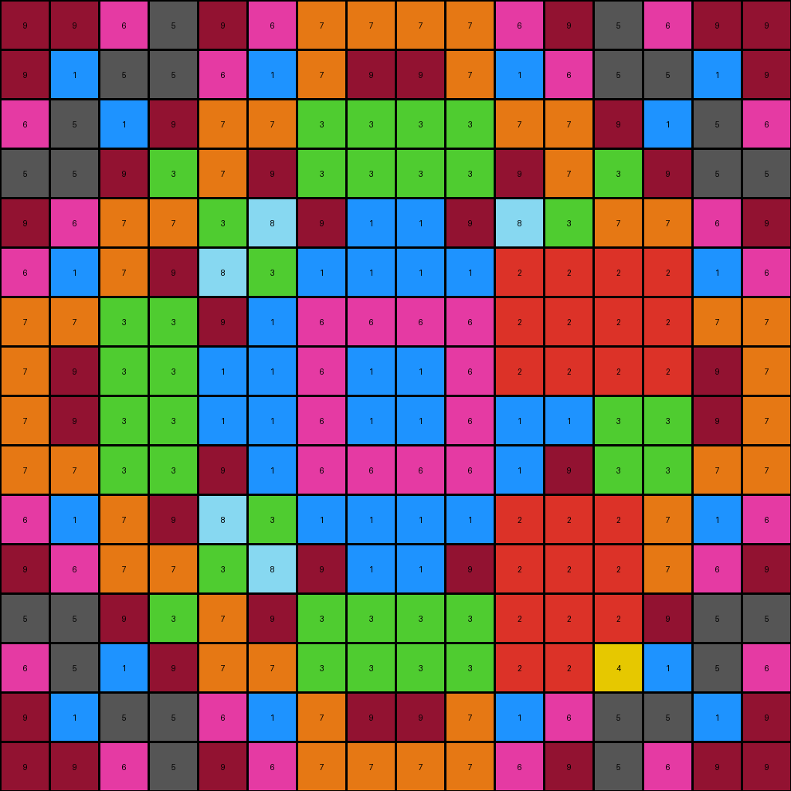
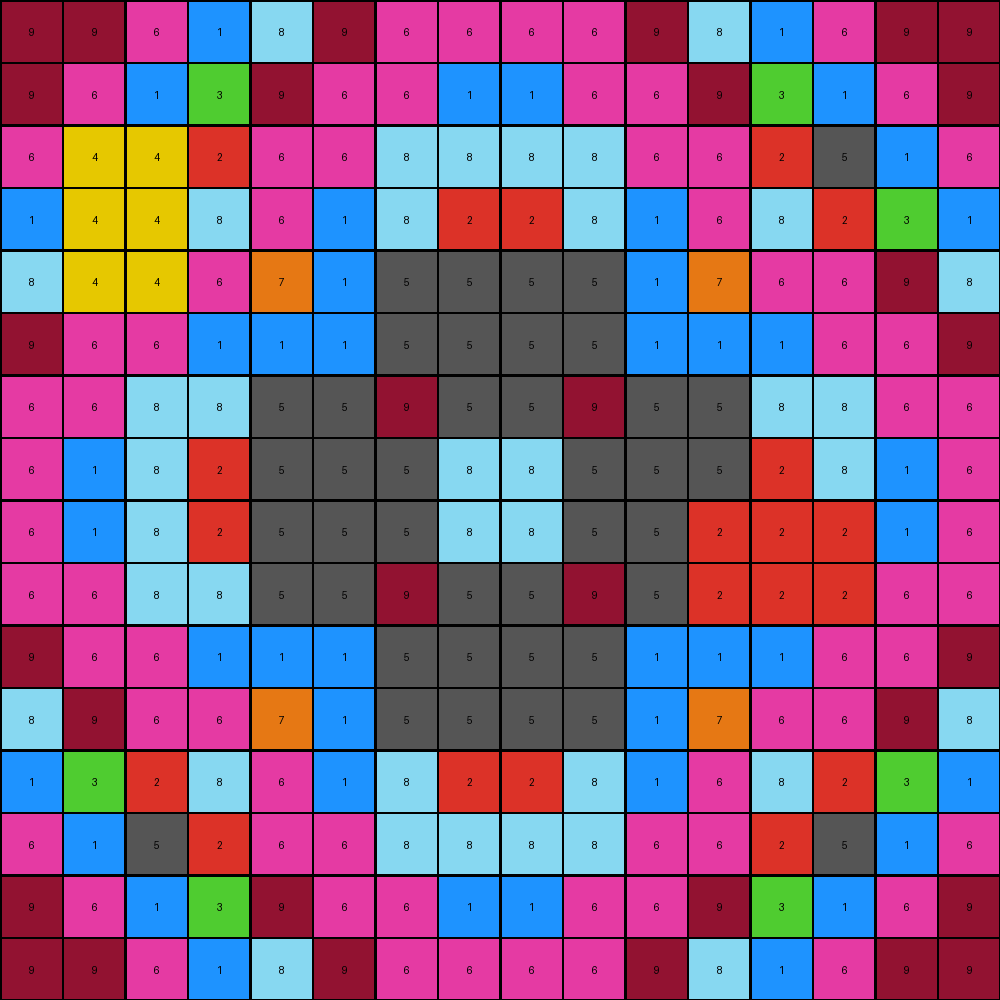

# b8825c91 • 015 • refine_dreamer

---


Previous Code:
```python
"""
The transformation preserves everything outside a central diamond shape and selectively changes colors only *within* that diamond. 
It appears to be two different color changes, one affecting the inner cross, the other affecting the rest, including the border.
Specifically, the yellow (4) pixels in the original border are replaced with maroon (9).
The internal plus is recolored, orange (7) to blue (1) and yellow (4) to maroon (9).
"""

import numpy as np

def find_diamond_center(grid):
    # Find the center of the grid
    center_row, center_col = grid.shape[0] // 2, grid.shape[1] // 2
    return center_row, center_col

def is_inside_diamond(row, col, center_row, center_col, size):
    # Determine if a given cell is within the diamond, the size correlates with number of rings
    dist_row = abs(row - center_row)
    dist_col = abs(col - center_col)
    return dist_row + dist_col <= size

def get_diamond_size(grid):
    # for this specific type of problem where a well defined object has clear borders and can have multiple "rings",
    # the max size is useful to determine how big an object we need to look at
    # Find diamond center
    center_row, center_col = find_diamond_center(grid)

    # expand outward to estimate the size/radius
    max_size = min(center_row, center_col)
    
    return max_size

def transform(input_grid):
    # Initialize output_grid as a copy of the input_grid
    output_grid = np.copy(input_grid)
    
    grid = input_grid
    # Find diamond center
    center_row, center_col = find_diamond_center(grid)

    # expand outward to estimate the size/radius
    size = get_diamond_size(grid)

    # Iterate through each cell of the grid
    for row in range(grid.shape[0]):
        for col in range(grid.shape[1]):
            # Check if the cell is inside the diamond
            if is_inside_diamond(row, col, center_row, center_col, size):
                # Apply color transformations inside the diamond
                if (abs(row - center_row) + abs(col-center_col)) <= 2 :
                    if grid[row, col] == 7:
                        output_grid[row, col] = 1
                    elif grid[row, col] == 4:
                        output_grid[row, col] = 9
                elif grid[row,col] == 4:
                        output_grid[row,col] = 2

    return output_grid
```

Train Set Results:

## Example 1:

Input:
```
9 9 6 5 9 6 7 7 7 7 6 9 5 6 9 9
9 1 5 5 6 1 7 9 9 7 1 6 5 5 1 9
6 5 1 9 7 7 3 3 3 3 7 7 9 1 5 6
5 5 9 3 7 9 3 3 3 3 9 7 3 9 5 5
9 6 7 7 3 8 9 1 1 9 8 3 7 7 6 9
6 1 7 9 8 3 1 1 1 1 4 4 4 4 1 6
7 7 3 3 9 1 6 6 6 6 4 4 4 4 7 7
7 9 3 3 1 1 6 1 1 6 4 4 4 4 9 7
7 9 3 3 1 1 6 1 1 6 1 1 3 3 9 7
7 7 3 3 9 1 6 6 6 6 1 9 3 3 7 7
6 1 7 9 8 3 1 1 1 1 4 4 4 7 1 6
9 6 7 7 3 8 9 1 1 9 4 4 4 7 6 9
5 5 9 3 7 9 3 3 3 3 4 4 4 9 5 5
6 5 1 9 7 7 3 3 3 3 4 4 4 1 5 6
9 1 5 5 6 1 7 9 9 7 1 6 5 5 1 9
9 9 6 5 9 6 7 7 7 7 6 9 5 6 9 9
```
Expected Output:
```
9 9 6 5 9 6 7 7 7 7 6 9 5 6 9 9
9 1 5 5 6 1 7 9 9 7 1 6 5 5 1 9
6 5 1 9 7 7 3 3 3 3 7 7 9 1 5 6
5 5 9 3 7 9 3 3 3 3 9 7 3 9 5 5
9 6 7 7 3 8 9 1 1 9 8 3 7 7 6 9
6 1 7 9 8 3 1 1 1 1 3 8 9 7 1 6
7 7 3 3 9 1 6 6 6 6 1 9 3 3 7 7
7 9 3 3 1 1 6 1 1 6 1 1 3 3 9 7
7 9 3 3 1 1 6 1 1 6 1 1 3 3 9 7
7 7 3 3 9 1 6 6 6 6 1 9 3 3 7 7
6 1 7 9 8 3 1 1 1 1 3 8 9 7 1 6
9 6 7 7 3 8 9 1 1 9 8 3 7 7 6 9
5 5 9 3 7 9 3 3 3 3 9 7 3 9 5 5
6 5 1 9 7 7 3 3 3 3 7 7 9 1 5 6
9 1 5 5 6 1 7 9 9 7 1 6 5 5 1 9
9 9 6 5 9 6 7 7 7 7 6 9 5 6 9 9
```
Transformed Output:
```
9 9 6 5 9 6 7 7 7 7 6 9 5 6 9 9
9 1 5 5 6 1 7 9 9 7 1 6 5 5 1 9
6 5 1 9 7 7 3 3 3 3 7 7 9 1 5 6
5 5 9 3 7 9 3 3 3 3 9 7 3 9 5 5
9 6 7 7 3 8 9 1 1 9 8 3 7 7 6 9
6 1 7 9 8 3 1 1 1 1 2 2 2 2 1 6
7 7 3 3 9 1 6 6 6 6 2 2 2 2 7 7
7 9 3 3 1 1 6 1 1 6 2 2 2 2 9 7
7 9 3 3 1 1 6 1 1 6 1 1 3 3 9 7
7 7 3 3 9 1 6 6 6 6 1 9 3 3 7 7
6 1 7 9 8 3 1 1 1 1 2 2 2 7 1 6
9 6 7 7 3 8 9 1 1 9 2 2 2 7 6 9
5 5 9 3 7 9 3 3 3 3 2 2 2 9 5 5
6 5 1 9 7 7 3 3 3 3 2 2 4 1 5 6
9 1 5 5 6 1 7 9 9 7 1 6 5 5 1 9
9 9 6 5 9 6 7 7 7 7 6 9 5 6 9 9
```

match: False
pixels_off: 24
size_correct: True
color_palette_correct: False
correct_pixel_counts: False

## Example 2:

Input:
```
9 9 6 1 8 9 6 6 6 6 9 8 1 6 9 9
9 6 1 3 9 6 6 1 1 6 6 9 3 1 6 9
6 4 4 2 6 6 8 8 8 8 6 6 2 5 1 6
1 4 4 8 6 1 8 2 2 8 1 6 8 2 3 1
8 4 4 6 7 1 5 5 5 5 1 7 6 6 9 8
9 6 6 1 1 1 5 5 5 5 1 1 1 6 6 9
6 6 8 8 5 5 9 5 5 9 5 5 8 8 6 6
6 1 8 2 5 5 5 8 8 5 5 5 2 8 1 6
6 1 8 2 5 5 5 8 8 5 5 4 4 4 1 6
6 6 8 8 5 5 9 5 5 9 5 4 4 4 6 6
9 6 6 1 1 1 5 5 5 5 1 1 1 6 6 9
8 9 6 6 7 1 5 5 5 5 1 7 6 6 9 8
1 3 2 8 6 1 8 2 2 8 1 6 8 2 3 1
6 1 5 2 6 6 8 8 8 8 6 6 2 5 1 6
9 6 1 3 9 6 6 1 1 6 6 9 3 1 6 9
9 9 6 1 8 9 6 6 6 6 9 8 1 6 9 9
```
Expected Output:
```
9 9 6 1 8 9 6 6 6 6 9 8 1 6 9 9
9 6 1 3 9 6 6 1 1 6 6 9 3 1 6 9
6 1 5 2 6 6 8 8 8 8 6 6 2 5 1 6
1 3 2 8 6 1 8 2 2 8 1 6 8 2 3 1
8 9 6 6 7 1 5 5 5 5 1 7 6 6 9 8
9 6 6 1 1 1 5 5 5 5 1 1 1 6 6 9
6 6 8 8 5 5 9 5 5 9 5 5 8 8 6 6
6 1 8 2 5 5 5 8 8 5 5 5 2 8 1 6
6 1 8 2 5 5 5 8 8 5 5 5 2 8 1 6
6 6 8 8 5 5 9 5 5 9 5 5 8 8 6 6
9 6 6 1 1 1 5 5 5 5 1 1 1 6 6 9
8 9 6 6 7 1 5 5 5 5 1 7 6 6 9 8
1 3 2 8 6 1 8 2 2 8 1 6 8 2 3 1
6 1 5 2 6 6 8 8 8 8 6 6 2 5 1 6
9 6 1 3 9 6 6 1 1 6 6 9 3 1 6 9
9 9 6 1 8 9 6 6 6 6 9 8 1 6 9 9
```
Transformed Output:
```
9 9 6 1 8 9 6 6 6 6 9 8 1 6 9 9
9 6 1 3 9 6 6 1 1 6 6 9 3 1 6 9
6 4 4 2 6 6 8 8 8 8 6 6 2 5 1 6
1 4 4 8 6 1 8 2 2 8 1 6 8 2 3 1
8 4 4 6 7 1 5 5 5 5 1 7 6 6 9 8
9 6 6 1 1 1 5 5 5 5 1 1 1 6 6 9
6 6 8 8 5 5 9 5 5 9 5 5 8 8 6 6
6 1 8 2 5 5 5 8 8 5 5 5 2 8 1 6
6 1 8 2 5 5 5 8 8 5 5 2 2 2 1 6
6 6 8 8 5 5 9 5 5 9 5 2 2 2 6 6
9 6 6 1 1 1 5 5 5 5 1 1 1 6 6 9
8 9 6 6 7 1 5 5 5 5 1 7 6 6 9 8
1 3 2 8 6 1 8 2 2 8 1 6 8 2 3 1
6 1 5 2 6 6 8 8 8 8 6 6 2 5 1 6
9 6 1 3 9 6 6 1 1 6 6 9 3 1 6 9
9 9 6 1 8 9 6 6 6 6 9 8 1 6 9 9
```

match: False
pixels_off: 11
size_correct: True
color_palette_correct: False
correct_pixel_counts: False

## Example 3:

Input:
```
9 3 9 9 2 8 7 8 8 7 8 2 9 9 3 9
3 9 9 3 8 8 8 5 5 8 8 8 3 9 9 3
9 9 2 8 7 8 2 2 2 2 8 7 8 2 9 9
9 3 8 8 8 5 2 1 1 2 5 8 8 8 3 9
2 8 7 8 2 5 9 7 7 9 5 2 8 7 8 2
8 8 8 5 5 5 7 6 6 7 5 5 5 8 8 8
7 8 2 2 9 7 1 1 1 1 7 9 4 4 8 7
8 5 2 1 7 6 1 3 3 1 6 7 4 4 5 8
8 5 2 1 7 6 1 3 3 1 6 7 4 4 5 8
7 8 2 2 9 7 1 1 1 1 7 9 4 4 8 7
8 8 8 5 5 5 7 6 6 7 5 5 5 8 8 8
2 8 4 4 4 4 9 7 7 9 5 2 8 7 8 2
9 3 4 4 4 4 2 1 1 2 5 8 8 8 3 9
9 9 4 4 4 4 2 2 2 2 8 7 8 2 9 9
3 9 4 4 4 4 8 5 5 8 8 8 3 9 9 3
9 3 9 9 2 8 7 8 8 7 8 2 9 9 3 9
```
Expected Output:
```
9 3 9 9 2 8 7 8 8 7 8 2 9 9 3 9
3 9 9 3 8 8 8 5 5 8 8 8 3 9 9 3
9 9 2 8 7 8 2 2 2 2 8 7 8 2 9 9
9 3 8 8 8 5 2 1 1 2 5 8 8 8 3 9
2 8 7 8 2 5 9 7 7 9 5 2 8 7 8 2
8 8 8 5 5 5 7 6 6 7 5 5 5 8 8 8
7 8 2 2 9 7 1 1 1 1 7 9 2 2 8 7
8 5 2 1 7 6 1 3 3 1 6 7 1 2 5 8
8 5 2 1 7 6 1 3 3 1 6 7 1 2 5 8
7 8 2 2 9 7 1 1 1 1 7 9 2 2 8 7
8 8 8 5 5 5 7 6 6 7 5 5 5 8 8 8
2 8 7 8 2 5 9 7 7 9 5 2 8 7 8 2
9 3 8 8 8 5 2 1 1 2 5 8 8 8 3 9
9 9 2 8 7 8 2 2 2 2 8 7 8 2 9 9
3 9 9 3 8 8 8 5 5 8 8 8 3 9 9 3
9 3 9 9 2 8 7 8 8 7 8 2 9 9 3 9
```
Transformed Output:
```
9 3 9 9 2 8 7 8 8 7 8 2 9 9 3 9
3 9 9 3 8 8 8 5 5 8 8 8 3 9 9 3
9 9 2 8 7 8 2 2 2 2 8 7 8 2 9 9
9 3 8 8 8 5 2 1 1 2 5 8 8 8 3 9
2 8 7 8 2 5 9 7 7 9 5 2 8 7 8 2
8 8 8 5 5 5 7 6 6 7 5 5 5 8 8 8
7 8 2 2 9 7 1 1 1 1 7 9 2 2 8 7
8 5 2 1 7 6 1 3 3 1 6 7 2 2 5 8
8 5 2 1 7 6 1 3 3 1 6 7 2 2 5 8
7 8 2 2 9 7 1 1 1 1 7 9 2 2 8 7
8 8 8 5 5 5 7 6 6 7 5 5 5 8 8 8
2 8 4 2 2 2 9 7 7 9 5 2 8 7 8 2
9 3 4 4 2 2 2 1 1 2 5 8 8 8 3 9
9 9 4 4 4 2 2 2 2 2 8 7 8 2 9 9
3 9 4 4 4 4 8 5 5 8 8 8 3 9 9 3
9 3 9 9 2 8 7 8 8 7 8 2 9 9 3 9
```

match: False
pixels_off: 17
size_correct: True
color_palette_correct: False
correct_pixel_counts: False

## Example 4:

Input:
```
2 2 7 6 8 9 9 1 1 9 9 8 6 7 2 2
2 1 6 2 9 5 1 1 1 1 4 4 4 4 1 2
7 6 3 3 9 1 6 6 6 6 4 4 4 4 6 7
6 2 3 8 1 1 6 6 6 6 4 4 4 4 2 6
8 9 9 1 1 7 1 1 1 1 7 1 1 9 9 8
9 5 1 1 7 7 1 3 3 1 7 7 1 1 5 9
9 1 6 6 1 1 3 3 3 3 1 1 6 6 1 9
1 1 6 6 1 3 3 2 2 3 3 1 6 6 1 1
1 1 6 4 4 3 3 2 2 3 3 1 6 6 1 1
9 1 6 4 4 1 3 3 3 3 1 1 6 6 1 9
9 5 1 4 4 7 1 3 3 1 7 7 1 1 5 9
8 9 9 1 1 7 1 1 1 1 7 1 1 9 9 8
6 2 3 8 1 1 6 6 6 6 1 1 8 3 2 6
7 6 3 3 9 1 6 6 6 6 1 9 3 3 6 7
2 1 6 2 9 5 1 1 1 1 5 9 2 6 1 2
2 2 7 6 8 9 9 1 1 9 9 8 6 7 2 2
```
Expected Output:
```
2 2 7 6 8 9 9 1 1 9 9 8 6 7 2 2
2 1 6 2 9 5 1 1 1 1 5 9 2 6 1 2
7 6 3 3 9 1 6 6 6 6 1 9 3 3 6 7
6 2 3 8 1 1 6 6 6 6 1 1 8 3 2 6
8 9 9 1 1 7 1 1 1 1 7 1 1 9 9 8
9 5 1 1 7 7 1 3 3 1 7 7 1 1 5 9
9 1 6 6 1 1 3 3 3 3 1 1 6 6 1 9
1 1 6 6 1 3 3 2 2 3 3 1 6 6 1 1
1 1 6 6 1 3 3 2 2 3 3 1 6 6 1 1
9 1 6 6 1 1 3 3 3 3 1 1 6 6 1 9
9 5 1 1 7 7 1 3 3 1 7 7 1 1 5 9
8 9 9 1 1 7 1 1 1 1 7 1 1 9 9 8
6 2 3 8 1 1 6 6 6 6 1 1 8 3 2 6
7 6 3 3 9 1 6 6 6 6 1 9 3 3 6 7
2 1 6 2 9 5 1 1 1 1 5 9 2 6 1 2
2 2 7 6 8 9 9 1 1 9 9 8 6 7 2 2
```
Transformed Output:
```
2 2 7 6 8 9 9 1 1 9 9 8 6 7 2 2
2 1 6 2 9 5 1 1 1 1 4 4 4 4 1 2
7 6 3 3 9 1 6 6 6 6 2 4 4 4 6 7
6 2 3 8 1 1 6 6 6 6 2 2 4 4 2 6
8 9 9 1 1 7 1 1 1 1 7 1 1 9 9 8
9 5 1 1 7 7 1 3 3 1 7 7 1 1 5 9
9 1 6 6 1 1 3 3 3 3 1 1 6 6 1 9
1 1 6 6 1 3 3 2 2 3 3 1 6 6 1 1
1 1 6 2 2 3 3 2 2 3 3 1 6 6 1 1
9 1 6 2 2 1 3 3 3 3 1 1 6 6 1 9
9 5 1 2 2 7 1 3 3 1 7 7 1 1 5 9
8 9 9 1 1 7 1 1 1 1 7 1 1 9 9 8
6 2 3 8 1 1 6 6 6 6 1 1 8 3 2 6
7 6 3 3 9 1 6 6 6 6 1 9 3 3 6 7
2 1 6 2 9 5 1 1 1 1 5 9 2 6 1 2
2 2 7 6 8 9 9 1 1 9 9 8 6 7 2 2
```

match: False
pixels_off: 18
size_correct: True
color_palette_correct: False
correct_pixel_counts: False

**INSTRUCTIONS**

The code above was generated based on observations from the first training
example

we have tested the transform function on each of the task example inputs and
compared with the expected output

review each of the examples provided and the results and consider how the
natural language program should be updated to accommodate this new knowledge

respond with the following deliverables:

- general assessment of the information provided and strategy for resolving the
  errors
- gather metrics about each of the examples and results - use code_execution to
  develop accurate reports on your assumptions
- a YAML block documenting facts - Focus on identifying objects, their properties, and the actions performed on them.
- a natural language program - Be as clear and concise as possible, providing a complete description of the transformation rule.


your responses should be considered as information in a report - not a
conversation
