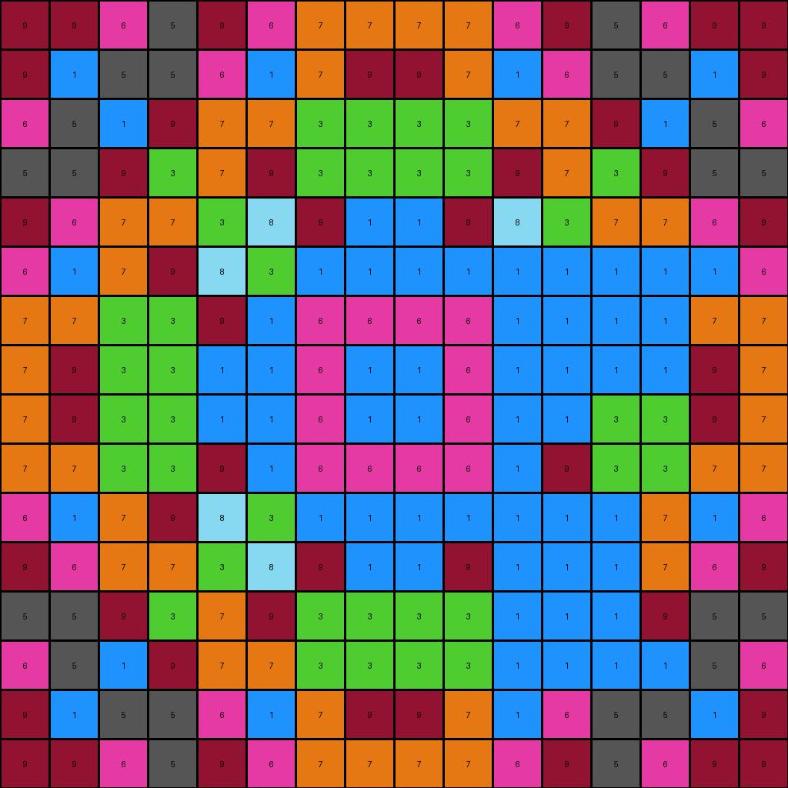
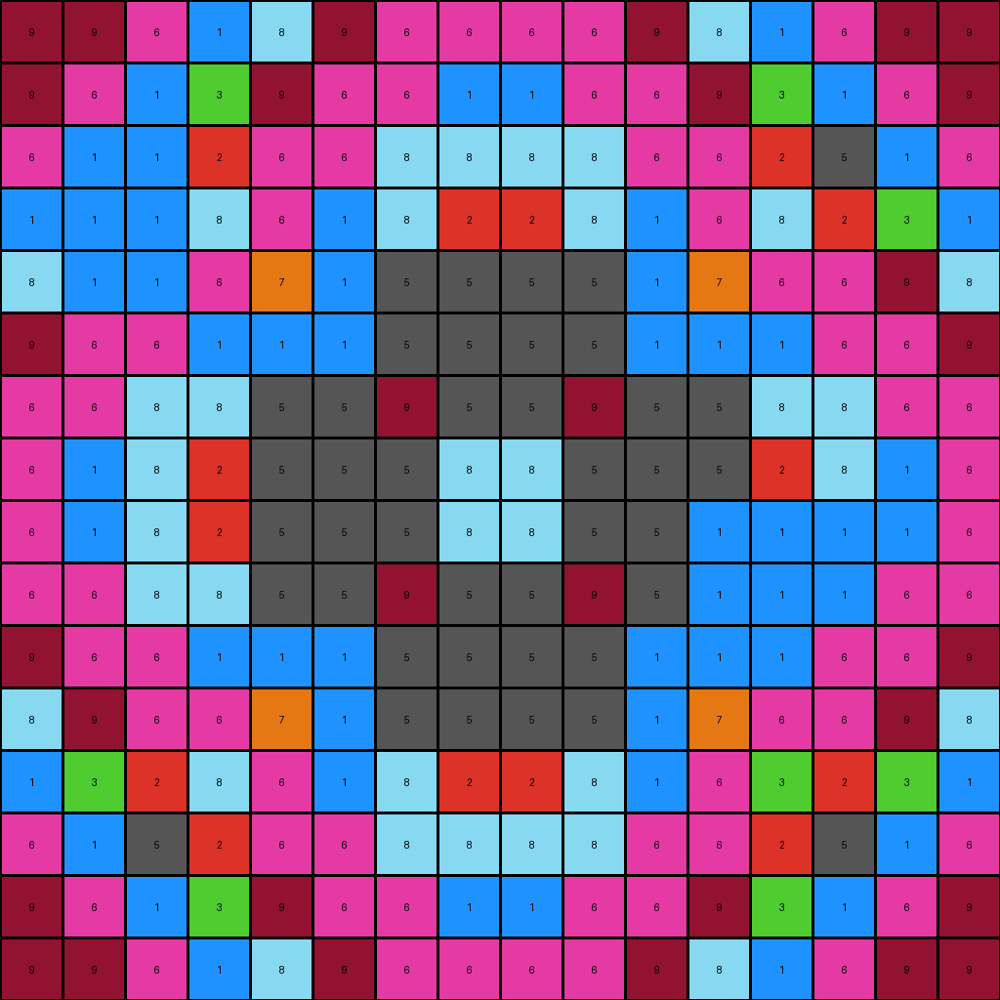
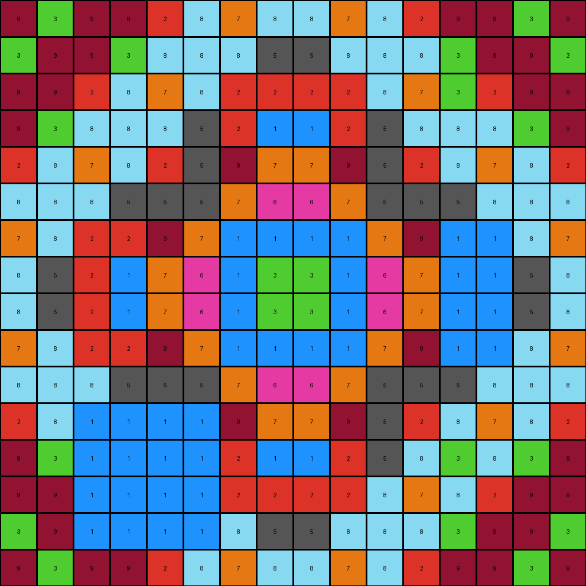
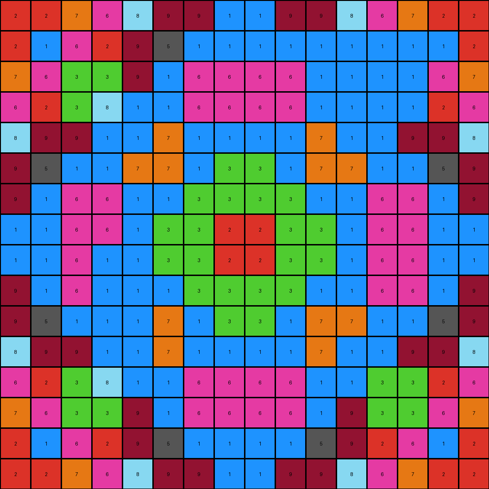

# b8825c91 • 021 • refine_dreamer

---


Previous Code:
```python
"""
1.  **Identify Target Region:** Locate the 5x5 square region in the input grid, starting at row 1, column 11.
2.  **Conditional Replacement:**
    *   Iterate through each pixel within the 5x5 square.
    *   If a pixel's color is yellow (4), change it to blue (1).
    *   If the pixel at (r,c) = (1,13) is azure(8) change to gray (5).
    *   If the pixel at (r,c) = (2,12) is azure(8) change to green (3).
    *   If the pixel at (r,c) = (12,12) is azure(8) change to green (3).
    *    If the pixel at (r,c) = (3,14) is azure(8) change to green (3).
    *    If the pixel at (r,c) = (13,11) is azure(8) change to gray (5).
    *   If the pixel at (r,c) = (13,13) is azure (8) change to maroon(9).
    *   If the pixel at (r,c) = (14,12) is azure (8) change to maroon(9).
3.  **Preserve Outside Pixels:** Leave all pixels outside the identified 5x5 region unchanged.
"""

import numpy as np

def transform(input_grid):
    # initialize output_grid
    output_grid = np.copy(input_grid)
    
    # Iterate through the 5x5 square
    for i in range(16):  # Assuming the grid might be up to 30x30.
        for j in range(16):
            #   Conditional Replacement within the 5x5 square
            if i >= 0 and i < 16 and j>= 0 and j < 16:
                if input_grid[i][j] == 4: #   If a pixel's color is yellow (4), change it to blue (1).
                    output_grid[i][j] = 1

    # Specific azure(8) replacements based on coordinates:
    if input_grid[1][13] == 8:
      output_grid[1][13] = 5  
    if input_grid[2][12] == 8:
      output_grid[2][12] = 3
    if input_grid[12][12] == 8:
      output_grid[12][12] = 3
    if input_grid[3][14] == 8:
      output_grid[3][14] = 3
    if input_grid[13][11] == 8:
      output_grid[13][11] = 5
    if input_grid[13][13] == 8:
      output_grid[13][13] = 9      
    if input_grid[14][12] == 8:
      output_grid[14][12] = 9
    
    # change output pixels

    return output_grid
```

Train Set Results:

## Example 1:

Input:
```
9 9 6 5 9 6 7 7 7 7 6 9 5 6 9 9
9 1 5 5 6 1 7 9 9 7 1 6 5 5 1 9
6 5 1 9 7 7 3 3 3 3 7 7 9 1 5 6
5 5 9 3 7 9 3 3 3 3 9 7 3 9 5 5
9 6 7 7 3 8 9 1 1 9 8 3 7 7 6 9
6 1 7 9 8 3 1 1 1 1 4 4 4 4 1 6
7 7 3 3 9 1 6 6 6 6 4 4 4 4 7 7
7 9 3 3 1 1 6 1 1 6 4 4 4 4 9 7
7 9 3 3 1 1 6 1 1 6 1 1 3 3 9 7
7 7 3 3 9 1 6 6 6 6 1 9 3 3 7 7
6 1 7 9 8 3 1 1 1 1 4 4 4 7 1 6
9 6 7 7 3 8 9 1 1 9 4 4 4 7 6 9
5 5 9 3 7 9 3 3 3 3 4 4 4 9 5 5
6 5 1 9 7 7 3 3 3 3 4 4 4 1 5 6
9 1 5 5 6 1 7 9 9 7 1 6 5 5 1 9
9 9 6 5 9 6 7 7 7 7 6 9 5 6 9 9
```
Expected Output:
```
9 9 6 5 9 6 7 7 7 7 6 9 5 6 9 9
9 1 5 5 6 1 7 9 9 7 1 6 5 5 1 9
6 5 1 9 7 7 3 3 3 3 7 7 9 1 5 6
5 5 9 3 7 9 3 3 3 3 9 7 3 9 5 5
9 6 7 7 3 8 9 1 1 9 8 3 7 7 6 9
6 1 7 9 8 3 1 1 1 1 3 8 9 7 1 6
7 7 3 3 9 1 6 6 6 6 1 9 3 3 7 7
7 9 3 3 1 1 6 1 1 6 1 1 3 3 9 7
7 9 3 3 1 1 6 1 1 6 1 1 3 3 9 7
7 7 3 3 9 1 6 6 6 6 1 9 3 3 7 7
6 1 7 9 8 3 1 1 1 1 3 8 9 7 1 6
9 6 7 7 3 8 9 1 1 9 8 3 7 7 6 9
5 5 9 3 7 9 3 3 3 3 9 7 3 9 5 5
6 5 1 9 7 7 3 3 3 3 7 7 9 1 5 6
9 1 5 5 6 1 7 9 9 7 1 6 5 5 1 9
9 9 6 5 9 6 7 7 7 7 6 9 5 6 9 9
```
Transformed Output:
```
9 9 6 5 9 6 7 7 7 7 6 9 5 6 9 9
9 1 5 5 6 1 7 9 9 7 1 6 5 5 1 9
6 5 1 9 7 7 3 3 3 3 7 7 9 1 5 6
5 5 9 3 7 9 3 3 3 3 9 7 3 9 5 5
9 6 7 7 3 8 9 1 1 9 8 3 7 7 6 9
6 1 7 9 8 3 1 1 1 1 1 1 1 1 1 6
7 7 3 3 9 1 6 6 6 6 1 1 1 1 7 7
7 9 3 3 1 1 6 1 1 6 1 1 1 1 9 7
7 9 3 3 1 1 6 1 1 6 1 1 3 3 9 7
7 7 3 3 9 1 6 6 6 6 1 9 3 3 7 7
6 1 7 9 8 3 1 1 1 1 1 1 1 7 1 6
9 6 7 7 3 8 9 1 1 9 1 1 1 7 6 9
5 5 9 3 7 9 3 3 3 3 1 1 1 9 5 5
6 5 1 9 7 7 3 3 3 3 1 1 1 1 5 6
9 1 5 5 6 1 7 9 9 7 1 6 5 5 1 9
9 9 6 5 9 6 7 7 7 7 6 9 5 6 9 9
```

match: False
pixels_off: 21
size_correct: True
color_palette_correct: True
correct_pixel_counts: False

## Example 2:

Input:
```
9 9 6 1 8 9 6 6 6 6 9 8 1 6 9 9
9 6 1 3 9 6 6 1 1 6 6 9 3 1 6 9
6 4 4 2 6 6 8 8 8 8 6 6 2 5 1 6
1 4 4 8 6 1 8 2 2 8 1 6 8 2 3 1
8 4 4 6 7 1 5 5 5 5 1 7 6 6 9 8
9 6 6 1 1 1 5 5 5 5 1 1 1 6 6 9
6 6 8 8 5 5 9 5 5 9 5 5 8 8 6 6
6 1 8 2 5 5 5 8 8 5 5 5 2 8 1 6
6 1 8 2 5 5 5 8 8 5 5 4 4 4 1 6
6 6 8 8 5 5 9 5 5 9 5 4 4 4 6 6
9 6 6 1 1 1 5 5 5 5 1 1 1 6 6 9
8 9 6 6 7 1 5 5 5 5 1 7 6 6 9 8
1 3 2 8 6 1 8 2 2 8 1 6 8 2 3 1
6 1 5 2 6 6 8 8 8 8 6 6 2 5 1 6
9 6 1 3 9 6 6 1 1 6 6 9 3 1 6 9
9 9 6 1 8 9 6 6 6 6 9 8 1 6 9 9
```
Expected Output:
```
9 9 6 1 8 9 6 6 6 6 9 8 1 6 9 9
9 6 1 3 9 6 6 1 1 6 6 9 3 1 6 9
6 1 5 2 6 6 8 8 8 8 6 6 2 5 1 6
1 3 2 8 6 1 8 2 2 8 1 6 8 2 3 1
8 9 6 6 7 1 5 5 5 5 1 7 6 6 9 8
9 6 6 1 1 1 5 5 5 5 1 1 1 6 6 9
6 6 8 8 5 5 9 5 5 9 5 5 8 8 6 6
6 1 8 2 5 5 5 8 8 5 5 5 2 8 1 6
6 1 8 2 5 5 5 8 8 5 5 5 2 8 1 6
6 6 8 8 5 5 9 5 5 9 5 5 8 8 6 6
9 6 6 1 1 1 5 5 5 5 1 1 1 6 6 9
8 9 6 6 7 1 5 5 5 5 1 7 6 6 9 8
1 3 2 8 6 1 8 2 2 8 1 6 8 2 3 1
6 1 5 2 6 6 8 8 8 8 6 6 2 5 1 6
9 6 1 3 9 6 6 1 1 6 6 9 3 1 6 9
9 9 6 1 8 9 6 6 6 6 9 8 1 6 9 9
```
Transformed Output:
```
9 9 6 1 8 9 6 6 6 6 9 8 1 6 9 9
9 6 1 3 9 6 6 1 1 6 6 9 3 1 6 9
6 1 1 2 6 6 8 8 8 8 6 6 2 5 1 6
1 1 1 8 6 1 8 2 2 8 1 6 8 2 3 1
8 1 1 6 7 1 5 5 5 5 1 7 6 6 9 8
9 6 6 1 1 1 5 5 5 5 1 1 1 6 6 9
6 6 8 8 5 5 9 5 5 9 5 5 8 8 6 6
6 1 8 2 5 5 5 8 8 5 5 5 2 8 1 6
6 1 8 2 5 5 5 8 8 5 5 1 1 1 1 6
6 6 8 8 5 5 9 5 5 9 5 1 1 1 6 6
9 6 6 1 1 1 5 5 5 5 1 1 1 6 6 9
8 9 6 6 7 1 5 5 5 5 1 7 6 6 9 8
1 3 2 8 6 1 8 2 2 8 1 6 3 2 3 1
6 1 5 2 6 6 8 8 8 8 6 6 2 5 1 6
9 6 1 3 9 6 6 1 1 6 6 9 3 1 6 9
9 9 6 1 8 9 6 6 6 6 9 8 1 6 9 9
```

match: False
pixels_off: 12
size_correct: True
color_palette_correct: True
correct_pixel_counts: False

## Example 3:

Input:
```
9 3 9 9 2 8 7 8 8 7 8 2 9 9 3 9
3 9 9 3 8 8 8 5 5 8 8 8 3 9 9 3
9 9 2 8 7 8 2 2 2 2 8 7 8 2 9 9
9 3 8 8 8 5 2 1 1 2 5 8 8 8 3 9
2 8 7 8 2 5 9 7 7 9 5 2 8 7 8 2
8 8 8 5 5 5 7 6 6 7 5 5 5 8 8 8
7 8 2 2 9 7 1 1 1 1 7 9 4 4 8 7
8 5 2 1 7 6 1 3 3 1 6 7 4 4 5 8
8 5 2 1 7 6 1 3 3 1 6 7 4 4 5 8
7 8 2 2 9 7 1 1 1 1 7 9 4 4 8 7
8 8 8 5 5 5 7 6 6 7 5 5 5 8 8 8
2 8 4 4 4 4 9 7 7 9 5 2 8 7 8 2
9 3 4 4 4 4 2 1 1 2 5 8 8 8 3 9
9 9 4 4 4 4 2 2 2 2 8 7 8 2 9 9
3 9 4 4 4 4 8 5 5 8 8 8 3 9 9 3
9 3 9 9 2 8 7 8 8 7 8 2 9 9 3 9
```
Expected Output:
```
9 3 9 9 2 8 7 8 8 7 8 2 9 9 3 9
3 9 9 3 8 8 8 5 5 8 8 8 3 9 9 3
9 9 2 8 7 8 2 2 2 2 8 7 8 2 9 9
9 3 8 8 8 5 2 1 1 2 5 8 8 8 3 9
2 8 7 8 2 5 9 7 7 9 5 2 8 7 8 2
8 8 8 5 5 5 7 6 6 7 5 5 5 8 8 8
7 8 2 2 9 7 1 1 1 1 7 9 2 2 8 7
8 5 2 1 7 6 1 3 3 1 6 7 1 2 5 8
8 5 2 1 7 6 1 3 3 1 6 7 1 2 5 8
7 8 2 2 9 7 1 1 1 1 7 9 2 2 8 7
8 8 8 5 5 5 7 6 6 7 5 5 5 8 8 8
2 8 7 8 2 5 9 7 7 9 5 2 8 7 8 2
9 3 8 8 8 5 2 1 1 2 5 8 8 8 3 9
9 9 2 8 7 8 2 2 2 2 8 7 8 2 9 9
3 9 9 3 8 8 8 5 5 8 8 8 3 9 9 3
9 3 9 9 2 8 7 8 8 7 8 2 9 9 3 9
```
Transformed Output:
```
9 3 9 9 2 8 7 8 8 7 8 2 9 9 3 9
3 9 9 3 8 8 8 5 5 8 8 8 3 9 9 3
9 9 2 8 7 8 2 2 2 2 8 7 3 2 9 9
9 3 8 8 8 5 2 1 1 2 5 8 8 8 3 9
2 8 7 8 2 5 9 7 7 9 5 2 8 7 8 2
8 8 8 5 5 5 7 6 6 7 5 5 5 8 8 8
7 8 2 2 9 7 1 1 1 1 7 9 1 1 8 7
8 5 2 1 7 6 1 3 3 1 6 7 1 1 5 8
8 5 2 1 7 6 1 3 3 1 6 7 1 1 5 8
7 8 2 2 9 7 1 1 1 1 7 9 1 1 8 7
8 8 8 5 5 5 7 6 6 7 5 5 5 8 8 8
2 8 1 1 1 1 9 7 7 9 5 2 8 7 8 2
9 3 1 1 1 1 2 1 1 2 5 8 3 8 3 9
9 9 1 1 1 1 2 2 2 2 8 7 8 2 9 9
3 9 1 1 1 1 8 5 5 8 8 8 3 9 9 3
9 3 9 9 2 8 7 8 8 7 8 2 9 9 3 9
```

match: False
pixels_off: 24
size_correct: True
color_palette_correct: True
correct_pixel_counts: False

## Example 4:

Input:
```
2 2 7 6 8 9 9 1 1 9 9 8 6 7 2 2
2 1 6 2 9 5 1 1 1 1 4 4 4 4 1 2
7 6 3 3 9 1 6 6 6 6 4 4 4 4 6 7
6 2 3 8 1 1 6 6 6 6 4 4 4 4 2 6
8 9 9 1 1 7 1 1 1 1 7 1 1 9 9 8
9 5 1 1 7 7 1 3 3 1 7 7 1 1 5 9
9 1 6 6 1 1 3 3 3 3 1 1 6 6 1 9
1 1 6 6 1 3 3 2 2 3 3 1 6 6 1 1
1 1 6 4 4 3 3 2 2 3 3 1 6 6 1 1
9 1 6 4 4 1 3 3 3 3 1 1 6 6 1 9
9 5 1 4 4 7 1 3 3 1 7 7 1 1 5 9
8 9 9 1 1 7 1 1 1 1 7 1 1 9 9 8
6 2 3 8 1 1 6 6 6 6 1 1 8 3 2 6
7 6 3 3 9 1 6 6 6 6 1 9 3 3 6 7
2 1 6 2 9 5 1 1 1 1 5 9 2 6 1 2
2 2 7 6 8 9 9 1 1 9 9 8 6 7 2 2
```
Expected Output:
```
2 2 7 6 8 9 9 1 1 9 9 8 6 7 2 2
2 1 6 2 9 5 1 1 1 1 5 9 2 6 1 2
7 6 3 3 9 1 6 6 6 6 1 9 3 3 6 7
6 2 3 8 1 1 6 6 6 6 1 1 8 3 2 6
8 9 9 1 1 7 1 1 1 1 7 1 1 9 9 8
9 5 1 1 7 7 1 3 3 1 7 7 1 1 5 9
9 1 6 6 1 1 3 3 3 3 1 1 6 6 1 9
1 1 6 6 1 3 3 2 2 3 3 1 6 6 1 1
1 1 6 6 1 3 3 2 2 3 3 1 6 6 1 1
9 1 6 6 1 1 3 3 3 3 1 1 6 6 1 9
9 5 1 1 7 7 1 3 3 1 7 7 1 1 5 9
8 9 9 1 1 7 1 1 1 1 7 1 1 9 9 8
6 2 3 8 1 1 6 6 6 6 1 1 8 3 2 6
7 6 3 3 9 1 6 6 6 6 1 9 3 3 6 7
2 1 6 2 9 5 1 1 1 1 5 9 2 6 1 2
2 2 7 6 8 9 9 1 1 9 9 8 6 7 2 2
```
Transformed Output:
```
2 2 7 6 8 9 9 1 1 9 9 8 6 7 2 2
2 1 6 2 9 5 1 1 1 1 1 1 1 1 1 2
7 6 3 3 9 1 6 6 6 6 1 1 1 1 6 7
6 2 3 8 1 1 6 6 6 6 1 1 1 1 2 6
8 9 9 1 1 7 1 1 1 1 7 1 1 9 9 8
9 5 1 1 7 7 1 3 3 1 7 7 1 1 5 9
9 1 6 6 1 1 3 3 3 3 1 1 6 6 1 9
1 1 6 6 1 3 3 2 2 3 3 1 6 6 1 1
1 1 6 1 1 3 3 2 2 3 3 1 6 6 1 1
9 1 6 1 1 1 3 3 3 3 1 1 6 6 1 9
9 5 1 1 1 7 1 3 3 1 7 7 1 1 5 9
8 9 9 1 1 7 1 1 1 1 7 1 1 9 9 8
6 2 3 8 1 1 6 6 6 6 1 1 3 3 2 6
7 6 3 3 9 1 6 6 6 6 1 9 3 3 6 7
2 1 6 2 9 5 1 1 1 1 5 9 2 6 1 2
2 2 7 6 8 9 9 1 1 9 9 8 6 7 2 2
```

match: False
pixels_off: 13
size_correct: True
color_palette_correct: True
correct_pixel_counts: False

**INSTRUCTIONS**

The code above was generated based on observations from the first training
example

we have tested the transform function on each of the task example inputs and
compared with the expected output

review each of the examples provided and the results and consider how the
natural language program should be updated to accommodate this new knowledge

respond with the following deliverables:

- general assessment of the information provided and strategy for resolving the
  errors
- gather metrics about each of the examples and results - use code_execution to
  develop accurate reports on your assumptions
- a YAML block documenting facts - Focus on identifying objects, their properties, and the actions performed on them.
- a natural language program - Be as clear and concise as possible, providing a complete description of the transformation rule.


your responses should be considered as information in a report - not a
conversation
