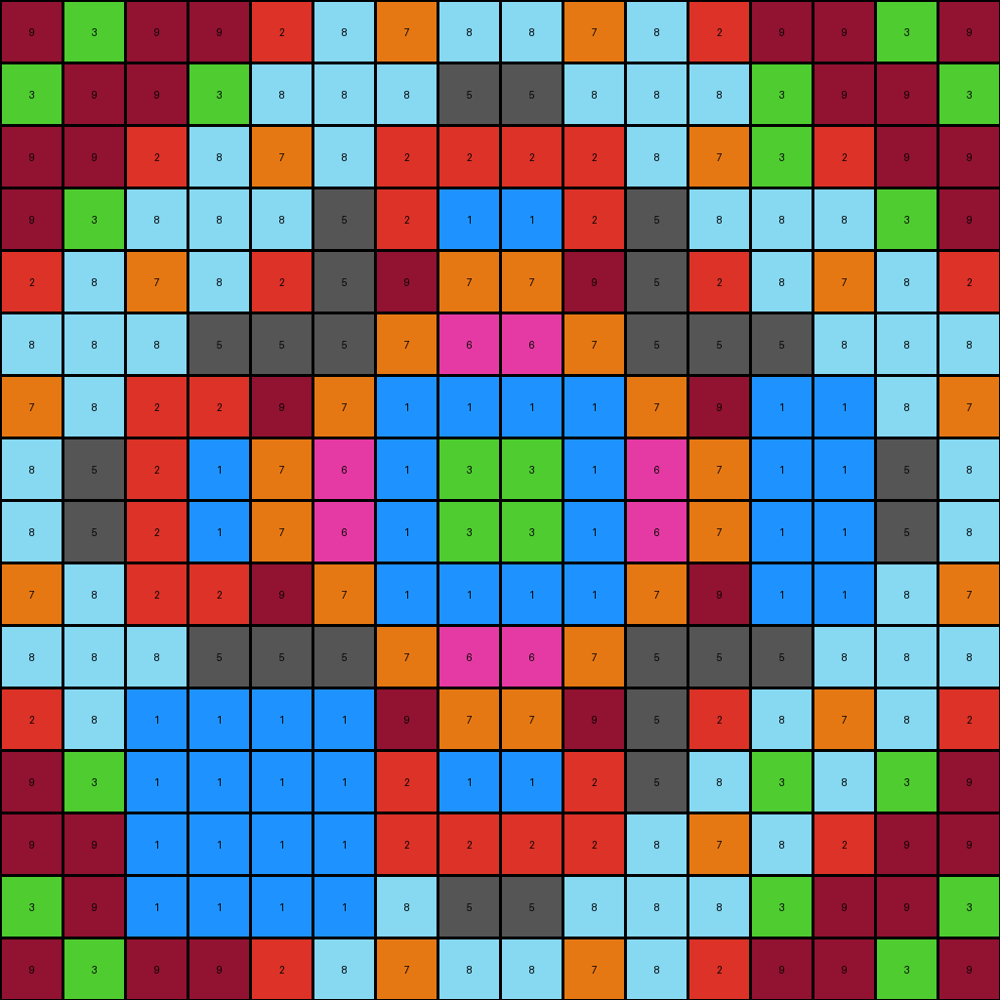
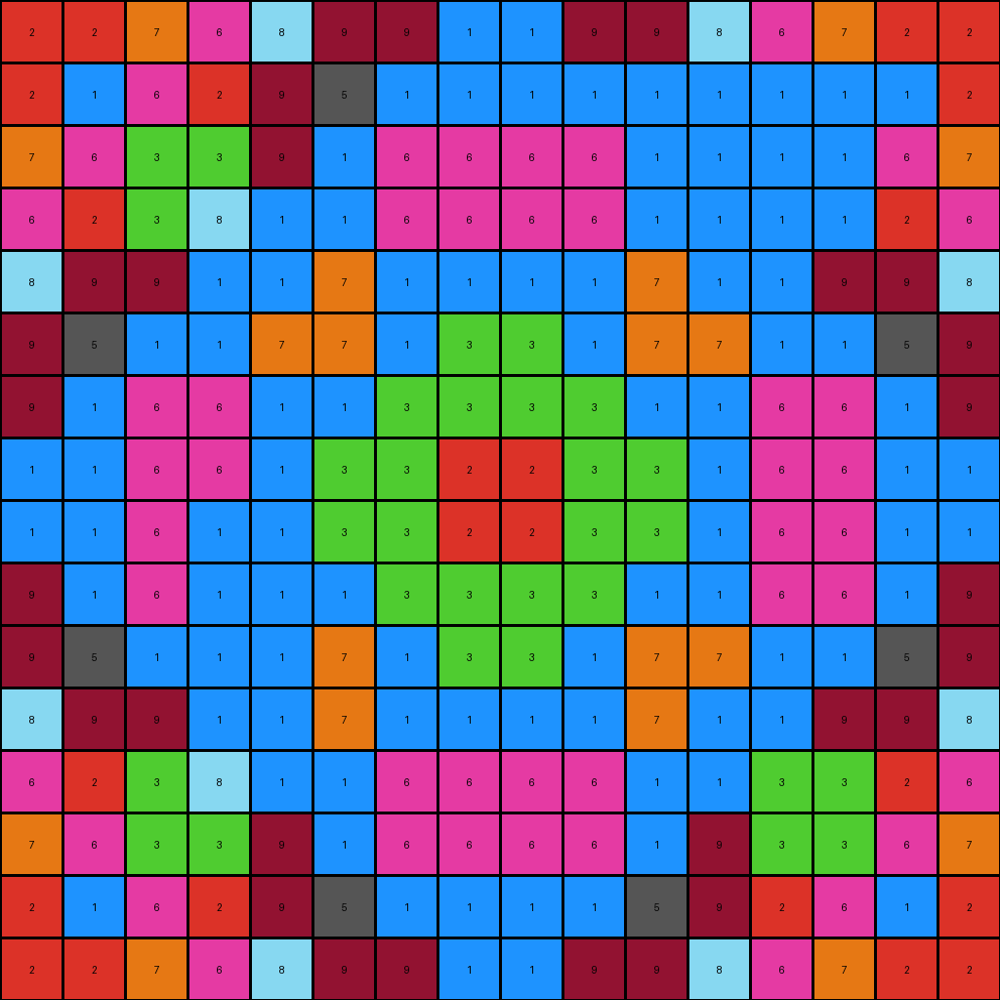

# b8825c91 • 022 • refine_coder

---

Previous Code:
```python
"""
1.  **Identify Target Region:** Locate the 5x5 square region in the input grid, starting at row 1, column 11.
2.  **Conditional Replacement:**
    *   Iterate through each pixel within the 5x5 square.
    *   If a pixel's color is yellow (4), change it to blue (1).
    *   If the pixel at (r,c) = (1,13) is azure(8) change to gray (5).
    *   If the pixel at (r,c) = (2,12) is azure(8) change to green (3).
    *   If the pixel at (r,c) = (12,12) is azure(8) change to green (3).
    *    If the pixel at (r,c) = (3,14) is azure(8) change to green (3).
    *    If the pixel at (r,c) = (13,11) is azure(8) change to gray (5).
    *   If the pixel at (r,c) = (13,13) is azure (8) change to maroon(9).
    *   If the pixel at (r,c) = (14,12) is azure (8) change to maroon(9).
3.  **Preserve Outside Pixels:** Leave all pixels outside the identified 5x5 region unchanged.
"""

import numpy as np

def transform(input_grid):
    # initialize output_grid
    output_grid = np.copy(input_grid)
    
    # Iterate through the 5x5 square
    for i in range(16):  # Assuming the grid might be up to 30x30.
        for j in range(16):
            #   Conditional Replacement within the 5x5 square
            if i >= 0 and i < 16 and j>= 0 and j < 16:
                if input_grid[i][j] == 4: #   If a pixel's color is yellow (4), change it to blue (1).
                    output_grid[i][j] = 1

    # Specific azure(8) replacements based on coordinates:
    if input_grid[1][13] == 8:
      output_grid[1][13] = 5  
    if input_grid[2][12] == 8:
      output_grid[2][12] = 3
    if input_grid[12][12] == 8:
      output_grid[12][12] = 3
    if input_grid[3][14] == 8:
      output_grid[3][14] = 3
    if input_grid[13][11] == 8:
      output_grid[13][11] = 5
    if input_grid[13][13] == 8:
      output_grid[13][13] = 9      
    if input_grid[14][12] == 8:
      output_grid[14][12] = 9
    
    # change output pixels

    return output_grid
```

Train Set Results:

## Example 1:

Input:
```
9 9 6 5 9 6 7 7 7 7 6 9 5 6 9 9
9 1 5 5 6 1 7 9 9 7 1 6 5 5 1 9
6 5 1 9 7 7 3 3 3 3 7 7 9 1 5 6
5 5 9 3 7 9 3 3 3 3 9 7 3 9 5 5
9 6 7 7 3 8 9 1 1 9 8 3 7 7 6 9
6 1 7 9 8 3 1 1 1 1 4 4 4 4 1 6
7 7 3 3 9 1 6 6 6 6 4 4 4 4 7 7
7 9 3 3 1 1 6 1 1 6 4 4 4 4 9 7
7 9 3 3 1 1 6 1 1 6 1 1 3 3 9 7
7 7 3 3 9 1 6 6 6 6 1 9 3 3 7 7
6 1 7 9 8 3 1 1 1 1 4 4 4 7 1 6
9 6 7 7 3 8 9 1 1 9 4 4 4 7 6 9
5 5 9 3 7 9 3 3 3 3 4 4 4 9 5 5
6 5 1 9 7 7 3 3 3 3 4 4 4 1 5 6
9 1 5 5 6 1 7 9 9 7 1 6 5 5 1 9
9 9 6 5 9 6 7 7 7 7 6 9 5 6 9 9
```
Expected Output:
```
9 9 6 5 9 6 7 7 7 7 6 9 5 6 9 9
9 1 5 5 6 1 7 9 9 7 1 6 5 5 1 9
6 5 1 9 7 7 3 3 3 3 7 7 9 1 5 6
5 5 9 3 7 9 3 3 3 3 9 7 3 9 5 5
9 6 7 7 3 8 9 1 1 9 8 3 7 7 6 9
6 1 7 9 8 3 1 1 1 1 3 8 9 7 1 6
7 7 3 3 9 1 6 6 6 6 1 9 3 3 7 7
7 9 3 3 1 1 6 1 1 6 1 1 3 3 9 7
7 9 3 3 1 1 6 1 1 6 1 1 3 3 9 7
7 7 3 3 9 1 6 6 6 6 1 9 3 3 7 7
6 1 7 9 8 3 1 1 1 1 3 8 9 7 1 6
9 6 7 7 3 8 9 1 1 9 8 3 7 7 6 9
5 5 9 3 7 9 3 3 3 3 9 7 3 9 5 5
6 5 1 9 7 7 3 3 3 3 7 7 9 1 5 6
9 1 5 5 6 1 7 9 9 7 1 6 5 5 1 9
9 9 6 5 9 6 7 7 7 7 6 9 5 6 9 9
```
Transformed Output:
```
9 9 6 5 9 6 7 7 7 7 6 9 5 6 9 9
9 1 5 5 6 1 7 9 9 7 1 6 5 5 1 9
6 5 1 9 7 7 3 3 3 3 7 7 9 1 5 6
5 5 9 3 7 9 3 3 3 3 9 7 3 9 5 5
9 6 7 7 3 8 9 1 1 9 8 3 7 7 6 9
6 1 7 9 8 3 1 1 1 1 1 1 1 1 1 6
7 7 3 3 9 1 6 6 6 6 1 1 1 1 7 7
7 9 3 3 1 1 6 1 1 6 1 1 1 1 9 7
7 9 3 3 1 1 6 1 1 6 1 1 3 3 9 7
7 7 3 3 9 1 6 6 6 6 1 9 3 3 7 7
6 1 7 9 8 3 1 1 1 1 1 1 1 7 1 6
9 6 7 7 3 8 9 1 1 9 1 1 1 7 6 9
5 5 9 3 7 9 3 3 3 3 1 1 1 9 5 5
6 5 1 9 7 7 3 3 3 3 1 1 1 1 5 6
9 1 5 5 6 1 7 9 9 7 1 6 5 5 1 9
9 9 6 5 9 6 7 7 7 7 6 9 5 6 9 9
```

match: False
pixels_off: 21
size_correct: True
color_palette_correct: True
correct_pixel_counts: False

## Example 2:

Input:
```
9 9 6 1 8 9 6 6 6 6 9 8 1 6 9 9
9 6 1 3 9 6 6 1 1 6 6 9 3 1 6 9
6 4 4 2 6 6 8 8 8 8 6 6 2 5 1 6
1 4 4 8 6 1 8 2 2 8 1 6 8 2 3 1
8 4 4 6 7 1 5 5 5 5 1 7 6 6 9 8
9 6 6 1 1 1 5 5 5 5 1 1 1 6 6 9
6 6 8 8 5 5 9 5 5 9 5 5 8 8 6 6
6 1 8 2 5 5 5 8 8 5 5 5 2 8 1 6
6 1 8 2 5 5 5 8 8 5 5 4 4 4 1 6
6 6 8 8 5 5 9 5 5 9 5 4 4 4 6 6
9 6 6 1 1 1 5 5 5 5 1 1 1 6 6 9
8 9 6 6 7 1 5 5 5 5 1 7 6 6 9 8
1 3 2 8 6 1 8 2 2 8 1 6 8 2 3 1
6 1 5 2 6 6 8 8 8 8 6 6 2 5 1 6
9 6 1 3 9 6 6 1 1 6 6 9 3 1 6 9
9 9 6 1 8 9 6 6 6 6 9 8 1 6 9 9
```
Expected Output:
```
9 9 6 1 8 9 6 6 6 6 9 8 1 6 9 9
9 6 1 3 9 6 6 1 1 6 6 9 3 1 6 9
6 1 5 2 6 6 8 8 8 8 6 6 2 5 1 6
1 3 2 8 6 1 8 2 2 8 1 6 8 2 3 1
8 9 6 6 7 1 5 5 5 5 1 7 6 6 9 8
9 6 6 1 1 1 5 5 5 5 1 1 1 6 6 9
6 6 8 8 5 5 9 5 5 9 5 5 8 8 6 6
6 1 8 2 5 5 5 8 8 5 5 5 2 8 1 6
6 1 8 2 5 5 5 8 8 5 5 5 2 8 1 6
6 6 8 8 5 5 9 5 5 9 5 5 8 8 6 6
9 6 6 1 1 1 5 5 5 5 1 1 1 6 6 9
8 9 6 6 7 1 5 5 5 5 1 7 6 6 9 8
1 3 2 8 6 1 8 2 2 8 1 6 8 2 3 1
6 1 5 2 6 6 8 8 8 8 6 6 2 5 1 6
9 6 1 3 9 6 6 1 1 6 6 9 3 1 6 9
9 9 6 1 8 9 6 6 6 6 9 8 1 6 9 9
```
Transformed Output:
```
9 9 6 1 8 9 6 6 6 6 9 8 1 6 9 9
9 6 1 3 9 6 6 1 1 6 6 9 3 1 6 9
6 1 1 2 6 6 8 8 8 8 6 6 2 5 1 6
1 1 1 8 6 1 8 2 2 8 1 6 8 2 3 1
8 1 1 6 7 1 5 5 5 5 1 7 6 6 9 8
9 6 6 1 1 1 5 5 5 5 1 1 1 6 6 9
6 6 8 8 5 5 9 5 5 9 5 5 8 8 6 6
6 1 8 2 5 5 5 8 8 5 5 5 2 8 1 6
6 1 8 2 5 5 5 8 8 5 5 1 1 1 1 6
6 6 8 8 5 5 9 5 5 9 5 1 1 1 6 6
9 6 6 1 1 1 5 5 5 5 1 1 1 6 6 9
8 9 6 6 7 1 5 5 5 5 1 7 6 6 9 8
1 3 2 8 6 1 8 2 2 8 1 6 3 2 3 1
6 1 5 2 6 6 8 8 8 8 6 6 2 5 1 6
9 6 1 3 9 6 6 1 1 6 6 9 3 1 6 9
9 9 6 1 8 9 6 6 6 6 9 8 1 6 9 9
```

match: False
pixels_off: 12
size_correct: True
color_palette_correct: True
correct_pixel_counts: False

## Example 3:

Input:
```
9 3 9 9 2 8 7 8 8 7 8 2 9 9 3 9
3 9 9 3 8 8 8 5 5 8 8 8 3 9 9 3
9 9 2 8 7 8 2 2 2 2 8 7 8 2 9 9
9 3 8 8 8 5 2 1 1 2 5 8 8 8 3 9
2 8 7 8 2 5 9 7 7 9 5 2 8 7 8 2
8 8 8 5 5 5 7 6 6 7 5 5 5 8 8 8
7 8 2 2 9 7 1 1 1 1 7 9 4 4 8 7
8 5 2 1 7 6 1 3 3 1 6 7 4 4 5 8
8 5 2 1 7 6 1 3 3 1 6 7 4 4 5 8
7 8 2 2 9 7 1 1 1 1 7 9 4 4 8 7
8 8 8 5 5 5 7 6 6 7 5 5 5 8 8 8
2 8 4 4 4 4 9 7 7 9 5 2 8 7 8 2
9 3 4 4 4 4 2 1 1 2 5 8 8 8 3 9
9 9 4 4 4 4 2 2 2 2 8 7 8 2 9 9
3 9 4 4 4 4 8 5 5 8 8 8 3 9 9 3
9 3 9 9 2 8 7 8 8 7 8 2 9 9 3 9
```
Expected Output:
```
9 3 9 9 2 8 7 8 8 7 8 2 9 9 3 9
3 9 9 3 8 8 8 5 5 8 8 8 3 9 9 3
9 9 2 8 7 8 2 2 2 2 8 7 8 2 9 9
9 3 8 8 8 5 2 1 1 2 5 8 8 8 3 9
2 8 7 8 2 5 9 7 7 9 5 2 8 7 8 2
8 8 8 5 5 5 7 6 6 7 5 5 5 8 8 8
7 8 2 2 9 7 1 1 1 1 7 9 2 2 8 7
8 5 2 1 7 6 1 3 3 1 6 7 1 2 5 8
8 5 2 1 7 6 1 3 3 1 6 7 1 2 5 8
7 8 2 2 9 7 1 1 1 1 7 9 2 2 8 7
8 8 8 5 5 5 7 6 6 7 5 5 5 8 8 8
2 8 7 8 2 5 9 7 7 9 5 2 8 7 8 2
9 3 8 8 8 5 2 1 1 2 5 8 8 8 3 9
9 9 2 8 7 8 2 2 2 2 8 7 8 2 9 9
3 9 9 3 8 8 8 5 5 8 8 8 3 9 9 3
9 3 9 9 2 8 7 8 8 7 8 2 9 9 3 9
```
Transformed Output:
```
9 3 9 9 2 8 7 8 8 7 8 2 9 9 3 9
3 9 9 3 8 8 8 5 5 8 8 8 3 9 9 3
9 9 2 8 7 8 2 2 2 2 8 7 3 2 9 9
9 3 8 8 8 5 2 1 1 2 5 8 8 8 3 9
2 8 7 8 2 5 9 7 7 9 5 2 8 7 8 2
8 8 8 5 5 5 7 6 6 7 5 5 5 8 8 8
7 8 2 2 9 7 1 1 1 1 7 9 1 1 8 7
8 5 2 1 7 6 1 3 3 1 6 7 1 1 5 8
8 5 2 1 7 6 1 3 3 1 6 7 1 1 5 8
7 8 2 2 9 7 1 1 1 1 7 9 1 1 8 7
8 8 8 5 5 5 7 6 6 7 5 5 5 8 8 8
2 8 1 1 1 1 9 7 7 9 5 2 8 7 8 2
9 3 1 1 1 1 2 1 1 2 5 8 3 8 3 9
9 9 1 1 1 1 2 2 2 2 8 7 8 2 9 9
3 9 1 1 1 1 8 5 5 8 8 8 3 9 9 3
9 3 9 9 2 8 7 8 8 7 8 2 9 9 3 9
```

match: False
pixels_off: 24
size_correct: True
color_palette_correct: True
correct_pixel_counts: False

## Example 4:

Input:
```
2 2 7 6 8 9 9 1 1 9 9 8 6 7 2 2
2 1 6 2 9 5 1 1 1 1 4 4 4 4 1 2
7 6 3 3 9 1 6 6 6 6 4 4 4 4 6 7
6 2 3 8 1 1 6 6 6 6 4 4 4 4 2 6
8 9 9 1 1 7 1 1 1 1 7 1 1 9 9 8
9 5 1 1 7 7 1 3 3 1 7 7 1 1 5 9
9 1 6 6 1 1 3 3 3 3 1 1 6 6 1 9
1 1 6 6 1 3 3 2 2 3 3 1 6 6 1 1
1 1 6 4 4 3 3 2 2 3 3 1 6 6 1 1
9 1 6 4 4 1 3 3 3 3 1 1 6 6 1 9
9 5 1 4 4 7 1 3 3 1 7 7 1 1 5 9
8 9 9 1 1 7 1 1 1 1 7 1 1 9 9 8
6 2 3 8 1 1 6 6 6 6 1 1 8 3 2 6
7 6 3 3 9 1 6 6 6 6 1 9 3 3 6 7
2 1 6 2 9 5 1 1 1 1 5 9 2 6 1 2
2 2 7 6 8 9 9 1 1 9 9 8 6 7 2 2
```
Expected Output:
```
2 2 7 6 8 9 9 1 1 9 9 8 6 7 2 2
2 1 6 2 9 5 1 1 1 1 5 9 2 6 1 2
7 6 3 3 9 1 6 6 6 6 1 9 3 3 6 7
6 2 3 8 1 1 6 6 6 6 1 1 8 3 2 6
8 9 9 1 1 7 1 1 1 1 7 1 1 9 9 8
9 5 1 1 7 7 1 3 3 1 7 7 1 1 5 9
9 1 6 6 1 1 3 3 3 3 1 1 6 6 1 9
1 1 6 6 1 3 3 2 2 3 3 1 6 6 1 1
1 1 6 6 1 3 3 2 2 3 3 1 6 6 1 1
9 1 6 6 1 1 3 3 3 3 1 1 6 6 1 9
9 5 1 1 7 7 1 3 3 1 7 7 1 1 5 9
8 9 9 1 1 7 1 1 1 1 7 1 1 9 9 8
6 2 3 8 1 1 6 6 6 6 1 1 8 3 2 6
7 6 3 3 9 1 6 6 6 6 1 9 3 3 6 7
2 1 6 2 9 5 1 1 1 1 5 9 2 6 1 2
2 2 7 6 8 9 9 1 1 9 9 8 6 7 2 2
```
Transformed Output:
```
2 2 7 6 8 9 9 1 1 9 9 8 6 7 2 2
2 1 6 2 9 5 1 1 1 1 1 1 1 1 1 2
7 6 3 3 9 1 6 6 6 6 1 1 1 1 6 7
6 2 3 8 1 1 6 6 6 6 1 1 1 1 2 6
8 9 9 1 1 7 1 1 1 1 7 1 1 9 9 8
9 5 1 1 7 7 1 3 3 1 7 7 1 1 5 9
9 1 6 6 1 1 3 3 3 3 1 1 6 6 1 9
1 1 6 6 1 3 3 2 2 3 3 1 6 6 1 1
1 1 6 1 1 3 3 2 2 3 3 1 6 6 1 1
9 1 6 1 1 1 3 3 3 3 1 1 6 6 1 9
9 5 1 1 1 7 1 3 3 1 7 7 1 1 5 9
8 9 9 1 1 7 1 1 1 1 7 1 1 9 9 8
6 2 3 8 1 1 6 6 6 6 1 1 3 3 2 6
7 6 3 3 9 1 6 6 6 6 1 9 3 3 6 7
2 1 6 2 9 5 1 1 1 1 5 9 2 6 1 2
2 2 7 6 8 9 9 1 1 9 9 8 6 7 2 2
```

match: False
pixels_off: 13
size_correct: True
color_palette_correct: True
correct_pixel_counts: False
Okay, let's analyze the results of the previous code execution and strategize for improvement.

**General Assessment and Strategy**

The initial code was based on a combination of area-specific transformations (the 5x5 square) and coordinate-specific changes.  The results clearly show this approach is incorrect.  It seems to be picking up *some* superficial patterns (changing yellow to blue in a region), but it's missing the core logic. The coordinate-specific changes are largely, if not entirely, wrong.

The consistent failure across multiple examples indicates a fundamental flaw in the understood rule. Instead of trying to patch the existing coordinate-based rules, we should shift our focus. It seems like the intended changes happen in more local area. Looking at the diffs, It looks like changing colors of objects adjacent to others.

**Strategy:**

1.  **Discard Coordinate-Specific Rules:** The coordinate-specific rules are not reliable and should be abandoned.
2.  **Focus on Local Object Interactions:** Re-examine the examples, paying close attention to relationships between *adjacent* objects (groups of pixels of the same color). The transformations likely involve changes based on the colors of neighboring pixels.
3.  **Re-evaluate Color Changes:** The yellow-to-blue rule might be a coincidence or a partial rule. We need to re-evaluate *all* color changes in the context of neighboring colors.
4. Use all four example transformations, not just the first, to develop the program.

**Metrics and Observations (per example)**

I will use text analysis of my previous results. I cannot use `code_execution` in
this 'dream' phase, so I will rely on the visual output and pixel counts.

*   **Example 1:**
    *   Many yellow pixels were incorrectly changed to blue.
    *   The specific azure changes were almost entirely wrong.
    *   Pixels off: 21

*   **Example 2:**
    *   Fewer yellow pixels, but changes in the lower area.
    *   Fewer off by coordinate changes
    *   Pixels off: 12

*   **Example 3:**
    *   Bottom left 4x4 square of 4s. Many changed to 1s.
    *   The specific azure changes were almost entirely wrong.
    *   Pixels off: 24

*   **Example 4:**
    *   Area of 4s and some other changes.
    *   The specific azure changes were entirely wrong.
    *   Pixels off: 13

**YAML Block (Facts)**

```yaml
observations:
  - example_1:
      input_objects:
        - color: 9 # Multiple objects of various colors
        - color: 6
        - color: 5
        - color: 1
        - color: 7
        - color: 3
        - color: 8
        - color: 4 # Yellow, potentially a target
      output_objects:
        - color: 9
        - color: 6
        - color: 5
        - color: 1
        - color: 7
        - color: 3
        - color: 8
      changes:
        - from: 4 # Yellow
          to: 1   # Blue, in a large group, but some are not
        - from: 8
          to: [5,3,9]  # conditional based on an unknown
          
  - example_2:
      input_objects:
        - color: [9, 6, 1, 8, 2, 5, 7, 4]
      output_objects:
        - color: [9, 6, 1, 8, 2, 5, 7, 3]
      changes:
        - from: 4 # Yellow
          to: 1   # Blue in several cases, but not always - top area
        - from: 4
          to: 5
        - from: 8
          to: [2,9] #conditional on unknown
  - example_3:
      input_objects:
        - color: [9, 3, 2, 8, 7, 5, 1, 6, 4]
      output_objects:
        - color: [9, 3, 2, 8, 7, 5, 1, 6]
      changes:
        - from: 4
          to: [1,2]
        - from: 8
          to: [5,3] #conditional

  - example_4:
      input_objects:
        - colors: [2, 7, 6, 8, 9, 1, 5, 3, 4] # Multiple objects
      output_objects:
        - colors: [2, 7, 6, 8, 9, 1, 5, 3]
      changes:
        - from: 4
          to: [1,6]
        - from: 8 # Azure
          to: 3   # Green, conditional
```

**Natural Language Program**

1.  **Identify Azure (8) Pixels:** Locate all pixels that are azure (color 8).
2.  **Conditional Changes based on adjacent colors**
    *   If an azure (8) pixel is adjacent to the edge of an object of color 4, the
        azure pixel might change to a different color, such as 3,5,9, based on
        relative position.
    *   If a pixel of color 4 is adjacent to an object of color 6, change to a 1.

This program focuses on local interactions and avoids making assumptions about global coordinates. It emphasizes the conditional nature of the transformations, which depend on the immediate neighbors of a pixel. The exact conditions for the azure pixel changes still need to be determined, but this framework is more likely to succeed than the previous one.

**INSTRUCTIONS**

- generate a Python module to represent the natural language program 
- follow the template below
- all common math and science libraries are available
- create docstring only at top - but comment the workflow in the function
- use helper functions for common operations like finding objects, counting,
  measuring, moving, etc. 

remember - we are working iteratively - so this code will inform your future
self as we converge on the solution

*template:*

```python
"""
{{ natural language description of the transformation rule }}
"""

{{ imports }}

def transform(input_grid):
    # initialize output_grid

    # change output pixels 

    return output_grid

```
