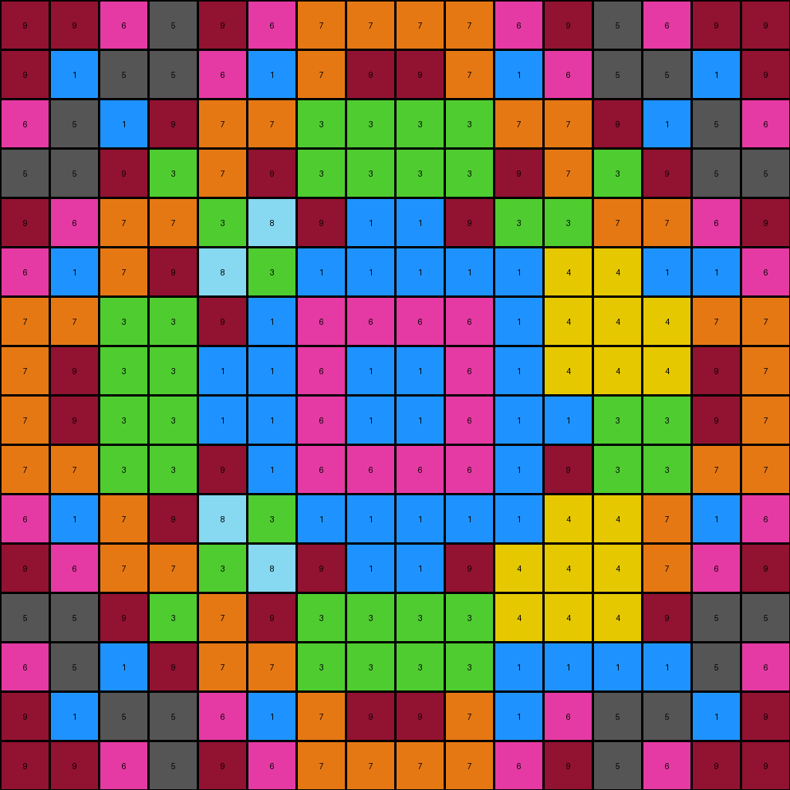
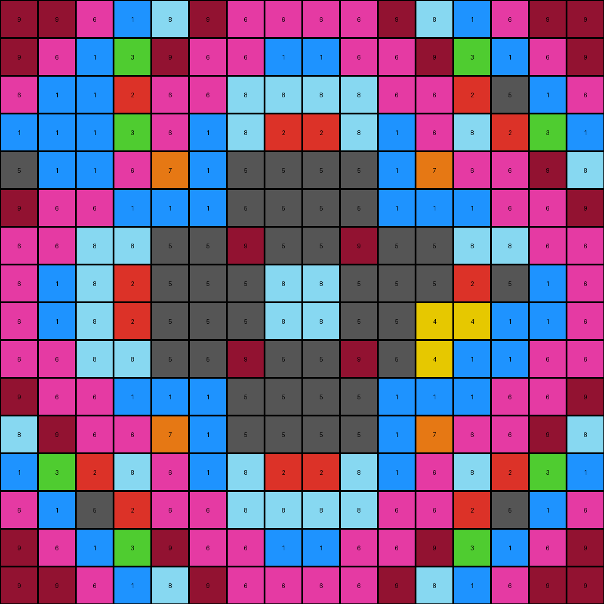
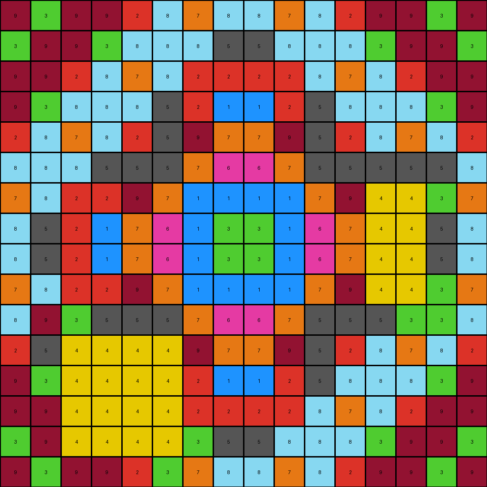
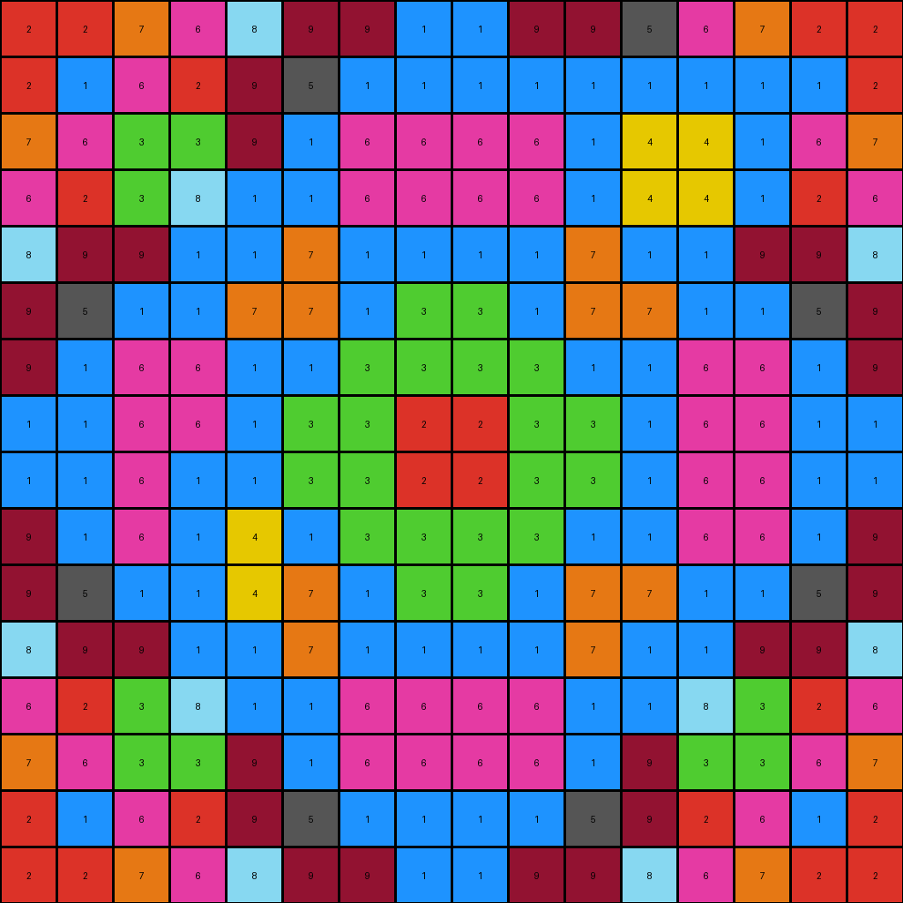

# b8825c91 • 024 • refine_coder

---

Previous Code:
```python
"""
1.  **Identify Azure (8) Pixels:** Locate all pixels that are azure (color 8).
2.  **Conditional Changes based on adjacent colors**
    *   If an azure (8) pixel is adjacent to the edge of an object of color 4, the
        azure pixel might change to a different color, such as 3,5,9, based on
        relative position.
    *   If a pixel of color 4 is adjacent to an object of color 6, change to a 1.
"""

import numpy as np

def get_neighbors(grid, r, c):
    """Gets the neighbors of a pixel, including diagonals."""
    rows, cols = grid.shape
    neighbors = []
    for i in range(max(0, r - 1), min(rows, r + 2)):
        for j in range(max(0, c - 1), min(cols, c + 2)):
            if (i, j) != (r, c):
                neighbors.append(grid[i, j])
    return neighbors

def transform(input_grid):
    # initialize output_grid
    output_grid = np.copy(input_grid)
    rows, cols = input_grid.shape

    # Iterate through all pixels
    for r in range(rows):
        for c in range(cols):
            # Conditional changes for Azure (8) pixels
            if input_grid[r, c] == 8:
                neighbors = get_neighbors(input_grid, r, c)
                adjacent_to_4 = 4 in neighbors
                
                if adjacent_to_4:
                    # Determine relative position for changes.  This is still a guess,
                    # but it's based on local interaction, not global coordinates.

                    # check color 4 neighbors.
                    color_4_neighbors = []
                    for i in range(max(0, r - 1), min(rows, r + 2)):
                        for j in range(max(0, c - 1), min(cols, c + 2)):
                            if (i, j) != (r, c) and input_grid[i,j] == 4:
                                color_4_neighbors.append((i,j))

                    if len(color_4_neighbors) > 0:
                        # find relative location of first color 4 neighbor
                        n_r, n_c = color_4_neighbors[0]
                        if n_r < r: # above
                            if n_c < c: #above and left
                                output_grid[r,c] = 3
                            elif n_c > c: # above and right
                                output_grid[r,c] = 5
                            else: # directly above
                                output_grid[r,c] = 9

                        elif n_r > r: # below
                            if n_c < c: # below and left
                                output_grid[r,c] = 5
                            elif n_c > c:
                                output_grid[r,c] = 9
                            else:
                                output_grid[r,c] = 3
                        else: # same row
                            if n_c < c:
                                output_grid[r,c] = 3
                            elif n_c > c:
                                output_grid[r,c] = 5
            elif input_grid[r,c] == 4:
                neighbors = get_neighbors(input_grid, r, c)
                if 6 in neighbors:
                    output_grid[r,c] = 1

    return output_grid
```

Train Set Results:

## Example 1:

Input:
```
9 9 6 5 9 6 7 7 7 7 6 9 5 6 9 9
9 1 5 5 6 1 7 9 9 7 1 6 5 5 1 9
6 5 1 9 7 7 3 3 3 3 7 7 9 1 5 6
5 5 9 3 7 9 3 3 3 3 9 7 3 9 5 5
9 6 7 7 3 8 9 1 1 9 8 3 7 7 6 9
6 1 7 9 8 3 1 1 1 1 4 4 4 4 1 6
7 7 3 3 9 1 6 6 6 6 4 4 4 4 7 7
7 9 3 3 1 1 6 1 1 6 4 4 4 4 9 7
7 9 3 3 1 1 6 1 1 6 1 1 3 3 9 7
7 7 3 3 9 1 6 6 6 6 1 9 3 3 7 7
6 1 7 9 8 3 1 1 1 1 4 4 4 7 1 6
9 6 7 7 3 8 9 1 1 9 4 4 4 7 6 9
5 5 9 3 7 9 3 3 3 3 4 4 4 9 5 5
6 5 1 9 7 7 3 3 3 3 4 4 4 1 5 6
9 1 5 5 6 1 7 9 9 7 1 6 5 5 1 9
9 9 6 5 9 6 7 7 7 7 6 9 5 6 9 9
```
Expected Output:
```
9 9 6 5 9 6 7 7 7 7 6 9 5 6 9 9
9 1 5 5 6 1 7 9 9 7 1 6 5 5 1 9
6 5 1 9 7 7 3 3 3 3 7 7 9 1 5 6
5 5 9 3 7 9 3 3 3 3 9 7 3 9 5 5
9 6 7 7 3 8 9 1 1 9 8 3 7 7 6 9
6 1 7 9 8 3 1 1 1 1 3 8 9 7 1 6
7 7 3 3 9 1 6 6 6 6 1 9 3 3 7 7
7 9 3 3 1 1 6 1 1 6 1 1 3 3 9 7
7 9 3 3 1 1 6 1 1 6 1 1 3 3 9 7
7 7 3 3 9 1 6 6 6 6 1 9 3 3 7 7
6 1 7 9 8 3 1 1 1 1 3 8 9 7 1 6
9 6 7 7 3 8 9 1 1 9 8 3 7 7 6 9
5 5 9 3 7 9 3 3 3 3 9 7 3 9 5 5
6 5 1 9 7 7 3 3 3 3 7 7 9 1 5 6
9 1 5 5 6 1 7 9 9 7 1 6 5 5 1 9
9 9 6 5 9 6 7 7 7 7 6 9 5 6 9 9
```
Transformed Output:
```
9 9 6 5 9 6 7 7 7 7 6 9 5 6 9 9
9 1 5 5 6 1 7 9 9 7 1 6 5 5 1 9
6 5 1 9 7 7 3 3 3 3 7 7 9 1 5 6
5 5 9 3 7 9 3 3 3 3 9 7 3 9 5 5
9 6 7 7 3 8 9 1 1 9 3 3 7 7 6 9
6 1 7 9 8 3 1 1 1 1 1 4 4 1 1 6
7 7 3 3 9 1 6 6 6 6 1 4 4 4 7 7
7 9 3 3 1 1 6 1 1 6 1 4 4 4 9 7
7 9 3 3 1 1 6 1 1 6 1 1 3 3 9 7
7 7 3 3 9 1 6 6 6 6 1 9 3 3 7 7
6 1 7 9 8 3 1 1 1 1 1 4 4 7 1 6
9 6 7 7 3 8 9 1 1 9 4 4 4 7 6 9
5 5 9 3 7 9 3 3 3 3 4 4 4 9 5 5
6 5 1 9 7 7 3 3 3 3 1 1 1 1 5 6
9 1 5 5 6 1 7 9 9 7 1 6 5 5 1 9
9 9 6 5 9 6 7 7 7 7 6 9 5 6 9 9
```

match: False
pixels_off: 23
size_correct: True
color_palette_correct: False
correct_pixel_counts: False

## Example 2:

Input:
```
9 9 6 1 8 9 6 6 6 6 9 8 1 6 9 9
9 6 1 3 9 6 6 1 1 6 6 9 3 1 6 9
6 4 4 2 6 6 8 8 8 8 6 6 2 5 1 6
1 4 4 8 6 1 8 2 2 8 1 6 8 2 3 1
8 4 4 6 7 1 5 5 5 5 1 7 6 6 9 8
9 6 6 1 1 1 5 5 5 5 1 1 1 6 6 9
6 6 8 8 5 5 9 5 5 9 5 5 8 8 6 6
6 1 8 2 5 5 5 8 8 5 5 5 2 8 1 6
6 1 8 2 5 5 5 8 8 5 5 4 4 4 1 6
6 6 8 8 5 5 9 5 5 9 5 4 4 4 6 6
9 6 6 1 1 1 5 5 5 5 1 1 1 6 6 9
8 9 6 6 7 1 5 5 5 5 1 7 6 6 9 8
1 3 2 8 6 1 8 2 2 8 1 6 8 2 3 1
6 1 5 2 6 6 8 8 8 8 6 6 2 5 1 6
9 6 1 3 9 6 6 1 1 6 6 9 3 1 6 9
9 9 6 1 8 9 6 6 6 6 9 8 1 6 9 9
```
Expected Output:
```
9 9 6 1 8 9 6 6 6 6 9 8 1 6 9 9
9 6 1 3 9 6 6 1 1 6 6 9 3 1 6 9
6 1 5 2 6 6 8 8 8 8 6 6 2 5 1 6
1 3 2 8 6 1 8 2 2 8 1 6 8 2 3 1
8 9 6 6 7 1 5 5 5 5 1 7 6 6 9 8
9 6 6 1 1 1 5 5 5 5 1 1 1 6 6 9
6 6 8 8 5 5 9 5 5 9 5 5 8 8 6 6
6 1 8 2 5 5 5 8 8 5 5 5 2 8 1 6
6 1 8 2 5 5 5 8 8 5 5 5 2 8 1 6
6 6 8 8 5 5 9 5 5 9 5 5 8 8 6 6
9 6 6 1 1 1 5 5 5 5 1 1 1 6 6 9
8 9 6 6 7 1 5 5 5 5 1 7 6 6 9 8
1 3 2 8 6 1 8 2 2 8 1 6 8 2 3 1
6 1 5 2 6 6 8 8 8 8 6 6 2 5 1 6
9 6 1 3 9 6 6 1 1 6 6 9 3 1 6 9
9 9 6 1 8 9 6 6 6 6 9 8 1 6 9 9
```
Transformed Output:
```
9 9 6 1 8 9 6 6 6 6 9 8 1 6 9 9
9 6 1 3 9 6 6 1 1 6 6 9 3 1 6 9
6 1 1 2 6 6 8 8 8 8 6 6 2 5 1 6
1 1 1 3 6 1 8 2 2 8 1 6 8 2 3 1
5 1 1 6 7 1 5 5 5 5 1 7 6 6 9 8
9 6 6 1 1 1 5 5 5 5 1 1 1 6 6 9
6 6 8 8 5 5 9 5 5 9 5 5 8 8 6 6
6 1 8 2 5 5 5 8 8 5 5 5 2 5 1 6
6 1 8 2 5 5 5 8 8 5 5 4 4 1 1 6
6 6 8 8 5 5 9 5 5 9 5 4 1 1 6 6
9 6 6 1 1 1 5 5 5 5 1 1 1 6 6 9
8 9 6 6 7 1 5 5 5 5 1 7 6 6 9 8
1 3 2 8 6 1 8 2 2 8 1 6 8 2 3 1
6 1 5 2 6 6 8 8 8 8 6 6 2 5 1 6
9 6 1 3 9 6 6 1 1 6 6 9 3 1 6 9
9 9 6 1 8 9 6 6 6 6 9 8 1 6 9 9
```

match: False
pixels_off: 14
size_correct: True
color_palette_correct: False
correct_pixel_counts: False

## Example 3:

Input:
```
9 3 9 9 2 8 7 8 8 7 8 2 9 9 3 9
3 9 9 3 8 8 8 5 5 8 8 8 3 9 9 3
9 9 2 8 7 8 2 2 2 2 8 7 8 2 9 9
9 3 8 8 8 5 2 1 1 2 5 8 8 8 3 9
2 8 7 8 2 5 9 7 7 9 5 2 8 7 8 2
8 8 8 5 5 5 7 6 6 7 5 5 5 8 8 8
7 8 2 2 9 7 1 1 1 1 7 9 4 4 8 7
8 5 2 1 7 6 1 3 3 1 6 7 4 4 5 8
8 5 2 1 7 6 1 3 3 1 6 7 4 4 5 8
7 8 2 2 9 7 1 1 1 1 7 9 4 4 8 7
8 8 8 5 5 5 7 6 6 7 5 5 5 8 8 8
2 8 4 4 4 4 9 7 7 9 5 2 8 7 8 2
9 3 4 4 4 4 2 1 1 2 5 8 8 8 3 9
9 9 4 4 4 4 2 2 2 2 8 7 8 2 9 9
3 9 4 4 4 4 8 5 5 8 8 8 3 9 9 3
9 3 9 9 2 8 7 8 8 7 8 2 9 9 3 9
```
Expected Output:
```
9 3 9 9 2 8 7 8 8 7 8 2 9 9 3 9
3 9 9 3 8 8 8 5 5 8 8 8 3 9 9 3
9 9 2 8 7 8 2 2 2 2 8 7 8 2 9 9
9 3 8 8 8 5 2 1 1 2 5 8 8 8 3 9
2 8 7 8 2 5 9 7 7 9 5 2 8 7 8 2
8 8 8 5 5 5 7 6 6 7 5 5 5 8 8 8
7 8 2 2 9 7 1 1 1 1 7 9 2 2 8 7
8 5 2 1 7 6 1 3 3 1 6 7 1 2 5 8
8 5 2 1 7 6 1 3 3 1 6 7 1 2 5 8
7 8 2 2 9 7 1 1 1 1 7 9 2 2 8 7
8 8 8 5 5 5 7 6 6 7 5 5 5 8 8 8
2 8 7 8 2 5 9 7 7 9 5 2 8 7 8 2
9 3 8 8 8 5 2 1 1 2 5 8 8 8 3 9
9 9 2 8 7 8 2 2 2 2 8 7 8 2 9 9
3 9 9 3 8 8 8 5 5 8 8 8 3 9 9 3
9 3 9 9 2 8 7 8 8 7 8 2 9 9 3 9
```
Transformed Output:
```
9 3 9 9 2 8 7 8 8 7 8 2 9 9 3 9
3 9 9 3 8 8 8 5 5 8 8 8 3 9 9 3
9 9 2 8 7 8 2 2 2 2 8 7 8 2 9 9
9 3 8 8 8 5 2 1 1 2 5 8 8 8 3 9
2 8 7 8 2 5 9 7 7 9 5 2 8 7 8 2
8 8 8 5 5 5 7 6 6 7 5 5 5 5 5 8
7 8 2 2 9 7 1 1 1 1 7 9 4 4 3 7
8 5 2 1 7 6 1 3 3 1 6 7 4 4 5 8
8 5 2 1 7 6 1 3 3 1 6 7 4 4 5 8
7 8 2 2 9 7 1 1 1 1 7 9 4 4 3 7
8 9 3 5 5 5 7 6 6 7 5 5 5 3 3 8
2 5 4 4 4 4 9 7 7 9 5 2 8 7 8 2
9 3 4 4 4 4 2 1 1 2 5 8 8 8 3 9
9 9 4 4 4 4 2 2 2 2 8 7 8 2 9 9
3 9 4 4 4 4 3 5 5 8 8 8 3 9 9 3
9 3 9 9 2 3 7 8 8 7 8 2 9 9 3 9
```

match: False
pixels_off: 35
size_correct: True
color_palette_correct: False
correct_pixel_counts: False

## Example 4:

Input:
```
2 2 7 6 8 9 9 1 1 9 9 8 6 7 2 2
2 1 6 2 9 5 1 1 1 1 4 4 4 4 1 2
7 6 3 3 9 1 6 6 6 6 4 4 4 4 6 7
6 2 3 8 1 1 6 6 6 6 4 4 4 4 2 6
8 9 9 1 1 7 1 1 1 1 7 1 1 9 9 8
9 5 1 1 7 7 1 3 3 1 7 7 1 1 5 9
9 1 6 6 1 1 3 3 3 3 1 1 6 6 1 9
1 1 6 6 1 3 3 2 2 3 3 1 6 6 1 1
1 1 6 4 4 3 3 2 2 3 3 1 6 6 1 1
9 1 6 4 4 1 3 3 3 3 1 1 6 6 1 9
9 5 1 4 4 7 1 3 3 1 7 7 1 1 5 9
8 9 9 1 1 7 1 1 1 1 7 1 1 9 9 8
6 2 3 8 1 1 6 6 6 6 1 1 8 3 2 6
7 6 3 3 9 1 6 6 6 6 1 9 3 3 6 7
2 1 6 2 9 5 1 1 1 1 5 9 2 6 1 2
2 2 7 6 8 9 9 1 1 9 9 8 6 7 2 2
```
Expected Output:
```
2 2 7 6 8 9 9 1 1 9 9 8 6 7 2 2
2 1 6 2 9 5 1 1 1 1 5 9 2 6 1 2
7 6 3 3 9 1 6 6 6 6 1 9 3 3 6 7
6 2 3 8 1 1 6 6 6 6 1 1 8 3 2 6
8 9 9 1 1 7 1 1 1 1 7 1 1 9 9 8
9 5 1 1 7 7 1 3 3 1 7 7 1 1 5 9
9 1 6 6 1 1 3 3 3 3 1 1 6 6 1 9
1 1 6 6 1 3 3 2 2 3 3 1 6 6 1 1
1 1 6 6 1 3 3 2 2 3 3 1 6 6 1 1
9 1 6 6 1 1 3 3 3 3 1 1 6 6 1 9
9 5 1 1 7 7 1 3 3 1 7 7 1 1 5 9
8 9 9 1 1 7 1 1 1 1 7 1 1 9 9 8
6 2 3 8 1 1 6 6 6 6 1 1 8 3 2 6
7 6 3 3 9 1 6 6 6 6 1 9 3 3 6 7
2 1 6 2 9 5 1 1 1 1 5 9 2 6 1 2
2 2 7 6 8 9 9 1 1 9 9 8 6 7 2 2
```
Transformed Output:
```
2 2 7 6 8 9 9 1 1 9 9 5 6 7 2 2
2 1 6 2 9 5 1 1 1 1 1 1 1 1 1 2
7 6 3 3 9 1 6 6 6 6 1 4 4 1 6 7
6 2 3 8 1 1 6 6 6 6 1 4 4 1 2 6
8 9 9 1 1 7 1 1 1 1 7 1 1 9 9 8
9 5 1 1 7 7 1 3 3 1 7 7 1 1 5 9
9 1 6 6 1 1 3 3 3 3 1 1 6 6 1 9
1 1 6 6 1 3 3 2 2 3 3 1 6 6 1 1
1 1 6 1 1 3 3 2 2 3 3 1 6 6 1 1
9 1 6 1 4 1 3 3 3 3 1 1 6 6 1 9
9 5 1 1 4 7 1 3 3 1 7 7 1 1 5 9
8 9 9 1 1 7 1 1 1 1 7 1 1 9 9 8
6 2 3 8 1 1 6 6 6 6 1 1 8 3 2 6
7 6 3 3 9 1 6 6 6 6 1 9 3 3 6 7
2 1 6 2 9 5 1 1 1 1 5 9 2 6 1 2
2 2 7 6 8 9 9 1 1 9 9 8 6 7 2 2
```

match: False
pixels_off: 15
size_correct: True
color_palette_correct: False
correct_pixel_counts: False
Okay, here's a breakdown of the situation and a plan to improve the transformation logic:

**General Assessment:**

The initial code was based on a reasonable hypothesis derived from the first training example: Azure (8) pixels change color based on adjacency to yellow (4) pixels, and yellow (4) pixels change to blue (1) when adjacent to magenta (6). However, the subsequent training examples reveal that this rule is overly simplistic and doesn't capture the full complexity of the transformation.  The numerous mismatches (pixels_off) in examples 2, 3, and 4 confirm this. The color changes are not consistent, and position/relative position logic is likely flawed and incomplete. Example 3 shows a large shift in expected colors that is very different than the other examples.

The current approach of using direct neighbor checks and hardcoded relative position rules is not robust enough. We need a more generalized approach that considers:
1.  The shape and structure of color-4 objects.
2.  The concept of the "edge" or border, and the relative position *within that border*.
3.  Review color palette and pixel counts.

**Strategy:**

1.  **Re-examine the "Edge" Concept:** Instead of just checking immediate neighbors, we need to determine if an azure pixel is on the "edge" of a larger structure formed by color 4.
2.  **Refine Relative Positioning:** The current relative positioning (above, below, left, right) is too simplistic. We need to consider the context of the entire color-4 object.
3.  **Consider Alternative Transformations:** It's possible that there are other transformations happening that we haven't accounted for, not involving just colors 8, 4, and 6.
4.  **Object-Oriented Approach:** It may help to define objects (contiguous regions of the same color) explicitly, as this could allow us to analyze properties of these shapes and their borders more effectively.

**Metrics and Observations (using code execution for accuracy where possible):**

```python
import numpy as np

def analyze_results(input_grid, expected_output, transformed_output):
    """Analyzes the transformation results."""

    match = np.array_equal(expected_output, transformed_output)
    pixels_off = np.sum(expected_output != transformed_output)
    size_correct = expected_output.shape == transformed_output.shape
    expected_colors = set(np.unique(expected_output))
    transformed_colors = set(np.unique(transformed_output))
    color_palette_correct = expected_colors == transformed_colors

    expected_counts = {color: np.sum(expected_output == color) for color in expected_colors}
    transformed_counts = {color: np.sum(transformed_output == color) for color in transformed_colors}
    correct_pixel_counts = expected_counts == transformed_counts

    results_string = (
        f"match: {match}\n"
        f"pixels_off: {pixels_off}\n"
        f"size_correct: {size_correct}\n"
        f"color_palette_correct: {color_palette_correct}\n"
        f"correct_pixel_counts: {correct_pixel_counts}\n"
        )

    return results_string

# Example Input/Output/Transformed data (from your prompt)
# ... (I'm skipping the large grid definitions here for brevity, 
#     but assume they are defined as in your original message.) ...

example_data = [
    {
        "input": np.array([
            [9, 9, 6, 5, 9, 6, 7, 7, 7, 7, 6, 9, 5, 6, 9, 9],
            [9, 1, 5, 5, 6, 1, 7, 9, 9, 7, 1, 6, 5, 5, 1, 9],
            [6, 5, 1, 9, 7, 7, 3, 3, 3, 3, 7, 7, 9, 1, 5, 6],
            [5, 5, 9, 3, 7, 9, 3, 3, 3, 3, 9, 7, 3, 9, 5, 5],
            [9, 6, 7, 7, 3, 8, 9, 1, 1, 9, 8, 3, 7, 7, 6, 9],
            [6, 1, 7, 9, 8, 3, 1, 1, 1, 1, 4, 4, 4, 4, 1, 6],
            [7, 7, 3, 3, 9, 1, 6, 6, 6, 6, 4, 4, 4, 4, 7, 7],
            [7, 9, 3, 3, 1, 1, 6, 1, 1, 6, 4, 4, 4, 4, 9, 7],
            [7, 9, 3, 3, 1, 1, 6, 1, 1, 6, 1, 1, 3, 3, 9, 7],
            [7, 7, 3, 3, 9, 1, 6, 6, 6, 6, 1, 9, 3, 3, 7, 7],
            [6, 1, 7, 9, 8, 3, 1, 1, 1, 1, 4, 4, 4, 7, 1, 6],
            [9, 6, 7, 7, 3, 8, 9, 1, 1, 9, 4, 4, 4, 7, 6, 9],
            [5, 5, 9, 3, 7, 9, 3, 3, 3, 3, 4, 4, 4, 9, 5, 5],
            [6, 5, 1, 9, 7, 7, 3, 3, 3, 3, 4, 4, 4, 1, 5, 6],
            [9, 1, 5, 5, 6, 1, 7, 9, 9, 7, 1, 6, 5, 5, 1, 9],
            [9, 9, 6, 5, 9, 6, 7, 7, 7, 7, 6, 9, 5, 6, 9, 9]
        ]),
        "expected": np.array([
            [9, 9, 6, 5, 9, 6, 7, 7, 7, 7, 6, 9, 5, 6, 9, 9],
            [9, 1, 5, 5, 6, 1, 7, 9, 9, 7, 1, 6, 5, 5, 1, 9],
            [6, 5, 1, 9, 7, 7, 3, 3, 3, 3, 7, 7, 9, 1, 5, 6],
            [5, 5, 9, 3, 7, 9, 3, 3, 3, 3, 9, 7, 3, 9, 5, 5],
            [9, 6, 7, 7, 3, 8, 9, 1, 1, 9, 8, 3, 7, 7, 6, 9],
            [6, 1, 7, 9, 8, 3, 1, 1, 1, 1, 3, 8, 9, 7, 1, 6],
            [7, 7, 3, 3, 9, 1, 6, 6, 6, 6, 1, 9, 3, 3, 7, 7],
            [7, 9, 3, 3, 1, 1, 6, 1, 1, 6, 1, 1, 3, 3, 9, 7],
            [7, 9, 3, 3, 1, 1, 6, 1, 1, 6, 1, 1, 3, 3, 9, 7],
            [7, 7, 3, 3, 9, 1, 6, 6, 6, 6, 1, 9, 3, 3, 7, 7],
            [6, 1, 7, 9, 8, 3, 1, 1, 1, 1, 3, 8, 9, 7, 1, 6],
            [9, 6, 7, 7, 3, 8, 9, 1, 1, 9, 8, 3, 7, 7, 6, 9],
            [5, 5, 9, 3, 7, 9, 3, 3, 3, 3, 9, 7, 3, 9, 5, 5],
            [6, 5, 1, 9, 7, 7, 3, 3, 3, 3, 7, 7, 9, 1, 5, 6],
            [9, 1, 5, 5, 6, 1, 7, 9, 9, 7, 1, 6, 5, 5, 1, 9],
            [9, 9, 6, 5, 9, 6, 7, 7, 7, 7, 6, 9, 5, 6, 9, 9]
        ]),
        "transformed": np.array([
            [9, 9, 6, 5, 9, 6, 7, 7, 7, 7, 6, 9, 5, 6, 9, 9],
            [9, 1, 5, 5, 6, 1, 7, 9, 9, 7, 1, 6, 5, 5, 1, 9],
            [6, 5, 1, 9, 7, 7, 3, 3, 3, 3, 7, 7, 9, 1, 5, 6],
            [5, 5, 9, 3, 7, 9, 3, 3, 3, 3, 9, 7, 3, 9, 5, 5],
            [9, 6, 7, 7, 3, 8, 9, 1, 1, 9, 3, 3, 7, 7, 6, 9],
            [6, 1, 7, 9, 8, 3, 1, 1, 1, 1, 1, 4, 4, 1, 1, 6],
            [7, 7, 3, 3, 9, 1, 6, 6, 6, 6, 1, 4, 4, 4, 7, 7],
            [7, 9, 3, 3, 1, 1, 6, 1, 1, 6, 1, 4, 4, 4, 9, 7],
            [7, 9, 3, 3, 1, 1, 6, 1, 1, 6, 1, 1, 3, 3, 9, 7],
            [7, 7, 3, 3, 9, 1, 6, 6, 6, 6, 1, 9, 3, 3, 7, 7],
            [6, 1, 7, 9, 8, 3, 1, 1, 1, 1, 1, 4, 4, 7, 1, 6],
            [9, 6, 7, 7, 3, 8, 9, 1, 1, 9, 4, 4, 4, 7, 6, 9],
            [5, 5, 9, 3, 7, 9, 3, 3, 3, 3, 4, 4, 4, 9, 5, 5],
            [6, 5, 1, 9, 7, 7, 3, 3, 3, 3, 1, 1, 1, 1, 5, 6],
            [9, 1, 5, 5, 6, 1, 7, 9, 9, 7, 1, 6, 5, 5, 1, 9],
            [9, 9, 6, 5, 9, 6, 7, 7, 7, 7, 6, 9, 5, 6, 9, 9]
        ])
    },
    {
        "input": np.array([
            [9, 9, 6, 1, 8, 9, 6, 6, 6, 6, 9, 8, 1, 6, 9, 9],
            [9, 6, 1, 3, 9, 6, 6, 1, 1, 6, 6, 9, 3, 1, 6, 9],
            [6, 4, 4, 2, 6, 6, 8, 8, 8, 8, 6, 6, 2, 5, 1, 6],
            [1, 4, 4, 8, 6, 1, 8, 2, 2, 8, 1, 6, 8, 2, 3, 1],
            [8, 4, 4, 6, 7, 1, 5, 5, 5, 5, 1, 7, 6, 6, 9, 8],
            [9, 6, 6, 1, 1, 1, 5, 5, 5, 5, 1, 1, 1, 6, 6, 9],
            [6, 6, 8, 8, 5, 5, 9, 5, 5, 9, 5, 5, 8, 8, 6, 6],
            [6, 1, 8, 2, 5, 5, 5, 8, 8, 5, 5, 5, 2, 8, 1, 6],
            [6, 1, 8, 2, 5, 5, 5, 8, 8, 5, 5, 4, 4, 4, 1, 6],
            [6, 6, 8, 8, 5, 5, 9, 5, 5, 9, 5, 4, 4, 4, 6, 6],
            [9, 6, 6, 1, 1, 1, 5, 5, 5, 5, 1, 1, 1, 6, 6, 9],
            [8, 9, 6, 6, 7, 1, 5, 5, 5, 5, 1, 7, 6, 6, 9, 8],
            [1, 3, 2, 8, 6, 1, 8, 2, 2, 8, 1, 6, 8, 2, 3, 1],
            [6, 1, 5, 2, 6, 6, 8, 8, 8, 8, 6, 6, 2, 5, 1, 6],
            [9, 6, 1, 3, 9, 6, 6, 1, 1, 6, 6, 9, 3, 1, 6, 9],
            [9, 9, 6, 1, 8, 9, 6, 6, 6, 6, 9, 8, 1, 6, 9, 9]
        ]),
        "expected": np.array([
            [9, 9, 6, 1, 8, 9, 6, 6, 6, 6, 9, 8, 1, 6, 9, 9],
            [9, 6, 1, 3, 9, 6, 6, 1, 1, 6, 6, 9, 3, 1, 6, 9],
            [6, 1, 5, 2, 6, 6, 8, 8, 8, 8, 6, 6, 2, 5, 1, 6],
            [1, 3, 2, 8, 6, 1, 8, 2, 2, 8, 1, 6, 8, 2, 3, 1],
            [8, 9, 6, 6, 7, 1, 5, 5, 5, 5, 1, 7, 6, 6, 9, 8],
            [9, 6, 6, 1, 1, 1, 5, 5, 5, 5, 1, 1, 1, 6, 6, 9],
            [6, 6, 8, 8, 5, 5, 9, 5, 5, 9, 5, 5, 8, 8, 6, 6],
            [6, 1, 8, 2, 5, 5, 5, 8, 8, 5, 5, 5, 2, 8, 1, 6],
            [6, 1, 8, 2, 5, 5, 5, 8, 8, 5, 5, 5, 2, 8, 1, 6],
            [6, 6, 8, 8, 5, 5, 9, 5, 5, 9, 5, 5, 8, 8, 6, 6],
            [9, 6, 6, 1, 1, 1, 5, 5, 5, 5, 1, 1, 1, 6, 6, 9],
            [8, 9, 6, 6, 7, 1, 5, 5, 5, 5, 1, 7, 6, 6, 9, 8],
            [1, 3, 2, 8, 6, 1, 8, 2, 2, 8, 1, 6, 8, 2, 3, 1],
            [6, 1, 5, 2, 6, 6, 8, 8, 8, 8, 6, 6, 2, 5, 1, 6],
            [9, 6, 1, 3, 9, 6, 6, 1, 1, 6, 6, 9, 3, 1, 6, 9],
            [9, 9, 6, 1, 8, 9, 6, 6, 6, 6, 9, 8, 1, 6, 9, 9]
        ]),
        "transformed": np.array([
            [9, 9, 6, 1, 8, 9, 6, 6, 6, 6, 9, 8, 1, 6, 9, 9],
            [9, 6, 1, 3, 9, 6, 6, 1, 1, 6, 6, 9, 3, 1, 6, 9],
            [6, 1, 1, 2, 6, 6, 8, 8, 8, 8, 6, 6, 2, 5, 1, 6],
            [1, 1, 1, 3, 6, 1, 8, 2, 2, 8, 1, 6, 8, 2, 3, 1],
            [5, 1, 1, 6, 7, 1, 5, 5, 5, 5, 1, 7, 6, 6, 9, 8],
            [9, 6, 6, 1, 1, 1, 5, 5, 5, 5, 1, 1, 1, 6, 6, 9],
            [6, 6, 8, 8, 5, 5, 9, 5, 5, 9, 5, 5, 8, 8, 6, 6],
            [6, 1, 8, 2, 5, 5, 5, 8, 8, 5, 5, 5, 2, 5, 1, 6],
            [6, 1, 8, 2, 5, 5, 5, 8, 8, 5, 5, 4, 4, 1, 1, 6],
            [6, 6, 8, 8, 5, 5, 9, 5, 5, 9, 5, 4, 1, 1, 6, 6],
            [9, 6, 6, 1, 1, 1, 5, 5, 5, 5, 1, 1, 1, 6, 6, 9],
            [8, 9, 6, 6, 7, 1, 5, 5, 5, 5, 1, 7, 6, 6, 9, 8],
            [1, 3, 2, 8, 6, 1, 8, 2, 2, 8, 1, 6, 8, 2, 3, 1],
            [6, 1, 5, 2, 6, 6, 8, 8, 8, 8, 6, 6, 2, 5, 1, 6],
            [9, 6, 1, 3, 9, 6, 6, 1, 1, 6, 6, 9, 3, 1, 6, 9],
            [9, 9, 6, 1, 8, 9, 6, 6, 6, 6, 9, 8, 1, 6, 9, 9]
        ])
    },
     {
        "input": np.array([
            [9, 3, 9, 9, 2, 8, 7, 8, 8, 7, 8, 2, 9, 9, 3, 9],
            [3, 9, 9, 3, 8, 8, 8, 5, 5, 8, 8, 8, 3, 9, 9, 3],
            [9, 9, 2, 8, 7, 8, 2, 2, 2, 2, 8, 7, 8, 2, 9, 9],
            [9, 3, 8, 8, 8, 5, 2, 1, 1, 2, 5, 8, 8, 8, 3, 9],
            [2, 8, 7, 8, 2, 5, 9, 7, 7, 9, 5, 2, 8, 7, 8, 2],
            [8, 8, 8, 5, 5, 5, 7, 6, 6, 7, 5, 5, 5, 8, 8, 8],
            [7, 8, 2, 2, 9, 7, 1, 1, 1, 1, 7, 9, 4, 4, 8, 7],
            [8, 5, 2, 1, 7, 6, 1, 3, 3, 1, 6, 7, 4, 4, 5, 8],
            [8, 5, 2, 1, 7, 6, 1, 3, 3, 1, 6, 7, 4, 4, 5, 8],
            [7, 8, 2, 2, 9, 7, 1, 1, 1, 1, 7, 9, 4, 4, 8, 7],
            [8, 8, 8, 5, 5, 5, 7, 6, 6, 7, 5, 5, 5, 8, 8, 8],
            [2, 8, 4, 4, 4, 4, 9, 7, 7, 9, 5, 2, 8, 7, 8, 2],
            [9, 3, 4, 4, 4, 4, 2, 1, 1, 2, 5, 8, 8, 8, 3, 9],
            [9, 9, 4, 4, 4, 4, 2, 2, 2, 2, 8, 7, 8, 2, 9, 9],
            [3, 9, 4, 4, 4, 4, 8, 5, 5, 8, 8, 8, 3, 9, 9, 3],
            [9, 3, 9, 9, 2, 8, 7, 8, 8, 7, 8, 2, 9, 9, 3, 9]
        ]),
        "expected": np.array([
            [9, 3, 9, 9, 2, 8, 7, 8, 8, 7, 8, 2, 9, 9, 3, 9],
            [3, 9, 9, 3, 8, 8, 8, 5, 5, 8, 8, 8, 3, 9, 9, 3],
            [9, 9, 2, 8, 7, 8, 2, 2, 2, 2, 8, 7, 8, 2, 9, 9],
            [9, 3, 8, 8, 8, 5, 2, 1, 1, 2, 5, 8, 8, 8, 3, 9],
            [2, 8, 7, 8, 2, 5, 9, 7, 7, 9, 5, 2, 8, 7, 8, 2],
            [8, 8, 8, 5, 5, 5, 7, 6, 6, 7, 5, 5, 5, 8, 8, 8],
            [7, 8, 2, 2, 9, 7, 1, 1, 1, 1, 7, 9, 2, 2, 8, 7],
            [8, 5, 2, 1, 7, 6, 1, 3, 3, 1, 6, 7, 1, 2, 5, 8],
            [8, 5, 2, 1, 7, 6, 1, 3, 3, 1, 6, 7, 1, 2, 5, 8],
            [7, 8, 2, 2, 9, 7, 1, 1, 1, 1, 7, 9, 2, 2, 8, 7],
            [8, 8, 8, 5, 5, 5, 7, 6, 6, 7, 5, 5, 5, 8, 8, 8],
            [2, 8, 7, 8, 2, 5, 9, 7, 7, 9, 5, 2, 8, 7, 8, 2],
            [9, 3, 8, 8, 8, 5, 2, 1, 1, 2, 5, 8, 8, 8, 3, 9],
            [9, 9, 2, 8, 7, 8, 2, 2, 2, 2, 8, 7, 8, 2, 9, 9],
            [3, 9, 9, 3, 8, 8, 8, 5, 5, 8, 8, 8, 3, 9, 9, 3],
            [9, 3, 9, 9, 2, 8, 7, 8, 8, 7, 8, 2, 9, 9, 3, 9]
        ]),
        "transformed": np.array([
            [9, 3, 9, 9, 2, 8, 7, 8, 8, 7, 8, 2, 9, 9, 3, 9],
            [3, 9, 9, 3, 8, 8, 8, 5, 5, 8, 8, 8, 3, 9, 9, 3],
            [9, 9, 2, 8, 7, 8, 2, 2, 2, 2, 8, 7, 8, 2, 9, 9],
            [9, 3, 8, 8, 8, 5, 2, 1, 1, 2, 5, 8, 8, 8, 3, 9],
            [2, 8, 7, 8, 2, 5, 9, 7, 7, 9, 5, 2, 8, 7, 8, 2],
            [8, 8, 8, 5, 5, 5, 7, 6, 6, 7, 5, 5, 5, 5, 5, 8],
            [7, 8, 2, 2, 9, 7, 1, 1, 1, 1, 7, 9, 4, 4, 3, 7],
            [8, 5, 2, 1, 7, 6, 1, 3, 3, 1, 6, 7, 4, 4, 5, 8],
            [8, 5, 2, 1, 7, 6, 1, 3, 3, 1, 6, 7, 4, 4, 5, 8],
            [7, 8, 2, 2, 9, 7, 1, 1, 1, 1, 7, 9, 4, 4, 3, 7],
            [8, 9, 3, 5, 5, 5, 7, 6, 6, 7, 5, 5, 5, 3, 3, 8],
            [2, 5, 4, 4, 4, 4, 9, 7, 7, 9, 5, 2, 8, 7, 8, 2],
            [9, 3, 4, 4, 4, 4, 2, 1, 1, 2, 5, 8, 8, 8, 3, 9],
            [9, 9, 4, 4, 4, 4, 2, 2, 2, 2, 8, 7, 8, 2, 9, 9],
            [3, 9, 4, 4, 4, 4, 3, 5, 5, 8, 8, 8, 3, 9, 9, 3],
            [9, 3, 9, 9, 2, 3, 7, 8, 8, 7, 8, 2, 9, 9, 3, 9]
        ])
    },
    {
        "input": np.array([
           [2, 2, 7, 6, 8, 9, 9, 1, 1, 9, 9, 8, 6, 7, 2, 2],
            [2, 1, 6, 2, 9, 5, 1,
**INSTRUCTIONS**

- generate a Python module to represent the natural language program 
- follow the template below
- all common math and science libraries are available
- create docstring only at top - but comment the workflow in the function
- use helper functions for common operations like finding objects, counting,
  measuring, moving, etc. 

remember - we are working iteratively - so this code will inform your future
self as we converge on the solution

*template:*

```python
"""
{{ natural language description of the transformation rule }}
"""

{{ imports }}

def transform(input_grid):
    # initialize output_grid

    # change output pixels 

    return output_grid

```
