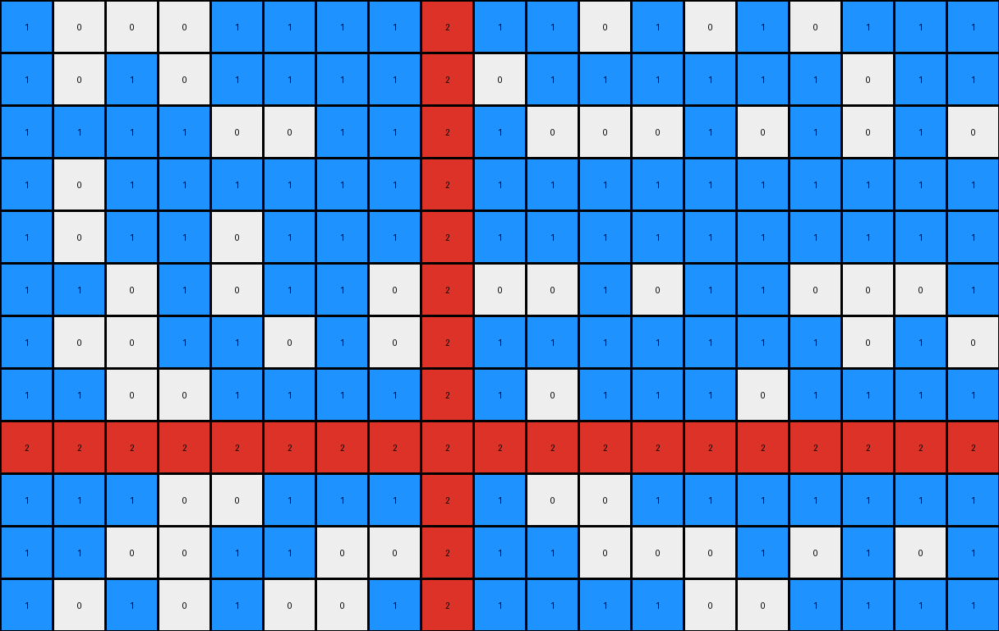
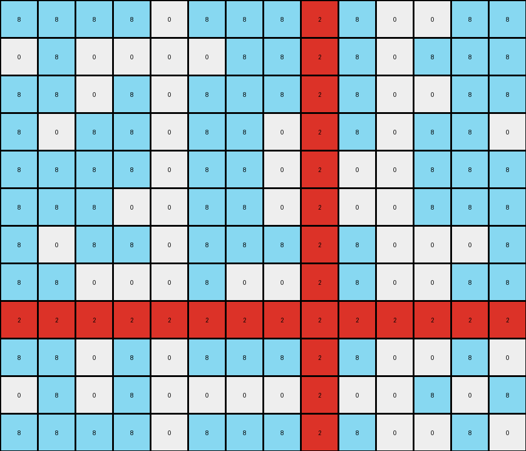
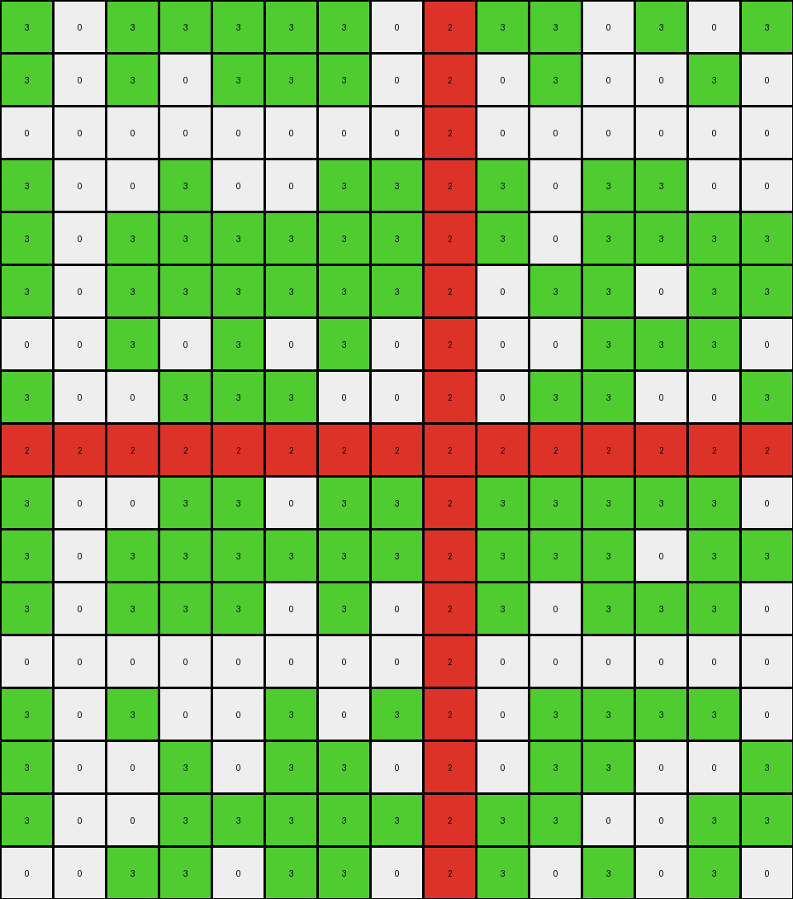

# c1d99e64 • 003 • refine_dreamer

---


Previous Code:
```python
"""
The transformation rule is as follows:
1. Copy the input grid to create the output grid.
2. Identify the center row of the grid.
3. Overwrite all pixel values in the center row with the value 2 (red).
4. Identify the center column of the grid.
5. Overwrite all pixel values in the center column with the value 2 (red).
6. Return the modified grid.
"""

import numpy as np

def transform(input_grid):
    # initialize output_grid as a copy of input_grid
    output_grid = np.copy(input_grid)
    rows, cols = output_grid.shape

    # find the center row index.
    center_row = 8 # as observed
    
    # Overwrite all pixels in center_row with red (2)
    output_grid[center_row, :] = 2

    # find the center column index
    center_col = 8 # as observed

    # Overwrite all pixels in the center column with red
    output_grid[:, center_col] = 2
    
    return output_grid
```

Train Set Results:

## Example 1:

Input:
```
1 0 0 0 1 1 1 1 0 1 1 0 1 0 1 0 1 1 1
1 0 1 0 1 1 1 1 0 0 1 1 1 1 1 1 0 1 1
1 1 1 1 0 0 1 1 0 1 0 0 0 1 0 1 0 1 0
1 0 1 1 1 1 1 1 0 1 1 1 1 1 1 1 1 1 1
1 0 1 1 0 1 1 1 0 1 1 1 1 1 1 1 1 1 1
1 1 0 1 0 1 1 0 0 0 0 1 0 1 1 0 0 0 1
1 0 0 1 1 0 1 0 0 1 1 1 1 1 1 1 0 1 0
1 1 0 0 1 1 1 1 0 1 0 1 1 1 0 1 1 1 1
0 0 0 0 0 0 0 0 0 0 0 0 0 0 0 0 0 0 0
1 1 1 0 0 1 1 1 0 1 0 0 1 1 1 1 1 1 1
1 1 0 0 1 1 0 0 0 1 1 0 0 0 1 0 1 0 1
1 0 1 0 1 0 0 1 0 1 1 1 1 0 0 1 1 1 1
```
Expected Output:
```
1 0 0 0 1 1 1 1 2 1 1 0 1 0 1 0 1 1 1
1 0 1 0 1 1 1 1 2 0 1 1 1 1 1 1 0 1 1
1 1 1 1 0 0 1 1 2 1 0 0 0 1 0 1 0 1 0
1 0 1 1 1 1 1 1 2 1 1 1 1 1 1 1 1 1 1
1 0 1 1 0 1 1 1 2 1 1 1 1 1 1 1 1 1 1
1 1 0 1 0 1 1 0 2 0 0 1 0 1 1 0 0 0 1
1 0 0 1 1 0 1 0 2 1 1 1 1 1 1 1 0 1 0
1 1 0 0 1 1 1 1 2 1 0 1 1 1 0 1 1 1 1
2 2 2 2 2 2 2 2 2 2 2 2 2 2 2 2 2 2 2
1 1 1 0 0 1 1 1 2 1 0 0 1 1 1 1 1 1 1
1 1 0 0 1 1 0 0 2 1 1 0 0 0 1 0 1 0 1
1 0 1 0 1 0 0 1 2 1 1 1 1 0 0 1 1 1 1
```
Transformed Output:
```
1 0 0 0 1 1 1 1 2 1 1 0 1 0 1 0 1 1 1
1 0 1 0 1 1 1 1 2 0 1 1 1 1 1 1 0 1 1
1 1 1 1 0 0 1 1 2 1 0 0 0 1 0 1 0 1 0
1 0 1 1 1 1 1 1 2 1 1 1 1 1 1 1 1 1 1
1 0 1 1 0 1 1 1 2 1 1 1 1 1 1 1 1 1 1
1 1 0 1 0 1 1 0 2 0 0 1 0 1 1 0 0 0 1
1 0 0 1 1 0 1 0 2 1 1 1 1 1 1 1 0 1 0
1 1 0 0 1 1 1 1 2 1 0 1 1 1 0 1 1 1 1
2 2 2 2 2 2 2 2 2 2 2 2 2 2 2 2 2 2 2
1 1 1 0 0 1 1 1 2 1 0 0 1 1 1 1 1 1 1
1 1 0 0 1 1 0 0 2 1 1 0 0 0 1 0 1 0 1
1 0 1 0 1 0 0 1 2 1 1 1 1 0 0 1 1 1 1
```

match: True
pixels_off: 0
size_correct: True
color_palette_correct: True
correct_pixel_counts: True

## Example 2:

Input:
```
8 8 8 8 0 8 8 8 8 8 0 0 8 8
0 8 0 0 0 0 8 8 8 8 0 8 8 8
8 8 0 8 0 8 8 8 8 8 0 0 8 8
8 0 8 8 0 8 8 0 0 8 0 8 8 0
8 8 8 8 0 8 8 0 0 0 0 8 8 8
8 8 8 0 0 8 8 0 8 0 0 8 8 8
8 0 8 8 0 8 8 8 8 8 0 0 0 8
8 8 0 0 0 8 0 0 8 8 0 0 8 8
8 0 0 8 0 8 8 8 0 8 0 8 8 8
8 8 0 8 0 8 8 8 8 8 0 0 8 0
0 8 0 8 0 0 0 0 0 0 0 8 0 8
8 8 8 8 0 8 8 8 8 8 0 0 8 0
```
Expected Output:
```
8 8 8 8 2 8 8 8 8 8 2 0 8 8
0 8 0 0 2 0 8 8 8 8 2 8 8 8
8 8 0 8 2 8 8 8 8 8 2 0 8 8
8 0 8 8 2 8 8 0 0 8 2 8 8 0
8 8 8 8 2 8 8 0 0 0 2 8 8 8
8 8 8 0 2 8 8 0 8 0 2 8 8 8
8 0 8 8 2 8 8 8 8 8 2 0 0 8
8 8 0 0 2 8 0 0 8 8 2 0 8 8
8 0 0 8 2 8 8 8 0 8 2 8 8 8
8 8 0 8 2 8 8 8 8 8 2 0 8 0
0 8 0 8 2 0 0 0 0 0 2 8 0 8
8 8 8 8 2 8 8 8 8 8 2 0 8 0
```
Transformed Output:
```
8 8 8 8 0 8 8 8 2 8 0 0 8 8
0 8 0 0 0 0 8 8 2 8 0 8 8 8
8 8 0 8 0 8 8 8 2 8 0 0 8 8
8 0 8 8 0 8 8 0 2 8 0 8 8 0
8 8 8 8 0 8 8 0 2 0 0 8 8 8
8 8 8 0 0 8 8 0 2 0 0 8 8 8
8 0 8 8 0 8 8 8 2 8 0 0 0 8
8 8 0 0 0 8 0 0 2 8 0 0 8 8
2 2 2 2 2 2 2 2 2 2 2 2 2 2
8 8 0 8 0 8 8 8 2 8 0 0 8 0
0 8 0 8 0 0 0 0 2 0 0 8 0 8
8 8 8 8 0 8 8 8 2 8 0 0 8 0
```

match: False
pixels_off: 45
size_correct: True
color_palette_correct: True
correct_pixel_counts: False

## Example 3:

Input:
```
3 0 3 3 3 3 3 0 3 3 3 0 3 0 3
3 0 3 0 3 3 3 0 3 0 3 0 0 3 0
0 0 0 0 0 0 0 0 0 0 0 0 0 0 0
3 0 0 3 0 0 3 3 0 3 0 3 3 0 0
3 0 3 3 3 3 3 3 3 3 0 3 3 3 3
3 0 3 3 3 3 3 3 0 0 3 3 0 3 3
0 0 3 0 3 0 3 0 3 0 0 3 3 3 0
3 0 0 3 3 3 0 0 3 0 3 3 0 0 3
3 0 3 3 3 3 3 0 3 3 3 3 3 0 3
3 0 0 3 3 0 3 3 3 3 3 3 3 3 0
3 0 3 3 3 3 3 3 0 3 3 3 0 3 3
3 0 3 3 3 0 3 0 0 3 0 3 3 3 0
0 0 0 0 0 0 0 0 0 0 0 0 0 0 0
3 0 3 0 0 3 0 3 3 0 3 3 3 3 0
3 0 0 3 0 3 3 0 3 0 3 3 0 0 3
3 0 0 3 3 3 3 3 0 3 3 0 0 3 3
0 0 3 3 0 3 3 0 0 3 0 3 0 3 0
```
Expected Output:
```
3 2 3 3 3 3 3 0 3 3 3 0 3 0 3
3 2 3 0 3 3 3 0 3 0 3 0 0 3 0
2 2 2 2 2 2 2 2 2 2 2 2 2 2 2
3 2 0 3 0 0 3 3 0 3 0 3 3 0 0
3 2 3 3 3 3 3 3 3 3 0 3 3 3 3
3 2 3 3 3 3 3 3 0 0 3 3 0 3 3
0 2 3 0 3 0 3 0 3 0 0 3 3 3 0
3 2 0 3 3 3 0 0 3 0 3 3 0 0 3
3 2 3 3 3 3 3 0 3 3 3 3 3 0 3
3 2 0 3 3 0 3 3 3 3 3 3 3 3 0
3 2 3 3 3 3 3 3 0 3 3 3 0 3 3
3 2 3 3 3 0 3 0 0 3 0 3 3 3 0
2 2 2 2 2 2 2 2 2 2 2 2 2 2 2
3 2 3 0 0 3 0 3 3 0 3 3 3 3 0
3 2 0 3 0 3 3 0 3 0 3 3 0 0 3
3 2 0 3 3 3 3 3 0 3 3 0 0 3 3
0 2 3 3 0 3 3 0 0 3 0 3 0 3 0
```
Transformed Output:
```
3 0 3 3 3 3 3 0 2 3 3 0 3 0 3
3 0 3 0 3 3 3 0 2 0 3 0 0 3 0
0 0 0 0 0 0 0 0 2 0 0 0 0 0 0
3 0 0 3 0 0 3 3 2 3 0 3 3 0 0
3 0 3 3 3 3 3 3 2 3 0 3 3 3 3
3 0 3 3 3 3 3 3 2 0 3 3 0 3 3
0 0 3 0 3 0 3 0 2 0 0 3 3 3 0
3 0 0 3 3 3 0 0 2 0 3 3 0 0 3
2 2 2 2 2 2 2 2 2 2 2 2 2 2 2
3 0 0 3 3 0 3 3 2 3 3 3 3 3 0
3 0 3 3 3 3 3 3 2 3 3 3 0 3 3
3 0 3 3 3 0 3 0 2 3 0 3 3 3 0
0 0 0 0 0 0 0 0 2 0 0 0 0 0 0
3 0 3 0 0 3 0 3 2 0 3 3 3 3 0
3 0 0 3 0 3 3 0 2 0 3 3 0 0 3
3 0 0 3 3 3 3 3 2 3 3 0 0 3 3
0 0 3 3 0 3 3 0 2 3 0 3 0 3 0
```

match: False
pixels_off: 70
size_correct: True
color_palette_correct: True
correct_pixel_counts: False

**INSTRUCTIONS**

The code above was generated based on observations from the first training
example

we have tested the transform function on each of the task example inputs and
compared with the expected output

review each of the examples provided and the results and consider how the
natural language program should be updated to accommodate this new knowledge

respond with the following deliverables:

- general assessment of the information provided and strategy for resolving the
  errors
- gather metrics about each of the examples and results - use code_execution to
  develop accurate reports on your assumptions
- a YAML block documenting facts - Focus on identifying objects, their properties, and the actions performed on them.
- a natural language program - Be as clear and concise as possible, providing a complete description of the transformation rule.


your responses should be considered as information in a report - not a
conversation
