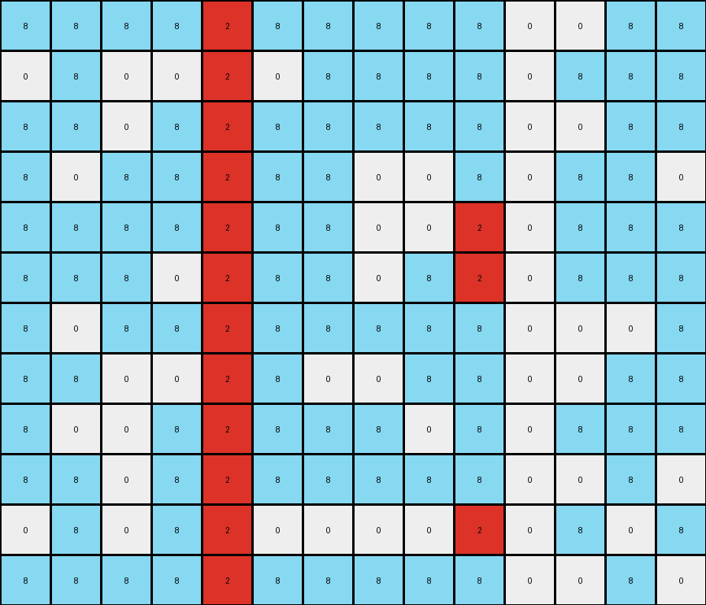

# c1d99e64 • 009 • refine_dreamer

---

Previous Code:
```python
"""
1.  **Initialization:** Start with the input grid.
2.  **Identify Target Pixels:** Identify all pixels in the grid that meet *both* of the following conditions:
    *   The pixel's color is white (0).
    *   The pixel's column index follows the pattern: column index mod 5 equals 4. That is starting at index 4 increment by 5 (4, 9, 14, 19, ...) .
3.  **Color Replacement:** For every pixel identified in step 2, change its color from white (0) to red (2).
4  **Preserve Other:** All other pixels retain their original color.
5.  **Output:** The modified grid is the output.
"""

import numpy as np

def transform(input_grid):
    """Transforms the input grid by changing white pixels to red in every 5th column, starting from the 5th."""
    output_grid = np.copy(input_grid)  # Initialize output grid
    rows, cols = output_grid.shape

    # Iterate through each pixel
    for r in range(rows):
        for c in range(cols):
            # Check conditions: color is white and column index mod 5 is 4
            if output_grid[r, c] == 0 and c % 5 == 4:
                # Replace white with red
                output_grid[r, c] = 2

    return output_grid
```

Train Set Results:

## Example 1:

Input:
```
1 0 0 0 1 1 1 1 0 1 1 0 1 0 1 0 1 1 1
1 0 1 0 1 1 1 1 0 0 1 1 1 1 1 1 0 1 1
1 1 1 1 0 0 1 1 0 1 0 0 0 1 0 1 0 1 0
1 0 1 1 1 1 1 1 0 1 1 1 1 1 1 1 1 1 1
1 0 1 1 0 1 1 1 0 1 1 1 1 1 1 1 1 1 1
1 1 0 1 0 1 1 0 0 0 0 1 0 1 1 0 0 0 1
1 0 0 1 1 0 1 0 0 1 1 1 1 1 1 1 0 1 0
1 1 0 0 1 1 1 1 0 1 0 1 1 1 0 1 1 1 1
0 0 0 0 0 0 0 0 0 0 0 0 0 0 0 0 0 0 0
1 1 1 0 0 1 1 1 0 1 0 0 1 1 1 1 1 1 1
1 1 0 0 1 1 0 0 0 1 1 0 0 0 1 0 1 0 1
1 0 1 0 1 0 0 1 0 1 1 1 1 0 0 1 1 1 1
```
Expected Output:
```
1 0 0 0 1 1 1 1 2 1 1 0 1 0 1 0 1 1 1
1 0 1 0 1 1 1 1 2 0 1 1 1 1 1 1 0 1 1
1 1 1 1 0 0 1 1 2 1 0 0 0 1 0 1 0 1 0
1 0 1 1 1 1 1 1 2 1 1 1 1 1 1 1 1 1 1
1 0 1 1 0 1 1 1 2 1 1 1 1 1 1 1 1 1 1
1 1 0 1 0 1 1 0 2 0 0 1 0 1 1 0 0 0 1
1 0 0 1 1 0 1 0 2 1 1 1 1 1 1 1 0 1 0
1 1 0 0 1 1 1 1 2 1 0 1 1 1 0 1 1 1 1
2 2 2 2 2 2 2 2 2 2 2 2 2 2 2 2 2 2 2
1 1 1 0 0 1 1 1 2 1 0 0 1 1 1 1 1 1 1
1 1 0 0 1 1 0 0 2 1 1 0 0 0 1 0 1 0 1
1 0 1 0 1 0 0 1 2 1 1 1 1 0 0 1 1 1 1
```
Transformed Output:
```
1 0 0 0 1 1 1 1 0 1 1 0 1 0 1 0 1 1 1
1 0 1 0 1 1 1 1 0 2 1 1 1 1 1 1 0 1 1
1 1 1 1 2 0 1 1 0 1 0 0 0 1 2 1 0 1 0
1 0 1 1 1 1 1 1 0 1 1 1 1 1 1 1 1 1 1
1 0 1 1 2 1 1 1 0 1 1 1 1 1 1 1 1 1 1
1 1 0 1 2 1 1 0 0 2 0 1 0 1 1 0 0 0 1
1 0 0 1 1 0 1 0 0 1 1 1 1 1 1 1 0 1 0
1 1 0 0 1 1 1 1 0 1 0 1 1 1 2 1 1 1 1
0 0 0 0 2 0 0 0 0 2 0 0 0 0 2 0 0 0 0
1 1 1 0 2 1 1 1 0 1 0 0 1 1 1 1 1 1 1
1 1 0 0 1 1 0 0 0 1 1 0 0 0 1 0 1 0 1
1 0 1 0 1 0 0 1 0 1 1 1 1 0 2 1 1 1 1
```

match: False
pixels_off: 36
size_correct: True
color_palette_correct: True
correct_pixel_counts: False

## Example 2:

Input:
```
8 8 8 8 0 8 8 8 8 8 0 0 8 8
0 8 0 0 0 0 8 8 8 8 0 8 8 8
8 8 0 8 0 8 8 8 8 8 0 0 8 8
8 0 8 8 0 8 8 0 0 8 0 8 8 0
8 8 8 8 0 8 8 0 0 0 0 8 8 8
8 8 8 0 0 8 8 0 8 0 0 8 8 8
8 0 8 8 0 8 8 8 8 8 0 0 0 8
8 8 0 0 0 8 0 0 8 8 0 0 8 8
8 0 0 8 0 8 8 8 0 8 0 8 8 8
8 8 0 8 0 8 8 8 8 8 0 0 8 0
0 8 0 8 0 0 0 0 0 0 0 8 0 8
8 8 8 8 0 8 8 8 8 8 0 0 8 0
```
Expected Output:
```
8 8 8 8 2 8 8 8 8 8 2 0 8 8
0 8 0 0 2 0 8 8 8 8 2 8 8 8
8 8 0 8 2 8 8 8 8 8 2 0 8 8
8 0 8 8 2 8 8 0 0 8 2 8 8 0
8 8 8 8 2 8 8 0 0 0 2 8 8 8
8 8 8 0 2 8 8 0 8 0 2 8 8 8
8 0 8 8 2 8 8 8 8 8 2 0 0 8
8 8 0 0 2 8 0 0 8 8 2 0 8 8
8 0 0 8 2 8 8 8 0 8 2 8 8 8
8 8 0 8 2 8 8 8 8 8 2 0 8 0
0 8 0 8 2 0 0 0 0 0 2 8 0 8
8 8 8 8 2 8 8 8 8 8 2 0 8 0
```
Transformed Output:
```
8 8 8 8 2 8 8 8 8 8 0 0 8 8
0 8 0 0 2 0 8 8 8 8 0 8 8 8
8 8 0 8 2 8 8 8 8 8 0 0 8 8
8 0 8 8 2 8 8 0 0 8 0 8 8 0
8 8 8 8 2 8 8 0 0 2 0 8 8 8
8 8 8 0 2 8 8 0 8 2 0 8 8 8
8 0 8 8 2 8 8 8 8 8 0 0 0 8
8 8 0 0 2 8 0 0 8 8 0 0 8 8
8 0 0 8 2 8 8 8 0 8 0 8 8 8
8 8 0 8 2 8 8 8 8 8 0 0 8 0
0 8 0 8 2 0 0 0 0 2 0 8 0 8
8 8 8 8 2 8 8 8 8 8 0 0 8 0
```

match: False
pixels_off: 15
size_correct: True
color_palette_correct: True
correct_pixel_counts: False

## Example 3:

Input:
```
3 0 3 3 3 3 3 0 3 3 3 0 3 0 3
3 0 3 0 3 3 3 0 3 0 3 0 0 3 0
0 0 0 0 0 0 0 0 0 0 0 0 0 0 0
3 0 0 3 0 0 3 3 0 3 0 3 3 0 0
3 0 3 3 3 3 3 3 3 3 0 3 3 3 3
3 0 3 3 3 3 3 3 0 0 3 3 0 3 3
0 0 3 0 3 0 3 0 3 0 0 3 3 3 0
3 0 0 3 3 3 0 0 3 0 3 3 0 0 3
3 0 3 3 3 3 3 0 3 3 3 3 3 0 3
3 0 0 3 3 0 3 3 3 3 3 3 3 3 0
3 0 3 3 3 3 3 3 0 3 3 3 0 3 3
3 0 3 3 3 0 3 0 0 3 0 3 3 3 0
0 0 0 0 0 0 0 0 0 0 0 0 0 0 0
3 0 3 0 0 3 0 3 3 0 3 3 3 3 0
3 0 0 3 0 3 3 0 3 0 3 3 0 0 3
3 0 0 3 3 3 3 3 0 3 3 0 0 3 3
0 0 3 3 0 3 3 0 0 3 0 3 0 3 0
```
Expected Output:
```
3 2 3 3 3 3 3 0 3 3 3 0 3 0 3
3 2 3 0 3 3 3 0 3 0 3 0 0 3 0
2 2 2 2 2 2 2 2 2 2 2 2 2 2 2
3 2 0 3 0 0 3 3 0 3 0 3 3 0 0
3 2 3 3 3 3 3 3 3 3 0 3 3 3 3
3 2 3 3 3 3 3 3 0 0 3 3 0 3 3
0 2 3 0 3 0 3 0 3 0 0 3 3 3 0
3 2 0 3 3 3 0 0 3 0 3 3 0 0 3
3 2 3 3 3 3 3 0 3 3 3 3 3 0 3
3 2 0 3 3 0 3 3 3 3 3 3 3 3 0
3 2 3 3 3 3 3 3 0 3 3 3 0 3 3
3 2 3 3 3 0 3 0 0 3 0 3 3 3 0
2 2 2 2 2 2 2 2 2 2 2 2 2 2 2
3 2 3 0 0 3 0 3 3 0 3 3 3 3 0
3 2 0 3 0 3 3 0 3 0 3 3 0 0 3
3 2 0 3 3 3 3 3 0 3 3 0 0 3 3
0 2 3 3 0 3 3 0 0 3 0 3 0 3 0
```
Transformed Output:
```
3 0 3 3 3 3 3 0 3 3 3 0 3 0 3
3 0 3 0 3 3 3 0 3 2 3 0 0 3 2
0 0 0 0 2 0 0 0 0 2 0 0 0 0 2
3 0 0 3 2 0 3 3 0 3 0 3 3 0 2
3 0 3 3 3 3 3 3 3 3 0 3 3 3 3
3 0 3 3 3 3 3 3 0 2 3 3 0 3 3
0 0 3 0 3 0 3 0 3 2 0 3 3 3 2
3 0 0 3 3 3 0 0 3 2 3 3 0 0 3
3 0 3 3 3 3 3 0 3 3 3 3 3 0 3
3 0 0 3 3 0 3 3 3 3 3 3 3 3 2
3 0 3 3 3 3 3 3 0 3 3 3 0 3 3
3 0 3 3 3 0 3 0 0 3 0 3 3 3 2
0 0 0 0 2 0 0 0 0 2 0 0 0 0 2
3 0 3 0 2 3 0 3 3 2 3 3 3 3 2
3 0 0 3 2 3 3 0 3 2 3 3 0 0 3
3 0 0 3 3 3 3 3 0 3 3 0 0 3 3
0 0 3 3 2 3 3 0 0 3 0 3 0 3 2
```

match: False
pixels_off: 56
size_correct: True
color_palette_correct: True
correct_pixel_counts: False
**INSTRUCTIONS**

The code above was generated based on observations from the first training
example

we have tested the transform function on each of the task example inputs and
compared with the expected output

review each of the examples provided and the results and consider how the
natural language program should be updated to accommodate this new knowledge

respond with the following deliverables:

- general assessment of the information provided and strategy for resolving the
  errors
- gather metrics about each of the examples and results - use code_execution to
  develop accurate reports on your assumptions
- a YAML block documenting facts - Focus on identifying objects, their properties, and the actions performed on them.
- a natural language program - Be as clear and concise as possible, providing a complete description of the transformation rule.


your responses should be considered as information in a report - not a
conversation
