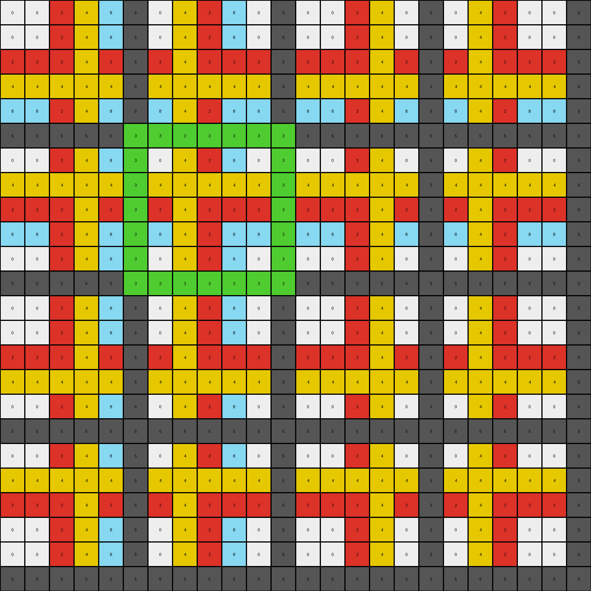
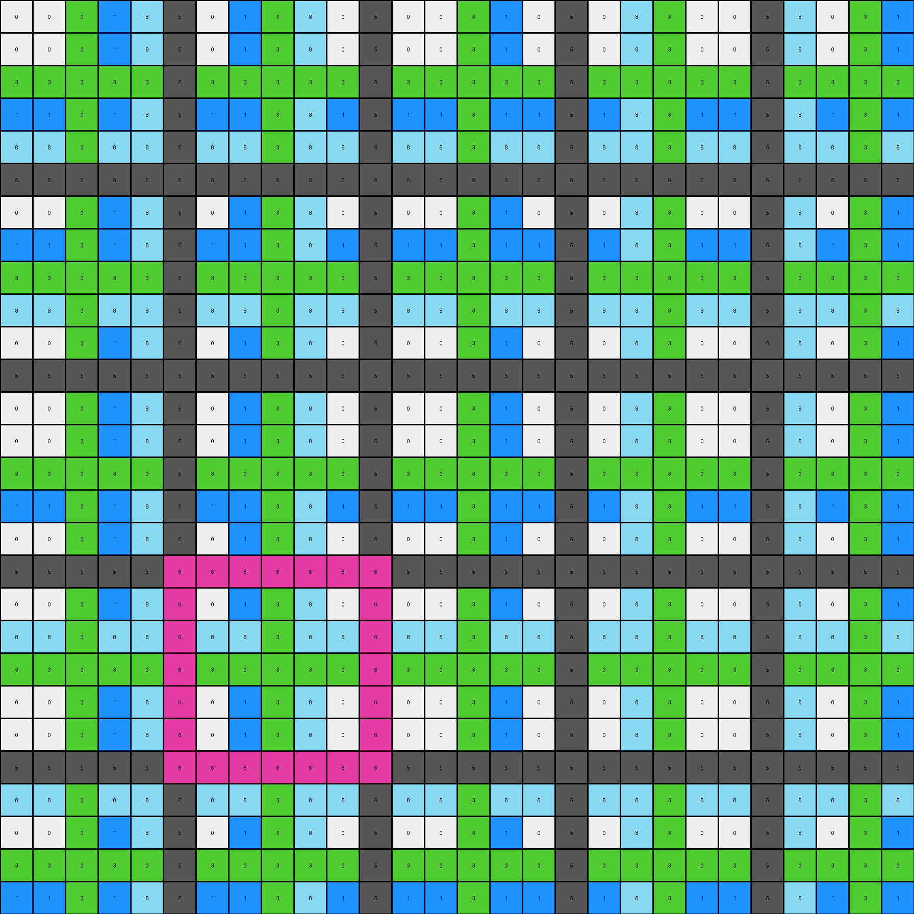

# c909285e • 003 • refine_dreamer

---


Previous Code:
```python
"""
1.  **Identify Repeating Pattern:** Examine the input grid to locate a repeating subgrid pattern. This pattern repeats both horizontally and vertically.
2.  **Determine the top left corner:** look at the top left pixel.
3.  **Isolate One Instance:** Extract one complete instance of the repeating subgrid pattern.
4.  **Replace Green with Gray** if there is any Green in the isolated instance, replace it with Gray (0).
5.  **Output:** The extracted and possibly recolored subgrid becomes the output grid.
"""

import numpy as np

def find_repeating_pattern(grid):
    # Find the smallest repeating pattern in the grid
    rows, cols = grid.shape
    for i in range(1, rows // 2 + 1):
        for j in range(1, cols // 2 + 1):
            if rows % i == 0 and cols % j == 0:
                pattern = grid[:i, :j]
                valid_pattern = True
                for row_mult in range(rows // i):
                    for col_mult in range(cols // j):
                        if not np.array_equal(grid[row_mult*i:(row_mult+1)*i, col_mult*j:(col_mult+1)*j], pattern):
                            valid_pattern = False
                            break
                    if not valid_pattern:
                        break
                if valid_pattern:
                    return pattern
    return None

def transform(input_grid):
    # Convert the input grid to a NumPy array for easier manipulation
    input_grid = np.array(input_grid)
    
    # Find the repeating pattern
    pattern = find_repeating_pattern(input_grid)
    if pattern is None: return input_grid #should not occur, but handling

    # Replace green (3) with gray (0)
    output_grid = np.where(pattern == 3, 0, pattern)

    return output_grid.tolist()
```

Train Set Results:

## Example 1:

Input:
```
0 0 2 4 8 5 0 4 2 8 0 5 0 0 2 4 0 5 0 4 2 0 0 5
0 0 2 4 8 5 0 4 2 8 0 5 0 0 2 4 0 5 0 4 2 0 0 5
2 2 2 4 2 5 2 4 2 2 2 5 2 2 2 4 2 5 2 4 2 2 2 5
4 4 4 4 4 5 4 4 4 4 4 5 4 4 4 4 4 5 4 4 4 4 4 5
8 8 2 4 8 5 8 4 2 8 8 5 8 8 2 4 8 5 8 4 2 8 8 5
5 5 5 5 5 3 3 3 3 3 3 3 5 5 5 5 5 5 5 5 5 5 5 5
0 0 2 4 8 3 0 4 2 8 0 3 0 0 2 4 0 5 0 4 2 0 0 5
4 4 4 4 4 3 4 4 4 4 4 3 4 4 4 4 4 5 4 4 4 4 4 5
2 2 2 4 2 3 2 4 2 2 2 3 2 2 2 4 2 5 2 4 2 2 2 5
8 8 2 4 8 3 8 4 2 8 8 3 8 8 2 4 8 5 8 4 2 8 8 5
0 0 2 4 8 3 0 4 2 8 0 3 0 0 2 4 0 5 0 4 2 0 0 5
5 5 5 5 5 3 3 3 3 3 3 3 5 5 5 5 5 5 5 5 5 5 5 5
0 0 2 4 8 5 0 4 2 8 0 5 0 0 2 4 0 5 0 4 2 0 0 5
0 0 2 4 8 5 0 4 2 8 0 5 0 0 2 4 0 5 0 4 2 0 0 5
2 2 2 4 2 5 2 4 2 2 2 5 2 2 2 4 2 5 2 4 2 2 2 5
4 4 4 4 4 5 4 4 4 4 4 5 4 4 4 4 4 5 4 4 4 4 4 5
0 0 2 4 8 5 0 4 2 8 0 5 0 0 2 4 0 5 0 4 2 0 0 5
5 5 5 5 5 5 5 5 5 5 5 5 5 5 5 5 5 5 5 5 5 5 5 5
0 0 2 4 8 5 0 4 2 8 0 5 0 0 2 4 0 5 0 4 2 0 0 5
4 4 4 4 4 5 4 4 4 4 4 5 4 4 4 4 4 5 4 4 4 4 4 5
2 2 2 4 2 5 2 4 2 2 2 5 2 2 2 4 2 5 2 4 2 2 2 5
0 0 2 4 8 5 0 4 2 8 0 5 0 0 2 4 0 5 0 4 2 0 0 5
0 0 2 4 8 5 0 4 2 8 0 5 0 0 2 4 0 5 0 4 2 0 0 5
5 5 5 5 5 5 5 5 5 5 5 5 5 5 5 5 5 5 5 5 5 5 5 5
```
Expected Output:
```
3 3 3 3 3 3 3
3 0 4 2 8 0 3
3 4 4 4 4 4 3
3 2 4 2 2 2 3
3 8 4 2 8 8 3
3 0 4 2 8 0 3
3 3 3 3 3 3 3
```
Transformed Output:
```
0 0 2 4 8 5 0 4 2 8 0 5 0 0 2 4 0 5 0 4 2 0 0 5
0 0 2 4 8 5 0 4 2 8 0 5 0 0 2 4 0 5 0 4 2 0 0 5
2 2 2 4 2 5 2 4 2 2 2 5 2 2 2 4 2 5 2 4 2 2 2 5
4 4 4 4 4 5 4 4 4 4 4 5 4 4 4 4 4 5 4 4 4 4 4 5
8 8 2 4 8 5 8 4 2 8 8 5 8 8 2 4 8 5 8 4 2 8 8 5
5 5 5 5 5 3 3 3 3 3 3 3 5 5 5 5 5 5 5 5 5 5 5 5
0 0 2 4 8 3 0 4 2 8 0 3 0 0 2 4 0 5 0 4 2 0 0 5
4 4 4 4 4 3 4 4 4 4 4 3 4 4 4 4 4 5 4 4 4 4 4 5
2 2 2 4 2 3 2 4 2 2 2 3 2 2 2 4 2 5 2 4 2 2 2 5
8 8 2 4 8 3 8 4 2 8 8 3 8 8 2 4 8 5 8 4 2 8 8 5
0 0 2 4 8 3 0 4 2 8 0 3 0 0 2 4 0 5 0 4 2 0 0 5
5 5 5 5 5 3 3 3 3 3 3 3 5 5 5 5 5 5 5 5 5 5 5 5
0 0 2 4 8 5 0 4 2 8 0 5 0 0 2 4 0 5 0 4 2 0 0 5
0 0 2 4 8 5 0 4 2 8 0 5 0 0 2 4 0 5 0 4 2 0 0 5
2 2 2 4 2 5 2 4 2 2 2 5 2 2 2 4 2 5 2 4 2 2 2 5
4 4 4 4 4 5 4 4 4 4 4 5 4 4 4 4 4 5 4 4 4 4 4 5
0 0 2 4 8 5 0 4 2 8 0 5 0 0 2 4 0 5 0 4 2 0 0 5
5 5 5 5 5 5 5 5 5 5 5 5 5 5 5 5 5 5 5 5 5 5 5 5
0 0 2 4 8 5 0 4 2 8 0 5 0 0 2 4 0 5 0 4 2 0 0 5
4 4 4 4 4 5 4 4 4 4 4 5 4 4 4 4 4 5 4 4 4 4 4 5
2 2 2 4 2 5 2 4 2 2 2 5 2 2 2 4 2 5 2 4 2 2 2 5
0 0 2 4 8 5 0 4 2 8 0 5 0 0 2 4 0 5 0 4 2 0 0 5
0 0 2 4 8 5 0 4 2 8 0 5 0 0 2 4 0 5 0 4 2 0 0 5
5 5 5 5 5 5 5 5 5 5 5 5 5 5 5 5 5 5 5 5 5 5 5 5
```

match: False
pixels_off: None
size_correct: False
color_palette_correct: False
correct_pixel_counts: False

## Example 2:

Input:
```
0 0 8 3 1 8 0 3 8 1 0 8 0 0 8 3 0 8 0 3 8 0 0 8 1 0
0 0 8 3 1 8 0 3 8 1 0 8 0 0 8 3 0 8 0 3 8 0 0 8 1 0
8 8 2 2 2 2 2 2 2 8 8 8 8 8 8 8 8 8 8 8 8 8 8 8 8 8
3 3 2 3 3 8 3 3 2 3 3 8 3 3 8 3 3 8 3 3 8 3 3 8 3 3
1 1 2 3 1 8 1 3 2 1 1 8 1 1 8 3 1 8 1 3 8 1 1 8 1 1
8 8 2 8 8 8 8 8 2 8 8 8 8 8 8 8 8 8 8 8 8 8 8 8 8 8
0 0 2 3 1 8 0 3 2 1 0 8 0 0 8 3 0 8 0 3 8 0 0 8 1 0
3 3 2 3 3 8 3 3 2 3 3 8 3 3 8 3 3 8 3 3 8 3 3 8 3 3
8 8 2 2 2 2 2 2 2 8 8 8 8 8 8 8 8 8 8 8 8 8 8 8 8 8
1 1 8 3 1 8 1 3 8 1 1 8 1 1 8 3 1 8 1 3 8 1 1 8 1 1
0 0 8 3 1 8 0 3 8 1 0 8 0 0 8 3 0 8 0 3 8 0 0 8 1 0
8 8 8 8 8 8 8 8 8 8 8 8 8 8 8 8 8 8 8 8 8 8 8 8 8 8
0 0 8 3 1 8 0 3 8 1 0 8 0 0 8 3 0 8 0 3 8 0 0 8 1 0
0 0 8 3 1 8 0 3 8 1 0 8 0 0 8 3 0 8 0 3 8 0 0 8 1 0
8 8 8 8 8 8 8 8 8 8 8 8 8 8 8 8 8 8 8 8 8 8 8 8 8 8
3 3 8 3 3 8 3 3 8 3 3 8 3 3 8 3 3 8 3 3 8 3 3 8 3 3
0 0 8 3 1 8 0 3 8 1 0 8 0 0 8 3 0 8 0 3 8 0 0 8 1 0
8 8 8 8 8 8 8 8 8 8 8 8 8 8 8 8 8 8 8 8 8 8 8 8 8 8
0 0 8 3 1 8 0 3 8 1 0 8 0 0 8 3 0 8 0 3 8 0 0 8 1 0
3 3 8 3 3 8 3 3 8 3 3 8 3 3 8 3 3 8 3 3 8 3 3 8 3 3
8 8 8 8 8 8 8 8 8 8 8 8 8 8 8 8 8 8 8 8 8 8 8 8 8 8
0 0 8 3 1 8 0 3 8 1 0 8 0 0 8 3 0 8 0 3 8 0 0 8 1 0
0 0 8 3 1 8 0 3 8 1 0 8 0 0 8 3 0 8 0 3 8 0 0 8 1 0
8 8 8 8 8 8 8 8 8 8 8 8 8 8 8 8 8 8 8 8 8 8 8 8 8 8
1 1 8 3 1 8 1 3 8 1 1 8 1 1 8 3 1 8 1 3 8 1 1 8 1 1
0 0 8 3 1 8 0 3 8 1 0 8 0 0 8 3 0 8 0 3 8 0 0 8 1 0
```
Expected Output:
```
2 2 2 2 2 2 2
2 3 3 8 3 3 2
2 3 1 8 1 3 2
2 8 8 8 8 8 2
2 3 1 8 0 3 2
2 3 3 8 3 3 2
2 2 2 2 2 2 2
```
Transformed Output:
```
0 0 8 3 1 8 0 3 8 1 0 8 0 0 8 3 0 8 0 3 8 0 0 8 1 0
0 0 8 3 1 8 0 3 8 1 0 8 0 0 8 3 0 8 0 3 8 0 0 8 1 0
8 8 2 2 2 2 2 2 2 8 8 8 8 8 8 8 8 8 8 8 8 8 8 8 8 8
3 3 2 3 3 8 3 3 2 3 3 8 3 3 8 3 3 8 3 3 8 3 3 8 3 3
1 1 2 3 1 8 1 3 2 1 1 8 1 1 8 3 1 8 1 3 8 1 1 8 1 1
8 8 2 8 8 8 8 8 2 8 8 8 8 8 8 8 8 8 8 8 8 8 8 8 8 8
0 0 2 3 1 8 0 3 2 1 0 8 0 0 8 3 0 8 0 3 8 0 0 8 1 0
3 3 2 3 3 8 3 3 2 3 3 8 3 3 8 3 3 8 3 3 8 3 3 8 3 3
8 8 2 2 2 2 2 2 2 8 8 8 8 8 8 8 8 8 8 8 8 8 8 8 8 8
1 1 8 3 1 8 1 3 8 1 1 8 1 1 8 3 1 8 1 3 8 1 1 8 1 1
0 0 8 3 1 8 0 3 8 1 0 8 0 0 8 3 0 8 0 3 8 0 0 8 1 0
8 8 8 8 8 8 8 8 8 8 8 8 8 8 8 8 8 8 8 8 8 8 8 8 8 8
0 0 8 3 1 8 0 3 8 1 0 8 0 0 8 3 0 8 0 3 8 0 0 8 1 0
0 0 8 3 1 8 0 3 8 1 0 8 0 0 8 3 0 8 0 3 8 0 0 8 1 0
8 8 8 8 8 8 8 8 8 8 8 8 8 8 8 8 8 8 8 8 8 8 8 8 8 8
3 3 8 3 3 8 3 3 8 3 3 8 3 3 8 3 3 8 3 3 8 3 3 8 3 3
0 0 8 3 1 8 0 3 8 1 0 8 0 0 8 3 0 8 0 3 8 0 0 8 1 0
8 8 8 8 8 8 8 8 8 8 8 8 8 8 8 8 8 8 8 8 8 8 8 8 8 8
0 0 8 3 1 8 0 3 8 1 0 8 0 0 8 3 0 8 0 3 8 0 0 8 1 0
3 3 8 3 3 8 3 3 8 3 3 8 3 3 8 3 3 8 3 3 8 3 3 8 3 3
8 8 8 8 8 8 8 8 8 8 8 8 8 8 8 8 8 8 8 8 8 8 8 8 8 8
0 0 8 3 1 8 0 3 8 1 0 8 0 0 8 3 0 8 0 3 8 0 0 8 1 0
0 0 8 3 1 8 0 3 8 1 0 8 0 0 8 3 0 8 0 3 8 0 0 8 1 0
8 8 8 8 8 8 8 8 8 8 8 8 8 8 8 8 8 8 8 8 8 8 8 8 8 8
1 1 8 3 1 8 1 3 8 1 1 8 1 1 8 3 1 8 1 3 8 1 1 8 1 1
0 0 8 3 1 8 0 3 8 1 0 8 0 0 8 3 0 8 0 3 8 0 0 8 1 0
```

match: False
pixels_off: None
size_correct: False
color_palette_correct: True
correct_pixel_counts: False

## Example 3:

Input:
```
0 0 3 1 8 5 0 1 3 8 0 5 0 0 3 1 0 5 0 8 3 0 0 5 8 0 3 1
0 0 3 1 8 5 0 1 3 8 0 5 0 0 3 1 0 5 0 8 3 0 0 5 8 0 3 1
3 3 3 3 3 5 3 3 3 3 3 5 3 3 3 3 3 5 3 3 3 3 3 5 3 3 3 3
1 1 3 1 8 5 1 1 3 8 1 5 1 1 3 1 1 5 1 8 3 1 1 5 8 1 3 1
8 8 3 8 8 5 8 8 3 8 8 5 8 8 3 8 8 5 8 8 3 8 8 5 8 8 3 8
5 5 5 5 5 5 5 5 5 5 5 5 5 5 5 5 5 5 5 5 5 5 5 5 5 5 5 5
0 0 3 1 8 5 0 1 3 8 0 5 0 0 3 1 0 5 0 8 3 0 0 5 8 0 3 1
1 1 3 1 8 5 1 1 3 8 1 5 1 1 3 1 1 5 1 8 3 1 1 5 8 1 3 1
3 3 3 3 3 5 3 3 3 3 3 5 3 3 3 3 3 5 3 3 3 3 3 5 3 3 3 3
8 8 3 8 8 5 8 8 3 8 8 5 8 8 3 8 8 5 8 8 3 8 8 5 8 8 3 8
0 0 3 1 8 5 0 1 3 8 0 5 0 0 3 1 0 5 0 8 3 0 0 5 8 0 3 1
5 5 5 5 5 5 5 5 5 5 5 5 5 5 5 5 5 5 5 5 5 5 5 5 5 5 5 5
0 0 3 1 8 5 0 1 3 8 0 5 0 0 3 1 0 5 0 8 3 0 0 5 8 0 3 1
0 0 3 1 8 5 0 1 3 8 0 5 0 0 3 1 0 5 0 8 3 0 0 5 8 0 3 1
3 3 3 3 3 5 3 3 3 3 3 5 3 3 3 3 3 5 3 3 3 3 3 5 3 3 3 3
1 1 3 1 8 5 1 1 3 8 1 5 1 1 3 1 1 5 1 8 3 1 1 5 8 1 3 1
0 0 3 1 8 5 0 1 3 8 0 5 0 0 3 1 0 5 0 8 3 0 0 5 8 0 3 1
5 5 5 5 5 6 6 6 6 6 6 6 5 5 5 5 5 5 5 5 5 5 5 5 5 5 5 5
0 0 3 1 8 6 0 1 3 8 0 6 0 0 3 1 0 5 0 8 3 0 0 5 8 0 3 1
8 8 3 8 8 6 8 8 3 8 8 6 8 8 3 8 8 5 8 8 3 8 8 5 8 8 3 8
3 3 3 3 3 6 3 3 3 3 3 6 3 3 3 3 3 5 3 3 3 3 3 5 3 3 3 3
0 0 3 1 8 6 0 1 3 8 0 6 0 0 3 1 0 5 0 8 3 0 0 5 8 0 3 1
0 0 3 1 8 6 0 1 3 8 0 6 0 0 3 1 0 5 0 8 3 0 0 5 8 0 3 1
5 5 5 5 5 6 6 6 6 6 6 6 5 5 5 5 5 5 5 5 5 5 5 5 5 5 5 5
8 8 3 8 8 5 8 8 3 8 8 5 8 8 3 8 8 5 8 8 3 8 8 5 8 8 3 8
0 0 3 1 8 5 0 1 3 8 0 5 0 0 3 1 0 5 0 8 3 0 0 5 8 0 3 1
3 3 3 3 3 5 3 3 3 3 3 5 3 3 3 3 3 5 3 3 3 3 3 5 3 3 3 3
1 1 3 1 8 5 1 1 3 8 1 5 1 1 3 1 1 5 1 8 3 1 1 5 8 1 3 1
```
Expected Output:
```
6 6 6 6 6 6 6
6 0 1 3 8 0 6
6 8 8 3 8 8 6
6 3 3 3 3 3 6
6 0 1 3 8 0 6
6 0 1 3 8 0 6
6 6 6 6 6 6 6
```
Transformed Output:
```
0 0 3 1 8 5 0 1 3 8 0 5 0 0 3 1 0 5 0 8 3 0 0 5 8 0 3 1
0 0 3 1 8 5 0 1 3 8 0 5 0 0 3 1 0 5 0 8 3 0 0 5 8 0 3 1
3 3 3 3 3 5 3 3 3 3 3 5 3 3 3 3 3 5 3 3 3 3 3 5 3 3 3 3
1 1 3 1 8 5 1 1 3 8 1 5 1 1 3 1 1 5 1 8 3 1 1 5 8 1 3 1
8 8 3 8 8 5 8 8 3 8 8 5 8 8 3 8 8 5 8 8 3 8 8 5 8 8 3 8
5 5 5 5 5 5 5 5 5 5 5 5 5 5 5 5 5 5 5 5 5 5 5 5 5 5 5 5
0 0 3 1 8 5 0 1 3 8 0 5 0 0 3 1 0 5 0 8 3 0 0 5 8 0 3 1
1 1 3 1 8 5 1 1 3 8 1 5 1 1 3 1 1 5 1 8 3 1 1 5 8 1 3 1
3 3 3 3 3 5 3 3 3 3 3 5 3 3 3 3 3 5 3 3 3 3 3 5 3 3 3 3
8 8 3 8 8 5 8 8 3 8 8 5 8 8 3 8 8 5 8 8 3 8 8 5 8 8 3 8
0 0 3 1 8 5 0 1 3 8 0 5 0 0 3 1 0 5 0 8 3 0 0 5 8 0 3 1
5 5 5 5 5 5 5 5 5 5 5 5 5 5 5 5 5 5 5 5 5 5 5 5 5 5 5 5
0 0 3 1 8 5 0 1 3 8 0 5 0 0 3 1 0 5 0 8 3 0 0 5 8 0 3 1
0 0 3 1 8 5 0 1 3 8 0 5 0 0 3 1 0 5 0 8 3 0 0 5 8 0 3 1
3 3 3 3 3 5 3 3 3 3 3 5 3 3 3 3 3 5 3 3 3 3 3 5 3 3 3 3
1 1 3 1 8 5 1 1 3 8 1 5 1 1 3 1 1 5 1 8 3 1 1 5 8 1 3 1
0 0 3 1 8 5 0 1 3 8 0 5 0 0 3 1 0 5 0 8 3 0 0 5 8 0 3 1
5 5 5 5 5 6 6 6 6 6 6 6 5 5 5 5 5 5 5 5 5 5 5 5 5 5 5 5
0 0 3 1 8 6 0 1 3 8 0 6 0 0 3 1 0 5 0 8 3 0 0 5 8 0 3 1
8 8 3 8 8 6 8 8 3 8 8 6 8 8 3 8 8 5 8 8 3 8 8 5 8 8 3 8
3 3 3 3 3 6 3 3 3 3 3 6 3 3 3 3 3 5 3 3 3 3 3 5 3 3 3 3
0 0 3 1 8 6 0 1 3 8 0 6 0 0 3 1 0 5 0 8 3 0 0 5 8 0 3 1
0 0 3 1 8 6 0 1 3 8 0 6 0 0 3 1 0 5 0 8 3 0 0 5 8 0 3 1
5 5 5 5 5 6 6 6 6 6 6 6 5 5 5 5 5 5 5 5 5 5 5 5 5 5 5 5
8 8 3 8 8 5 8 8 3 8 8 5 8 8 3 8 8 5 8 8 3 8 8 5 8 8 3 8
0 0 3 1 8 5 0 1 3 8 0 5 0 0 3 1 0 5 0 8 3 0 0 5 8 0 3 1
3 3 3 3 3 5 3 3 3 3 3 5 3 3 3 3 3 5 3 3 3 3 3 5 3 3 3 3
1 1 3 1 8 5 1 1 3 8 1 5 1 1 3 1 1 5 1 8 3 1 1 5 8 1 3 1
```

match: False
pixels_off: None
size_correct: False
color_palette_correct: False
correct_pixel_counts: False

**INSTRUCTIONS**

The code above was generated based on observations from the first training
example

we have tested the transform function on each of the task example inputs and
compared with the expected output

review each of the examples provided and the results and consider how the
natural language program should be updated to accommodate this new knowledge

respond with the following deliverables:

- general assessment of the information provided and strategy for resolving the
  errors
- gather metrics about each of the examples and results - use code_execution to
  develop accurate reports on your assumptions
- a YAML block documenting facts - Focus on identifying objects, their properties, and the actions performed on them.
- a natural language program - Be as clear and concise as possible, providing a complete description of the transformation rule.


your responses should be considered as information in a report - not a
conversation
