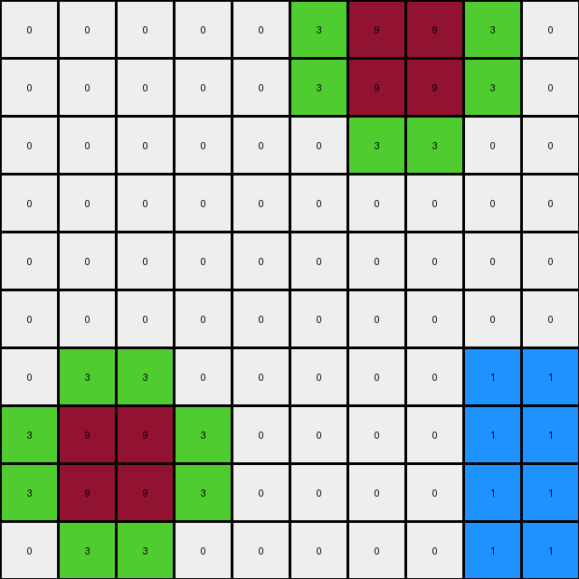
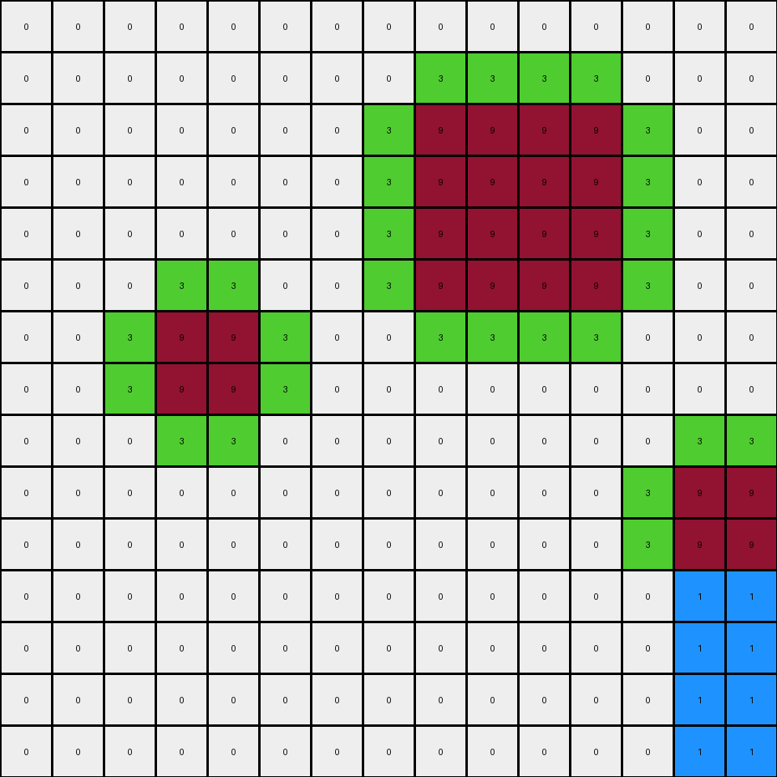
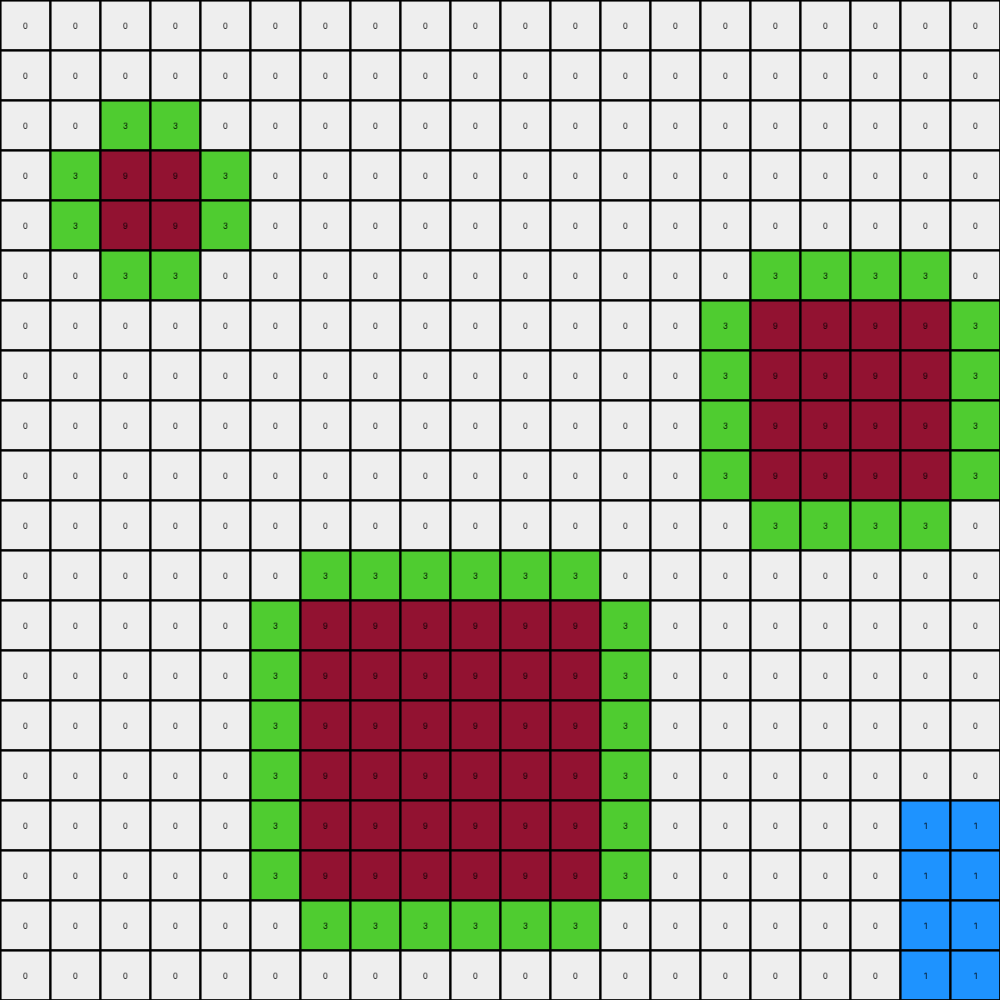
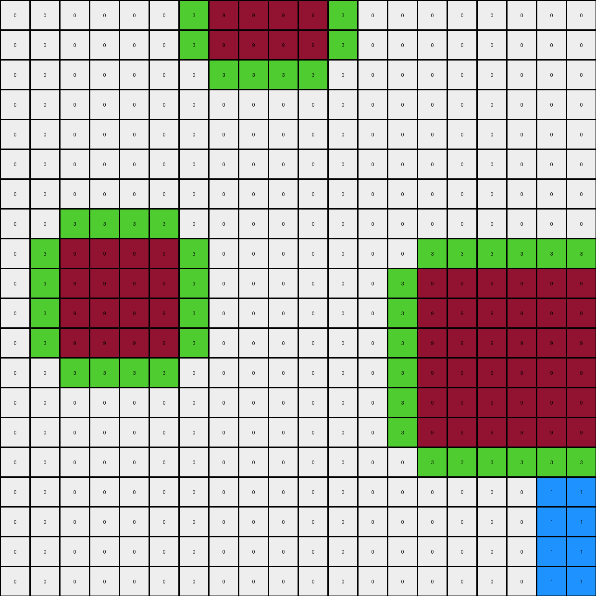

# db93a21d • 004 • refine_coder

---

Previous Code:
```python
"""
1. Preserve Maroon: Copy all maroon (9) pixels from the input grid to the same positions in the output grid.

2. Outline in Green: For each maroon pixel in the input grid, examine its immediate neighbors (up, down, left, right). If a neighbor is white (0) in the input grid, change that pixel in the output grid to green (3).

3. Create blue object: Starting from the bottom right of the image, identify a rectangular area not occupied by any colored pixels and replace the white pixels with blue (1) pixels.
"""

import numpy as np

def get_neighbors(grid, row, col):
    """Gets the valid neighbors of a cell (up, down, left, right)."""
    rows, cols = grid.shape
    neighbors = []
    if row > 0:
        neighbors.append((row - 1, col))  # Up
    if row < rows - 1:
        neighbors.append((row + 1, col))  # Down
    if col > 0:
        neighbors.append((row, col - 1))  # Left
    if col < cols - 1:
        neighbors.append((row, col + 1))  # Right
    return neighbors

def transform(input_grid):
    """Transforms the input grid according to the defined rules."""
    output_grid = np.copy(input_grid)

    # Preserve Maroon and Outline in Green
    rows, cols = input_grid.shape
    for row in range(rows):
        for col in range(cols):
            if input_grid[row, col] == 9:
                for r, c in get_neighbors(input_grid, row, col):
                    if input_grid[r, c] == 0:
                        output_grid[r, c] = 3

    # create blue object
    # find dimensions of object in example
    blue_height = 4
    blue_width = 2

    # start from the bottom right
    for row in range(rows - blue_height, rows):
      for col in range(cols - blue_width, cols):
          output_grid[row,col] = 1


    return output_grid
```

Train Set Results:

## Example 1:

Input:
```
0 0 0 0 0 0 9 9 0 0
0 0 0 0 0 0 9 9 0 0
0 0 0 0 0 0 0 0 0 0
0 0 0 0 0 0 0 0 0 0
0 0 0 0 0 0 0 0 0 0
0 0 0 0 0 0 0 0 0 0
0 0 0 0 0 0 0 0 0 0
0 9 9 0 0 0 0 0 0 0
0 9 9 0 0 0 0 0 0 0
0 0 0 0 0 0 0 0 0 0
```
Expected Output:
```
0 0 0 0 0 3 9 9 3 0
0 0 0 0 0 3 9 9 3 0
0 0 0 0 0 3 3 3 3 0
0 0 0 0 0 0 1 1 0 0
0 0 0 0 0 0 1 1 0 0
0 0 0 0 0 0 1 1 0 0
3 3 3 3 0 0 1 1 0 0
3 9 9 3 0 0 1 1 0 0
3 9 9 3 0 0 1 1 0 0
3 3 3 3 0 0 1 1 0 0
```
Transformed Output:
```
0 0 0 0 0 3 9 9 3 0
0 0 0 0 0 3 9 9 3 0
0 0 0 0 0 0 3 3 0 0
0 0 0 0 0 0 0 0 0 0
0 0 0 0 0 0 0 0 0 0
0 0 0 0 0 0 0 0 0 0
0 3 3 0 0 0 0 0 1 1
3 9 9 3 0 0 0 0 1 1
3 9 9 3 0 0 0 0 1 1
0 3 3 0 0 0 0 0 1 1
```

match: False
pixels_off: 28
size_correct: True
color_palette_correct: True
correct_pixel_counts: False

## Example 2:

Input:
```
0 0 0 0 0 0 0 0 0 0 0 0 0 0 0
0 0 0 0 0 0 0 0 0 0 0 0 0 0 0
0 0 0 0 0 0 0 0 9 9 9 9 0 0 0
0 0 0 0 0 0 0 0 9 9 9 9 0 0 0
0 0 0 0 0 0 0 0 9 9 9 9 0 0 0
0 0 0 0 0 0 0 0 9 9 9 9 0 0 0
0 0 0 9 9 0 0 0 0 0 0 0 0 0 0
0 0 0 9 9 0 0 0 0 0 0 0 0 0 0
0 0 0 0 0 0 0 0 0 0 0 0 0 0 0
0 0 0 0 0 0 0 0 0 0 0 0 0 9 9
0 0 0 0 0 0 0 0 0 0 0 0 0 9 9
0 0 0 0 0 0 0 0 0 0 0 0 0 0 0
0 0 0 0 0 0 0 0 0 0 0 0 0 0 0
0 0 0 0 0 0 0 0 0 0 0 0 0 0 0
0 0 0 0 0 0 0 0 0 0 0 0 0 0 0
```
Expected Output:
```
0 0 0 0 0 0 3 3 3 3 3 3 3 3 0
0 0 0 0 0 0 3 3 3 3 3 3 3 3 0
0 0 0 0 0 0 3 3 9 9 9 9 3 3 0
0 0 0 0 0 0 3 3 9 9 9 9 3 3 0
0 0 0 0 0 0 3 3 9 9 9 9 3 3 0
0 0 3 3 3 3 3 3 9 9 9 9 3 3 0
0 0 3 9 9 3 3 3 3 3 3 3 3 3 0
0 0 3 9 9 3 3 3 3 3 3 3 3 3 0
0 0 3 3 3 3 0 0 1 1 1 1 3 3 3
0 0 0 1 1 0 0 0 1 1 1 1 3 9 9
0 0 0 1 1 0 0 0 1 1 1 1 3 9 9
0 0 0 1 1 0 0 0 1 1 1 1 3 3 3
0 0 0 1 1 0 0 0 1 1 1 1 0 1 1
0 0 0 1 1 0 0 0 1 1 1 1 0 1 1
0 0 0 1 1 0 0 0 1 1 1 1 0 1 1
```
Transformed Output:
```
0 0 0 0 0 0 0 0 0 0 0 0 0 0 0
0 0 0 0 0 0 0 0 3 3 3 3 0 0 0
0 0 0 0 0 0 0 3 9 9 9 9 3 0 0
0 0 0 0 0 0 0 3 9 9 9 9 3 0 0
0 0 0 0 0 0 0 3 9 9 9 9 3 0 0
0 0 0 3 3 0 0 3 9 9 9 9 3 0 0
0 0 3 9 9 3 0 0 3 3 3 3 0 0 0
0 0 3 9 9 3 0 0 0 0 0 0 0 0 0
0 0 0 3 3 0 0 0 0 0 0 0 0 3 3
0 0 0 0 0 0 0 0 0 0 0 0 3 9 9
0 0 0 0 0 0 0 0 0 0 0 0 3 9 9
0 0 0 0 0 0 0 0 0 0 0 0 0 1 1
0 0 0 0 0 0 0 0 0 0 0 0 0 1 1
0 0 0 0 0 0 0 0 0 0 0 0 0 1 1
0 0 0 0 0 0 0 0 0 0 0 0 0 1 1
```

match: False
pixels_off: 80
size_correct: True
color_palette_correct: True
correct_pixel_counts: False

## Example 3:

Input:
```
0 0 0 0 0 0 0 0 0 0 0 0 0 0 0 0 0 0 0 0
0 0 0 0 0 0 0 0 0 0 0 0 0 0 0 0 0 0 0 0
0 0 0 0 0 0 0 0 0 0 0 0 0 0 0 0 0 0 0 0
0 0 9 9 0 0 0 0 0 0 0 0 0 0 0 0 0 0 0 0
0 0 9 9 0 0 0 0 0 0 0 0 0 0 0 0 0 0 0 0
0 0 0 0 0 0 0 0 0 0 0 0 0 0 0 0 0 0 0 0
0 0 0 0 0 0 0 0 0 0 0 0 0 0 0 9 9 9 9 0
0 0 0 0 0 0 0 0 0 0 0 0 0 0 0 9 9 9 9 0
0 0 0 0 0 0 0 0 0 0 0 0 0 0 0 9 9 9 9 0
0 0 0 0 0 0 0 0 0 0 0 0 0 0 0 9 9 9 9 0
0 0 0 0 0 0 0 0 0 0 0 0 0 0 0 0 0 0 0 0
0 0 0 0 0 0 0 0 0 0 0 0 0 0 0 0 0 0 0 0
0 0 0 0 0 0 9 9 9 9 9 9 0 0 0 0 0 0 0 0
0 0 0 0 0 0 9 9 9 9 9 9 0 0 0 0 0 0 0 0
0 0 0 0 0 0 9 9 9 9 9 9 0 0 0 0 0 0 0 0
0 0 0 0 0 0 9 9 9 9 9 9 0 0 0 0 0 0 0 0
0 0 0 0 0 0 9 9 9 9 9 9 0 0 0 0 0 0 0 0
0 0 0 0 0 0 9 9 9 9 9 9 0 0 0 0 0 0 0 0
0 0 0 0 0 0 0 0 0 0 0 0 0 0 0 0 0 0 0 0
0 0 0 0 0 0 0 0 0 0 0 0 0 0 0 0 0 0 0 0
```
Expected Output:
```
0 0 0 0 0 0 0 0 0 0 0 0 0 0 0 0 0 0 0 0
0 0 0 0 0 0 0 0 0 0 0 0 0 0 0 0 0 0 0 0
0 3 3 3 3 0 0 0 0 0 0 0 0 0 0 0 0 0 0 0
0 3 9 9 3 0 0 0 0 0 0 0 0 0 0 0 0 0 0 0
0 3 9 9 3 0 0 0 0 0 0 0 0 3 3 3 3 3 3 3
0 3 3 3 3 0 0 0 0 0 0 0 0 3 3 3 3 3 3 3
0 0 1 1 0 0 0 0 0 0 0 0 0 3 3 9 9 9 9 3
0 0 1 1 0 0 0 0 0 0 0 0 0 3 3 9 9 9 9 3
0 0 1 1 0 0 0 0 0 0 0 0 0 3 3 9 9 9 9 3
0 0 1 3 3 3 3 3 3 3 3 3 3 3 3 9 9 9 9 3
0 0 1 3 3 3 3 3 3 3 3 3 3 3 3 3 3 3 3 3
0 0 1 3 3 3 3 3 3 3 3 3 3 3 3 3 3 3 3 3
0 0 1 3 3 3 9 9 9 9 9 9 3 3 3 1 1 1 1 0
0 0 1 3 3 3 9 9 9 9 9 9 3 3 3 1 1 1 1 0
0 0 1 3 3 3 9 9 9 9 9 9 3 3 3 1 1 1 1 0
0 0 1 3 3 3 9 9 9 9 9 9 3 3 3 1 1 1 1 0
0 0 1 3 3 3 9 9 9 9 9 9 3 3 3 1 1 1 1 0
0 0 1 3 3 3 9 9 9 9 9 9 3 3 3 1 1 1 1 0
0 0 1 3 3 3 3 3 3 3 3 3 3 3 3 1 1 1 1 0
0 0 1 3 3 3 3 3 3 3 3 3 3 3 3 1 1 1 1 0
```
Transformed Output:
```
0 0 0 0 0 0 0 0 0 0 0 0 0 0 0 0 0 0 0 0
0 0 0 0 0 0 0 0 0 0 0 0 0 0 0 0 0 0 0 0
0 0 3 3 0 0 0 0 0 0 0 0 0 0 0 0 0 0 0 0
0 3 9 9 3 0 0 0 0 0 0 0 0 0 0 0 0 0 0 0
0 3 9 9 3 0 0 0 0 0 0 0 0 0 0 0 0 0 0 0
0 0 3 3 0 0 0 0 0 0 0 0 0 0 0 3 3 3 3 0
0 0 0 0 0 0 0 0 0 0 0 0 0 0 3 9 9 9 9 3
0 0 0 0 0 0 0 0 0 0 0 0 0 0 3 9 9 9 9 3
0 0 0 0 0 0 0 0 0 0 0 0 0 0 3 9 9 9 9 3
0 0 0 0 0 0 0 0 0 0 0 0 0 0 3 9 9 9 9 3
0 0 0 0 0 0 0 0 0 0 0 0 0 0 0 3 3 3 3 0
0 0 0 0 0 0 3 3 3 3 3 3 0 0 0 0 0 0 0 0
0 0 0 0 0 3 9 9 9 9 9 9 3 0 0 0 0 0 0 0
0 0 0 0 0 3 9 9 9 9 9 9 3 0 0 0 0 0 0 0
0 0 0 0 0 3 9 9 9 9 9 9 3 0 0 0 0 0 0 0
0 0 0 0 0 3 9 9 9 9 9 9 3 0 0 0 0 0 0 0
0 0 0 0 0 3 9 9 9 9 9 9 3 0 0 0 0 0 1 1
0 0 0 0 0 3 9 9 9 9 9 9 3 0 0 0 0 0 1 1
0 0 0 0 0 0 3 3 3 3 3 3 0 0 0 0 0 0 1 1
0 0 0 0 0 0 0 0 0 0 0 0 0 0 0 0 0 0 1 1
```

match: False
pixels_off: 143
size_correct: True
color_palette_correct: True
correct_pixel_counts: False

## Example 4:

Input:
```
0 0 0 0 0 0 0 9 9 9 9 0 0 0 0 0 0 0 0 0
0 0 0 0 0 0 0 9 9 9 9 0 0 0 0 0 0 0 0 0
0 0 0 0 0 0 0 0 0 0 0 0 0 0 0 0 0 0 0 0
0 0 0 0 0 0 0 0 0 0 0 0 0 0 0 0 0 0 0 0
0 0 0 0 0 0 0 0 0 0 0 0 0 0 0 0 0 0 0 0
0 0 0 0 0 0 0 0 0 0 0 0 0 0 0 0 0 0 0 0
0 0 0 0 0 0 0 0 0 0 0 0 0 0 0 0 0 0 0 0
0 0 0 0 0 0 0 0 0 0 0 0 0 0 0 0 0 0 0 0
0 0 9 9 9 9 0 0 0 0 0 0 0 0 0 0 0 0 0 0
0 0 9 9 9 9 0 0 0 0 0 0 0 0 9 9 9 9 9 9
0 0 9 9 9 9 0 0 0 0 0 0 0 0 9 9 9 9 9 9
0 0 9 9 9 9 0 0 0 0 0 0 0 0 9 9 9 9 9 9
0 0 0 0 0 0 0 0 0 0 0 0 0 0 9 9 9 9 9 9
0 0 0 0 0 0 0 0 0 0 0 0 0 0 9 9 9 9 9 9
0 0 0 0 0 0 0 0 0 0 0 0 0 0 9 9 9 9 9 9
0 0 0 0 0 0 0 0 0 0 0 0 0 0 0 0 0 0 0 0
0 0 0 0 0 0 0 0 0 0 0 0 0 0 0 0 0 0 0 0
0 0 0 0 0 0 0 0 0 0 0 0 0 0 0 0 0 0 0 0
0 0 0 0 0 0 0 0 0 0 0 0 0 0 0 0 0 0 0 0
0 0 0 0 0 0 0 0 0 0 0 0 0 0 0 0 0 0 0 0
```
Expected Output:
```
0 0 0 0 0 3 3 9 9 9 9 3 3 0 0 0 0 0 0 0
0 0 0 0 0 3 3 9 9 9 9 3 3 0 0 0 0 0 0 0
0 0 0 0 0 3 3 3 3 3 3 3 3 0 0 0 0 0 0 0
0 0 0 0 0 3 3 3 3 3 3 3 3 0 0 0 0 0 0 0
0 0 0 0 0 0 0 1 1 1 1 0 0 0 0 0 0 0 0 0
0 0 0 0 0 0 0 1 1 1 1 0 0 0 0 0 0 0 0 0
3 3 3 3 3 3 3 3 1 1 1 3 3 3 3 3 3 3 3 3
3 3 3 3 3 3 3 3 1 1 1 3 3 3 3 3 3 3 3 3
3 3 9 9 9 9 3 3 1 1 1 3 3 3 3 3 3 3 3 3
3 3 9 9 9 9 3 3 1 1 1 3 3 3 9 9 9 9 9 9
3 3 9 9 9 9 3 3 1 1 1 3 3 3 9 9 9 9 9 9
3 3 9 9 9 9 3 3 1 1 1 3 3 3 9 9 9 9 9 9
3 3 3 3 3 3 3 3 1 1 1 3 3 3 9 9 9 9 9 9
3 3 3 3 3 3 3 3 1 1 1 3 3 3 9 9 9 9 9 9
0 0 1 1 1 1 0 1 1 1 1 3 3 3 9 9 9 9 9 9
0 0 1 1 1 1 0 1 1 1 1 3 3 3 3 3 3 3 3 3
0 0 1 1 1 1 0 1 1 1 1 3 3 3 3 3 3 3 3 3
0 0 1 1 1 1 0 1 1 1 1 3 3 3 3 3 3 3 3 3
0 0 1 1 1 1 0 1 1 1 1 0 0 0 1 1 1 1 1 1
0 0 1 1 1 1 0 1 1 1 1 0 0 0 1 1 1 1 1 1
```
Transformed Output:
```
0 0 0 0 0 0 3 9 9 9 9 3 0 0 0 0 0 0 0 0
0 0 0 0 0 0 3 9 9 9 9 3 0 0 0 0 0 0 0 0
0 0 0 0 0 0 0 3 3 3 3 0 0 0 0 0 0 0 0 0
0 0 0 0 0 0 0 0 0 0 0 0 0 0 0 0 0 0 0 0
0 0 0 0 0 0 0 0 0 0 0 0 0 0 0 0 0 0 0 0
0 0 0 0 0 0 0 0 0 0 0 0 0 0 0 0 0 0 0 0
0 0 0 0 0 0 0 0 0 0 0 0 0 0 0 0 0 0 0 0
0 0 3 3 3 3 0 0 0 0 0 0 0 0 0 0 0 0 0 0
0 3 9 9 9 9 3 0 0 0 0 0 0 0 3 3 3 3 3 3
0 3 9 9 9 9 3 0 0 0 0 0 0 3 9 9 9 9 9 9
0 3 9 9 9 9 3 0 0 0 0 0 0 3 9 9 9 9 9 9
0 3 9 9 9 9 3 0 0 0 0 0 0 3 9 9 9 9 9 9
0 0 3 3 3 3 0 0 0 0 0 0 0 3 9 9 9 9 9 9
0 0 0 0 0 0 0 0 0 0 0 0 0 3 9 9 9 9 9 9
0 0 0 0 0 0 0 0 0 0 0 0 0 3 9 9 9 9 9 9
0 0 0 0 0 0 0 0 0 0 0 0 0 0 3 3 3 3 3 3
0 0 0 0 0 0 0 0 0 0 0 0 0 0 0 0 0 0 1 1
0 0 0 0 0 0 0 0 0 0 0 0 0 0 0 0 0 0 1 1
0 0 0 0 0 0 0 0 0 0 0 0 0 0 0 0 0 0 1 1
0 0 0 0 0 0 0 0 0 0 0 0 0 0 0 0 0 0 1 1
```

match: False
pixels_off: 190
size_correct: True
color_palette_correct: True
correct_pixel_counts: False
Okay, let's analyze the results of the previous code execution and refine the natural language program.

**General Assessment:**

The initial program correctly identified two key aspects of the transformation: preserving maroon pixels and outlining them in green where they border white pixels. However, it failed significantly in the "create blue object" part. The blue object's placement, size, and, in some cases, even its presence were incorrect across multiple examples.  The strategy for resolving errors will involve:

1.  **Precise Blue Object Logic:** Abandon the simplistic "bottom-right" approach. Instead, analyze the relationship between the maroon objects, their outlines, and the placement/size of the blue object.
2. **Consistent Green Outline**: The examples show some problems with the green outline as well.

**Metrics and Observations (per example):**

Here's a summary, I'll consolidate observations after reporting on the individual examples:

*   **Example 1:**
    *   Maroon Preservation: Correct.
    *   Green Outline: Mostly correct, but missed some green pixels around the top maroon object and incorrectly placed some pixels
    *   Blue Object: Incorrect size and placement. Should fill the space to bottom right and be outlined.

*   **Example 2:**
    *   Maroon Preservation: Correct.
    *   Green Outline: Many errors, not fully surrounding either maroon areas, and not positioned correctly
    *   Blue Object: Incorrect size, shape, and placement. Should fill the space created by the outline and have an irregular shape.

*   **Example 3:**
    *   Maroon Preservation: Correct.
    *   Green Outline: Many errors in placement, size, shape
    *   Blue Object: Incorrect size, shape, and placement; extends too far left, includes non-white areas.

*   **Example 4:**
    *   Maroon Preservation: Correct.
    *   Green Outline: Many errors in placement, size and shape.
    *   Blue Object: Incorrect size, shape and placement; inconsistent and extends too far horizontally

**Consolidated Observations and Strategy:**

1.  **Maroon Preservation:** Consistently correct. This part of the program is fine.
2.  **Green Outline:** The green outline is applied to *all* white pixels adjacent to maroon, but also to the boundary of the grid.
3.  **Blue Object:** The big issue. The current method of placing blue object in bottom right of image is not supported. The blue objects appear inside a space that is enclosed, where one border is green.

**YAML Fact Identification:**

```yaml
objects:
  - name: maroon_object
    color: maroon (9)
    properties:
      - shape: irregular
      - persistence: preserved

  - name: green_outline
    color: green (3)
    properties:
      - location: adjacent to maroon_object and white pixels and edge of grid

  - name: blue_object
    color: blue (1)
    properties:
      - shape: irregular, fills enclosed space
      - location: within a space defined, in part, by the green outline
```

**Revised Natural Language Program:**

1.  **Preserve Maroon:** Copy all maroon (9) pixels from the input to the output grid.
2.  **Green Outline:**
    *   Any white (0) pixel that is adjacent (up, down, left, or right) to a maroon (9) pixel is changed to green (3) in the output.
    *   Any white pixel that is adjacent to the edge of the grid is changed to green (3) in the output
3.  **Blue Object:** Identify the spaces created enclosed by a green outline. Fill this shape with blue (1) pixels.


**INSTRUCTIONS**

- generate a Python module to represent the natural language program 
- follow the template below
- all common math and science libraries are available
- create docstring only at top - but comment the workflow in the function
- use helper functions for common operations like finding objects, counting,
  measuring, moving, etc. 

remember - we are working iteratively - so this code will inform your future
self as we converge on the solution

*template:*

```python
"""
{{ natural language description of the transformation rule }}
"""

{{ imports }}

def transform(input_grid):
    # initialize output_grid

    # change output pixels 

    return output_grid

```
