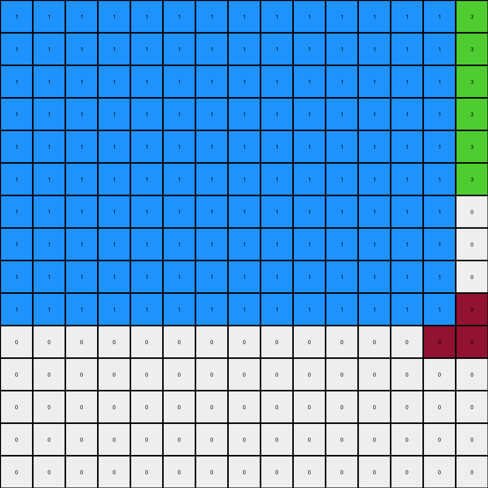
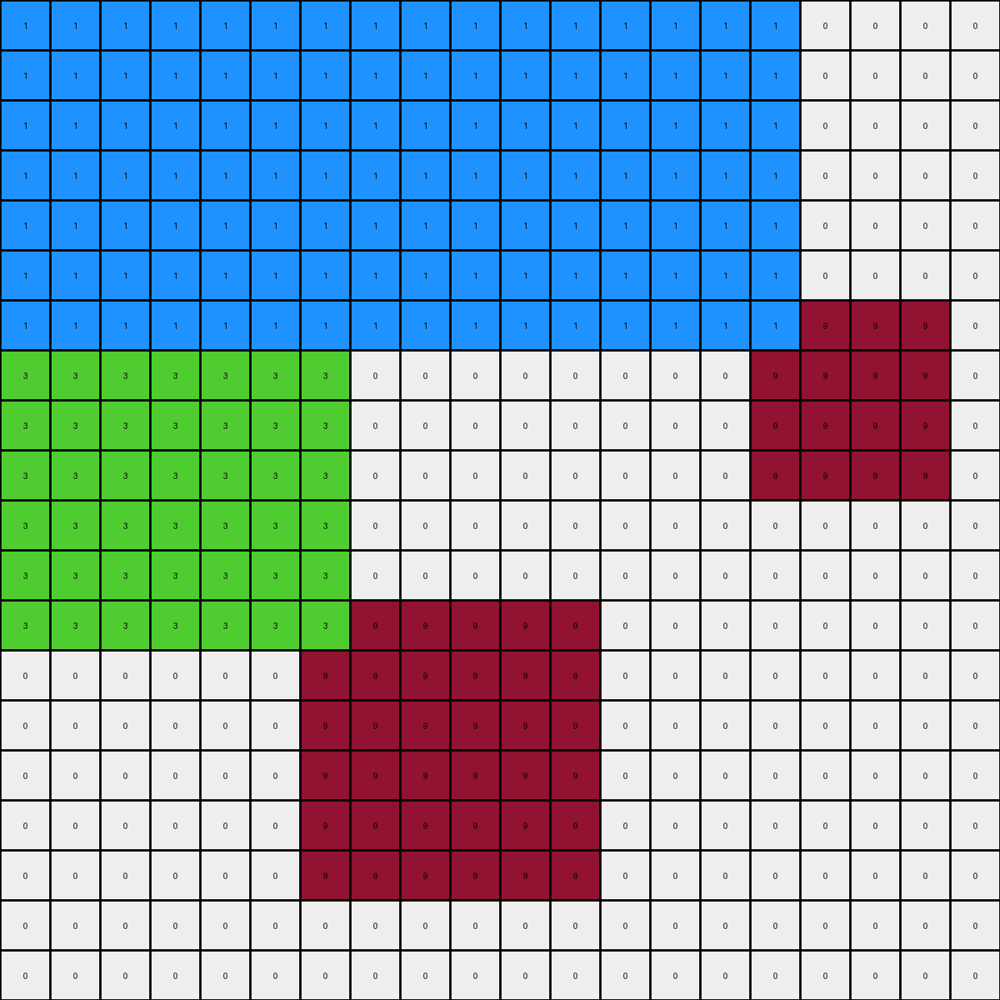

# db93a21d • 010 • refine_coder

---

Previous Code:
```python
"""
1.  **Identify Maroon Shapes:** Locate all contiguous regions of color 9 (maroon). These are rectangular shapes.

2.  **Green Expansion (Top-Left):**
    *   For the 4x4 and 2x2 maroon shapes on the left side of the grid, expand a region of color 3 (green) upwards and to the left.
    * The area of green is bound at the top and left by white.

3.  **Blue Expansion (Top-Right):**
      *   For the remaining maroon shape, create a new background using 1 (blue)
        in the area up and to the left

4. **Green fill:** Change white (0) cells above the top most maroon (9) shapes to green (3)

5. **Blue Fill:** Change white (0) cells in an area above and to the left of other
   maroon shapes using color blue (1).
"""

import numpy as np

def find_objects(grid, color):
    objects = []
    visited = np.zeros_like(grid, dtype=bool)

    def dfs(row, col, current_object):
        if (row < 0 or row >= grid.shape[0] or col < 0 or col >= grid.shape[1] or
                visited[row, col] or grid[row, col] != color):
            return

        visited[row, col] = True
        current_object.append((row, col))
        dfs(row + 1, col, current_object)
        dfs(row - 1, col, current_object)
        dfs(row, col + 1, current_object)
        dfs(row, col - 1, current_object)

    for row in range(grid.shape[0]):
        for col in range(grid.shape[1]):
            if grid[row, col] == color and not visited[row, col]:
                current_object = []
                dfs(row, col, current_object)
                if current_object:
                    objects.append(current_object)
    return objects

def get_bounding_box(obj):
    min_row = min(p[0] for p in obj)
    max_row = max(p[0] for p in obj)
    min_col = min(p[1] for p in obj)
    max_col = max(p[1] for p in obj)
    return min_row, max_row, min_col, max_col

def transform(input_grid):
    # initialize output_grid
    output_grid = np.copy(input_grid)
    maroon_objects = find_objects(input_grid, 9)

    # Sort objects by their top-left corner's column, then row
    maroon_objects.sort(key=lambda obj: (get_bounding_box(obj)[2], get_bounding_box(obj)[0]))


    for i, obj in enumerate(maroon_objects):
        min_row, max_row, min_col, max_col = get_bounding_box(obj)

        if i < 2:
            # Green Expansion
            for r in range(min_row + 1):
                for c in range(min_col + 1):
                  output_grid[r,c] = 3

        else :
            #Blue Expansion
            for r in range(min_row + 1):
                for c in range(min_col + 1):
                  output_grid[r,c] = 1

    #fill top row
    output_grid[0:6,0:15] = np.where(output_grid[0:6,0:15] == 0, 3, output_grid[0:6,0:15])
    
    return output_grid
```

Train Set Results:

## Example 1:

Input:
```
0 0 0 0 0 0 9 9 0 0
0 0 0 0 0 0 9 9 0 0
0 0 0 0 0 0 0 0 0 0
0 0 0 0 0 0 0 0 0 0
0 0 0 0 0 0 0 0 0 0
0 0 0 0 0 0 0 0 0 0
0 0 0 0 0 0 0 0 0 0
0 9 9 0 0 0 0 0 0 0
0 9 9 0 0 0 0 0 0 0
0 0 0 0 0 0 0 0 0 0
```
Expected Output:
```
0 0 0 0 0 3 9 9 3 0
0 0 0 0 0 3 9 9 3 0
0 0 0 0 0 3 3 3 3 0
0 0 0 0 0 0 1 1 0 0
0 0 0 0 0 0 1 1 0 0
0 0 0 0 0 0 1 1 0 0
3 3 3 3 0 0 1 1 0 0
3 9 9 3 0 0 1 1 0 0
3 9 9 3 0 0 1 1 0 0
3 3 3 3 0 0 1 1 0 0
```
Transformed Output:
```
3 3 3 3 3 3 3 9 3 3
3 3 3 3 3 3 9 9 3 3
3 3 3 3 3 3 3 3 3 3
3 3 3 3 3 3 3 3 3 3
3 3 3 3 3 3 3 3 3 3
3 3 3 3 3 3 3 3 3 3
3 3 0 0 0 0 0 0 0 0
3 3 9 0 0 0 0 0 0 0
0 9 9 0 0 0 0 0 0 0
0 0 0 0 0 0 0 0 0 0
```

match: False
pixels_off: 67
size_correct: True
color_palette_correct: True
correct_pixel_counts: False

## Example 2:

Input:
```
0 0 0 0 0 0 0 0 0 0 0 0 0 0 0
0 0 0 0 0 0 0 0 0 0 0 0 0 0 0
0 0 0 0 0 0 0 0 9 9 9 9 0 0 0
0 0 0 0 0 0 0 0 9 9 9 9 0 0 0
0 0 0 0 0 0 0 0 9 9 9 9 0 0 0
0 0 0 0 0 0 0 0 9 9 9 9 0 0 0
0 0 0 9 9 0 0 0 0 0 0 0 0 0 0
0 0 0 9 9 0 0 0 0 0 0 0 0 0 0
0 0 0 0 0 0 0 0 0 0 0 0 0 0 0
0 0 0 0 0 0 0 0 0 0 0 0 0 9 9
0 0 0 0 0 0 0 0 0 0 0 0 0 9 9
0 0 0 0 0 0 0 0 0 0 0 0 0 0 0
0 0 0 0 0 0 0 0 0 0 0 0 0 0 0
0 0 0 0 0 0 0 0 0 0 0 0 0 0 0
0 0 0 0 0 0 0 0 0 0 0 0 0 0 0
```
Expected Output:
```
0 0 0 0 0 0 3 3 3 3 3 3 3 3 0
0 0 0 0 0 0 3 3 3 3 3 3 3 3 0
0 0 0 0 0 0 3 3 9 9 9 9 3 3 0
0 0 0 0 0 0 3 3 9 9 9 9 3 3 0
0 0 0 0 0 0 3 3 9 9 9 9 3 3 0
0 0 3 3 3 3 3 3 9 9 9 9 3 3 0
0 0 3 9 9 3 3 3 3 3 3 3 3 3 0
0 0 3 9 9 3 3 3 3 3 3 3 3 3 0
0 0 3 3 3 3 0 0 1 1 1 1 3 3 3
0 0 0 1 1 0 0 0 1 1 1 1 3 9 9
0 0 0 1 1 0 0 0 1 1 1 1 3 9 9
0 0 0 1 1 0 0 0 1 1 1 1 3 3 3
0 0 0 1 1 0 0 0 1 1 1 1 0 1 1
0 0 0 1 1 0 0 0 1 1 1 1 0 1 1
0 0 0 1 1 0 0 0 1 1 1 1 0 1 1
```
Transformed Output:
```
1 1 1 1 1 1 1 1 1 1 1 1 1 1 3
1 1 1 1 1 1 1 1 1 1 1 1 1 1 3
1 1 1 1 1 1 1 1 1 1 1 1 1 1 3
1 1 1 1 1 1 1 1 1 1 1 1 1 1 3
1 1 1 1 1 1 1 1 1 1 1 1 1 1 3
1 1 1 1 1 1 1 1 1 1 1 1 1 1 3
1 1 1 1 1 1 1 1 1 1 1 1 1 1 0
1 1 1 1 1 1 1 1 1 1 1 1 1 1 0
1 1 1 1 1 1 1 1 1 1 1 1 1 1 0
1 1 1 1 1 1 1 1 1 1 1 1 1 1 9
0 0 0 0 0 0 0 0 0 0 0 0 0 9 9
0 0 0 0 0 0 0 0 0 0 0 0 0 0 0
0 0 0 0 0 0 0 0 0 0 0 0 0 0 0
0 0 0 0 0 0 0 0 0 0 0 0 0 0 0
0 0 0 0 0 0 0 0 0 0 0 0 0 0 0
```

match: False
pixels_off: 177
size_correct: True
color_palette_correct: True
correct_pixel_counts: False

## Example 3:

Input:
```
0 0 0 0 0 0 0 0 0 0 0 0 0 0 0 0 0 0 0 0
0 0 0 0 0 0 0 0 0 0 0 0 0 0 0 0 0 0 0 0
0 0 0 0 0 0 0 0 0 0 0 0 0 0 0 0 0 0 0 0
0 0 9 9 0 0 0 0 0 0 0 0 0 0 0 0 0 0 0 0
0 0 9 9 0 0 0 0 0 0 0 0 0 0 0 0 0 0 0 0
0 0 0 0 0 0 0 0 0 0 0 0 0 0 0 0 0 0 0 0
0 0 0 0 0 0 0 0 0 0 0 0 0 0 0 9 9 9 9 0
0 0 0 0 0 0 0 0 0 0 0 0 0 0 0 9 9 9 9 0
0 0 0 0 0 0 0 0 0 0 0 0 0 0 0 9 9 9 9 0
0 0 0 0 0 0 0 0 0 0 0 0 0 0 0 9 9 9 9 0
0 0 0 0 0 0 0 0 0 0 0 0 0 0 0 0 0 0 0 0
0 0 0 0 0 0 0 0 0 0 0 0 0 0 0 0 0 0 0 0
0 0 0 0 0 0 9 9 9 9 9 9 0 0 0 0 0 0 0 0
0 0 0 0 0 0 9 9 9 9 9 9 0 0 0 0 0 0 0 0
0 0 0 0 0 0 9 9 9 9 9 9 0 0 0 0 0 0 0 0
0 0 0 0 0 0 9 9 9 9 9 9 0 0 0 0 0 0 0 0
0 0 0 0 0 0 9 9 9 9 9 9 0 0 0 0 0 0 0 0
0 0 0 0 0 0 9 9 9 9 9 9 0 0 0 0 0 0 0 0
0 0 0 0 0 0 0 0 0 0 0 0 0 0 0 0 0 0 0 0
0 0 0 0 0 0 0 0 0 0 0 0 0 0 0 0 0 0 0 0
```
Expected Output:
```
0 0 0 0 0 0 0 0 0 0 0 0 0 0 0 0 0 0 0 0
0 0 0 0 0 0 0 0 0 0 0 0 0 0 0 0 0 0 0 0
0 3 3 3 3 0 0 0 0 0 0 0 0 0 0 0 0 0 0 0
0 3 9 9 3 0 0 0 0 0 0 0 0 0 0 0 0 0 0 0
0 3 9 9 3 0 0 0 0 0 0 0 0 3 3 3 3 3 3 3
0 3 3 3 3 0 0 0 0 0 0 0 0 3 3 3 3 3 3 3
0 0 1 1 0 0 0 0 0 0 0 0 0 3 3 9 9 9 9 3
0 0 1 1 0 0 0 0 0 0 0 0 0 3 3 9 9 9 9 3
0 0 1 1 0 0 0 0 0 0 0 0 0 3 3 9 9 9 9 3
0 0 1 3 3 3 3 3 3 3 3 3 3 3 3 9 9 9 9 3
0 0 1 3 3 3 3 3 3 3 3 3 3 3 3 3 3 3 3 3
0 0 1 3 3 3 3 3 3 3 3 3 3 3 3 3 3 3 3 3
0 0 1 3 3 3 9 9 9 9 9 9 3 3 3 1 1 1 1 0
0 0 1 3 3 3 9 9 9 9 9 9 3 3 3 1 1 1 1 0
0 0 1 3 3 3 9 9 9 9 9 9 3 3 3 1 1 1 1 0
0 0 1 3 3 3 9 9 9 9 9 9 3 3 3 1 1 1 1 0
0 0 1 3 3 3 9 9 9 9 9 9 3 3 3 1 1 1 1 0
0 0 1 3 3 3 9 9 9 9 9 9 3 3 3 1 1 1 1 0
0 0 1 3 3 3 3 3 3 3 3 3 3 3 3 1 1 1 1 0
0 0 1 3 3 3 3 3 3 3 3 3 3 3 3 1 1 1 1 0
```
Transformed Output:
```
1 1 1 1 1 1 1 1 1 1 1 1 1 1 1 1 0 0 0 0
1 1 1 1 1 1 1 1 1 1 1 1 1 1 1 1 0 0 0 0
1 1 1 1 1 1 1 1 1 1 1 1 1 1 1 1 0 0 0 0
1 1 1 1 1 1 1 1 1 1 1 1 1 1 1 1 0 0 0 0
1 1 1 1 1 1 1 1 1 1 1 1 1 1 1 1 0 0 0 0
1 1 1 1 1 1 1 1 1 1 1 1 1 1 1 1 0 0 0 0
1 1 1 1 1 1 1 1 1 1 1 1 1 1 1 1 9 9 9 0
3 3 3 3 3 3 3 0 0 0 0 0 0 0 0 9 9 9 9 0
3 3 3 3 3 3 3 0 0 0 0 0 0 0 0 9 9 9 9 0
3 3 3 3 3 3 3 0 0 0 0 0 0 0 0 9 9 9 9 0
3 3 3 3 3 3 3 0 0 0 0 0 0 0 0 0 0 0 0 0
3 3 3 3 3 3 3 0 0 0 0 0 0 0 0 0 0 0 0 0
3 3 3 3 3 3 3 9 9 9 9 9 0 0 0 0 0 0 0 0
0 0 0 0 0 0 9 9 9 9 9 9 0 0 0 0 0 0 0 0
0 0 0 0 0 0 9 9 9 9 9 9 0 0 0 0 0 0 0 0
0 0 0 0 0 0 9 9 9 9 9 9 0 0 0 0 0 0 0 0
0 0 0 0 0 0 9 9 9 9 9 9 0 0 0 0 0 0 0 0
0 0 0 0 0 0 9 9 9 9 9 9 0 0 0 0 0 0 0 0
0 0 0 0 0 0 0 0 0 0 0 0 0 0 0 0 0 0 0 0
0 0 0 0 0 0 0 0 0 0 0 0 0 0 0 0 0 0 0 0
```

match: False
pixels_off: 283
size_correct: True
color_palette_correct: True
correct_pixel_counts: False

## Example 4:

Input:
```
0 0 0 0 0 0 0 9 9 9 9 0 0 0 0 0 0 0 0 0
0 0 0 0 0 0 0 9 9 9 9 0 0 0 0 0 0 0 0 0
0 0 0 0 0 0 0 0 0 0 0 0 0 0 0 0 0 0 0 0
0 0 0 0 0 0 0 0 0 0 0 0 0 0 0 0 0 0 0 0
0 0 0 0 0 0 0 0 0 0 0 0 0 0 0 0 0 0 0 0
0 0 0 0 0 0 0 0 0 0 0 0 0 0 0 0 0 0 0 0
0 0 0 0 0 0 0 0 0 0 0 0 0 0 0 0 0 0 0 0
0 0 0 0 0 0 0 0 0 0 0 0 0 0 0 0 0 0 0 0
0 0 9 9 9 9 0 0 0 0 0 0 0 0 0 0 0 0 0 0
0 0 9 9 9 9 0 0 0 0 0 0 0 0 9 9 9 9 9 9
0 0 9 9 9 9 0 0 0 0 0 0 0 0 9 9 9 9 9 9
0 0 9 9 9 9 0 0 0 0 0 0 0 0 9 9 9 9 9 9
0 0 0 0 0 0 0 0 0 0 0 0 0 0 9 9 9 9 9 9
0 0 0 0 0 0 0 0 0 0 0 0 0 0 9 9 9 9 9 9
0 0 0 0 0 0 0 0 0 0 0 0 0 0 9 9 9 9 9 9
0 0 0 0 0 0 0 0 0 0 0 0 0 0 0 0 0 0 0 0
0 0 0 0 0 0 0 0 0 0 0 0 0 0 0 0 0 0 0 0
0 0 0 0 0 0 0 0 0 0 0 0 0 0 0 0 0 0 0 0
0 0 0 0 0 0 0 0 0 0 0 0 0 0 0 0 0 0 0 0
0 0 0 0 0 0 0 0 0 0 0 0 0 0 0 0 0 0 0 0
```
Expected Output:
```
0 0 0 0 0 3 3 9 9 9 9 3 3 0 0 0 0 0 0 0
0 0 0 0 0 3 3 9 9 9 9 3 3 0 0 0 0 0 0 0
0 0 0 0 0 3 3 3 3 3 3 3 3 0 0 0 0 0 0 0
0 0 0 0 0 3 3 3 3 3 3 3 3 0 0 0 0 0 0 0
0 0 0 0 0 0 0 1 1 1 1 0 0 0 0 0 0 0 0 0
0 0 0 0 0 0 0 1 1 1 1 0 0 0 0 0 0 0 0 0
3 3 3 3 3 3 3 3 1 1 1 3 3 3 3 3 3 3 3 3
3 3 3 3 3 3 3 3 1 1 1 3 3 3 3 3 3 3 3 3
3 3 9 9 9 9 3 3 1 1 1 3 3 3 3 3 3 3 3 3
3 3 9 9 9 9 3 3 1 1 1 3 3 3 9 9 9 9 9 9
3 3 9 9 9 9 3 3 1 1 1 3 3 3 9 9 9 9 9 9
3 3 9 9 9 9 3 3 1 1 1 3 3 3 9 9 9 9 9 9
3 3 3 3 3 3 3 3 1 1 1 3 3 3 9 9 9 9 9 9
3 3 3 3 3 3 3 3 1 1 1 3 3 3 9 9 9 9 9 9
0 0 1 1 1 1 0 1 1 1 1 3 3 3 9 9 9 9 9 9
0 0 1 1 1 1 0 1 1 1 1 3 3 3 3 3 3 3 3 3
0 0 1 1 1 1 0 1 1 1 1 3 3 3 3 3 3 3 3 3
0 0 1 1 1 1 0 1 1 1 1 3 3 3 3 3 3 3 3 3
0 0 1 1 1 1 0 1 1 1 1 0 0 0 1 1 1 1 1 1
0 0 1 1 1 1 0 1 1 1 1 0 0 0 1 1 1 1 1 1
```
Transformed Output:
```
1 1 1 1 1 1 1 1 1 1 1 1 1 1 1 0 0 0 0 0
1 1 1 1 1 1 1 1 1 1 1 1 1 1 1 0 0 0 0 0
1 1 1 1 1 1 1 1 1 1 1 1 1 1 1 0 0 0 0 0
1 1 1 1 1 1 1 1 1 1 1 1 1 1 1 0 0 0 0 0
1 1 1 1 1 1 1 1 1 1 1 1 1 1 1 0 0 0 0 0
1 1 1 1 1 1 1 1 1 1 1 1 1 1 1 0 0 0 0 0
1 1 1 1 1 1 1 1 1 1 1 1 1 1 1 0 0 0 0 0
1 1 1 1 1 1 1 1 1 1 1 1 1 1 1 0 0 0 0 0
1 1 1 1 1 1 1 1 1 1 1 1 1 1 1 0 0 0 0 0
1 1 1 1 1 1 1 1 1 1 1 1 1 1 1 9 9 9 9 9
0 0 9 9 9 9 0 0 0 0 0 0 0 0 9 9 9 9 9 9
0 0 9 9 9 9 0 0 0 0 0 0 0 0 9 9 9 9 9 9
0 0 0 0 0 0 0 0 0 0 0 0 0 0 9 9 9 9 9 9
0 0 0 0 0 0 0 0 0 0 0 0 0 0 9 9 9 9 9 9
0 0 0 0 0 0 0 0 0 0 0 0 0 0 9 9 9 9 9 9
0 0 0 0 0 0 0 0 0 0 0 0 0 0 0 0 0 0 0 0
0 0 0 0 0 0 0 0 0 0 0 0 0 0 0 0 0 0 0 0
0 0 0 0 0 0 0 0 0 0 0 0 0 0 0 0 0 0 0 0
0 0 0 0 0 0 0 0 0 0 0 0 0 0 0 0 0 0 0 0
0 0 0 0 0 0 0 0 0 0 0 0 0 0 0 0 0 0 0 0
```

match: False
pixels_off: 283
size_correct: True
color_palette_correct: True
correct_pixel_counts: False
Here's an analysis of the provided examples and results, along with an updated natural language program and YAML block:

**General Assessment and Strategy**

The initial strategy, focused on identifying maroon shapes and expanding green and blue regions upwards and to the left, is partially correct but insufficiently precise. The main issues are:

1.  **Incorrect Expansion Logic:** The green and blue expansions are not simply "up and to the left" of the maroon shapes. The examples show a more complex interaction, where green and blue fill areas *bounded* by existing colors and the maroon shapes, but also fill *empty (white/0)* spaces differently. The previous code has almost no concept of boundaries.
2.  **Inconsistent Filling:** The "fill top row" instruction is an oversimplification. The filling with colors green and blue depends on the location and size of maroon objects, and existing white and other colored cells.
3.  **Object Ordering:** While the code attempts to sort maroon objects, the sorting logic (`min_col`, then `min_row`) is not entirely consistent with the observed transformations, particularly the left vs. right distinction between blue fill and green fill.

The updated strategy needs to:

1.  **Refine Boundary Detection:** Implement a more robust way to determine the boundaries of the green and blue expansions. Consider white (0) cells as boundaries, but *also* be mindful of the grid edges.
2. **Precise Fill:** Connect fill with boundary detection and object location, and distinguish filling *above* maroon and *between* maroon objects if needed.
3.  **Revisit Object Interaction:** The interaction between maroon shapes is critical.  The program should consider properties of *all* maroon objects, not treat them as distinct based on order of discovery.

**Example Metrics and Observations**

Here, I will use a more descriptive analysis, preparing for the precise definitions in the YAML and program.

*   **Example 1:**
    *   Two maroon (9) rectangles: 2x2 (bottom-left) and 2x2 (top-right).
    *   Green (3) fills the area above and to the left of the bottom-left maroon rectangle, bounded by white and the top of the grid.
    *   Blue fills the area above and to the left of the top-right maroon rectangle, bounded by the left and top grid edges.
    *  Mistake: Code incorrectly fills much of upper left with green
*   **Example 2:**
    *   Three maroon (9) rectangles: 2x2 (middle-left), 4x4 (top-right), and 2x2 (bottom-right).
    *   Green (3) fills the area above and to the left of the 2x2, bounded by white.
    *   Blue fills the area above and to the left of the 4x4 and 2x2 on the right.
    *  Mistake: Code incorrectly fills upper right with blue, and other issues.
*   **Example 3:**
    *   Three maroon (9) rectangles: 2x2(top left), 4x6(middle right), and 6x4(bottom left)
    *   Green (3) fills area above and to the left of the 2x2 maroon shape
    *   Blue (1) fills above and left of 6x4 maroon, bounded by left and top grid edges.
    *  Mistake: Code fills most of the top and upper right with the wrong color
*   **Example 4:**
    *  Three maroon objects: 4x2, 6x4, 6x6
    *   Green (3) fills area above and to the left of the 4x2 maroon shape.
    *   Blue (1) fills above and left of 6x6 maroon.
    *  Mistake: Code fills most of the top and upper right with the wrong color

**YAML Block**

```yaml
observations:
  - object_type: maroon_rectangle
    description: Rectangular regions of color 9.
    properties:
      - bounding_box: Defines the top-left and bottom-right corners.
      - size: width and height of rectangle

  - action: fill_green
    description: Fill an area with color 3 (green).
    constraints:
      - bounded_by:  maroon rectangles, and white cells.
      - location:  Specifically above and to the left of certain maroon rectangles.

  - action: fill_blue
    description: Fill an area with color 1 (blue).
    constraints:
      - bounded_by:  maroon rectangles and grid edges.
      - location:  Specifically above and to the left of certain maroon objects.

  - action: fill_white_area
    description: Fill white regions above maroon with green or blue based on location relative to the bounding box.
    constraints:
      - color: Depends on other object properties and relative locations.
      - shape: defined by surrounding colored and white cells

```

**Natural Language Program**

1.  **Identify Maroon Rectangles:** Find all contiguous regions of color 9 (maroon) and determine their bounding boxes.

2.  **Categorize White Areas:** Divide the white (0) areas into regions based on proximity to maroon rectangles:
    *   Areas directly above and to the left of *left-most* maroon rectangles.
    *   Areas above and to the left of *right-most* maroon rectangle, bounded by the edge of the grid.
    *   Areas that are not directly above and left of any maroon rectangles.

3.  **Fill Green:** Fill the area categorized as being above and to the left of a left-most maroon rectangle with green (3), up to white cells or other colors.

4.  **Fill Blue:** Fill the areas categorized as being above and to the left of the right-most maroon rectangle with blue (1), up to the edges of the grid.

5.  **Remaining Areas:** Leave all other cells unchanged.

**INSTRUCTIONS**

- generate a Python module to represent the natural language program 
- follow the template below
- all common math and science libraries are available
- create docstring only at top - but comment the workflow in the function
- use helper functions for common operations like finding objects, counting,
  measuring, moving, etc. 

remember - we are working iteratively - so this code will inform your future
self as we converge on the solution

*template:*

```python
"""
{{ natural language description of the transformation rule }}
"""

{{ imports }}

def transform(input_grid):
    # initialize output_grid

    # change output pixels 

    return output_grid

```
