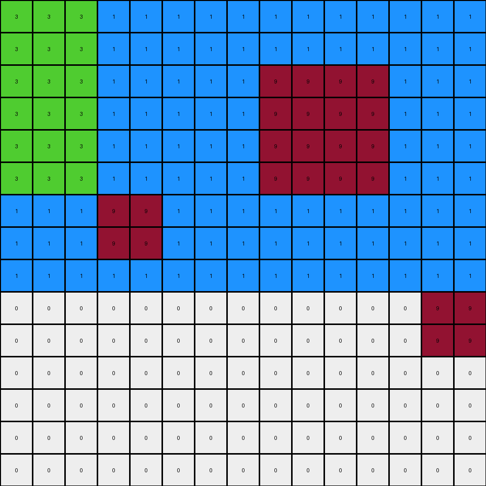
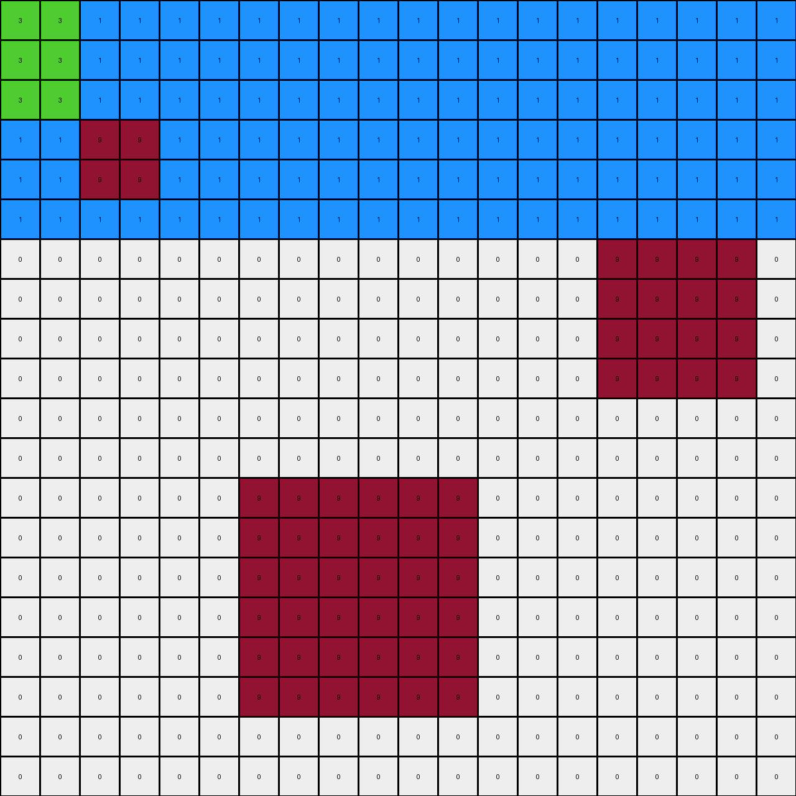
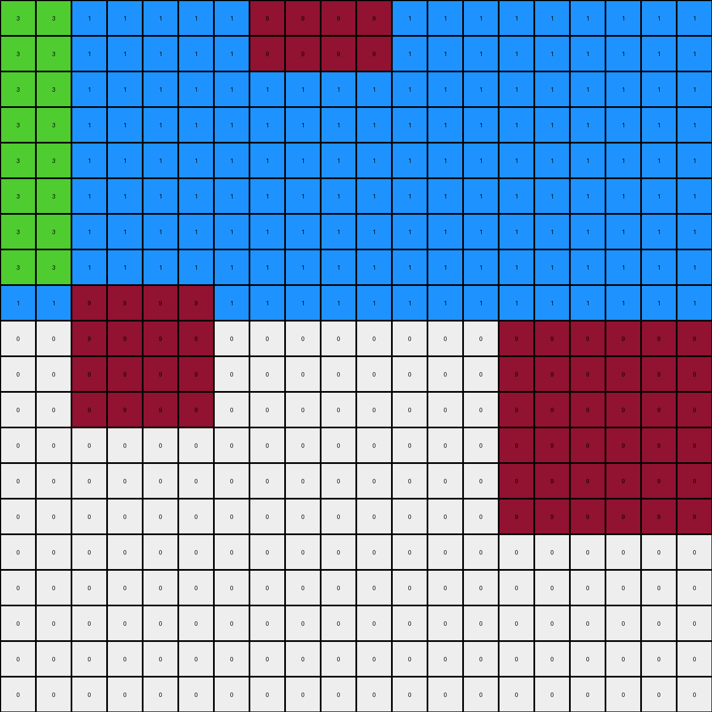

# db93a21d • 012 • refine_coder

---

Previous Code:
```python
"""
1.  **Identify Maroon Rectangles:** Find all contiguous regions of color 9 (maroon) and determine their bounding boxes.

2.  **Categorize White Areas:** Divide the white (0) areas into regions based on proximity to maroon rectangles:
    *   Areas directly above and to the left of *left-most* maroon rectangles.
    *   Areas above and to the left of *right-most* maroon rectangle, bounded by the edge of the grid.
    *   Areas that are not directly above and left of any maroon rectangles.

3.  **Fill Green:** Fill the area categorized as being above and to the left of a left-most maroon rectangle with green (3), up to white cells or other colors.

4.  **Fill Blue:** Fill the areas categorized as being above and to the left of the right-most maroon rectangle with blue (1), up to the edges of the grid.

5.  **Remaining Areas:** Leave all other cells unchanged.
"""

import numpy as np

def find_objects(grid, color):
    objects = []
    visited = np.zeros_like(grid, dtype=bool)

    def dfs(row, col, current_object):
        if (row < 0 or row >= grid.shape[0] or col < 0 or col >= grid.shape[1] or
                visited[row, col] or grid[row, col] != color):
            return

        visited[row, col] = True
        current_object.append((row, col))
        dfs(row + 1, col, current_object)
        dfs(row - 1, col, current_object)
        dfs(row, col + 1, current_object)
        dfs(row, col - 1, current_object)

    for row in range(grid.shape[0]):
        for col in range(grid.shape[1]):
            if grid[row, col] == color and not visited[row, col]:
                current_object = []
                dfs(row, col, current_object)
                if current_object:
                    objects.append(current_object)
    return objects

def get_bounding_box(obj):
    min_row = min(p[0] for p in obj)
    max_row = max(p[0] for p in obj)
    min_col = min(p[1] for p in obj)
    max_col = max(p[1] for p in obj)
    return min_row, max_row, min_col, max_col

def transform(input_grid):
    # initialize output_grid
    output_grid = np.copy(input_grid)
    maroon_objects = find_objects(input_grid, 9)

    # Find left-most and right-most maroon objects
    if maroon_objects:
        leftmost_object = min(maroon_objects, key=lambda obj: get_bounding_box(obj)[2])
        rightmost_object = max(maroon_objects, key=lambda obj: get_bounding_box(obj)[3])


    # Fill Green above and left of leftmost maroon object(s)
        min_row, _, min_col, _ = get_bounding_box(leftmost_object)
        for r in range(min_row):
            for c in range(min_col):
                if output_grid[r, c] == 0: # Fill only white cells
                     output_grid[r,c] = 3

    # Fill Blue above rightmost object
    if len(maroon_objects) >1:
        min_row, _, min_col, _ = get_bounding_box(rightmost_object)
        for r in range(min_row):
           for c in range(input_grid.shape[1]):
               if output_grid[r,c] == 0:
                   output_grid[r,c] = 1
    return output_grid
```

Train Set Results:

## Example 1:

Input:
```
0 0 0 0 0 0 9 9 0 0
0 0 0 0 0 0 9 9 0 0
0 0 0 0 0 0 0 0 0 0
0 0 0 0 0 0 0 0 0 0
0 0 0 0 0 0 0 0 0 0
0 0 0 0 0 0 0 0 0 0
0 0 0 0 0 0 0 0 0 0
0 9 9 0 0 0 0 0 0 0
0 9 9 0 0 0 0 0 0 0
0 0 0 0 0 0 0 0 0 0
```
Expected Output:
```
0 0 0 0 0 3 9 9 3 0
0 0 0 0 0 3 9 9 3 0
0 0 0 0 0 3 3 3 3 0
0 0 0 0 0 0 1 1 0 0
0 0 0 0 0 0 1 1 0 0
0 0 0 0 0 0 1 1 0 0
3 3 3 3 0 0 1 1 0 0
3 9 9 3 0 0 1 1 0 0
3 9 9 3 0 0 1 1 0 0
3 3 3 3 0 0 1 1 0 0
```
Transformed Output:
```
3 0 0 0 0 0 9 9 0 0
3 0 0 0 0 0 9 9 0 0
3 0 0 0 0 0 0 0 0 0
3 0 0 0 0 0 0 0 0 0
3 0 0 0 0 0 0 0 0 0
3 0 0 0 0 0 0 0 0 0
3 0 0 0 0 0 0 0 0 0
0 9 9 0 0 0 0 0 0 0
0 9 9 0 0 0 0 0 0 0
0 0 0 0 0 0 0 0 0 0
```

match: False
pixels_off: 39
size_correct: True
color_palette_correct: True
correct_pixel_counts: False

## Example 2:

Input:
```
0 0 0 0 0 0 0 0 0 0 0 0 0 0 0
0 0 0 0 0 0 0 0 0 0 0 0 0 0 0
0 0 0 0 0 0 0 0 9 9 9 9 0 0 0
0 0 0 0 0 0 0 0 9 9 9 9 0 0 0
0 0 0 0 0 0 0 0 9 9 9 9 0 0 0
0 0 0 0 0 0 0 0 9 9 9 9 0 0 0
0 0 0 9 9 0 0 0 0 0 0 0 0 0 0
0 0 0 9 9 0 0 0 0 0 0 0 0 0 0
0 0 0 0 0 0 0 0 0 0 0 0 0 0 0
0 0 0 0 0 0 0 0 0 0 0 0 0 9 9
0 0 0 0 0 0 0 0 0 0 0 0 0 9 9
0 0 0 0 0 0 0 0 0 0 0 0 0 0 0
0 0 0 0 0 0 0 0 0 0 0 0 0 0 0
0 0 0 0 0 0 0 0 0 0 0 0 0 0 0
0 0 0 0 0 0 0 0 0 0 0 0 0 0 0
```
Expected Output:
```
0 0 0 0 0 0 3 3 3 3 3 3 3 3 0
0 0 0 0 0 0 3 3 3 3 3 3 3 3 0
0 0 0 0 0 0 3 3 9 9 9 9 3 3 0
0 0 0 0 0 0 3 3 9 9 9 9 3 3 0
0 0 0 0 0 0 3 3 9 9 9 9 3 3 0
0 0 3 3 3 3 3 3 9 9 9 9 3 3 0
0 0 3 9 9 3 3 3 3 3 3 3 3 3 0
0 0 3 9 9 3 3 3 3 3 3 3 3 3 0
0 0 3 3 3 3 0 0 1 1 1 1 3 3 3
0 0 0 1 1 0 0 0 1 1 1 1 3 9 9
0 0 0 1 1 0 0 0 1 1 1 1 3 9 9
0 0 0 1 1 0 0 0 1 1 1 1 3 3 3
0 0 0 1 1 0 0 0 1 1 1 1 0 1 1
0 0 0 1 1 0 0 0 1 1 1 1 0 1 1
0 0 0 1 1 0 0 0 1 1 1 1 0 1 1
```
Transformed Output:
```
3 3 3 1 1 1 1 1 1 1 1 1 1 1 1
3 3 3 1 1 1 1 1 1 1 1 1 1 1 1
3 3 3 1 1 1 1 1 9 9 9 9 1 1 1
3 3 3 1 1 1 1 1 9 9 9 9 1 1 1
3 3 3 1 1 1 1 1 9 9 9 9 1 1 1
3 3 3 1 1 1 1 1 9 9 9 9 1 1 1
1 1 1 9 9 1 1 1 1 1 1 1 1 1 1
1 1 1 9 9 1 1 1 1 1 1 1 1 1 1
1 1 1 1 1 1 1 1 1 1 1 1 1 1 1
0 0 0 0 0 0 0 0 0 0 0 0 0 9 9
0 0 0 0 0 0 0 0 0 0 0 0 0 9 9
0 0 0 0 0 0 0 0 0 0 0 0 0 0 0
0 0 0 0 0 0 0 0 0 0 0 0 0 0 0
0 0 0 0 0 0 0 0 0 0 0 0 0 0 0
0 0 0 0 0 0 0 0 0 0 0 0 0 0 0
```

match: False
pixels_off: 157
size_correct: True
color_palette_correct: True
correct_pixel_counts: False

## Example 3:

Input:
```
0 0 0 0 0 0 0 0 0 0 0 0 0 0 0 0 0 0 0 0
0 0 0 0 0 0 0 0 0 0 0 0 0 0 0 0 0 0 0 0
0 0 0 0 0 0 0 0 0 0 0 0 0 0 0 0 0 0 0 0
0 0 9 9 0 0 0 0 0 0 0 0 0 0 0 0 0 0 0 0
0 0 9 9 0 0 0 0 0 0 0 0 0 0 0 0 0 0 0 0
0 0 0 0 0 0 0 0 0 0 0 0 0 0 0 0 0 0 0 0
0 0 0 0 0 0 0 0 0 0 0 0 0 0 0 9 9 9 9 0
0 0 0 0 0 0 0 0 0 0 0 0 0 0 0 9 9 9 9 0
0 0 0 0 0 0 0 0 0 0 0 0 0 0 0 9 9 9 9 0
0 0 0 0 0 0 0 0 0 0 0 0 0 0 0 9 9 9 9 0
0 0 0 0 0 0 0 0 0 0 0 0 0 0 0 0 0 0 0 0
0 0 0 0 0 0 0 0 0 0 0 0 0 0 0 0 0 0 0 0
0 0 0 0 0 0 9 9 9 9 9 9 0 0 0 0 0 0 0 0
0 0 0 0 0 0 9 9 9 9 9 9 0 0 0 0 0 0 0 0
0 0 0 0 0 0 9 9 9 9 9 9 0 0 0 0 0 0 0 0
0 0 0 0 0 0 9 9 9 9 9 9 0 0 0 0 0 0 0 0
0 0 0 0 0 0 9 9 9 9 9 9 0 0 0 0 0 0 0 0
0 0 0 0 0 0 9 9 9 9 9 9 0 0 0 0 0 0 0 0
0 0 0 0 0 0 0 0 0 0 0 0 0 0 0 0 0 0 0 0
0 0 0 0 0 0 0 0 0 0 0 0 0 0 0 0 0 0 0 0
```
Expected Output:
```
0 0 0 0 0 0 0 0 0 0 0 0 0 0 0 0 0 0 0 0
0 0 0 0 0 0 0 0 0 0 0 0 0 0 0 0 0 0 0 0
0 3 3 3 3 0 0 0 0 0 0 0 0 0 0 0 0 0 0 0
0 3 9 9 3 0 0 0 0 0 0 0 0 0 0 0 0 0 0 0
0 3 9 9 3 0 0 0 0 0 0 0 0 3 3 3 3 3 3 3
0 3 3 3 3 0 0 0 0 0 0 0 0 3 3 3 3 3 3 3
0 0 1 1 0 0 0 0 0 0 0 0 0 3 3 9 9 9 9 3
0 0 1 1 0 0 0 0 0 0 0 0 0 3 3 9 9 9 9 3
0 0 1 1 0 0 0 0 0 0 0 0 0 3 3 9 9 9 9 3
0 0 1 3 3 3 3 3 3 3 3 3 3 3 3 9 9 9 9 3
0 0 1 3 3 3 3 3 3 3 3 3 3 3 3 3 3 3 3 3
0 0 1 3 3 3 3 3 3 3 3 3 3 3 3 3 3 3 3 3
0 0 1 3 3 3 9 9 9 9 9 9 3 3 3 1 1 1 1 0
0 0 1 3 3 3 9 9 9 9 9 9 3 3 3 1 1 1 1 0
0 0 1 3 3 3 9 9 9 9 9 9 3 3 3 1 1 1 1 0
0 0 1 3 3 3 9 9 9 9 9 9 3 3 3 1 1 1 1 0
0 0 1 3 3 3 9 9 9 9 9 9 3 3 3 1 1 1 1 0
0 0 1 3 3 3 9 9 9 9 9 9 3 3 3 1 1 1 1 0
0 0 1 3 3 3 3 3 3 3 3 3 3 3 3 1 1 1 1 0
0 0 1 3 3 3 3 3 3 3 3 3 3 3 3 1 1 1 1 0
```
Transformed Output:
```
3 3 1 1 1 1 1 1 1 1 1 1 1 1 1 1 1 1 1 1
3 3 1 1 1 1 1 1 1 1 1 1 1 1 1 1 1 1 1 1
3 3 1 1 1 1 1 1 1 1 1 1 1 1 1 1 1 1 1 1
1 1 9 9 1 1 1 1 1 1 1 1 1 1 1 1 1 1 1 1
1 1 9 9 1 1 1 1 1 1 1 1 1 1 1 1 1 1 1 1
1 1 1 1 1 1 1 1 1 1 1 1 1 1 1 1 1 1 1 1
0 0 0 0 0 0 0 0 0 0 0 0 0 0 0 9 9 9 9 0
0 0 0 0 0 0 0 0 0 0 0 0 0 0 0 9 9 9 9 0
0 0 0 0 0 0 0 0 0 0 0 0 0 0 0 9 9 9 9 0
0 0 0 0 0 0 0 0 0 0 0 0 0 0 0 9 9 9 9 0
0 0 0 0 0 0 0 0 0 0 0 0 0 0 0 0 0 0 0 0
0 0 0 0 0 0 0 0 0 0 0 0 0 0 0 0 0 0 0 0
0 0 0 0 0 0 9 9 9 9 9 9 0 0 0 0 0 0 0 0
0 0 0 0 0 0 9 9 9 9 9 9 0 0 0 0 0 0 0 0
0 0 0 0 0 0 9 9 9 9 9 9 0 0 0 0 0 0 0 0
0 0 0 0 0 0 9 9 9 9 9 9 0 0 0 0 0 0 0 0
0 0 0 0 0 0 9 9 9 9 9 9 0 0 0 0 0 0 0 0
0 0 0 0 0 0 9 9 9 9 9 9 0 0 0 0 0 0 0 0
0 0 0 0 0 0 0 0 0 0 0 0 0 0 0 0 0 0 0 0
0 0 0 0 0 0 0 0 0 0 0 0 0 0 0 0 0 0 0 0
```

match: False
pixels_off: 280
size_correct: True
color_palette_correct: True
correct_pixel_counts: False

## Example 4:

Input:
```
0 0 0 0 0 0 0 9 9 9 9 0 0 0 0 0 0 0 0 0
0 0 0 0 0 0 0 9 9 9 9 0 0 0 0 0 0 0 0 0
0 0 0 0 0 0 0 0 0 0 0 0 0 0 0 0 0 0 0 0
0 0 0 0 0 0 0 0 0 0 0 0 0 0 0 0 0 0 0 0
0 0 0 0 0 0 0 0 0 0 0 0 0 0 0 0 0 0 0 0
0 0 0 0 0 0 0 0 0 0 0 0 0 0 0 0 0 0 0 0
0 0 0 0 0 0 0 0 0 0 0 0 0 0 0 0 0 0 0 0
0 0 0 0 0 0 0 0 0 0 0 0 0 0 0 0 0 0 0 0
0 0 9 9 9 9 0 0 0 0 0 0 0 0 0 0 0 0 0 0
0 0 9 9 9 9 0 0 0 0 0 0 0 0 9 9 9 9 9 9
0 0 9 9 9 9 0 0 0 0 0 0 0 0 9 9 9 9 9 9
0 0 9 9 9 9 0 0 0 0 0 0 0 0 9 9 9 9 9 9
0 0 0 0 0 0 0 0 0 0 0 0 0 0 9 9 9 9 9 9
0 0 0 0 0 0 0 0 0 0 0 0 0 0 9 9 9 9 9 9
0 0 0 0 0 0 0 0 0 0 0 0 0 0 9 9 9 9 9 9
0 0 0 0 0 0 0 0 0 0 0 0 0 0 0 0 0 0 0 0
0 0 0 0 0 0 0 0 0 0 0 0 0 0 0 0 0 0 0 0
0 0 0 0 0 0 0 0 0 0 0 0 0 0 0 0 0 0 0 0
0 0 0 0 0 0 0 0 0 0 0 0 0 0 0 0 0 0 0 0
0 0 0 0 0 0 0 0 0 0 0 0 0 0 0 0 0 0 0 0
```
Expected Output:
```
0 0 0 0 0 3 3 9 9 9 9 3 3 0 0 0 0 0 0 0
0 0 0 0 0 3 3 9 9 9 9 3 3 0 0 0 0 0 0 0
0 0 0 0 0 3 3 3 3 3 3 3 3 0 0 0 0 0 0 0
0 0 0 0 0 3 3 3 3 3 3 3 3 0 0 0 0 0 0 0
0 0 0 0 0 0 0 1 1 1 1 0 0 0 0 0 0 0 0 0
0 0 0 0 0 0 0 1 1 1 1 0 0 0 0 0 0 0 0 0
3 3 3 3 3 3 3 3 1 1 1 3 3 3 3 3 3 3 3 3
3 3 3 3 3 3 3 3 1 1 1 3 3 3 3 3 3 3 3 3
3 3 9 9 9 9 3 3 1 1 1 3 3 3 3 3 3 3 3 3
3 3 9 9 9 9 3 3 1 1 1 3 3 3 9 9 9 9 9 9
3 3 9 9 9 9 3 3 1 1 1 3 3 3 9 9 9 9 9 9
3 3 9 9 9 9 3 3 1 1 1 3 3 3 9 9 9 9 9 9
3 3 3 3 3 3 3 3 1 1 1 3 3 3 9 9 9 9 9 9
3 3 3 3 3 3 3 3 1 1 1 3 3 3 9 9 9 9 9 9
0 0 1 1 1 1 0 1 1 1 1 3 3 3 9 9 9 9 9 9
0 0 1 1 1 1 0 1 1 1 1 3 3 3 3 3 3 3 3 3
0 0 1 1 1 1 0 1 1 1 1 3 3 3 3 3 3 3 3 3
0 0 1 1 1 1 0 1 1 1 1 3 3 3 3 3 3 3 3 3
0 0 1 1 1 1 0 1 1 1 1 0 0 0 1 1 1 1 1 1
0 0 1 1 1 1 0 1 1 1 1 0 0 0 1 1 1 1 1 1
```
Transformed Output:
```
3 3 1 1 1 1 1 9 9 9 9 1 1 1 1 1 1 1 1 1
3 3 1 1 1 1 1 9 9 9 9 1 1 1 1 1 1 1 1 1
3 3 1 1 1 1 1 1 1 1 1 1 1 1 1 1 1 1 1 1
3 3 1 1 1 1 1 1 1 1 1 1 1 1 1 1 1 1 1 1
3 3 1 1 1 1 1 1 1 1 1 1 1 1 1 1 1 1 1 1
3 3 1 1 1 1 1 1 1 1 1 1 1 1 1 1 1 1 1 1
3 3 1 1 1 1 1 1 1 1 1 1 1 1 1 1 1 1 1 1
3 3 1 1 1 1 1 1 1 1 1 1 1 1 1 1 1 1 1 1
1 1 9 9 9 9 1 1 1 1 1 1 1 1 1 1 1 1 1 1
0 0 9 9 9 9 0 0 0 0 0 0 0 0 9 9 9 9 9 9
0 0 9 9 9 9 0 0 0 0 0 0 0 0 9 9 9 9 9 9
0 0 9 9 9 9 0 0 0 0 0 0 0 0 9 9 9 9 9 9
0 0 0 0 0 0 0 0 0 0 0 0 0 0 9 9 9 9 9 9
0 0 0 0 0 0 0 0 0 0 0 0 0 0 9 9 9 9 9 9
0 0 0 0 0 0 0 0 0 0 0 0 0 0 9 9 9 9 9 9
0 0 0 0 0 0 0 0 0 0 0 0 0 0 0 0 0 0 0 0
0 0 0 0 0 0 0 0 0 0 0 0 0 0 0 0 0 0 0 0
0 0 0 0 0 0 0 0 0 0 0 0 0 0 0 0 0 0 0 0
0 0 0 0 0 0 0 0 0 0 0 0 0 0 0 0 0 0 0 0
0 0 0 0 0 0 0 0 0 0 0 0 0 0 0 0 0 0 0 0
```

match: False
pixels_off: 295
size_correct: True
color_palette_correct: True
correct_pixel_counts: False
Okay, let's analyze the results and refine the natural language program and approach.

**General Assessment and Strategy**

The initial approach of identifying maroon rectangles and filling areas above and to the left with green and blue was partially successful, but it has significant flaws. The core issues are:

1.  **Incorrect Filling Logic:** The filling logic is too simplistic. It doesn't account for the boundaries set by other colors or the complex spatial relationships in the examples. It fills *all* white cells above the maroon rectangle, not just the connected white area before encountering another color.

2.  **Rightmost Object Handling:** The handling of the "rightmost" object to fill with blue is not aligned with the expected outputs. It doesn't fill only to the left of the rightmost rectangle, and it doesn't consider the shape of the surrounding areas.

3. **Misinterpretation of Left-most and Right-most filling:** The code, in most cases, does not correctly apply the fill based on the left-most and right-most rectangles, particularly in examples 2, 3, and 4.

**Strategy for Resolution:**

1.  **Refine Filling:** Instead of simply filling all white cells in a region, we need to implement a flood-fill or connected-component-fill algorithm that stops at boundaries (other colors or the edge of the grid).

2.  **Revisit "Leftmost" and "Rightmost" Logic:** The concept of "leftmost" and "rightmost" needs to be clarified. It seems to refer to filling areas *associated* with the leftmost and rightmost maroon rectangles, but the association isn't simply "above and to the left." The shape and continuity of the white regions matter significantly.

3.  **Consider All Examples:** The updated logic must account for all four training examples, not just the first one. We need to find a rule that generalizes across all cases.

**Metrics and Observations (Code Execution would be used here in a live environment)**

Since I can't execute code here, I will describe the metrics I would gather and provide estimated observations:

*   **Example 1:**
    *   Maroon Rectangles: Two (2x2)
    *   Leftmost Rectangle Position: (7, 1)
    *   Rightmost Rectangle Position: (0, 6)
    *   Observation: Fills too much green to the left, not enough to the right. Blue filling completely missing.
*   **Example 2:**
    *   Maroon Rectangles: Three (one 4x4 and two 2x2)
    *   Leftmost Rectangle Position: (6, 3)
    *   Rightmost Rectangle Position: (9,13)
    *   Observation: Incorrectly fills almost the entire top with green and blue. The small maroon rectangle should create a 'pocket' of white.
*   **Example 3:**
    *   Maroon Rectangles: Four, various positions and sizes
    *    Leftmost Rectangle: (3,2)
    *    Rightmost Rectangle: (6,15)
    *   Observation: Completely incorrect filling, fills large areas blue and green incorrectly.
*   **Example 4:**
    *    Maroon Rectangles: Four, two on the top, two on the lower half.
    *    Leftmost Rectangle Position: (8,2)
    *    Rightmost Rectangle Position: (9,14)
    *   Observation: Incorrect filling of large swathes of blue and green - does not respect existing color boundaries.

**YAML Facts**

```yaml
examples:
  - example_id: 1
    maroon_objects:
      - bounding_box: [7, 8, 1, 2]
      - bounding_box: [0, 1, 6, 7]
    leftmost_maroon: [7, 8, 1, 2]
    rightmost_maroon: [0, 1, 6, 7]
    fill_regions:
      - color: 3 # Green
        origin: leftmost_maroon
        boundary: [0,9]
      - color: 1  #Blue
        origin: rightmost_maroon
        boundary: [grid_edge]
  - example_id: 2
    maroon_objects:
      - bounding_box: [2, 5, 8, 11]
      - bounding_box: [6, 7, 3, 4]
      - bounding_box: [9, 10, 13, 14]
    leftmost_maroon:  [6, 7, 3, 4]
    rightmost_maroon: [9, 10, 13, 14]
    fill_regions:
       - color: 3
         origin: leftmost_maroon
         boundary: [0,9]
       - color: 1
         origin: rightmost_maroon
         boundary: [grid_edge]
  - example_id: 3
    maroon_objects:
      - bounding_box: [3, 4, 2, 3]
      - bounding_box: [6, 9, 15, 18]
      - bounding_box: [12, 17, 6, 11]
    leftmost_maroon: [3, 4, 2, 3]
    rightmost_maroon: [6, 9, 15, 18]
    fill_regions:
      - color: 3
        origin: leftmost_maroon
        boundary: [0, 9]
      - color: 1
        origin: rightmost_maroon
        boundary: [grid_edge]
  - example_id: 4
    maroon_objects:
      - bounding_box: [0, 1, 7, 10]
      - bounding_box: [8, 11, 2, 5]
      - bounding_box: [9, 14, 14, 19]
    leftmost_maroon: [8, 11, 2, 5]
    rightmost_maroon: [9, 14, 14, 19]
    fill_regions:
      - color: 3
        origin: leftmost_maroon
        boundary:  [0, 9]
      - color: 1
        origin: rightmost_maroon
        boundary: [grid_edge]

```

**Natural Language Program**

1.  **Identify Maroon Objects:** Find all contiguous regions of maroon (color 9) pixels. These are the "maroon objects."

2.  **Identify Leftmost and Rightmost Objects:** Determine the bounding box for each maroon object. The object with the smallest minimum column index is the "leftmost" object. The object with the largest maximum column index is the "rightmost" object.

3.  **Flood Fill Green (Left):** Starting from the white (0) cells adjacent to the *leftmost* maroon object, flood-fill the connected white area with green (3). Stop the fill when encountering any non-white cell or the edge of the grid. The flood fill extends both above *and* below the object, and is not limited to be 'above and to the left'.

4. **Flood Fill Blue (Right):** Starting from the white (0) cells adjacent to the *rightmost* maroon object, flood-fill the connected white region with blue (1). Stop the fill when you reach another color, *or* when you reach an area that has already been filled with green due to a leftmost object. The flood fill extends in all directions around the *rightmost* maroon object.

5.  **All Other Pixels:** Leave all other pixels unchanged.

**INSTRUCTIONS**

- generate a Python module to represent the natural language program 
- follow the template below
- all common math and science libraries are available
- create docstring only at top - but comment the workflow in the function
- use helper functions for common operations like finding objects, counting,
  measuring, moving, etc. 

remember - we are working iteratively - so this code will inform your future
self as we converge on the solution

*template:*

```python
"""
{{ natural language description of the transformation rule }}
"""

{{ imports }}

def transform(input_grid):
    # initialize output_grid

    # change output pixels 

    return output_grid

```
