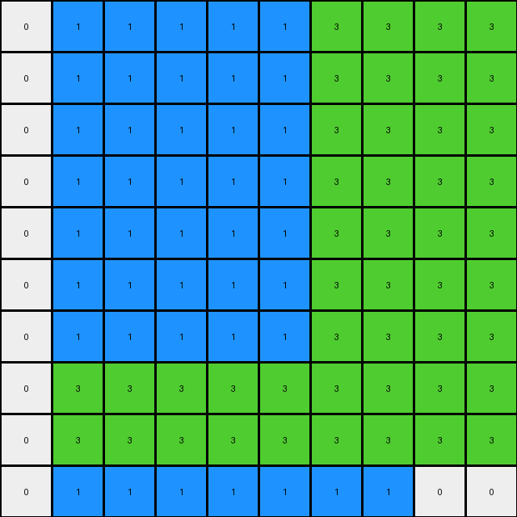
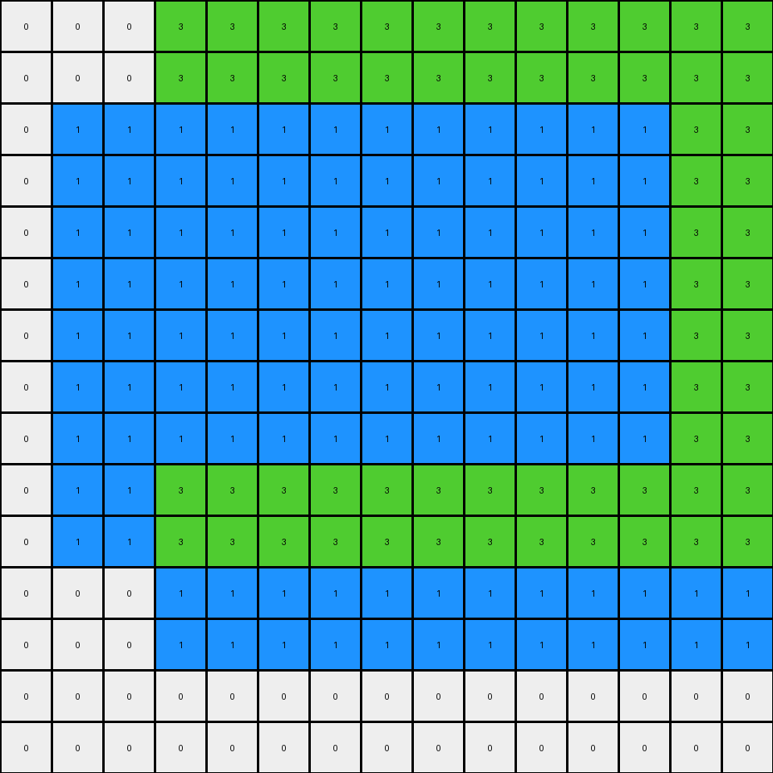
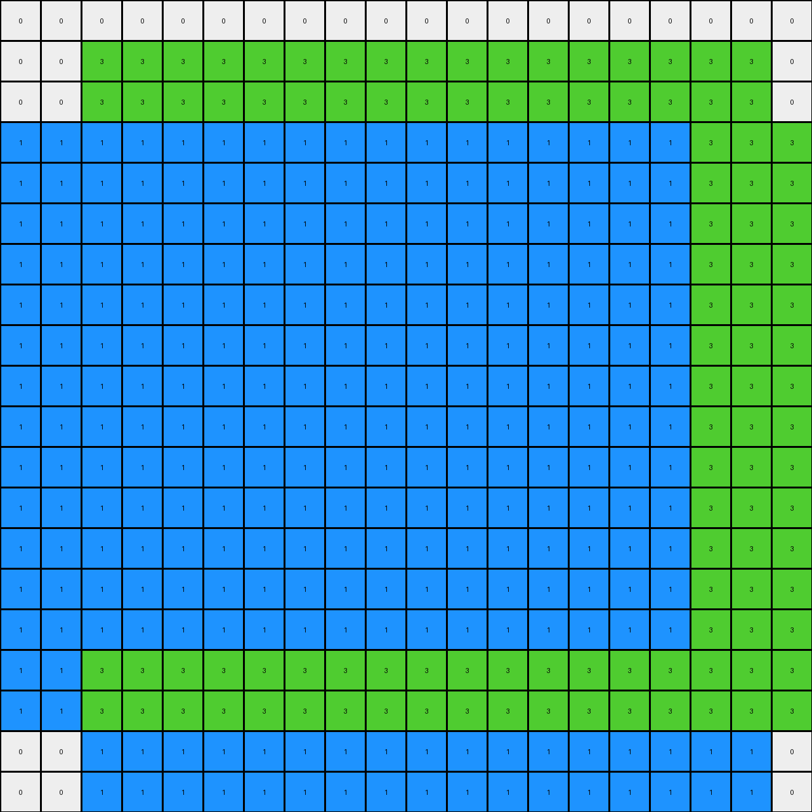
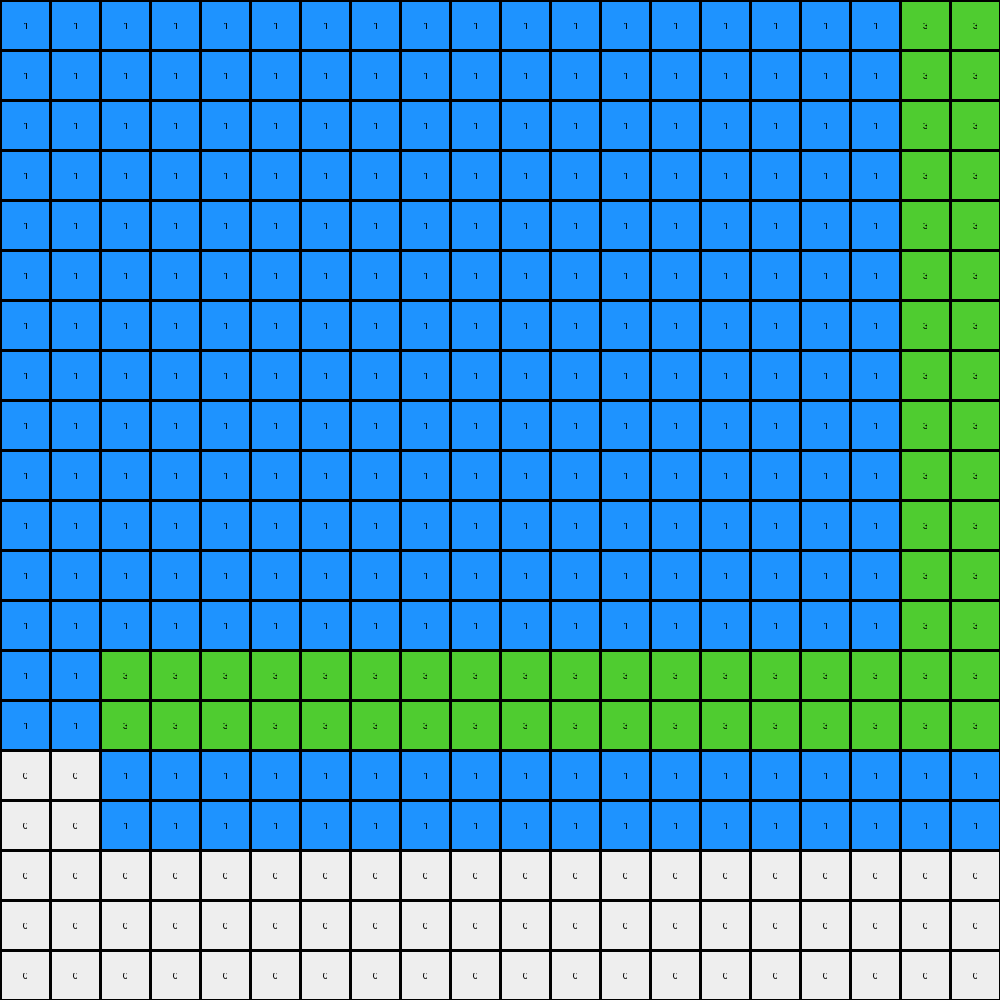

# db93a21d • 021 • refine_dreamer

---

Previous Code:
```python
"""
This program transforms an input grid containing two maroon rectangles into an output grid where the rectangles
are partially recolored to blue and green, and surrounded by green and blue filling.
"""

import numpy as np

def find_object(grid, color):
    # Find the bounding box of the object of the given color.
    rows, cols = np.where(grid == color)
    if len(rows) == 0:
        return None  # Object not found
    min_row, max_row = np.min(rows), np.max(rows)
    min_col, max_col = np.min(cols), np.max(cols)
    return (min_row, min_col), (max_row, max_col)

def transform(input_grid):
    # Initialize output_grid as a copy of the input_grid
    output_grid = np.copy(input_grid)

    # Find the two maroon rectangles
    top_left_start, top_left_end = find_object(input_grid, 9)
    bottom_right_start, bottom_right_end = find_object(input_grid, 9)
    
    # Check if the top-left rectangle exists
    if top_left_start is not None:
        # Top-Left Maroon Shape Transformation

        # Fill right with green
        output_grid[top_left_start[0]:top_left_end[0]+1, top_left_end[1] + 1:top_left_end[1] + 3] = 3
        # Fill below with blue
        output_grid[top_left_end[0] + 1:top_left_end[0] + 3, top_left_start[1]:top_left_end[1]+1] = 1

        # Change top two rows to green
        output_grid[top_left_start[0]:top_left_start[0] + 2, top_left_start[1]:top_left_end[1] + 1] = 3
        # Change leftmost two columns to green
        output_grid[top_left_start[0]:top_left_end[0] + 1, top_left_start[1]:top_left_start[1] + 2] = 3
        # Change the remaining to blue
        output_grid[top_left_start[0] + 2:top_left_end[0] + 1, top_left_start[1] + 2:top_left_end[1] + 1] = 1


    # Check if the bottom-right rectangle exists
    if bottom_right_start is not None:
        # Bottom-Right Maroon Shape Transformation
        
        # Fill left with blue
        output_grid[bottom_right_start[0]:bottom_right_end[0]+1, bottom_right_start[1]-2:bottom_right_start[1]] = 1
        #Fill above with green
        output_grid[bottom_right_start[0]-2:bottom_right_start[0], bottom_right_start[1]:bottom_right_end[1]+1] = 3

        # Change rightmost two columns to green
        output_grid[bottom_right_start[0]:bottom_right_end[0] + 1, bottom_right_end[1] - 1:bottom_right_end[1] + 1] = 3
        # Change bottom two rows to green
        output_grid[bottom_right_end[0] - 1:bottom_right_end[0] + 1, bottom_right_start[1]:bottom_right_end[1] + 1] = 3
        # Change the remaining to blue
        output_grid[bottom_right_start[0]:bottom_right_end[0] - 1, bottom_right_start[1]:bottom_right_end[1] - 1] = 1

    return output_grid
```

Train Set Results:

## Example 1:

Input:
```
0 0 0 0 0 0 9 9 0 0
0 0 0 0 0 0 9 9 0 0
0 0 0 0 0 0 0 0 0 0
0 0 0 0 0 0 0 0 0 0
0 0 0 0 0 0 0 0 0 0
0 0 0 0 0 0 0 0 0 0
0 0 0 0 0 0 0 0 0 0
0 9 9 0 0 0 0 0 0 0
0 9 9 0 0 0 0 0 0 0
0 0 0 0 0 0 0 0 0 0
```
Expected Output:
```
0 0 0 0 0 3 9 9 3 0
0 0 0 0 0 3 9 9 3 0
0 0 0 0 0 3 3 3 3 0
0 0 0 0 0 0 1 1 0 0
0 0 0 0 0 0 1 1 0 0
0 0 0 0 0 0 1 1 0 0
3 3 3 3 0 0 1 1 0 0
3 9 9 3 0 0 1 1 0 0
3 9 9 3 0 0 1 1 0 0
3 3 3 3 0 0 1 1 0 0
```
Transformed Output:
```
0 1 1 1 1 1 3 3 3 3
0 1 1 1 1 1 3 3 3 3
0 1 1 1 1 1 3 3 3 3
0 1 1 1 1 1 3 3 3 3
0 1 1 1 1 1 3 3 3 3
0 1 1 1 1 1 3 3 3 3
0 1 1 1 1 1 3 3 3 3
0 3 3 3 3 3 3 3 3 3
0 3 3 3 3 3 3 3 3 3
0 1 1 1 1 1 1 1 0 0
```

match: False
pixels_off: 83
size_correct: True
color_palette_correct: True
correct_pixel_counts: False

## Example 2:

Input:
```
0 0 0 0 0 0 0 0 0 0 0 0 0 0 0
0 0 0 0 0 0 0 0 0 0 0 0 0 0 0
0 0 0 0 0 0 0 0 9 9 9 9 0 0 0
0 0 0 0 0 0 0 0 9 9 9 9 0 0 0
0 0 0 0 0 0 0 0 9 9 9 9 0 0 0
0 0 0 0 0 0 0 0 9 9 9 9 0 0 0
0 0 0 9 9 0 0 0 0 0 0 0 0 0 0
0 0 0 9 9 0 0 0 0 0 0 0 0 0 0
0 0 0 0 0 0 0 0 0 0 0 0 0 0 0
0 0 0 0 0 0 0 0 0 0 0 0 0 9 9
0 0 0 0 0 0 0 0 0 0 0 0 0 9 9
0 0 0 0 0 0 0 0 0 0 0 0 0 0 0
0 0 0 0 0 0 0 0 0 0 0 0 0 0 0
0 0 0 0 0 0 0 0 0 0 0 0 0 0 0
0 0 0 0 0 0 0 0 0 0 0 0 0 0 0
```
Expected Output:
```
0 0 0 0 0 0 3 3 3 3 3 3 3 3 0
0 0 0 0 0 0 3 3 3 3 3 3 3 3 0
0 0 0 0 0 0 3 3 9 9 9 9 3 3 0
0 0 0 0 0 0 3 3 9 9 9 9 3 3 0
0 0 0 0 0 0 3 3 9 9 9 9 3 3 0
0 0 3 3 3 3 3 3 9 9 9 9 3 3 0
0 0 3 9 9 3 3 3 3 3 3 3 3 3 0
0 0 3 9 9 3 3 3 3 3 3 3 3 3 0
0 0 3 3 3 3 0 0 1 1 1 1 3 3 3
0 0 0 1 1 0 0 0 1 1 1 1 3 9 9
0 0 0 1 1 0 0 0 1 1 1 1 3 9 9
0 0 0 1 1 0 0 0 1 1 1 1 3 3 3
0 0 0 1 1 0 0 0 1 1 1 1 0 1 1
0 0 0 1 1 0 0 0 1 1 1 1 0 1 1
0 0 0 1 1 0 0 0 1 1 1 1 0 1 1
```
Transformed Output:
```
0 0 0 3 3 3 3 3 3 3 3 3 3 3 3
0 0 0 3 3 3 3 3 3 3 3 3 3 3 3
0 1 1 1 1 1 1 1 1 1 1 1 1 3 3
0 1 1 1 1 1 1 1 1 1 1 1 1 3 3
0 1 1 1 1 1 1 1 1 1 1 1 1 3 3
0 1 1 1 1 1 1 1 1 1 1 1 1 3 3
0 1 1 1 1 1 1 1 1 1 1 1 1 3 3
0 1 1 1 1 1 1 1 1 1 1 1 1 3 3
0 1 1 1 1 1 1 1 1 1 1 1 1 3 3
0 1 1 3 3 3 3 3 3 3 3 3 3 3 3
0 1 1 3 3 3 3 3 3 3 3 3 3 3 3
0 0 0 1 1 1 1 1 1 1 1 1 1 1 1
0 0 0 1 1 1 1 1 1 1 1 1 1 1 1
0 0 0 0 0 0 0 0 0 0 0 0 0 0 0
0 0 0 0 0 0 0 0 0 0 0 0 0 0 0
```

match: False
pixels_off: 146
size_correct: True
color_palette_correct: True
correct_pixel_counts: False

## Example 3:

Input:
```
0 0 0 0 0 0 0 0 0 0 0 0 0 0 0 0 0 0 0 0
0 0 0 0 0 0 0 0 0 0 0 0 0 0 0 0 0 0 0 0
0 0 0 0 0 0 0 0 0 0 0 0 0 0 0 0 0 0 0 0
0 0 9 9 0 0 0 0 0 0 0 0 0 0 0 0 0 0 0 0
0 0 9 9 0 0 0 0 0 0 0 0 0 0 0 0 0 0 0 0
0 0 0 0 0 0 0 0 0 0 0 0 0 0 0 0 0 0 0 0
0 0 0 0 0 0 0 0 0 0 0 0 0 0 0 9 9 9 9 0
0 0 0 0 0 0 0 0 0 0 0 0 0 0 0 9 9 9 9 0
0 0 0 0 0 0 0 0 0 0 0 0 0 0 0 9 9 9 9 0
0 0 0 0 0 0 0 0 0 0 0 0 0 0 0 9 9 9 9 0
0 0 0 0 0 0 0 0 0 0 0 0 0 0 0 0 0 0 0 0
0 0 0 0 0 0 0 0 0 0 0 0 0 0 0 0 0 0 0 0
0 0 0 0 0 0 9 9 9 9 9 9 0 0 0 0 0 0 0 0
0 0 0 0 0 0 9 9 9 9 9 9 0 0 0 0 0 0 0 0
0 0 0 0 0 0 9 9 9 9 9 9 0 0 0 0 0 0 0 0
0 0 0 0 0 0 9 9 9 9 9 9 0 0 0 0 0 0 0 0
0 0 0 0 0 0 9 9 9 9 9 9 0 0 0 0 0 0 0 0
0 0 0 0 0 0 9 9 9 9 9 9 0 0 0 0 0 0 0 0
0 0 0 0 0 0 0 0 0 0 0 0 0 0 0 0 0 0 0 0
0 0 0 0 0 0 0 0 0 0 0 0 0 0 0 0 0 0 0 0
```
Expected Output:
```
0 0 0 0 0 0 0 0 0 0 0 0 0 0 0 0 0 0 0 0
0 0 0 0 0 0 0 0 0 0 0 0 0 0 0 0 0 0 0 0
0 3 3 3 3 0 0 0 0 0 0 0 0 0 0 0 0 0 0 0
0 3 9 9 3 0 0 0 0 0 0 0 0 0 0 0 0 0 0 0
0 3 9 9 3 0 0 0 0 0 0 0 0 3 3 3 3 3 3 3
0 3 3 3 3 0 0 0 0 0 0 0 0 3 3 3 3 3 3 3
0 0 1 1 0 0 0 0 0 0 0 0 0 3 3 9 9 9 9 3
0 0 1 1 0 0 0 0 0 0 0 0 0 3 3 9 9 9 9 3
0 0 1 1 0 0 0 0 0 0 0 0 0 3 3 9 9 9 9 3
0 0 1 3 3 3 3 3 3 3 3 3 3 3 3 9 9 9 9 3
0 0 1 3 3 3 3 3 3 3 3 3 3 3 3 3 3 3 3 3
0 0 1 3 3 3 3 3 3 3 3 3 3 3 3 3 3 3 3 3
0 0 1 3 3 3 9 9 9 9 9 9 3 3 3 1 1 1 1 0
0 0 1 3 3 3 9 9 9 9 9 9 3 3 3 1 1 1 1 0
0 0 1 3 3 3 9 9 9 9 9 9 3 3 3 1 1 1 1 0
0 0 1 3 3 3 9 9 9 9 9 9 3 3 3 1 1 1 1 0
0 0 1 3 3 3 9 9 9 9 9 9 3 3 3 1 1 1 1 0
0 0 1 3 3 3 9 9 9 9 9 9 3 3 3 1 1 1 1 0
0 0 1 3 3 3 3 3 3 3 3 3 3 3 3 1 1 1 1 0
0 0 1 3 3 3 3 3 3 3 3 3 3 3 3 1 1 1 1 0
```
Transformed Output:
```
0 0 0 0 0 0 0 0 0 0 0 0 0 0 0 0 0 0 0 0
0 0 3 3 3 3 3 3 3 3 3 3 3 3 3 3 3 3 3 0
0 0 3 3 3 3 3 3 3 3 3 3 3 3 3 3 3 3 3 0
1 1 1 1 1 1 1 1 1 1 1 1 1 1 1 1 1 3 3 3
1 1 1 1 1 1 1 1 1 1 1 1 1 1 1 1 1 3 3 3
1 1 1 1 1 1 1 1 1 1 1 1 1 1 1 1 1 3 3 3
1 1 1 1 1 1 1 1 1 1 1 1 1 1 1 1 1 3 3 3
1 1 1 1 1 1 1 1 1 1 1 1 1 1 1 1 1 3 3 3
1 1 1 1 1 1 1 1 1 1 1 1 1 1 1 1 1 3 3 3
1 1 1 1 1 1 1 1 1 1 1 1 1 1 1 1 1 3 3 3
1 1 1 1 1 1 1 1 1 1 1 1 1 1 1 1 1 3 3 3
1 1 1 1 1 1 1 1 1 1 1 1 1 1 1 1 1 3 3 3
1 1 1 1 1 1 1 1 1 1 1 1 1 1 1 1 1 3 3 3
1 1 1 1 1 1 1 1 1 1 1 1 1 1 1 1 1 3 3 3
1 1 1 1 1 1 1 1 1 1 1 1 1 1 1 1 1 3 3 3
1 1 1 1 1 1 1 1 1 1 1 1 1 1 1 1 1 3 3 3
1 1 3 3 3 3 3 3 3 3 3 3 3 3 3 3 3 3 3 3
1 1 3 3 3 3 3 3 3 3 3 3 3 3 3 3 3 3 3 3
0 0 1 1 1 1 1 1 1 1 1 1 1 1 1 1 1 1 1 0
0 0 1 1 1 1 1 1 1 1 1 1 1 1 1 1 1 1 1 0
```

match: False
pixels_off: 307
size_correct: True
color_palette_correct: True
correct_pixel_counts: False

## Example 4:

Input:
```
0 0 0 0 0 0 0 9 9 9 9 0 0 0 0 0 0 0 0 0
0 0 0 0 0 0 0 9 9 9 9 0 0 0 0 0 0 0 0 0
0 0 0 0 0 0 0 0 0 0 0 0 0 0 0 0 0 0 0 0
0 0 0 0 0 0 0 0 0 0 0 0 0 0 0 0 0 0 0 0
0 0 0 0 0 0 0 0 0 0 0 0 0 0 0 0 0 0 0 0
0 0 0 0 0 0 0 0 0 0 0 0 0 0 0 0 0 0 0 0
0 0 0 0 0 0 0 0 0 0 0 0 0 0 0 0 0 0 0 0
0 0 0 0 0 0 0 0 0 0 0 0 0 0 0 0 0 0 0 0
0 0 9 9 9 9 0 0 0 0 0 0 0 0 0 0 0 0 0 0
0 0 9 9 9 9 0 0 0 0 0 0 0 0 9 9 9 9 9 9
0 0 9 9 9 9 0 0 0 0 0 0 0 0 9 9 9 9 9 9
0 0 9 9 9 9 0 0 0 0 0 0 0 0 9 9 9 9 9 9
0 0 0 0 0 0 0 0 0 0 0 0 0 0 9 9 9 9 9 9
0 0 0 0 0 0 0 0 0 0 0 0 0 0 9 9 9 9 9 9
0 0 0 0 0 0 0 0 0 0 0 0 0 0 9 9 9 9 9 9
0 0 0 0 0 0 0 0 0 0 0 0 0 0 0 0 0 0 0 0
0 0 0 0 0 0 0 0 0 0 0 0 0 0 0 0 0 0 0 0
0 0 0 0 0 0 0 0 0 0 0 0 0 0 0 0 0 0 0 0
0 0 0 0 0 0 0 0 0 0 0 0 0 0 0 0 0 0 0 0
0 0 0 0 0 0 0 0 0 0 0 0 0 0 0 0 0 0 0 0
```
Expected Output:
```
0 0 0 0 0 3 3 9 9 9 9 3 3 0 0 0 0 0 0 0
0 0 0 0 0 3 3 9 9 9 9 3 3 0 0 0 0 0 0 0
0 0 0 0 0 3 3 3 3 3 3 3 3 0 0 0 0 0 0 0
0 0 0 0 0 3 3 3 3 3 3 3 3 0 0 0 0 0 0 0
0 0 0 0 0 0 0 1 1 1 1 0 0 0 0 0 0 0 0 0
0 0 0 0 0 0 0 1 1 1 1 0 0 0 0 0 0 0 0 0
3 3 3 3 3 3 3 3 1 1 1 3 3 3 3 3 3 3 3 3
3 3 3 3 3 3 3 3 1 1 1 3 3 3 3 3 3 3 3 3
3 3 9 9 9 9 3 3 1 1 1 3 3 3 3 3 3 3 3 3
3 3 9 9 9 9 3 3 1 1 1 3 3 3 9 9 9 9 9 9
3 3 9 9 9 9 3 3 1 1 1 3 3 3 9 9 9 9 9 9
3 3 9 9 9 9 3 3 1 1 1 3 3 3 9 9 9 9 9 9
3 3 3 3 3 3 3 3 1 1 1 3 3 3 9 9 9 9 9 9
3 3 3 3 3 3 3 3 1 1 1 3 3 3 9 9 9 9 9 9
0 0 1 1 1 1 0 1 1 1 1 3 3 3 9 9 9 9 9 9
0 0 1 1 1 1 0 1 1 1 1 3 3 3 3 3 3 3 3 3
0 0 1 1 1 1 0 1 1 1 1 3 3 3 3 3 3 3 3 3
0 0 1 1 1 1 0 1 1 1 1 3 3 3 3 3 3 3 3 3
0 0 1 1 1 1 0 1 1 1 1 0 0 0 1 1 1 1 1 1
0 0 1 1 1 1 0 1 1 1 1 0 0 0 1 1 1 1 1 1
```
Transformed Output:
```
1 1 1 1 1 1 1 1 1 1 1 1 1 1 1 1 1 1 3 3
1 1 1 1 1 1 1 1 1 1 1 1 1 1 1 1 1 1 3 3
1 1 1 1 1 1 1 1 1 1 1 1 1 1 1 1 1 1 3 3
1 1 1 1 1 1 1 1 1 1 1 1 1 1 1 1 1 1 3 3
1 1 1 1 1 1 1 1 1 1 1 1 1 1 1 1 1 1 3 3
1 1 1 1 1 1 1 1 1 1 1 1 1 1 1 1 1 1 3 3
1 1 1 1 1 1 1 1 1 1 1 1 1 1 1 1 1 1 3 3
1 1 1 1 1 1 1 1 1 1 1 1 1 1 1 1 1 1 3 3
1 1 1 1 1 1 1 1 1 1 1 1 1 1 1 1 1 1 3 3
1 1 1 1 1 1 1 1 1 1 1 1 1 1 1 1 1 1 3 3
1 1 1 1 1 1 1 1 1 1 1 1 1 1 1 1 1 1 3 3
1 1 1 1 1 1 1 1 1 1 1 1 1 1 1 1 1 1 3 3
1 1 1 1 1 1 1 1 1 1 1 1 1 1 1 1 1 1 3 3
1 1 3 3 3 3 3 3 3 3 3 3 3 3 3 3 3 3 3 3
1 1 3 3 3 3 3 3 3 3 3 3 3 3 3 3 3 3 3 3
0 0 1 1 1 1 1 1 1 1 1 1 1 1 1 1 1 1 1 1
0 0 1 1 1 1 1 1 1 1 1 1 1 1 1 1 1 1 1 1
0 0 0 0 0 0 0 0 0 0 0 0 0 0 0 0 0 0 0 0
0 0 0 0 0 0 0 0 0 0 0 0 0 0 0 0 0 0 0 0
0 0 0 0 0 0 0 0 0 0 0 0 0 0 0 0 0 0 0 0
```

match: False
pixels_off: 318
size_correct: True
color_palette_correct: True
correct_pixel_counts: False
**INSTRUCTIONS**

The code above was generated based on observations from the first training
example

we have tested the transform function on each of the task example inputs and
compared with the expected output

review each of the examples provided and the results and consider how the
natural language program should be updated to accommodate this new knowledge

respond with the following deliverables:

- general assessment of the information provided and strategy for resolving the
  errors
- gather metrics about each of the examples and results - use code_execution to
  develop accurate reports on your assumptions
- a YAML block documenting facts - Focus on identifying objects, their properties, and the actions performed on them.
- a natural language program - Be as clear and concise as possible, providing a complete description of the transformation rule.


your responses should be considered as information in a report - not a
conversation
