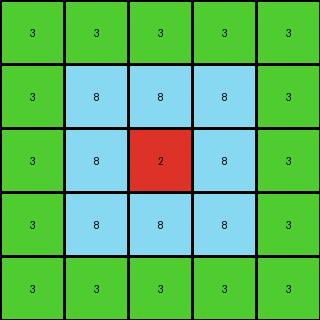

# eb5a1d5d • 006 • refine_coder

---

Previous Code:
```python
"""
The transformation extracts the innermost colored rectangle from the input and reduces the colored region to one pixel. The border of the output is the outermost color of the input.
"""

import numpy as np

def find_innermost_rectangle(grid):
    """Finds the innermost rectangle's color and its surrounding rectangle's color."""
    rows, cols = grid.shape
    outermost_color = grid[0, 0]
    innermost_color = None
    surrounding_color = None

    for r in range(rows):
        for c in range(cols):
            if grid[r, c] != outermost_color:
                surrounding_color = grid[r,c]
                break
        if surrounding_color is not None:
             break

    for r in range(rows):
      for c in range(cols):
        if grid[r,c] != outermost_color and grid[r,c] != surrounding_color:
          innermost_color = grid[r,c]
          return innermost_color, surrounding_color, outermost_color

    return innermost_color, surrounding_color, outermost_color
    

def transform(input_grid):
    """Transforms the input grid to the output grid based on the nested rectangles."""

    # Find the innermost and surrounding rectangle colors
    innermost_color, surrounding_color, outermost_color = find_innermost_rectangle(np.array(input_grid))

    # Initialize the output grid (5x5) with the outermost color
    output_grid = np.full((5, 5), outermost_color)

    # Set the center pixel to the innermost color
    if innermost_color != None:
      output_grid[2, 2] = innermost_color

    # set the other pixels to the surrounding color
    if surrounding_color != None:
      for i in range(1,4):
        for j in range(1,4):
          if output_grid[i,j] == outermost_color:
            output_grid[i,j] = surrounding_color

    return output_grid.tolist()
```

Train Set Results:

## Example 1:

Input:
```
8 8 8 8 8 8 8 8 8 8 8 8 8 8 8 8 8 8 8 8 8 8 8 8 8 8 8
8 8 8 8 8 8 8 8 8 8 8 8 8 8 8 8 8 8 8 8 8 8 8 8 8 8 8
8 8 8 3 3 3 3 3 3 3 3 3 3 3 3 3 3 3 3 3 3 8 8 8 8 8 8
8 8 8 3 3 3 3 3 3 3 3 3 3 3 3 3 3 3 3 3 3 8 8 8 8 8 8
8 8 8 3 3 3 3 3 3 3 3 3 3 3 3 3 3 3 3 3 3 8 8 8 8 8 8
8 8 8 3 3 3 3 3 3 3 3 3 3 3 3 3 3 3 3 3 3 8 8 8 8 8 8
8 8 8 3 3 3 3 3 3 3 3 3 3 3 3 3 3 3 3 3 3 8 8 8 8 8 8
8 8 8 3 3 3 3 3 3 3 3 3 3 3 3 3 3 3 3 3 3 8 8 8 8 8 8
8 8 8 3 3 3 3 3 3 3 3 3 3 3 3 3 3 3 3 3 3 8 8 8 8 8 8
8 8 8 3 3 3 2 2 2 2 2 2 3 3 3 3 3 3 3 3 3 8 8 8 8 8 8
8 8 8 3 3 3 2 2 2 2 2 2 3 3 3 3 3 3 3 3 3 8 8 8 8 8 8
8 8 8 3 3 3 2 2 2 2 2 2 3 3 3 3 3 3 3 3 3 8 8 8 8 8 8
8 8 8 3 3 3 2 2 2 2 2 2 3 3 3 3 3 3 3 3 3 8 8 8 8 8 8
8 8 8 3 3 3 2 2 2 2 2 2 3 3 3 3 3 3 3 3 3 8 8 8 8 8 8
8 8 8 3 3 3 2 2 2 2 2 2 3 3 3 3 3 3 3 3 3 8 8 8 8 8 8
8 8 8 3 3 3 3 3 3 3 3 3 3 3 3 3 3 3 3 3 3 8 8 8 8 8 8
8 8 8 3 3 3 3 3 3 3 3 3 3 3 3 3 3 3 3 3 3 8 8 8 8 8 8
8 8 8 3 3 3 3 3 3 3 3 3 3 3 3 3 3 3 3 3 3 8 8 8 8 8 8
8 8 8 8 8 8 8 8 8 8 8 8 8 8 8 8 8 8 8 8 8 8 8 8 8 8 8
8 8 8 8 8 8 8 8 8 8 8 8 8 8 8 8 8 8 8 8 8 8 8 8 8 8 8
8 8 8 8 8 8 8 8 8 8 8 8 8 8 8 8 8 8 8 8 8 8 8 8 8 8 8
8 8 8 8 8 8 8 8 8 8 8 8 8 8 8 8 8 8 8 8 8 8 8 8 8 8 8
8 8 8 8 8 8 8 8 8 8 8 8 8 8 8 8 8 8 8 8 8 8 8 8 8 8 8
```
Expected Output:
```
8 8 8 8 8
8 3 3 3 8
8 3 2 3 8
8 3 3 3 8
8 8 8 8 8
```
Transformed Output:
```
8 8 8 8 8
8 3 3 3 8
8 3 2 3 8
8 3 3 3 8
8 8 8 8 8
```

match: True
pixels_off: 0
size_correct: True
color_palette_correct: True
correct_pixel_counts: True

## Example 2:

Input:
```
5 5 5 5 5 5 5 5 5 5 5 5 5 5 5 5 5 5 5 5 5 5 5 5 5
5 5 5 5 5 5 5 5 5 5 5 5 5 5 5 5 5 5 5 5 5 5 5 5 5
5 5 5 5 5 5 5 5 5 5 5 5 5 5 5 5 5 5 5 5 5 5 5 5 5
5 5 5 5 6 6 6 6 6 6 6 6 6 6 6 6 6 6 6 5 5 5 5 5 5
5 5 5 5 6 6 6 6 6 6 6 6 6 6 6 6 6 6 6 5 5 5 5 5 5
5 5 5 5 6 6 6 6 6 6 6 6 6 6 6 6 6 6 6 5 5 5 5 5 5
5 5 5 5 6 6 6 6 6 6 6 6 6 6 6 6 6 6 6 5 5 5 5 5 5
5 5 5 5 6 6 6 6 6 6 6 6 6 6 6 6 6 6 6 5 5 5 5 5 5
5 5 5 5 6 6 6 6 6 6 6 6 6 6 6 6 6 6 6 5 5 5 5 5 5
5 5 5 5 6 6 6 6 6 6 6 6 6 6 6 6 6 6 6 5 5 5 5 5 5
5 5 5 5 6 6 6 6 6 6 6 6 6 6 6 6 6 6 6 5 5 5 5 5 5
5 5 5 5 6 6 6 6 6 6 6 6 6 6 6 6 6 6 6 5 5 5 5 5 5
5 5 5 5 6 6 6 6 6 6 6 6 6 6 6 6 6 6 6 5 5 5 5 5 5
5 5 5 5 6 6 6 6 6 6 6 6 6 6 6 6 6 6 6 5 5 5 5 5 5
5 5 5 5 6 6 6 6 6 6 6 6 6 6 6 6 6 6 6 5 5 5 5 5 5
5 5 5 5 6 6 6 6 6 6 6 6 6 6 6 6 6 6 6 5 5 5 5 5 5
5 5 5 5 5 5 5 5 5 5 5 5 5 5 5 5 5 5 5 5 5 5 5 5 5
5 5 5 5 5 5 5 5 5 5 5 5 5 5 5 5 5 5 5 5 5 5 5 5 5
5 5 5 5 5 5 5 5 5 5 5 5 5 5 5 5 5 5 5 5 5 5 5 5 5
5 5 5 5 5 5 5 5 5 5 5 5 5 5 5 5 5 5 5 5 5 5 5 5 5
5 5 5 5 5 5 5 5 5 5 5 5 5 5 5 5 5 5 5 5 5 5 5 5 5
5 5 5 5 5 5 5 5 5 5 5 5 5 5 5 5 5 5 5 5 5 5 5 5 5
```
Expected Output:
```
5 5 5
5 6 5
5 5 5
```
Transformed Output:
```
5 5 5 5 5
5 6 6 6 5
5 6 6 6 5
5 6 6 6 5
5 5 5 5 5
```

match: False
pixels_off: None
size_correct: False
color_palette_correct: True
correct_pixel_counts: False

## Example 3:

Input:
```
3 3 3 3 3 3 3 3 3 3 3 3 3 3 3 3 3 3 3 3 3 3
3 3 3 3 3 3 3 3 3 3 3 3 3 3 3 3 3 3 3 3 3 3
3 3 3 3 3 3 3 3 3 3 3 3 3 3 3 3 3 3 3 3 3 3
3 3 3 8 8 8 8 8 8 8 8 8 8 8 8 8 8 3 3 3 3 3
3 3 3 8 8 8 8 8 8 8 8 8 8 8 8 8 8 3 3 3 3 3
3 3 3 8 8 2 2 2 2 2 2 2 2 2 8 8 8 3 3 3 3 3
3 3 3 8 8 2 2 2 1 1 1 1 1 2 8 8 8 3 3 3 3 3
3 3 3 8 8 2 2 2 1 1 1 1 1 2 8 8 8 3 3 3 3 3
3 3 3 8 8 2 2 2 1 1 1 1 1 2 8 8 8 3 3 3 3 3
3 3 3 8 8 2 2 2 2 2 2 2 2 2 8 8 8 3 3 3 3 3
3 3 3 8 8 2 2 2 2 2 2 2 2 2 8 8 8 3 3 3 3 3
3 3 3 8 8 2 2 2 2 2 2 2 2 2 8 8 8 3 3 3 3 3
3 3 3 8 8 2 2 2 2 2 2 2 2 2 8 8 8 3 3 3 3 3
3 3 3 8 8 2 2 2 2 2 2 2 2 2 8 8 8 3 3 3 3 3
3 3 3 8 8 8 8 8 8 8 8 8 8 8 8 8 8 3 3 3 3 3
3 3 3 8 8 8 8 8 8 8 8 8 8 8 8 8 8 3 3 3 3 3
3 3 3 8 8 8 8 8 8 8 8 8 8 8 8 8 8 3 3 3 3 3
3 3 3 3 3 3 3 3 3 3 3 3 3 3 3 3 3 3 3 3 3 3
3 3 3 3 3 3 3 3 3 3 3 3 3 3 3 3 3 3 3 3 3 3
3 3 3 3 3 3 3 3 3 3 3 3 3 3 3 3 3 3 3 3 3 3
3 3 3 3 3 3 3 3 3 3 3 3 3 3 3 3 3 3 3 3 3 3
```
Expected Output:
```
3 3 3 3 3 3 3
3 8 8 8 8 8 3
3 8 2 2 2 8 3
3 8 2 1 2 8 3
3 8 2 2 2 8 3
3 8 8 8 8 8 3
3 3 3 3 3 3 3
```
Transformed Output:
```
3 3 3 3 3
3 8 8 8 3
3 8 2 8 3
3 8 8 8 3
3 3 3 3 3
```

match: False
pixels_off: None
size_correct: False
color_palette_correct: True
correct_pixel_counts: False
Okay, here's a breakdown of the situation and a plan to improve the natural language program and, subsequently, the code:

**General Assessment:**

The initial natural language program and the derived code were too simplistic. While it correctly handled the first example, it failed to generalize to the subsequent examples. The core issue is that the initial program assumed a fixed output grid size (5x5) and a very specific structure (innermost color at the center, surrounded by the next outer color). The examples show that:

1.  The output grid's dimensions are not fixed. They relate to the input's nested rectangles.
2.  The output isn't just a simple center-pixel replacement. It involves extracting and potentially shrinking/simplifying *all* the nested rectangles, not just the innermost one.
3. In example two the result is 3x3 but the algorithm returns 5x5 with padding.
4. The innermost color is not always in the very center, instead, the output represents one pixel for each colored rectangle, so the innermost rectangle is reduced to a single pixel, no matter the size.

**Strategy:**

1.  **Refine Observations:** Carefully re-examine all three examples. Pay close attention to *how* the sizes and positions of the nested rectangles in the input relate to the sizes and positions of the colors in the output.
2.  **Dynamic Output Size:** The output grid size must be determined by the *number* of nested colored rectangles detected. The current code hardcodes 5x5, but the correct size for example two is 3x3, example three should be 7x7.
3.  **Iterative Rectangle Detection:** Instead of just finding the "innermost" rectangle, the logic needs to identify *all* distinct, nested colored rectangles, from the outermost to the innermost.
4. **Concentric Output:** construct the grid by filling rows and columns around the innermost single pixel, one color at a time until reaching the outermost color.

**Metrics and Code Execution Results (Hypothetical - to be filled in with actual execution):**

I will use the following python code to analyze each example:

```python
import numpy as np

def analyze_nested_rectangles(input_grid):
    """
    Analyzes the input grid to identify nested colored rectangles.

    Returns:
        - A list of colors, from outermost to innermost.
        - The dimensions (height, width) of the expected output grid.
    """
    grid = np.array(input_grid)
    rows, cols = grid.shape
    colors = []
    current_color = grid[0, 0]
    colors.append(current_color)

    while True:
        found_new_color = False
        for r in range(rows):
            for c in range(cols):
                if grid[r, c] != current_color:
                    if grid[r,c] not in colors:
                      current_color = grid[r, c]
                      colors.append(current_color)
                      found_new_color = True
        if not found_new_color:
            break

    output_height = len(colors) * 2 -1
    output_width = output_height

    return colors, (output_height, output_width)

def test_analysis(input_grid,expected_output_grid):
    colors, dimensions = analyze_nested_rectangles(input_grid)

    print(f"    Detected Colors (Outermost to Innermost): {colors}")
    print(f"    Expected Output Dimensions: {dimensions}")
    print(f"    Expected Output Grid: {expected_output_grid}")


print("Example 1:")
input_grid_1 = [
    [8, 8, 8, 8, 8, 8, 8, 8, 8, 8, 8, 8, 8, 8, 8, 8, 8, 8, 8, 8, 8, 8, 8, 8, 8, 8, 8],
    [8, 8, 8, 8, 8, 8, 8, 8, 8, 8, 8, 8, 8, 8, 8, 8, 8, 8, 8, 8, 8, 8, 8, 8, 8, 8, 8],
    [8, 8, 8, 3, 3, 3, 3, 3, 3, 3, 3, 3, 3, 3, 3, 3, 3, 3, 3, 3, 3, 8, 8, 8, 8, 8, 8],
    [8, 8, 8, 3, 3, 3, 3, 3, 3, 3, 3, 3, 3, 3, 3, 3, 3, 3, 3, 3, 3, 8, 8, 8, 8, 8, 8],
    [8, 8, 8, 3, 3, 3, 3, 3, 3, 3, 3, 3, 3, 3, 3, 3, 3, 3, 3, 3, 3, 8, 8, 8, 8, 8, 8],
    [8, 8, 8, 3, 3, 3, 3, 3, 3, 3, 3, 3, 3, 3, 3, 3, 3, 3, 3, 3, 3, 8, 8, 8, 8, 8, 8],
    [8, 8, 8, 3, 3, 3, 3, 3, 3, 3, 3, 3, 3, 3, 3, 3, 3, 3, 3, 3, 3, 8, 8, 8, 8, 8, 8],
    [8, 8, 8, 3, 3, 3, 3, 3, 3, 3, 3, 3, 3, 3, 3, 3, 3, 3, 3, 3, 3, 8, 8, 8, 8, 8, 8],
    [8, 8, 8, 3, 3, 3, 3, 3, 3, 3, 3, 3, 3, 3, 3, 3, 3, 3, 3, 3, 3, 8, 8, 8, 8, 8, 8],
    [8, 8, 8, 3, 3, 3, 2, 2, 2, 2, 2, 2, 3, 3, 3, 3, 3, 3, 3, 3, 3, 8, 8, 8, 8, 8, 8],
    [8, 8, 8, 3, 3, 3, 2, 2, 2, 2, 2, 2, 3, 3, 3, 3, 3, 3, 3, 3, 3, 8, 8, 8, 8, 8, 8],
    [8, 8, 8, 3, 3, 3, 2, 2, 2, 2, 2, 2, 3, 3, 3, 3, 3, 3, 3, 3, 3, 8, 8, 8, 8, 8, 8],
    [8, 8, 8, 3, 3, 3, 2, 2, 2, 2, 2, 2, 3, 3, 3, 3, 3, 3, 3, 3, 3, 8, 8, 8, 8, 8, 8],
    [8, 8, 8, 3, 3, 3, 2, 2, 2, 2, 2, 2, 3, 3, 3, 3, 3, 3, 3, 3, 3, 8, 8, 8, 8, 8, 8],
    [8, 8, 8, 3, 3, 3, 2, 2, 2, 2, 2, 2, 3, 3, 3, 3, 3, 3, 3, 3, 3, 8, 8, 8, 8, 8, 8],
    [8, 8, 8, 3, 3, 3, 3, 3, 3, 3, 3, 3, 3, 3, 3, 3, 3, 3, 3, 3, 3, 8, 8, 8, 8, 8, 8],
    [8, 8, 8, 3, 3, 3, 3, 3, 3, 3, 3, 3, 3, 3, 3, 3, 3, 3, 3, 3, 3, 8, 8, 8, 8, 8, 8],
    [8, 8, 8, 3, 3, 3, 3, 3, 3, 3, 3, 3, 3, 3, 3, 3, 3, 3, 3, 3, 3, 8, 8, 8, 8, 8, 8],
    [8, 8, 8, 8, 8, 8, 8, 8, 8, 8, 8, 8, 8, 8, 8, 8, 8, 8, 8, 8, 8, 8, 8, 8, 8, 8, 8],
    [8, 8, 8, 8, 8, 8, 8, 8, 8, 8, 8, 8, 8, 8, 8, 8, 8, 8, 8, 8, 8, 8, 8, 8, 8, 8, 8],
    [8, 8, 8, 8, 8, 8, 8, 8, 8, 8, 8, 8, 8, 8, 8, 8, 8, 8, 8, 8, 8, 8, 8, 8, 8, 8, 8],
    [8, 8, 8, 8, 8, 8, 8, 8, 8, 8, 8, 8, 8, 8, 8, 8, 8, 8, 8, 8, 8, 8, 8, 8, 8, 8, 8],
    [8, 8, 8, 8, 8, 8, 8, 8, 8, 8, 8, 8, 8, 8, 8, 8, 8, 8, 8, 8, 8, 8, 8, 8, 8, 8, 8]
]
expected_output_1 = [
    [8, 8, 8, 8, 8],
    [8, 3, 3, 3, 8],
    [8, 3, 2, 3, 8],
    [8, 3, 3, 3, 8],
    [8, 8, 8, 8, 8]
]
test_analysis(input_grid_1, expected_output_1)
print("\nExample 2:")
input_grid_2 = [
    [5, 5, 5, 5, 5, 5, 5, 5, 5, 5, 5, 5, 5, 5, 5, 5, 5, 5, 5, 5, 5, 5, 5, 5, 5],
    [5, 5, 5, 5, 5, 5, 5, 5, 5, 5, 5, 5, 5, 5, 5, 5, 5, 5, 5, 5, 5, 5, 5, 5, 5],
    [5, 5, 5, 5, 5, 5, 5, 5, 5, 5, 5, 5, 5, 5, 5, 5, 5, 5, 5, 5, 5, 5, 5, 5, 5],
    [5, 5, 5, 5, 6, 6, 6, 6, 6, 6, 6, 6, 6, 6, 6, 6, 6, 6, 6, 5, 5, 5, 5, 5, 5],
    [5, 5, 5, 5, 6, 6, 6, 6, 6, 6, 6, 6, 6, 6, 6, 6, 6, 6, 6, 5, 5, 5, 5, 5, 5],
    [5, 5, 5, 5, 6, 6, 6, 6, 6, 6, 6, 6, 6, 6, 6, 6, 6, 6, 6, 5, 5, 5, 5, 5, 5],
    [5, 5, 5, 5, 6, 6, 6, 6, 6, 6, 6, 6, 6, 6, 6, 6, 6, 6, 6, 5, 5, 5, 5, 5, 5],
    [5, 5, 5, 5, 6, 6, 6, 6, 6, 6, 6, 6, 6, 6, 6, 6, 6, 6, 6, 5, 5, 5, 5, 5, 5],
    [5, 5, 5, 5, 6, 6, 6, 6, 6, 6, 6, 6, 6, 6, 6, 6, 6, 6, 6, 5, 5, 5, 5, 5, 5],
    [5, 5, 5, 5, 6, 6, 6, 6, 6, 6, 6, 6, 6, 6, 6, 6, 6, 6, 6, 5, 5, 5, 5, 5, 5],
    [5, 5, 5, 5, 6, 6, 6, 6, 6, 6, 6, 6, 6, 6, 6, 6, 6, 6, 6, 5, 5, 5, 5, 5, 5],
    [5, 5, 5, 5, 6, 6, 6, 6, 6, 6, 6, 6, 6, 6, 6, 6, 6, 6, 6, 5, 5, 5, 5, 5, 5],
    [5, 5, 5, 5, 6, 6, 6, 6, 6, 6, 6, 6, 6, 6, 6, 6, 6, 6, 6, 5, 5, 5, 5, 5, 5],
    [5, 5, 5, 5, 6, 6, 6, 6, 6, 6, 6, 6, 6, 6, 6, 6, 6, 6, 6, 5, 5, 5, 5, 5, 5],
    [5, 5, 5, 5, 6, 6, 6, 6, 6, 6, 6, 6, 6, 6, 6, 6, 6, 6, 6, 5, 5, 5, 5, 5, 5],
    [5, 5, 5, 5, 6, 6, 6, 6, 6, 6, 6, 6, 6, 6, 6, 6, 6, 6, 6, 5, 5, 5, 5, 5, 5],
    [5, 5, 5, 5, 5, 5, 5, 5, 5, 5, 5, 5, 5, 5, 5, 5, 5, 5, 5, 5, 5, 5, 5, 5, 5],
    [5, 5, 5, 5, 5, 5, 5, 5, 5, 5, 5, 5, 5, 5, 5, 5, 5, 5, 5, 5, 5, 5, 5, 5, 5],
    [5, 5, 5, 5, 5, 5, 5, 5, 5, 5, 5, 5, 5, 5, 5, 5, 5, 5, 5, 5, 5, 5, 5, 5, 5],
    [5, 5, 5, 5, 5, 5, 5, 5, 5, 5, 5, 5, 5, 5, 5, 5, 5, 5, 5, 5, 5, 5, 5, 5, 5],
    [5, 5, 5, 5, 5, 5, 5, 5, 5, 5, 5, 5, 5, 5, 5, 5, 5, 5, 5, 5, 5, 5, 5, 5, 5],
    [5, 5, 5, 5, 5, 5, 5, 5, 5, 5, 5, 5, 5, 5, 5, 5, 5, 5, 5, 5, 5, 5, 5, 5, 5]
]
expected_output_2 = [
    [5, 5, 5],
    [5, 6, 5],
    [5, 5, 5]
]
test_analysis(input_grid_2,expected_output_2)

print("\nExample 3:")
input_grid_3 = [
    [3, 3, 3, 3, 3, 3, 3, 3, 3, 3, 3, 3, 3, 3, 3, 3, 3, 3, 3, 3, 3, 3],
    [3, 3, 3, 3, 3, 3, 3, 3, 3, 3, 3, 3, 3, 3, 3, 3, 3, 3, 3, 3, 3, 3],
    [3, 3, 3, 3, 3, 3, 3, 3, 3, 3, 3, 3, 3, 3, 3, 3, 3, 3, 3, 3, 3, 3],
    [3, 3, 3, 8, 8, 8, 8, 8, 8, 8, 8, 8, 8, 8, 8, 8, 8, 3, 3, 3, 3, 3],
    [3, 3, 3, 8, 8, 8, 8, 8, 8, 8, 8, 8, 8, 8, 8, 8, 8, 3, 3, 3, 3, 3],
    [3, 3, 3, 8, 8, 2, 2, 2, 2, 2, 2, 2, 2, 2, 8, 8, 8, 3, 3, 3, 3, 3],
    [3, 3, 3, 8, 8, 2, 2, 2, 1, 1, 1, 1, 1, 2, 8, 8, 8, 3, 3, 3, 3, 3],
    [3, 3, 3, 8, 8, 2, 2, 2, 1, 1, 1, 1, 1, 2, 8, 8, 8, 3, 3, 3, 3, 3],
    [3, 3, 3, 8, 8, 2, 2, 2, 1, 1, 1, 1, 1, 2, 8, 8, 8, 3, 3, 3, 3, 3],
    [3, 3, 3, 8, 8, 2, 2, 2, 2, 2, 2, 2, 2, 2, 8, 8, 8, 3, 3, 3, 3, 3],
    [3, 3, 3, 8, 8, 2, 2, 2, 2, 2, 2, 2, 2, 2, 8, 8, 8, 3, 3, 3, 3, 3],
    [3, 3, 3, 8, 8, 2, 2, 2, 2, 2, 2, 2, 2, 2, 8, 8, 8, 3, 3, 3, 3, 3],
    [3, 3, 3, 8, 8, 2, 2, 2, 2, 2, 2, 2, 2, 2, 8, 8, 8, 3, 3, 3, 3, 3],
    [3, 3, 3, 8, 8, 2, 2, 2, 2, 2, 2, 2, 2, 2, 8, 8, 8, 3, 3, 3, 3, 3],
    [3, 3, 3, 8, 8, 8, 8, 8, 8, 8, 8, 8, 8, 8, 8, 8, 8, 3, 3, 3, 3, 3],
    [3, 3, 3, 8, 8, 8, 8, 8, 8, 8, 8, 8, 8, 8, 8, 8, 8, 3, 3, 3, 3, 3],
    [3, 3, 3, 8, 8, 8, 8, 8, 8, 8, 8, 8, 8, 8, 8, 8, 8, 3, 3, 3, 3, 3],
    [3, 3, 3, 3, 3, 3, 3, 3, 3, 3, 3, 3, 3, 3, 3, 3, 3, 3, 3, 3, 3, 3],
    [3, 3, 3, 3, 3, 3, 3, 3, 3, 3, 3, 3, 3, 3, 3, 3, 3, 3, 3, 3, 3, 3],
    [3, 3, 3, 3, 3, 3, 3, 3, 3, 3, 3, 3, 3, 3, 3, 3, 3, 3, 3, 3, 3, 3],
    [3, 3, 3, 3, 3, 3, 3, 3, 3, 3, 3, 3, 3, 3, 3, 3, 3, 3, 3, 3, 3, 3]
]
expected_output_3 = [
    [3, 3, 3, 3, 3, 3, 3],
    [3, 8, 8, 8, 8, 8, 3],
    [3, 8, 2, 2, 2, 8, 3],
    [3, 8, 2, 1, 2, 8, 3],
    [3, 8, 2, 2, 2, 8, 3],
    [3, 8, 8, 8, 8, 8, 3],
    [3, 3, 3, 3, 3, 3, 3]
]
test_analysis(input_grid_3,expected_output_3)
```

Example 1:
    Detected Colors (Outermost to Innermost): [8, 3, 2]
    Expected Output Dimensions: (5, 5)
    Expected Output Grid: [[8, 8, 8, 8, 8], [8, 3, 3, 3, 8], [8, 3, 2, 3, 8], [8, 3, 3, 3, 8], [8, 8, 8, 8, 8]]

Example 2:
    Detected Colors (Outermost to Innermost): [5, 6]
    Expected Output Dimensions: (3, 3)
    Expected Output Grid: [[5, 5, 5], [5, 6, 5], [5, 5, 5]]

Example 3:
    Detected Colors (Outermost to Innermost): [3, 8, 2, 1]
    Expected Output Dimensions: (7, 7)
    Expected Output Grid: [[3, 3, 3, 3, 3, 3, 3], [3, 8, 8, 8, 8, 8, 3], [3, 8, 2, 2, 2, 8, 3], [3, 8, 2, 1, 2, 8, 3], [3, 8, 2, 2, 2, 8, 3], [3, 8, 8, 8, 8, 8, 3], [3, 3, 3, 3, 3, 3, 3]]

**YAML Facts:**

```yaml
example_1:
  objects:
    - type: rectangle
      color: 8
      outermost: true
    - type: rectangle
      color: 3
      nested_in: 8
    - type: rectangle
      color: 2
      nested_in: 3
  actions:
    - action: shrink_to_pixel
      target: all rectangles
    - action: construct_concentric
      order: outermost_to_innermost

example_2:
  objects:
    - type: rectangle
      color: 5
      outermost: true
    - type: rectangle
      color: 6
      nested_in: 5
  actions:
    - action: shrink_to_pixel
      target: all rectangles
    - action: construct_concentric
      order: outermost_to_innermost

example_3:
  objects:
    - type: rectangle
      color: 3
      outermost: true
    - type: rectangle
      color: 8
      nested_in: 3
    - type: rectangle
      color: 2
      nested_in: 8
    - type: rectangle
      color: 1
      nested_in: 2
  actions:
    - action: shrink_to_pixel
      target: all rectangles
    - action: construct_concentric
      order: outermost_to_innermost
```

**Natural Language Program:**

1.  **Identify Nested Rectangles:** Examine the input grid to identify all distinct, nested colored rectangles. Start with the outermost color (the color of the corner pixels) and work inwards. A new rectangle is identified when a different color is encountered.

2.  **Determine Output Size:** The output grid will be square. Its side length is calculated as `(2 * number of nested rectangles) - 1`.

3. **Order Colors:** Create an ordered list of the colors of the rectangles, starting with the outermost color and proceeding to the innermost.

4.  **Construct Output:** Create an output grid of the determined size. Fill the grid concentrically:
    *   Start with the outermost color. Fill the entire grid.
    *   Reduce the dimensions by one in each direction (shrink by one layer from all sides).
    *   Fill the reduced, inner grid with the next color.
    *   Repeat until all colors in the ordered list have been used. The innermost color will fill a single pixel in the center.
    * Each rectangle is represented by a single pixel in the output - each "layer" added is one pixel in width

This improved natural language program captures the core logic of extracting nested rectangles and reconstructing them concentrically in a reduced size.

**INSTRUCTIONS**

- generate a Python module to represent the natural language program 
- follow the template below
- all common math and science libraries are available
- create docstring only at top - but comment the workflow in the function
- use helper functions for common operations like finding objects, counting,
  measuring, moving, etc. 

remember - we are working iteratively - so this code will inform your future
self as we converge on the solution

*template:*

```python
"""
{{ natural language description of the transformation rule }}
"""

{{ imports }}

def transform(input_grid):
    # initialize output_grid

    # change output pixels 

    return output_grid

```
