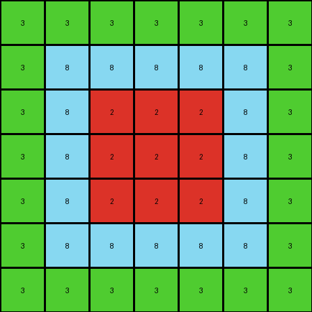
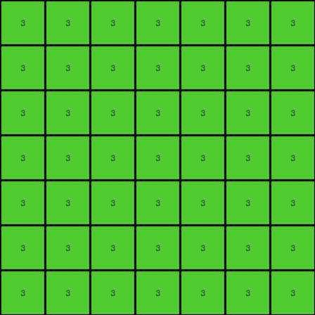
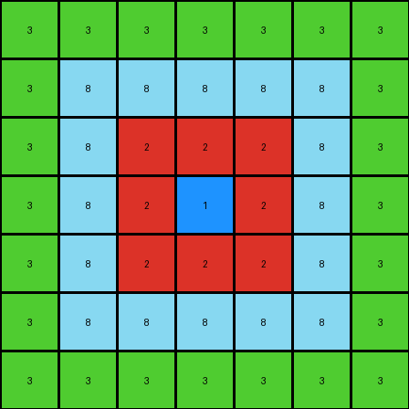

# eb5a1d5d • 016 • refine_coder

---

Previous Code:
```python
"""
The transformation extracts the nested rectangles from the input grid and represents them in a compressed form in the output grid. The output grid has a green border representing the outermost green rectangle, an azure border representing the second rectangle, a red border for the third, and a single blue pixel in the center for the innermost shape.
"""

import numpy as np

def get_object_bounds(grid, color):
    # Find the min and max row and col indices for a given color
    rows, cols = np.where(grid == color)
    if len(rows) == 0:
        return None  # Color not found
    min_row, max_row = np.min(rows), np.max(rows)
    min_col, max_col = np.min(cols), np.max(cols)
    return min_row, max_row, min_col, max_col

def transform(input_grid):
    # Initialize output_grid as all green (3)
    output_grid = np.full((7, 7), 3)

    # Get bounds for azure (8) rectangle
    azure_bounds = get_object_bounds(input_grid, 8)
    if azure_bounds:
        min_row, max_row, min_col, max_col = azure_bounds
        # Represent azure rectangle with a border inside the green
        output_grid[1:6, 1:6] = 8

    # Get bounds for red (2) rectangle
    red_bounds = get_object_bounds(input_grid, 2)
    if red_bounds:
        min_row, max_row, min_col, max_col = red_bounds
        #Represent red rectangle with border within the azure.
        output_grid[2:5, 2:5] = 2

    # get bounds for blue (1) object
    blue_bounds = get_object_bounds(input_grid, 1)
    if blue_bounds:
        # Represent center as single blue pixel
        output_grid[3, 3] = 1


    return output_grid
```

Train Set Results:

## Example 1:

Input:
```
8 8 8 8 8 8 8 8 8 8 8 8 8 8 8 8 8 8 8 8 8 8 8 8 8 8 8
8 8 8 8 8 8 8 8 8 8 8 8 8 8 8 8 8 8 8 8 8 8 8 8 8 8 8
8 8 8 3 3 3 3 3 3 3 3 3 3 3 3 3 3 3 3 3 3 8 8 8 8 8 8
8 8 8 3 3 3 3 3 3 3 3 3 3 3 3 3 3 3 3 3 3 8 8 8 8 8 8
8 8 8 3 3 3 3 3 3 3 3 3 3 3 3 3 3 3 3 3 3 8 8 8 8 8 8
8 8 8 3 3 3 3 3 3 3 3 3 3 3 3 3 3 3 3 3 3 8 8 8 8 8 8
8 8 8 3 3 3 3 3 3 3 3 3 3 3 3 3 3 3 3 3 3 8 8 8 8 8 8
8 8 8 3 3 3 3 3 3 3 3 3 3 3 3 3 3 3 3 3 3 8 8 8 8 8 8
8 8 8 3 3 3 3 3 3 3 3 3 3 3 3 3 3 3 3 3 3 8 8 8 8 8 8
8 8 8 3 3 3 2 2 2 2 2 2 3 3 3 3 3 3 3 3 3 8 8 8 8 8 8
8 8 8 3 3 3 2 2 2 2 2 2 3 3 3 3 3 3 3 3 3 8 8 8 8 8 8
8 8 8 3 3 3 2 2 2 2 2 2 3 3 3 3 3 3 3 3 3 8 8 8 8 8 8
8 8 8 3 3 3 2 2 2 2 2 2 3 3 3 3 3 3 3 3 3 8 8 8 8 8 8
8 8 8 3 3 3 2 2 2 2 2 2 3 3 3 3 3 3 3 3 3 8 8 8 8 8 8
8 8 8 3 3 3 2 2 2 2 2 2 3 3 3 3 3 3 3 3 3 8 8 8 8 8 8
8 8 8 3 3 3 3 3 3 3 3 3 3 3 3 3 3 3 3 3 3 8 8 8 8 8 8
8 8 8 3 3 3 3 3 3 3 3 3 3 3 3 3 3 3 3 3 3 8 8 8 8 8 8
8 8 8 3 3 3 3 3 3 3 3 3 3 3 3 3 3 3 3 3 3 8 8 8 8 8 8
8 8 8 8 8 8 8 8 8 8 8 8 8 8 8 8 8 8 8 8 8 8 8 8 8 8 8
8 8 8 8 8 8 8 8 8 8 8 8 8 8 8 8 8 8 8 8 8 8 8 8 8 8 8
8 8 8 8 8 8 8 8 8 8 8 8 8 8 8 8 8 8 8 8 8 8 8 8 8 8 8
8 8 8 8 8 8 8 8 8 8 8 8 8 8 8 8 8 8 8 8 8 8 8 8 8 8 8
8 8 8 8 8 8 8 8 8 8 8 8 8 8 8 8 8 8 8 8 8 8 8 8 8 8 8
```
Expected Output:
```
8 8 8 8 8
8 3 3 3 8
8 3 2 3 8
8 3 3 3 8
8 8 8 8 8
```
Transformed Output:
```
3 3 3 3 3 3 3
3 8 8 8 8 8 3
3 8 2 2 2 8 3
3 8 2 2 2 8 3
3 8 2 2 2 8 3
3 8 8 8 8 8 3
3 3 3 3 3 3 3
```

match: False
pixels_off: None
size_correct: False
color_palette_correct: True
correct_pixel_counts: False

## Example 2:

Input:
```
5 5 5 5 5 5 5 5 5 5 5 5 5 5 5 5 5 5 5 5 5 5 5 5 5
5 5 5 5 5 5 5 5 5 5 5 5 5 5 5 5 5 5 5 5 5 5 5 5 5
5 5 5 5 5 5 5 5 5 5 5 5 5 5 5 5 5 5 5 5 5 5 5 5 5
5 5 5 5 6 6 6 6 6 6 6 6 6 6 6 6 6 6 6 5 5 5 5 5 5
5 5 5 5 6 6 6 6 6 6 6 6 6 6 6 6 6 6 6 5 5 5 5 5 5
5 5 5 5 6 6 6 6 6 6 6 6 6 6 6 6 6 6 6 5 5 5 5 5 5
5 5 5 5 6 6 6 6 6 6 6 6 6 6 6 6 6 6 6 5 5 5 5 5 5
5 5 5 5 6 6 6 6 6 6 6 6 6 6 6 6 6 6 6 5 5 5 5 5 5
5 5 5 5 6 6 6 6 6 6 6 6 6 6 6 6 6 6 6 5 5 5 5 5 5
5 5 5 5 6 6 6 6 6 6 6 6 6 6 6 6 6 6 6 5 5 5 5 5 5
5 5 5 5 6 6 6 6 6 6 6 6 6 6 6 6 6 6 6 5 5 5 5 5 5
5 5 5 5 6 6 6 6 6 6 6 6 6 6 6 6 6 6 6 5 5 5 5 5 5
5 5 5 5 6 6 6 6 6 6 6 6 6 6 6 6 6 6 6 5 5 5 5 5 5
5 5 5 5 6 6 6 6 6 6 6 6 6 6 6 6 6 6 6 5 5 5 5 5 5
5 5 5 5 6 6 6 6 6 6 6 6 6 6 6 6 6 6 6 5 5 5 5 5 5
5 5 5 5 6 6 6 6 6 6 6 6 6 6 6 6 6 6 6 5 5 5 5 5 5
5 5 5 5 5 5 5 5 5 5 5 5 5 5 5 5 5 5 5 5 5 5 5 5 5
5 5 5 5 5 5 5 5 5 5 5 5 5 5 5 5 5 5 5 5 5 5 5 5 5
5 5 5 5 5 5 5 5 5 5 5 5 5 5 5 5 5 5 5 5 5 5 5 5 5
5 5 5 5 5 5 5 5 5 5 5 5 5 5 5 5 5 5 5 5 5 5 5 5 5
5 5 5 5 5 5 5 5 5 5 5 5 5 5 5 5 5 5 5 5 5 5 5 5 5
5 5 5 5 5 5 5 5 5 5 5 5 5 5 5 5 5 5 5 5 5 5 5 5 5
```
Expected Output:
```
5 5 5
5 6 5
5 5 5
```
Transformed Output:
```
3 3 3 3 3 3 3
3 3 3 3 3 3 3
3 3 3 3 3 3 3
3 3 3 3 3 3 3
3 3 3 3 3 3 3
3 3 3 3 3 3 3
3 3 3 3 3 3 3
```

match: False
pixels_off: None
size_correct: False
color_palette_correct: False
correct_pixel_counts: False

## Example 3:

Input:
```
3 3 3 3 3 3 3 3 3 3 3 3 3 3 3 3 3 3 3 3 3 3
3 3 3 3 3 3 3 3 3 3 3 3 3 3 3 3 3 3 3 3 3 3
3 3 3 3 3 3 3 3 3 3 3 3 3 3 3 3 3 3 3 3 3 3
3 3 3 8 8 8 8 8 8 8 8 8 8 8 8 8 8 3 3 3 3 3
3 3 3 8 8 8 8 8 8 8 8 8 8 8 8 8 8 3 3 3 3 3
3 3 3 8 8 2 2 2 2 2 2 2 2 2 8 8 8 3 3 3 3 3
3 3 3 8 8 2 2 2 1 1 1 1 1 2 8 8 8 3 3 3 3 3
3 3 3 8 8 2 2 2 1 1 1 1 1 2 8 8 8 3 3 3 3 3
3 3 3 8 8 2 2 2 1 1 1 1 1 2 8 8 8 3 3 3 3 3
3 3 3 8 8 2 2 2 2 2 2 2 2 2 8 8 8 3 3 3 3 3
3 3 3 8 8 2 2 2 2 2 2 2 2 2 8 8 8 3 3 3 3 3
3 3 3 8 8 2 2 2 2 2 2 2 2 2 8 8 8 3 3 3 3 3
3 3 3 8 8 2 2 2 2 2 2 2 2 2 8 8 8 3 3 3 3 3
3 3 3 8 8 2 2 2 2 2 2 2 2 2 8 8 8 3 3 3 3 3
3 3 3 8 8 8 8 8 8 8 8 8 8 8 8 8 8 3 3 3 3 3
3 3 3 8 8 8 8 8 8 8 8 8 8 8 8 8 8 3 3 3 3 3
3 3 3 8 8 8 8 8 8 8 8 8 8 8 8 8 8 3 3 3 3 3
3 3 3 3 3 3 3 3 3 3 3 3 3 3 3 3 3 3 3 3 3 3
3 3 3 3 3 3 3 3 3 3 3 3 3 3 3 3 3 3 3 3 3 3
3 3 3 3 3 3 3 3 3 3 3 3 3 3 3 3 3 3 3 3 3 3
3 3 3 3 3 3 3 3 3 3 3 3 3 3 3 3 3 3 3 3 3 3
```
Expected Output:
```
3 3 3 3 3 3 3
3 8 8 8 8 8 3
3 8 2 2 2 8 3
3 8 2 1 2 8 3
3 8 2 2 2 8 3
3 8 8 8 8 8 3
3 3 3 3 3 3 3
```
Transformed Output:
```
3 3 3 3 3 3 3
3 8 8 8 8 8 3
3 8 2 2 2 8 3
3 8 2 1 2 8 3
3 8 2 2 2 8 3
3 8 8 8 8 8 3
3 3 3 3 3 3 3
```

match: True
pixels_off: 0
size_correct: True
color_palette_correct: True
correct_pixel_counts: True
Okay, here's an analysis of the provided information and a plan to improve the transformation logic:

**General Assessment:**

The initial code was designed to extract nested rectangles and represent them in a compressed, centered format. It correctly handled Example 3, which perfectly fits this initial hypothesis. However, Examples 1 and 2 reveal flaws:

1.  **Incorrect Size and Positioning:** The initial code assumes a fixed output size (7x7) and centers the compressed representation. Example 1's output should be 5x5 and Example 2's should be 3x3, and neither is centered. This indicates that the output grid size and positioning of inner shapes is directly related to the dimensions of input objects, not to a fixed constant.

2.  **Missing Color Logic:** The initial transformation has a fixed hierarchy (green, azure, red, blue). The second input grid has colors gray (5) and magenta (6) which are ignored. The previous logic must be revised to not rely on a color hierarchy.

3. **Missing Nested Structure**: The first input grid shows that the red object is not contained by the azure object.

**Strategy:**

The core concept of identifying nested shapes is partially correct, but the implementation needs significant adjustments:

1.  **Dynamic Output Size:** The output grid size must be determined by the dimensions of the outermost detected rectangle.

2.  **Relative Positioning:** The positions of the inner rectangles must be calculated relative to the outermost rectangle, not centered.

3.  **Generalized Color Handling:** Instead of hardcoding color order, we should detect rectangles based on containment. The outermost rectangle determines the background, and successively contained rectangles are drawn within.

4.   **Re-examine Nested Structure:** Examine the nesting of the rectangles with a general method

**Metrics and Observations:**

Here's a breakdown of each example, including some observations.

**Example 1:**

*   **Input:** 27x23. Outer: Azure (8), Inner: Green (3), Inner: Red(2).
*   **Expected Output:** 5x5. Outer: Azure (8), Inner: Green (3), Inner: Red (2).
*   **Actual Output:** 7x7. Outer: Green (3), Inner: Azure (8), Inner: Red (2), centered.
*   **Mismatches:** Size, positioning, outer layer color

**Example 2:**

*   **Input:** 25x22. Outer: Gray (5), Inner: Magenta (6)
*   **Expected Output:** 3x3. Outer: Gray (5), Inner: Magenta (6)
*   **Actual Output:** 7x7, all Green (3).
*   **Mismatches:** Size, colors, entire structure.

**Example 3:**

*   **Input:** 22x21. Outer: Green (3), Inner: Azure (8), Inner: Red (2), Innermost: Blue (1)
*   **Expected Output:** 7x7. Outer: Green (3), Inner: Azure (8), Inner: Red(2), Innermost: Blue(1)
*   **Actual Output:** 7x7. Outer: Green (3), Inner: Azure (8), Inner: Red(2), Innermost: Blue(1)
*   **Mismatches:** None.

**YAML Facts:**

```yaml
examples:
  - id: 1
    outer_rectangle:
      color: 8  # Azure
      dimensions: [5, 5]  # Deduced from expected output
    inner_rectangles:
      - color: 3  # Green
        relative_position: [1,1] #relative to outer
        size: [3,3]
      - color: 2
        relative_position: [2,2]
        size: [1,1]
  - id: 2
    outer_rectangle:
      color: 5  # Gray
      dimensions: [3, 3]  # Deduced from expected output
    inner_rectangles:
      - color: 6 # Magenta
        relative_position: [1,1]
        size: [1,1]
  - id: 3
    outer_rectangle:
      color: 3  # Green
      dimensions: [7, 7]  # Deduced from expected output
    inner_rectangles:
      - color: 8  # Azure
        relative_position: [1,1]
        size: [5,5]
      - color: 2  # Red
        relative_position: [2,2]
        size: [3,3]
      - color: 1 #blue
        relative_position: [3,3]
        size: [1,1]
```

**Natural Language Program:**

1.  **Identify the outermost rectangle:** Find the smallest rectangle that encloses all non-white pixels in the input grid. The color of the outermost rectangle's border becomes the background color of the output grid. The dimensions of this rectangle determine the size of the output grid.

2.  **Iterate through Contained Rectangles**: Find rectangles that are contained *within* the current rectangle
For each inner rectangle:
   - Determine the color and dimensions
   - compute the size [height, width]
   - determine the relative position within the outer rectangle by finding
     the difference between the top-left corner of the enclosing rectangle and the inner rectangle.

3.  **Draw Output**: Create an output grid of the determined size, filled with the background color. Draw each contained rectangle's outline within the output grid, using the relative positions and the dimensions determined. The inner rectangles are represented by their outermost border. There is no concept of maintaining a center position from the input.

The key change is how the objects are identified. The objects in the input grid are nested rectangles. In the transformed output, the nested rectangles are represented by only their borders.

**INSTRUCTIONS**

- generate a Python module to represent the natural language program 
- follow the template below
- all common math and science libraries are available
- create docstring only at top - but comment the workflow in the function
- use helper functions for common operations like finding objects, counting,
  measuring, moving, etc. 

remember - we are working iteratively - so this code will inform your future
self as we converge on the solution

*template:*

```python
"""
{{ natural language description of the transformation rule }}
"""

{{ imports }}

def transform(input_grid):
    # initialize output_grid

    # change output pixels 

    return output_grid

```
