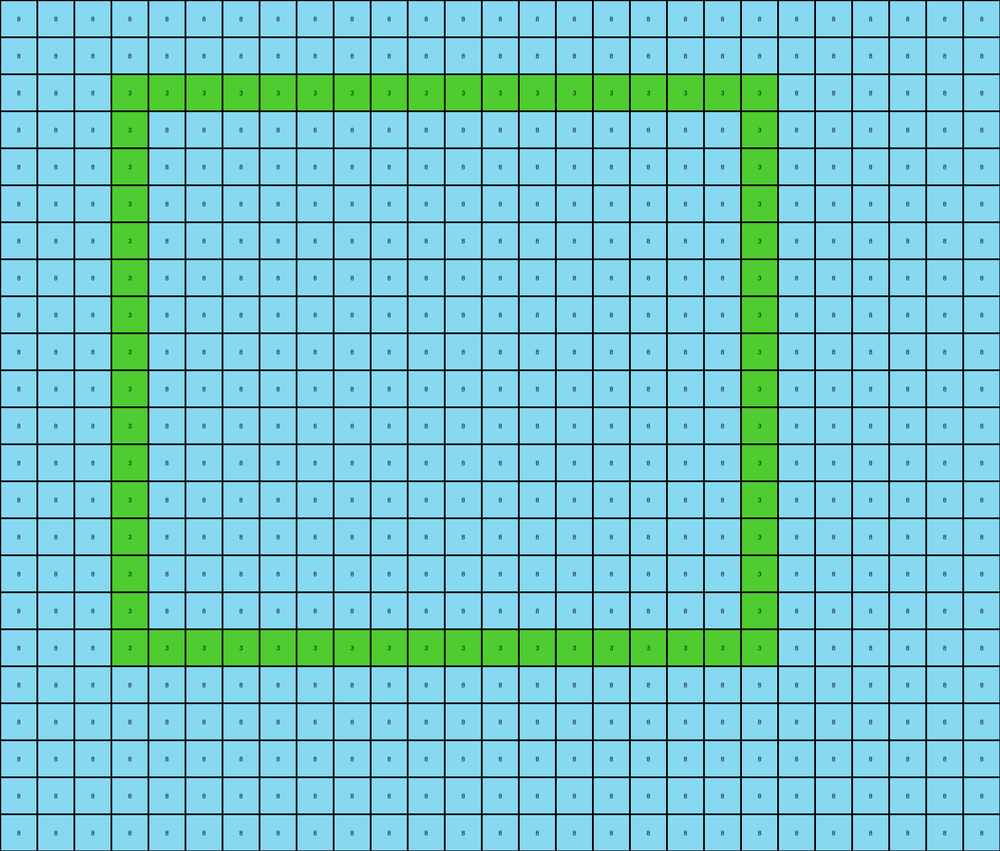
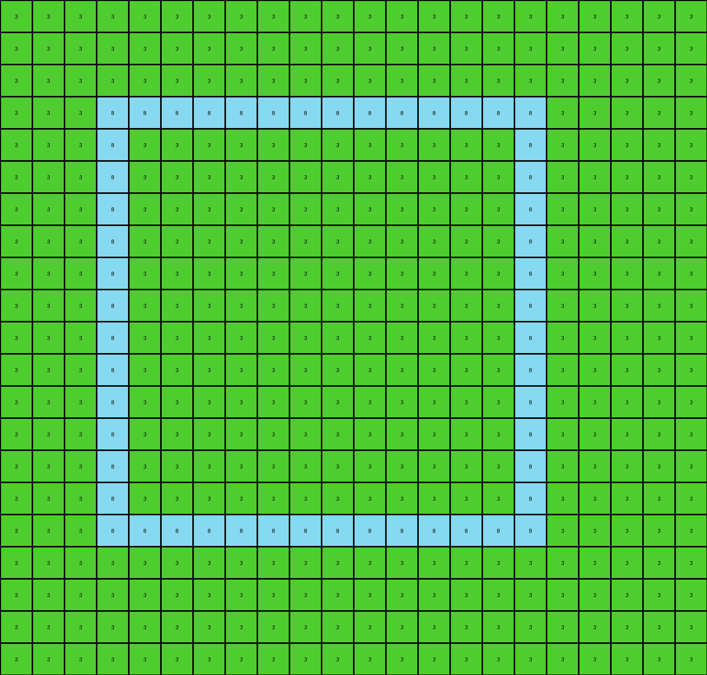

# eb5a1d5d • 017 • refine_dreamer

---


Previous Code:
```python
"""
The transformation identifies nested rectangles in the input grid and represents them by their borders in the output grid. The output grid's size and background color are determined by the outermost rectangle found in the input. Inner rectangles are drawn as borders, with their positions and sizes relative to the containing rectangle.
"""

import numpy as np

def get_object_bounds(grid):
    # Find all unique colors, excluding white (0)
    unique_colors = np.unique(grid)
    unique_colors = unique_colors[unique_colors != 0]

    bounds = {}
    for color in unique_colors:
        rows, cols = np.where(grid == color)
        if len(rows) > 0:
            min_row, max_row = np.min(rows), np.max(rows)
            min_col, max_col = np.min(cols), np.max(cols)
            bounds[color] = (min_row, max_row, min_col, max_col)
    return bounds

def find_outermost_rectangle(bounds):
    # Find the rectangle that encloses all others
    if not bounds:
        return None, None

    outermost_color = None
    outermost_bounds = None

    for color, (min_row, max_row, min_col, max_col) in bounds.items():
        if outermost_bounds is None:
            outermost_color = color
            outermost_bounds = (min_row, max_row, min_col, max_col)
        else:
            o_min_row, o_max_row, o_min_col, o_max_col = outermost_bounds
            if min_row <= o_min_row and max_row >= o_max_row and min_col <= o_min_col and max_col >= o_max_col:
                outermost_color = color
                outermost_bounds = (min_row, max_row, min_col, max_col)
    return outermost_color, outermost_bounds

def find_contained_rectangles(bounds, outer_bounds):
   #find rectangles within outer_bounds
    contained = []
    if not outer_bounds:
        return contained

    o_min_row, o_max_row, o_min_col, o_max_col = outer_bounds
    for color, (min_row, max_row, min_col, max_col) in bounds.items():
        if (min_row >= o_min_row and max_row <= o_max_row and
            min_col >= o_min_col and max_col <= o_max_col and
            (min_row, max_row, min_col, max_col) != outer_bounds):
            
            #calculate relative position and size
            rel_row = min_row - o_min_row
            rel_col = min_col - o_min_col
            height = max_row - min_row + 1
            width = max_col - min_col + 1
            
            contained.append((color, (rel_row, rel_col), (height, width)))

    return contained
            

def transform(input_grid):
    # Get bounds for all objects
    object_bounds = get_object_bounds(input_grid)

    # Find the outermost rectangle
    outermost_color, outermost_bounds = find_outermost_rectangle(object_bounds)
    
    if outermost_bounds is None:
        return np.array([[]]) #return empty if no objects

    # Determine output grid size
    o_min_row, o_max_row, o_min_col, o_max_col = outermost_bounds
    output_height = o_max_row - o_min_row + 1
    output_width = o_max_col - o_min_col + 1
    output_grid = np.full((output_height, output_width), outermost_color)

    # Find contained rectangles
    contained_rectangles = find_contained_rectangles(object_bounds, outermost_bounds)
    
    # Draw contained rectangles
    for color, (rel_row, rel_col), (height, width) in contained_rectangles:
        output_grid[rel_row:rel_row + height, rel_col:rel_col + width] = outermost_color
        output_grid[rel_row:rel_row + height, rel_col] = color  # Left border
        output_grid[rel_row:rel_row + height, rel_col + width - 1] = color  # Right border
        output_grid[rel_row, rel_col:rel_col + width] = color  # Top border
        output_grid[rel_row + height - 1, rel_col:rel_col + width] = color  # Bottom border
        
    return output_grid
```

Train Set Results:

## Example 1:

Input:
```
8 8 8 8 8 8 8 8 8 8 8 8 8 8 8 8 8 8 8 8 8 8 8 8 8 8 8
8 8 8 8 8 8 8 8 8 8 8 8 8 8 8 8 8 8 8 8 8 8 8 8 8 8 8
8 8 8 3 3 3 3 3 3 3 3 3 3 3 3 3 3 3 3 3 3 8 8 8 8 8 8
8 8 8 3 3 3 3 3 3 3 3 3 3 3 3 3 3 3 3 3 3 8 8 8 8 8 8
8 8 8 3 3 3 3 3 3 3 3 3 3 3 3 3 3 3 3 3 3 8 8 8 8 8 8
8 8 8 3 3 3 3 3 3 3 3 3 3 3 3 3 3 3 3 3 3 8 8 8 8 8 8
8 8 8 3 3 3 3 3 3 3 3 3 3 3 3 3 3 3 3 3 3 8 8 8 8 8 8
8 8 8 3 3 3 3 3 3 3 3 3 3 3 3 3 3 3 3 3 3 8 8 8 8 8 8
8 8 8 3 3 3 3 3 3 3 3 3 3 3 3 3 3 3 3 3 3 8 8 8 8 8 8
8 8 8 3 3 3 2 2 2 2 2 2 3 3 3 3 3 3 3 3 3 8 8 8 8 8 8
8 8 8 3 3 3 2 2 2 2 2 2 3 3 3 3 3 3 3 3 3 8 8 8 8 8 8
8 8 8 3 3 3 2 2 2 2 2 2 3 3 3 3 3 3 3 3 3 8 8 8 8 8 8
8 8 8 3 3 3 2 2 2 2 2 2 3 3 3 3 3 3 3 3 3 8 8 8 8 8 8
8 8 8 3 3 3 2 2 2 2 2 2 3 3 3 3 3 3 3 3 3 8 8 8 8 8 8
8 8 8 3 3 3 2 2 2 2 2 2 3 3 3 3 3 3 3 3 3 8 8 8 8 8 8
8 8 8 3 3 3 3 3 3 3 3 3 3 3 3 3 3 3 3 3 3 8 8 8 8 8 8
8 8 8 3 3 3 3 3 3 3 3 3 3 3 3 3 3 3 3 3 3 8 8 8 8 8 8
8 8 8 3 3 3 3 3 3 3 3 3 3 3 3 3 3 3 3 3 3 8 8 8 8 8 8
8 8 8 8 8 8 8 8 8 8 8 8 8 8 8 8 8 8 8 8 8 8 8 8 8 8 8
8 8 8 8 8 8 8 8 8 8 8 8 8 8 8 8 8 8 8 8 8 8 8 8 8 8 8
8 8 8 8 8 8 8 8 8 8 8 8 8 8 8 8 8 8 8 8 8 8 8 8 8 8 8
8 8 8 8 8 8 8 8 8 8 8 8 8 8 8 8 8 8 8 8 8 8 8 8 8 8 8
8 8 8 8 8 8 8 8 8 8 8 8 8 8 8 8 8 8 8 8 8 8 8 8 8 8 8
```
Expected Output:
```
8 8 8 8 8
8 3 3 3 8
8 3 2 3 8
8 3 3 3 8
8 8 8 8 8
```
Transformed Output:
```
8 8 8 8 8 8 8 8 8 8 8 8 8 8 8 8 8 8 8 8 8 8 8 8 8 8 8
8 8 8 8 8 8 8 8 8 8 8 8 8 8 8 8 8 8 8 8 8 8 8 8 8 8 8
8 8 8 3 3 3 3 3 3 3 3 3 3 3 3 3 3 3 3 3 3 8 8 8 8 8 8
8 8 8 3 8 8 8 8 8 8 8 8 8 8 8 8 8 8 8 8 3 8 8 8 8 8 8
8 8 8 3 8 8 8 8 8 8 8 8 8 8 8 8 8 8 8 8 3 8 8 8 8 8 8
8 8 8 3 8 8 8 8 8 8 8 8 8 8 8 8 8 8 8 8 3 8 8 8 8 8 8
8 8 8 3 8 8 8 8 8 8 8 8 8 8 8 8 8 8 8 8 3 8 8 8 8 8 8
8 8 8 3 8 8 8 8 8 8 8 8 8 8 8 8 8 8 8 8 3 8 8 8 8 8 8
8 8 8 3 8 8 8 8 8 8 8 8 8 8 8 8 8 8 8 8 3 8 8 8 8 8 8
8 8 8 3 8 8 8 8 8 8 8 8 8 8 8 8 8 8 8 8 3 8 8 8 8 8 8
8 8 8 3 8 8 8 8 8 8 8 8 8 8 8 8 8 8 8 8 3 8 8 8 8 8 8
8 8 8 3 8 8 8 8 8 8 8 8 8 8 8 8 8 8 8 8 3 8 8 8 8 8 8
8 8 8 3 8 8 8 8 8 8 8 8 8 8 8 8 8 8 8 8 3 8 8 8 8 8 8
8 8 8 3 8 8 8 8 8 8 8 8 8 8 8 8 8 8 8 8 3 8 8 8 8 8 8
8 8 8 3 8 8 8 8 8 8 8 8 8 8 8 8 8 8 8 8 3 8 8 8 8 8 8
8 8 8 3 8 8 8 8 8 8 8 8 8 8 8 8 8 8 8 8 3 8 8 8 8 8 8
8 8 8 3 8 8 8 8 8 8 8 8 8 8 8 8 8 8 8 8 3 8 8 8 8 8 8
8 8 8 3 3 3 3 3 3 3 3 3 3 3 3 3 3 3 3 3 3 8 8 8 8 8 8
8 8 8 8 8 8 8 8 8 8 8 8 8 8 8 8 8 8 8 8 8 8 8 8 8 8 8
8 8 8 8 8 8 8 8 8 8 8 8 8 8 8 8 8 8 8 8 8 8 8 8 8 8 8
8 8 8 8 8 8 8 8 8 8 8 8 8 8 8 8 8 8 8 8 8 8 8 8 8 8 8
8 8 8 8 8 8 8 8 8 8 8 8 8 8 8 8 8 8 8 8 8 8 8 8 8 8 8
8 8 8 8 8 8 8 8 8 8 8 8 8 8 8 8 8 8 8 8 8 8 8 8 8 8 8
```

match: False
pixels_off: None
size_correct: False
color_palette_correct: True
correct_pixel_counts: False

## Example 2:

Input:
```
5 5 5 5 5 5 5 5 5 5 5 5 5 5 5 5 5 5 5 5 5 5 5 5 5
5 5 5 5 5 5 5 5 5 5 5 5 5 5 5 5 5 5 5 5 5 5 5 5 5
5 5 5 5 5 5 5 5 5 5 5 5 5 5 5 5 5 5 5 5 5 5 5 5 5
5 5 5 5 6 6 6 6 6 6 6 6 6 6 6 6 6 6 6 5 5 5 5 5 5
5 5 5 5 6 6 6 6 6 6 6 6 6 6 6 6 6 6 6 5 5 5 5 5 5
5 5 5 5 6 6 6 6 6 6 6 6 6 6 6 6 6 6 6 5 5 5 5 5 5
5 5 5 5 6 6 6 6 6 6 6 6 6 6 6 6 6 6 6 5 5 5 5 5 5
5 5 5 5 6 6 6 6 6 6 6 6 6 6 6 6 6 6 6 5 5 5 5 5 5
5 5 5 5 6 6 6 6 6 6 6 6 6 6 6 6 6 6 6 5 5 5 5 5 5
5 5 5 5 6 6 6 6 6 6 6 6 6 6 6 6 6 6 6 5 5 5 5 5 5
5 5 5 5 6 6 6 6 6 6 6 6 6 6 6 6 6 6 6 5 5 5 5 5 5
5 5 5 5 6 6 6 6 6 6 6 6 6 6 6 6 6 6 6 5 5 5 5 5 5
5 5 5 5 6 6 6 6 6 6 6 6 6 6 6 6 6 6 6 5 5 5 5 5 5
5 5 5 5 6 6 6 6 6 6 6 6 6 6 6 6 6 6 6 5 5 5 5 5 5
5 5 5 5 6 6 6 6 6 6 6 6 6 6 6 6 6 6 6 5 5 5 5 5 5
5 5 5 5 6 6 6 6 6 6 6 6 6 6 6 6 6 6 6 5 5 5 5 5 5
5 5 5 5 5 5 5 5 5 5 5 5 5 5 5 5 5 5 5 5 5 5 5 5 5
5 5 5 5 5 5 5 5 5 5 5 5 5 5 5 5 5 5 5 5 5 5 5 5 5
5 5 5 5 5 5 5 5 5 5 5 5 5 5 5 5 5 5 5 5 5 5 5 5 5
5 5 5 5 5 5 5 5 5 5 5 5 5 5 5 5 5 5 5 5 5 5 5 5 5
5 5 5 5 5 5 5 5 5 5 5 5 5 5 5 5 5 5 5 5 5 5 5 5 5
5 5 5 5 5 5 5 5 5 5 5 5 5 5 5 5 5 5 5 5 5 5 5 5 5
```
Expected Output:
```
5 5 5
5 6 5
5 5 5
```
Transformed Output:
```
5 5 5 5 5 5 5 5 5 5 5 5 5 5 5 5 5 5 5 5 5 5 5 5 5
5 5 5 5 5 5 5 5 5 5 5 5 5 5 5 5 5 5 5 5 5 5 5 5 5
5 5 5 5 5 5 5 5 5 5 5 5 5 5 5 5 5 5 5 5 5 5 5 5 5
5 5 5 5 6 6 6 6 6 6 6 6 6 6 6 6 6 6 6 5 5 5 5 5 5
5 5 5 5 6 5 5 5 5 5 5 5 5 5 5 5 5 5 6 5 5 5 5 5 5
5 5 5 5 6 5 5 5 5 5 5 5 5 5 5 5 5 5 6 5 5 5 5 5 5
5 5 5 5 6 5 5 5 5 5 5 5 5 5 5 5 5 5 6 5 5 5 5 5 5
5 5 5 5 6 5 5 5 5 5 5 5 5 5 5 5 5 5 6 5 5 5 5 5 5
5 5 5 5 6 5 5 5 5 5 5 5 5 5 5 5 5 5 6 5 5 5 5 5 5
5 5 5 5 6 5 5 5 5 5 5 5 5 5 5 5 5 5 6 5 5 5 5 5 5
5 5 5 5 6 5 5 5 5 5 5 5 5 5 5 5 5 5 6 5 5 5 5 5 5
5 5 5 5 6 5 5 5 5 5 5 5 5 5 5 5 5 5 6 5 5 5 5 5 5
5 5 5 5 6 5 5 5 5 5 5 5 5 5 5 5 5 5 6 5 5 5 5 5 5
5 5 5 5 6 5 5 5 5 5 5 5 5 5 5 5 5 5 6 5 5 5 5 5 5
5 5 5 5 6 5 5 5 5 5 5 5 5 5 5 5 5 5 6 5 5 5 5 5 5
5 5 5 5 6 6 6 6 6 6 6 6 6 6 6 6 6 6 6 5 5 5 5 5 5
5 5 5 5 5 5 5 5 5 5 5 5 5 5 5 5 5 5 5 5 5 5 5 5 5
5 5 5 5 5 5 5 5 5 5 5 5 5 5 5 5 5 5 5 5 5 5 5 5 5
5 5 5 5 5 5 5 5 5 5 5 5 5 5 5 5 5 5 5 5 5 5 5 5 5
5 5 5 5 5 5 5 5 5 5 5 5 5 5 5 5 5 5 5 5 5 5 5 5 5
5 5 5 5 5 5 5 5 5 5 5 5 5 5 5 5 5 5 5 5 5 5 5 5 5
5 5 5 5 5 5 5 5 5 5 5 5 5 5 5 5 5 5 5 5 5 5 5 5 5
```

match: False
pixels_off: None
size_correct: False
color_palette_correct: True
correct_pixel_counts: False

## Example 3:

Input:
```
3 3 3 3 3 3 3 3 3 3 3 3 3 3 3 3 3 3 3 3 3 3
3 3 3 3 3 3 3 3 3 3 3 3 3 3 3 3 3 3 3 3 3 3
3 3 3 3 3 3 3 3 3 3 3 3 3 3 3 3 3 3 3 3 3 3
3 3 3 8 8 8 8 8 8 8 8 8 8 8 8 8 8 3 3 3 3 3
3 3 3 8 8 8 8 8 8 8 8 8 8 8 8 8 8 3 3 3 3 3
3 3 3 8 8 2 2 2 2 2 2 2 2 2 8 8 8 3 3 3 3 3
3 3 3 8 8 2 2 2 1 1 1 1 1 2 8 8 8 3 3 3 3 3
3 3 3 8 8 2 2 2 1 1 1 1 1 2 8 8 8 3 3 3 3 3
3 3 3 8 8 2 2 2 1 1 1 1 1 2 8 8 8 3 3 3 3 3
3 3 3 8 8 2 2 2 2 2 2 2 2 2 8 8 8 3 3 3 3 3
3 3 3 8 8 2 2 2 2 2 2 2 2 2 8 8 8 3 3 3 3 3
3 3 3 8 8 2 2 2 2 2 2 2 2 2 8 8 8 3 3 3 3 3
3 3 3 8 8 2 2 2 2 2 2 2 2 2 8 8 8 3 3 3 3 3
3 3 3 8 8 2 2 2 2 2 2 2 2 2 8 8 8 3 3 3 3 3
3 3 3 8 8 8 8 8 8 8 8 8 8 8 8 8 8 3 3 3 3 3
3 3 3 8 8 8 8 8 8 8 8 8 8 8 8 8 8 3 3 3 3 3
3 3 3 8 8 8 8 8 8 8 8 8 8 8 8 8 8 3 3 3 3 3
3 3 3 3 3 3 3 3 3 3 3 3 3 3 3 3 3 3 3 3 3 3
3 3 3 3 3 3 3 3 3 3 3 3 3 3 3 3 3 3 3 3 3 3
3 3 3 3 3 3 3 3 3 3 3 3 3 3 3 3 3 3 3 3 3 3
3 3 3 3 3 3 3 3 3 3 3 3 3 3 3 3 3 3 3 3 3 3
```
Expected Output:
```
3 3 3 3 3 3 3
3 8 8 8 8 8 3
3 8 2 2 2 8 3
3 8 2 1 2 8 3
3 8 2 2 2 8 3
3 8 8 8 8 8 3
3 3 3 3 3 3 3
```
Transformed Output:
```
3 3 3 3 3 3 3 3 3 3 3 3 3 3 3 3 3 3 3 3 3 3
3 3 3 3 3 3 3 3 3 3 3 3 3 3 3 3 3 3 3 3 3 3
3 3 3 3 3 3 3 3 3 3 3 3 3 3 3 3 3 3 3 3 3 3
3 3 3 8 8 8 8 8 8 8 8 8 8 8 8 8 8 3 3 3 3 3
3 3 3 8 3 3 3 3 3 3 3 3 3 3 3 3 8 3 3 3 3 3
3 3 3 8 3 3 3 3 3 3 3 3 3 3 3 3 8 3 3 3 3 3
3 3 3 8 3 3 3 3 3 3 3 3 3 3 3 3 8 3 3 3 3 3
3 3 3 8 3 3 3 3 3 3 3 3 3 3 3 3 8 3 3 3 3 3
3 3 3 8 3 3 3 3 3 3 3 3 3 3 3 3 8 3 3 3 3 3
3 3 3 8 3 3 3 3 3 3 3 3 3 3 3 3 8 3 3 3 3 3
3 3 3 8 3 3 3 3 3 3 3 3 3 3 3 3 8 3 3 3 3 3
3 3 3 8 3 3 3 3 3 3 3 3 3 3 3 3 8 3 3 3 3 3
3 3 3 8 3 3 3 3 3 3 3 3 3 3 3 3 8 3 3 3 3 3
3 3 3 8 3 3 3 3 3 3 3 3 3 3 3 3 8 3 3 3 3 3
3 3 3 8 3 3 3 3 3 3 3 3 3 3 3 3 8 3 3 3 3 3
3 3 3 8 3 3 3 3 3 3 3 3 3 3 3 3 8 3 3 3 3 3
3 3 3 8 8 8 8 8 8 8 8 8 8 8 8 8 8 3 3 3 3 3
3 3 3 3 3 3 3 3 3 3 3 3 3 3 3 3 3 3 3 3 3 3
3 3 3 3 3 3 3 3 3 3 3 3 3 3 3 3 3 3 3 3 3 3
3 3 3 3 3 3 3 3 3 3 3 3 3 3 3 3 3 3 3 3 3 3
3 3 3 3 3 3 3 3 3 3 3 3 3 3 3 3 3 3 3 3 3 3
```

match: False
pixels_off: None
size_correct: False
color_palette_correct: True
correct_pixel_counts: False

**INSTRUCTIONS**

The code above was generated based on observations from the first training
example

we have tested the transform function on each of the task example inputs and
compared with the expected output

review each of the examples provided and the results and consider how the
natural language program should be updated to accommodate this new knowledge

respond with the following deliverables:

- general assessment of the information provided and strategy for resolving the
  errors
- gather metrics about each of the examples and results - use code_execution to
  develop accurate reports on your assumptions
- a YAML block documenting facts - Focus on identifying objects, their properties, and the actions performed on them.
- a natural language program - Be as clear and concise as possible, providing a complete description of the transformation rule.


your responses should be considered as information in a report - not a
conversation
