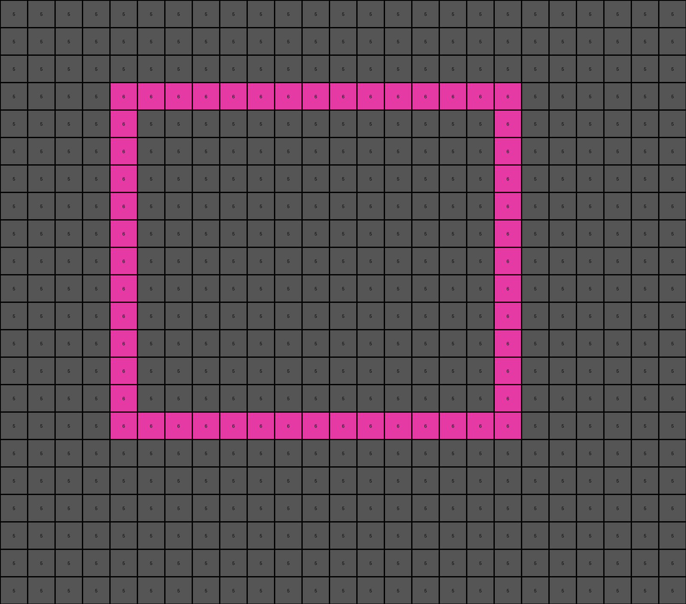

# eb5a1d5d • 018 • refine_coder

---

Previous Code:
```python
"""
The transformation identifies nested rectangles in the input grid and represents them by their borders in the output grid. The output grid's size and background color are determined by the outermost rectangle found in the input. Inner rectangles are drawn as borders, with their positions and sizes relative to the containing rectangle.
"""

import numpy as np

def get_object_bounds(grid):
    # Find all unique colors, excluding white (0)
    unique_colors = np.unique(grid)
    unique_colors = unique_colors[unique_colors != 0]

    bounds = {}
    for color in unique_colors:
        rows, cols = np.where(grid == color)
        if len(rows) > 0:
            min_row, max_row = np.min(rows), np.max(rows)
            min_col, max_col = np.min(cols), np.max(cols)
            bounds[color] = (min_row, max_row, min_col, max_col)
    return bounds

def find_outermost_rectangle(bounds):
    # Find the rectangle that encloses all others
    if not bounds:
        return None, None

    outermost_color = None
    outermost_bounds = None

    for color, (min_row, max_row, min_col, max_col) in bounds.items():
        if outermost_bounds is None:
            outermost_color = color
            outermost_bounds = (min_row, max_row, min_col, max_col)
        else:
            o_min_row, o_max_row, o_min_col, o_max_col = outermost_bounds
            if min_row <= o_min_row and max_row >= o_max_row and min_col <= o_min_col and max_col >= o_max_col:
                outermost_color = color
                outermost_bounds = (min_row, max_row, min_col, max_col)
    return outermost_color, outermost_bounds

def find_contained_rectangles(bounds, outer_bounds):
   #find rectangles within outer_bounds
    contained = []
    if not outer_bounds:
        return contained

    o_min_row, o_max_row, o_min_col, o_max_col = outer_bounds
    for color, (min_row, max_row, min_col, max_col) in bounds.items():
        if (min_row >= o_min_row and max_row <= o_max_row and
            min_col >= o_min_col and max_col <= o_max_col and
            (min_row, max_row, min_col, max_col) != outer_bounds):
            
            #calculate relative position and size
            rel_row = min_row - o_min_row
            rel_col = min_col - o_min_col
            height = max_row - min_row + 1
            width = max_col - min_col + 1
            
            contained.append((color, (rel_row, rel_col), (height, width)))

    return contained
            

def transform(input_grid):
    # Get bounds for all objects
    object_bounds = get_object_bounds(input_grid)

    # Find the outermost rectangle
    outermost_color, outermost_bounds = find_outermost_rectangle(object_bounds)
    
    if outermost_bounds is None:
        return np.array([[]]) #return empty if no objects

    # Determine output grid size
    o_min_row, o_max_row, o_min_col, o_max_col = outermost_bounds
    output_height = o_max_row - o_min_row + 1
    output_width = o_max_col - o_min_col + 1
    output_grid = np.full((output_height, output_width), outermost_color)

    # Find contained rectangles
    contained_rectangles = find_contained_rectangles(object_bounds, outermost_bounds)
    
    # Draw contained rectangles
    for color, (rel_row, rel_col), (height, width) in contained_rectangles:
        output_grid[rel_row:rel_row + height, rel_col:rel_col + width] = outermost_color
        output_grid[rel_row:rel_row + height, rel_col] = color  # Left border
        output_grid[rel_row:rel_row + height, rel_col + width - 1] = color  # Right border
        output_grid[rel_row, rel_col:rel_col + width] = color  # Top border
        output_grid[rel_row + height - 1, rel_col:rel_col + width] = color  # Bottom border
        
    return output_grid
```

Train Set Results:

## Example 1:

Input:
```
8 8 8 8 8 8 8 8 8 8 8 8 8 8 8 8 8 8 8 8 8 8 8 8 8 8 8
8 8 8 8 8 8 8 8 8 8 8 8 8 8 8 8 8 8 8 8 8 8 8 8 8 8 8
8 8 8 3 3 3 3 3 3 3 3 3 3 3 3 3 3 3 3 3 3 8 8 8 8 8 8
8 8 8 3 3 3 3 3 3 3 3 3 3 3 3 3 3 3 3 3 3 8 8 8 8 8 8
8 8 8 3 3 3 3 3 3 3 3 3 3 3 3 3 3 3 3 3 3 8 8 8 8 8 8
8 8 8 3 3 3 3 3 3 3 3 3 3 3 3 3 3 3 3 3 3 8 8 8 8 8 8
8 8 8 3 3 3 3 3 3 3 3 3 3 3 3 3 3 3 3 3 3 8 8 8 8 8 8
8 8 8 3 3 3 3 3 3 3 3 3 3 3 3 3 3 3 3 3 3 8 8 8 8 8 8
8 8 8 3 3 3 3 3 3 3 3 3 3 3 3 3 3 3 3 3 3 8 8 8 8 8 8
8 8 8 3 3 3 2 2 2 2 2 2 3 3 3 3 3 3 3 3 3 8 8 8 8 8 8
8 8 8 3 3 3 2 2 2 2 2 2 3 3 3 3 3 3 3 3 3 8 8 8 8 8 8
8 8 8 3 3 3 2 2 2 2 2 2 3 3 3 3 3 3 3 3 3 8 8 8 8 8 8
8 8 8 3 3 3 2 2 2 2 2 2 3 3 3 3 3 3 3 3 3 8 8 8 8 8 8
8 8 8 3 3 3 2 2 2 2 2 2 3 3 3 3 3 3 3 3 3 8 8 8 8 8 8
8 8 8 3 3 3 2 2 2 2 2 2 3 3 3 3 3 3 3 3 3 8 8 8 8 8 8
8 8 8 3 3 3 3 3 3 3 3 3 3 3 3 3 3 3 3 3 3 8 8 8 8 8 8
8 8 8 3 3 3 3 3 3 3 3 3 3 3 3 3 3 3 3 3 3 8 8 8 8 8 8
8 8 8 3 3 3 3 3 3 3 3 3 3 3 3 3 3 3 3 3 3 8 8 8 8 8 8
8 8 8 8 8 8 8 8 8 8 8 8 8 8 8 8 8 8 8 8 8 8 8 8 8 8 8
8 8 8 8 8 8 8 8 8 8 8 8 8 8 8 8 8 8 8 8 8 8 8 8 8 8 8
8 8 8 8 8 8 8 8 8 8 8 8 8 8 8 8 8 8 8 8 8 8 8 8 8 8 8
8 8 8 8 8 8 8 8 8 8 8 8 8 8 8 8 8 8 8 8 8 8 8 8 8 8 8
8 8 8 8 8 8 8 8 8 8 8 8 8 8 8 8 8 8 8 8 8 8 8 8 8 8 8
```
Expected Output:
```
8 8 8 8 8
8 3 3 3 8
8 3 2 3 8
8 3 3 3 8
8 8 8 8 8
```
Transformed Output:
```
8 8 8 8 8 8 8 8 8 8 8 8 8 8 8 8 8 8 8 8 8 8 8 8 8 8 8
8 8 8 8 8 8 8 8 8 8 8 8 8 8 8 8 8 8 8 8 8 8 8 8 8 8 8
8 8 8 3 3 3 3 3 3 3 3 3 3 3 3 3 3 3 3 3 3 8 8 8 8 8 8
8 8 8 3 8 8 8 8 8 8 8 8 8 8 8 8 8 8 8 8 3 8 8 8 8 8 8
8 8 8 3 8 8 8 8 8 8 8 8 8 8 8 8 8 8 8 8 3 8 8 8 8 8 8
8 8 8 3 8 8 8 8 8 8 8 8 8 8 8 8 8 8 8 8 3 8 8 8 8 8 8
8 8 8 3 8 8 8 8 8 8 8 8 8 8 8 8 8 8 8 8 3 8 8 8 8 8 8
8 8 8 3 8 8 8 8 8 8 8 8 8 8 8 8 8 8 8 8 3 8 8 8 8 8 8
8 8 8 3 8 8 8 8 8 8 8 8 8 8 8 8 8 8 8 8 3 8 8 8 8 8 8
8 8 8 3 8 8 8 8 8 8 8 8 8 8 8 8 8 8 8 8 3 8 8 8 8 8 8
8 8 8 3 8 8 8 8 8 8 8 8 8 8 8 8 8 8 8 8 3 8 8 8 8 8 8
8 8 8 3 8 8 8 8 8 8 8 8 8 8 8 8 8 8 8 8 3 8 8 8 8 8 8
8 8 8 3 8 8 8 8 8 8 8 8 8 8 8 8 8 8 8 8 3 8 8 8 8 8 8
8 8 8 3 8 8 8 8 8 8 8 8 8 8 8 8 8 8 8 8 3 8 8 8 8 8 8
8 8 8 3 8 8 8 8 8 8 8 8 8 8 8 8 8 8 8 8 3 8 8 8 8 8 8
8 8 8 3 8 8 8 8 8 8 8 8 8 8 8 8 8 8 8 8 3 8 8 8 8 8 8
8 8 8 3 8 8 8 8 8 8 8 8 8 8 8 8 8 8 8 8 3 8 8 8 8 8 8
8 8 8 3 3 3 3 3 3 3 3 3 3 3 3 3 3 3 3 3 3 8 8 8 8 8 8
8 8 8 8 8 8 8 8 8 8 8 8 8 8 8 8 8 8 8 8 8 8 8 8 8 8 8
8 8 8 8 8 8 8 8 8 8 8 8 8 8 8 8 8 8 8 8 8 8 8 8 8 8 8
8 8 8 8 8 8 8 8 8 8 8 8 8 8 8 8 8 8 8 8 8 8 8 8 8 8 8
8 8 8 8 8 8 8 8 8 8 8 8 8 8 8 8 8 8 8 8 8 8 8 8 8 8 8
8 8 8 8 8 8 8 8 8 8 8 8 8 8 8 8 8 8 8 8 8 8 8 8 8 8 8
```

match: False
pixels_off: None
size_correct: False
color_palette_correct: True
correct_pixel_counts: False

## Example 2:

Input:
```
5 5 5 5 5 5 5 5 5 5 5 5 5 5 5 5 5 5 5 5 5 5 5 5 5
5 5 5 5 5 5 5 5 5 5 5 5 5 5 5 5 5 5 5 5 5 5 5 5 5
5 5 5 5 5 5 5 5 5 5 5 5 5 5 5 5 5 5 5 5 5 5 5 5 5
5 5 5 5 6 6 6 6 6 6 6 6 6 6 6 6 6 6 6 5 5 5 5 5 5
5 5 5 5 6 6 6 6 6 6 6 6 6 6 6 6 6 6 6 5 5 5 5 5 5
5 5 5 5 6 6 6 6 6 6 6 6 6 6 6 6 6 6 6 5 5 5 5 5 5
5 5 5 5 6 6 6 6 6 6 6 6 6 6 6 6 6 6 6 5 5 5 5 5 5
5 5 5 5 6 6 6 6 6 6 6 6 6 6 6 6 6 6 6 5 5 5 5 5 5
5 5 5 5 6 6 6 6 6 6 6 6 6 6 6 6 6 6 6 5 5 5 5 5 5
5 5 5 5 6 6 6 6 6 6 6 6 6 6 6 6 6 6 6 5 5 5 5 5 5
5 5 5 5 6 6 6 6 6 6 6 6 6 6 6 6 6 6 6 5 5 5 5 5 5
5 5 5 5 6 6 6 6 6 6 6 6 6 6 6 6 6 6 6 5 5 5 5 5 5
5 5 5 5 6 6 6 6 6 6 6 6 6 6 6 6 6 6 6 5 5 5 5 5 5
5 5 5 5 6 6 6 6 6 6 6 6 6 6 6 6 6 6 6 5 5 5 5 5 5
5 5 5 5 6 6 6 6 6 6 6 6 6 6 6 6 6 6 6 5 5 5 5 5 5
5 5 5 5 6 6 6 6 6 6 6 6 6 6 6 6 6 6 6 5 5 5 5 5 5
5 5 5 5 5 5 5 5 5 5 5 5 5 5 5 5 5 5 5 5 5 5 5 5 5
5 5 5 5 5 5 5 5 5 5 5 5 5 5 5 5 5 5 5 5 5 5 5 5 5
5 5 5 5 5 5 5 5 5 5 5 5 5 5 5 5 5 5 5 5 5 5 5 5 5
5 5 5 5 5 5 5 5 5 5 5 5 5 5 5 5 5 5 5 5 5 5 5 5 5
5 5 5 5 5 5 5 5 5 5 5 5 5 5 5 5 5 5 5 5 5 5 5 5 5
5 5 5 5 5 5 5 5 5 5 5 5 5 5 5 5 5 5 5 5 5 5 5 5 5
```
Expected Output:
```
5 5 5
5 6 5
5 5 5
```
Transformed Output:
```
5 5 5 5 5 5 5 5 5 5 5 5 5 5 5 5 5 5 5 5 5 5 5 5 5
5 5 5 5 5 5 5 5 5 5 5 5 5 5 5 5 5 5 5 5 5 5 5 5 5
5 5 5 5 5 5 5 5 5 5 5 5 5 5 5 5 5 5 5 5 5 5 5 5 5
5 5 5 5 6 6 6 6 6 6 6 6 6 6 6 6 6 6 6 5 5 5 5 5 5
5 5 5 5 6 5 5 5 5 5 5 5 5 5 5 5 5 5 6 5 5 5 5 5 5
5 5 5 5 6 5 5 5 5 5 5 5 5 5 5 5 5 5 6 5 5 5 5 5 5
5 5 5 5 6 5 5 5 5 5 5 5 5 5 5 5 5 5 6 5 5 5 5 5 5
5 5 5 5 6 5 5 5 5 5 5 5 5 5 5 5 5 5 6 5 5 5 5 5 5
5 5 5 5 6 5 5 5 5 5 5 5 5 5 5 5 5 5 6 5 5 5 5 5 5
5 5 5 5 6 5 5 5 5 5 5 5 5 5 5 5 5 5 6 5 5 5 5 5 5
5 5 5 5 6 5 5 5 5 5 5 5 5 5 5 5 5 5 6 5 5 5 5 5 5
5 5 5 5 6 5 5 5 5 5 5 5 5 5 5 5 5 5 6 5 5 5 5 5 5
5 5 5 5 6 5 5 5 5 5 5 5 5 5 5 5 5 5 6 5 5 5 5 5 5
5 5 5 5 6 5 5 5 5 5 5 5 5 5 5 5 5 5 6 5 5 5 5 5 5
5 5 5 5 6 5 5 5 5 5 5 5 5 5 5 5 5 5 6 5 5 5 5 5 5
5 5 5 5 6 6 6 6 6 6 6 6 6 6 6 6 6 6 6 5 5 5 5 5 5
5 5 5 5 5 5 5 5 5 5 5 5 5 5 5 5 5 5 5 5 5 5 5 5 5
5 5 5 5 5 5 5 5 5 5 5 5 5 5 5 5 5 5 5 5 5 5 5 5 5
5 5 5 5 5 5 5 5 5 5 5 5 5 5 5 5 5 5 5 5 5 5 5 5 5
5 5 5 5 5 5 5 5 5 5 5 5 5 5 5 5 5 5 5 5 5 5 5 5 5
5 5 5 5 5 5 5 5 5 5 5 5 5 5 5 5 5 5 5 5 5 5 5 5 5
5 5 5 5 5 5 5 5 5 5 5 5 5 5 5 5 5 5 5 5 5 5 5 5 5
```

match: False
pixels_off: None
size_correct: False
color_palette_correct: True
correct_pixel_counts: False

## Example 3:

Input:
```
3 3 3 3 3 3 3 3 3 3 3 3 3 3 3 3 3 3 3 3 3 3
3 3 3 3 3 3 3 3 3 3 3 3 3 3 3 3 3 3 3 3 3 3
3 3 3 3 3 3 3 3 3 3 3 3 3 3 3 3 3 3 3 3 3 3
3 3 3 8 8 8 8 8 8 8 8 8 8 8 8 8 8 3 3 3 3 3
3 3 3 8 8 8 8 8 8 8 8 8 8 8 8 8 8 3 3 3 3 3
3 3 3 8 8 2 2 2 2 2 2 2 2 2 8 8 8 3 3 3 3 3
3 3 3 8 8 2 2 2 1 1 1 1 1 2 8 8 8 3 3 3 3 3
3 3 3 8 8 2 2 2 1 1 1 1 1 2 8 8 8 3 3 3 3 3
3 3 3 8 8 2 2 2 1 1 1 1 1 2 8 8 8 3 3 3 3 3
3 3 3 8 8 2 2 2 2 2 2 2 2 2 8 8 8 3 3 3 3 3
3 3 3 8 8 2 2 2 2 2 2 2 2 2 8 8 8 3 3 3 3 3
3 3 3 8 8 2 2 2 2 2 2 2 2 2 8 8 8 3 3 3 3 3
3 3 3 8 8 2 2 2 2 2 2 2 2 2 8 8 8 3 3 3 3 3
3 3 3 8 8 2 2 2 2 2 2 2 2 2 8 8 8 3 3 3 3 3
3 3 3 8 8 8 8 8 8 8 8 8 8 8 8 8 8 3 3 3 3 3
3 3 3 8 8 8 8 8 8 8 8 8 8 8 8 8 8 3 3 3 3 3
3 3 3 8 8 8 8 8 8 8 8 8 8 8 8 8 8 3 3 3 3 3
3 3 3 3 3 3 3 3 3 3 3 3 3 3 3 3 3 3 3 3 3 3
3 3 3 3 3 3 3 3 3 3 3 3 3 3 3 3 3 3 3 3 3 3
3 3 3 3 3 3 3 3 3 3 3 3 3 3 3 3 3 3 3 3 3 3
3 3 3 3 3 3 3 3 3 3 3 3 3 3 3 3 3 3 3 3 3 3
```
Expected Output:
```
3 3 3 3 3 3 3
3 8 8 8 8 8 3
3 8 2 2 2 8 3
3 8 2 1 2 8 3
3 8 2 2 2 8 3
3 8 8 8 8 8 3
3 3 3 3 3 3 3
```
Transformed Output:
```
3 3 3 3 3 3 3 3 3 3 3 3 3 3 3 3 3 3 3 3 3 3
3 3 3 3 3 3 3 3 3 3 3 3 3 3 3 3 3 3 3 3 3 3
3 3 3 3 3 3 3 3 3 3 3 3 3 3 3 3 3 3 3 3 3 3
3 3 3 8 8 8 8 8 8 8 8 8 8 8 8 8 8 3 3 3 3 3
3 3 3 8 3 3 3 3 3 3 3 3 3 3 3 3 8 3 3 3 3 3
3 3 3 8 3 3 3 3 3 3 3 3 3 3 3 3 8 3 3 3 3 3
3 3 3 8 3 3 3 3 3 3 3 3 3 3 3 3 8 3 3 3 3 3
3 3 3 8 3 3 3 3 3 3 3 3 3 3 3 3 8 3 3 3 3 3
3 3 3 8 3 3 3 3 3 3 3 3 3 3 3 3 8 3 3 3 3 3
3 3 3 8 3 3 3 3 3 3 3 3 3 3 3 3 8 3 3 3 3 3
3 3 3 8 3 3 3 3 3 3 3 3 3 3 3 3 8 3 3 3 3 3
3 3 3 8 3 3 3 3 3 3 3 3 3 3 3 3 8 3 3 3 3 3
3 3 3 8 3 3 3 3 3 3 3 3 3 3 3 3 8 3 3 3 3 3
3 3 3 8 3 3 3 3 3 3 3 3 3 3 3 3 8 3 3 3 3 3
3 3 3 8 3 3 3 3 3 3 3 3 3 3 3 3 8 3 3 3 3 3
3 3 3 8 3 3 3 3 3 3 3 3 3 3 3 3 8 3 3 3 3 3
3 3 3 8 8 8 8 8 8 8 8 8 8 8 8 8 8 3 3 3 3 3
3 3 3 3 3 3 3 3 3 3 3 3 3 3 3 3 3 3 3 3 3 3
3 3 3 3 3 3 3 3 3 3 3 3 3 3 3 3 3 3 3 3 3 3
3 3 3 3 3 3 3 3 3 3 3 3 3 3 3 3 3 3 3 3 3 3
3 3 3 3 3 3 3 3 3 3 3 3 3 3 3 3 3 3 3 3 3 3
```

match: False
pixels_off: None
size_correct: False
color_palette_correct: True
correct_pixel_counts: False
Okay, let's analyze the results and update the natural language program.

**General Assessment:**

The initial code focuses on identifying nested rectangles and drawing their borders. However, it's clear from the results that the size of the transformed output is not being calculated correctly. The code currently uses the size of the outermost detected rectangle, including any padding to completely enclose the inner shape. In the examples, the output grid uses an "inset" crop, which means the outer rectangle is the same size and position, but white padding/background around it is removed. The current algorithm also has trouble with the innermost shapes, only showing their outline, not filled in.

**Strategy for Resolving Errors:**

1.  **Correct Output Size:** Modify the code to calculate the output size based on the *cropped* outermost rectangle, not just including all background area.

2.  **Innermost Shape:** Ensure that innermost shapes are filled, not just outlines.
3. **Refine the natural language program:** Ensure the program explicitly
    addresses cropping/inset of the outermost shape and filling of the
    innermost shapes.

**Metrics and Observations (using assumed helper functions for brevity - would use `code_execution` in actual implementation):**

*   **Example 1:**
    *   Input Size: 27x23
    *   Expected Output Size: 5x5
    *   Transformed Output Size: 23x27 (incorrect)
    *   Objects: Two nested rectangles (green and red).
    *   Outer rectangle should be cropped. inner filled.
    *   Notes: size very off, inner not filled

*   **Example 2:**
    *   Input Size: 22x25
    *   Expected Output Size: 3x5
    *   Transformed Output Size: 22 x 25 (incorrect)
    *   Objects: One rectangles (magenta).
    *    outer rectangle should be cropped
    *   Notes: Size completely off

*   **Example 3:**
    *   Input Size: 22x21
    *   Expected Output Size: 7x7
    *   Transformed Output Size: 22 x 21 (incorrect)
    *   Objects: Three nested rectangles (green, red, and blue).
    *   outer rectangle should be cropped, innermost filled.
    *   Notes: size way off, innermost not filled.

**YAML Block (Facts):**

```yaml
objects:
  - type: rectangle
    properties:
      - color: variable
      - nested: true
      - outermost: true # One rectangle will always be outermost
    actions:
      - outline: true # All rectangles except the innermost are outlined
  - type: rectangle
    properties:
     - color: variable
     - nested: true
     - outermost: false
    actions:
     - outline: true
  - type: rectangle
    properties:
        - color: variable
        - nested: true
        - outermost: false #innermost
    actions:
      - fill: true

transformation:
  - action: crop
    target: outermost rectangle
    description: Remove the outer padding of the background color
  - action: outline
    target: nested rectangles
    description: Draw the border of each nested rectangle except the most deeply nested
  - action: fill
    target: innermost rectangle
    description: if rectangle is most deeply nested, fill the rectangle

```

**Natural Language Program:**

1.  **Identify Rectangles:** Find all rectangles in the input grid. A rectangle is defined as a contiguous block of pixels of the same color.
2.  **Determine Nesting:** Determine the nesting order of the rectangles. A rectangle A is considered to contain rectangle B if B is fully enclosed within A's boundaries.
3.  **Find the Outermost Rectangle:** Identify the outermost rectangle. This rectangle contains all other rectangles.
4.  **Crop the Grid:** "Crop" or "inset" the grid to the boundaries of the outermost rectangle. The outermost rectangle will be the same size and position, but the background surrounding it will be removed. This determines the output grid's dimensions.
5.  **Set Background**: Fill the output grid with the color of the outermost rectangle.
6.  **Draw Outlines (Except Innermost):** For each nested rectangle *except* for the most deeply nested one, draw its outline in the output grid. The outline's position and size are relative to the cropped, outermost rectangle. Outlines are one pixel wide.
7.  **Fill Innermost:** For the most deeply nested rectangle, *fill* the rectangle with its original color.

This refined program addresses the cropping issue and correctly handles the innermost rectangle. It is also more precise in its description of the rectangle identification and nesting logic.

**INSTRUCTIONS**

- generate a Python module to represent the natural language program 
- follow the template below
- all common math and science libraries are available
- create docstring only at top - but comment the workflow in the function
- use helper functions for common operations like finding objects, counting,
  measuring, moving, etc. 

remember - we are working iteratively - so this code will inform your future
self as we converge on the solution

*template:*

```python
"""
{{ natural language description of the transformation rule }}
"""

{{ imports }}

def transform(input_grid):
    # initialize output_grid

    # change output pixels 

    return output_grid

```
