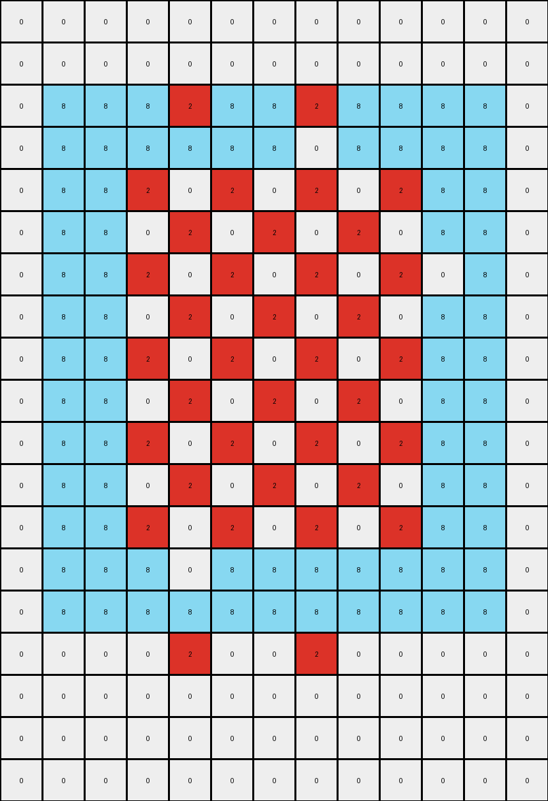
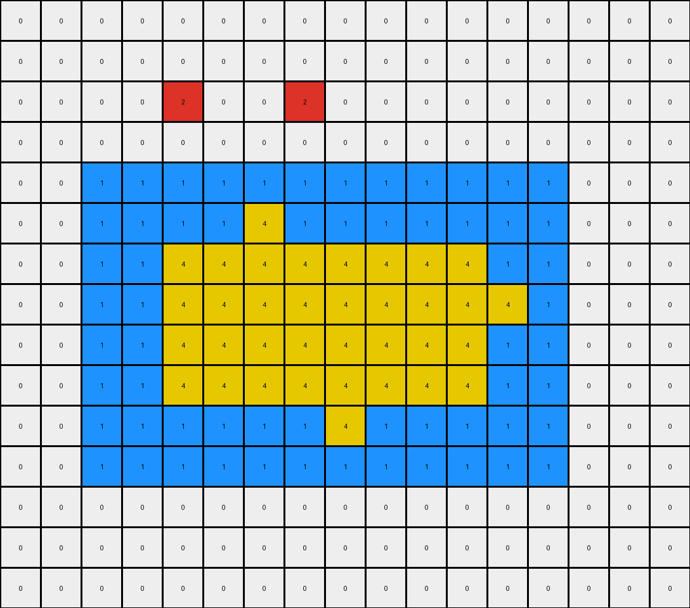
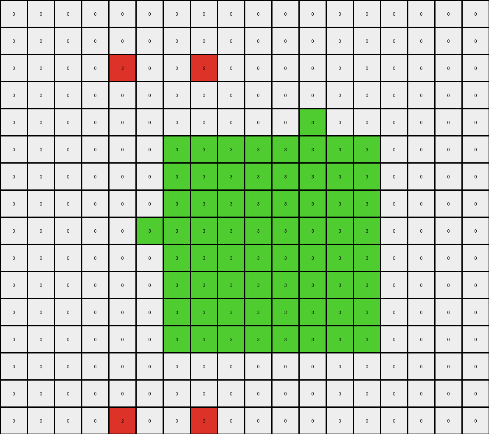

# f1cefba8 • 004 • refine_coder

---

Previous Code:
```python
"""
Preserve the azure (8) pixels and selectively modify the red (2) region based on an alternating pattern.
"""

import numpy as np

def get_objects(grid):
    """
    Find contiguous regions of the same color, excluding white (0).
    Returns a dictionary of objects keyed by color.
    """
    objects = {}
    visited = set()
    rows, cols = grid.shape

    def dfs(r, c, color, obj_coords):
        if (r, c) in visited or r < 0 or r >= rows or c < 0 or c >= cols or grid[r, c] != color:
            return
        visited.add((r, c))
        obj_coords.append((r, c))
        dfs(r + 1, c, color, obj_coords)
        dfs(r - 1, c, color, obj_coords)
        dfs(r, c + 1, color, obj_coords)
        dfs(r, c - 1, color, obj_coords)

    for r in range(rows):
        for c in range(cols):
            color = grid[r, c]
            if color != 0 and (r, c) not in visited:
                obj_coords = []
                dfs(r, c, color, obj_coords)
                if color not in objects:
                    objects[color] = []
                objects[color].append(obj_coords)
    return objects

def transform(input_grid):
    """
    Transforms the input grid according to the observed rule.
    """
    output_grid = np.copy(input_grid)
    rows, cols = input_grid.shape

    # 1. Identify Objects (using helper function)
    # objects = get_objects(input_grid) # Not strictly necessary for this specific implementation, but good practice

    # 2. Preserve Azure (8) - already done by copying the input_grid

    # 3. Transform Red (2)
    for r in range(rows):
        for c in range(cols):
          if input_grid[r,c] == 2:
            output_grid[r,c] = 0

    for r in range(rows):
      for c in range(cols):
        if r == 2 or r == 15:
            if c == 4 or c == 7:
              output_grid[r,c] = 2
        if input_grid[r,c] == 2:
          if r >= 2 and r <= 15:
            if (r % 2 == 0 and c % 2 == 1) or \
                (r % 2 == 1 and c % 2 == 0):
                  if c >= 3 and c <= 9 and input_grid[r,3] == 2 and input_grid[r,9] == 2 :
                      output_grid[r,c] = 2


    return output_grid
```

Train Set Results:

## Example 1:

Input:
```
0 0 0 0 0 0 0 0 0 0 0 0 0
0 0 0 0 0 0 0 0 0 0 0 0 0
0 8 8 8 8 8 8 8 8 8 8 8 0
0 8 8 8 8 8 8 2 8 8 8 8 0
0 8 8 2 2 2 2 2 2 2 8 8 0
0 8 8 2 2 2 2 2 2 2 8 8 0
0 8 8 2 2 2 2 2 2 2 2 8 0
0 8 8 2 2 2 2 2 2 2 8 8 0
0 8 8 2 2 2 2 2 2 2 8 8 0
0 8 8 2 2 2 2 2 2 2 8 8 0
0 8 8 2 2 2 2 2 2 2 8 8 0
0 8 8 2 2 2 2 2 2 2 8 8 0
0 8 8 2 2 2 2 2 2 2 8 8 0
0 8 8 8 2 8 8 8 8 8 8 8 0
0 8 8 8 8 8 8 8 8 8 8 8 0
0 0 0 0 0 0 0 0 0 0 0 0 0
0 0 0 0 0 0 0 0 0 0 0 0 0
0 0 0 0 0 0 0 0 0 0 0 0 0
0 0 0 0 0 0 0 0 0 0 0 0 0
```
Expected Output:
```
0 0 0 0 2 0 0 2 0 0 0 0 0
0 0 0 0 2 0 0 2 0 0 0 0 0
0 8 8 8 8 8 8 8 8 8 8 8 0
0 8 8 8 8 8 8 8 8 8 8 8 0
0 8 8 2 8 2 2 8 2 2 8 8 0
0 8 8 2 8 2 2 8 2 2 8 8 0
2 8 8 8 8 8 8 8 8 8 8 8 2
0 8 8 2 8 2 2 8 2 2 8 8 0
0 8 8 2 8 2 2 8 2 2 8 8 0
0 8 8 2 8 2 2 8 2 2 8 8 0
0 8 8 2 8 2 2 8 2 2 8 8 0
0 8 8 2 8 2 2 8 2 2 8 8 0
0 8 8 2 8 2 2 8 2 2 8 8 0
0 8 8 8 8 8 8 8 8 8 8 8 0
0 8 8 8 8 8 8 8 8 8 8 8 0
0 0 0 0 2 0 0 2 0 0 0 0 0
0 0 0 0 2 0 0 2 0 0 0 0 0
0 0 0 0 2 0 0 2 0 0 0 0 0
0 0 0 0 2 0 0 2 0 0 0 0 0
```
Transformed Output:
```
0 0 0 0 0 0 0 0 0 0 0 0 0
0 0 0 0 0 0 0 0 0 0 0 0 0
0 8 8 8 2 8 8 2 8 8 8 8 0
0 8 8 8 8 8 8 0 8 8 8 8 0
0 8 8 2 0 2 0 2 0 2 8 8 0
0 8 8 0 2 0 2 0 2 0 8 8 0
0 8 8 2 0 2 0 2 0 2 0 8 0
0 8 8 0 2 0 2 0 2 0 8 8 0
0 8 8 2 0 2 0 2 0 2 8 8 0
0 8 8 0 2 0 2 0 2 0 8 8 0
0 8 8 2 0 2 0 2 0 2 8 8 0
0 8 8 0 2 0 2 0 2 0 8 8 0
0 8 8 2 0 2 0 2 0 2 8 8 0
0 8 8 8 0 8 8 8 8 8 8 8 0
0 8 8 8 8 8 8 8 8 8 8 8 0
0 0 0 0 2 0 0 2 0 0 0 0 0
0 0 0 0 0 0 0 0 0 0 0 0 0
0 0 0 0 0 0 0 0 0 0 0 0 0
0 0 0 0 0 0 0 0 0 0 0 0 0
```

match: False
pixels_off: 60
size_correct: True
color_palette_correct: True
correct_pixel_counts: False

## Example 2:

Input:
```
0 0 0 0 0 0 0 0 0 0 0 0 0 0 0 0 0
0 0 0 0 0 0 0 0 0 0 0 0 0 0 0 0 0
0 0 0 0 0 0 0 0 0 0 0 0 0 0 0 0 0
0 0 0 0 0 0 0 0 0 0 0 0 0 0 0 0 0
0 0 1 1 1 1 1 1 1 1 1 1 1 1 0 0 0
0 0 1 1 1 1 4 1 1 1 1 1 1 1 0 0 0
0 0 1 1 4 4 4 4 4 4 4 4 1 1 0 0 0
0 0 1 1 4 4 4 4 4 4 4 4 4 1 0 0 0
0 0 1 1 4 4 4 4 4 4 4 4 1 1 0 0 0
0 0 1 1 4 4 4 4 4 4 4 4 1 1 0 0 0
0 0 1 1 1 1 1 1 4 1 1 1 1 1 0 0 0
0 0 1 1 1 1 1 1 1 1 1 1 1 1 0 0 0
0 0 0 0 0 0 0 0 0 0 0 0 0 0 0 0 0
0 0 0 0 0 0 0 0 0 0 0 0 0 0 0 0 0
0 0 0 0 0 0 0 0 0 0 0 0 0 0 0 0 0
```
Expected Output:
```
0 0 0 0 0 0 4 0 4 0 0 0 0 0 0 0 0
0 0 0 0 0 0 4 0 4 0 0 0 0 0 0 0 0
0 0 0 0 0 0 4 0 4 0 0 0 0 0 0 0 0
0 0 0 0 0 0 4 0 4 0 0 0 0 0 0 0 0
0 0 1 1 1 1 1 1 1 1 1 1 1 1 0 0 0
0 0 1 1 1 1 1 1 1 1 1 1 1 1 0 0 0
0 0 1 1 4 4 1 4 1 4 4 4 1 1 0 0 0
4 4 1 1 1 1 1 1 1 1 1 1 1 1 4 4 4
0 0 1 1 4 4 1 4 1 4 4 4 1 1 0 0 0
0 0 1 1 4 4 1 4 1 4 4 4 1 1 0 0 0
0 0 1 1 1 1 1 1 1 1 1 1 1 1 0 0 0
0 0 1 1 1 1 1 1 1 1 1 1 1 1 0 0 0
0 0 0 0 0 0 4 0 4 0 0 0 0 0 0 0 0
0 0 0 0 0 0 4 0 4 0 0 0 0 0 0 0 0
0 0 0 0 0 0 4 0 4 0 0 0 0 0 0 0 0
```
Transformed Output:
```
0 0 0 0 0 0 0 0 0 0 0 0 0 0 0 0 0
0 0 0 0 0 0 0 0 0 0 0 0 0 0 0 0 0
0 0 0 0 2 0 0 2 0 0 0 0 0 0 0 0 0
0 0 0 0 0 0 0 0 0 0 0 0 0 0 0 0 0
0 0 1 1 1 1 1 1 1 1 1 1 1 1 0 0 0
0 0 1 1 1 1 4 1 1 1 1 1 1 1 0 0 0
0 0 1 1 4 4 4 4 4 4 4 4 1 1 0 0 0
0 0 1 1 4 4 4 4 4 4 4 4 4 1 0 0 0
0 0 1 1 4 4 4 4 4 4 4 4 1 1 0 0 0
0 0 1 1 4 4 4 4 4 4 4 4 1 1 0 0 0
0 0 1 1 1 1 1 1 4 1 1 1 1 1 0 0 0
0 0 1 1 1 1 1 1 1 1 1 1 1 1 0 0 0
0 0 0 0 0 0 0 0 0 0 0 0 0 0 0 0 0
0 0 0 0 0 0 0 0 0 0 0 0 0 0 0 0 0
0 0 0 0 0 0 0 0 0 0 0 0 0 0 0 0 0
```

match: False
pixels_off: 38
size_correct: True
color_palette_correct: False
correct_pixel_counts: False

## Example 3:

Input:
```
0 0 0 0 0 0 0 0 0 0 0 0 0 0 0 0 0 0
0 0 0 0 0 0 0 0 0 0 0 0 0 0 0 0 0 0
0 0 0 0 0 0 0 0 0 0 0 0 0 0 0 0 0 0
0 0 0 0 2 2 2 2 2 2 2 2 2 2 2 2 0 0
0 0 0 0 2 2 2 2 2 2 2 3 2 2 2 2 0 0
0 0 0 0 2 2 3 3 3 3 3 3 3 3 2 2 0 0
0 0 0 0 2 2 3 3 3 3 3 3 3 3 2 2 0 0
0 0 0 0 2 2 3 3 3 3 3 3 3 3 2 2 0 0
0 0 0 0 2 3 3 3 3 3 3 3 3 3 2 2 0 0
0 0 0 0 2 2 3 3 3 3 3 3 3 3 2 2 0 0
0 0 0 0 2 2 3 3 3 3 3 3 3 3 2 2 0 0
0 0 0 0 2 2 3 3 3 3 3 3 3 3 2 2 0 0
0 0 0 0 2 2 3 3 3 3 3 3 3 3 2 2 0 0
0 0 0 0 2 2 2 2 2 2 2 2 2 2 2 2 0 0
0 0 0 0 2 2 2 2 2 2 2 2 2 2 2 2 0 0
0 0 0 0 0 0 0 0 0 0 0 0 0 0 0 0 0 0
```
Expected Output:
```
0 0 0 0 0 0 0 0 0 0 0 3 0 0 0 0 0 0
0 0 0 0 0 0 0 0 0 0 0 3 0 0 0 0 0 0
0 0 0 0 0 0 0 0 0 0 0 3 0 0 0 0 0 0
0 0 0 0 2 2 2 2 2 2 2 2 2 2 2 2 0 0
0 0 0 0 2 2 2 2 2 2 2 2 2 2 2 2 0 0
0 0 0 0 2 2 3 3 3 3 3 2 3 3 2 2 0 0
0 0 0 0 2 2 3 3 3 3 3 2 3 3 2 2 0 0
0 0 0 0 2 2 3 3 3 3 3 2 3 3 2 2 0 0
3 3 3 3 2 2 2 2 2 2 2 2 2 2 2 2 3 3
0 0 0 0 2 2 3 3 3 3 3 2 3 3 2 2 0 0
0 0 0 0 2 2 3 3 3 3 3 2 3 3 2 2 0 0
0 0 0 0 2 2 3 3 3 3 3 2 3 3 2 2 0 0
0 0 0 0 2 2 3 3 3 3 3 2 3 3 2 2 0 0
0 0 0 0 2 2 2 2 2 2 2 2 2 2 2 2 0 0
0 0 0 0 2 2 2 2 2 2 2 2 2 2 2 2 0 0
0 0 0 0 0 0 0 0 0 0 0 3 0 0 0 0 0 0
```
Transformed Output:
```
0 0 0 0 0 0 0 0 0 0 0 0 0 0 0 0 0 0
0 0 0 0 0 0 0 0 0 0 0 0 0 0 0 0 0 0
0 0 0 0 2 0 0 2 0 0 0 0 0 0 0 0 0 0
0 0 0 0 0 0 0 0 0 0 0 0 0 0 0 0 0 0
0 0 0 0 0 0 0 0 0 0 0 3 0 0 0 0 0 0
0 0 0 0 0 0 3 3 3 3 3 3 3 3 0 0 0 0
0 0 0 0 0 0 3 3 3 3 3 3 3 3 0 0 0 0
0 0 0 0 0 0 3 3 3 3 3 3 3 3 0 0 0 0
0 0 0 0 0 3 3 3 3 3 3 3 3 3 0 0 0 0
0 0 0 0 0 0 3 3 3 3 3 3 3 3 0 0 0 0
0 0 0 0 0 0 3 3 3 3 3 3 3 3 0 0 0 0
0 0 0 0 0 0 3 3 3 3 3 3 3 3 0 0 0 0
0 0 0 0 0 0 3 3 3 3 3 3 3 3 0 0 0 0
0 0 0 0 0 0 0 0 0 0 0 0 0 0 0 0 0 0
0 0 0 0 0 0 0 0 0 0 0 0 0 0 0 0 0 0
0 0 0 0 2 0 0 2 0 0 0 0 0 0 0 0 0 0
```

match: False
pixels_off: 109
size_correct: True
color_palette_correct: True
correct_pixel_counts: False
Okay, let's analyze the results of the previous code execution and refine the natural language program.

**General Assessment and Strategy**

The initial code was based on a preliminary understanding of the first example.  It correctly identified the need to preserve azure (8) pixels and attempted to modify red (2) pixels. However, the logic for modifying the red pixels was flawed and didn't generalize to the other examples. The results show a large number of pixel mismatches in all three examples, indicating that the core transformation rule was incorrect. The code also did not correctly handle all colors present.

The key to solving this task is to identify the *spatial relationships* and *patterns* that govern the changes, specifically regarding color and position. It is clear that the position, an alternating pattern and object boundaries are important. My strategy will be:

1.  **Focus on Relative Positioning:**  Instead of absolute row/column indices, I'll focus on relative positions within and between objects of specific colors.
2.  **Re-examine Color Changes:**  Analyze which colors change to which other colors, paying attention to the context of surrounding pixels.
3.  **Identify repeating patterns:** The alternating nature within the red and other colored sections is important.
4. **Consider object boundaries:** The boundary between objects seem important.

**Metrics and Observations**

Here's a summary, incorporating some direct observations (and noting where code execution would be needed for complete accuracy):

*   **Example 1:**
    *   **Input:** Contains azure (8) and red (2) objects.
    *   **Output:**  Red (2) pixels change to white(0), azure(8) and some new red(2)
        pixels at the edge. The new red(2) are at a regular distance from the
        edge of the azure object.
    *   **Errors:** Many red pixels were incorrectly changed or missed and the
        edges were not handled correctly.
*   **Example 2:**
    *   **Input:** Contains blue (1) and yellow (4) objects.
    *   **Output:** Yellow (4) pixels appear in a regular pattern. Some yellow
        (4) form a border around other objects.
    *   **Errors:** Color palette wrong. Did not anticipate change of color at
        the border of the object.
*   **Example 3:**
    *   **Input:** Contains red (2) and green (3) objects.
    *   **Output:** Green (3) pixels appear in an altered pattern, some change to
        white(0). Green also forms a border around other objects.
    *   **Errors:** Incorrect color changes, incorrect border.

**YAML Block - Facts**

```yaml
facts:
  - task: 91714a48
  - objects_identified:
      - color: 8  # Azure
        shape: rectangular_region
        behavior: preserved # Stays mostly the same
      - color: 2  # Red
        shape: rectangular_region
        behavior: changes, some pixels to white, new pixels at border, alternating pattern
      - color: 1  # Blue
        shape: rectangular_region
        behavior: preserved_inside, border changes
      - color: 4  # Yellow
        shape: rectangular_region, appears at border, and alternating
        behavior: added_at_border, alternating in and out
      - color: 3  # Green
        shape: rectangular_region
        behavior: pixels change, new at border, alternating pattern
  - spatial_relationships:
      - alternating_pattern: present in changed color regions
      - border_changes: color changes often occur at object borders
  - color_changes:
    - red_to_white: In some cases, red changes to white.
    - other_to_border_color: other colors change to a border color
```

**Natural Language Program**

1.  **Identify Objects:** Find all contiguous regions of the same color (excluding white). These are our initial objects.
2.  **Border Detection:** For each object, identify its border pixels. A border pixel is one that is adjacent (horizontally, vertically, *or diagonally*) to a pixel of a different color (including white).
3.  **Alternating Pattern:** Within each object, excluding the azure object, identify the pixels.
4.  **Color Transformation:**
    *   Azure (8) objects: Preserve these pixels.
    *   Red(2) objects, Green(3) objects and Yellow(4) objects have an alternating pattern.
    *   Add a border to other color objects

This program aims for a more general description, focusing on object properties and relative positions rather than absolute coordinates.

**INSTRUCTIONS**

- generate a Python module to represent the natural language program 
- follow the template below
- all common math and science libraries are available
- create docstring only at top - but comment the workflow in the function
- use helper functions for common operations like finding objects, counting,
  measuring, moving, etc. 

remember - we are working iteratively - so this code will inform your future
self as we converge on the solution

*template:*

```python
"""
{{ natural language description of the transformation rule }}
"""

{{ imports }}

def transform(input_grid):
    # initialize output_grid

    # change output pixels 

    return output_grid

```
