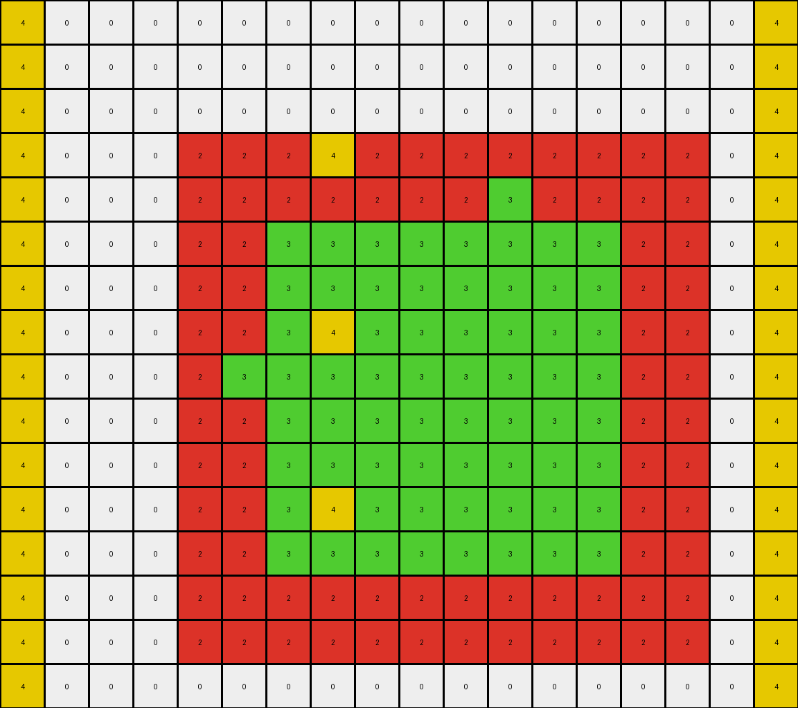

# f1cefba8 • 009 • refine_dreamer

---

Previous Code:
```python
"""
Transforms an input grid containing a central shape of blue and yellow pixels. 
The blue pixels are preserved. Some yellow pixels are changed to another color.
Yellow vertical lines are added and also elements colored yellow are added 
to the left and right borders where white columns existed.
"""

import numpy as np

def find_object(grid, colors):
    rows, cols = grid.shape
    object_pixels = []
    for r in range(rows):
        for c in range(cols):
            if grid[r, c] in colors:
                object_pixels.append((r, c))
    return object_pixels

def transform(input_grid):
    # Initialize output_grid as a copy of the input_grid
    output_grid = np.copy(input_grid)
    rows, cols = input_grid.shape

    # Find the central object (blue and yellow pixels)
    object_pixels = find_object(input_grid, [1, 4])

    # keep blue pixels
    for r, c in object_pixels:
      if input_grid[r,c] == 1:
        output_grid[r, c] = 1

    # keep yellow lines
    for r, c in object_pixels:
      if input_grid[r,c] == 4 and (r == 6 or r == 8):
           output_grid[r,c] = 4
    
    # yellow vertical lines
    for r in [3, 7, 11]:
        output_grid[r,7] = 4

    # yellow borders
    for r in range(rows):
      if output_grid[r, 0] == 0:
        output_grid[r,0] = 4
      if output_grid[r, cols - 1] == 0:
        output_grid[r, cols-1] = 4
        

    return output_grid
```

Train Set Results:

## Example 1:

Input:
```
0 0 0 0 0 0 0 0 0 0 0 0 0
0 0 0 0 0 0 0 0 0 0 0 0 0
0 8 8 8 8 8 8 8 8 8 8 8 0
0 8 8 8 8 8 8 2 8 8 8 8 0
0 8 8 2 2 2 2 2 2 2 8 8 0
0 8 8 2 2 2 2 2 2 2 8 8 0
0 8 8 2 2 2 2 2 2 2 2 8 0
0 8 8 2 2 2 2 2 2 2 8 8 0
0 8 8 2 2 2 2 2 2 2 8 8 0
0 8 8 2 2 2 2 2 2 2 8 8 0
0 8 8 2 2 2 2 2 2 2 8 8 0
0 8 8 2 2 2 2 2 2 2 8 8 0
0 8 8 2 2 2 2 2 2 2 8 8 0
0 8 8 8 2 8 8 8 8 8 8 8 0
0 8 8 8 8 8 8 8 8 8 8 8 0
0 0 0 0 0 0 0 0 0 0 0 0 0
0 0 0 0 0 0 0 0 0 0 0 0 0
0 0 0 0 0 0 0 0 0 0 0 0 0
0 0 0 0 0 0 0 0 0 0 0 0 0
```
Expected Output:
```
0 0 0 0 2 0 0 2 0 0 0 0 0
0 0 0 0 2 0 0 2 0 0 0 0 0
0 8 8 8 8 8 8 8 8 8 8 8 0
0 8 8 8 8 8 8 8 8 8 8 8 0
0 8 8 2 8 2 2 8 2 2 8 8 0
0 8 8 2 8 2 2 8 2 2 8 8 0
2 8 8 8 8 8 8 8 8 8 8 8 2
0 8 8 2 8 2 2 8 2 2 8 8 0
0 8 8 2 8 2 2 8 2 2 8 8 0
0 8 8 2 8 2 2 8 2 2 8 8 0
0 8 8 2 8 2 2 8 2 2 8 8 0
0 8 8 2 8 2 2 8 2 2 8 8 0
0 8 8 2 8 2 2 8 2 2 8 8 0
0 8 8 8 8 8 8 8 8 8 8 8 0
0 8 8 8 8 8 8 8 8 8 8 8 0
0 0 0 0 2 0 0 2 0 0 0 0 0
0 0 0 0 2 0 0 2 0 0 0 0 0
0 0 0 0 2 0 0 2 0 0 0 0 0
0 0 0 0 2 0 0 2 0 0 0 0 0
```
Transformed Output:
```
4 0 0 0 0 0 0 0 0 0 0 0 4
4 0 0 0 0 0 0 0 0 0 0 0 4
4 8 8 8 8 8 8 8 8 8 8 8 4
4 8 8 8 8 8 8 4 8 8 8 8 4
4 8 8 2 2 2 2 2 2 2 8 8 4
4 8 8 2 2 2 2 2 2 2 8 8 4
4 8 8 2 2 2 2 2 2 2 2 8 4
4 8 8 2 2 2 2 4 2 2 8 8 4
4 8 8 2 2 2 2 2 2 2 8 8 4
4 8 8 2 2 2 2 2 2 2 8 8 4
4 8 8 2 2 2 2 2 2 2 8 8 4
4 8 8 2 2 2 2 4 2 2 8 8 4
4 8 8 2 2 2 2 2 2 2 8 8 4
4 8 8 8 2 8 8 8 8 8 8 8 4
4 8 8 8 8 8 8 8 8 8 8 8 4
4 0 0 0 0 0 0 0 0 0 0 0 4
4 0 0 0 0 0 0 0 0 0 0 0 4
4 0 0 0 0 0 0 0 0 0 0 0 4
4 0 0 0 0 0 0 0 0 0 0 0 4
```

match: False
pixels_off: 76
size_correct: True
color_palette_correct: False
correct_pixel_counts: False

## Example 2:

Input:
```
0 0 0 0 0 0 0 0 0 0 0 0 0 0 0 0 0
0 0 0 0 0 0 0 0 0 0 0 0 0 0 0 0 0
0 0 0 0 0 0 0 0 0 0 0 0 0 0 0 0 0
0 0 0 0 0 0 0 0 0 0 0 0 0 0 0 0 0
0 0 1 1 1 1 1 1 1 1 1 1 1 1 0 0 0
0 0 1 1 1 1 4 1 1 1 1 1 1 1 0 0 0
0 0 1 1 4 4 4 4 4 4 4 4 1 1 0 0 0
0 0 1 1 4 4 4 4 4 4 4 4 4 1 0 0 0
0 0 1 1 4 4 4 4 4 4 4 4 1 1 0 0 0
0 0 1 1 4 4 4 4 4 4 4 4 1 1 0 0 0
0 0 1 1 1 1 1 1 4 1 1 1 1 1 0 0 0
0 0 1 1 1 1 1 1 1 1 1 1 1 1 0 0 0
0 0 0 0 0 0 0 0 0 0 0 0 0 0 0 0 0
0 0 0 0 0 0 0 0 0 0 0 0 0 0 0 0 0
0 0 0 0 0 0 0 0 0 0 0 0 0 0 0 0 0
```
Expected Output:
```
0 0 0 0 0 0 4 0 4 0 0 0 0 0 0 0 0
0 0 0 0 0 0 4 0 4 0 0 0 0 0 0 0 0
0 0 0 0 0 0 4 0 4 0 0 0 0 0 0 0 0
0 0 0 0 0 0 4 0 4 0 0 0 0 0 0 0 0
0 0 1 1 1 1 1 1 1 1 1 1 1 1 0 0 0
0 0 1 1 1 1 1 1 1 1 1 1 1 1 0 0 0
0 0 1 1 4 4 1 4 1 4 4 4 1 1 0 0 0
4 4 1 1 1 1 1 1 1 1 1 1 1 1 4 4 4
0 0 1 1 4 4 1 4 1 4 4 4 1 1 0 0 0
0 0 1 1 4 4 1 4 1 4 4 4 1 1 0 0 0
0 0 1 1 1 1 1 1 1 1 1 1 1 1 0 0 0
0 0 1 1 1 1 1 1 1 1 1 1 1 1 0 0 0
0 0 0 0 0 0 4 0 4 0 0 0 0 0 0 0 0
0 0 0 0 0 0 4 0 4 0 0 0 0 0 0 0 0
0 0 0 0 0 0 4 0 4 0 0 0 0 0 0 0 0
```
Transformed Output:
```
4 0 0 0 0 0 0 0 0 0 0 0 0 0 0 0 4
4 0 0 0 0 0 0 0 0 0 0 0 0 0 0 0 4
4 0 0 0 0 0 0 0 0 0 0 0 0 0 0 0 4
4 0 0 0 0 0 0 4 0 0 0 0 0 0 0 0 4
4 0 1 1 1 1 1 1 1 1 1 1 1 1 0 0 4
4 0 1 1 1 1 4 1 1 1 1 1 1 1 0 0 4
4 0 1 1 4 4 4 4 4 4 4 4 1 1 0 0 4
4 0 1 1 4 4 4 4 4 4 4 4 4 1 0 0 4
4 0 1 1 4 4 4 4 4 4 4 4 1 1 0 0 4
4 0 1 1 4 4 4 4 4 4 4 4 1 1 0 0 4
4 0 1 1 1 1 1 1 4 1 1 1 1 1 0 0 4
4 0 1 1 1 1 1 4 1 1 1 1 1 1 0 0 4
4 0 0 0 0 0 0 0 0 0 0 0 0 0 0 0 4
4 0 0 0 0 0 0 0 0 0 0 0 0 0 0 0 4
4 0 0 0 0 0 0 0 0 0 0 0 0 0 0 0 4
```

match: False
pixels_off: 64
size_correct: True
color_palette_correct: True
correct_pixel_counts: False

## Example 3:

Input:
```
0 0 0 0 0 0 0 0 0 0 0 0 0 0 0 0 0 0
0 0 0 0 0 0 0 0 0 0 0 0 0 0 0 0 0 0
0 0 0 0 0 0 0 0 0 0 0 0 0 0 0 0 0 0
0 0 0 0 2 2 2 2 2 2 2 2 2 2 2 2 0 0
0 0 0 0 2 2 2 2 2 2 2 3 2 2 2 2 0 0
0 0 0 0 2 2 3 3 3 3 3 3 3 3 2 2 0 0
0 0 0 0 2 2 3 3 3 3 3 3 3 3 2 2 0 0
0 0 0 0 2 2 3 3 3 3 3 3 3 3 2 2 0 0
0 0 0 0 2 3 3 3 3 3 3 3 3 3 2 2 0 0
0 0 0 0 2 2 3 3 3 3 3 3 3 3 2 2 0 0
0 0 0 0 2 2 3 3 3 3 3 3 3 3 2 2 0 0
0 0 0 0 2 2 3 3 3 3 3 3 3 3 2 2 0 0
0 0 0 0 2 2 3 3 3 3 3 3 3 3 2 2 0 0
0 0 0 0 2 2 2 2 2 2 2 2 2 2 2 2 0 0
0 0 0 0 2 2 2 2 2 2 2 2 2 2 2 2 0 0
0 0 0 0 0 0 0 0 0 0 0 0 0 0 0 0 0 0
```
Expected Output:
```
0 0 0 0 0 0 0 0 0 0 0 3 0 0 0 0 0 0
0 0 0 0 0 0 0 0 0 0 0 3 0 0 0 0 0 0
0 0 0 0 0 0 0 0 0 0 0 3 0 0 0 0 0 0
0 0 0 0 2 2 2 2 2 2 2 2 2 2 2 2 0 0
0 0 0 0 2 2 2 2 2 2 2 2 2 2 2 2 0 0
0 0 0 0 2 2 3 3 3 3 3 2 3 3 2 2 0 0
0 0 0 0 2 2 3 3 3 3 3 2 3 3 2 2 0 0
0 0 0 0 2 2 3 3 3 3 3 2 3 3 2 2 0 0
3 3 3 3 2 2 2 2 2 2 2 2 2 2 2 2 3 3
0 0 0 0 2 2 3 3 3 3 3 2 3 3 2 2 0 0
0 0 0 0 2 2 3 3 3 3 3 2 3 3 2 2 0 0
0 0 0 0 2 2 3 3 3 3 3 2 3 3 2 2 0 0
0 0 0 0 2 2 3 3 3 3 3 2 3 3 2 2 0 0
0 0 0 0 2 2 2 2 2 2 2 2 2 2 2 2 0 0
0 0 0 0 2 2 2 2 2 2 2 2 2 2 2 2 0 0
0 0 0 0 0 0 0 0 0 0 0 3 0 0 0 0 0 0
```
Transformed Output:
```
4 0 0 0 0 0 0 0 0 0 0 0 0 0 0 0 0 4
4 0 0 0 0 0 0 0 0 0 0 0 0 0 0 0 0 4
4 0 0 0 0 0 0 0 0 0 0 0 0 0 0 0 0 4
4 0 0 0 2 2 2 4 2 2 2 2 2 2 2 2 0 4
4 0 0 0 2 2 2 2 2 2 2 3 2 2 2 2 0 4
4 0 0 0 2 2 3 3 3 3 3 3 3 3 2 2 0 4
4 0 0 0 2 2 3 3 3 3 3 3 3 3 2 2 0 4
4 0 0 0 2 2 3 4 3 3 3 3 3 3 2 2 0 4
4 0 0 0 2 3 3 3 3 3 3 3 3 3 2 2 0 4
4 0 0 0 2 2 3 3 3 3 3 3 3 3 2 2 0 4
4 0 0 0 2 2 3 3 3 3 3 3 3 3 2 2 0 4
4 0 0 0 2 2 3 4 3 3 3 3 3 3 2 2 0 4
4 0 0 0 2 2 3 3 3 3 3 3 3 3 2 2 0 4
4 0 0 0 2 2 2 2 2 2 2 2 2 2 2 2 0 4
4 0 0 0 2 2 2 2 2 2 2 2 2 2 2 2 0 4
4 0 0 0 0 0 0 0 0 0 0 0 0 0 0 0 0 4
```

match: False
pixels_off: 60
size_correct: True
color_palette_correct: False
correct_pixel_counts: False
**INSTRUCTIONS**

The code above was generated based on observations from the first training
example

we have tested the transform function on each of the task example inputs and
compared with the expected output

review each of the examples provided and the results and consider how the
natural language program should be updated to accommodate this new knowledge

respond with the following deliverables:

- general assessment of the information provided and strategy for resolving the
  errors
- gather metrics about each of the examples and results - use code_execution to
  develop accurate reports on your assumptions
- a YAML block documenting facts - Focus on identifying objects, their properties, and the actions performed on them.
- a natural language program - Be as clear and concise as possible, providing a complete description of the transformation rule.


your responses should be considered as information in a report - not a
conversation
