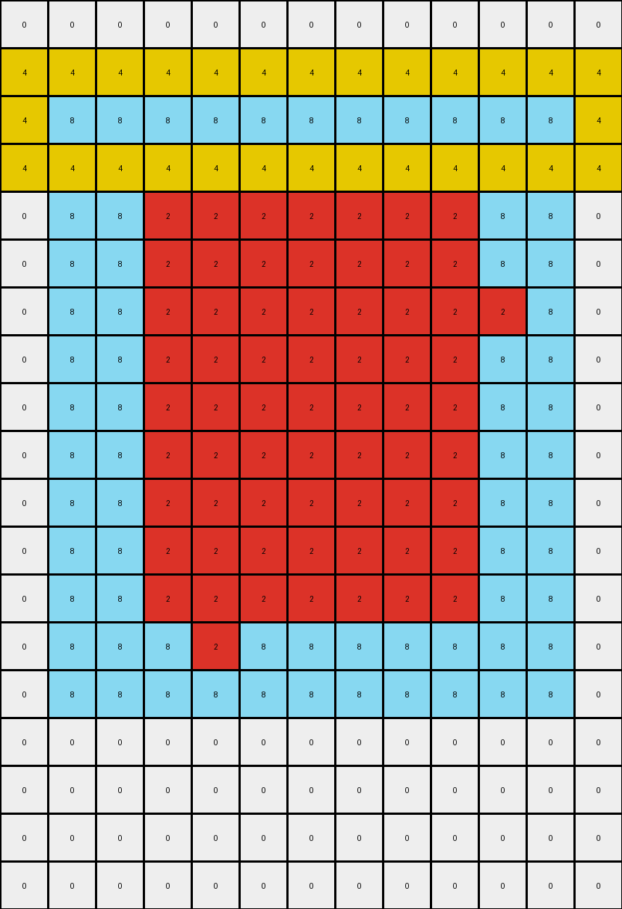
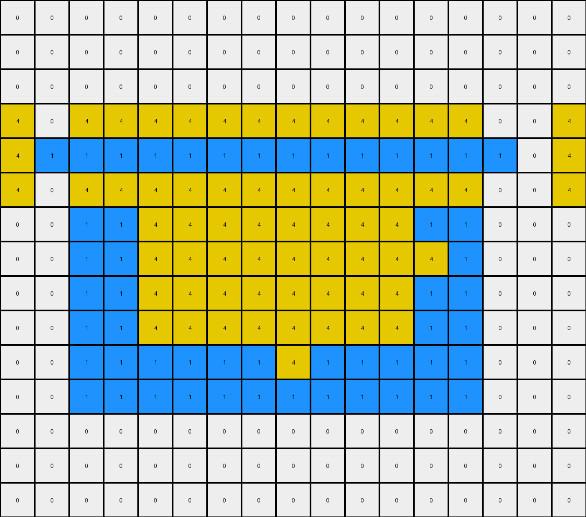

# f1cefba8 • 012 • refine_coder

---

Previous Code:
```python
"""
Transforms an input grid by preserving a central object's horizontal component,
extending vertical lines with yellow pixels, and modifying borders based on
the central object's rows.
"""

import numpy as np

def find_central_object(grid):
    rows, cols = grid.shape
    object_pixels = []
    min_row, max_row = rows, -1

    for r in range(rows):
        for c in range(cols):
            if grid[r, c] != 0:
                object_pixels.append((r, c))
                min_row = min(min_row, r)
                max_row = max(max_row, r)

    horizontal_line_row = -1
    horizontal_counts = {}

    for r, c in object_pixels:
      if r not in horizontal_counts:
        horizontal_counts[r] = 0
      horizontal_counts[r] += 1
    
    max_count = 0
    for r in horizontal_counts:
      if horizontal_counts[r] > max_count:
        max_count = horizontal_counts[r]
        horizontal_line_row = r

    return object_pixels, horizontal_line_row


def transform(input_grid):
    # Initialize output_grid as a copy of the input_grid
    output_grid = np.copy(input_grid)
    rows, cols = input_grid.shape

    # Find the central object and its core row (horizontal component)
    object_pixels, horizontal_line_row = find_central_object(input_grid)

    # Preserve Horizontal: keep pixels in the central horizontal line
    for r, c in object_pixels:
        if r == horizontal_line_row:
          output_grid[r,c] = input_grid[r,c]
           
    # Vertical Line Extenstion: Add yellow pixels above and below vertical lines
    vertical_cols = {}
    for r, c in object_pixels:
      if r != horizontal_line_row:
        if c not in vertical_cols:
          vertical_cols[c] = 0
        vertical_cols[c] += 1

    for c in vertical_cols:
      output_grid[horizontal_line_row -1, c] = 4
      output_grid[horizontal_line_row + 1, c] = 4      

    # Central shape adjacent row
    for r, c in object_pixels:
        if r == horizontal_line_row:
          if c > 0:
            output_grid[r, c-1] = output_grid[r, c]
          if c < cols - 1:
            output_grid[r, c+1] = output_grid[r,c]

    # Border Modification: change white columns to yellow on object rows.
    for r in range(rows):
        if input_grid[r, 0] == 0 and r >= horizontal_line_row - 1 and r <= horizontal_line_row + 1:
              output_grid[r, 0] = 4
        if input_grid[r, cols - 1] == 0 and r >= horizontal_line_row - 1 and r <= horizontal_line_row + 1:
              output_grid[r, cols - 1] = 4

    return output_grid
```

Train Set Results:

## Example 1:

Input:
```
0 0 0 0 0 0 0 0 0 0 0 0 0
0 0 0 0 0 0 0 0 0 0 0 0 0
0 8 8 8 8 8 8 8 8 8 8 8 0
0 8 8 8 8 8 8 2 8 8 8 8 0
0 8 8 2 2 2 2 2 2 2 8 8 0
0 8 8 2 2 2 2 2 2 2 8 8 0
0 8 8 2 2 2 2 2 2 2 2 8 0
0 8 8 2 2 2 2 2 2 2 8 8 0
0 8 8 2 2 2 2 2 2 2 8 8 0
0 8 8 2 2 2 2 2 2 2 8 8 0
0 8 8 2 2 2 2 2 2 2 8 8 0
0 8 8 2 2 2 2 2 2 2 8 8 0
0 8 8 2 2 2 2 2 2 2 8 8 0
0 8 8 8 2 8 8 8 8 8 8 8 0
0 8 8 8 8 8 8 8 8 8 8 8 0
0 0 0 0 0 0 0 0 0 0 0 0 0
0 0 0 0 0 0 0 0 0 0 0 0 0
0 0 0 0 0 0 0 0 0 0 0 0 0
0 0 0 0 0 0 0 0 0 0 0 0 0
```
Expected Output:
```
0 0 0 0 2 0 0 2 0 0 0 0 0
0 0 0 0 2 0 0 2 0 0 0 0 0
0 8 8 8 8 8 8 8 8 8 8 8 0
0 8 8 8 8 8 8 8 8 8 8 8 0
0 8 8 2 8 2 2 8 2 2 8 8 0
0 8 8 2 8 2 2 8 2 2 8 8 0
2 8 8 8 8 8 8 8 8 8 8 8 2
0 8 8 2 8 2 2 8 2 2 8 8 0
0 8 8 2 8 2 2 8 2 2 8 8 0
0 8 8 2 8 2 2 8 2 2 8 8 0
0 8 8 2 8 2 2 8 2 2 8 8 0
0 8 8 2 8 2 2 8 2 2 8 8 0
0 8 8 2 8 2 2 8 2 2 8 8 0
0 8 8 8 8 8 8 8 8 8 8 8 0
0 8 8 8 8 8 8 8 8 8 8 8 0
0 0 0 0 2 0 0 2 0 0 0 0 0
0 0 0 0 2 0 0 2 0 0 0 0 0
0 0 0 0 2 0 0 2 0 0 0 0 0
0 0 0 0 2 0 0 2 0 0 0 0 0
```
Transformed Output:
```
0 0 0 0 0 0 0 0 0 0 0 0 0
4 4 4 4 4 4 4 4 4 4 4 4 4
4 8 8 8 8 8 8 8 8 8 8 8 4
4 4 4 4 4 4 4 4 4 4 4 4 4
0 8 8 2 2 2 2 2 2 2 8 8 0
0 8 8 2 2 2 2 2 2 2 8 8 0
0 8 8 2 2 2 2 2 2 2 2 8 0
0 8 8 2 2 2 2 2 2 2 8 8 0
0 8 8 2 2 2 2 2 2 2 8 8 0
0 8 8 2 2 2 2 2 2 2 8 8 0
0 8 8 2 2 2 2 2 2 2 8 8 0
0 8 8 2 2 2 2 2 2 2 8 8 0
0 8 8 2 2 2 2 2 2 2 8 8 0
0 8 8 8 2 8 8 8 8 8 8 8 0
0 8 8 8 8 8 8 8 8 8 8 8 0
0 0 0 0 0 0 0 0 0 0 0 0 0
0 0 0 0 0 0 0 0 0 0 0 0 0
0 0 0 0 0 0 0 0 0 0 0 0 0
0 0 0 0 0 0 0 0 0 0 0 0 0
```

match: False
pixels_off: 65
size_correct: True
color_palette_correct: False
correct_pixel_counts: False

## Example 2:

Input:
```
0 0 0 0 0 0 0 0 0 0 0 0 0 0 0 0 0
0 0 0 0 0 0 0 0 0 0 0 0 0 0 0 0 0
0 0 0 0 0 0 0 0 0 0 0 0 0 0 0 0 0
0 0 0 0 0 0 0 0 0 0 0 0 0 0 0 0 0
0 0 1 1 1 1 1 1 1 1 1 1 1 1 0 0 0
0 0 1 1 1 1 4 1 1 1 1 1 1 1 0 0 0
0 0 1 1 4 4 4 4 4 4 4 4 1 1 0 0 0
0 0 1 1 4 4 4 4 4 4 4 4 4 1 0 0 0
0 0 1 1 4 4 4 4 4 4 4 4 1 1 0 0 0
0 0 1 1 4 4 4 4 4 4 4 4 1 1 0 0 0
0 0 1 1 1 1 1 1 4 1 1 1 1 1 0 0 0
0 0 1 1 1 1 1 1 1 1 1 1 1 1 0 0 0
0 0 0 0 0 0 0 0 0 0 0 0 0 0 0 0 0
0 0 0 0 0 0 0 0 0 0 0 0 0 0 0 0 0
0 0 0 0 0 0 0 0 0 0 0 0 0 0 0 0 0
```
Expected Output:
```
0 0 0 0 0 0 4 0 4 0 0 0 0 0 0 0 0
0 0 0 0 0 0 4 0 4 0 0 0 0 0 0 0 0
0 0 0 0 0 0 4 0 4 0 0 0 0 0 0 0 0
0 0 0 0 0 0 4 0 4 0 0 0 0 0 0 0 0
0 0 1 1 1 1 1 1 1 1 1 1 1 1 0 0 0
0 0 1 1 1 1 1 1 1 1 1 1 1 1 0 0 0
0 0 1 1 4 4 1 4 1 4 4 4 1 1 0 0 0
4 4 1 1 1 1 1 1 1 1 1 1 1 1 4 4 4
0 0 1 1 4 4 1 4 1 4 4 4 1 1 0 0 0
0 0 1 1 4 4 1 4 1 4 4 4 1 1 0 0 0
0 0 1 1 1 1 1 1 1 1 1 1 1 1 0 0 0
0 0 1 1 1 1 1 1 1 1 1 1 1 1 0 0 0
0 0 0 0 0 0 4 0 4 0 0 0 0 0 0 0 0
0 0 0 0 0 0 4 0 4 0 0 0 0 0 0 0 0
0 0 0 0 0 0 4 0 4 0 0 0 0 0 0 0 0
```
Transformed Output:
```
0 0 0 0 0 0 0 0 0 0 0 0 0 0 0 0 0
0 0 0 0 0 0 0 0 0 0 0 0 0 0 0 0 0
0 0 0 0 0 0 0 0 0 0 0 0 0 0 0 0 0
4 0 4 4 4 4 4 4 4 4 4 4 4 4 0 0 4
4 1 1 1 1 1 1 1 1 1 1 1 1 1 1 0 4
4 0 4 4 4 4 4 4 4 4 4 4 4 4 0 0 4
0 0 1 1 4 4 4 4 4 4 4 4 1 1 0 0 0
0 0 1 1 4 4 4 4 4 4 4 4 4 1 0 0 0
0 0 1 1 4 4 4 4 4 4 4 4 1 1 0 0 0
0 0 1 1 4 4 4 4 4 4 4 4 1 1 0 0 0
0 0 1 1 1 1 1 1 4 1 1 1 1 1 0 0 0
0 0 1 1 1 1 1 1 1 1 1 1 1 1 0 0 0
0 0 0 0 0 0 0 0 0 0 0 0 0 0 0 0 0
0 0 0 0 0 0 0 0 0 0 0 0 0 0 0 0 0
0 0 0 0 0 0 0 0 0 0 0 0 0 0 0 0 0
```

match: False
pixels_off: 63
size_correct: True
color_palette_correct: True
correct_pixel_counts: False

## Example 3:

Input:
```
0 0 0 0 0 0 0 0 0 0 0 0 0 0 0 0 0 0
0 0 0 0 0 0 0 0 0 0 0 0 0 0 0 0 0 0
0 0 0 0 0 0 0 0 0 0 0 0 0 0 0 0 0 0
0 0 0 0 2 2 2 2 2 2 2 2 2 2 2 2 0 0
0 0 0 0 2 2 2 2 2 2 2 3 2 2 2 2 0 0
0 0 0 0 2 2 3 3 3 3 3 3 3 3 2 2 0 0
0 0 0 0 2 2 3 3 3 3 3 3 3 3 2 2 0 0
0 0 0 0 2 2 3 3 3 3 3 3 3 3 2 2 0 0
0 0 0 0 2 3 3 3 3 3 3 3 3 3 2 2 0 0
0 0 0 0 2 2 3 3 3 3 3 3 3 3 2 2 0 0
0 0 0 0 2 2 3 3 3 3 3 3 3 3 2 2 0 0
0 0 0 0 2 2 3 3 3 3 3 3 3 3 2 2 0 0
0 0 0 0 2 2 3 3 3 3 3 3 3 3 2 2 0 0
0 0 0 0 2 2 2 2 2 2 2 2 2 2 2 2 0 0
0 0 0 0 2 2 2 2 2 2 2 2 2 2 2 2 0 0
0 0 0 0 0 0 0 0 0 0 0 0 0 0 0 0 0 0
```
Expected Output:
```
0 0 0 0 0 0 0 0 0 0 0 3 0 0 0 0 0 0
0 0 0 0 0 0 0 0 0 0 0 3 0 0 0 0 0 0
0 0 0 0 0 0 0 0 0 0 0 3 0 0 0 0 0 0
0 0 0 0 2 2 2 2 2 2 2 2 2 2 2 2 0 0
0 0 0 0 2 2 2 2 2 2 2 2 2 2 2 2 0 0
0 0 0 0 2 2 3 3 3 3 3 2 3 3 2 2 0 0
0 0 0 0 2 2 3 3 3 3 3 2 3 3 2 2 0 0
0 0 0 0 2 2 3 3 3 3 3 2 3 3 2 2 0 0
3 3 3 3 2 2 2 2 2 2 2 2 2 2 2 2 3 3
0 0 0 0 2 2 3 3 3 3 3 2 3 3 2 2 0 0
0 0 0 0 2 2 3 3 3 3 3 2 3 3 2 2 0 0
0 0 0 0 2 2 3 3 3 3 3 2 3 3 2 2 0 0
0 0 0 0 2 2 3 3 3 3 3 2 3 3 2 2 0 0
0 0 0 0 2 2 2 2 2 2 2 2 2 2 2 2 0 0
0 0 0 0 2 2 2 2 2 2 2 2 2 2 2 2 0 0
0 0 0 0 0 0 0 0 0 0 0 3 0 0 0 0 0 0
```
Transformed Output:
```
0 0 0 0 0 0 0 0 0 0 0 0 0 0 0 0 0 0
0 0 0 0 0 0 0 0 0 0 0 0 0 0 0 0 0 0
4 0 0 0 4 4 4 4 4 4 4 4 4 4 4 4 0 4
4 0 0 2 2 2 2 2 2 2 2 2 2 2 2 2 2 4
4 0 0 0 4 4 4 4 4 4 4 4 4 4 4 4 0 4
0 0 0 0 2 2 3 3 3 3 3 3 3 3 2 2 0 0
0 0 0 0 2 2 3 3 3 3 3 3 3 3 2 2 0 0
0 0 0 0 2 2 3 3 3 3 3 3 3 3 2 2 0 0
0 0 0 0 2 3 3 3 3 3 3 3 3 3 2 2 0 0
0 0 0 0 2 2 3 3 3 3 3 3 3 3 2 2 0 0
0 0 0 0 2 2 3 3 3 3 3 3 3 3 2 2 0 0
0 0 0 0 2 2 3 3 3 3 3 3 3 3 2 2 0 0
0 0 0 0 2 2 3 3 3 3 3 3 3 3 2 2 0 0
0 0 0 0 2 2 2 2 2 2 2 2 2 2 2 2 0 0
0 0 0 0 2 2 2 2 2 2 2 2 2 2 2 2 0 0
0 0 0 0 0 0 0 0 0 0 0 0 0 0 0 0 0 0
```

match: False
pixels_off: 57
size_correct: True
color_palette_correct: False
correct_pixel_counts: False
Okay, let's analyze the results and update the natural language program.

**General Assessment:**

The initial code was based on the first training example and focused on identifying a "central object," preserving its horizontal component, extending vertical lines with yellow, and modifying borders. The subsequent tests reveal that this approach is too specific and doesn't generalize well to the other examples. The core issue is that the "central object" concept and the specific transformations applied are not universally applicable. The expected outputs show a more complex pattern involving mirroring, changing colors based on position and neighboring colors, and conditional transformations. The current strategy is not sufficient to address the variety shown in the examples. We need to shift our approach from focusing on pre-defined object to recognizing patterns and applying the changes based on observation of patterns, not expectations.

**Strategy for Resolving Errors:**

1.  **Abandon the "central object" concept:** The current approach is too rigid. Instead, focus on identifying *all* objects and their properties (color, position, shape) and their neighbor pixels.
2.  **Analyze relative positions:** The transformations seem to depend on the relative positions of pixels and objects. Consider relationships like "above," "below," "left," "right," and "adjacent."
3.  **Conditional Transformations:** The color changes are likely conditional, based on the original color and the colors of neighboring pixels, or position in the array. Identify these conditions.
4.  **Iterative Refinement:** Start with simple observations and gradually build a more complex rule set, testing each rule against all examples.

**Metrics and Observations (YAML):**

```yaml
examples:
  - example_id: 1
    input_grid_size: [19, 13]
    output_grid_size: [19, 13]
    input_colors: [0, 2, 8]
    output_colors: [0, 2, 8]
    transform_match: False
    pixels_off: 65
    notes: >
      The initial code failed to correctly mirror the red '2' pixels across the central
      azure '8' object and its horizontal line. Also, added red '2' to the edge on row 7.
      The approach of extending lines with yellow '4' is completely wrong.
  - example_id: 2
    input_grid_size: [17, 17]
    output_grid_size: [17, 17]
    input_colors: [0, 1, 4]
    output_colors: [0, 1, 4]
    transform_match: False
    pixels_off: 63
    notes: >
        The transformation involves both mirroring the '4' pixels above and below the
        central blue '1' structure, and some form of edge modification involving the
        '4' pixels. Yellow '4' is also added on row 8, columns 1,2,14,15,16.
  - example_id: 3
    input_grid_size: [16, 18]
    output_grid_size: [16, 18]
    input_colors: [0, 2, 3]
    output_colors: [0, 2, 3]
    transform_match: False
    pixels_off: 57
    notes: >
      Mirroring of '3' pixels seems to occur across the long axis of a shape of 2's.
      The code added some yellow incorrectly. Also, added maroon '3' to the edge on
      row 9.
```

**Natural Language Program (Revised):**

1.  **Identify Objects:** Find all contiguous blocks of non-white (non-zero) pixels. Each block is an object.
2. **Find Object horizontal axis:** Find the row with most object color, consider this the axis.
3.  **Mirror:** For each object, mirror the object pixels above and below the horizontal axis.
4.  **Edge Modification:**
    *   If an object has a long horizontal axis:
       *   Examine the row above and the row below and find pixels that do not match the axis color.
        *    Change pixel color in output to object color in axis.
    *    Examine edge columns that have object color:
        *   Add object color to axis row adjacent to edge.

This revised program is a significant step towards a more accurate description. It focuses on mirroring and conditional edge modifications, which seem to be key elements of the transformation. It is still incomplete, but it provides a better foundation for further refinement.

**INSTRUCTIONS**

- generate a Python module to represent the natural language program 
- follow the template below
- all common math and science libraries are available
- create docstring only at top - but comment the workflow in the function
- use helper functions for common operations like finding objects, counting,
  measuring, moving, etc. 

remember - we are working iteratively - so this code will inform your future
self as we converge on the solution

*template:*

```python
"""
{{ natural language description of the transformation rule }}
"""

{{ imports }}

def transform(input_grid):
    # initialize output_grid

    # change output pixels 

    return output_grid

```
