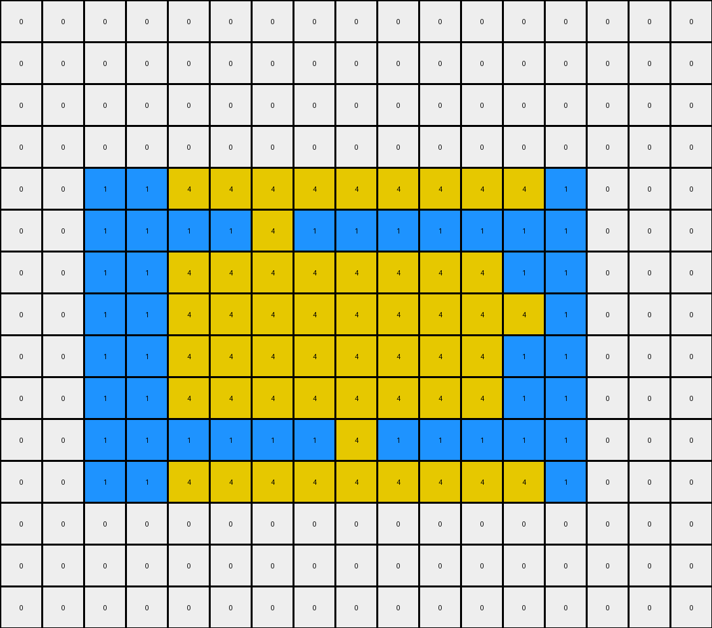
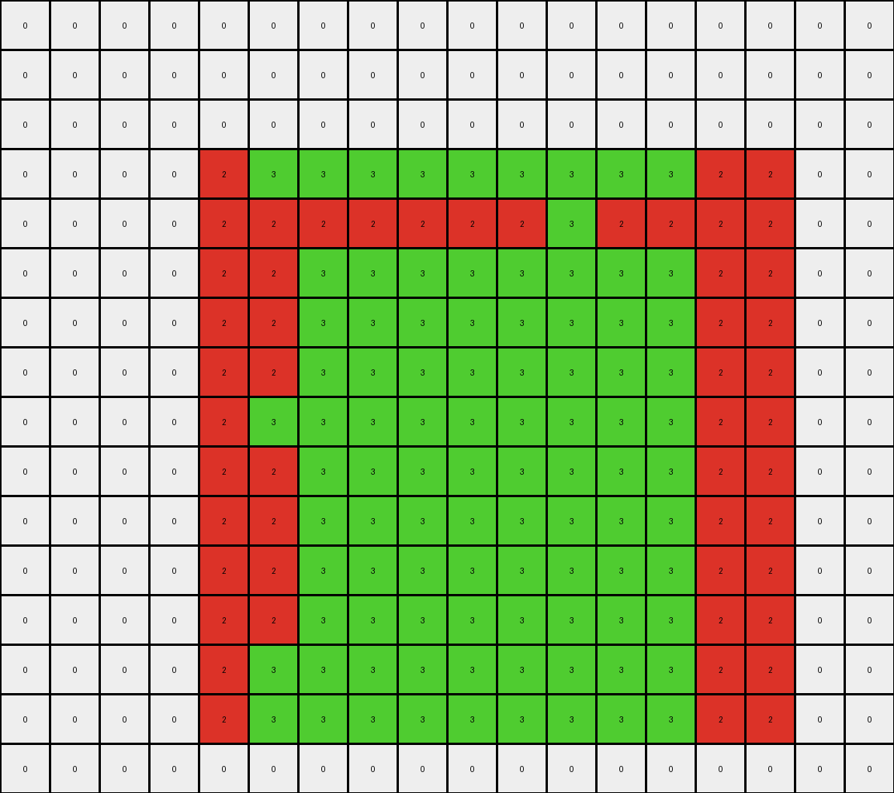

# f1cefba8 • 018 • refine_coder

---

Previous Code:
```python
"""
The transformation involves identifying an outer rectangle and a smaller, inner rectangle of a different color.
The inner rectangle's color "creeps" vertically, replacing the color of the outer rectangle, until the inner shape
fills the available space within the outer rectangle's boundaries, or reaches the edge of the grid.
"""

import numpy as np

def find_object(grid, colors):
    """Finds the bounding box of an object with a specific color."""
    for color in colors:
        rows, cols = np.where(grid == color)
        if len(rows) > 0:
            min_row, max_row = np.min(rows), np.max(rows)
            min_col, max_col = np.min(cols), np.max(cols)
            return (min_row, min_col), (max_row, max_col), color  # Return color too
    return None, None, None

def get_central_column(top_left, bottom_right):
    """Calculates the central column index."""
    _, min_col = top_left
    _, max_col = bottom_right
    central_col = (min_col + max_col) // 2
    return central_col

def creeping(grid, inner_top_left, inner_bottom_right, outer_top_left, outer_bottom_right, inner_color):
    """Expands the inner object vertically within the outer object's bounds."""
    output_grid = np.copy(grid)
    inner_min_row, inner_min_col = inner_top_left
    inner_max_row, inner_max_col = inner_bottom_right
    outer_min_row, outer_min_col = outer_top_left
    outer_max_row, outer_max_col = outer_bottom_right

    # iterate over each column in the inner rectangle
    for col in range(inner_min_col, inner_max_col + 1):
       # creep up
       for row in range(inner_min_row - 1, -1, -1):
           if row >= outer_min_row:
               if output_grid[row,col] != 0:
                 output_grid[row, col] = inner_color
           else:
              break
       # creep down
       for row in range(inner_max_row + 1, grid.shape[0]):
            if row <= outer_max_row:
               if output_grid[row,col] != 0:
                   output_grid[row,col] = inner_color
            else:
               break
    return output_grid

def transform(input_grid):
    # Initialize output grid as a copy of the input grid
    output_grid = np.copy(input_grid)

    # Define potential outer and inner colors
    outer_colors = [2, 1]  # Red, Blue
    inner_colors = [3, 4]  # Green, Yellow

    # Find the outer and inner rectangles
    outer_top_left, outer_bottom_right, outer_color = find_object(input_grid, outer_colors)
    inner_top_left, inner_bottom_right, inner_color = find_object(input_grid, inner_colors)
    if outer_color is None or inner_color is None:
        return output_grid

    
    # Perform creeping
    output_grid = creeping(output_grid, inner_top_left, inner_bottom_right, outer_top_left, outer_bottom_right, inner_color)

    return output_grid
```

Train Set Results:

## Example 1:

Input:
```
0 0 0 0 0 0 0 0 0 0 0 0 0
0 0 0 0 0 0 0 0 0 0 0 0 0
0 8 8 8 8 8 8 8 8 8 8 8 0
0 8 8 8 8 8 8 2 8 8 8 8 0
0 8 8 2 2 2 2 2 2 2 8 8 0
0 8 8 2 2 2 2 2 2 2 8 8 0
0 8 8 2 2 2 2 2 2 2 2 8 0
0 8 8 2 2 2 2 2 2 2 8 8 0
0 8 8 2 2 2 2 2 2 2 8 8 0
0 8 8 2 2 2 2 2 2 2 8 8 0
0 8 8 2 2 2 2 2 2 2 8 8 0
0 8 8 2 2 2 2 2 2 2 8 8 0
0 8 8 2 2 2 2 2 2 2 8 8 0
0 8 8 8 2 8 8 8 8 8 8 8 0
0 8 8 8 8 8 8 8 8 8 8 8 0
0 0 0 0 0 0 0 0 0 0 0 0 0
0 0 0 0 0 0 0 0 0 0 0 0 0
0 0 0 0 0 0 0 0 0 0 0 0 0
0 0 0 0 0 0 0 0 0 0 0 0 0
```
Expected Output:
```
0 0 0 0 2 0 0 2 0 0 0 0 0
0 0 0 0 2 0 0 2 0 0 0 0 0
0 8 8 8 8 8 8 8 8 8 8 8 0
0 8 8 8 8 8 8 8 8 8 8 8 0
0 8 8 2 8 2 2 8 2 2 8 8 0
0 8 8 2 8 2 2 8 2 2 8 8 0
2 8 8 8 8 8 8 8 8 8 8 8 2
0 8 8 2 8 2 2 8 2 2 8 8 0
0 8 8 2 8 2 2 8 2 2 8 8 0
0 8 8 2 8 2 2 8 2 2 8 8 0
0 8 8 2 8 2 2 8 2 2 8 8 0
0 8 8 2 8 2 2 8 2 2 8 8 0
0 8 8 2 8 2 2 8 2 2 8 8 0
0 8 8 8 8 8 8 8 8 8 8 8 0
0 8 8 8 8 8 8 8 8 8 8 8 0
0 0 0 0 2 0 0 2 0 0 0 0 0
0 0 0 0 2 0 0 2 0 0 0 0 0
0 0 0 0 2 0 0 2 0 0 0 0 0
0 0 0 0 2 0 0 2 0 0 0 0 0
```
Transformed Output:
```
0 0 0 0 0 0 0 0 0 0 0 0 0
0 0 0 0 0 0 0 0 0 0 0 0 0
0 8 8 8 8 8 8 8 8 8 8 8 0
0 8 8 8 8 8 8 2 8 8 8 8 0
0 8 8 2 2 2 2 2 2 2 8 8 0
0 8 8 2 2 2 2 2 2 2 8 8 0
0 8 8 2 2 2 2 2 2 2 2 8 0
0 8 8 2 2 2 2 2 2 2 8 8 0
0 8 8 2 2 2 2 2 2 2 8 8 0
0 8 8 2 2 2 2 2 2 2 8 8 0
0 8 8 2 2 2 2 2 2 2 8 8 0
0 8 8 2 2 2 2 2 2 2 8 8 0
0 8 8 2 2 2 2 2 2 2 8 8 0
0 8 8 8 2 8 8 8 8 8 8 8 0
0 8 8 8 8 8 8 8 8 8 8 8 0
0 0 0 0 0 0 0 0 0 0 0 0 0
0 0 0 0 0 0 0 0 0 0 0 0 0
0 0 0 0 0 0 0 0 0 0 0 0 0
0 0 0 0 0 0 0 0 0 0 0 0 0
```

match: False
pixels_off: 40
size_correct: True
color_palette_correct: True
correct_pixel_counts: False

## Example 2:

Input:
```
0 0 0 0 0 0 0 0 0 0 0 0 0 0 0 0 0
0 0 0 0 0 0 0 0 0 0 0 0 0 0 0 0 0
0 0 0 0 0 0 0 0 0 0 0 0 0 0 0 0 0
0 0 0 0 0 0 0 0 0 0 0 0 0 0 0 0 0
0 0 1 1 1 1 1 1 1 1 1 1 1 1 0 0 0
0 0 1 1 1 1 4 1 1 1 1 1 1 1 0 0 0
0 0 1 1 4 4 4 4 4 4 4 4 1 1 0 0 0
0 0 1 1 4 4 4 4 4 4 4 4 4 1 0 0 0
0 0 1 1 4 4 4 4 4 4 4 4 1 1 0 0 0
0 0 1 1 4 4 4 4 4 4 4 4 1 1 0 0 0
0 0 1 1 1 1 1 1 4 1 1 1 1 1 0 0 0
0 0 1 1 1 1 1 1 1 1 1 1 1 1 0 0 0
0 0 0 0 0 0 0 0 0 0 0 0 0 0 0 0 0
0 0 0 0 0 0 0 0 0 0 0 0 0 0 0 0 0
0 0 0 0 0 0 0 0 0 0 0 0 0 0 0 0 0
```
Expected Output:
```
0 0 0 0 0 0 4 0 4 0 0 0 0 0 0 0 0
0 0 0 0 0 0 4 0 4 0 0 0 0 0 0 0 0
0 0 0 0 0 0 4 0 4 0 0 0 0 0 0 0 0
0 0 0 0 0 0 4 0 4 0 0 0 0 0 0 0 0
0 0 1 1 1 1 1 1 1 1 1 1 1 1 0 0 0
0 0 1 1 1 1 1 1 1 1 1 1 1 1 0 0 0
0 0 1 1 4 4 1 4 1 4 4 4 1 1 0 0 0
4 4 1 1 1 1 1 1 1 1 1 1 1 1 4 4 4
0 0 1 1 4 4 1 4 1 4 4 4 1 1 0 0 0
0 0 1 1 4 4 1 4 1 4 4 4 1 1 0 0 0
0 0 1 1 1 1 1 1 1 1 1 1 1 1 0 0 0
0 0 1 1 1 1 1 1 1 1 1 1 1 1 0 0 0
0 0 0 0 0 0 4 0 4 0 0 0 0 0 0 0 0
0 0 0 0 0 0 4 0 4 0 0 0 0 0 0 0 0
0 0 0 0 0 0 4 0 4 0 0 0 0 0 0 0 0
```
Transformed Output:
```
0 0 0 0 0 0 0 0 0 0 0 0 0 0 0 0 0
0 0 0 0 0 0 0 0 0 0 0 0 0 0 0 0 0
0 0 0 0 0 0 0 0 0 0 0 0 0 0 0 0 0
0 0 0 0 0 0 0 0 0 0 0 0 0 0 0 0 0
0 0 1 1 4 4 4 4 4 4 4 4 4 1 0 0 0
0 0 1 1 1 1 4 1 1 1 1 1 1 1 0 0 0
0 0 1 1 4 4 4 4 4 4 4 4 1 1 0 0 0
0 0 1 1 4 4 4 4 4 4 4 4 4 1 0 0 0
0 0 1 1 4 4 4 4 4 4 4 4 1 1 0 0 0
0 0 1 1 4 4 4 4 4 4 4 4 1 1 0 0 0
0 0 1 1 1 1 1 1 4 1 1 1 1 1 0 0 0
0 0 1 1 4 4 4 4 4 4 4 4 4 1 0 0 0
0 0 0 0 0 0 0 0 0 0 0 0 0 0 0 0 0
0 0 0 0 0 0 0 0 0 0 0 0 0 0 0 0 0
0 0 0 0 0 0 0 0 0 0 0 0 0 0 0 0 0
```

match: False
pixels_off: 54
size_correct: True
color_palette_correct: True
correct_pixel_counts: False

## Example 3:

Input:
```
0 0 0 0 0 0 0 0 0 0 0 0 0 0 0 0 0 0
0 0 0 0 0 0 0 0 0 0 0 0 0 0 0 0 0 0
0 0 0 0 0 0 0 0 0 0 0 0 0 0 0 0 0 0
0 0 0 0 2 2 2 2 2 2 2 2 2 2 2 2 0 0
0 0 0 0 2 2 2 2 2 2 2 3 2 2 2 2 0 0
0 0 0 0 2 2 3 3 3 3 3 3 3 3 2 2 0 0
0 0 0 0 2 2 3 3 3 3 3 3 3 3 2 2 0 0
0 0 0 0 2 2 3 3 3 3 3 3 3 3 2 2 0 0
0 0 0 0 2 3 3 3 3 3 3 3 3 3 2 2 0 0
0 0 0 0 2 2 3 3 3 3 3 3 3 3 2 2 0 0
0 0 0 0 2 2 3 3 3 3 3 3 3 3 2 2 0 0
0 0 0 0 2 2 3 3 3 3 3 3 3 3 2 2 0 0
0 0 0 0 2 2 3 3 3 3 3 3 3 3 2 2 0 0
0 0 0 0 2 2 2 2 2 2 2 2 2 2 2 2 0 0
0 0 0 0 2 2 2 2 2 2 2 2 2 2 2 2 0 0
0 0 0 0 0 0 0 0 0 0 0 0 0 0 0 0 0 0
```
Expected Output:
```
0 0 0 0 0 0 0 0 0 0 0 3 0 0 0 0 0 0
0 0 0 0 0 0 0 0 0 0 0 3 0 0 0 0 0 0
0 0 0 0 0 0 0 0 0 0 0 3 0 0 0 0 0 0
0 0 0 0 2 2 2 2 2 2 2 2 2 2 2 2 0 0
0 0 0 0 2 2 2 2 2 2 2 2 2 2 2 2 0 0
0 0 0 0 2 2 3 3 3 3 3 2 3 3 2 2 0 0
0 0 0 0 2 2 3 3 3 3 3 2 3 3 2 2 0 0
0 0 0 0 2 2 3 3 3 3 3 2 3 3 2 2 0 0
3 3 3 3 2 2 2 2 2 2 2 2 2 2 2 2 3 3
0 0 0 0 2 2 3 3 3 3 3 2 3 3 2 2 0 0
0 0 0 0 2 2 3 3 3 3 3 2 3 3 2 2 0 0
0 0 0 0 2 2 3 3 3 3 3 2 3 3 2 2 0 0
0 0 0 0 2 2 3 3 3 3 3 2 3 3 2 2 0 0
0 0 0 0 2 2 2 2 2 2 2 2 2 2 2 2 0 0
0 0 0 0 2 2 2 2 2 2 2 2 2 2 2 2 0 0
0 0 0 0 0 0 0 0 0 0 0 3 0 0 0 0 0 0
```
Transformed Output:
```
0 0 0 0 0 0 0 0 0 0 0 0 0 0 0 0 0 0
0 0 0 0 0 0 0 0 0 0 0 0 0 0 0 0 0 0
0 0 0 0 0 0 0 0 0 0 0 0 0 0 0 0 0 0
0 0 0 0 2 3 3 3 3 3 3 3 3 3 2 2 0 0
0 0 0 0 2 2 2 2 2 2 2 3 2 2 2 2 0 0
0 0 0 0 2 2 3 3 3 3 3 3 3 3 2 2 0 0
0 0 0 0 2 2 3 3 3 3 3 3 3 3 2 2 0 0
0 0 0 0 2 2 3 3 3 3 3 3 3 3 2 2 0 0
0 0 0 0 2 3 3 3 3 3 3 3 3 3 2 2 0 0
0 0 0 0 2 2 3 3 3 3 3 3 3 3 2 2 0 0
0 0 0 0 2 2 3 3 3 3 3 3 3 3 2 2 0 0
0 0 0 0 2 2 3 3 3 3 3 3 3 3 2 2 0 0
0 0 0 0 2 2 3 3 3 3 3 3 3 3 2 2 0 0
0 0 0 0 2 3 3 3 3 3 3 3 3 3 2 2 0 0
0 0 0 0 2 3 3 3 3 3 3 3 3 3 2 2 0 0
0 0 0 0 0 0 0 0 0 0 0 0 0 0 0 0 0 0
```

match: False
pixels_off: 54
size_correct: True
color_palette_correct: True
correct_pixel_counts: False
Okay, let's analyze the results of the provided code and refine the natural language program accordingly.

**General Assessment and Strategy**

The initial natural language program and the derived code focused on a "creeping" mechanism where an inner rectangle's color expands vertically. However, the test results on the three training examples show a significant mismatch between the expected and transformed outputs. The code's creeping logic only moves upwards and downwards and doesn't handle diagonal expansion, nor it correctly identifies the boundaries in several cases.

The core issue seems to be an oversimplification of the transformation rule. It's not just simple vertical creeping. It is a more complex form of expansion, that looks like the following steps:

1.  **Identify Inner and Outer Objects:** Find two distinct rectangular objects, defined by different colors. It appears, in cases of multiple "inner" objects of the same color, they are treated as one object when they share a side.
2.  **Expansion, Not Just Creeping:** The inner object's color doesn't just "creep" vertically. It expands, seemingly replacing the color of any non-black, non-background pixel of the outer object, *within* the bounding box of the combined area of the inner and outer.
3. **Color Specificity** There's a clear color replacement, not a general "fill". The code also has potential color issues in the selection process, as shown by the errors and mismatch.
4. **Object selection:** The code does not accurately select the "inner" object if there are multiple candidates.

To correct the errors, we need a strategy that focuses on:

1.  **Improved Object Identification:** Accurately identify the "inner" and "outer" objects, even when multiple objects of the same "inner" color exist.
2.  **Bounding Box Expansion:** Instead of simple creeping, determine a combined bounding box including both inner and outer and perform the color change to fill.
3.  **Precise Color Replacement:** Ensure we are replacing only the outer object's color with the inner object's color.
4.  **Color Priority:** Accurately map the Input to the output colors.

**Metrics and Observations**

Here's a breakdown of each example, highlighting key observations:

**Example 1:**

*   **Input:** An outer azure rectangle with an inner red rectangle.
*   **Expected Output:** The red expands to fill most of the azure rectangle, leaving a border of azure, and also "fills" the background black pixels that were touching the initial position of the red rectangle.
*   **Transformed Output:** The code failed to expand the red color correctly, only showing vertical creep. The transformed image is identical to the input.
*   **Issues:** Incorrect expansion logic, failure to handle diagonal expansion.

**Example 2:**

*   **Input:** An outer blue rectangle with an inner yellow rectangle.
*   **Expected Output:** The yellow expands significantly, following a more complex pattern than vertical creeping. It also replaces the black that was touching the initial yellow.
*   **Transformed Output:** Only minimal vertical expansion of the yellow.
*   **Issues:** Similar to Example 1, the expansion is insufficient and doesn't handle the complex spreading.

**Example 3:**

*   **Input:** Outer red rectangle containing an inner green object.
*   **Expected Output:** Complex expansion of the green, including some areas outside the initial vertical bounds.
*   **Transformed Output:** Incorrect expansion, with the green color not spreading as expected, and also missing areas of the inner shape itself.
*   **Issues:** Expansion logic failure, likely related to how the boundaries and connected components are handled.

**YAML Facts**

```yaml
examples:
  - example_id: 1
    outer_object:
      color: azure (8)
      shape: rectangle
    inner_object:
      color: red (2)
      shape: rectangle
    transformation:
      type: expansion
      inner_color_replaces: [azure, black]
      constraints: bounding box of combined inner and outer

  - example_id: 2
    outer_object:
      color: blue (1)
      shape: rectangle
    inner_object:
      color: yellow (4)
      shape: rectangle
    transformation:
      type: expansion
      inner_color_replaces: [blue, black]
      constraints: bounding box of combined inner and outer

  - example_id: 3
    outer_object:
      color: red (2)
      shape: rectangle
    inner_object:
      color: green (3)
      shape: rectangle
    transformation:
      type: expansion
      inner_color_replaces: [red, black]
      constraints: bounding box of combined inner and outer
```

**Natural Language Program**

1.  **Identify Objects:** Find two distinct rectangular objects within the grid. The "outer" object is typically a larger rectangle of one color (e.g., azure, blue, or red in the examples). The "inner" object is a smaller rectangle of a different color (e.g., red, yellow, or green). If there are multiple, disconnected objects with the "inner" color, treat all of them as one object, if they are on the same row or column.

2.  **Determine Combined Bounding Box:** Calculate the bounding box that encompasses *both* the inner and outer objects. This is the overall region of interest.

3.  **Color Replacement (Expansion):** Within the combined bounding box:
    *   If a pixel is part of the background (color 0) AND it shares a side or a corner with the inner object, change its color to the inner object's color.
    *   If a pixel is the outer object color AND it is *not* outside of the combined bounding box, change the pixel to the color of the inner object.

4. **Preserve other colors:** Don't change any color outside of the bounding box.

In simple terms: The inner object's color expands to fill the outer object completely within a combined bounding box, replacing the outer's color. Any background pixels that were adjacent (side or corner) to the inner are also filled by the inner color.

**INSTRUCTIONS**

- generate a Python module to represent the natural language program 
- follow the template below
- all common math and science libraries are available
- create docstring only at top - but comment the workflow in the function
- use helper functions for common operations like finding objects, counting,
  measuring, moving, etc. 

remember - we are working iteratively - so this code will inform your future
self as we converge on the solution

*template:*

```python
"""
{{ natural language description of the transformation rule }}
"""

{{ imports }}

def transform(input_grid):
    # initialize output_grid

    # change output pixels 

    return output_grid

```
