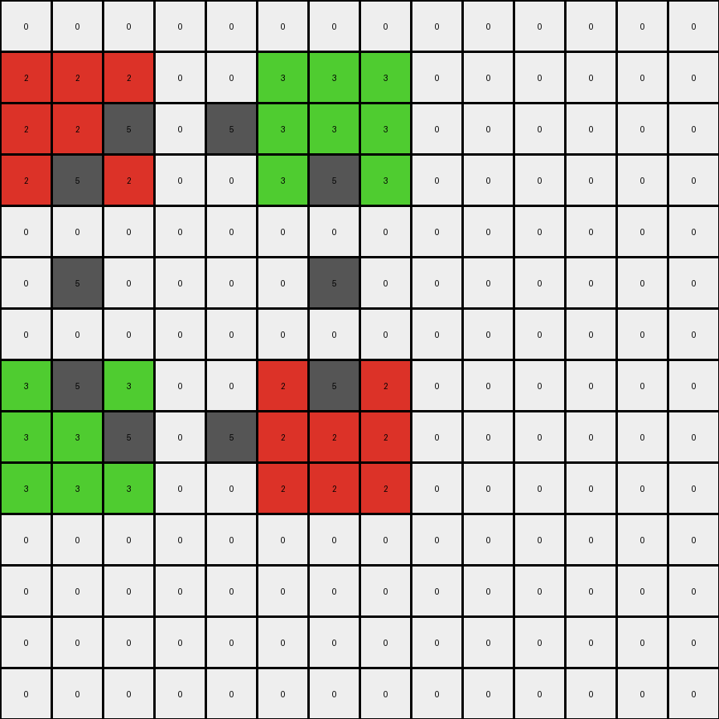
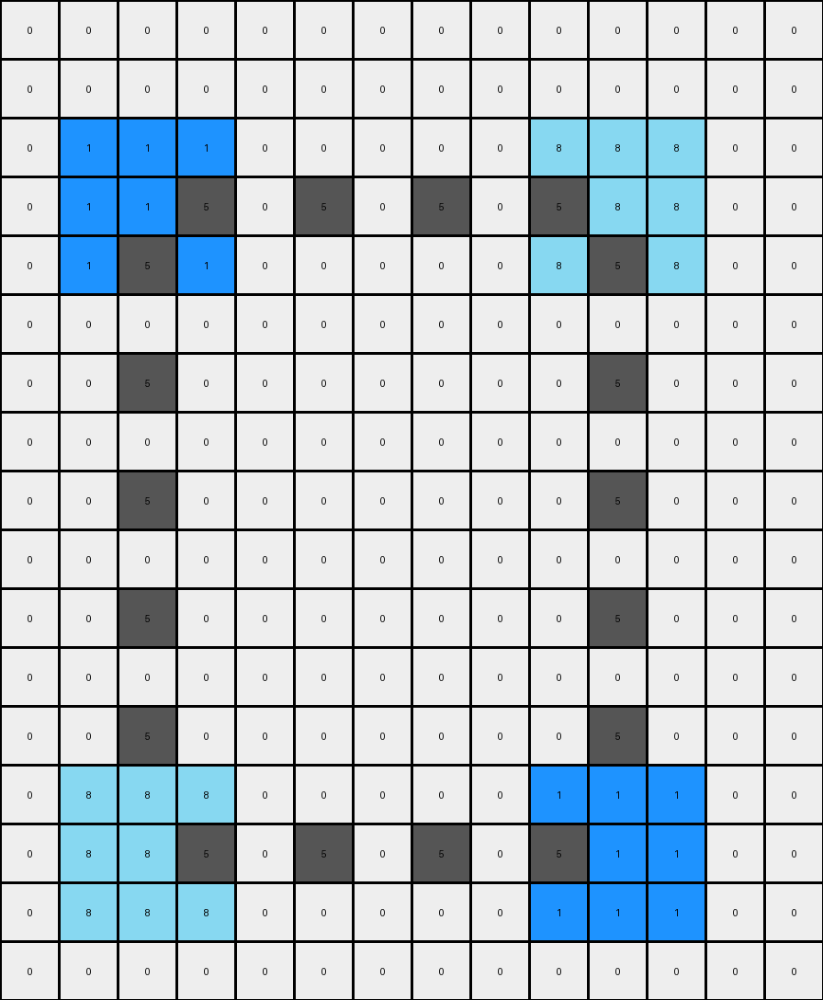
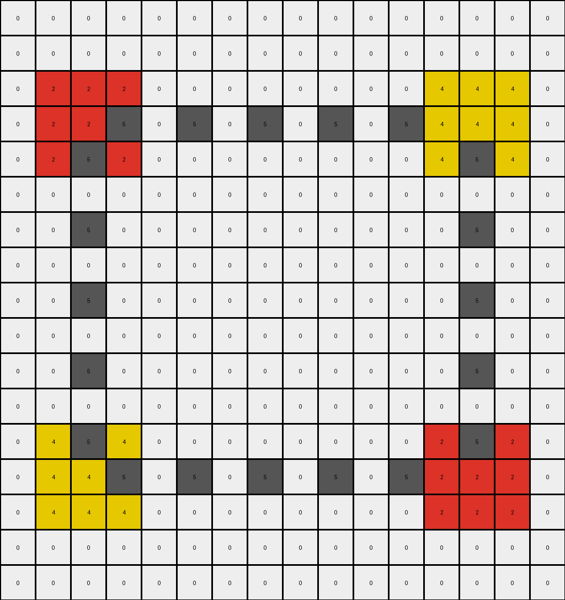
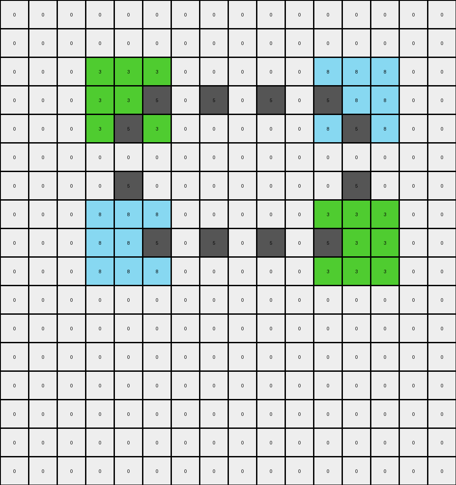

# f35d900a • 024 • refine_coder

---

Previous Code:
```python
"""
1.  **Identify Single Pixels:** Find all pixels in the input grid that have a color other than white (0) and are surrounded by white pixels (0) or the grid boundary. These are the "single pixels."
2.  **Expand to 3x3 Squares:** For each identified single pixel, create a 3x3 square of the same color centered on the original pixel's location in the output grid.
3.  **Connect with Gray Lines:** For every pair of single pixels in the *input grid* that are aligned either horizontally or vertically, draw a line of gray (5) pixels between their corresponding 3x3 squares in the output grid.
    *   The connecting gray line is placed in the output grid such that gray pixels replace output pixels that are on the same row or column as the original single input pixels, and the alternating gray pattern starts from the single pixel position.
"""

import numpy as np

def find_single_pixels(grid):
    # Find single pixels of non-white color
    single_pixels = []
    rows, cols = grid.shape
    for r in range(rows):
        for c in range(cols):
            if grid[r, c] != 0:
                is_single = True
                for i in range(-1, 2):
                    for j in range(-1, 2):
                        if (i != 0 or j != 0) and 0 <= r + i < rows and 0 <= c + j < cols:
                            if grid[r + i, c + j] != 0:
                                is_single = False
                                break
                    if not is_single:
                        break
                if is_single:
                    single_pixels.append((r, c, grid[r, c]))
    return single_pixels

def expand_to_square(grid, r, c, color):
    # Expand a single pixel to a 3x3 square
    for i in range(-1, 2):
        for j in range(-1, 2):
            if 0 <= r + i < grid.shape[0] and 0 <= c + j < grid.shape[1]:
                grid[r + i, c + j] = color

def connect_with_gray_lines(output_grid, input_pixel1, input_pixel2):
    # Connect two 3x3 squares with gray lines based on original input pixel positions
    r1, c1, color1 = input_pixel1
    r2, c2, color2 = input_pixel2

    if r1 == r2:  # Horizontal connection
        start_col = min(c1, c2)
        end_col = max(c1, c2)
        for c in range(start_col+1, end_col):
            if (c - start_col) % 2 == 1:
                output_grid[r1, c] = 5

    elif c1 == c2:  # Vertical connection
        start_row = min(r1, r2)
        end_row = max(r1, r2)

        for r in range(start_row + 1, end_row):

            if (r - start_row) % 2 == 1:
                output_grid[r, c1] = 5


def transform(input_grid):
    # Initialize output_grid as a copy of the input_grid
    output_grid = np.copy(input_grid)

    # 1. Find single pixels in the input grid
    input_single_pixels = find_single_pixels(input_grid)

    # 2. Expand single pixels to 3x3 squares in the output grid
    for r, c, color in input_single_pixels:
        expand_to_square(output_grid, r, c, color)

    # 3. Connect squares with gray lines based on input single pixel positions
    for i in range(len(input_single_pixels)):
        for j in range(i + 1, len(input_single_pixels)):
            # Check for horizontal or vertical alignment in the input grid
            if input_single_pixels[i][0] == input_single_pixels[j][0] or \
               input_single_pixels[i][1] == input_single_pixels[j][1]:
                connect_with_gray_lines(output_grid, input_single_pixels[i], input_single_pixels[j])

    return output_grid
```

Train Set Results:

## Example 1:

Input:
```
0 0 0 0 0 0 0 0 0 0 0 0 0 0
0 0 0 0 0 0 0 0 0 0 0 0 0 0
0 2 0 0 0 0 3 0 0 0 0 0 0 0
0 0 0 0 0 0 0 0 0 0 0 0 0 0
0 0 0 0 0 0 0 0 0 0 0 0 0 0
0 0 0 0 0 0 0 0 0 0 0 0 0 0
0 0 0 0 0 0 0 0 0 0 0 0 0 0
0 0 0 0 0 0 0 0 0 0 0 0 0 0
0 3 0 0 0 0 2 0 0 0 0 0 0 0
0 0 0 0 0 0 0 0 0 0 0 0 0 0
0 0 0 0 0 0 0 0 0 0 0 0 0 0
0 0 0 0 0 0 0 0 0 0 0 0 0 0
0 0 0 0 0 0 0 0 0 0 0 0 0 0
0 0 0 0 0 0 0 0 0 0 0 0 0 0
```
Expected Output:
```
0 0 0 0 0 0 0 0 0 0 0 0 0 0
3 3 3 0 0 2 2 2 0 0 0 0 0 0
3 2 3 5 5 2 3 2 0 0 0 0 0 0
3 3 3 0 0 2 2 2 0 0 0 0 0 0
0 5 0 0 0 0 5 0 0 0 0 0 0 0
0 0 0 0 0 0 0 0 0 0 0 0 0 0
0 5 0 0 0 0 5 0 0 0 0 0 0 0
2 2 2 0 0 3 3 3 0 0 0 0 0 0
2 3 2 5 5 3 2 3 0 0 0 0 0 0
2 2 2 0 0 3 3 3 0 0 0 0 0 0
0 0 0 0 0 0 0 0 0 0 0 0 0 0
0 0 0 0 0 0 0 0 0 0 0 0 0 0
0 0 0 0 0 0 0 0 0 0 0 0 0 0
0 0 0 0 0 0 0 0 0 0 0 0 0 0
```
Transformed Output:
```
0 0 0 0 0 0 0 0 0 0 0 0 0 0
2 2 2 0 0 3 3 3 0 0 0 0 0 0
2 2 5 0 5 3 3 3 0 0 0 0 0 0
2 5 2 0 0 3 5 3 0 0 0 0 0 0
0 0 0 0 0 0 0 0 0 0 0 0 0 0
0 5 0 0 0 0 5 0 0 0 0 0 0 0
0 0 0 0 0 0 0 0 0 0 0 0 0 0
3 5 3 0 0 2 5 2 0 0 0 0 0 0
3 3 5 0 5 2 2 2 0 0 0 0 0 0
3 3 3 0 0 2 2 2 0 0 0 0 0 0
0 0 0 0 0 0 0 0 0 0 0 0 0 0
0 0 0 0 0 0 0 0 0 0 0 0 0 0
0 0 0 0 0 0 0 0 0 0 0 0 0 0
0 0 0 0 0 0 0 0 0 0 0 0 0 0
```

match: False
pixels_off: 40
size_correct: True
color_palette_correct: True
correct_pixel_counts: False

## Example 2:

Input:
```
0 0 0 0 0 0 0 0 0 0 0 0 0 0
0 0 0 0 0 0 0 0 0 0 0 0 0 0
0 0 0 0 0 0 0 0 0 0 0 0 0 0
0 0 1 0 0 0 0 0 0 0 8 0 0 0
0 0 0 0 0 0 0 0 0 0 0 0 0 0
0 0 0 0 0 0 0 0 0 0 0 0 0 0
0 0 0 0 0 0 0 0 0 0 0 0 0 0
0 0 0 0 0 0 0 0 0 0 0 0 0 0
0 0 0 0 0 0 0 0 0 0 0 0 0 0
0 0 0 0 0 0 0 0 0 0 0 0 0 0
0 0 0 0 0 0 0 0 0 0 0 0 0 0
0 0 0 0 0 0 0 0 0 0 0 0 0 0
0 0 0 0 0 0 0 0 0 0 0 0 0 0
0 0 0 0 0 0 0 0 0 0 0 0 0 0
0 0 8 0 0 0 0 0 0 0 1 0 0 0
0 0 0 0 0 0 0 0 0 0 0 0 0 0
0 0 0 0 0 0 0 0 0 0 0 0 0 0
```
Expected Output:
```
0 0 0 0 0 0 0 0 0 0 0 0 0 0
0 0 0 0 0 0 0 0 0 0 0 0 0 0
0 8 8 8 0 0 0 0 0 1 1 1 0 0
0 8 1 8 5 0 5 0 5 1 8 1 0 0
0 8 8 8 0 0 0 0 0 1 1 1 0 0
0 0 5 0 0 0 0 0 0 0 5 0 0 0
0 0 0 0 0 0 0 0 0 0 0 0 0 0
0 0 5 0 0 0 0 0 0 0 5 0 0 0
0 0 0 0 0 0 0 0 0 0 0 0 0 0
0 0 0 0 0 0 0 0 0 0 0 0 0 0
0 0 5 0 0 0 0 0 0 0 5 0 0 0
0 0 0 0 0 0 0 0 0 0 0 0 0 0
0 0 5 0 0 0 0 0 0 0 5 0 0 0
0 1 1 1 0 0 0 0 0 8 8 8 0 0
0 1 8 1 5 0 5 0 5 8 1 8 0 0
0 1 1 1 0 0 0 0 0 8 8 8 0 0
0 0 0 0 0 0 0 0 0 0 0 0 0 0
```
Transformed Output:
```
0 0 0 0 0 0 0 0 0 0 0 0 0 0
0 0 0 0 0 0 0 0 0 0 0 0 0 0
0 1 1 1 0 0 0 0 0 8 8 8 0 0
0 1 1 5 0 5 0 5 0 5 8 8 0 0
0 1 5 1 0 0 0 0 0 8 5 8 0 0
0 0 0 0 0 0 0 0 0 0 0 0 0 0
0 0 5 0 0 0 0 0 0 0 5 0 0 0
0 0 0 0 0 0 0 0 0 0 0 0 0 0
0 0 5 0 0 0 0 0 0 0 5 0 0 0
0 0 0 0 0 0 0 0 0 0 0 0 0 0
0 0 5 0 0 0 0 0 0 0 5 0 0 0
0 0 0 0 0 0 0 0 0 0 0 0 0 0
0 0 5 0 0 0 0 0 0 0 5 0 0 0
0 8 8 8 0 0 0 0 0 1 1 1 0 0
0 8 8 5 0 5 0 5 0 5 1 1 0 0
0 8 8 8 0 0 0 0 0 1 1 1 0 0
0 0 0 0 0 0 0 0 0 0 0 0 0 0
```

match: False
pixels_off: 50
size_correct: True
color_palette_correct: True
correct_pixel_counts: False

## Example 3:

Input:
```
0 0 0 0 0 0 0 0 0 0 0 0 0 0 0 0
0 0 0 0 0 0 0 0 0 0 0 0 0 0 0 0
0 0 0 0 0 0 0 0 0 0 0 0 0 0 0 0
0 0 2 0 0 0 0 0 0 0 0 0 0 4 0 0
0 0 0 0 0 0 0 0 0 0 0 0 0 0 0 0
0 0 0 0 0 0 0 0 0 0 0 0 0 0 0 0
0 0 0 0 0 0 0 0 0 0 0 0 0 0 0 0
0 0 0 0 0 0 0 0 0 0 0 0 0 0 0 0
0 0 0 0 0 0 0 0 0 0 0 0 0 0 0 0
0 0 0 0 0 0 0 0 0 0 0 0 0 0 0 0
0 0 0 0 0 0 0 0 0 0 0 0 0 0 0 0
0 0 0 0 0 0 0 0 0 0 0 0 0 0 0 0
0 0 0 0 0 0 0 0 0 0 0 0 0 0 0 0
0 0 4 0 0 0 0 0 0 0 0 0 0 2 0 0
0 0 0 0 0 0 0 0 0 0 0 0 0 0 0 0
0 0 0 0 0 0 0 0 0 0 0 0 0 0 0 0
0 0 0 0 0 0 0 0 0 0 0 0 0 0 0 0
```
Expected Output:
```
0 0 0 0 0 0 0 0 0 0 0 0 0 0 0 0
0 0 0 0 0 0 0 0 0 0 0 0 0 0 0 0
0 4 4 4 0 0 0 0 0 0 0 0 2 2 2 0
0 4 2 4 5 0 5 0 0 5 0 5 2 4 2 0
0 4 4 4 0 0 0 0 0 0 0 0 2 2 2 0
0 0 5 0 0 0 0 0 0 0 0 0 0 5 0 0
0 0 0 0 0 0 0 0 0 0 0 0 0 0 0 0
0 0 5 0 0 0 0 0 0 0 0 0 0 5 0 0
0 0 0 0 0 0 0 0 0 0 0 0 0 0 0 0
0 0 5 0 0 0 0 0 0 0 0 0 0 5 0 0
0 0 0 0 0 0 0 0 0 0 0 0 0 0 0 0
0 0 5 0 0 0 0 0 0 0 0 0 0 5 0 0
0 2 2 2 0 0 0 0 0 0 0 0 4 4 4 0
0 2 4 2 5 0 5 0 0 5 0 5 4 2 4 0
0 2 2 2 0 0 0 0 0 0 0 0 4 4 4 0
0 0 0 0 0 0 0 0 0 0 0 0 0 0 0 0
0 0 0 0 0 0 0 0 0 0 0 0 0 0 0 0
```
Transformed Output:
```
0 0 0 0 0 0 0 0 0 0 0 0 0 0 0 0
0 0 0 0 0 0 0 0 0 0 0 0 0 0 0 0
0 2 2 2 0 0 0 0 0 0 0 0 4 4 4 0
0 2 2 5 0 5 0 5 0 5 0 5 4 4 4 0
0 2 5 2 0 0 0 0 0 0 0 0 4 5 4 0
0 0 0 0 0 0 0 0 0 0 0 0 0 0 0 0
0 0 5 0 0 0 0 0 0 0 0 0 0 5 0 0
0 0 0 0 0 0 0 0 0 0 0 0 0 0 0 0
0 0 5 0 0 0 0 0 0 0 0 0 0 5 0 0
0 0 0 0 0 0 0 0 0 0 0 0 0 0 0 0
0 0 5 0 0 0 0 0 0 0 0 0 0 5 0 0
0 0 0 0 0 0 0 0 0 0 0 0 0 0 0 0
0 4 5 4 0 0 0 0 0 0 0 0 2 5 2 0
0 4 4 5 0 5 0 5 0 5 0 5 2 2 2 0
0 4 4 4 0 0 0 0 0 0 0 0 2 2 2 0
0 0 0 0 0 0 0 0 0 0 0 0 0 0 0 0
0 0 0 0 0 0 0 0 0 0 0 0 0 0 0 0
```

match: False
pixels_off: 54
size_correct: True
color_palette_correct: True
correct_pixel_counts: False

## Example 4:

Input:
```
0 0 0 0 0 0 0 0 0 0 0 0 0 0 0 0
0 0 0 0 0 0 0 0 0 0 0 0 0 0 0 0
0 0 0 0 0 0 0 0 0 0 0 0 0 0 0 0
0 0 0 0 3 0 0 0 0 0 0 0 8 0 0 0
0 0 0 0 0 0 0 0 0 0 0 0 0 0 0 0
0 0 0 0 0 0 0 0 0 0 0 0 0 0 0 0
0 0 0 0 0 0 0 0 0 0 0 0 0 0 0 0
0 0 0 0 0 0 0 0 0 0 0 0 0 0 0 0
0 0 0 0 8 0 0 0 0 0 0 0 3 0 0 0
0 0 0 0 0 0 0 0 0 0 0 0 0 0 0 0
0 0 0 0 0 0 0 0 0 0 0 0 0 0 0 0
0 0 0 0 0 0 0 0 0 0 0 0 0 0 0 0
0 0 0 0 0 0 0 0 0 0 0 0 0 0 0 0
0 0 0 0 0 0 0 0 0 0 0 0 0 0 0 0
0 0 0 0 0 0 0 0 0 0 0 0 0 0 0 0
0 0 0 0 0 0 0 0 0 0 0 0 0 0 0 0
0 0 0 0 0 0 0 0 0 0 0 0 0 0 0 0
```
Expected Output:
```
0 0 0 0 0 0 0 0 0 0 0 0 0 0 0 0
0 0 0 0 0 0 0 0 0 0 0 0 0 0 0 0
0 0 0 8 8 8 0 0 0 0 0 3 3 3 0 0
0 0 0 8 3 8 5 0 5 0 5 3 8 3 0 0
0 0 0 8 8 8 0 0 0 0 0 3 3 3 0 0
0 0 0 0 5 0 0 0 0 0 0 0 5 0 0 0
0 0 0 0 5 0 0 0 0 0 0 0 5 0 0 0
0 0 0 3 3 3 0 0 0 0 0 8 8 8 0 0
0 0 0 3 8 3 5 0 5 0 5 8 3 8 0 0
0 0 0 3 3 3 0 0 0 0 0 8 8 8 0 0
0 0 0 0 0 0 0 0 0 0 0 0 0 0 0 0
0 0 0 0 0 0 0 0 0 0 0 0 0 0 0 0
0 0 0 0 0 0 0 0 0 0 0 0 0 0 0 0
0 0 0 0 0 0 0 0 0 0 0 0 0 0 0 0
0 0 0 0 0 0 0 0 0 0 0 0 0 0 0 0
0 0 0 0 0 0 0 0 0 0 0 0 0 0 0 0
0 0 0 0 0 0 0 0 0 0 0 0 0 0 0 0
```
Transformed Output:
```
0 0 0 0 0 0 0 0 0 0 0 0 0 0 0 0
0 0 0 0 0 0 0 0 0 0 0 0 0 0 0 0
0 0 0 3 3 3 0 0 0 0 0 8 8 8 0 0
0 0 0 3 3 5 0 5 0 5 0 5 8 8 0 0
0 0 0 3 5 3 0 0 0 0 0 8 5 8 0 0
0 0 0 0 0 0 0 0 0 0 0 0 0 0 0 0
0 0 0 0 5 0 0 0 0 0 0 0 5 0 0 0
0 0 0 8 8 8 0 0 0 0 0 3 3 3 0 0
0 0 0 8 8 5 0 5 0 5 0 5 3 3 0 0
0 0 0 8 8 8 0 0 0 0 0 3 3 3 0 0
0 0 0 0 0 0 0 0 0 0 0 0 0 0 0 0
0 0 0 0 0 0 0 0 0 0 0 0 0 0 0 0
0 0 0 0 0 0 0 0 0 0 0 0 0 0 0 0
0 0 0 0 0 0 0 0 0 0 0 0 0 0 0 0
0 0 0 0 0 0 0 0 0 0 0 0 0 0 0 0
0 0 0 0 0 0 0 0 0 0 0 0 0 0 0 0
0 0 0 0 0 0 0 0 0 0 0 0 0 0 0 0
```

match: False
pixels_off: 44
size_correct: True
color_palette_correct: True
correct_pixel_counts: False
Okay, let's analyze the results of the code execution on the training examples and refine the natural language program and approach.

**General Assessment and Strategy**

The initial code captures the basic idea of expanding single pixels into 3x3 squares and connecting them with gray lines. However, the gray line placement logic is incorrect, leading to discrepancies in all test cases. The core issue seems to be in how the gray lines are drawn. The current implementation places the gray lines based on the index, not position, relative to the two single pixels and applies to all cells in row or column. This needs to be corrected to draw lines *between* the expanded squares, maintaining the alternating gray pattern that *starts* from the cell adjacent to the original pixel positions.

Here's the refined strategy:

1.  **Correct Gray Line Logic:** Modify the `connect_with_gray_lines` function to accurately position the gray lines. The lines should extend *between* the 3x3 squares, not through, and only in cells on the direct connecting path. The gray pattern should start adjacent to the single pixel.
2.  **YAML Fact Representation:** Create a structured YAML representation to capture key observations about objects, relationships, and actions.
3. **Natural Language Program Update**: revise the natural language program to provide correct instructions based on all training data.

**Metrics and Observations**
Here's a summary of the discrepancies noted above:

| Example | Match | Pixels Off | Size Correct | Color Palette Correct | Correct Pixel Counts | Notes                                                                           |
|---------|-------|------------|--------------|-----------------------|----------------------|---------------------------------------------------------------------------------|
| 1       | False | 40         | True         | True                  | False                | Incorrect gray line placement.                                                   |
| 2       | False | 50        | True         | True                  | False                | Incorrect gray line placement, diagonal gray line not defined. |
| 3       | False | 54         | True         | True                  | False                | Incorrect gray line placement.                                                   |
| 4       | False | 44         | True         | True                  | False                | Incorrect gray line placement.                                                   |

**YAML Fact Representation**

```yaml
objects:
  - type: pixel
    properties:
      - color: [0-9]  # Color of the pixel
      - is_single: boolean  # True if the pixel is isolated (surrounded by 0 or boundary)
  - type: square
    properties:
      - color: [0-9] # Color inherited from the single pixel
      - center_row: int # Row index of the center
      - center_col: int # Column index of the center
      - size: 3x3 #fixed size
  - type: line
    properties:
      - color: 5 (gray)
      - start: [int, int]  # Starting cell coordinates
      - end: [int, int]    # Ending cell coordinates
      - orientation: [horizontal, vertical] # Orientation of the line

actions:
  - name: identify_single_pixels
    input: input_grid
    output: list of single pixels
  - name: expand_to_square
    input: single pixel
    output: 3x3 square in output_grid
  - name: connect_squares
    input: two squares, input_grid
    output: gray line between squares in output_grid, based on *input* pixel positions
```

**Natural Language Program**

1.  **Identify Single Pixels:** Examine the input grid to find all pixels that meet these criteria:
    *   The pixel's color is not white (0).
    *   The pixel is surrounded by white pixels (0) or the boundaries of the grid. These are considered "single pixels."

2.  **Expand to 3x3 Squares:** For each "single pixel" found:
    *   In the output grid, create a 3x3 square centered on the same location as the original single pixel.
    *   All pixels within this 3x3 square should have the same color as the original single pixel.

3.  **Connect with Gray Lines:** Identify pairs of single pixels in the *input grid* that are aligned either horizontally or vertically. For each such pair:
    * In the *output* grid, draw a line of gray (5) pixels connecting the *edges* of their corresponding 3x3 squares.
    * Start the gray line from the pixel adjacent to the position of the original single pixel.
    * The gray line should only occupy cells that directly connect the two squares in a straight line (horizontal or vertical).
    * The gray line consists of single gray pixels placed such that they maintain an alternating pattern, starting immediately adjacent to the original single pixel's location, and ending adjacent to the corresponding pixel of the other single pixel.

    .

**INSTRUCTIONS**

- generate a Python module to represent the natural language program 
- follow the template below
- all common math and science libraries are available
- create docstring only at top - but comment the workflow in the function
- use helper functions for common operations like finding objects, counting,
  measuring, moving, etc. 

remember - we are working iteratively - so this code will inform your future
self as we converge on the solution

*template:*

```python
"""
{{ natural language description of the transformation rule }}
"""

{{ imports }}

def transform(input_grid):
    # initialize output_grid

    # change output pixels 

    return output_grid

```
