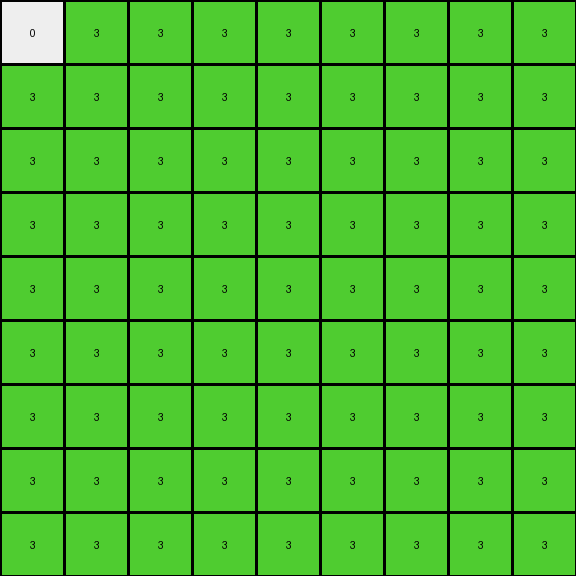
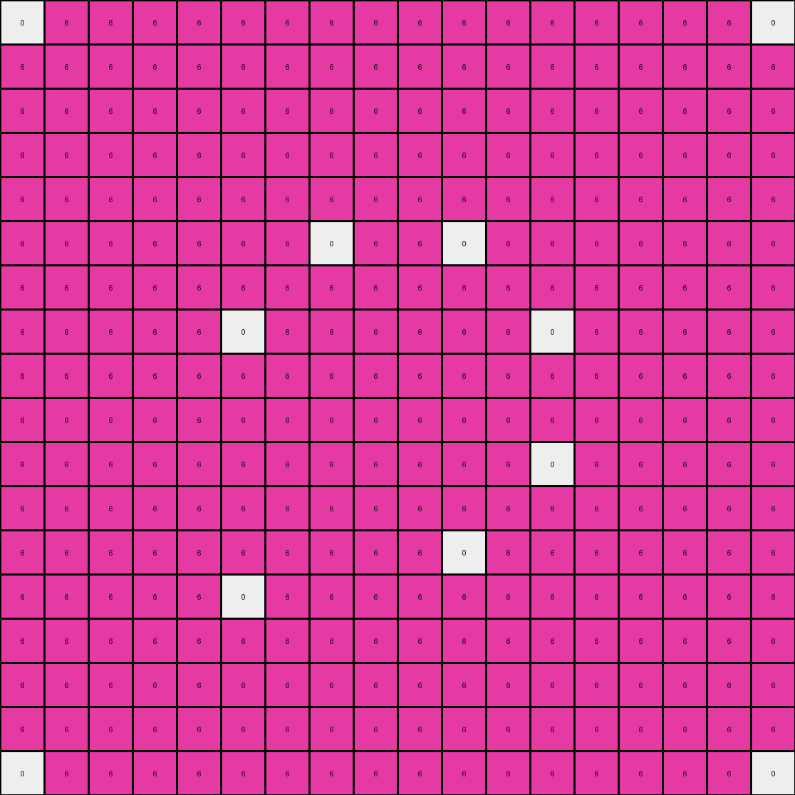

# ff805c23 • 011 • refine_dreamer

---


Previous Code:
```python
"""
1.  **Identify Primary Color:** Find the color of the largest object near the center of the input grid. The target color may be magenta (6), green(3), or gray (5).
2.  **Find Object Colors:** Create an initial bounding box around the identified largest object. Note all colors contained within this bounding box.
3.  **Object Region Extraction:** Perform a flood-fill (connected component analysis) starting from a pixel within the identified object, expanding only to adjacent pixels of colors identified in step 2.
4. **Extract Sub-grid:** Determine the minimum bounding box that fully contains the expanded region identified in Step 3. Extract this rectangular sub-grid from the input.
5. **Simplify Colors:** Replace all pixels except the color white (0) in the extracted subgrid to the primary color, as identified in Step 1.
6. **White Pixel Rule:** Examine the immediate neighbors (up, down, left, right) of each white (0) pixel in the *original input grid*. If ALL the neighbors within the original grid are non-zero, then make that cell white, else make that cell the primary color, as identified in Step 1.
"""

import numpy as np

def find_largest_object(grid, colors):
    """Finds the largest contiguous block of the specified colors."""
    visited = set()
    max_size = 0
    max_coords = None
    primary_color = None

    def dfs(r, c):
        if (r, c) in visited or not (0 <= r < grid.shape[0] and 0 <= c < grid.shape[1]) or grid[r, c] not in colors:
            return 0, None
        visited.add((r, c))
        count, _ = dfs(r + 1, c)
        c1, _ = dfs(r - 1, c)
        c2, _ = dfs(r, c + 1)
        c3, _ =  dfs(r, c - 1)
        return 1 + count + c1+ c2 + c3, grid[r,c]

    for r in range(grid.shape[0]):
        for c in range(grid.shape[1]):
            if grid[r, c] in colors and (r, c) not in visited:
                size, color = dfs(r, c)
                if size > max_size:
                    max_size = size
                    max_coords = (r, c)
                    primary_color = color
    return max_coords, max_size, primary_color
    
def get_bounding_box(grid, center_coords, colors):
    """
    Expands outwards from center coordinates to fully encompass
    a contiguous shape, but only using specified colors.
    """
    
    rows, cols = grid.shape
    
    min_row = center_coords[0]
    max_row = center_coords[0]
    min_col = center_coords[1]
    max_col = center_coords[1]

    
    q = [center_coords]
    seen = {center_coords}
    
    while q:
        r, c = q.pop(0)
        
        min_row = min(min_row, r)
        max_row = max(max_row, r)
        min_col = min(min_col, c)
        max_col = max(max_col, c)        
        
        neighbors = [(r+1, c), (r-1, c), (r, c+1), (r, c-1)]
        
        for nr, nc in neighbors:
            if 0<=nr<rows and 0<=nc<cols and (nr, nc) not in seen:
                if grid[nr, nc] in colors:
                    q.append((nr, nc))
                    seen.add((nr, nc))
    
    return (min_row, min_col), (max_row, max_col)

def get_neighbor_colors(grid, r, c):
    """Returns a set of the colors of the immediate neighbors."""
    rows, cols = grid.shape
    neighbors = [(r+1, c), (r-1, c), (r, c+1), (r, c-1)]
    neighbor_colors = set()
    for nr, nc in neighbors:
        if 0 <= nr < rows and 0 <= nc < cols:
            neighbor_colors.add(grid[nr, nc])
    return neighbor_colors
    

def transform(input_grid):
    """Transforms the input grid according to the described rules."""
    
    # Convert input grid to a NumPy array for easier manipulation.
    grid = np.array(input_grid)

    # 1. Identify Primary Color (and largest object)
    
    #potential colors to look for
    colors = {3, 5, 6}
    
    center, size, primary_color = find_largest_object(grid, colors)

    #if center is none, return an empty grid
    if center is None:
        return []
    
    #get initial bounding box of object
    top_left, bottom_right = get_bounding_box(grid, center, {primary_color})    
    
    #get any touching objects of colors that exist within the initial box
    colors_in_object = set(grid[top_left[0]:bottom_right[0]+1, top_left[1]:bottom_right[1]+1].flatten())

    # 3. Object Region Extraction (flood fill with limited colors)
    top_left, bottom_right = get_bounding_box(grid, center, colors_in_object)

    # 4. Extract Sub-grid
    sub_grid = grid[top_left[0]:bottom_right[0] + 1, top_left[1]:bottom_right[1] + 1]
    
    #create a copy we can modify
    output_grid = sub_grid.copy()

    # 5. Simplify Colors (replace non-white with primary color)
    for r in range(output_grid.shape[0]):
        for c in range(output_grid.shape[1]):
            if output_grid[r,c] != 0:
                output_grid[r,c] = primary_color

    # 6. White Pixel Rule
    for r in range(output_grid.shape[0]):
        for c in range(output_grid.shape[1]):
            if output_grid[r, c] == 0:
                #get coords in original grid
                orig_r = top_left[0] + r
                orig_c = top_left[1] + c
                
                neighbor_colors = get_neighbor_colors(grid, orig_r, orig_c)
                if all(color != 0 for color in neighbor_colors):
                    output_grid[r, c] = 0
                else:
                    output_grid[r,c] = primary_color

    return output_grid.tolist()
```

Train Set Results:

## Example 1:

Input:
```
0 3 3 3 3 0 0 2 2 2 0 0 0 0 2 2 2 0 1 1 1 1 1 0
3 3 3 3 3 0 2 2 0 2 2 0 0 2 2 0 2 2 1 1 1 1 1 3
3 3 3 0 0 3 2 0 0 2 0 0 0 0 2 0 0 2 1 1 1 1 1 3
3 3 0 3 3 3 2 2 2 2 2 2 2 2 2 2 2 2 1 1 1 1 1 3
3 3 0 3 3 3 0 2 0 2 2 2 2 2 2 0 2 0 1 1 1 1 1 3
0 0 3 3 3 3 0 0 0 2 2 2 2 2 2 0 0 0 3 3 3 3 0 0
0 2 2 2 0 0 2 0 0 2 2 2 2 2 2 0 0 2 0 0 2 2 2 0
2 2 0 2 2 0 0 2 2 0 2 2 2 2 0 2 2 0 0 2 2 0 2 2
2 0 0 2 0 0 0 2 2 0 0 2 2 0 0 2 2 0 0 0 2 0 0 2
2 2 2 2 2 2 2 0 0 2 2 2 2 2 2 0 0 2 2 2 2 2 2 2
0 2 0 2 2 2 2 2 0 2 0 2 2 0 2 0 2 2 2 2 2 0 2 0
0 0 0 2 2 2 2 2 2 2 2 0 0 2 2 2 2 2 2 2 2 0 0 0
0 0 0 2 2 2 2 2 2 2 2 0 0 2 2 2 2 2 2 2 2 0 0 0
0 2 0 2 2 2 2 2 0 2 0 2 2 0 2 0 2 2 2 2 2 0 2 0
2 2 2 2 2 2 2 0 0 2 2 2 2 2 2 0 0 2 2 2 2 2 2 2
2 0 0 2 0 0 0 2 2 0 0 2 2 0 0 2 2 0 0 0 2 0 0 2
2 2 0 2 2 0 0 2 2 0 2 2 2 2 0 2 2 0 0 2 2 0 2 2
0 2 2 2 0 0 2 0 0 2 2 2 2 2 2 0 0 2 0 0 2 2 2 0
0 0 3 3 3 3 0 0 0 2 2 2 2 2 2 0 0 0 3 3 3 3 0 0
3 3 0 3 3 3 0 2 0 2 2 2 2 2 2 0 2 0 3 3 3 0 3 3
3 3 0 3 3 3 2 2 2 2 2 2 2 2 2 2 2 2 3 3 3 0 3 3
3 3 3 0 0 3 2 0 0 2 0 0 0 0 2 0 0 2 3 0 0 3 3 3
3 3 3 3 3 0 2 2 0 2 2 0 0 2 2 0 2 2 0 3 3 3 3 3
0 3 3 3 3 0 0 2 2 2 0 0 0 0 2 2 2 0 0 3 3 3 3 0
```
Expected Output:
```
0 3 3 3 3
0 3 3 3 3
3 0 0 3 3
3 3 3 0 3
3 3 3 0 3
```
Transformed Output:
```
0 3 3 3 3 3 3 3 3
3 3 3 3 3 3 3 3 3
3 3 3 3 3 3 3 3 3
3 3 3 3 3 3 3 3 3
3 3 3 3 3 3 3 3 3
3 3 3 3 3 3 3 3 3
3 3 3 3 3 3 3 3 3
3 3 3 3 3 3 3 3 3
3 3 3 3 3 3 3 3 3
```

match: False
pixels_off: None
size_correct: False
color_palette_correct: True
correct_pixel_counts: False

## Example 2:

Input:
```
0 3 3 3 0 3 0 8 8 0 8 8 8 8 0 8 8 0 3 0 3 3 3 0
3 0 3 0 3 0 8 0 8 0 0 0 0 0 0 8 0 8 0 3 0 3 0 3
3 3 3 3 3 3 8 8 8 0 8 8 8 8 0 8 8 8 3 3 3 3 3 3
3 0 3 0 3 3 0 0 0 8 0 8 8 0 8 0 0 0 3 3 0 3 0 3
0 3 3 3 0 0 8 0 8 0 0 8 8 0 0 8 0 8 0 0 3 3 3 0
3 0 3 3 0 3 8 0 8 8 8 0 0 8 8 8 0 8 3 0 3 3 0 3
0 8 8 0 8 8 6 6 6 6 6 6 6 6 6 6 6 6 8 8 0 8 8 0
8 0 8 0 0 0 6 6 0 6 6 6 6 6 6 0 6 6 0 0 0 8 0 8
8 8 8 0 8 8 6 0 0 6 0 6 6 0 6 0 0 6 8 8 0 8 8 8
0 0 0 8 0 8 6 6 6 6 6 6 6 6 6 6 6 6 8 0 8 0 0 0
8 0 8 0 0 8 6 6 0 6 6 6 6 6 6 0 6 6 8 0 0 8 0 8
8 0 8 8 8 0 1 1 1 1 1 0 0 6 6 6 6 6 0 8 8 8 0 8
8 0 8 8 8 0 1 1 1 1 1 0 0 6 6 6 6 6 0 8 8 8 0 8
8 0 8 0 0 8 1 1 1 1 1 6 6 6 6 0 6 6 8 0 0 8 0 8
0 0 0 8 0 8 1 1 1 1 1 6 6 6 6 6 6 6 8 0 8 0 0 0
8 8 8 0 8 8 1 1 1 1 1 6 6 0 6 0 0 6 8 8 0 8 8 8
8 0 8 0 0 0 6 6 0 6 6 6 6 6 6 0 6 6 0 0 0 8 0 8
0 8 8 0 8 8 6 6 6 6 6 6 6 6 6 6 6 6 8 8 0 8 8 0
3 0 3 3 0 3 8 0 8 8 8 0 0 8 8 8 0 8 3 0 3 3 0 3
0 3 3 3 0 0 8 0 8 0 0 8 8 0 0 8 0 8 0 0 3 3 3 0
3 0 3 0 3 3 0 0 0 8 0 8 8 0 8 0 0 0 3 3 0 3 0 3
3 3 3 3 3 3 8 8 8 0 8 8 8 8 0 8 8 8 3 3 3 3 3 3
3 0 3 0 3 0 8 0 8 0 0 0 0 0 0 8 0 8 0 3 0 3 0 3
0 3 3 3 0 3 0 8 8 0 8 8 8 8 0 8 8 0 3 0 3 3 3 0
```
Expected Output:
```
6 6 6 6 6
6 6 6 6 6
6 6 0 6 6
6 6 6 6 6
6 0 0 6 0
```
Transformed Output:
```
0 6 6 6 6 6 6 6 6 6 6 6 6 6 6 6 6 0
6 6 6 6 6 6 6 6 6 6 6 6 6 6 6 6 6 6
6 6 6 6 6 6 6 6 6 6 6 6 6 6 6 6 6 6
6 6 6 6 6 6 6 6 6 6 6 6 6 6 6 6 6 6
6 6 6 6 6 6 6 6 6 6 6 6 6 6 6 6 6 6
6 6 6 6 6 6 6 0 6 6 0 6 6 6 6 6 6 6
6 6 6 6 6 6 6 6 6 6 6 6 6 6 6 6 6 6
6 6 6 6 6 0 6 6 6 6 6 6 0 6 6 6 6 6
6 6 6 6 6 6 6 6 6 6 6 6 6 6 6 6 6 6
6 6 6 6 6 6 6 6 6 6 6 6 6 6 6 6 6 6
6 6 6 6 6 6 6 6 6 6 6 6 0 6 6 6 6 6
6 6 6 6 6 6 6 6 6 6 6 6 6 6 6 6 6 6
6 6 6 6 6 6 6 6 6 6 0 6 6 6 6 6 6 6
6 6 6 6 6 0 6 6 6 6 6 6 6 6 6 6 6 6
6 6 6 6 6 6 6 6 6 6 6 6 6 6 6 6 6 6
6 6 6 6 6 6 6 6 6 6 6 6 6 6 6 6 6 6
6 6 6 6 6 6 6 6 6 6 6 6 6 6 6 6 6 6
0 6 6 6 6 6 6 6 6 6 6 6 6 6 6 6 6 0
```

match: False
pixels_off: None
size_correct: False
color_palette_correct: True
correct_pixel_counts: False

## Example 3:

Input:
```
0 3 3 3 3 0 5 5 5 0 0 5 5 0 0 5 5 5 0 3 3 3 3 0
3 3 3 3 3 3 5 5 0 0 0 0 0 0 0 0 5 5 3 3 3 3 3 3
3 3 3 0 0 0 5 0 0 5 5 0 0 5 5 0 0 5 0 0 0 3 3 3
3 3 0 0 3 3 0 0 5 0 5 5 5 5 0 5 0 0 3 3 0 0 3 3
3 3 0 3 3 0 0 0 5 5 0 0 0 0 5 5 0 0 0 3 3 0 3 3
0 3 0 3 0 3 5 0 0 5 0 0 0 0 5 0 0 5 3 0 3 0 3 0
5 5 5 0 0 5 0 5 0 0 5 5 5 5 0 0 5 0 5 0 0 5 5 5
5 5 0 0 0 0 5 5 5 0 0 5 5 0 0 5 5 5 0 0 0 0 5 5
5 0 0 5 5 0 0 5 5 5 0 5 5 0 5 5 5 0 0 5 5 0 0 5
0 0 5 0 5 5 0 0 5 5 5 5 5 5 5 5 0 0 5 5 0 5 0 0
0 0 5 5 0 0 5 0 0 5 0 5 5 0 5 0 0 5 0 0 5 5 0 0
5 0 0 5 0 0 5 5 5 5 5 0 0 5 5 5 5 5 0 0 5 0 0 5
5 0 0 5 0 0 5 5 5 5 5 0 0 5 5 5 5 5 0 0 5 0 0 5
0 0 5 5 0 0 5 0 0 5 0 5 5 0 5 0 0 5 0 0 5 5 0 0
0 0 5 0 5 5 0 0 5 5 5 5 5 5 5 5 0 0 5 5 0 5 0 0
5 0 0 5 5 0 0 5 5 5 1 1 1 1 1 5 5 0 0 5 5 0 0 5
5 5 0 0 0 0 5 5 5 0 1 1 1 1 1 5 5 5 0 0 0 0 5 5
5 5 5 0 0 5 0 5 0 0 1 1 1 1 1 0 5 0 5 0 0 5 5 5
0 3 0 3 0 3 5 0 0 5 1 1 1 1 1 0 0 5 3 0 3 0 3 0
3 3 0 3 3 0 0 0 5 5 1 1 1 1 1 5 0 0 0 3 3 0 3 3
3 3 0 0 3 3 0 0 5 0 5 5 5 5 0 5 0 0 3 3 0 0 3 3
3 3 3 0 0 0 5 0 0 5 5 0 0 5 5 0 0 5 0 0 0 3 3 3
3 3 3 3 3 3 5 5 0 0 0 0 0 0 0 0 5 5 3 3 3 3 3 3
0 3 3 3 3 0 5 5 5 0 0 5 5 0 0 5 5 5 0 3 3 3 3 0
```
Expected Output:
```
0 5 5 0 5
0 5 5 0 0
5 5 5 5 0
0 0 0 0 5
0 0 0 0 5
```
Transformed Output:
```
0 5 5 5 5 0 5 5 5 5 5 5 5 5 5 5 5 5 0 5 5 5 5 0
5 5 5 5 5 5 5 5 5 5 5 5 5 5 5 5 5 5 5 5 5 5 5 5
5 5 5 5 5 5 5 5 5 5 5 5 5 5 5 5 5 5 5 5 5 5 5 5
5 5 5 5 5 5 5 5 5 0 5 5 5 5 0 5 5 5 5 5 5 5 5 5
5 5 5 5 5 5 5 5 5 5 5 5 5 5 5 5 5 5 5 5 5 5 5 5
0 5 5 5 5 5 5 5 5 5 5 5 5 5 5 5 5 5 5 5 5 5 5 0
5 5 5 5 5 5 0 5 5 5 5 5 5 5 5 5 5 0 5 5 5 5 5 5
5 5 5 5 5 5 5 5 5 5 5 5 5 5 5 5 5 5 5 5 5 5 5 5
5 5 5 5 5 5 5 5 5 5 5 5 5 5 5 5 5 5 5 5 5 5 5 5
5 5 5 0 5 5 5 5 5 5 5 5 5 5 5 5 5 5 5 5 0 5 5 5
5 5 5 5 5 5 5 5 5 5 0 5 5 0 5 5 5 5 5 5 5 5 5 5
5 5 5 5 5 5 5 5 5 5 5 5 5 5 5 5 5 5 5 5 5 5 5 5
5 5 5 5 5 5 5 5 5 5 5 5 5 5 5 5 5 5 5 5 5 5 5 5
5 5 5 5 5 5 5 5 5 5 0 5 5 0 5 5 5 5 5 5 5 5 5 5
5 5 5 0 5 5 5 5 5 5 5 5 5 5 5 5 5 5 5 5 0 5 5 5
5 5 5 5 5 5 5 5 5 5 5 5 5 5 5 5 5 5 5 5 5 5 5 5
5 5 5 5 5 5 5 5 5 5 5 5 5 5 5 5 5 5 5 5 5 5 5 5
5 5 5 5 5 5 0 5 5 5 5 5 5 5 5 5 5 0 5 5 5 5 5 5
0 5 5 5 5 5 5 5 5 5 5 5 5 5 5 5 5 5 5 5 5 5 5 0
5 5 5 5 5 5 5 5 5 5 5 5 5 5 5 5 5 5 5 5 5 5 5 5
5 5 5 5 5 5 5 5 5 0 5 5 5 5 0 5 5 5 5 5 5 5 5 5
5 5 5 5 5 5 5 5 5 5 5 5 5 5 5 5 5 5 5 5 5 5 5 5
5 5 5 5 5 5 5 5 5 5 5 5 5 5 5 5 5 5 5 5 5 5 5 5
0 5 5 5 5 0 5 5 5 5 5 5 5 5 5 5 5 5 0 5 5 5 5 0
```

match: False
pixels_off: None
size_correct: False
color_palette_correct: True
correct_pixel_counts: False

**INSTRUCTIONS**

The code above was generated based on observations from the first training
example

we have tested the transform function on each of the task example inputs and
compared with the expected output

review each of the examples provided and the results and consider how the
natural language program should be updated to accommodate this new knowledge

respond with the following deliverables:

- general assessment of the information provided and strategy for resolving the
  errors
- gather metrics about each of the examples and results - use code_execution to
  develop accurate reports on your assumptions
- a YAML block documenting facts - Focus on identifying objects, their properties, and the actions performed on them.
- a natural language program - Be as clear and concise as possible, providing a complete description of the transformation rule.


your responses should be considered as information in a report - not a
conversation
