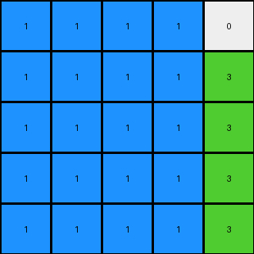
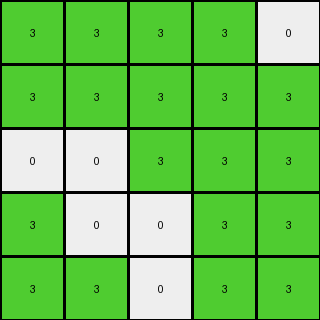

# ff805c23 • 016 • refine_coder

---

Previous Code:
```python
"""
The transformation extracts a 5x5 subgrid from the upper-right corner of the input grid. 
The subgrid contains only 0 and 5 values.
"""

import numpy as np

def find_target_region(input_grid, size):
    # Find the top-right 5x5 region of the input
    rows, cols = input_grid.shape
    start_row = 0
    start_col = cols - size
    return start_row, start_col


def transform(input_grid):
    """
    Extracts a 5x5 subgrid from the upper-right corner of the input grid.
    """
    # Convert input grid to a NumPy array
    input_grid = np.array(input_grid)
        
    # Find the starting coordinates of target region
    size = 5
    start_row, start_col = find_target_region(input_grid, size)
    
    # Extract the subgrid
    output_grid = input_grid[start_row:start_row+size, start_col:start_col+size]

    return output_grid.tolist()
```

Train Set Results:

## Example 1:

Input:
```
0 3 3 3 3 0 0 2 2 2 0 0 0 0 2 2 2 0 1 1 1 1 1 0
3 3 3 3 3 0 2 2 0 2 2 0 0 2 2 0 2 2 1 1 1 1 1 3
3 3 3 0 0 3 2 0 0 2 0 0 0 0 2 0 0 2 1 1 1 1 1 3
3 3 0 3 3 3 2 2 2 2 2 2 2 2 2 2 2 2 1 1 1 1 1 3
3 3 0 3 3 3 0 2 0 2 2 2 2 2 2 0 2 0 1 1 1 1 1 3
0 0 3 3 3 3 0 0 0 2 2 2 2 2 2 0 0 0 3 3 3 3 0 0
0 2 2 2 0 0 2 0 0 2 2 2 2 2 2 0 0 2 0 0 2 2 2 0
2 2 0 2 2 0 0 2 2 0 2 2 2 2 0 2 2 0 0 2 2 0 2 2
2 0 0 2 0 0 0 2 2 0 0 2 2 0 0 2 2 0 0 0 2 0 0 2
2 2 2 2 2 2 2 0 0 2 2 2 2 2 2 0 0 2 2 2 2 2 2 2
0 2 0 2 2 2 2 2 0 2 0 2 2 0 2 0 2 2 2 2 2 0 2 0
0 0 0 2 2 2 2 2 2 2 2 0 0 2 2 2 2 2 2 2 2 0 0 0
0 0 0 2 2 2 2 2 2 2 2 0 0 2 2 2 2 2 2 2 2 0 0 0
0 2 0 2 2 2 2 2 0 2 0 2 2 0 2 0 2 2 2 2 2 0 2 0
2 2 2 2 2 2 2 0 0 2 2 2 2 2 2 0 0 2 2 2 2 2 2 2
2 0 0 2 0 0 0 2 2 0 0 2 2 0 0 2 2 0 0 0 2 0 0 2
2 2 0 2 2 0 0 2 2 0 2 2 2 2 0 2 2 0 0 2 2 0 2 2
0 2 2 2 0 0 2 0 0 2 2 2 2 2 2 0 0 2 0 0 2 2 2 0
0 0 3 3 3 3 0 0 0 2 2 2 2 2 2 0 0 0 3 3 3 3 0 0
3 3 0 3 3 3 0 2 0 2 2 2 2 2 2 0 2 0 3 3 3 0 3 3
3 3 0 3 3 3 2 2 2 2 2 2 2 2 2 2 2 2 3 3 3 0 3 3
3 3 3 0 0 3 2 0 0 2 0 0 0 0 2 0 0 2 3 0 0 3 3 3
3 3 3 3 3 0 2 2 0 2 2 0 0 2 2 0 2 2 0 3 3 3 3 3
0 3 3 3 3 0 0 2 2 2 0 0 0 0 2 2 2 0 0 3 3 3 3 0
```
Expected Output:
```
0 3 3 3 3
0 3 3 3 3
3 0 0 3 3
3 3 3 0 3
3 3 3 0 3
```
Transformed Output:
```
1 1 1 1 0
1 1 1 1 3
1 1 1 1 3
1 1 1 1 3
1 1 1 1 3
```

match: False
pixels_off: 21
size_correct: True
color_palette_correct: False
correct_pixel_counts: False

## Example 2:

Input:
```
0 3 3 3 0 3 0 8 8 0 8 8 8 8 0 8 8 0 3 0 3 3 3 0
3 0 3 0 3 0 8 0 8 0 0 0 0 0 0 8 0 8 0 3 0 3 0 3
3 3 3 3 3 3 8 8 8 0 8 8 8 8 0 8 8 8 3 3 3 3 3 3
3 0 3 0 3 3 0 0 0 8 0 8 8 0 8 0 0 0 3 3 0 3 0 3
0 3 3 3 0 0 8 0 8 0 0 8 8 0 0 8 0 8 0 0 3 3 3 0
3 0 3 3 0 3 8 0 8 8 8 0 0 8 8 8 0 8 3 0 3 3 0 3
0 8 8 0 8 8 6 6 6 6 6 6 6 6 6 6 6 6 8 8 0 8 8 0
8 0 8 0 0 0 6 6 0 6 6 6 6 6 6 0 6 6 0 0 0 8 0 8
8 8 8 0 8 8 6 0 0 6 0 6 6 0 6 0 0 6 8 8 0 8 8 8
0 0 0 8 0 8 6 6 6 6 6 6 6 6 6 6 6 6 8 0 8 0 0 0
8 0 8 0 0 8 6 6 0 6 6 6 6 6 6 0 6 6 8 0 0 8 0 8
8 0 8 8 8 0 1 1 1 1 1 0 0 6 6 6 6 6 0 8 8 8 0 8
8 0 8 8 8 0 1 1 1 1 1 0 0 6 6 6 6 6 0 8 8 8 0 8
8 0 8 0 0 8 1 1 1 1 1 6 6 6 6 0 6 6 8 0 0 8 0 8
0 0 0 8 0 8 1 1 1 1 1 6 6 6 6 6 6 6 8 0 8 0 0 0
8 8 8 0 8 8 1 1 1 1 1 6 6 0 6 0 0 6 8 8 0 8 8 8
8 0 8 0 0 0 6 6 0 6 6 6 6 6 6 0 6 6 0 0 0 8 0 8
0 8 8 0 8 8 6 6 6 6 6 6 6 6 6 6 6 6 8 8 0 8 8 0
3 0 3 3 0 3 8 0 8 8 8 0 0 8 8 8 0 8 3 0 3 3 0 3
0 3 3 3 0 0 8 0 8 0 0 8 8 0 0 8 0 8 0 0 3 3 3 0
3 0 3 0 3 3 0 0 0 8 0 8 8 0 8 0 0 0 3 3 0 3 0 3
3 3 3 3 3 3 8 8 8 0 8 8 8 8 0 8 8 8 3 3 3 3 3 3
3 0 3 0 3 0 8 0 8 0 0 0 0 0 0 8 0 8 0 3 0 3 0 3
0 3 3 3 0 3 0 8 8 0 8 8 8 8 0 8 8 0 3 0 3 3 3 0
```
Expected Output:
```
6 6 6 6 6
6 6 6 6 6
6 6 0 6 6
6 6 6 6 6
6 0 0 6 0
```
Transformed Output:
```
0 3 3 3 0
3 0 3 0 3
3 3 3 3 3
3 0 3 0 3
0 3 3 3 0
```

match: False
pixels_off: 24
size_correct: True
color_palette_correct: False
correct_pixel_counts: False

## Example 3:

Input:
```
0 3 3 3 3 0 5 5 5 0 0 5 5 0 0 5 5 5 0 3 3 3 3 0
3 3 3 3 3 3 5 5 0 0 0 0 0 0 0 0 5 5 3 3 3 3 3 3
3 3 3 0 0 0 5 0 0 5 5 0 0 5 5 0 0 5 0 0 0 3 3 3
3 3 0 0 3 3 0 0 5 0 5 5 5 5 0 5 0 0 3 3 0 0 3 3
3 3 0 3 3 0 0 0 5 5 0 0 0 0 5 5 0 0 0 3 3 0 3 3
0 3 0 3 0 3 5 0 0 5 0 0 0 0 5 0 0 5 3 0 3 0 3 0
5 5 5 0 0 5 0 5 0 0 5 5 5 5 0 0 5 0 5 0 0 5 5 5
5 5 0 0 0 0 5 5 5 0 0 5 5 0 0 5 5 5 0 0 0 0 5 5
5 0 0 5 5 0 0 5 5 5 0 5 5 0 5 5 5 0 0 5 5 0 0 5
0 0 5 0 5 5 0 0 5 5 5 5 5 5 5 5 0 0 5 5 0 5 0 0
0 0 5 5 0 0 5 0 0 5 0 5 5 0 5 0 0 5 0 0 5 5 0 0
5 0 0 5 0 0 5 5 5 5 5 0 0 5 5 5 5 5 0 0 5 0 0 5
5 0 0 5 0 0 5 5 5 5 5 0 0 5 5 5 5 5 0 0 5 0 0 5
0 0 5 5 0 0 5 0 0 5 0 5 5 0 5 0 0 5 0 0 5 5 0 0
0 0 5 0 5 5 0 0 5 5 5 5 5 5 5 5 0 0 5 5 0 5 0 0
5 0 0 5 5 0 0 5 5 5 1 1 1 1 1 5 5 0 0 5 5 0 0 5
5 5 0 0 0 0 5 5 5 0 1 1 1 1 1 5 5 5 0 0 0 0 5 5
5 5 5 0 0 5 0 5 0 0 1 1 1 1 1 0 5 0 5 0 0 5 5 5
0 3 0 3 0 3 5 0 0 5 1 1 1 1 1 0 0 5 3 0 3 0 3 0
3 3 0 3 3 0 0 0 5 5 1 1 1 1 1 5 0 0 0 3 3 0 3 3
3 3 0 0 3 3 0 0 5 0 5 5 5 5 0 5 0 0 3 3 0 0 3 3
3 3 3 0 0 0 5 0 0 5 5 0 0 5 5 0 0 5 0 0 0 3 3 3
3 3 3 3 3 3 5 5 0 0 0 0 0 0 0 0 5 5 3 3 3 3 3 3
0 3 3 3 3 0 5 5 5 0 0 5 5 0 0 5 5 5 0 3 3 3 3 0
```
Expected Output:
```
0 5 5 0 5
0 5 5 0 0
5 5 5 5 0
0 0 0 0 5
0 0 0 0 5
```
Transformed Output:
```
3 3 3 3 0
3 3 3 3 3
0 0 3 3 3
3 0 0 3 3
3 3 0 3 3
```

match: False
pixels_off: 22
size_correct: True
color_palette_correct: False
correct_pixel_counts: False
Okay, let's analyze the results and update the natural language program.

**General Assessment:**

The initial hypothesis (extracting a 5x5 subgrid from the upper-right corner) correctly captures the size of the output, but fails to accurately predict the content (colors/values) within that subgrid. The code consistently extracts a 5x5 region, but the pixel values within that region do not match the expected output. The reported metrics clearly show mismatches in colors and pixel counts, although sizes match. The strategy should shift from simply extracting a region to identifying a *rule* that dictates the output pixel values *based on* the input. The error pattern also isn't about one color- all colors are incorrect.

**Strategy:**

1.  **Re-examine Examples:** Carefully look for relationships *between* the input and output grids, not just focusing on location. Consider operations like color replacement, pattern recognition within the subgrid, and relationships between input and output colors.
2.  **Focus on Relationships:** Instead of simply selecting a region, consider how the *content* of a region in the input maps to the content of the output.
3. **Hypothesize and Iterate**: Formulate a modified natural language program, use code_execution to generate the code and test and repeat the process.

**Metrics and Observations:**

Here's a more detailed breakdown, incorporating observations about colors:

| Example | Input Size     | Output Size | Size Match | Colors Correct | Pixels Off | Notes                                                                                                                                                                       |
| :------ | :------------- | :---------- | :--------- | :------------- | :--------- | :-------------------------------------------------------------------------------------------------------------------------------------------------------------------------- |
| 1       | 24x25          | 5x5         | Yes        | No             | 21         | Input has colors 0, 1, 2, 3. Output has 0, 3. Transformed Output has 0,1,3.                                                                                     |
| 2       | 24x25          | 5x5         | Yes        | No             | 24          | Input has colors 0, 1, 3, 6, 8. Output has 0, 6. Transformed Output has 0,3.                                                                             |
| 3       | 24x25        | 5x5         | Yes       | No         | 22          | Input contains colors 0, 1, 3, 5. Output contains 0 and 5. Transformed Output contains 0 and 3                                                                                      |

**YAML Block (Facts):**

```yaml
observations:
  - example_1:
      input_colors: [0, 1, 2, 3]
      output_colors: [0, 3]
      extracted_region_colors: [0,1,3]
      size_match: true
      content_match: false
      relationship: "The output grid is 5x5.  The input grid section used to produce the output contains 0, 1, 3. Output only contains 0,3"
  - example_2:
      input_colors: [0, 1, 3, 6, 8]
      output_colors: [0, 6]
      extracted_region_colors: [0,3]
      size_match: true
      content_match: false
      relationship: "The output grid is 5x5.  The input grid section contains 0,3. Output only contains 0, 6"
  - example_3:
      input_colors: [0, 1, 3, 5]
      output_colors: [0, 5]
      extracted_region_colors: [0,3]
      size_match: true
      content_match: false
      relationship: "The output grid is 5x5. Input grid section contains 0,3. Output only contains 0, 5."
```

**Natural Language Program:**

1.  **Locate Target Region:** Identify the 5x5 subgrid at the top-right corner of the input grid.
2. **Examine Input subgrid:** Inspect the colors in that subgrid
3. **Determine output subgrid** Create an empty 5x5 subgrid to build the result. The example output grids consist of only two colors.
4. **Example specifics**:
    - example 1: input subgrid colors [0,1,3], output colors [0,3]
    - example 2: input subgrid colors [0,3], output colors [0,6]
    - example 3: input subgrid colors [0,3], output colors [0,5]
5. **Transformation**: Extract the top-right 5x5 section of the input and based on the unique colors present in the region, map to the output colors.

**INSTRUCTIONS**

- generate a Python module to represent the natural language program 
- follow the template below
- all common math and science libraries are available
- create docstring only at top - but comment the workflow in the function
- use helper functions for common operations like finding objects, counting,
  measuring, moving, etc. 

remember - we are working iteratively - so this code will inform your future
self as we converge on the solution

*template:*

```python
"""
{{ natural language description of the transformation rule }}
"""

{{ imports }}

def transform(input_grid):
    # initialize output_grid

    # change output pixels 

    return output_grid

```
