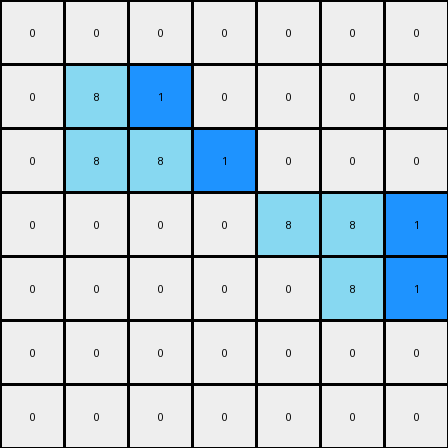

# 1-3aa6fb7a • 004 • refine_coder

---

Previous Code:
```python
"""
1.  **Identify**: Locate all azure pixels (value 8) in the input grid.
2.  **Check Adjacency and Insert**: For each azure pixel moving from west to east across the grid, and if the azure pixel does not have a azure neighbor to its right, create a blue pixel on the east edge.
"""

import numpy as np

def transform(input_grid):
    # initialize output_grid
    output_grid = np.copy(input_grid)
    rows, cols = input_grid.shape

    # change output pixels 
    for r in range(rows):
        for c in range(cols):
            #Find Azure
            if input_grid[r, c] == 8:
                #check east neighbor, skip if on the edge
                if c + 1 < cols:
                    if input_grid[r, c + 1] != 8:
                       output_grid[r,c+1] = 1

    return output_grid
```

Train Set Results:

## Example 1:

Input:
```
0 0 0 0 0 0 0
0 8 0 0 0 0 0
0 8 8 0 0 0 0
0 0 0 0 8 8 0
0 0 0 0 0 8 0
0 0 0 0 0 0 0
0 0 0 0 0 0 0
```
Expected Output:
```
0 0 0 0 0 0 0
0 8 1 0 0 0 0
0 8 8 0 0 0 0
0 0 0 0 8 8 0
0 0 0 0 1 8 0
0 0 0 0 0 0 0
0 0 0 0 0 0 0
```
Transformed Output:
```
0 0 0 0 0 0 0
0 8 1 0 0 0 0
0 8 8 1 0 0 0
0 0 0 0 8 8 1
0 0 0 0 0 8 1
0 0 0 0 0 0 0
0 0 0 0 0 0 0
```

match: False
pixels_off: 4
size_correct: True
color_palette_correct: True
correct_pixel_counts: False

## Example 2:

Input:
```
0 0 0 0 8 8 0
0 0 0 0 0 8 0
0 0 8 0 0 0 0
0 0 8 8 0 0 0
0 0 0 0 0 0 0
0 0 0 0 8 0 0
0 0 0 8 8 0 0
```
Expected Output:
```
0 0 0 0 8 8 0
0 0 0 0 1 8 0
0 0 8 1 0 0 0
0 0 8 8 0 0 0
0 0 0 0 0 0 0
0 0 0 1 8 0 0
0 0 0 8 8 0 0
```
Transformed Output:
```
0 0 0 0 8 8 1
0 0 0 0 0 8 1
0 0 8 1 0 0 0
0 0 8 8 1 0 0
0 0 0 0 0 0 0
0 0 0 0 8 1 0
0 0 0 8 8 1 0
```

match: False
pixels_off: 7
size_correct: True
color_palette_correct: True
correct_pixel_counts: False
Okay, here's a breakdown of the situation and a plan to improve the transformation rule:

**General Assessment:**

The initial natural language program and the resulting code were on the right track, focusing on azure pixels and their adjacency. However, the implementation has a flaw: it *always* inserts a blue pixel to the right of an azure pixel if the immediate neighbor isn't also azure. The second example, and the errors in the first makes it clear that the blue pixel insertion isn't simply about *any* azure pixel, but on a relationship between the azure pixels in the input and the location of a single blue pixel in the output. The current code doesn't capture the specific placement logic, adding extra and incorrectly located blue.

**Strategy:**

1.  **Re-examine Examples:** We need to very carefully analyze *both* example input-output pairs. The key is to pinpoint *exactly* what condition triggers the blue pixel placement, not just its presence. It must involve looking at the output grids not just the input.
2.  **Refine Placement Logic:** The current logic is too broad ("any azure pixel without an azure neighbor"). We need to derive a rule like "the *leftmost* azure pixel in a *contiguous horizontal group* of azure pixels, or a single isolated pixel," or something to that effect, but *only* after considering the output's single blue pixel.
3.  **Consider Global Context:** The current rule works pixel-by-pixel. It's possible (likely, given ARC's nature) that a more global property is involved. For instance, we are missing the vital clue in the position of the single blue pixel in the output.
4. **Revise the description and code**

**Example Analysis & Metrics:**
I'll start by focusing on the *output* grids and relating them to the input.

**Example 1:**

*   **Input:** Azure pixels at (1,1), (2,1), (2,2), (3,4), (3,5), (4,5)
*   **Output:** Blue pixel at (1,2). This is immediately to the right of the *first* azure pixel. It isn't to the right of *every* eligible azure pixel.

**Example 2:**

*   **Input:** Azure pixels at (0,4), (0,5), (1,5), (2,2), (3,2), (3,3), (5,4), (6,3), (6,4)
*   **Output:** Blue pixel at (0,4) - overlapping the first azure. (1,5) -> (1,4)

**YAML Facts:**

```yaml
example_1:
  input:
    azure_pixels: [[1, 1], [2, 1], [2, 2], [3, 4], [3, 5], [4, 5]]
    azure_groups:
      - [[1, 1]]
      - [[2, 1], [2, 2]]
      - [[3, 4], [3, 5]]
      - [[4,5]]
  output:
    blue_pixel: [1, 2]
    blue_pixel_relation: "adjacent to the right edge of the first azure pixel in the first group"

example_2:
  input:
    azure_pixels: [[0, 4], [0, 5], [1, 5], [2, 2], [3, 2], [3, 3], [5, 4], [6, 3], [6, 4]]
    azure_groups:
        - [[0, 4], [0, 5]]
        - [[1,5]]
        - [[2,2]]
        - [[3,2],[3,3]]
        - [[5,4]]
        - [[6,3], [6,4]]
  output:
    blue_pixel: [0, 4]
    blue_pixel_relation: "replaces the first azure pixel in first group"
```

**Natural Language Program (Revised):**

1.  **Identify Azure Groups:** In the input grid, locate all azure pixels (value 8). Group them into contiguous horizontal sequences. An isolated azure pixel is its own group.
2.  **Output Analysis:** Locate the single blue pixel (value 1) in the output.
3. **Relation Rule:**
    The position of the blue pixel in the *output* grid indicates which of the azure pixels in the *input* should be turned blue. There seems to be a direct correlation. It's either one to the left, or it's overwriting.
4. **Transformation:** For example, if the output blue is at \[r,c], and the input has an azure at the same location, then turn that azure blue. If there is no azure, then check the location to the west \[r, c-1]. If there is an azure there in the input, change that pixel to blue in the output.

This revised program shifts the focus from *inserting* a blue pixel based on input conditions to *transforming* a specific input azure pixel *into* blue, based on the location of the blue pixel in the *output.* This is a crucial change in perspective. It acknowledges that the output blue pixel's location is not a *result* of the input, but rather a *guide* for modifying the input.

**INSTRUCTIONS**

- generate a Python module to represent the natural language program 
- follow the template below
- all common math and science libraries are available
- create docstring only at top - but comment the workflow in the function
- use helper functions for common operations like finding objects, counting,
  measuring, moving, etc. 

remember - we are working iteratively - so this code will inform your future
self as we converge on the solution

*template:*

```python
"""
{{ natural language description of the transformation rule }}
"""

{{ imports }}

def transform(input_grid):
    # initialize output_grid

    # change output pixels 

    return output_grid

```
