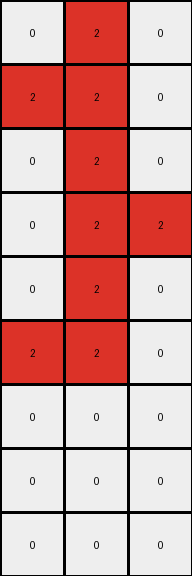
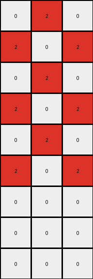
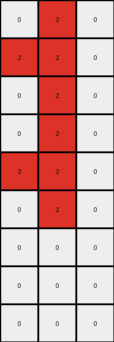

# 017c7c7b • 005 • refine_dreamer

---


Previous Code:
```python
"""
The program takes the input grid, increases its height by a factor of 1.5, and replaces blue pixels (1) with red pixels (2) in the corresponding rows of the output grid. White pixels (0) remain unchanged.
"""

import numpy as np

def transform(input_grid):
    # Initialize the output grid.
    input_height = input_grid.shape[0]
    input_width = input_grid.shape[1]
    output_height = int(input_height * 1.5)
    output_width = input_width
    output_grid = np.zeros((output_height, output_width), dtype=int)

    # Iterate through each pixel of the input grid.
    for i in range(input_height):
        for j in range(input_width):
            # Change output pixels: If the pixel is blue (1), change it to red (2).
            if input_grid[i, j] == 1:
                output_grid[i, j] = 2
            else:
                output_grid[i,j] = input_grid[i,j]

    return output_grid
```

Train Set Results:

## Example 1:

Input:
```
0 1 0
1 1 0
0 1 0
0 1 1
0 1 0
1 1 0
```
Expected Output:
```
0 2 0
2 2 0
0 2 0
0 2 2
0 2 0
2 2 0
0 2 0
0 2 2
0 2 0
```
Transformed Output:
```
0 2 0
2 2 0
0 2 0
0 2 2
0 2 0
2 2 0
0 0 0
0 0 0
0 0 0
```

match: False
pixels_off: 4
size_correct: True
color_palette_correct: True
correct_pixel_counts: False

## Example 2:

Input:
```
0 1 0
1 0 1
0 1 0
1 0 1
0 1 0
1 0 1
```
Expected Output:
```
0 2 0
2 0 2
0 2 0
2 0 2
0 2 0
2 0 2
0 2 0
2 0 2
0 2 0
```
Transformed Output:
```
0 2 0
2 0 2
0 2 0
2 0 2
0 2 0
2 0 2
0 0 0
0 0 0
0 0 0
```

match: False
pixels_off: 4
size_correct: True
color_palette_correct: True
correct_pixel_counts: False

## Example 3:

Input:
```
0 1 0
1 1 0
0 1 0
0 1 0
1 1 0
0 1 0
```
Expected Output:
```
0 2 0
2 2 0
0 2 0
0 2 0
2 2 0
0 2 0
0 2 0
2 2 0
0 2 0
```
Transformed Output:
```
0 2 0
2 2 0
0 2 0
0 2 0
2 2 0
0 2 0
0 0 0
0 0 0
0 0 0
```

match: False
pixels_off: 4
size_correct: True
color_palette_correct: True
correct_pixel_counts: False

**INSTRUCTIONS**

The code above was generated based on observations from the first training
example

we have tested the transform function on each of the task example inputs and
compared with the expected output

review each of the examples provided and the results and consider how the
natural language program should be updated to accommodate this new knowledge

respond with the following deliverables:

- general assessment of the information provided and strategy for resolving the
  errors
- gather metrics about each of the examples and results - use code_execution to
  develop accurate reports on your assumptions
- a YAML block documenting facts - Focus on identifying objects, their properties, and the actions performed on them.
- a natural language program - Be as clear and concise as possible, providing a complete description of the transformation rule.


your responses should be considered as information in a report - not a
conversation
