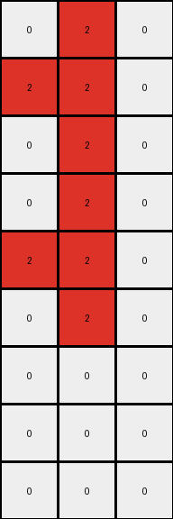

# 017c7c7b • 006 • refine_coder

---

Previous Code:
```python
"""
The program takes the input grid, increases its height by a factor of 1.5, and replaces blue pixels (1) with red pixels (2) in the corresponding rows of the output grid. White pixels (0) remain unchanged.
"""

import numpy as np

def transform(input_grid):
    # Initialize the output grid.
    input_height = input_grid.shape[0]
    input_width = input_grid.shape[1]
    output_height = int(input_height * 1.5)
    output_width = input_width
    output_grid = np.zeros((output_height, output_width), dtype=int)

    # Iterate through each pixel of the input grid.
    for i in range(input_height):
        for j in range(input_width):
            # Change output pixels: If the pixel is blue (1), change it to red (2).
            if input_grid[i, j] == 1:
                output_grid[i, j] = 2
            else:
                output_grid[i,j] = input_grid[i,j]

    return output_grid
```

Train Set Results:

## Example 1:

Input:
```
0 1 0
1 1 0
0 1 0
0 1 1
0 1 0
1 1 0
```
Expected Output:
```
0 2 0
2 2 0
0 2 0
0 2 2
0 2 0
2 2 0
0 2 0
0 2 2
0 2 0
```
Transformed Output:
```
0 2 0
2 2 0
0 2 0
0 2 2
0 2 0
2 2 0
0 0 0
0 0 0
0 0 0
```

match: False
pixels_off: 4
size_correct: True
color_palette_correct: True
correct_pixel_counts: False

## Example 2:

Input:
```
0 1 0
1 0 1
0 1 0
1 0 1
0 1 0
1 0 1
```
Expected Output:
```
0 2 0
2 0 2
0 2 0
2 0 2
0 2 0
2 0 2
0 2 0
2 0 2
0 2 0
```
Transformed Output:
```
0 2 0
2 0 2
0 2 0
2 0 2
0 2 0
2 0 2
0 0 0
0 0 0
0 0 0
```

match: False
pixels_off: 4
size_correct: True
color_palette_correct: True
correct_pixel_counts: False

## Example 3:

Input:
```
0 1 0
1 1 0
0 1 0
0 1 0
1 1 0
0 1 0
```
Expected Output:
```
0 2 0
2 2 0
0 2 0
0 2 0
2 2 0
0 2 0
0 2 0
2 2 0
0 2 0
```
Transformed Output:
```
0 2 0
2 2 0
0 2 0
0 2 0
2 2 0
0 2 0
0 0 0
0 0 0
0 0 0
```

match: False
pixels_off: 4
size_correct: True
color_palette_correct: True
correct_pixel_counts: False
Okay, here's a breakdown of the situation and a plan to move forward:

**General Assessment and Strategy:**

The initial code was a good start, correctly identifying the color change (blue to red) and attempting to increase the height. However, it's clear the height increase logic is incorrect. It increases the height to 1.5x the original and fills the added rows with zeros, but it doesn't correctly replicate the pattern from the input to the output in the extended rows. The core issue is that the additional rows in the output are not simply blank; they mirror the pattern of color changes in a specific way.  We need to identify *how* the output rows are generated based on the input rows.

**Metrics and Observations (per example):**

Here's a more detailed look at each example, focusing on the relationship between input and output rows:

*   **Example 1:**
    *   Input Height: 6, Output Height: 9 (Ratio: 1.5)
    *   The pattern of red (originally blue) pixels seems to be repeated. The output essentially repeats the input pattern, adding rows that maintain the relative positioning of the reds.
    * We need to know if this is an every other copy, or if there is a modulo effect.
    * The original hypothesis about additional rows being all zero is false.

*   **Example 2:**
    *   Input Height: 6, Output Height: 9 (Ratio: 1.5)
    *   Similar to example 1, the pattern of red pixels is continued into the added rows.
    *   Again, the naive 1.5x height increase with zero-filling is incorrect.

*   **Example 3:**
    *   Input Height: 6, Output Height: 9 (Ratio: 1.5)
    *   Same observations as Examples 1 & 2 apply. The core pattern of the input is maintained and extended in the output.

**YAML Fact Block:**

```yaml
task_id: 004-py_02
objects:
  - id: input_grid
    type: grid
    properties:
      colors: [white, blue]
      height: variable (6 in examples)
      width: constant (3 in examples)
  - id: output_grid
    type: grid
    properties:
      colors: [white, red]
      height: 1.5 * input_grid.height
      width: same as input_grid.width
actions:
  - name: color_substitution
    input: input_grid
    output: output_grid
    description: Blue pixels in the input become red pixels in the output.
  - name: row_extension
    input: input_grid
    output: output_grid
    description: >
      The output grid's height is 1.5 times the input grid's height. The pattern
      of color changes (blue to red) is extended to the new rows.  The new rows
      are NOT simply filled with zeros. The original input pattern is repeated.
```

**Natural Language Program:**

1.  **Color Transformation:** For every pixel in the input grid, if the pixel is blue (1), change it to red (2) in the corresponding location of the output grid. If the pixel is not blue, keep its original value in the output grid.

2.  **Height Extension:** The output grid's height is 1.5 times the input grid's height. The pattern is extended. If the input is `n` rows and the output `m`, then, output row `i` equals input row `i mod n`. The modulo provides the correct copy of the input row for each output row.

3. **Width Preservation**: Keep the width the same.

**Summary**
The key update is to the Height Extension - using the modulo operation.
The original program assumed that extra space would be empty, but this shows
the importance of determining the *generation* of output from input.

**INSTRUCTIONS**

- generate a Python module to represent the natural language program 
- follow the template below
- all common math and science libraries are available
- create docstring only at top - but comment the workflow in the function
- use helper functions for common operations like finding objects, counting,
  measuring, moving, etc. 

remember - we are working iteratively - so this code will inform your future
self as we converge on the solution

*template:*

```python
"""
{{ natural language description of the transformation rule }}
"""

{{ imports }}

def transform(input_grid):
    # initialize output_grid

    # change output pixels 

    return output_grid

```
