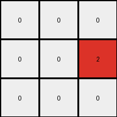

# 0520fde7 • 015 • refine_dreamer

---

Previous Code:
```python
"""
1.  **Identify the vertical gray stripe:** Find the complete vertical stripe in the input grid which contains only the color gray (value 5).
2. **Identify horizontal runs of blue adjacent to gray:** Find locations to either the left, or the right of this stripe where there are 1 or more blue pixels. Consider only the rows which have the vertical gray stripe.
3.  **Create the output grid:** Create an output grid with dimensions of 3x3, and fill it all with white (0) pixels.
4.  **Transform Blue Runs to Red:** For each segment, or a group of blue pixels, transform one white pixel in the output to red (value 2), at the equivalent row index. In case of multiple blue pixel segments on different sides of gray, consider each segment separately, putting a red pixel on the left column if blue is to the left of the gray segment, and a red pixel on the right if blue is to the right of the gray column.
"""

import numpy as np

def find_vertical_stripe(grid, color):
    # Find the complete vertical stripe of a specific color.
    rows, cols = grid.shape
    for j in range(cols):
        if all(grid[i, j] == color for i in range(rows)):
            return j
    return -1

def transform(input_grid):
    # initialize output_grid
    output_grid = np.zeros((3, 3), dtype=int)
    rows, cols = input_grid.shape

    # Find the vertical gray stripe (color 5).
    gray_stripe_col = find_vertical_stripe(input_grid, 5)

    if gray_stripe_col == -1:
        return output_grid  # No gray stripe found.

    # Identify horizontal runs of blue (color 1) adjacent to the gray stripe.
    for i in range(rows):
        if gray_stripe_col > 0 and input_grid[i, gray_stripe_col - 1] == 1:
           output_grid[i,0] = 2
        if gray_stripe_col < cols - 1 and input_grid[i, gray_stripe_col + 1] == 1:
           output_grid[i,2] = 2
    
    return output_grid
```

Train Set Results:

## Example 1:

Input:
```
1 0 0 5 0 1 0
0 1 0 5 1 1 1
1 0 0 5 0 0 0
```
Expected Output:
```
0 0 0
0 2 0
0 0 0
```
Transformed Output:
```
0 0 0
0 0 2
0 0 0
```

match: False
pixels_off: 2
size_correct: True
color_palette_correct: True
correct_pixel_counts: True

## Example 2:

Input:
```
1 1 0 5 0 1 0
0 0 1 5 1 1 1
1 1 0 5 0 1 0
```
Expected Output:
```
0 2 0
0 0 2
0 2 0
```
Transformed Output:
```
0 0 0
2 0 2
0 0 0
```

match: False
pixels_off: 3
size_correct: True
color_palette_correct: True
correct_pixel_counts: False

## Example 3:

Input:
```
0 0 1 5 0 0 0
1 1 0 5 1 0 1
0 1 1 5 1 0 1
```
Expected Output:
```
0 0 0
2 0 0
0 0 2
```
Transformed Output:
```
2 0 0
0 0 2
2 0 2
```

match: False
pixels_off: 4
size_correct: True
color_palette_correct: True
correct_pixel_counts: False
**INSTRUCTIONS**

The code above was generated based on observations from the first training
example

we have tested the transform function on each of the task example inputs and
compared with the expected output

review each of the examples provided and the results and consider how the
natural language program should be updated to accommodate this new knowledge

respond with the following deliverables:

- general assessment of the information provided and strategy for resolving the
  errors
- gather metrics about each of the examples and results - use code_execution to
  develop accurate reports on your assumptions
- a YAML block documenting facts - Focus on identifying objects, their properties, and the actions performed on them.
- a natural language program - Be as clear and concise as possible, providing a complete description of the transformation rule.


your responses should be considered as information in a report - not a
conversation
