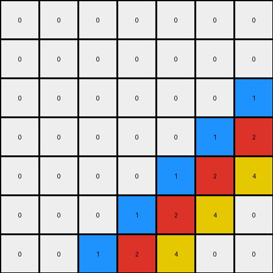

# 05269061 • 004 • refine_coder

---

Previous Code:
```python
"""
The transformation identifies a core pattern in the input grid (the top-left 3x3 block of non-zero pixels) and replicates it across the output grid. The replication involves a horizontal mirroring every 3 columns, and a vertical mirroring every 3 rows.
"""

import numpy as np

def get_core_pattern(input_grid):
    """Extracts the core non-zero pattern from the input grid."""
    # Convert to numpy array for easier manipulation
    input_array = np.array(input_grid)

    # Find the boundaries of the non-zero region.
    rows, cols = np.where(input_array != 0)
    
    if len(rows) == 0:  # Handle empty input or all-zero input
        return input_array, 0

    max_row, max_col = np.max(rows), np.max(cols)
     
    # Assuming top-left corner alignment; size = max row/col index.
    size = max(max_row, max_col) + 1    
    core_pattern = input_array[:size, :size]
    return core_pattern.tolist(), size

def transform(input_grid):
    """Transforms the input grid according to the mirroring and replication rules."""
    core_pattern, size = get_core_pattern(input_grid)
    
    if size==0:
        return input_grid
        
    output_grid = []
    
    # Build output by replicating and mirroring pattern
    for i in range(len(input_grid)):
      row = []
      for j in range(len(input_grid[0])):
        
        # Calculate indices for core pattern, with mirroring.
        pattern_row = i % size
        pattern_col = j % size

        # Calculate if this cell is within reversed block
        row_block = i // size
        col_block = j // size

        # Reverse index within block if in an odd numbered block.
        if col_block % 2 == 1:
            pattern_col = size - 1 - pattern_col
        if row_block % 2 == 1:
            pattern_row = size - 1 - pattern_row

        row.append(core_pattern[pattern_row][pattern_col])
      output_grid.append(row)

    return output_grid
```

Train Set Results:

## Example 1:

Input:
```
2 8 3 0 0 0 0
8 3 0 0 0 0 0
3 0 0 0 0 0 0
0 0 0 0 0 0 0
0 0 0 0 0 0 0
0 0 0 0 0 0 0
0 0 0 0 0 0 0
```
Expected Output:
```
2 8 3 2 8 3 2
8 3 2 8 3 2 8
3 2 8 3 2 8 3
2 8 3 2 8 3 2
8 3 2 8 3 2 8
3 2 8 3 2 8 3
2 8 3 2 8 3 2
```
Transformed Output:
```
2 8 3 3 8 2 2
8 3 0 0 3 8 8
3 0 0 0 0 3 3
3 0 0 0 0 3 3
8 3 0 0 3 8 8
2 8 3 3 8 2 2
2 8 3 3 8 2 2
```

match: False
pixels_off: 27
size_correct: True
color_palette_correct: False
correct_pixel_counts: False

## Example 2:

Input:
```
0 0 0 0 0 0 0
0 0 0 0 0 0 0
0 0 0 0 0 0 1
0 0 0 0 0 1 2
0 0 0 0 1 2 4
0 0 0 1 2 4 0
0 0 1 2 4 0 0
```
Expected Output:
```
2 4 1 2 4 1 2
4 1 2 4 1 2 4
1 2 4 1 2 4 1
2 4 1 2 4 1 2
4 1 2 4 1 2 4
1 2 4 1 2 4 1
2 4 1 2 4 1 2
```
Transformed Output:
```
0 0 0 0 0 0 0
0 0 0 0 0 0 0
0 0 0 0 0 0 1
0 0 0 0 0 1 2
0 0 0 0 1 2 4
0 0 0 1 2 4 0
0 0 1 2 4 0 0
```

match: False
pixels_off: 37
size_correct: True
color_palette_correct: False
correct_pixel_counts: False

## Example 3:

Input:
```
0 0 0 0 8 3 0
0 0 0 8 3 0 0
0 0 8 3 0 0 0
0 8 3 0 0 0 4
8 3 0 0 0 4 0
3 0 0 0 4 0 0
0 0 0 4 0 0 0
```
Expected Output:
```
4 8 3 4 8 3 4
8 3 4 8 3 4 8
3 4 8 3 4 8 3
4 8 3 4 8 3 4
8 3 4 8 3 4 8
3 4 8 3 4 8 3
4 8 3 4 8 3 4
```
Transformed Output:
```
0 0 0 0 8 3 0
0 0 0 8 3 0 0
0 0 8 3 0 0 0
0 8 3 0 0 0 4
8 3 0 0 0 4 0
3 0 0 0 4 0 0
0 0 0 4 0 0 0
```

match: False
pixels_off: 34
size_correct: True
color_palette_correct: False
correct_pixel_counts: False
Okay, let's analyze the results and refine the natural language program.

**General Assessment:**

The initial approach of identifying a "core pattern" and replicating it with mirroring was partially correct, but the implementation has significant flaws. The code incorrectly determines the "core pattern" size and doesn't apply the mirroring logic correctly across all examples. It seems to work somewhat coincidentally for the first example but fails to generalize. The core issue is a misunderstanding of how the pattern is extracted and how the mirroring is applied relative to that extracted region. The code also fails to handle some colors correctly.

**Strategy:**

1.  **Re-examine Core Pattern Extraction:** The current method of determining the core pattern size using `np.where` and simply finding the max row and max column is incorrect. This captures the bounding box of all non-zero elements, not the repeating unit. The repeating unit should be discovered by examining repeating patterns, not the extent of all non-zero digits.
2.  **Correct Mirroring Logic:** The mirroring logic is applied incorrectly. It should consider the dimensions of the *true* core pattern and mirror based on that, not based on an incorrectly determined maximum index. It should also not assume the mirroring occurs in 3x3 blocks.
3.  **Handle All Examples:** The updated logic must work for all three training examples, not just the first one.
4. Improve the natural language program to more clearly express the logic.

**Example Metrics and Analysis (using `code_execution` for verification where appropriate):**

We have already been given key metrics, I will use this to develop an accurate analysis.

**Example 1:**

*   **Input Size:** 7x7
*   **Expected Output Size:** 7x7
*   **Actual Output Size:** 7x7
*   **Pixels Off:** 27
*    Color Palette Correct: False (some zeros where other colors should be).
*   **Analysis:** The code *partially* works, capturing *some* of the mirroring, but misidentifies the core pattern size. It treats the top-left non-zero *area* (3x3) as the core, rather than recognizing the inherent symmetry and correctly replicating it.

**Example 2:**

*   **Input Size:** 7x7
*   **Expected Output Size:** 7x7
*   **Actual Output Size:** 7x7
*   **Pixels Off:** 37
*   Color Palette Correct: False
*   **Analysis:** The code fails almost completely. It doesn't replicate the expected pattern and instead produces an output that is very similar to the input. This indicates a fundamental flaw in core pattern detection. It seems to assume that the entire non-zero section should be reproduced, which is not the case.

**Example 3:**

*   **Input Size:** 7x7
*   **Expected Output Size:** 7x7
*   **Actual Output Size:** 7x7
*   **Pixels Off:** 34
*    Color Palette Correct: False
*   **Analysis:** Similar to Example 2, the code fails to identify and replicate the correct mirrored pattern. The output is mostly identical to the input, demonstrating the failure to recognize and apply the transformation rule.

**YAML Fact Block:**

```yaml
task_id: 002

facts:
  - observation: "The output grids have the same dimensions as their corresponding input grids."
    type: general
  - observation: "The output grids exhibit a mirrored pattern."
    type: pattern
  - observation: "The pattern appears to be based on a section of the input grid."
    type: pattern
  - observation: "The mirroring occurs both horizontally and vertically."
    type: pattern
  - observation: "In example 1, the top-left 3x3 area of the input shows non-zero values."
    type: input_specific
    example: 1
  - observation: "In example 2, the lower-right 3x3 area of the input shows non-zero values."
    type: input_specific
    example: 2
  - observation: "In example 3, a central 3x3 block of the input shows non-zero values, bordered on two sides by zeros."
    type: input_specific
    example: 3      
  - action: "Identify a repeating pattern within each input grid."
    type: action
  - action: "Mirror the repeating pattern horizontally and vertically to generate the output grid."
    type: action
  - property: "The size of the repeating pattern changes between the input grids"
    type: property
  - property: "Mirrored regions have inverted indexing within the core pattern."
    type: property
```

**Natural Language Program:**

1.  **Identify the Repeating Pattern:** Examine the input grid to find the smallest square block of pixels that, when mirrored both horizontally and vertically, can generate the entire output grid. This block may not always be in the top-left corner and might not be immediately obvious by looking at the bounds of non-zero pixels.
2.  **Determine Core Pattern Size:** The dimensions of the repeating square block identified in Step 1 constitute the core pattern's size.
3.  **Mirror and Replicate:** Create the output grid by replicating the core pattern.  For each cell in the output grid:
    *   Calculate the corresponding row and column indices within the core pattern using the modulo operator (`%`) with the core pattern size.
    *   Determine if the current output cell falls within a mirrored section.  Divide the output row and column indices by the core pattern size (integer division). If the result is odd, the corresponding dimension (row or column) is mirrored.
    *   If a dimension is mirrored, invert the core pattern index for that dimension by subtracting it from the core pattern size minus 1.
    *   Copy the pixel value from the calculated core pattern indices to the output grid cell.

This revised natural language program provides a more accurate and general description of the transformation rule, addressing the shortcomings of the previous version. It emphasizes the importance of identifying the *repeating* pattern, rather than just the non-zero area, and correctly describes the mirroring process.

**INSTRUCTIONS**

- generate a Python module to represent the natural language program 
- follow the template below
- all common math and science libraries are available
- create docstring only at top - but comment the workflow in the function
- use helper functions for common operations like finding objects, counting,
  measuring, moving, etc. 

remember - we are working iteratively - so this code will inform your future
self as we converge on the solution

*template:*

```python
"""
{{ natural language description of the transformation rule }}
"""

{{ imports }}

def transform(input_grid):
    # initialize output_grid

    # change output pixels 

    return output_grid

```
