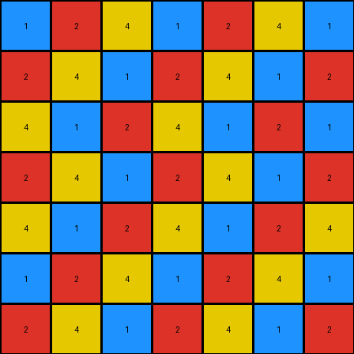
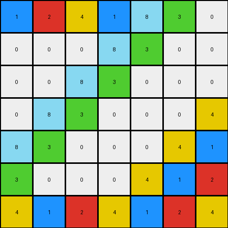

# 05269061 • 009 • refine_dreamer

---

Previous Code:
```python
"""
Transforms an input grid with a diagonal sequence of numbers (1, 2, 4) and 0s into an output grid with a repeating checkerboard-like pattern of 1, 2, and 4, maintaining the original positions of 1, 2, and 4 from the input.
"""

import numpy as np

def transform(input_grid):
    # Initialize output_grid with the same dimensions as input_grid
    output_grid = np.copy(input_grid)
    rows, cols = input_grid.shape
    
    # Initialize the starting value for the sequence
    prev_val = 4

    # Iterate through each cell of the grid
    for i in range(rows):
        for j in range(cols):
            # If the input cell is 0, fill with the repeating pattern
            if input_grid[i, j] == 0:
                if (i + j) % 2 == 0:  # Even sum of indices
                    if prev_val == 1:
                        output_grid[i,j] = 2
                        prev_val = 2
                    elif prev_val == 2:
                        output_grid[i,j] = 4
                        prev_val = 4
                    elif prev_val == 4:
                        output_grid[i,j] = 1
                        prev_val = 1
                else:  # Odd sum of indices
                    if prev_val == 1:
                        output_grid[i,j] = 2
                        prev_val = 2
                    elif prev_val == 2:
                        output_grid[i,j] = 4
                        prev_val = 4
                    elif prev_val == 4:
                        output_grid[i,j] = 1
                        prev_val = 1

            else:
                prev_val = input_grid[i,j] # set sequence start based on input


    return output_grid
```

Train Set Results:

## Example 1:

Input:
```
2 8 3 0 0 0 0
8 3 0 0 0 0 0
3 0 0 0 0 0 0
0 0 0 0 0 0 0
0 0 0 0 0 0 0
0 0 0 0 0 0 0
0 0 0 0 0 0 0
```
Expected Output:
```
2 8 3 2 8 3 2
8 3 2 8 3 2 8
3 2 8 3 2 8 3
2 8 3 2 8 3 2
8 3 2 8 3 2 8
3 2 8 3 2 8 3
2 8 3 2 8 3 2
```
Transformed Output:
```
2 8 3 0 0 0 0
8 3 0 0 0 0 0
3 0 0 0 0 0 0
0 0 0 0 0 0 0
0 0 0 0 0 0 0
0 0 0 0 0 0 0
0 0 0 0 0 0 0
```

match: False
pixels_off: 43
size_correct: True
color_palette_correct: False
correct_pixel_counts: False

## Example 2:

Input:
```
0 0 0 0 0 0 0
0 0 0 0 0 0 0
0 0 0 0 0 0 1
0 0 0 0 0 1 2
0 0 0 0 1 2 4
0 0 0 1 2 4 0
0 0 1 2 4 0 0
```
Expected Output:
```
2 4 1 2 4 1 2
4 1 2 4 1 2 4
1 2 4 1 2 4 1
2 4 1 2 4 1 2
4 1 2 4 1 2 4
1 2 4 1 2 4 1
2 4 1 2 4 1 2
```
Transformed Output:
```
1 2 4 1 2 4 1
2 4 1 2 4 1 2
4 1 2 4 1 2 1
2 4 1 2 4 1 2
4 1 2 4 1 2 4
1 2 4 1 2 4 1
2 4 1 2 4 1 2
```

match: False
pixels_off: 20
size_correct: True
color_palette_correct: True
correct_pixel_counts: False

## Example 3:

Input:
```
0 0 0 0 8 3 0
0 0 0 8 3 0 0
0 0 8 3 0 0 0
0 8 3 0 0 0 4
8 3 0 0 0 4 0
3 0 0 0 4 0 0
0 0 0 4 0 0 0
```
Expected Output:
```
4 8 3 4 8 3 4
8 3 4 8 3 4 8
3 4 8 3 4 8 3
4 8 3 4 8 3 4
8 3 4 8 3 4 8
3 4 8 3 4 8 3
4 8 3 4 8 3 4
```
Transformed Output:
```
1 2 4 1 8 3 0
0 0 0 8 3 0 0
0 0 8 3 0 0 0
0 8 3 0 0 0 4
8 3 0 0 0 4 1
3 0 0 0 4 1 2
4 1 2 4 1 2 4
```

match: False
pixels_off: 32
size_correct: True
color_palette_correct: False
correct_pixel_counts: False
**INSTRUCTIONS**

The code above was generated based on observations from the first training
example

we have tested the transform function on each of the task example inputs and
compared with the expected output

review each of the examples provided and the results and consider how the
natural language program should be updated to accommodate this new knowledge

respond with the following deliverables:

- general assessment of the information provided and strategy for resolving the
  errors
- gather metrics about each of the examples and results - use code_execution to
  develop accurate reports on your assumptions
- a YAML block documenting facts - Focus on identifying objects, their properties, and the actions performed on them.
- a natural language program - Be as clear and concise as possible, providing a complete description of the transformation rule.


your responses should be considered as information in a report - not a
conversation
