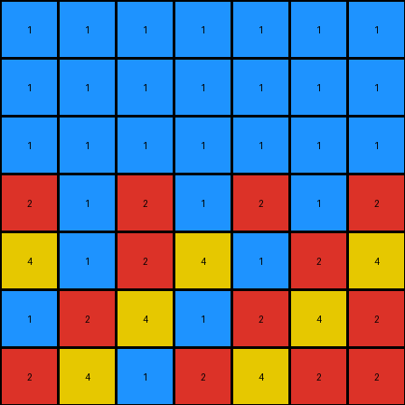

# 05269061 • 011 • refine_dreamer

---

Previous Code:
```python
"""
Copies non-zero pixels from the input grid to the output grid,
then fills zero-valued pixels by repeating nearby non-zero color sequences.
"""

import numpy as np

def get_sequences(input_grid):
    """
    Identifies sequences of non-zero pixels in the input grid.
    """
    rows, cols = input_grid.shape
    sequences = []

    # Horizontal sequences
    for r in range(rows):
        current_sequence = []
        for c in range(cols):
            if input_grid[r, c] != 0:
                current_sequence.append((r, c, input_grid[r, c]))
            elif current_sequence:
                sequences.append(current_sequence)
                current_sequence = []
        if current_sequence:  # Handle sequences at the end of rows
            sequences.append(current_sequence)

    # Vertical sequences
    for c in range(cols):
        current_sequence = []
        for r in range(rows):
            if input_grid[r, c] != 0:
                current_sequence.append((r, c, input_grid[r, c]))
            elif current_sequence:
                sequences.append(current_sequence)
                current_sequence = []
        if current_sequence: # Handle sequences at the end of columns.
            sequences.append(current_sequence)
    return sequences

def transform(input_grid):
    # Initialize output_grid as a copy of input_grid
    output_grid = np.copy(input_grid)
    rows, cols = input_grid.shape

    # Get the initial sequences
    sequences = get_sequences(input_grid)
    
    # Fill the 0 pixels
    for r in range(rows):
        for c in range(cols):
            if output_grid[r,c] == 0:
                #find closest sequence and continue it

                best_sequence = None
                min_dist = float('inf')

                for seq in sequences:
                    for r_seq, c_seq, val_seq in seq:
                        dist = abs(r - r_seq) + abs(c-c_seq)
                        if dist < min_dist:
                            min_dist = dist
                            best_sequence = seq

                if best_sequence:
                    #calculate index in sequence
                    seq_len = len(best_sequence)

                    #find closest element index
                    closest_index = -1
                    min_seq_dist = float('inf')
                    for i in range(seq_len):
                        r_seq, c_seq, _ = best_sequence[i]

                        dist =  abs(r-r_seq) + abs(c-c_seq)

                        if dist < min_seq_dist:
                            min_seq_dist = dist
                            closest_index = i
                    
                    # extend based on direction, calculate offset
                    r_seq_start, c_seq_start, _ = best_sequence[0]
                    
                    if r_seq_start == best_sequence[-1][0]: #horizontal
                        offset = c - c_seq_start
                    elif c_seq_start == best_sequence[-1][1]: #vertical
                        offset = r - r_seq_start
                    else: # single element, repeat value
                        offset = 0


                    index = (closest_index + offset) % seq_len
                    output_grid[r,c] = best_sequence[abs(index)][2]


    return output_grid
```

Train Set Results:

## Example 1:

Input:
```
2 8 3 0 0 0 0
8 3 0 0 0 0 0
3 0 0 0 0 0 0
0 0 0 0 0 0 0
0 0 0 0 0 0 0
0 0 0 0 0 0 0
0 0 0 0 0 0 0
```
Expected Output:
```
2 8 3 2 8 3 2
8 3 2 8 3 2 8
3 2 8 3 2 8 3
2 8 3 2 8 3 2
8 3 2 8 3 2 8
3 2 8 3 2 8 3
2 8 3 2 8 3 2
```
Transformed Output:
```
2 8 3 3 2 8 3
8 3 8 3 2 8 3
3 8 8 3 2 8 3
3 8 8 3 2 8 3
3 8 8 3 2 8 3
3 8 8 3 2 8 3
3 8 8 3 2 8 3
```

match: False
pixels_off: 30
size_correct: True
color_palette_correct: True
correct_pixel_counts: False

## Example 2:

Input:
```
0 0 0 0 0 0 0
0 0 0 0 0 0 0
0 0 0 0 0 0 1
0 0 0 0 0 1 2
0 0 0 0 1 2 4
0 0 0 1 2 4 0
0 0 1 2 4 0 0
```
Expected Output:
```
2 4 1 2 4 1 2
4 1 2 4 1 2 4
1 2 4 1 2 4 1
2 4 1 2 4 1 2
4 1 2 4 1 2 4
1 2 4 1 2 4 1
2 4 1 2 4 1 2
```
Transformed Output:
```
1 1 1 1 1 1 1
1 1 1 1 1 1 1
1 1 1 1 1 1 1
2 1 2 1 2 1 2
4 1 2 4 1 2 4
1 2 4 1 2 4 2
2 4 1 2 4 2 2
```

match: False
pixels_off: 20
size_correct: True
color_palette_correct: True
correct_pixel_counts: False

## Example 3:

Input:
```
0 0 0 0 8 3 0
0 0 0 8 3 0 0
0 0 8 3 0 0 0
0 8 3 0 0 0 4
8 3 0 0 0 4 0
3 0 0 0 4 0 0
0 0 0 4 0 0 0
```
Expected Output:
```
4 8 3 4 8 3 4
8 3 4 8 3 4 8
3 4 8 3 4 8 3
4 8 3 4 8 3 4
8 3 4 8 3 4 8
3 4 8 3 4 8 3
4 8 3 4 8 3 4
```
Transformed Output:
```
8 3 8 3 8 3 3
3 8 3 8 3 8 3
8 3 8 3 8 8 4
3 8 3 8 8 4 4
8 3 8 8 4 4 4
3 8 8 4 4 4 4
3 8 4 4 4 4 4
```

match: False
pixels_off: 28
size_correct: True
color_palette_correct: True
correct_pixel_counts: False
**INSTRUCTIONS**

The code above was generated based on observations from the first training
example

we have tested the transform function on each of the task example inputs and
compared with the expected output

review each of the examples provided and the results and consider how the
natural language program should be updated to accommodate this new knowledge

respond with the following deliverables:

- general assessment of the information provided and strategy for resolving the
  errors
- gather metrics about each of the examples and results - use code_execution to
  develop accurate reports on your assumptions
- a YAML block documenting facts - Focus on identifying objects, their properties, and the actions performed on them.
- a natural language program - Be as clear and concise as possible, providing a complete description of the transformation rule.


your responses should be considered as information in a report - not a
conversation
