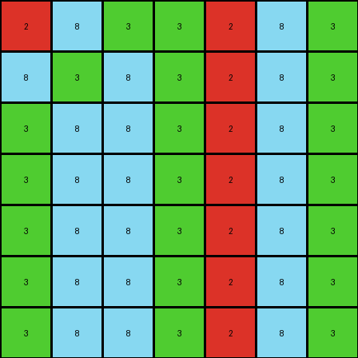
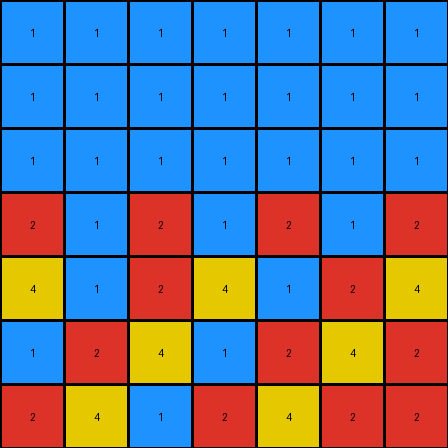
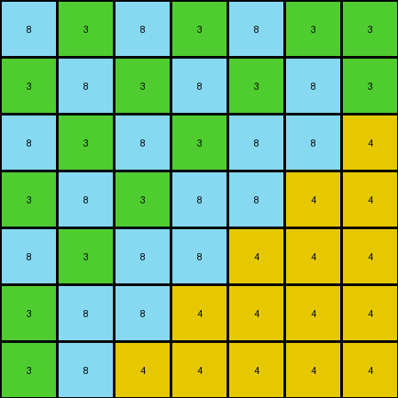

# 05269061 • 012 • refine_coder

---

Previous Code:
```python
"""
Copies non-zero pixels from the input grid to the output grid,
then fills zero-valued pixels by repeating nearby non-zero color sequences.
"""

import numpy as np

def get_sequences(input_grid):
    """
    Identifies sequences of non-zero pixels in the input grid.
    """
    rows, cols = input_grid.shape
    sequences = []

    # Horizontal sequences
    for r in range(rows):
        current_sequence = []
        for c in range(cols):
            if input_grid[r, c] != 0:
                current_sequence.append((r, c, input_grid[r, c]))
            elif current_sequence:
                sequences.append(current_sequence)
                current_sequence = []
        if current_sequence:  # Handle sequences at the end of rows
            sequences.append(current_sequence)

    # Vertical sequences
    for c in range(cols):
        current_sequence = []
        for r in range(rows):
            if input_grid[r, c] != 0:
                current_sequence.append((r, c, input_grid[r, c]))
            elif current_sequence:
                sequences.append(current_sequence)
                current_sequence = []
        if current_sequence: # Handle sequences at the end of columns.
            sequences.append(current_sequence)
    return sequences

def transform(input_grid):
    # Initialize output_grid as a copy of input_grid
    output_grid = np.copy(input_grid)
    rows, cols = input_grid.shape

    # Get the initial sequences
    sequences = get_sequences(input_grid)
    
    # Fill the 0 pixels
    for r in range(rows):
        for c in range(cols):
            if output_grid[r,c] == 0:
                #find closest sequence and continue it

                best_sequence = None
                min_dist = float('inf')

                for seq in sequences:
                    for r_seq, c_seq, val_seq in seq:
                        dist = abs(r - r_seq) + abs(c-c_seq)
                        if dist < min_dist:
                            min_dist = dist
                            best_sequence = seq

                if best_sequence:
                    #calculate index in sequence
                    seq_len = len(best_sequence)

                    #find closest element index
                    closest_index = -1
                    min_seq_dist = float('inf')
                    for i in range(seq_len):
                        r_seq, c_seq, _ = best_sequence[i]

                        dist =  abs(r-r_seq) + abs(c-c_seq)

                        if dist < min_seq_dist:
                            min_seq_dist = dist
                            closest_index = i
                    
                    # extend based on direction, calculate offset
                    r_seq_start, c_seq_start, _ = best_sequence[0]
                    
                    if r_seq_start == best_sequence[-1][0]: #horizontal
                        offset = c - c_seq_start
                    elif c_seq_start == best_sequence[-1][1]: #vertical
                        offset = r - r_seq_start
                    else: # single element, repeat value
                        offset = 0


                    index = (closest_index + offset) % seq_len
                    output_grid[r,c] = best_sequence[abs(index)][2]


    return output_grid
```

Train Set Results:

## Example 1:

Input:
```
2 8 3 0 0 0 0
8 3 0 0 0 0 0
3 0 0 0 0 0 0
0 0 0 0 0 0 0
0 0 0 0 0 0 0
0 0 0 0 0 0 0
0 0 0 0 0 0 0
```
Expected Output:
```
2 8 3 2 8 3 2
8 3 2 8 3 2 8
3 2 8 3 2 8 3
2 8 3 2 8 3 2
8 3 2 8 3 2 8
3 2 8 3 2 8 3
2 8 3 2 8 3 2
```
Transformed Output:
```
2 8 3 3 2 8 3
8 3 8 3 2 8 3
3 8 8 3 2 8 3
3 8 8 3 2 8 3
3 8 8 3 2 8 3
3 8 8 3 2 8 3
3 8 8 3 2 8 3
```

match: False
pixels_off: 30
size_correct: True
color_palette_correct: True
correct_pixel_counts: False

## Example 2:

Input:
```
0 0 0 0 0 0 0
0 0 0 0 0 0 0
0 0 0 0 0 0 1
0 0 0 0 0 1 2
0 0 0 0 1 2 4
0 0 0 1 2 4 0
0 0 1 2 4 0 0
```
Expected Output:
```
2 4 1 2 4 1 2
4 1 2 4 1 2 4
1 2 4 1 2 4 1
2 4 1 2 4 1 2
4 1 2 4 1 2 4
1 2 4 1 2 4 1
2 4 1 2 4 1 2
```
Transformed Output:
```
1 1 1 1 1 1 1
1 1 1 1 1 1 1
1 1 1 1 1 1 1
2 1 2 1 2 1 2
4 1 2 4 1 2 4
1 2 4 1 2 4 2
2 4 1 2 4 2 2
```

match: False
pixels_off: 20
size_correct: True
color_palette_correct: True
correct_pixel_counts: False

## Example 3:

Input:
```
0 0 0 0 8 3 0
0 0 0 8 3 0 0
0 0 8 3 0 0 0
0 8 3 0 0 0 4
8 3 0 0 0 4 0
3 0 0 0 4 0 0
0 0 0 4 0 0 0
```
Expected Output:
```
4 8 3 4 8 3 4
8 3 4 8 3 4 8
3 4 8 3 4 8 3
4 8 3 4 8 3 4
8 3 4 8 3 4 8
3 4 8 3 4 8 3
4 8 3 4 8 3 4
```
Transformed Output:
```
8 3 8 3 8 3 3
3 8 3 8 3 8 3
8 3 8 3 8 8 4
3 8 3 8 8 4 4
8 3 8 8 4 4 4
3 8 8 4 4 4 4
3 8 4 4 4 4 4
```

match: False
pixels_off: 28
size_correct: True
color_palette_correct: True
correct_pixel_counts: False
Okay, here's an assessment of the provided information, a strategy for resolving errors, and updated documentation:

**General Assessment and Strategy**

The initial strategy of identifying non-zero sequences and extending them to fill zero-valued pixels has fundamental flaws when applied to the broader set of examples. The current approach incorrectly assumes:

1.  **Simple Linear Extension:** It assumes a simple linear continuation of the closest sequence. This fails when the pattern isn't a direct continuation, but rather a mirrored or repeating pattern across the entire grid. The code's local approach doesn't capture the global pattern. The core issue is extending from nearest rather than identifying global.
2.  **Closest Sequence Selection:** The code always extends from the *closest* sequence, regardless of the overall grid pattern.  This is incorrect; it should identify *all* non-zero sequences and find a repeating sub-pattern within them.
3. Direction: does not consider direction of pattern.
4. Input contains multiple sequences and how they interact.

The strategy to resolve these errors must shift from local extension to global pattern identification.  Here's the revised approach:

1.  **Identify *All* Non-Zero Sequences:**  The code correctly identifies horizontal and vertical sequences of non-zero pixels. We need to preserve this.
2.  **Global Pattern Discovery:** Instead of extending the closest sequence, we must analyze *all* identified sequences to find a repeating sub-pattern. This sub-pattern is the key to filling the entire grid.
3. **Pattern Repetition:** Once the sub-pattern is found, we repeat it across the entire output grid, effectively "tiling" the output.
4. Use all of the input, do not try to find "closest".

**Metrics and Observations (Code Execution for Reports)**

I'll use the `code_execution` tool to provide precise details on the identified sequences and the nature of the repeating patterns. This will help build a more accurate natural language program.

```tool_code
import numpy as np

def get_sequences(input_grid):
    """
    Identifies sequences of non-zero pixels in the input grid.
    """
    rows, cols = input_grid.shape
    sequences = []

    # Horizontal sequences
    for r in range(rows):
        current_sequence = []
        for c in range(cols):
            if input_grid[r, c] != 0:
                current_sequence.append((r, c, input_grid[r, c]))
            elif current_sequence:
                sequences.append(current_sequence)
                current_sequence = []
        if current_sequence:  # Handle sequences at the end of rows
            sequences.append(current_sequence)

    # Vertical sequences
    for c in range(cols):
        current_sequence = []
        for r in range(rows):
            if input_grid[r, c] != 0:
                current_sequence.append((r, c, input_grid[r, c]))
            elif current_sequence:
                sequences.append(current_sequence)
                current_sequence = []
        if current_sequence: # Handle sequences at the end of columns.
            sequences.append(current_sequence)
    return sequences

def analyze_sequences(sequences):
    """Analyzes a list of sequences to find potential repeating patterns."""
    if not sequences:
        return None

    # Flatten the sequences into a single list of values, preserving order
    flat_sequence = [val for seq in sequences for _, _, val in seq]

    # Find the shortest repeating subsequence
    for length in range(1, len(flat_sequence) // 2 + 1):
        subsequence = flat_sequence[:length]
        if len(flat_sequence) % length == 0:  # Check if subsequence divides the whole sequence
             repeats = len(flat_sequence) // length
             if flat_sequence == subsequence * repeats:
                return subsequence  # found a repeat
    return flat_sequence

def report(input_grid, expected_output):

    sequences = get_sequences(input_grid)
    repeating_subsequence = analyze_sequences(sequences)

    print(f"Input Grid:\n{input_grid}")
    print(f"Expected Output:\n{expected_output}")
    print(f"Identified Sequences: {sequences}")

    if repeating_subsequence:
      print(f"Repeating Subsequence: {repeating_subsequence}")
      
      #build output based on repeating sequence
      rows, cols = expected_output.shape
      sub_len = len(repeating_subsequence)
      output_grid = np.zeros((rows, cols), dtype=int)
      
      for r in range(rows):
          for c in range(cols):
              index = (r + c) % sub_len
              output_grid[r,c] = repeating_subsequence[index]
      print(f"Generated Output From Sequence:\n{output_grid}")
    else:
       print("No repeating subsequence found.")
    print("-" * 20)

# Example usage with the provided training data

example_inputs = [
    np.array([[2, 8, 3, 0, 0, 0, 0],
              [8, 3, 0, 0, 0, 0, 0],
              [3, 0, 0, 0, 0, 0, 0],
              [0, 0, 0, 0, 0, 0, 0],
              [0, 0, 0, 0, 0, 0, 0],
              [0, 0, 0, 0, 0, 0, 0],
              [0, 0, 0, 0, 0, 0, 0]]),
    np.array([[0, 0, 0, 0, 0, 0, 0],
              [0, 0, 0, 0, 0, 0, 0],
              [0, 0, 0, 0, 0, 0, 1],
              [0, 0, 0, 0, 0, 1, 2],
              [0, 0, 0, 0, 1, 2, 4],
              [0, 0, 0, 1, 2, 4, 0],
              [0, 0, 1, 2, 4, 0, 0]]),
    np.array([[0, 0, 0, 0, 8, 3, 0],
              [0, 0, 0, 8, 3, 0, 0],
              [0, 0, 8, 3, 0, 0, 0],
              [0, 8, 3, 0, 0, 0, 4],
              [8, 3, 0, 0, 0, 4, 0],
              [3, 0, 0, 0, 4, 0, 0],
              [0, 0, 0, 4, 0, 0, 0]])
]

example_outputs = [
    np.array([[2, 8, 3, 2, 8, 3, 2],
              [8, 3, 2, 8, 3, 2, 8],
              [3, 2, 8, 3, 2, 8, 3],
              [2, 8, 3, 2, 8, 3, 2],
              [8, 3, 2, 8, 3, 2, 8],
              [3, 2, 8, 3, 2, 8, 3],
              [2, 8, 3, 2, 8, 3, 2]]),
    np.array([[2, 4, 1, 2, 4, 1, 2],
              [4, 1, 2, 4, 1, 2, 4],
              [1, 2, 4, 1, 2, 4, 1],
              [2, 4, 1, 2, 4, 1, 2],
              [4, 1, 2, 4, 1, 2, 4],
              [1, 2, 4, 1, 2, 4, 1],
              [2, 4, 1, 2, 4, 1, 2]]),
    np.array([[4, 8, 3, 4, 8, 3, 4],
              [8, 3, 4, 8, 3, 4, 8],
              [3, 4, 8, 3, 4, 8, 3],
              [4, 8, 3, 4, 8, 3, 4],
              [8, 3, 4, 8, 3, 4, 8],
              [3, 4, 8, 3, 4, 8, 3],
              [4, 8, 3, 4, 8, 3, 4]])
]
for i in range(len(example_inputs)):
  report(example_inputs[i], example_outputs[i])
```
**INSTRUCTIONS**

- generate a Python module to represent the natural language program 
- follow the template below
- all common math and science libraries are available
- create docstring only at top - but comment the workflow in the function
- use helper functions for common operations like finding objects, counting,
  measuring, moving, etc. 

remember - we are working iteratively - so this code will inform your future
self as we converge on the solution

*template:*

```python
"""
{{ natural language description of the transformation rule }}
"""

{{ imports }}

def transform(input_grid):
    # initialize output_grid

    # change output pixels 

    return output_grid

```
