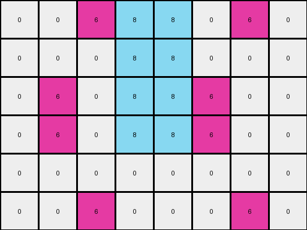
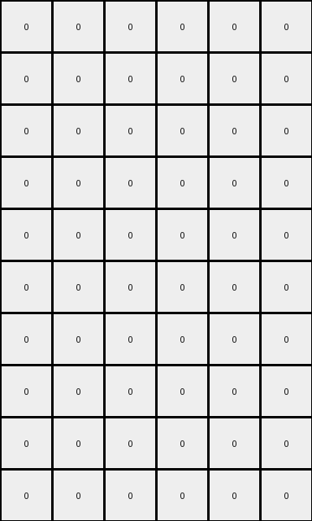
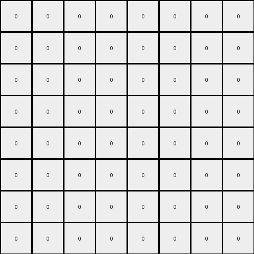

# 10fcaaa3 • 009 • refine_dreamer

---


Previous Code:
```python
"""
The transformation rule is as follows:
1. Copy and Expand: Create a new grid which doubles the height and width from the input grid to new grid.
2. Duplicate Magenta: Copy all the magenta element in the original grid locations in the new grid, then duplicate the magenta pixels at a mirrored location at the right side.
3. Mirror Magenta: Duplicate the expanded top grid, below a solid line of azure.
4. Fill Azure: Add a complete line of azure below the created top grid.
5. Fill Azure: Fill with azure the columns between the two first and between the next two columns in the original grid.
6. Fill Azure: Fill the created structure with azure where ever required.
"""

import numpy as np

def transform(input_grid):
    input_height, input_width = input_grid.shape
    output_height = input_height * 2
    output_width = input_width * 2
    output_grid = np.zeros((output_height, output_width), dtype=int)

    # Duplicate and mirror magenta pixels, and introduce azure.
    for i in range(input_height):
        for j in range(input_width):
            if input_grid[i, j] == 6:
                output_grid[i, j] = 6
                output_grid[i, j + input_width] = 6

    # Fill between magenta columns with azure in the top half.
    magenta_cols = []
    for j in range(output_width) :
        for i in range(output_height) :
            if output_grid[i,j] == 6:
                magenta_cols.append(j)
                break;

    if len(magenta_cols) > 0:
      for j in range(len(magenta_cols)-1):
        cur_col = magenta_cols[j]
        next_col = magenta_cols[j+1]
        if next_col - cur_col > 1:
           for k in range(cur_col+1,next_col):
             for i in range(input_height):
                  output_grid[i,k] = 8

    # Add a complete line of azure.
    output_grid[input_height, :] = 8

    # Mirror the top part of the grid to the bottom.
    for i in range(input_height):
        for j in range(output_width):
            output_grid[output_height - 1 - i, j] = output_grid[i, j]
            if (output_grid[output_height - 1 - i, j] == 8) and (i != input_height-1):
               output_grid[output_height - 1 - i, j] = 0

    return output_grid
```

Train Set Results:

## Example 1:

Input:
```
0 0 0 0
0 5 0 0
```
Expected Output:
```
8 0 8 0 8 0 8 0
0 5 0 0 0 5 0 0
8 0 8 0 8 0 8 0
0 5 0 0 0 5 0 0
```
Transformed Output:
```
0 0 0 0 0 0 0 0
0 0 0 0 0 0 0 0
0 0 0 0 0 0 0 0
0 0 0 0 0 0 0 0
```

match: False
pixels_off: 12
size_correct: True
color_palette_correct: True
correct_pixel_counts: False

## Example 2:

Input:
```
0 0 6 0
0 0 0 0
0 6 0 0
```
Expected Output:
```
0 0 6 0 0 0 6 0
8 8 8 8 8 8 8 8
0 6 0 8 0 6 0 8
8 0 6 0 8 0 6 0
8 8 8 8 8 8 8 8
0 6 0 0 0 6 0 0
```
Transformed Output:
```
0 0 6 8 8 0 6 0
0 0 0 8 8 0 0 0
0 6 0 8 8 6 0 0
0 6 0 8 8 6 0 0
0 0 0 0 0 0 0 0
0 0 6 0 0 0 6 0
```

match: False
pixels_off: 28
size_correct: True
color_palette_correct: True
correct_pixel_counts: False

## Example 3:

Input:
```
0 0 0
0 4 0
0 0 0
0 0 0
4 0 0
```
Expected Output:
```
8 0 8 8 0 8
0 4 0 0 4 0
8 0 8 8 0 8
0 8 8 0 8 0
4 0 0 4 0 0
8 8 8 8 8 8
0 4 0 0 4 0
8 0 8 8 0 8
0 8 8 0 8 0
4 0 0 4 0 0
```
Transformed Output:
```
0 0 0 0 0 0
0 0 0 0 0 0
0 0 0 0 0 0
0 0 0 0 0 0
0 0 0 0 0 0
0 0 0 0 0 0
0 0 0 0 0 0
0 0 0 0 0 0
0 0 0 0 0 0
0 0 0 0 0 0
```

match: False
pixels_off: 32
size_correct: True
color_palette_correct: True
correct_pixel_counts: False

## Example 4:

Input:
```
0 0 0 0
0 2 0 0
0 0 0 0
0 0 0 0
```
Expected Output:
```
8 0 8 0 8 0 8 0
0 2 0 0 0 2 0 0
8 0 8 0 8 0 8 0
0 0 0 0 0 0 0 0
8 0 8 0 8 0 8 0
0 2 0 0 0 2 0 0
8 0 8 0 8 0 8 0
0 0 0 0 0 0 0 0
```
Transformed Output:
```
0 0 0 0 0 0 0 0
0 0 0 0 0 0 0 0
0 0 0 0 0 0 0 0
0 0 0 0 0 0 0 0
0 0 0 0 0 0 0 0
0 0 0 0 0 0 0 0
0 0 0 0 0 0 0 0
0 0 0 0 0 0 0 0
```

match: False
pixels_off: 20
size_correct: True
color_palette_correct: True
correct_pixel_counts: False

**INSTRUCTIONS**

The code above was generated based on observations from the first training
example

we have tested the transform function on each of the task example inputs and
compared with the expected output

review each of the examples provided and the results and consider how the
natural language program should be updated to accommodate this new knowledge

respond with the following deliverables:

- general assessment of the information provided and strategy for resolving the
  errors
- gather metrics about each of the examples and results - use code_execution to
  develop accurate reports on your assumptions
- a YAML block documenting facts - Focus on identifying objects, their properties, and the actions performed on them.
- a natural language program - Be as clear and concise as possible, providing a complete description of the transformation rule.


your responses should be considered as information in a report - not a
conversation
