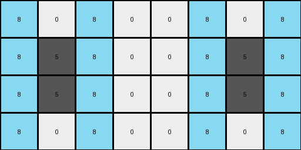
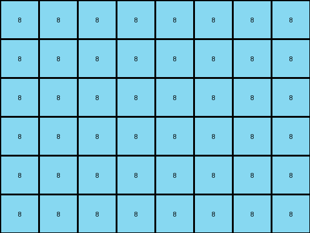
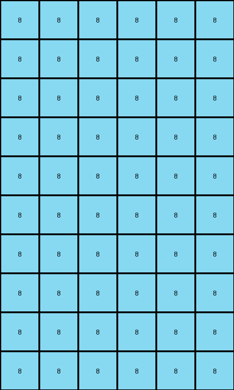
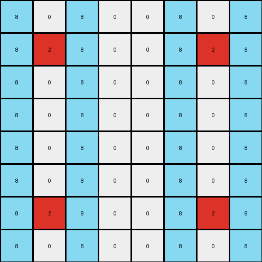

# 10fcaaa3 • 011 • refine_dreamer

---

Previous Code:
```python
"""
1.  **Expansion:** Create a new grid with double the height and width of the original grid.
2.  **Copy and Mirror Horizontally:** Copy every colored pixel (not black or white) from the input grid to the corresponding location in the new grid, and then mirror the pixel horizontally to the right side.
3.  **Azure Vertical Highlight:** In the top half of the expanded grid, add a vertical azure line on each side of *every* colored (non-black) column.
4.  **Azure Horizontal Separation:** Add a horizontal line of azure pixels across the entire width of the grid, dividing it exactly in half.
5.  **Mirror Vertically:** Mirror the top half of the grid (above the horizontal azure line) to the bottom half (below the azure line). The azure line should be at the last row index for the bottom half.
"""

import numpy as np

def get_colored_columns(grid):
    """Finds the indices of columns containing colored (non-black, non-white) pixels."""
    height, width = grid.shape
    colored_cols = []
    for j in range(width):
        for i in range(height):
            if grid[i, j] != 0 and grid[i,j] != 8:  # Not black, and not azure
                colored_cols.append(j)
                break  # Move to the next column
    return colored_cols

def transform(input_grid):
    # initialize output_grid
    input_height, input_width = input_grid.shape
    output_height = input_height * 2
    output_width = input_width * 2
    output_grid = np.zeros((output_height, output_width), dtype=int)

    # Copy and Mirror Horizontally
    for i in range(input_height):
        for j in range(input_width):
            if input_grid[i, j] != 0:  # Copy all colors except background
                output_grid[i, j] = input_grid[i, j]
                output_grid[i, output_width - 1 - j] = input_grid[i, j]

    # Azure Vertical Highlight
    colored_cols = get_colored_columns(output_grid[:input_height,:])

    for col in colored_cols:
        if col > 0 :
          for i in range(input_height):
            output_grid[i, col - 1] = 8
        if col < output_width-1:
          for i in range(input_height):
            output_grid[i, col + 1] = 8

    # Azure Horizontal Separation
    output_grid[input_height, :] = 8

    # Mirror Vertically
    for i in range(input_height):
        for j in range(output_width):
            output_grid[output_height - 1 - i, j] = output_grid[i, j]

    return output_grid
```

Train Set Results:

## Example 1:

Input:
```
0 0 0 0
0 5 0 0
```
Expected Output:
```
8 0 8 0 8 0 8 0
0 5 0 0 0 5 0 0
8 0 8 0 8 0 8 0
0 5 0 0 0 5 0 0
```
Transformed Output:
```
8 0 8 0 0 8 0 8
8 5 8 0 0 8 5 8
8 5 8 0 0 8 5 8
8 0 8 0 0 8 0 8
```

match: False
pixels_off: 19
size_correct: True
color_palette_correct: True
correct_pixel_counts: False

## Example 2:

Input:
```
0 0 6 0
0 0 0 0
0 6 0 0
```
Expected Output:
```
0 0 6 0 0 0 6 0
8 8 8 8 8 8 8 8
0 6 0 8 0 6 0 8
8 0 6 0 8 0 6 0
8 8 8 8 8 8 8 8
0 6 0 0 0 6 0 0
```
Transformed Output:
```
8 8 8 8 8 8 8 8
8 8 8 8 8 8 8 8
8 8 8 8 8 8 8 8
8 8 8 8 8 8 8 8
8 8 8 8 8 8 8 8
8 8 8 8 8 8 8 8
```

match: False
pixels_off: 28
size_correct: True
color_palette_correct: True
correct_pixel_counts: False

## Example 3:

Input:
```
0 0 0
0 4 0
0 0 0
0 0 0
4 0 0
```
Expected Output:
```
8 0 8 8 0 8
0 4 0 0 4 0
8 0 8 8 0 8
0 8 8 0 8 0
4 0 0 4 0 0
8 8 8 8 8 8
0 4 0 0 4 0
8 0 8 8 0 8
0 8 8 0 8 0
4 0 0 4 0 0
```
Transformed Output:
```
8 8 8 8 8 8
8 8 8 8 8 8
8 8 8 8 8 8
8 8 8 8 8 8
8 8 8 8 8 8
8 8 8 8 8 8
8 8 8 8 8 8
8 8 8 8 8 8
8 8 8 8 8 8
8 8 8 8 8 8
```

match: False
pixels_off: 36
size_correct: True
color_palette_correct: True
correct_pixel_counts: False

## Example 4:

Input:
```
0 0 0 0
0 2 0 0
0 0 0 0
0 0 0 0
```
Expected Output:
```
8 0 8 0 8 0 8 0
0 2 0 0 0 2 0 0
8 0 8 0 8 0 8 0
0 0 0 0 0 0 0 0
8 0 8 0 8 0 8 0
0 2 0 0 0 2 0 0
8 0 8 0 8 0 8 0
0 0 0 0 0 0 0 0
```
Transformed Output:
```
8 0 8 0 0 8 0 8
8 2 8 0 0 8 2 8
8 0 8 0 0 8 0 8
8 0 8 0 0 8 0 8
8 0 8 0 0 8 0 8
8 0 8 0 0 8 0 8
8 2 8 0 0 8 2 8
8 0 8 0 0 8 0 8
```

match: False
pixels_off: 35
size_correct: True
color_palette_correct: True
correct_pixel_counts: False
**INSTRUCTIONS**

The code above was generated based on observations from the first training
example

we have tested the transform function on each of the task example inputs and
compared with the expected output

review each of the examples provided and the results and consider how the
natural language program should be updated to accommodate this new knowledge

respond with the following deliverables:

- general assessment of the information provided and strategy for resolving the
  errors
- gather metrics about each of the examples and results - use code_execution to
  develop accurate reports on your assumptions
- a YAML block documenting facts - Focus on identifying objects, their properties, and the actions performed on them.
- a natural language program - Be as clear and concise as possible, providing a complete description of the transformation rule.


your responses should be considered as information in a report - not a
conversation
