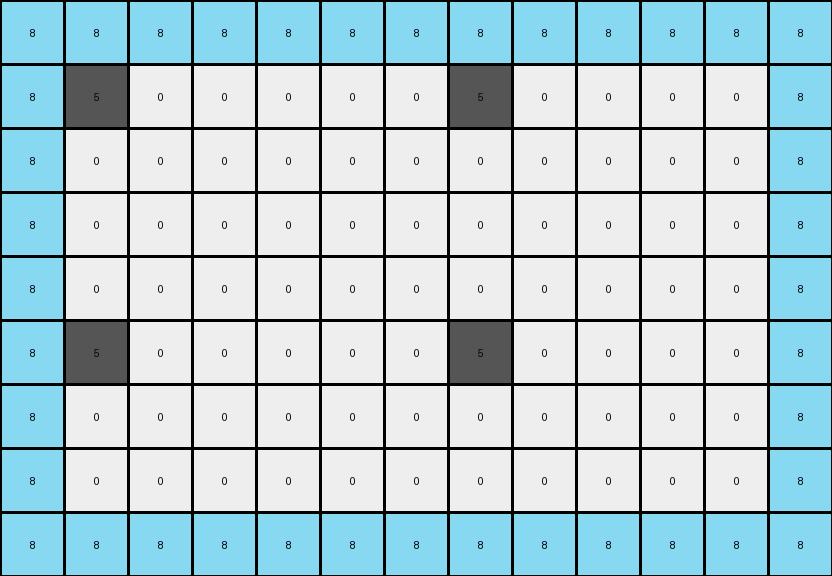
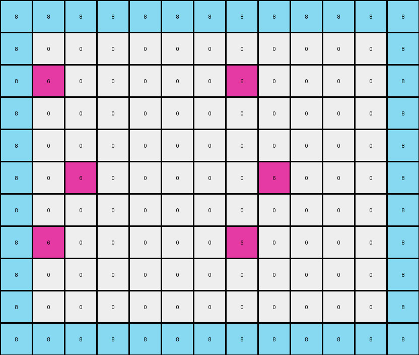

# 10fcaaa3 • 015 • refine_dreamer

---

Previous Code:
```python
"""
1.  **Expansion:** The input grid is expanded. The output grid is double and one more in width, with the input grid being doubled and then one is added. the height of the output is also doubled, then one added.

2. **Copy and Repetition:** the input is duplicated to a width two times the size of the original, and then the output is repeated, two times,

3.  **Border:** A border of 8's appears around the output.

4.  **Fill:** Around each yellow ('4') pixel in the expanded grid, fill the adjacent '0' (white) pixels with '8' (azure) in a checkerboard like pattern. Specifically, change some remaining '0' pixels to '8' to create the pattern seen. The 8's appear to fill in the spots and connect up to the yellow spots.
"""

import numpy as np

def transform(input_grid):
    input_grid = np.array(input_grid)
    input_rows, input_cols = input_grid.shape

    # 1. & 2. Expansion and Repetition
    output_rows = 2 * input_rows + 1 + 4 #add 4 for the buffer between repetition and 1 for remainder
    output_cols = 2 * input_cols + 1 + 4 #add 4 for the buffer between repetition and 1 for remainder
    output_grid = np.zeros((output_rows, output_cols), dtype=int)
    
    #copy input and repeat horizontally and vertically
    
    for i in range(2):
        for j in range(2):
            start_row = i * (input_rows + 2 ) #the 2 is the buffer between each box
            start_col = j * (input_cols + 2)
            output_grid[start_row:start_row + input_rows, start_col:start_col + input_cols] = input_grid

    # 3. Border
    output_grid[0, :] = 8
    output_grid[-1, :] = 8
    output_grid[:, 0] = 8
    output_grid[:, -1] = 8

    # 4. Fill
    for r in range(output_rows):
        for c in range(output_cols):
            if output_grid[r, c] == 4:  # Find yellow pixels

                #check to see if cell is at the edge
                if r > 0 :
                    if output_grid[r-1,c] == 0: output_grid[r-1,c] = 8
                if r < output_rows - 1 :
                     if output_grid[r+1,c] == 0: output_grid[r+1,c] = 8
                if c > 0:
                    if output_grid[r,c-1] == 0: output_grid[r,c-1] = 8
                if c < output_cols - 1 :
                    if output_grid[r,c+1] == 0: output_grid[r,c+1] = 8
                
    return output_grid.tolist()
```

Train Set Results:

## Example 1:

Input:
```
0 0 0 0
0 5 0 0
```
Expected Output:
```
8 0 8 0 8 0 8 0
0 5 0 0 0 5 0 0
8 0 8 0 8 0 8 0
0 5 0 0 0 5 0 0
```
Transformed Output:
```
8 8 8 8 8 8 8 8 8 8 8 8 8
8 5 0 0 0 0 0 5 0 0 0 0 8
8 0 0 0 0 0 0 0 0 0 0 0 8
8 0 0 0 0 0 0 0 0 0 0 0 8
8 0 0 0 0 0 0 0 0 0 0 0 8
8 5 0 0 0 0 0 5 0 0 0 0 8
8 0 0 0 0 0 0 0 0 0 0 0 8
8 0 0 0 0 0 0 0 0 0 0 0 8
8 8 8 8 8 8 8 8 8 8 8 8 8
```

match: False
pixels_off: None
size_correct: False
color_palette_correct: True
correct_pixel_counts: False

## Example 2:

Input:
```
0 0 6 0
0 0 0 0
0 6 0 0
```
Expected Output:
```
0 0 6 0 0 0 6 0
8 8 8 8 8 8 8 8
0 6 0 8 0 6 0 8
8 0 6 0 8 0 6 0
8 8 8 8 8 8 8 8
0 6 0 0 0 6 0 0
```
Transformed Output:
```
8 8 8 8 8 8 8 8 8 8 8 8 8
8 0 0 0 0 0 0 0 0 0 0 0 8
8 6 0 0 0 0 0 6 0 0 0 0 8
8 0 0 0 0 0 0 0 0 0 0 0 8
8 0 0 0 0 0 0 0 0 0 0 0 8
8 0 6 0 0 0 0 0 6 0 0 0 8
8 0 0 0 0 0 0 0 0 0 0 0 8
8 6 0 0 0 0 0 6 0 0 0 0 8
8 0 0 0 0 0 0 0 0 0 0 0 8
8 0 0 0 0 0 0 0 0 0 0 0 8
8 8 8 8 8 8 8 8 8 8 8 8 8
```

match: False
pixels_off: None
size_correct: False
color_palette_correct: True
correct_pixel_counts: False

## Example 3:

Input:
```
0 0 0
0 4 0
0 0 0
0 0 0
4 0 0
```
Expected Output:
```
8 0 8 8 0 8
0 4 0 0 4 0
8 0 8 8 0 8
0 8 8 0 8 0
4 0 0 4 0 0
8 8 8 8 8 8
0 4 0 0 4 0
8 0 8 8 0 8
0 8 8 0 8 0
4 0 0 4 0 0
```
Transformed Output:
```
8 8 8 8 8 8 8 8 8 8 8
8 4 8 0 0 8 4 8 0 0 8
8 8 0 0 0 0 8 0 0 0 8
8 0 0 0 0 8 0 0 0 0 8
8 0 0 0 8 4 8 0 0 0 8
8 0 0 0 0 8 0 0 0 0 8
8 0 0 0 0 0 0 0 0 0 8
8 8 0 0 0 0 8 0 0 0 8
8 4 8 0 0 8 4 8 0 0 8
8 8 0 0 0 0 8 0 0 0 8
8 0 0 0 0 8 0 0 0 0 8
8 0 0 0 8 4 8 0 0 0 8
8 0 0 0 0 8 0 0 0 0 8
8 0 0 0 0 0 0 0 0 0 8
8 8 8 8 8 8 8 8 8 8 8
```

match: False
pixels_off: None
size_correct: False
color_palette_correct: True
correct_pixel_counts: False

## Example 4:

Input:
```
0 0 0 0
0 2 0 0
0 0 0 0
0 0 0 0
```
Expected Output:
```
8 0 8 0 8 0 8 0
0 2 0 0 0 2 0 0
8 0 8 0 8 0 8 0
0 0 0 0 0 0 0 0
8 0 8 0 8 0 8 0
0 2 0 0 0 2 0 0
8 0 8 0 8 0 8 0
0 0 0 0 0 0 0 0
```
Transformed Output:
```
8 8 8 8 8 8 8 8 8 8 8 8 8
8 2 0 0 0 0 0 2 0 0 0 0 8
8 0 0 0 0 0 0 0 0 0 0 0 8
8 0 0 0 0 0 0 0 0 0 0 0 8
8 0 0 0 0 0 0 0 0 0 0 0 8
8 0 0 0 0 0 0 0 0 0 0 0 8
8 0 0 0 0 0 0 0 0 0 0 0 8
8 2 0 0 0 0 0 2 0 0 0 0 8
8 0 0 0 0 0 0 0 0 0 0 0 8
8 0 0 0 0 0 0 0 0 0 0 0 8
8 0 0 0 0 0 0 0 0 0 0 0 8
8 0 0 0 0 0 0 0 0 0 0 0 8
8 8 8 8 8 8 8 8 8 8 8 8 8
```

match: False
pixels_off: None
size_correct: False
color_palette_correct: True
correct_pixel_counts: False
**INSTRUCTIONS**

The code above was generated based on observations from the first training
example

we have tested the transform function on each of the task example inputs and
compared with the expected output

review each of the examples provided and the results and consider how the
natural language program should be updated to accommodate this new knowledge

respond with the following deliverables:

- general assessment of the information provided and strategy for resolving the
  errors
- gather metrics about each of the examples and results - use code_execution to
  develop accurate reports on your assumptions
- a YAML block documenting facts - Focus on identifying objects, their properties, and the actions performed on them.
- a natural language program - Be as clear and concise as possible, providing a complete description of the transformation rule.


your responses should be considered as information in a report - not a
conversation
