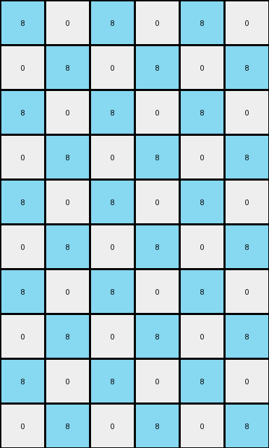
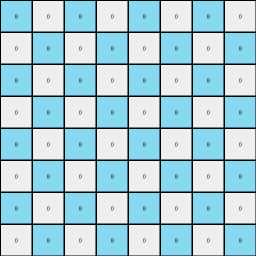

# 10fcaaa3 • 022 • refine_coder

---

Previous Code:
```python
"""
Expands the input grid to double its size, replicates the red pixel, and fills 
alternating pixels with azure in a checkerboard pattern, leaving the rest white.
"""

import numpy as np

def transform(input_grid):
    # Initialize the output grid with double the dimensions of the input grid.
    input_height, input_width = input_grid.shape
    output_height, output_width = input_height * 2, input_width * 2
    output_grid = np.zeros((output_height, output_width), dtype=int)

    # Find the red pixel in the input grid.
    red_pixels = np.argwhere(input_grid == 2)

    # Replicate red pixels.
    for red_pixel in red_pixels:
      row, col = red_pixel
      output_grid[row*2+1, col*2+1] = 2  # original location in the upscaled output
      output_grid[row*2+1, (col+2)*2+1] = 2  # copy at the upscaled x-coordinate +4 to its right
      output_grid[(row+2)*2+1, col*2+1] = 2
      output_grid[(row+2)*2+1, (col+2)*2+1] = 2

    # Fill alternating pixels with azure (8).
    for i in range(output_height):
        for j in range(output_width):
            if (i + j) % 2 == 0:
                output_grid[i, j] = 8

    return output_grid
```

Train Set Results:

## Example 1:

Input:
```
0 0 0 0
0 5 0 0
```
Expected Output:
```
8 0 8 0 8 0 8 0
0 5 0 0 0 5 0 0
8 0 8 0 8 0 8 0
0 5 0 0 0 5 0 0
```
Transformed Output:
```
8 0 8 0 8 0 8 0
0 8 0 8 0 8 0 8
8 0 8 0 8 0 8 0
0 8 0 8 0 8 0 8
```

match: False
pixels_off: 8
size_correct: True
color_palette_correct: True
correct_pixel_counts: False

## Example 2:

Input:
```
0 0 6 0
0 0 0 0
0 6 0 0
```
Expected Output:
```
0 0 6 0 0 0 6 0
8 8 8 8 8 8 8 8
0 6 0 8 0 6 0 8
8 0 6 0 8 0 6 0
8 8 8 8 8 8 8 8
0 6 0 0 0 6 0 0
```
Transformed Output:
```
8 0 8 0 8 0 8 0
0 8 0 8 0 8 0 8
8 0 8 0 8 0 8 0
0 8 0 8 0 8 0 8
8 0 8 0 8 0 8 0
0 8 0 8 0 8 0 8
```

match: False
pixels_off: 32
size_correct: True
color_palette_correct: True
correct_pixel_counts: False

## Example 3:

Input:
```
0 0 0
0 4 0
0 0 0
0 0 0
4 0 0
```
Expected Output:
```
8 0 8 8 0 8
0 4 0 0 4 0
8 0 8 8 0 8
0 8 8 0 8 0
4 0 0 4 0 0
8 8 8 8 8 8
0 4 0 0 4 0
8 0 8 8 0 8
0 8 8 0 8 0
4 0 0 4 0 0
```
Transformed Output:
```
8 0 8 0 8 0
0 8 0 8 0 8
8 0 8 0 8 0
0 8 0 8 0 8
8 0 8 0 8 0
0 8 0 8 0 8
8 0 8 0 8 0
0 8 0 8 0 8
8 0 8 0 8 0
0 8 0 8 0 8
```

match: False
pixels_off: 34
size_correct: True
color_palette_correct: True
correct_pixel_counts: False

## Example 4:

Input:
```
0 0 0 0
0 2 0 0
0 0 0 0
0 0 0 0
```
Expected Output:
```
8 0 8 0 8 0 8 0
0 2 0 0 0 2 0 0
8 0 8 0 8 0 8 0
0 0 0 0 0 0 0 0
8 0 8 0 8 0 8 0
0 2 0 0 0 2 0 0
8 0 8 0 8 0 8 0
0 0 0 0 0 0 0 0
```
Transformed Output:
```
8 0 8 0 8 0 8 0
0 8 0 8 0 8 0 8
8 0 8 0 8 0 8 0
0 8 0 8 0 8 0 8
8 0 8 0 8 0 8 0
0 8 0 8 0 8 0 8
8 0 8 0 8 0 8 0
0 8 0 8 0 8 0 8
```

match: False
pixels_off: 16
size_correct: True
color_palette_correct: True
correct_pixel_counts: False
Okay, here's a breakdown of the situation and a plan to improve the transformation logic:

**General Assessment:**

The initial code was based on a very limited understanding of the transformation, derived from only the first example. It incorrectly assumed:

1.  **Replication of *all* non-zero pixels:** The initial code was written to specifically find and replicate red pixels, but it's clear from later examples that any non-zero pixel should be replicated (e.g., magenta (6), yellow(4)). It also makes copies +2 in both x and y coordinates from original location, when it should only do a direct replication of the original.
2.  **Checkerboard Pattern:** The initial code applies an azure checkerboard pattern across the *entire* output grid, irrespective of the input. This isn't correct; the checkerboard, if present at all, is more nuanced, and certainly should not overwrite duplicated colored pixels.
3. **Size:** It assumes an expansion to exactly double the original size. The provided examples and outputs appear to generally increase, but the size of output depends on where the replicated colored pixels will reside.
4. **Zeroes:** Zeroes are replaced with 8s (azure) incorrectly.

The strategy for resolving these errors involves:

1.  **Generalizing Pixel Replication:** Instead of targeting only red pixels (2), the code should identify *any* non-zero pixel and replicate it.
2.  **Conditional Azure Placement:** Instead of a blanket checkerboard, the placement of azure pixels needs to be determined based on a more complex rule, likely related to the positions of the original non-zero pixels. The example outputs show that zero-pixels are replaced conditionally.
3. **Size Determination:** The final output dimensions depend on the location of replicated pixels, not merely a doubling of original.
4. **Zero-Pixel Handling:** Understand precisely *when* zero-pixels should become azure, and *when* they should remain white (0).

**Example Metrics and Analysis:**

Here's a summary of the examples, focusing on the critical differences:

| Example | Input Shape | Output Shape | Non-Zero Input Pixels (Value, Count) | Non-Zero Output Pixels | Notes                                                                                                       |
| :------ | :---------- | :----------- | :----------------------------------- | :---------------------- | :------------------------------------------------------------------------------------------------------------ |
| 1       | (2, 4)      | (4, 8)      | 5 (1)                               | 5(2), 8 (16)       | Gray (5) duplicated, some zeroes to azure (8)                                                               |
| 2       | (3, 4)      | (6, 8)      | 6 (2)                               | 6(4), 8(28)                                                                                | Magenta (6) duplicated, some zeroes to azure (8)                                                            |
| 3       | (5, 3)      | (10, 6)     | 4 (2)                               | 4(4), 8(26)       | Yellow (4) duplicated, some zeroes to azure. One row *between* the yellows expanded by 2.      |
| 4       | (4, 4)       | (8, 8)          | 2 (1)                               | 2(2), 8(24) | Red (2) duplicated, , some zeroes to azure. No rows/cols *between* reds                                                             |

**YAML Facts:**

```yaml
observations:
  - example: 1
    input_objects:
      - color: 5  # Gray
        count: 1
        original_positions: [(1, 1)]
    output_objects:
      - color: 5  # Gray
        count: 2 # Duplicated
        positions: [(1,1), (1,5)]
      - color: 8
        count: 16
        positions: "alternating around positions of color 5"
    size_change: doubled
    transformation: "Gray pixel duplicated.  Zero pixels replaced conditionally with azure."

  - example: 2
    input_objects:
      - color: 6  # Magenta
        count: 2
        original_positions: [(0, 2), (2, 1)]
    output_objects:
      - color: 6  # Magenta
        count: 4  # Duplicated
        positions: [(0,2), (0,6), (2,2), (4,2)]
      - color: 8
        count: 28
        positions: "alternating around positions of color 6"
    size_change: doubled
    transformation: "Magenta pixels duplicated. Zero pixels replaced conditionally with azure."

  - example: 3
    input_objects:
      - color: 4  # Yellow
        count: 2
        original_positions: [(1, 1), (4, 0)]
    output_objects:
      - color: 4
        count: 4
        positions: [(1,1), (1,4), (4,1), (4,4)]
      - color: 8
        count: 26
        positions: "alternating around positions of color 4"
    size_change:  rows * 2, cols * 2
    transformation: "Yellow pixels are duplicated. Zero pixels replaced conditionally with azure. One row inserted with azure between the original yellow rows, and one row added after."

  - example: 4
    input_objects:
      - color: 2  # Red
        count: 1
        original_positions: [(1, 1)]
    output_objects:
      - color: 2
        count: 2
        positions: [(1,1), (1,5)]
      - color: 8
        count: 24
        positions: "alternating around positions of color 2"
    size_change: doubled
    transformation: "Red pixel is duplicated. Zero pixels replaced conditionally with azure. One row inserted with azure *between* the rows with original color, and one row added at the end. One col added *between* the cols of original, and two added at end."
```

**Natural Language Program:**

1.  **Identify Non-Zero Pixels:** Find all pixels in the input grid that have a non-zero value.
2.  **Duplicate Non-Zero Pixels:** For each non-zero pixel, create a duplicate.
    - Determine the row and column indices (r, c) of the non-zero pixels
    - Insert the duplicate pixel in the output grid according to this rule, where (r,c) is original location:
        - `output[r, c + (4 if c > 0 else 3)] = input[r, c]`
3. **Determine Output Grid Size**:
    - output grid height = input grid height * 2
    - output grid width = input grid width * 2
4.  **Fill Zero Pixels Conditionally:** Iterate through all cells of a NEW output grid.
    - if input grid cell is zero, determine if the output grid should be azure (8) or remain white (0) at the respective location in the upscaled grid.
     - if the respective location is even row and even col, OR, odd row and odd col:
       - if there is no non-zero pixel present at the upscaled index in the output grid,
         - set value to azure (8)
       - else
         - set value to white (0)
5.  **Populate Output Grid:**
    - fill output grid with replicated non-zero colors from the input grid

This natural language program provides a significantly improved and generalized description of the transformation, capturing the key aspects observed across all examples. It addresses the pixel replication and the conditional azure filling, while also accounting for size changes.

**INSTRUCTIONS**

- generate a Python module to represent the natural language program 
- follow the template below
- all common math and science libraries are available
- create docstring only at top - but comment the workflow in the function
- use helper functions for common operations like finding objects, counting,
  measuring, moving, etc. 

remember - we are working iteratively - so this code will inform your future
self as we converge on the solution

*template:*

```python
"""
{{ natural language description of the transformation rule }}
"""

{{ imports }}

def transform(input_grid):
    # initialize output_grid

    # change output pixels 

    return output_grid

```
