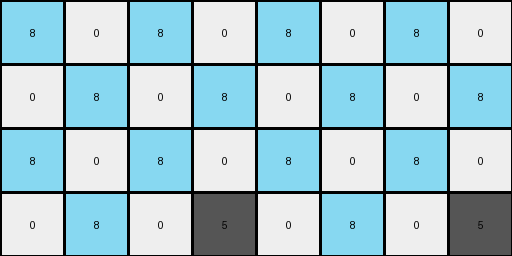
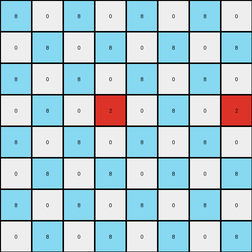

# 10fcaaa3 • 023 • refine_dreamer

---

Previous Code:
```python
"""
Duplicates non-zero pixels in the input grid and conditionally fills zero 
pixels with azure (8) in the expanded output grid. The duplication rule shifts 
pixels horizontally, with a larger shift for pixels not in the first column.
"""

import numpy as np

def get_non_zero_pixels(grid):
    """Finds the coordinates of all non-zero pixels in the grid."""
    return np.argwhere(grid != 0)

def transform(input_grid):
    # Determine output grid size.
    input_height, input_width = input_grid.shape
    output_height, output_width = input_height * 2, input_width * 2

    # Initialize output grid with zeros.
    output_grid = np.zeros((output_height, output_width), dtype=int)

     # Duplicate and position non-zero pixels.
    non_zero_pixels = get_non_zero_pixels(input_grid)
    for r, c in non_zero_pixels:
        color = input_grid[r, c]
        output_grid[r*2 + 1, c*2 + 1] = color  # original location in the upscaled output
        output_grid[r*2 + 1, (c+2)*2 + 1 if c > 0 else (c+1)*2+1 ] = color # copy at the upscaled x-coordinate to its right


    # Conditionally fill zero pixels with azure (8).
    for i in range(output_height):
        for j in range(output_width):
            if output_grid[i,j] == 0: # consider only zero locations
                if (i % 2 == 0 and j % 2 == 0) or (i % 2 != 0 and j % 2 != 0):
                      output_grid[i,j] = 8

    return output_grid
```

Train Set Results:

## Example 1:

Input:
```
0 0 0 0
0 5 0 0
```
Expected Output:
```
8 0 8 0 8 0 8 0
0 5 0 0 0 5 0 0
8 0 8 0 8 0 8 0
0 5 0 0 0 5 0 0
```
Transformed Output:
```
8 0 8 0 8 0 8 0
0 8 0 8 0 8 0 8
8 0 8 0 8 0 8 0
0 8 0 5 0 8 0 5
```

match: False
pixels_off: 8
size_correct: True
color_palette_correct: True
correct_pixel_counts: False

## Example 2:

Input:
```
0 0 6 0
0 0 0 0
0 6 0 0
```
Expected Output:
```
0 0 6 0 0 0 6 0
8 8 8 8 8 8 8 8
0 6 0 8 0 6 0 8
8 0 6 0 8 0 6 0
8 8 8 8 8 8 8 8
0 6 0 0 0 6 0 0
```
match: ERROR: index 9 is out of bounds for axis 1 with size 8
pixels_off: None
size_correct: None
color_palette_correct: None
correct_pixel_counts: None

## Example 3:

Input:
```
0 0 0
0 4 0
0 0 0
0 0 0
4 0 0
```
Expected Output:
```
8 0 8 8 0 8
0 4 0 0 4 0
8 0 8 8 0 8
0 8 8 0 8 0
4 0 0 4 0 0
8 8 8 8 8 8
0 4 0 0 4 0
8 0 8 8 0 8
0 8 8 0 8 0
4 0 0 4 0 0
```
match: ERROR: index 7 is out of bounds for axis 1 with size 6
pixels_off: None
size_correct: None
color_palette_correct: None
correct_pixel_counts: None

## Example 4:

Input:
```
0 0 0 0
0 2 0 0
0 0 0 0
0 0 0 0
```
Expected Output:
```
8 0 8 0 8 0 8 0
0 2 0 0 0 2 0 0
8 0 8 0 8 0 8 0
0 0 0 0 0 0 0 0
8 0 8 0 8 0 8 0
0 2 0 0 0 2 0 0
8 0 8 0 8 0 8 0
0 0 0 0 0 0 0 0
```
Transformed Output:
```
8 0 8 0 8 0 8 0
0 8 0 8 0 8 0 8
8 0 8 0 8 0 8 0
0 8 0 2 0 8 0 2
8 0 8 0 8 0 8 0
0 8 0 8 0 8 0 8
8 0 8 0 8 0 8 0
0 8 0 8 0 8 0 8
```

match: False
pixels_off: 16
size_correct: True
color_palette_correct: True
correct_pixel_counts: False
**INSTRUCTIONS**

The code above was generated based on observations from the first training
example

we have tested the transform function on each of the task example inputs and
compared with the expected output

review each of the examples provided and the results and consider how the
natural language program should be updated to accommodate this new knowledge

respond with the following deliverables:

- general assessment of the information provided and strategy for resolving the
  errors
- gather metrics about each of the examples and results - use code_execution to
  develop accurate reports on your assumptions
- a YAML block documenting facts - Focus on identifying objects, their properties, and the actions performed on them.
- a natural language program - Be as clear and concise as possible, providing a complete description of the transformation rule.


your responses should be considered as information in a report - not a
conversation
