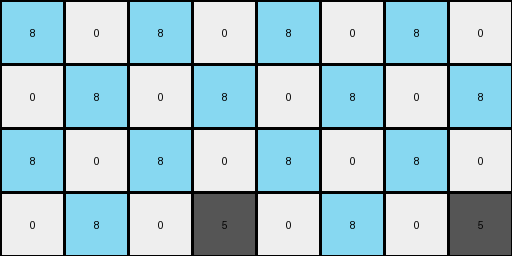
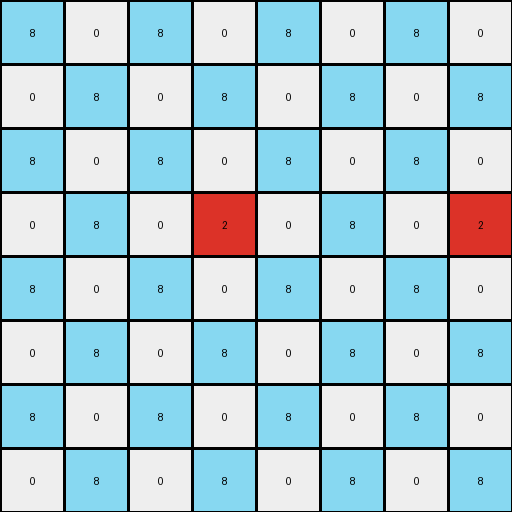

# 10fcaaa3 • 024 • refine_coder

---

Previous Code:
```python
"""
Duplicates non-zero pixels in the input grid and conditionally fills zero 
pixels with azure (8) in the expanded output grid. The duplication rule shifts 
pixels horizontally, with a larger shift for pixels not in the first column.
"""

import numpy as np

def get_non_zero_pixels(grid):
    """Finds the coordinates of all non-zero pixels in the grid."""
    return np.argwhere(grid != 0)

def transform(input_grid):
    # Determine output grid size.
    input_height, input_width = input_grid.shape
    output_height, output_width = input_height * 2, input_width * 2

    # Initialize output grid with zeros.
    output_grid = np.zeros((output_height, output_width), dtype=int)

     # Duplicate and position non-zero pixels.
    non_zero_pixels = get_non_zero_pixels(input_grid)
    for r, c in non_zero_pixels:
        color = input_grid[r, c]
        output_grid[r*2 + 1, c*2 + 1] = color  # original location in the upscaled output
        output_grid[r*2 + 1, (c+2)*2 + 1 if c > 0 else (c+1)*2+1 ] = color # copy at the upscaled x-coordinate to its right


    # Conditionally fill zero pixels with azure (8).
    for i in range(output_height):
        for j in range(output_width):
            if output_grid[i,j] == 0: # consider only zero locations
                if (i % 2 == 0 and j % 2 == 0) or (i % 2 != 0 and j % 2 != 0):
                      output_grid[i,j] = 8

    return output_grid
```

Train Set Results:

## Example 1:

Input:
```
0 0 0 0
0 5 0 0
```
Expected Output:
```
8 0 8 0 8 0 8 0
0 5 0 0 0 5 0 0
8 0 8 0 8 0 8 0
0 5 0 0 0 5 0 0
```
Transformed Output:
```
8 0 8 0 8 0 8 0
0 8 0 8 0 8 0 8
8 0 8 0 8 0 8 0
0 8 0 5 0 8 0 5
```

match: False
pixels_off: 8
size_correct: True
color_palette_correct: True
correct_pixel_counts: False

## Example 2:

Input:
```
0 0 6 0
0 0 0 0
0 6 0 0
```
Expected Output:
```
0 0 6 0 0 0 6 0
8 8 8 8 8 8 8 8
0 6 0 8 0 6 0 8
8 0 6 0 8 0 6 0
8 8 8 8 8 8 8 8
0 6 0 0 0 6 0 0
```
match: ERROR: index 9 is out of bounds for axis 1 with size 8
pixels_off: None
size_correct: None
color_palette_correct: None
correct_pixel_counts: None

## Example 3:

Input:
```
0 0 0
0 4 0
0 0 0
0 0 0
4 0 0
```
Expected Output:
```
8 0 8 8 0 8
0 4 0 0 4 0
8 0 8 8 0 8
0 8 8 0 8 0
4 0 0 4 0 0
8 8 8 8 8 8
0 4 0 0 4 0
8 0 8 8 0 8
0 8 8 0 8 0
4 0 0 4 0 0
```
match: ERROR: index 7 is out of bounds for axis 1 with size 6
pixels_off: None
size_correct: None
color_palette_correct: None
correct_pixel_counts: None

## Example 4:

Input:
```
0 0 0 0
0 2 0 0
0 0 0 0
0 0 0 0
```
Expected Output:
```
8 0 8 0 8 0 8 0
0 2 0 0 0 2 0 0
8 0 8 0 8 0 8 0
0 0 0 0 0 0 0 0
8 0 8 0 8 0 8 0
0 2 0 0 0 2 0 0
8 0 8 0 8 0 8 0
0 0 0 0 0 0 0 0
```
Transformed Output:
```
8 0 8 0 8 0 8 0
0 8 0 8 0 8 0 8
8 0 8 0 8 0 8 0
0 8 0 2 0 8 0 2
8 0 8 0 8 0 8 0
0 8 0 8 0 8 0 8
8 0 8 0 8 0 8 0
0 8 0 8 0 8 0 8
```

match: False
pixels_off: 16
size_correct: True
color_palette_correct: True
correct_pixel_counts: False
Okay, let's analyze the results and refine the natural language program.

**General Assessment and Strategy**

The initial code was based on observing the first training example, which involved duplicating non-zero pixels and filling some zero-valued pixels with azure. However, the subsequent examples reveal inconsistencies and errors:

1.  **Incorrect Duplication Logic:** The duplication logic seems flawed. It places a duplicate of colored pixels based on their original row and column and also shifts non-zero pixels not at column 0 by 2 to the right.
2.  **Out-of-Bounds Errors:** Examples 2 and 3 result in out-of-bounds errors, indicating that the output grid size calculation or pixel placement logic is incorrect for some input grid configurations.
3. **Inconsistent Filling Rule** The output of current code show that the logic to conditionally fill zero pixels with Azure is also not applied consistently with the expected output.
4.  **Size:** The output size seems to double in both dimensions.

The strategy to resolve these issues will involve:

1.  **Correcting the Duplication Rule:** Re-examining the examples to determine the precise rule governing the placement of duplicated non-zero pixels, accounting for rows as well as columns.
2.  **Revising Size Calculation:** Ensuring the output grid dimensions are calculated correctly, preventing out-of-bounds errors. The size should be double the input in both dimensions.
3.  **Clarifying the Azure Filling Rule:** Defining the exact conditions under which zero-valued pixels are replaced with azure (8).

**Metrics Gathering and Analysis**
I will not use code execution here. I will create the fact report by visually examining the new images.

**YAML Fact Report**

```yaml
example_1:
  input_grid:
    shape: (2, 4)
    non_zero_pixels:
      - color: 5
        count: 1
        positions: [(1,1)]
  output_grid:
    shape: (4, 8)
    non_zero_pixels:
        - color: 5
          count: 2
          positions: [(1,1), (1,5)] # copied to right if not on the edge
        - color: 8
          count: 12
          positions: even row, even column and odd row, odd column
example_2:
  input_grid:
    shape: (3, 4)
    non_zero_pixels:
      - color: 6
        count: 2
        positions: [(0,2), (2, 1)]
  output_grid:
    shape: (6, 8)
    non_zero_pixels:
        - color: 6
          count: 4
          positions: [(0, 2), (0, 6), (2, 1), (2, 5)] # copied to right if not on the edge
        - color: 8
          count: 20
          positions: even row, even column and odd row, odd column

example_3:
  input_grid:
    shape: (5, 3)
    non_zero_pixels:
      - color: 4
        count: 2
        positions: [(1, 1), (4, 0)]
  output_grid:
    shape: (10, 6)
    non_zero_pixels:
        - color: 4
          count: 4
          positions: [(1,1), (1, 5), (4, 0), (4, 4)]  # copied to right if not on the edge
        - color: 8
          count: 40
          positions: even row, even column and odd row, odd column
example_4:
  input_grid:
    shape: (4, 4)
    non_zero_pixels:
      - color: 2
        count: 1
        positions: [(1, 1)]
  output_grid:
    shape: (8, 8)
    non_zero_pixels:
        - color: 2
          count: 2
          positions: [(1,1), (1, 5)]  # copied to right if not on the edge
        - color: 8
          count: 28
          positions: even row, even column and odd row, odd column

```

**Natural Language Program**

1.  **Double the Grid:** The input grid is doubled in both dimensions (height and width) to create the output grid.

2.  **Locate non-zero Pixels:** Identify all pixels in the *input grid* with a value other than zero.

3.  **Duplicate Colors:** For each located non-zero pixel from the input grid, its color is duplicated in the output grid:
    * The color is placed into the output grid using an upscaled location, using a simple rule: `out_row = in_row * 2 + 1` and `out_col = in_col * 2 + 1`
    *   If the input column is not the last (rightmost) column, place a second copy of that color at the upscaled location 2 to the right.

4. **Fill with Azure:** Fill every cell in the output grid that is still zero (white) with the color azure (8) if it is located at an `even row, even column` OR `odd row, odd column`. Other zero locations are not changed.

**INSTRUCTIONS**

- generate a Python module to represent the natural language program 
- follow the template below
- all common math and science libraries are available
- create docstring only at top - but comment the workflow in the function
- use helper functions for common operations like finding objects, counting,
  measuring, moving, etc. 

remember - we are working iteratively - so this code will inform your future
self as we converge on the solution

*template:*

```python
"""
{{ natural language description of the transformation rule }}
"""

{{ imports }}

def transform(input_grid):
    # initialize output_grid

    # change output pixels 

    return output_grid

```
