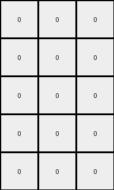

# 1b2d62fb • 017 • refine_dreamer

---


Previous Code:
```python
"""
1.  **Identify:** Find the column index where every cell is blue (value 1).
2.  **Checkerboard Prep:** Create an output array with dimensions based on the input height and output width of three, and initialize all elements to 0 (white).
3.  **Recolor:** For all elements detected in step one, change their value to 8 (azure).
4.  **Checkerboard Pattern:** Apply a checkerboard to output. If the row is even, output an azure pixel in column three. If the row is odd, output an azure pixel in the first column.
5.  **Output:** Return the modified 3-column wide output grid.
"""

import numpy as np

def find_vertical_line(grid, color):
    # Find a vertical line of the specified color
    for col in range(grid.shape[1]):
        if np.all(grid[:, col] == color):
            return col
    return -1  # Return -1 if no such line is found

def transform(input_grid):
    # initialize output grid
    output_height = input_grid.shape[0]
    output_width = 3
    output_grid = np.zeros((output_height, output_width), dtype=int)

    # Find the vertical line of blue (1) pixels
    blue_column_index = find_vertical_line(input_grid, 1)

    if blue_column_index != -1:
      # checkerboard
      for row in range(output_height):
          if (row % 2) == 0:
              output_grid[row, 2] = 8
          else:
              output_grid[row, 0] = 8

    return output_grid
```

Train Set Results:

## Example 1:

Input:
```
0 9 9 8 9 9 9
0 0 9 8 9 9 0
9 0 9 8 9 9 0
0 0 0 8 9 0 0
0 9 9 8 9 9 9
```
Expected Output:
```
0 0 0
0 0 0
0 0 0
0 8 8
0 0 0
```
Transformed Output:
```
0 0 0
0 0 0
0 0 0
0 0 0
0 0 0
```

match: False
pixels_off: 2
size_correct: True
color_palette_correct: True
correct_pixel_counts: False

## Example 2:

Input:
```
0 0 0 8 9 0 0
9 0 9 8 9 9 9
0 9 9 8 9 9 9
0 0 0 8 9 9 9
0 9 9 8 9 9 9
```
Expected Output:
```
0 8 8
0 0 0
0 0 0
0 0 0
0 0 0
```
Transformed Output:
```
0 0 0
0 0 0
0 0 0
0 0 0
0 0 0
```

match: False
pixels_off: 2
size_correct: True
color_palette_correct: True
correct_pixel_counts: False

## Example 3:

Input:
```
9 0 0 8 9 0 9
9 0 0 8 0 9 0
9 0 0 8 9 0 0
0 9 9 8 0 9 9
0 0 9 8 0 9 0
```
Expected Output:
```
0 8 0
0 0 8
0 8 8
8 0 0
8 0 0
```
Transformed Output:
```
0 0 0
0 0 0
0 0 0
0 0 0
0 0 0
```

match: False
pixels_off: 6
size_correct: True
color_palette_correct: True
correct_pixel_counts: False

## Example 4:

Input:
```
0 9 9 8 9 0 9
9 0 0 8 9 0 0
9 9 9 8 9 9 9
0 9 0 8 0 0 0
9 0 0 8 9 0 0
```
Expected Output:
```
0 0 0
0 8 8
0 0 0
8 0 8
0 8 8
```
Transformed Output:
```
0 0 0
0 0 0
0 0 0
0 0 0
0 0 0
```

match: False
pixels_off: 6
size_correct: True
color_palette_correct: True
correct_pixel_counts: False

## Example 5:

Input:
```
0 9 9 8 9 0 9
9 0 9 8 9 9 9
9 9 9 8 0 0 9
9 0 0 8 9 0 0
9 9 9 8 0 0 9
```
Expected Output:
```
0 0 0
0 0 0
0 0 0
0 8 8
0 0 0
```
Transformed Output:
```
0 0 0
0 0 0
0 0 0
0 0 0
0 0 0
```

match: False
pixels_off: 2
size_correct: True
color_palette_correct: True
correct_pixel_counts: False

**INSTRUCTIONS**

The code above was generated based on observations from the first training
example

we have tested the transform function on each of the task example inputs and
compared with the expected output

review each of the examples provided and the results and consider how the
natural language program should be updated to accommodate this new knowledge

respond with the following deliverables:

- general assessment of the information provided and strategy for resolving the
  errors
- gather metrics about each of the examples and results - use code_execution to
  develop accurate reports on your assumptions
- a YAML block documenting facts - Focus on identifying objects, their properties, and the actions performed on them.
- a natural language program - Be as clear and concise as possible, providing a complete description of the transformation rule.


your responses should be considered as information in a report - not a
conversation
