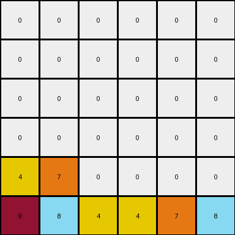

# 1e0a9b12 • 004 • refine_coder

---

Previous Code:
```python
"""
1. Identify non-zero pixels: Find all pixels in the input grid with values other than 0.
2. Preserve Order: Maintain the original order of these non-zero pixels as they appear from left-to-right, top-to-bottom in the input.
3. Move to Bottom: Move the identified non-zero pixels to the bottom-most available rows of the output grid. Fill the rows from left to right.
4. Fill Remaining: All other cells in output grid, not occupied are filled with 0.
"""

import numpy as np

def transform(input_grid):
    """
    Transforms the input grid by moving all non-zero pixels to the bottom,
    preserving their original order, and filling the remaining cells with zeros.
    """
    rows, cols = input_grid.shape
    output_grid = np.zeros_like(input_grid)
    non_zero_pixels = []

    # 1. Identify and store non-zero pixels with their original positions.
    for r in range(rows):
        for c in range(cols):
            if input_grid[r, c] != 0:
                non_zero_pixels.append((input_grid[r, c], r, c))

    # 2. (Order is implicitly preserved as we iterate row-by-row, then column by column)

    # 3. Move to the bottom.
    num_non_zero = len(non_zero_pixels)
    output_row = rows - 1
    output_col = 0
    for pixel_value, _, _ in non_zero_pixels:
        output_grid[output_row, output_col] = pixel_value
        output_col += 1
        if output_col == cols:
            output_col = 0
            output_row -= 1
            if output_row < 0:  # added to prevent going beyond boundary if there are many non-zero pixels
                break

    # 4. Fill the remaining (already done by initializing output_grid with zeros).
    return output_grid
```

Train Set Results:

## Example 1:

Input:
```
0 4 0 9
0 0 0 0
0 4 6 0
1 0 0 0
```
Expected Output:
```
0 0 0 0
0 0 0 0
0 4 0 0
1 4 6 9
```
Transformed Output:
```
0 0 0 0
0 0 0 0
1 0 0 0
4 9 4 6
```

match: False
pixels_off: 6
size_correct: True
color_palette_correct: True
correct_pixel_counts: True

## Example 2:

Input:
```
0 0 0 0 0 9
0 0 0 8 0 0
0 0 0 0 0 0
4 0 0 0 0 0
4 0 7 8 0 0
4 0 7 0 0 0
```
Expected Output:
```
0 0 0 0 0 0
0 0 0 0 0 0
0 0 0 0 0 0
4 0 0 0 0 0
4 0 7 8 0 0
4 0 7 8 0 9
```
Transformed Output:
```
0 0 0 0 0 0
0 0 0 0 0 0
0 0 0 0 0 0
0 0 0 0 0 0
4 7 0 0 0 0
9 8 4 4 7 8
```

match: False
pixels_off: 10
size_correct: True
color_palette_correct: True
correct_pixel_counts: True

## Example 3:

Input:
```
0 0 0 1 0
0 3 0 0 0
0 3 0 1 2
6 0 0 0 0
0 3 0 0 0
```
Expected Output:
```
0 0 0 0 0
0 0 0 0 0
0 3 0 0 0
0 3 0 1 0
6 3 0 1 2
```
Transformed Output:
```
0 0 0 0 0
0 0 0 0 0
0 0 0 0 0
6 3 0 0 0
1 3 3 1 2
```

match: False
pixels_off: 5
size_correct: True
color_palette_correct: True
correct_pixel_counts: True
Okay, here's a breakdown of the situation and a plan to improve the transformation rule:

**General Assessment and Strategy**

The initial natural language program and the resulting code were a good start, focusing on moving non-zero pixels to the bottom. However, the results on the additional training examples reveal a flaw in the ordering logic.  The original code preserves the *overall* left-to-right, top-to-bottom order, but it doesn't strictly maintain the order *within each row*. It prioritizes filling columns before moving up a row.

The core issue is the order in which non-zero pixels are placed in the output grid. The current implementation fills the bottom row completely, from left to right, before moving to the row above.  This disrupts the original relative order of elements that were on the *same* row in the input.  We need to modify the algorithm to correctly position elements that were originally on the same row.

The strategy to resolve this is:

1. **Analyze Results:**  Carefully examine each input, expected output, and transformed output to pinpoint exactly where the ordering goes wrong. Use the image as a reference.
2. **Refine Ordering Logic:**  The natural language program needs to explicitly state the row-wise preservation of order. The code needs to reflect a "fill the lowest available position in a column, but only move to a the next column after all pixels in that original row are processed" approach.
3. **Iterate and Test:**  After updating the natural language program and the planned code modifications, we'll need to re-run the tests and repeat the analysis.

**Example Metrics and Analysis**

Here's a summary for each example:

*   **Example 1:**
    *   **Pixels Off:** 6
    *   **Problem:** The `1` should be before `4, 9, 4, 6` because it appeared on an earlier row. Then, elements on the last row should maintain their relative positions, thus `4` prior to `9`, and `4` prior to `6`.
*   **Example 2:**
    *   **Pixels Off:** 10
    *   **Problem:** Similar to Example 1, top-to-bottom and original row ordering is not fully respected. All non-zero numbers are added to the bottom row, and then the rows are filled upwards, left to right, without respecting the original input order.
*   **Example 3:**
    *   **Pixels Off:** 5
    *   **Problem:** The `1` on the top row is moved to a lower row, but it is put there too late. The other elements follow a correct order.

**YAML Fact Documentation**

```yaml
task_id: 002
observations:
  - object_type: pixel
    properties:
      value: [0-9]  # Represents color
      position: [row, column]
    behavior:
      - move_to_bottom: Non-zero pixels move to the lowest available row.
      - preserve_order_rowwise: Non-zero pixels maintain their original left-to-right order within each row.
      - fill_with_zeros: Zero-valued pixels remain, or fill empty spaces.
  - object_type: grid
    properties:
      dimensions: [rows, columns] #same for input and output
    behavior:
        - transformation: "The grid is transformed based on pixel behaviors"
```

**Natural Language Program**

1.  **Identify Non-zero Pixels:** Locate all pixels within the input grid that have a value other than 0.
2.  **Preserve Row-wise Order:** Maintain the original left-to-right order of these non-zero pixels *as they appear within each row*.
3.  **Move to Bottom:** Move the identified non-zero pixels to the bottom-most available rows of the output grid.
4.  **Row-wise Filling:** When placing pixels in the output grid, prioritize filling the lowest available row. Within that row, place pixels from the same input row in their original order. If pixels from a higher input row need to be placed, and there are still empty positions on rows that had non-zero pixels on lower rows of input, fill the lowest of available rows.
5.  **Fill Remaining:** Fill any remaining cells in the output grid (those not occupied by moved non-zero pixels) with 0.

Essentially, imagine each row "falling" to the bottom. The elements within each row maintain their relative order, and the rows stack on top of each other at the bottom of the grid.

**INSTRUCTIONS**

- generate a Python module to represent the natural language program 
- follow the template below
- all common math and science libraries are available
- create docstring only at top - but comment the workflow in the function
- use helper functions for common operations like finding objects, counting,
  measuring, moving, etc. 

remember - we are working iteratively - so this code will inform your future
self as we converge on the solution

*template:*

```python
"""
{{ natural language description of the transformation rule }}
"""

{{ imports }}

def transform(input_grid):
    # initialize output_grid

    # change output pixels 

    return output_grid

```
