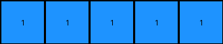

# 1fad071e • 003 • refine_dreamer

---


Previous Code:
```python
"""
Divides the input grid into five vertical regions and checks for the presence of blue (1) in each region.
Outputs a 1x5 grid where each cell is blue (1) if the corresponding input region contained blue, and white (0) otherwise.
"""

import numpy as np

def transform(input_grid):
    """
    Transforms the input grid according to the described rule.
    """
    input_height, input_width = input_grid.shape
    output_width = 5
    output_grid = np.zeros((1, output_width), dtype=int)  # Initialize output grid with white (0)

    # Calculate region width.  Handle cases where the width is not perfectly divisible.
    region_width = input_width // output_width
    extra_pixels = input_width % output_width
    
    start_col = 0
    for i in range(output_width):
        # Distribute any extra pixels across the regions, one at a time.
        current_region_width = region_width + (1 if i < extra_pixels else 0)
        end_col = start_col + current_region_width

        # Extract the current region
        region = input_grid[:, start_col:end_col]

        # Check for the presence of blue (1) in the region
        if np.any(region == 1):
            output_grid[0, i] = 1  # Set output pixel to blue (1)

        start_col = end_col # move to the next region

    return output_grid
```

Train Set Results:

## Example 1:

Input:
```
0 0 0 0 2 2 0 0 1
0 1 1 0 2 2 0 0 0
0 1 1 0 0 0 0 2 2
0 0 0 0 0 0 0 2 2
1 0 2 2 0 0 0 0 0
0 0 2 2 0 1 1 0 0
0 0 0 0 0 1 1 0 0
0 0 0 0 0 0 0 0 0
0 1 0 0 0 0 0 0 1
```
Expected Output:
```
1 1 0 0 0
```
Transformed Output:
```
1 1 1 1 1
```

match: False
pixels_off: 3
size_correct: True
color_palette_correct: True
correct_pixel_counts: False

## Example 2:

Input:
```
1 1 0 2 0 0 0 0 2
1 1 0 0 0 1 1 0 0
0 0 0 2 0 1 1 0 0
0 0 0 0 0 0 0 0 1
0 1 1 0 2 2 0 0 0
0 1 1 0 2 2 0 0 2
0 0 0 0 0 0 0 0 0
0 0 0 2 2 0 1 1 0
0 1 0 2 2 0 1 1 0
```
Expected Output:
```
1 1 1 1 0
```
Transformed Output:
```
1 1 1 1 1
```

match: False
pixels_off: 1
size_correct: True
color_palette_correct: True
correct_pixel_counts: False

## Example 3:

Input:
```
2 2 0 1 1 0 0 0 0
2 2 0 1 1 0 0 1 1
1 0 0 0 0 0 0 1 1
0 2 2 0 0 0 0 0 0
0 2 2 0 1 1 0 1 0
0 0 0 0 1 1 0 0 0
0 0 0 0 2 0 0 0 0
0 1 1 0 0 0 0 2 2
0 1 1 0 0 1 0 2 2
```
Expected Output:
```
1 1 1 1 0
```
Transformed Output:
```
1 1 1 1 1
```

match: False
pixels_off: 1
size_correct: True
color_palette_correct: True
correct_pixel_counts: False

**INSTRUCTIONS**

The code above was generated based on observations from the first training
example

we have tested the transform function on each of the task example inputs and
compared with the expected output

review each of the examples provided and the results and consider how the
natural language program should be updated to accommodate this new knowledge

respond with the following deliverables:

- general assessment of the information provided and strategy for resolving the
  errors
- gather metrics about each of the examples and results - use code_execution to
  develop accurate reports on your assumptions
- a YAML block documenting facts - Focus on identifying objects, their properties, and the actions performed on them.
- a natural language program - Be as clear and concise as possible, providing a complete description of the transformation rule.


your responses should be considered as information in a report - not a
conversation
