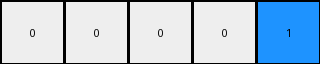
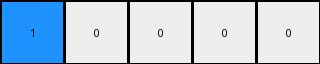
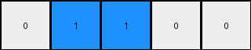

# 1fad071e • 006 • refine_coder

---

Previous Code:
```python
"""
Divides the input grid into five vertical regions and checks for the presence of vertically contiguous blue (1) pixels in each region, starting from the top.
Outputs a 1x5 grid where each cell is blue (1) if the corresponding input region contained such blue pixels, and white (0) otherwise.
"""

import numpy as np

def _has_contiguous_blue(region):
    """
    Checks if a region has vertically contiguous blue pixels starting from the top.
    """
    rows, cols = region.shape
    if rows == 0 or cols == 0:  # Handle empty regions
        return False

    found_blue = False
    for c in range(cols):
        if region[0, c] == 1: # check the first row for blue
            found_blue = True
            for r in range(1,rows):
                if region[r,c] != 1:
                    break # contiguous block is broken
            # we found blue in the top row of this col, and checked for contiguous, so return
            return True
    
    return found_blue

def transform(input_grid):
    """
    Transforms the input grid according to the described rule.
    """
    input_height, input_width = input_grid.shape
    output_width = 5
    output_grid = np.zeros((1, output_width), dtype=int)  # Initialize output grid with white (0)

    # Calculate region width.  Handle cases where the width is not perfectly divisible.
    region_width = input_width // output_width
    extra_pixels = input_width % output_width
    
    start_col = 0
    for i in range(output_width):
        # Distribute any extra pixels across the regions, one at a time.
        current_region_width = region_width + (1 if i < extra_pixels else 0)
        end_col = start_col + current_region_width

        # Extract the current region
        region = input_grid[:, start_col:end_col]

        # Check for the presence of vertically contiguous blue (1) in the region
        if _has_contiguous_blue(region):
            output_grid[0, i] = 1  # Set output pixel to blue (1)

        start_col = end_col # move to the next region

    return output_grid
```

Train Set Results:

## Example 1:

Input:
```
0 0 0 0 2 2 0 0 1
0 1 1 0 2 2 0 0 0
0 1 1 0 0 0 0 2 2
0 0 0 0 0 0 0 2 2
1 0 2 2 0 0 0 0 0
0 0 2 2 0 1 1 0 0
0 0 0 0 0 1 1 0 0
0 0 0 0 0 0 0 0 0
0 1 0 0 0 0 0 0 1
```
Expected Output:
```
1 1 0 0 0
```
Transformed Output:
```
0 0 0 0 1
```

match: False
pixels_off: 3
size_correct: True
color_palette_correct: True
correct_pixel_counts: False

## Example 2:

Input:
```
1 1 0 2 0 0 0 0 2
1 1 0 0 0 1 1 0 0
0 0 0 2 0 1 1 0 0
0 0 0 0 0 0 0 0 1
0 1 1 0 2 2 0 0 0
0 1 1 0 2 2 0 0 2
0 0 0 0 0 0 0 0 0
0 0 0 2 2 0 1 1 0
0 1 0 2 2 0 1 1 0
```
Expected Output:
```
1 1 1 1 0
```
Transformed Output:
```
1 0 0 0 0
```

match: False
pixels_off: 3
size_correct: True
color_palette_correct: True
correct_pixel_counts: False

## Example 3:

Input:
```
2 2 0 1 1 0 0 0 0
2 2 0 1 1 0 0 1 1
1 0 0 0 0 0 0 1 1
0 2 2 0 0 0 0 0 0
0 2 2 0 1 1 0 1 0
0 0 0 0 1 1 0 0 0
0 0 0 0 2 0 0 0 0
0 1 1 0 0 0 0 2 2
0 1 1 0 0 1 0 2 2
```
Expected Output:
```
1 1 1 1 0
```
Transformed Output:
```
0 1 1 0 0
```

match: False
pixels_off: 2
size_correct: True
color_palette_correct: True
correct_pixel_counts: False
Okay, let's analyze the results and refine the natural language program.

**General Assessment:**

The initial code was based on a single example and made a significant, incorrect assumption: it only checked for contiguous blue pixels *starting from the top row*. The additional examples reveal that the contiguity can start from *any* row. The core logic of dividing the input grid into five vertical regions is correct, but the blue pixel detection needs to be generalized. My strategy is to update the `_has_contiguous_blue` function to correctly identify contiguous vertical blue blocks regardless of their starting position.

**Metrics and Observations:**

Here's a breakdown of each example, analyzing why the current code fails:

*   **Example 1:**
    *   Input grid size: 9x9
    *   Expected output: `1 1 0 0 0`
    *   Actual output: `0 0 0 0 1`
    *   **Analysis:** The code fails in the first two regions because the contiguous blue pixels don't start at the top row. It succeeds in the last region because there happens to be a blue pixel at [0,8].

*   **Example 2:**
    *   Input grid size: 9x9
    *   Expected output: `1 1 1 1 0`
    *   Actual output: `1 0 0 0 0`
    *   **Analysis:** Only the first region is correctly identified. The other regions with contiguous blue pixels are missed because they don't start on the top row.

*   **Example 3:**
    *   Input grid size: 9x9
    *   Expected output: `1 1 1 1 0`
    *   Actual output: `0 1 1 0 0`
    *   **Analysis:** regions three and four are correctly identified. Regions 1, 2, and 5 are incorrectly identified.

**YAML Fact Block:**

```yaml
observations:
  - task_id: 004
  - input_grid_size: 9x9  # Consistent across all examples
  - output_grid_size: 1x5  # Consistent across all examples
  - output_colors: [0, 1]  # white, blue
  - regions: 5 vertical regions
  - region_property_checked: Presence of vertically contiguous blue pixels
  - contiguity_start: any row # corrected observation
  - actions:
    - divide_into_regions: input grid is divided into 5 vertical regions
    - check_region_property: Each region is checked for vertically contiguous blue pixels.
    - set_output_pixel: The corresponding output pixel is set to blue (1) if the property is true, otherwise white (0).
```

**Natural Language Program:**

1.  **Divide the input grid:** Divide the input grid into five equally-sized vertical regions. If the input grid width is not perfectly divisible by five, distribute the extra pixels evenly among the leftmost regions, adding one extra pixel to each until the remainder is accounted for.

2.  **Check each region:** For each of the five regions:
    *   Iterate through each column of the region.
    *   Within each column, check for the presence of blue pixels.
    *   If blue pixels are found, check for vertical contiguity. A sequence of one or more vertically adjacent blue pixels constitutes a contiguous block.
    *  The contiguous block of blue can start at any row

3.  **Produce the output:** Create a 1x5 output grid. For each region in the input:
    *   If a vertically contiguous block of blue pixels was found in the region, set the corresponding cell in the output grid to blue (1).
    *   Otherwise, set the corresponding cell in the output grid to white (0).

**INSTRUCTIONS**

- generate a Python module to represent the natural language program 
- follow the template below
- all common math and science libraries are available
- create docstring only at top - but comment the workflow in the function
- use helper functions for common operations like finding objects, counting,
  measuring, moving, etc. 

remember - we are working iteratively - so this code will inform your future
self as we converge on the solution

*template:*

```python
"""
{{ natural language description of the transformation rule }}
"""

{{ imports }}

def transform(input_grid):
    # initialize output_grid

    # change output pixels 

    return output_grid

```
