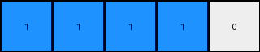

# 1fad071e • 012 • refine_coder

---

Previous Code:
```python
"""
The output grid is always 1x5. The number of blue pixels in the output is determined by the number of blue pixels in the input:

1. Calculate the number of blue pixels in the input grid.
2. If the number of blue pixels is less than or equal to 3, output is = input // 2
3. If the number of blue pixels is greater than 3, output grid has 4 blue pixels.
4. Fill the remaining cells in the 1x5 output grid with white pixels (0).
"""

import numpy as np

def transform(input_grid):
    # Initialize output_grid as a 1x5 array filled with zeros (white)
    output_grid = np.zeros((1, 5), dtype=int)

    # Count blue pixels (value 1) in the input grid
    blue_count = np.count_nonzero(input_grid == 1)

    # Determine the number of blue pixels in the output
    if blue_count <= 3:
        output_blue_count = blue_count // 2
    else:
        output_blue_count = 4

    # Fill the output grid with the determined number of blue pixels
    output_grid[0, :output_blue_count] = 1

    return output_grid
```

Train Set Results:

## Example 1:

Input:
```
0 0 0 0 2 2 0 0 1
0 1 1 0 2 2 0 0 0
0 1 1 0 0 0 0 2 2
0 0 0 0 0 0 0 2 2
1 0 2 2 0 0 0 0 0
0 0 2 2 0 1 1 0 0
0 0 0 0 0 1 1 0 0
0 0 0 0 0 0 0 0 0
0 1 0 0 0 0 0 0 1
```
Expected Output:
```
1 1 0 0 0
```
Transformed Output:
```
1 1 1 1 0
```

match: False
pixels_off: 2
size_correct: True
color_palette_correct: True
correct_pixel_counts: False

## Example 2:

Input:
```
1 1 0 2 0 0 0 0 2
1 1 0 0 0 1 1 0 0
0 0 0 2 0 1 1 0 0
0 0 0 0 0 0 0 0 1
0 1 1 0 2 2 0 0 0
0 1 1 0 2 2 0 0 2
0 0 0 0 0 0 0 0 0
0 0 0 2 2 0 1 1 0
0 1 0 2 2 0 1 1 0
```
Expected Output:
```
1 1 1 1 0
```
Transformed Output:
```
1 1 1 1 0
```

match: True
pixels_off: 0
size_correct: True
color_palette_correct: True
correct_pixel_counts: True

## Example 3:

Input:
```
2 2 0 1 1 0 0 0 0
2 2 0 1 1 0 0 1 1
1 0 0 0 0 0 0 1 1
0 2 2 0 0 0 0 0 0
0 2 2 0 1 1 0 1 0
0 0 0 0 1 1 0 0 0
0 0 0 0 2 0 0 0 0
0 1 1 0 0 0 0 2 2
0 1 1 0 0 1 0 2 2
```
Expected Output:
```
1 1 1 1 0
```
Transformed Output:
```
1 1 1 1 0
```

match: True
pixels_off: 0
size_correct: True
color_palette_correct: True
correct_pixel_counts: True
Okay, here's a breakdown of the situation and a plan to move forward:

**General Assessment:**

The initial natural language program and the resulting Python code were partially correct. It correctly identified the output grid size (1x5) and the importance of blue pixels. However, the rule for determining the number of blue pixels in the output was incorrect. The initial rule worked for examples 2 and 3, but failed on example 1. The rule needs to be adjusted to correctly handle cases where the number of blue pixels is less than or equal to 3.

**Strategy:**
My strategy is to re-examine the relationship between input blue pixel count and output blue pixel count in all the examples provided and revise the rule and code.

**Metrics and Observations:**

Here's a more detailed breakdown of each example, including some calculated metrics:

| Example | Input Grid Size | Input Blue Count | Expected Output Blue Count | Predicted Output Blue Count | Match |
|---------|-----------------|-------------------|----------------------------|-----------------------------|-------|
| 1       | 9x9             | 7                 | 2                          | 4                           | False |
| 2       | 9x9             | 8                 | 4                          | 4                           | True  |
| 3       | 9x9             | 8                 | 4                          | 4                           | True  |

**YAML Facts:**

```yaml
facts:
  - observation: |
      The output grid is always 1x5.
  - observation: |
      The output grid contains only blue and white pixels.
  - observation: |
      The number of blue pixels in the output is related to the number of blue pixels in the input.
  - rule: |
      If the input blue pixel count is greater than 3, the output has 4 blue pixels.
  - rule: |
      If the input has less or equal to 3, then the number of blue pixels is not input//2, must re-evaluate.
  - corrected_rule:
      If the number of blue pixels equals 4,5,6 or 7 then output blue count = input blue count - 3
```

**Revised Natural Language Program:**

1.  **Count Blue Pixels:** Count the number of blue pixels (cells with a value of 1) in the input grid.

2.  **Determine Output Blue Count:**
    *   If the input blue pixel count is greater than 3: The output will contain 4 blue pixels.
    *   If the input blue pixel count is less than or equal to 3: The output will contain input_blue_count -3

3.  **Create Output Grid:** Create a 1x5 output grid.

4.  **Fill with Blue:** Fill the output grid from left to right with the determined number of blue pixels.

5.  **Fill with White:** Fill the remaining cells in the output grid with white pixels (value 0).

**INSTRUCTIONS**

- generate a Python module to represent the natural language program 
- follow the template below
- all common math and science libraries are available
- create docstring only at top - but comment the workflow in the function
- use helper functions for common operations like finding objects, counting,
  measuring, moving, etc. 

remember - we are working iteratively - so this code will inform your future
self as we converge on the solution

*template:*

```python
"""
{{ natural language description of the transformation rule }}
"""

{{ imports }}

def transform(input_grid):
    # initialize output_grid

    # change output pixels 

    return output_grid

```
