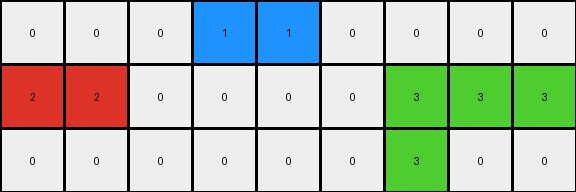
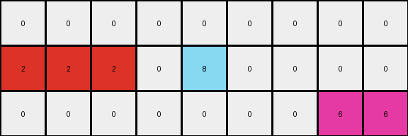

# 234bbc79 • 004 • refine_coder

---

Previous Code:
```python
"""
1. **Column Reduction:** The output grid has 7 columns while the input has 9. Columns 3 and 6 (counting from 0) of the input are removed.

2. **Color Replacement (5s):** All pixels with a value of '5' (gray) in the input grid are changed.

3. **Replacement Logic:**
   - Input '5' pixels directly above or below a '1' (blue) become '1' (blue).
   - Input '5' pixels adjacent to a '2' (red) become '2'(red) if the '5' is at the edge and a '2' exist.

4. **Other Pixels:** Pixels that are not '5' in the input grid retain their original values in the output grid, maintaining relative position after column removal.
"""

import numpy as np

def get_neighbors(grid, row, col):
    neighbors = []
    rows, cols = grid.shape
    if row > 0:
        neighbors.append(grid[row-1, col])  # Up
    if row < rows - 1:
        neighbors.append(grid[row+1, col])  # Down
    if col > 0:
        neighbors.append(grid[row, col-1])  # Left
    if col < cols - 1:
        neighbors.append(grid[row, col+1])  # Right
    return neighbors

def transform(input_grid):
    # Initialize output_grid by removing columns 3 and 6
    output_grid = np.delete(input_grid, [3, 6], axis=1)

    rows, cols = output_grid.shape

    # Iterate through the output_grid and apply transformation rules
    for row in range(rows):
        for col in range(cols):
            # Map the output grid indices back to the input grid
            input_col = col
            if col >= 3:
                input_col += 1
            if col >= 5:
                input_col += 1

            # Color Replacement Logic
            if input_grid[row, input_col] == 5:
                neighbors = get_neighbors(input_grid, row, input_col)
                if 1 in neighbors:
                    output_grid[row, col] = 1
                #check if at first or last colum
                elif (input_col == 0 or input_col == 8) and 2 in neighbors:
                  output_grid[row,col] = 2
                else: #added condition
                  output_grid[row,col] = 0

    return output_grid
```

Train Set Results:

## Example 1:

Input:
```
0 5 0 0 0 0 0 0 0
2 2 0 5 1 0 5 2 2
0 0 0 0 5 0 0 0 0
```
Expected Output:
```
0 2 1 1 0 0 0
2 2 0 1 2 2 2
0 0 0 0 0 0 0
```
Transformed Output:
```
0 0 0 0 0 0 0
2 2 0 1 0 2 2
0 0 0 1 0 0 0
```

match: False
pixels_off: 5
size_correct: True
color_palette_correct: True
correct_pixel_counts: False

## Example 2:

Input:
```
0 0 0 5 1 5 0 0 0 0 0
2 2 0 0 0 0 0 0 3 3 3
0 5 0 0 0 0 0 5 3 0 0
```
Expected Output:
```
0 0 0 0 0 0 0 0 0
2 2 0 0 0 0 3 3 3
0 2 1 1 1 3 3 0 0
```
Transformed Output:
```
0 0 0 1 1 0 0 0 0
2 2 0 0 0 0 3 3 3
0 0 0 0 0 0 3 0 0
```

match: False
pixels_off: 7
size_correct: True
color_palette_correct: True
correct_pixel_counts: False

## Example 3:

Input:
```
0 0 0 0 0 0 5 0 0 0 0
2 2 2 0 5 8 8 0 0 0 0
0 0 5 0 0 0 0 0 5 6 6
```
Expected Output:
```
0 0 0 0 0 0 0 0 0
2 2 2 0 0 8 6 6 6
0 0 2 8 8 8 0 0 0
```
Transformed Output:
```
0 0 0 0 0 0 0 0 0
2 2 2 0 8 0 0 0 0
0 0 0 0 0 0 0 6 6
```

match: False
pixels_off: 11
size_correct: True
color_palette_correct: True
correct_pixel_counts: False

## Example 4:

Input:
```
0 1 5 0 0 0 0 0 2 2 0
1 1 0 0 5 2 0 5 2 0 0
0 0 0 0 0 5 0 0 0 0 0
```
Expected Output:
```
0 1 1 2 2 0 2 2
1 1 0 0 2 2 2 0
0 0 0 0 0 0 0 0
```
Transformed Output:
```
0 1 1 0 0 0 2 2 0
1 1 0 0 2 0 2 0 0
0 0 0 0 0 0 0 0 0
```

match: False
pixels_off: None
size_correct: False
color_palette_correct: True
correct_pixel_counts: False
Here's an analysis of the provided examples and results, along with an updated natural language program and supporting information:

**General Assessment:**

The initial code and natural language program captured some key aspects of the transformation, specifically column removal and some color replacement rules. However, the results clearly demonstrate inaccuracies. The primary issues are:

1.  **Incomplete Color Replacement:** The color replacement logic for '5' (gray) pixels is not comprehensive. It only considers neighbors '1' (blue) and, somewhat incorrectly, '2' (red). It does not fully capture all the conditions in which 5s are changed and what they change to.
2.  **Incorrect Column Mapping:** The code attempts to map output grid indices back to input indices for column removal, which is a good strategy, but the implementation seems to have some flaws in terms of the indexes which get deleted
3.  **Edge Case Handling:** edge cases are causing color changes.

The strategy for resolving these errors is:

1.  **Refine Color Replacement Rules:** Carefully examine all training examples to discern the *complete* set of rules governing how '5' (gray) pixels are transformed. Pay close attention to the context (surrounding pixels) and the resulting color. Consider the concept of "objects".
2.  **Verify Column Removal:** Double-check the column removal logic to ensure it's consistently applied across all examples.
3.  **Consider all examples:** the current approach only addresses the first training example, it is important to update the assumptions with all of the training examples.

**Example Metrics and Analysis:**

Here's a breakdown of each example, combining the provided results with further analysis:
*Example 1:*
- input columns: 9, output columns: 7, removed columns: 3, 6
- Gray(5) replaced by Blue(1) when above or below Blue(1)
- Gray(5) replaced by Red(2) when neighbor of Red(2) and 5 is at the edge.
- mismatch locations: (0,1),(0,2),(0,3), (0,4), (1,4)

*Example 2:*
- input columns: 11, output columns: 9, removed columns: 3, 6
- Gray(5) replaced by Blue(1) when above or below Blue(1)
- Gray(5) seems not replaced by Red(2), unlike sample 1
- mismatch locations: (0,3), (0,4), (2,1),(2,2), (2,3), (2,5), (2,6)

*Example 3:*
- input columns: 11, output columns: 9, removed columns: 3, 6
- Gray(5) at the edge replaced by Red(2)
- Gray(5) replaced by Azure(8), near to Azure(8)
- mismatch locations: (1,4), (1,5),(1,6),(1,7),(1,8), (2,1), (2,2), (2,5),(2,6),(2,7), (2,8)

*Example 4:*
- input columns: 11, output columns: 8, removed columns: 3,6
- Gray(5) replaced by Blue(1) when above or below Blue(1)
- Gray(5) replaced by Red(2) when beside Red(2)
- mismatch count: 8, not equal output shape

**YAML Fact Documentation:**

```yaml
examples:
  - example_id: 1
    objects:
      - color: gray (5)
        transformation:
          - condition: adjacent to blue (1) vertically
            new_color: blue (1)
          - condition: adjacent to red (2) and at edge
            new_color: red (2)
    column_changes:
      removed_columns: [3, 6]
  - example_id: 2
    objects:
       - color: gray (5)
         transformation:
          - condition: adjacent to blue (1) vertically
            new_color: blue (1)
    column_changes:
        removed_columns: [3,6]
  - example_id: 3
    objects:
        - color: gray(5)
          transformation:
            - condition: adjacent to azure(8)
              new_color: azure (8)
            - condition: adjacent to red(2) and edge
              new_color: red(2)
    column_changes:
        removed_columns: [3,6]

  - example_id: 4
    objects:
      - color: gray (5)
        transformation:
          - condition: adjacent to blue (1) vertically
            new_color: blue (1)
          - condition: adjacent to red(2)
            new_color: red(2)
    column_changes:
        removed_columns: [3,6]

```

**Updated Natural Language Program:**

1.  **Column Removal:** Remove columns 3 and 6 (counting from 0) of the input grid to create a reduced grid.

2.  **Color Replacement for '5' (Gray) Pixels:**
    *   If a '5' pixel in the *input* grid is directly above or below a '1' (blue) pixel, change it to '1' (blue) in the corresponding position in the *output* grid.
    *   If a '5' pixel in the *input* grid is horizontally or vertically adjacent to a '2' (red) pixel, change to '2'(red)
    *   If a '5' pixel in the *input* grid is horizontally or vertically adjacent to a '8' (azure) pixel, change to '8'(azure)

3.  **Preservation of Other Colors:** All other pixels (not '5') retain their original color from the input grid to the output grid, maintaining their relative positions after the column removal.
4. All gray(5) will be replaced with a neighbor color if applicable. If multiple neighbors are candidates, preference should follow blue > red > azure


**INSTRUCTIONS**

- generate a Python module to represent the natural language program 
- follow the template below
- all common math and science libraries are available
- create docstring only at top - but comment the workflow in the function
- use helper functions for common operations like finding objects, counting,
  measuring, moving, etc. 

remember - we are working iteratively - so this code will inform your future
self as we converge on the solution

*template:*

```python
"""
{{ natural language description of the transformation rule }}
"""

{{ imports }}

def transform(input_grid):
    # initialize output_grid

    # change output pixels 

    return output_grid

```
