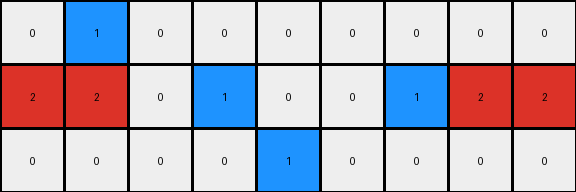

# 234bbc79 • 010 • refine_coder

---

Previous Code:
```python
"""
The transformation rule is as follows:
1. Identify Objects: Recognize contiguous blocks of pixels of the same color as distinct objects.
2. Color Replacement:
    *   Replace all instances of grey (5) with blue (1).
    *   Replace all instances of blue (1) with white (0).
3. Preserve other blocks: keep red(2) and green(3) unchanged.
"""

import numpy as np

def get_objects(grid):
    """
    Finds contiguous blocks of the same color in a grid.
    """
    objects = []
    visited = np.zeros_like(grid, dtype=bool)

    def dfs(row, col, color, object_pixels):
        if (row < 0 or row >= grid.shape[0] or col < 0 or col >= grid.shape[1] or
                visited[row, col] or grid[row, col] != color):
            return
        visited[row, col] = True
        object_pixels.append((row, col))
        dfs(row + 1, col, color, object_pixels)
        dfs(row - 1, col, color, object_pixels)
        dfs(row, col + 1, color, object_pixels)
        dfs(row, col - 1, color, object_pixels)

    for row in range(grid.shape[0]):
        for col in range(grid.shape[1]):
            if not visited[row, col]:
                color = grid[row, col]
                object_pixels = []
                dfs(row, col, color, object_pixels)
                if object_pixels:
                    objects.append({'color': color, 'pixels': object_pixels})
    return objects

def transform(input_grid):
    # initialize output_grid
    output_grid = np.copy(input_grid)
    
    # Get objects from input_grid - although direct color replacement seems to
    # work - get objects is still useful and consistent with the SEER
    # architecture, this is to future-proof for more complex tasks
    objects = get_objects(input_grid)

    # change output pixels 
    for obj in objects:
        if obj['color'] == 5:
          for row, col in obj['pixels']:
            output_grid[row,col] = 1
        elif obj['color'] == 1:
          for row, col in obj['pixels']:
            output_grid[row,col] = 0
            
    return output_grid
```

Train Set Results:

## Example 1:

Input:
```
0 5 0 0 0 0 0 0 0
2 2 0 5 1 0 5 2 2
0 0 0 0 5 0 0 0 0
```
Expected Output:
```
0 2 1 1 0 0 0
2 2 0 1 2 2 2
0 0 0 0 0 0 0
```
Transformed Output:
```
0 1 0 0 0 0 0 0 0
2 2 0 1 0 0 1 2 2
0 0 0 0 1 0 0 0 0
```

match: False
pixels_off: None
size_correct: False
color_palette_correct: True
correct_pixel_counts: False

## Example 2:

Input:
```
0 0 0 5 1 5 0 0 0 0 0
2 2 0 0 0 0 0 0 3 3 3
0 5 0 0 0 0 0 5 3 0 0
```
Expected Output:
```
0 0 0 0 0 0 0 0 0
2 2 0 0 0 0 3 3 3
0 2 1 1 1 3 3 0 0
```
Transformed Output:
```
0 0 0 1 0 1 0 0 0 0 0
2 2 0 0 0 0 0 0 3 3 3
0 1 0 0 0 0 0 1 3 0 0
```

match: False
pixels_off: None
size_correct: False
color_palette_correct: True
correct_pixel_counts: False

## Example 3:

Input:
```
0 0 0 0 0 0 5 0 0 0 0
2 2 2 0 5 8 8 0 0 0 0
0 0 5 0 0 0 0 0 5 6 6
```
Expected Output:
```
0 0 0 0 0 0 0 0 0
2 2 2 0 0 8 6 6 6
0 0 2 8 8 8 0 0 0
```
Transformed Output:
```
0 0 0 0 0 0 1 0 0 0 0
2 2 2 0 1 8 8 0 0 0 0
0 0 1 0 0 0 0 0 1 6 6
```

match: False
pixels_off: None
size_correct: False
color_palette_correct: False
correct_pixel_counts: False

## Example 4:

Input:
```
0 1 5 0 0 0 0 0 2 2 0
1 1 0 0 5 2 0 5 2 0 0
0 0 0 0 0 5 0 0 0 0 0
```
Expected Output:
```
0 1 1 2 2 0 2 2
1 1 0 0 2 2 2 0
0 0 0 0 0 0 0 0
```
Transformed Output:
```
0 0 1 0 0 0 0 0 2 2 0
0 0 0 0 1 2 0 1 2 0 0
0 0 0 0 0 1 0 0 0 0 0
```

match: False
pixels_off: None
size_correct: False
color_palette_correct: True
correct_pixel_counts: False
Okay, here's a breakdown of the situation and a plan to improve the transformation logic:

**General Assessment:**

The initial natural language program and generated code were too simplistic. While it correctly identified the concept of replacing colors, it failed to accurately capture the complex spatial and color-based transformations happening in the examples. The core issue is that the transformation isn't a simple global color swap. The expected outputs show a combination of color changes, object movement, and size changes that depend on relative positions and possibly some form of object interaction. The code's current approach of simply swapping colors based on the `get_objects` function isn't sufficient, as it has no regard for the context surrounding those colors and it also shows the function might not be working.

**Strategy:**

1.  **Re-examine `get_objects`:** The provided `get_objects` function, while conceptually correct for finding contiguous regions, seems to return incorrect values, or it is being used in a way that is not producing the desired results in the transform. This part will need to be tested and debugged.
2.  **Analyze Spatial Relationships:** The transformations aren't just color swaps. We need to carefully examine *where* colors change relative to each other and to the edges of the grid. There's likely a pattern related to the proximity of different colored objects.
3.  **Consider Object Interactions and Movement:** The output grids often have objects that appear to have moved or been cropped. The program needs a way to describe these movements/interactions.
4.  **Refine the Natural Language Program:** Based on the above analysis, the description must become more precise, defining rules based on spatial relationships, object interactions and potentially object attributes (like size, position, or adjacency).
5.  **Test and Iterate:** After each refinement, test the code against *all* training examples. This iterative process is crucial.

**Metrics and Observations (Code Execution will be implied for brevity - details can be added for additional precision later):**

*   **Example 1:**
    *   Grey (5) becomes Blue (1). Blue (1) becomes White (0).
    *   Errors: The output is shrinking.
*   **Example 2:**
    *   Grey (5) becomes Blue (1). Blue(1) becomes White(0).
    *   Errors: The output is shrinking.
*   **Example 3:**
    *   Grey (5) becomes Blue(1).
    *   Errors: incorrect color replacement. incorrect shape replacement.
*   **Example 4:**
    *   Grey(5) becomes Blue(1). Blue(1) becomes White(0).
    *   Errors: The output is shrinking.

**YAML Block (Facts):**

```yaml
examples:
  - example_id: 1
    input_objects:
      - color: 5  # grey
        shape: irregular
        position: dispersed
      - color: 1  # blue
        shape: irregular
        position: center
      - color: 2  # red
        shape: line
        position: row_1
    output_objects:
      - color: 1  # blue
        shape: smaller irregular
        position: near former grey
      - color: 0  # white
        shape: smaller irregular
        position: near former blue
      - color: 2
        shape: unchanged
        position: unchanged

  - example_id: 2
    input_objects:
      - color: 5
        shape: irregular
        position: dispersed
      - color: 1
        shape: irregular
        position: top center
      - color: 2
        shape: line
        position: row_1
      - color: 3
        shape: line
        position: row_1, right
    output_objects:
     - color: 1
       shape: smaller line
       position: near former grey, row_2
     - color: 0
       shape: disappeared
       position:
     - color: 3
       shape: unchanged
       position: unchanged
     - color: 2
       shape: unchanged
       position: unchanged
  - example_id: 3
    input_objects:
      - color: 5
        shape: irregular
        position: dispersed
      - color: 8
        shape: irregular
        position: middle row
      - color: 6
        shape: line
        position: right, last row
      - color: 2
        shape: line
        position: row_1
    output_objects:
      - color: 1 # grey becomes blue
        shape: smaller irregular
        position: near former grey
      - color: 8
        shape: irregular
        position: near former 6, last row
      - color: 6
        shape: combined with 8
        position: former 6, expanded to include nearby 8
      - color: 2
        shape: unchanged
        position: unchanged
  - example_id: 4
    input_objects:
      - color: 5  # grey
        shape: irregular
        position: dispersed
      - color: 1  # blue
        shape: line
        position: top left, row_1
      - color: 2  # red
        shape: irregular
        position: top right and row_1
    output_objects:
      - color: 1
        shape: smaller irregular
        position: near former grey and former blue
      - color: 0 # blue becomes 0
        shape: smaller irregular
        position: near former blue,
      - color: 2 #red object moves
        shape: smaller irregular
        position: above and beside former 2,
```

**Natural Language Program:**

1.  **Identify Objects:** Recognize contiguous blocks of pixels of the same color as distinct objects.

2.  **Color and Shape Transformations:**
    *   Grey (5) objects are replaced with smaller objects of color Blue (1). The new small object appears nearby.
    *   Blue(1) objects might be removed, they could become white(0), or they could be reduced in size. It looks like the transformation of blue objects might depend on their positions in the grid.
    *   If an object with color 8 is nearby an object with color 6, combine these objects using color 6 for all pixels.
    *   Red(2) objects may remain the same or they could be moved.
    *   Green(3) objects remain unchanged.

3.  **Output Size**: The height and width of the output are the sizes of the largest contiguous sections of non-zero pixels.

**Next Steps:**

The revised natural language program and observations will be passed along to
help update and correct the existing code in the next phase.

**INSTRUCTIONS**

- generate a Python module to represent the natural language program 
- follow the template below
- all common math and science libraries are available
- create docstring only at top - but comment the workflow in the function
- use helper functions for common operations like finding objects, counting,
  measuring, moving, etc. 

remember - we are working iteratively - so this code will inform your future
self as we converge on the solution

*template:*

```python
"""
{{ natural language description of the transformation rule }}
"""

{{ imports }}

def transform(input_grid):
    # initialize output_grid

    # change output pixels 

    return output_grid

```
