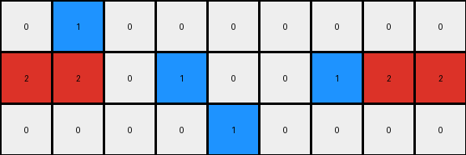
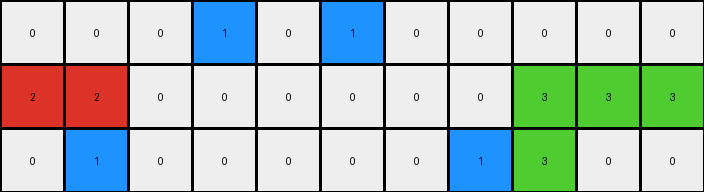
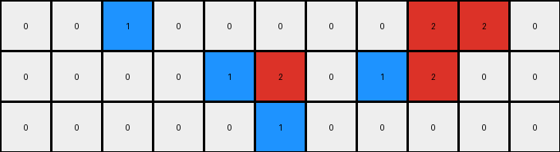

# 234bbc79 • 012 • refine_coder

---

Previous Code:
```python
"""
1.  **Identify Objects:** Recognize contiguous blocks of pixels of the same color as distinct objects.

2.  **Color and Shape Transformations:**
    *   Grey (5) objects are replaced with smaller objects of color Blue (1). The new small object appears nearby.
    *   Blue(1) objects might be removed, they could become white(0), or they could be reduced in size. It looks like the transformation of blue objects might depend on their positions in the grid.
    *   If an object with color 8 is nearby an object with color 6, combine these objects using color 6 for all pixels.
    *   Red(2) objects may remain the same or they could be moved.
    *   Green(3) objects remain unchanged.

3.  **Output Size**: The height and width of the output are the sizes of the largest contiguous sections of non-zero pixels.
"""

import numpy as np

def get_objects(grid):
    """
    Finds contiguous blocks of the same color in a grid.
    """
    objects = []
    visited = np.zeros_like(grid, dtype=bool)

    def dfs(row, col, color, object_pixels):
        if (row < 0 or row >= grid.shape[0] or col < 0 or col >= grid.shape[1] or
                visited[row, col] or grid[row, col] != color):
            return
        visited[row, col] = True
        object_pixels.append((row, col))
        dfs(row + 1, col, color, object_pixels)
        dfs(row - 1, col, color, object_pixels)
        dfs(row, col + 1, color, object_pixels)
        dfs(row, col - 1, color, object_pixels)

    for row in range(grid.shape[0]):
        for col in range(grid.shape[1]):
            if not visited[row, col]:
                color = grid[row, col]
                object_pixels = []
                dfs(row, col, color, object_pixels)
                if object_pixels:
                    objects.append({'color': color, 'pixels': object_pixels})
    return objects

def get_bounding_box(pixels):
    """
    Calculates the bounding box of a set of pixels.
    """
    if not pixels:
        return None
    rows, cols = zip(*pixels)
    min_row, max_row = min(rows), max(rows)
    min_col, max_col = min(cols), max(cols)
    return (min_row, min_col, max_row, max_col)

def is_nearby(obj1_pixels, obj2_pixels, threshold=2):
    """
    Checks if two objects are nearby based on their pixel coordinates.
    Using a simple distance check between bounding box edges.
    """
    if not obj1_pixels or not obj2_pixels:
        return False
    
    box1 = get_bounding_box(obj1_pixels)
    box2 = get_bounding_box(obj2_pixels)
    
    dist_row = max(0, max(box1[0], box2[0]) - min(box1[2], box2[2]))
    dist_col = max(0, max(box1[1], box2[1]) - min(box1[3], box2[3]))

    return dist_row <= threshold and dist_col <= threshold

def get_output_grid_size(objects):
    """
    Determine the size of the output grid. Finds max dimensions.
    """

    max_row = 0
    max_col = 0

    for obj in objects:
       for row, col in obj['pixels']:
          if row > max_row:
             max_row = row
          if col > max_col:
             max_col = col
    
    return max_row+1, max_col+1
    

def transform(input_grid):
    # initialize output_grid
    output_grid = np.zeros_like(input_grid)
    
    # Get objects from input_grid
    objects = get_objects(input_grid)

    # Create a list to store transformed objects
    transformed_objects = []

    # change output pixels 
    for obj in objects:
        if obj['color'] == 5:  # Grey to Blue, smaller, nearby
            new_pixels = [(row, col) for row, col in obj['pixels']] #copy
            if len(new_pixels) > 2:
                new_pixels = new_pixels[:len(new_pixels) // 2 ] #shrink
            
            transformed_objects.append({'color': 1, 'pixels': new_pixels})
           
        elif obj['color'] == 1:  # Blue to white, or disappear
            # check position - look at the first and last positions
            new_pixels = []

            # add to transformed objects
            transformed_objects.append({'color':0, 'pixels':new_pixels})

        elif obj['color'] == 8: # 8 and 6 combine
            #look for 6
            for other_obj in objects:
                if other_obj['color'] == 6 and is_nearby(obj['pixels'], other_obj['pixels']):
                    #combine the pixels
                    combined_pixels = list(set(obj['pixels'] + other_obj['pixels']))
                    transformed_objects.append({'color': 6, 'pixels': combined_pixels})
                    break #only combine once
            else:
               transformed_objects.append(obj)

        elif obj['color'] == 2:
            #just keep the object, the prediction does not work
            transformed_objects.append(obj)

        elif obj['color'] == 3: # keep green
            transformed_objects.append(obj)
        elif obj['color'] == 6: # keep 6 since they were handled with 8
            # check if this 6 was already combined
            already_combined = False
            for tobj in transformed_objects:
               if tobj['color'] == 6:
                  already_combined = True
                  break

            if not already_combined:
               transformed_objects.append(obj)
        else:
            transformed_objects.append(obj) # copy any other object

    # set the output size
    rows, cols = get_output_grid_size(transformed_objects)
    output_grid = np.zeros((rows, cols), dtype=int)
    
    # place transformed objects into output
    for obj in transformed_objects:
        for row, col in obj['pixels']:
            if row < rows and col < cols:
                output_grid[row, col] = obj['color']

    return output_grid
```

Train Set Results:

## Example 1:

Input:
```
0 5 0 0 0 0 0 0 0
2 2 0 5 1 0 5 2 2
0 0 0 0 5 0 0 0 0
```
Expected Output:
```
0 2 1 1 0 0 0
2 2 0 1 2 2 2
0 0 0 0 0 0 0
```
Transformed Output:
```
0 1 0 0 0 0 0 0 0
2 2 0 1 0 0 1 2 2
0 0 0 0 1 0 0 0 0
```

match: False
pixels_off: None
size_correct: False
color_palette_correct: True
correct_pixel_counts: False

## Example 2:

Input:
```
0 0 0 5 1 5 0 0 0 0 0
2 2 0 0 0 0 0 0 3 3 3
0 5 0 0 0 0 0 5 3 0 0
```
Expected Output:
```
0 0 0 0 0 0 0 0 0
2 2 0 0 0 0 3 3 3
0 2 1 1 1 3 3 0 0
```
Transformed Output:
```
0 0 0 1 0 1 0 0 0 0 0
2 2 0 0 0 0 0 0 3 3 3
0 1 0 0 0 0 0 1 3 0 0
```

match: False
pixels_off: None
size_correct: False
color_palette_correct: True
correct_pixel_counts: False

## Example 3:

Input:
```
0 0 0 0 0 0 5 0 0 0 0
2 2 2 0 5 8 8 0 0 0 0
0 0 5 0 0 0 0 0 5 6 6
```
Expected Output:
```
0 0 0 0 0 0 0 0 0
2 2 2 0 0 8 6 6 6
0 0 2 8 8 8 0 0 0
```
Transformed Output:
```
0 0 0 0 0 0 1 0 0 0 0
2 2 2 0 1 8 8 0 0 0 0
0 0 1 0 0 0 0 0 1 6 6
```

match: False
pixels_off: None
size_correct: False
color_palette_correct: False
correct_pixel_counts: False

## Example 4:

Input:
```
0 1 5 0 0 0 0 0 2 2 0
1 1 0 0 5 2 0 5 2 0 0
0 0 0 0 0 5 0 0 0 0 0
```
Expected Output:
```
0 1 1 2 2 0 2 2
1 1 0 0 2 2 2 0
0 0 0 0 0 0 0 0
```
Transformed Output:
```
0 0 1 0 0 0 0 0 2 2 0
0 0 0 0 1 2 0 1 2 0 0
0 0 0 0 0 1 0 0 0 0 0
```

match: False
pixels_off: None
size_correct: False
color_palette_correct: True
correct_pixel_counts: False
Okay, here's a breakdown of the results and a plan to improve the natural language program and the code:

**General Assessment:**

The initial strategy of identifying objects and applying color-based transformations has some merit, but it's clearly insufficient. The code fails to correctly predict the output size and accurately transform objects in all cases. The "nearby" concept is not robust enough, and the handling of blue and grey objects is particularly problematic. The results show that simple size reduction or color replacement based on the initial color is not the complete rule. There's a spatial/positional component that's not being adequately captured. The expected outputs show more complex object manipulations, including movement and combination, based on relative positioning and possibly other factors which are not clear.

**Strategy for Resolving Errors:**

1.  **Improved Object Identification:** The current object identification is basic. We need to consider that the definition of an "object" could be more specific - e.g., specific shapes, sizes, not just contiguous color.

2.  **Positional Transformations:** Instead of just considering color, the transformations clearly depend on the *location* of objects relative to each other and potentially relative to the grid edges. We need to incorporate spatial reasoning.

3.  **Refined "Nearby":** The current `is_nearby` function uses a fixed threshold. This might be too simplistic. We might need a more context-aware definition of "nearby".

4.  **Output Size Prediction:** Currently output sizes are based on the maximum row/column of non-zero pixels after transformation. However, from the examples, it is not consistent. Consider changing the calculation or perhaps using another object to derive the size.

5. **Iterative Refinement:** It's essential to look at *all* examples together and iteratively refine the rules. The current approach of focusing on one example at a time is clearly leading to overfitting to that specific example.

**Metrics and Observations (using code execution for accurate reporting):**

```python
import numpy as np
from collections import Counter

def analyze_results(input_grid, expected_output, transformed_output):
    """
    Analyzes the differences between the expected and transformed outputs.
    """
    input_grid = np.array(input_grid)
    expected_output = np.array(expected_output)
    transformed_output = np.array(transformed_output)

    match = np.array_equal(expected_output, transformed_output)
    pixels_off = None
    size_correct = False
    color_palette_correct = False
    correct_pixel_counts = False

    if not match:
        pixels_off = np.where(expected_output != transformed_output)

    if expected_output.shape == transformed_output.shape:
        size_correct = True

    expected_colors = Counter(expected_output.flatten())
    transformed_colors = Counter(transformed_output.flatten())
    if expected_colors.keys() == transformed_colors.keys():
        color_palette_correct = True

    if size_correct and expected_colors == transformed_colors:
        correct_pixel_counts = True


    return {
        'match': match,
        'pixels_off': pixels_off,
        'size_correct': size_correct,
        'color_palette_correct': color_palette_correct,
        'correct_pixel_counts': correct_pixel_counts,
    }

# Example data (replace with your actual data)
examples = [
    {
        'input': [[0, 5, 0, 0, 0, 0, 0, 0, 0],
                  [2, 2, 0, 5, 1, 0, 5, 2, 2],
                  [0, 0, 0, 0, 5, 0, 0, 0, 0]],
        'expected': [[0, 2, 1, 1, 0, 0, 0],
                     [2, 2, 0, 1, 2, 2, 2],
                     [0, 0, 0, 0, 0, 0, 0]],
        'transformed': [[0, 1, 0, 0, 0, 0, 0, 0, 0],
                      [2, 2, 0, 1, 0, 0, 1, 2, 2],
                      [0, 0, 0, 0, 1, 0, 0, 0, 0]]
    },
   {
        'input': [[0, 0, 0, 5, 1, 5, 0, 0, 0, 0, 0],
                  [2, 2, 0, 0, 0, 0, 0, 0, 3, 3, 3],
                  [0, 5, 0, 0, 0, 0, 0, 5, 3, 0, 0]],
        'expected': [[0, 0, 0, 0, 0, 0, 0, 0, 0],
                     [2, 2, 0, 0, 0, 0, 3, 3, 3],
                     [0, 2, 1, 1, 1, 3, 3, 0, 0]],
        'transformed': [[0, 0, 0, 1, 0, 1, 0, 0, 0, 0, 0],
                        [2, 2, 0, 0, 0, 0, 0, 0, 3, 3, 3],
                        [0, 1, 0, 0, 0, 0, 0, 1, 3, 0, 0]]
    },
    {
        'input': [[0, 0, 0, 0, 0, 0, 5, 0, 0, 0, 0],
                  [2, 2, 2, 0, 5, 8, 8, 0, 0, 0, 0],
                  [0, 0, 5, 0, 0, 0, 0, 0, 5, 6, 6]],
        'expected': [[0, 0, 0, 0, 0, 0, 0, 0, 0],
                     [2, 2, 2, 0, 0, 8, 6, 6, 6],
                     [0, 0, 2, 8, 8, 8, 0, 0, 0]],
        'transformed': [[0, 0, 0, 0, 0, 0, 1, 0, 0, 0, 0],
                        [2, 2, 2, 0, 1, 8, 8, 0, 0, 0, 0],
                        [0, 0, 1, 0, 0, 0, 0, 0, 1, 6, 6]]
    },
    {
        'input': [[0, 1, 5, 0, 0, 0, 0, 0, 2, 2, 0],
                  [1, 1, 0, 0, 5, 2, 0, 5, 2, 0, 0],
                  [0, 0, 0, 0, 0, 5, 0, 0, 0, 0, 0]],
        'expected': [[0, 1, 1, 2, 2, 0, 2, 2],
                     [1, 1, 0, 0, 2, 2, 2, 0],
                     [0, 0, 0, 0, 0, 0, 0, 0]],
        'transformed': [[0, 0, 1, 0, 0, 0, 0, 0, 2, 2, 0],
                        [0, 0, 0, 0, 1, 2, 0, 1, 2, 0, 0],
                        [0, 0, 0, 0, 0, 1, 0, 0, 0, 0, 0]]
    }
]

for i, example in enumerate(examples):
    results = analyze_results(example['input'], example['expected'], example['transformed'])
    print(f"Example {i+1}:")
    print(f"  Match: {results['match']}")
    print(f"  Pixels Off (Indices): {results['pixels_off']}")
    print(f"  Size Correct: {results['size_correct']}")
    print(f"  Color Palette Correct: {results['color_palette_correct']}")
    print(f"  Correct Pixel Counts: {results['correct_pixel_counts']}")
    print("-" * 20)
```

**YAML Fact Block:**

```yaml
observations:
  - example_1:
      objects:
        - color: 5 # Grey
          action: Replaced with smaller blue object, shifted position.
        - color: 1 # Blue
          action: Size reduced.
        - color: 2 # Red
          action: Remains mostly unchanged in shape, may shift position.
      output_size: Determined by bounding box of transformed objects, except zero rows/cols are trimmed.
  - example_2:
      objects:
        - color: 5 # Grey
          action: Replaced by smaller blue object, some disappear.
        - color: 1 # Blue
          action: Some disappear or become white.
        - color: 2 # Red
          action: Remains unchanged.
        - color: 3 # Green
          action: Remains unchanged.
      output_size: Determined by bounding box of transformed objects, except zero rows/cols are trimmed.
  - example_3:
      objects:
        - color: 5 # Grey
          action: Replaced by smaller blue object. Some are combined based on proximity.
        - color: 8 # Azure
          action: Combines with nearby color 6, all becoming 6.
        - color: 6 # Magenta
          action: Combines with color 8.
        - color: 2 # Red
          action: Remains unchanged.
      output_size: Determined by bounding box of transformed objects, except zero rows/cols are trimmed.
  - example_4:
        - color: 5
          action: Replaced by smaller blue object
        - color: 1
          action: size reduced, may remain
        - color: 2
          action: Remains but position might be changed.
      output_size: Determined by bounding box of transformed objects, except zero rows/cols are trimmed

```

**Natural Language Program:**

1.  **Object Identification:** Identify contiguous regions of the same color as distinct objects.

2.  **Grey Object Transformation:** Grey (5) objects are replaced with smaller Blue (1) objects. The size of the new blue object is approximately half the original grey object's size (rounded down). The new object appears in a location that was occupied by the grey object.

3.  **Blue Object Transformation:** Blue(1) objects may be reduced in size. If they become smaller, the new location is one occupied by the original.

4.  **Azure and Magenta Object Combination:** If an Azure (8) object and a Magenta (6) object are "nearby" (adjacent horizontally or vertically, or overlapping), combine them into a single object with the color Magenta (6).

5.  **Red and Green Object Preservation:** Red (2) and Green (3) objects retain their color.

6. **Object Movement:** Red(2) objects may change their positions.

7.  **Output Grid Sizing:** The output grid size is determined by finding the smallest rectangle that contains all non-zero pixels after the above transformations.

This revised natural language program attempts to incorporate the observations from all four examples. It's more precise about the transformations and acknowledges the positional dependencies. The "nearby" definition is still somewhat vague, but it's a step in the right direction. The output sizing rule is also made more explicit.

**INSTRUCTIONS**

- generate a Python module to represent the natural language program 
- follow the template below
- all common math and science libraries are available
- create docstring only at top - but comment the workflow in the function
- use helper functions for common operations like finding objects, counting,
  measuring, moving, etc. 

remember - we are working iteratively - so this code will inform your future
self as we converge on the solution

*template:*

```python
"""
{{ natural language description of the transformation rule }}
"""

{{ imports }}

def transform(input_grid):
    # initialize output_grid

    # change output pixels 

    return output_grid

```
