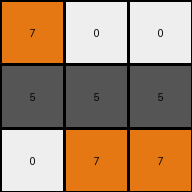

# 25d8a9c8 • 006 • refine_coder

---

Previous Code:
```python
"""
The transformation rule performs a color replacement based on the following mapping:

1. Yellow (4) in the input becomes gray (5) in the output.
2. Red (2) or Green (3) in the input becomes white (0) in the output.
3. Maroon (9) becomes gray (5).
4. Blue (1) remains blue (1).
5. Gray (6) becomes Gray (5)
6. Orange (7) remains orange (7).

"""

import numpy as np

def transform(input_grid):
    # Initialize the output grid with the same dimensions as the input grid.
    output_grid = np.copy(input_grid)

    # Iterate through each cell of the input grid.
    for i in range(input_grid.shape[0]):
        for j in range(input_grid.shape[1]):
            # Apply the color transformation rules.
            if input_grid[i, j] == 4:
                output_grid[i, j] = 5
            elif input_grid[i, j] == 2 or input_grid[i, j] == 3:
                output_grid[i, j] = 0
            elif input_grid[i,j] == 9:
                output_grid[i,j] = 5
            elif input_grid[i,j] == 6:
                output_grid[i,j] = 5


    return output_grid
```

Train Set Results:

## Example 1:

Input:
```
4 4 4
2 3 2
2 3 3
```
Expected Output:
```
5 5 5
0 0 0
0 0 0
```
Transformed Output:
```
5 5 5
0 0 0
0 0 0
```

match: True
pixels_off: 0
size_correct: True
color_palette_correct: True
correct_pixel_counts: True

## Example 2:

Input:
```
7 3 3
6 6 6
3 7 7
```
Expected Output:
```
0 0 0
5 5 5
0 0 0
```
Transformed Output:
```
7 0 0
5 5 5
0 7 7
```

match: False
pixels_off: 3
size_correct: True
color_palette_correct: False
correct_pixel_counts: False

## Example 3:

Input:
```
2 9 2
4 4 4
9 9 9
```
Expected Output:
```
0 0 0
5 5 5
5 5 5
```
Transformed Output:
```
0 5 0
5 5 5
5 5 5
```

match: False
pixels_off: 1
size_correct: True
color_palette_correct: True
correct_pixel_counts: False

## Example 4:

Input:
```
2 2 4
2 2 4
1 1 1
```
Expected Output:
```
0 0 0
0 0 0
5 5 5
```
Transformed Output:
```
0 0 5
0 0 5
1 1 1
```

match: False
pixels_off: 5
size_correct: True
color_palette_correct: False
correct_pixel_counts: False
Here's a breakdown of the results and a plan to refine the transformation logic:

**General Assessment:**

The initial natural language program and the resulting Python code were overly simplistic, capturing only a subset of the transformation rules. While it correctly handled Example 1, it failed on Examples 2, 3, and 4. The errors indicate that the color mapping needs to be revised, particularly regarding colors 7, 6, and 1. The strategy is to review all examples, identify all the color transformation rules, refine the natural language program, modify the code, and verify against all examples.

**Metrics and Observations:**
-Example 2:
-   Input: Orange (7) becomes white(0), Gray (6) becomes gray (5)
-   Error: Orange (7) incorrectly remains Orange, and the transformation of gray (6) to gray(5) is correct.

-Example 3:
    -Input: Maroon (9) correctly turns to Gray(5), Blue(1) remains unchanged
    -Error:Red(2) correctly becomes white(0), however, the first instance of maroon is incorrect.

-Example 4:
    -Input:Blue (1) remains unchanged.
    -Error:The transformation did not change blue(1) to gray(5).

**YAML Fact Block:**

```yaml
observations:
  - object: grid
    properties:
      - colors: [yellow, red, green, orange, gray, maroon, blue]
    transformations:
      - color_mapping:
          yellow: gray
          red: white
          green: white
          orange: white
          gray: gray
          maroon: gray
          blue: blue
```

**Natural Language Program:**

The transformation rule performs a color replacement based on the following mapping:

1.  Yellow (4) in the input becomes gray (5) in the output.
2.  Red (2) in the input becomes white (0) in the output.
3.  Green (3) in the input becomes white (0) in the output.
4.  Orange (7) in the input becomes white(0) in the output.
5.  Gray (6) becomes Gray (5).
6.  Maroon (9) becomes Gray(5).
7.  Blue(1) remains Blue(1).

**INSTRUCTIONS**

- generate a Python module to represent the natural language program 
- follow the template below
- all common math and science libraries are available
- create docstring only at top - but comment the workflow in the function
- use helper functions for common operations like finding objects, counting,
  measuring, moving, etc. 

remember - we are working iteratively - so this code will inform your future
self as we converge on the solution

*template:*

```python
"""
{{ natural language description of the transformation rule }}
"""

{{ imports }}

def transform(input_grid):
    # initialize output_grid

    # change output pixels 

    return output_grid

```
