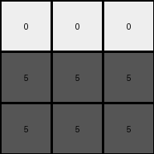

# 25d8a9c8 • 011 • refine_dreamer

---


Previous Code:
```python
"""
The output grid has the same dimensions as the input grid.
If the input grid has an odd number of rows, all cells at and below the middle row in the output grid become gray (value 5).
All other cells become white (value 0). If the input grid has an even number of rows, the behavior is undefined, but for now all become white.
"""

import numpy as np

def transform(input_grid):
    # Create an output grid with the same dimensions as the input, filled with zeros (white).
    output_grid = np.zeros_like(input_grid)
    
    # Get the number of rows in the grid.
    rows = input_grid.shape[0]
    
    # Calculate the index of the middle row.
    middle_row_index = rows // 2

    # Iterate through each cell of the input grid.
    for i in range(rows):
        for j in range(input_grid.shape[1]):
            # Check if the number of rows is odd.
            if rows % 2 != 0:
                # Check if the current row is at or below the middle row.
                if i >= middle_row_index:
                    # Set the corresponding cell in the output grid to 5 (gray).
                    output_grid[i, j] = 5
            # else leave as zero (white)
            
    return output_grid
```

Train Set Results:

## Example 1:

Input:
```
4 4 4
2 3 2
2 3 3
```
Expected Output:
```
5 5 5
0 0 0
0 0 0
```
Transformed Output:
```
0 0 0
5 5 5
5 5 5
```

match: False
pixels_off: 9
size_correct: True
color_palette_correct: True
correct_pixel_counts: False

## Example 2:

Input:
```
7 3 3
6 6 6
3 7 7
```
Expected Output:
```
0 0 0
5 5 5
0 0 0
```
Transformed Output:
```
0 0 0
5 5 5
5 5 5
```

match: False
pixels_off: 3
size_correct: True
color_palette_correct: True
correct_pixel_counts: False

## Example 3:

Input:
```
2 9 2
4 4 4
9 9 9
```
Expected Output:
```
0 0 0
5 5 5
5 5 5
```
Transformed Output:
```
0 0 0
5 5 5
5 5 5
```

match: True
pixels_off: 0
size_correct: True
color_palette_correct: True
correct_pixel_counts: True

## Example 4:

Input:
```
2 2 4
2 2 4
1 1 1
```
Expected Output:
```
0 0 0
0 0 0
5 5 5
```
Transformed Output:
```
0 0 0
5 5 5
5 5 5
```

match: False
pixels_off: 3
size_correct: True
color_palette_correct: True
correct_pixel_counts: False

**INSTRUCTIONS**

The code above was generated based on observations from the first training
example

we have tested the transform function on each of the task example inputs and
compared with the expected output

review each of the examples provided and the results and consider how the
natural language program should be updated to accommodate this new knowledge

respond with the following deliverables:

- general assessment of the information provided and strategy for resolving the
  errors
- gather metrics about each of the examples and results - use code_execution to
  develop accurate reports on your assumptions
- a YAML block documenting facts - Focus on identifying objects, their properties, and the actions performed on them.
- a natural language program - Be as clear and concise as possible, providing a complete description of the transformation rule.


your responses should be considered as information in a report - not a
conversation
